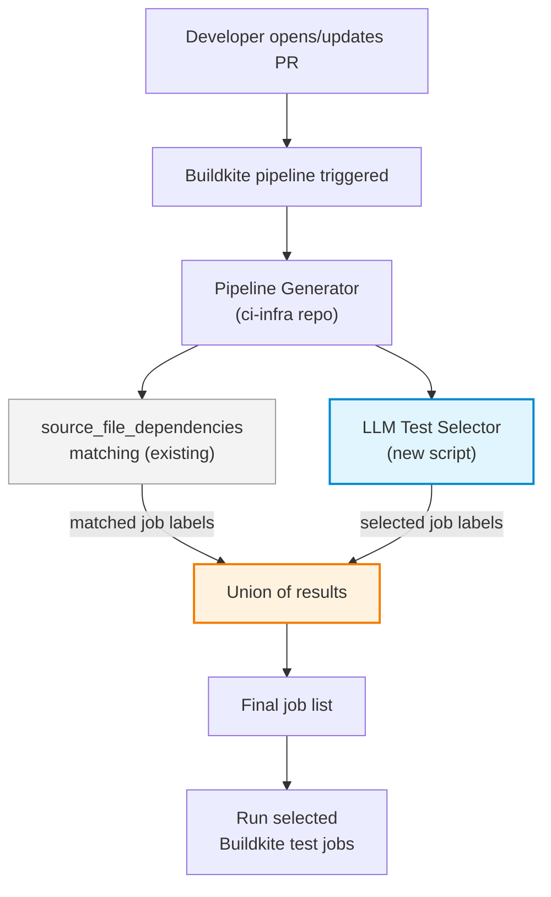
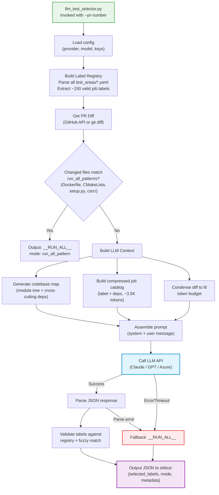
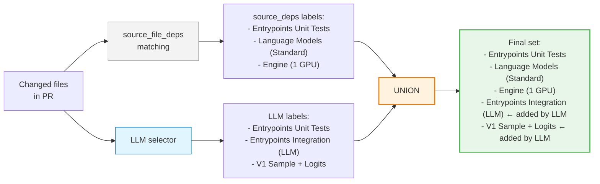
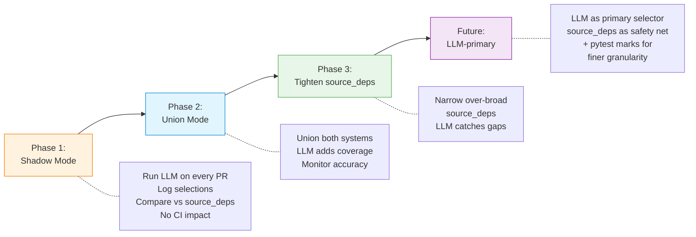

# LLM-Based Test Target Determination for vLLM CI

## 1. Problem Statement

### Current Approach

vLLM's CI pipeline uses **static `source_file_dependencies`** in 27 YAML files (`test_areas/*.yaml`) to decide which of the ~150 test jobs to run for a given PR. The external pipeline generator in `vllm-project/ci-infra` compares PR changed files against these path patterns using substring matching.

### Pain Points

| Problem | Impact |
|---------|--------|
| **Over-broad dependencies** — ~30 jobs list `vllm/` as a dependency, triggering on *any* source change | Wasted GPU compute on irrelevant tests; slower CI feedback loop |
| **No semantic understanding** — substring matching can't reason about what a change actually affects | A one-line fix in `vllm/config/model.py` triggers the same jobs as a rewrite of the config module |
| **Cross-cutting changes are blind spots** — changes to `vllm/utils/`, `vllm/config/`, `vllm/forward_context.py` have no intelligent mapping | Either runs too few tests (misses regressions) or too many (wastes resources) |
| **Manual maintenance burden** — every new test file, source module, or refactor requires updating YAML dependencies | Dependencies drift over time; new files silently get missed |
| **No learning or adaptation** — the system can't improve from past CI failures or test outcomes | Same mistakes repeat; no feedback loop |

### Example: A Small Change Triggers Everything

A PR that fixes a typo in `vllm/entrypoints/openai/serving_chat.py` currently triggers:
- All Entrypoints jobs (correct)
- All Models jobs (unnecessary -- they list `vllm/` as dependency)
- Engine, Misc, and many other groups (unnecessary)

This results in 50+ jobs when only 5-10 are relevant.

---

## 2. Proposed Solution

Add an **LLM-based test selector** that analyzes PR diffs semantically and determines which CI jobs to run. It augments (not replaces) the existing `source_file_dependencies` system.

### High-Level Architecture

```
.buildkite/scripts/
    llm_test_selector.py              # CLI entry point
    llm_test_selector/                # Python package
        config.py                     # Provider config (Claude/GPT, API keys)
        diff_parser.py                # PR diff retrieval
        codebase_map.py               # Codebase structure map generator
        context_builder.py            # Assemble LLM context within token budget
        label_registry.py             # Canonical job labels from test_areas/*.yaml
        prompt.py                     # Prompt templates
        llm_client.py                 # Provider-agnostic LLM client
        response_parser.py            # Parse + validate LLM JSON output
        fallback.py                   # Graceful degradation
    llm_test_selector_config.yaml     # Configuration
```

### Core Idea

The LLM receives three pieces of context:
1. **PR diff** — what changed
2. **Test job catalog** — compressed list of all ~150 job labels with their source dependencies
3. **Codebase structure map** — module layout and cross-cutting dependency hints

It returns a JSON list of job labels to run. The pipeline generator unions this with the existing `source_file_dependencies` result.

---

## 3. Flow Diagrams

### 3.1 End-to-End CI Flow



### 3.2 LLM Selector Internal Flow



### 3.3 Union Mode: How Both Systems Work Together



**Key property:** The LLM can only *add* jobs, never *remove* jobs that `source_file_dependencies` would select. This makes the rollout safe -- regressions from the existing system are impossible.

### 3.4 Rollout Strategy Flow



---

## 4. What the LLM Receives

The LLM gets a single prompt with three sections, carefully budgeted to fit within context windows (100K-200K tokens):

| Section | Content | Size |
|---------|---------|------|
| **Codebase map** | Module directory tree + cross-cutting dependency hints (e.g., "vllm/config/ affects ALL tests") + module-to-test-area affinity table | ~2K tokens |
| **Job catalog** | All ~150 labels with group name and source_deps, compressed to one line per label | ~3.5K tokens |
| **PR diff** | Changed file list + condensed unified diff (truncated intelligently for large PRs) | 5K-80K tokens |

**Example compressed catalog entry:**
```
[Kernels]
- "Kernels Core Operation Test"     | deps: csrc/, tests/kernels/core
- "Kernels Attention Test %N"       | deps: csrc/attention/, vllm/v1/attention
- "Kernels MoE Test %N"            | deps: csrc/moe/, vllm/model_executor/layers/fused_moe/
```

**LLM output format** (strict JSON):
```json
{"selected_labels": ["Kernels Attention Test %N", "V1 attention (H100)", "Basic Correctness"]}
```

Labels are validated against the canonical registry parsed from YAMLs. Invalid labels are fuzzy-matched; any remaining mismatches are logged as warnings.

---

## 5. Key Design Decisions

| Decision | Rationale |
|----------|-----------|
| **Augment, don't replace** (union mode) | LLM can only add coverage, never reduce it. Safe rollout with zero regression risk. |
| **Provider-agnostic** (Claude / GPT / Azure) | Avoids vendor lock-in. Config-driven switching via YAML + env vars. |
| **Compressed catalog, not raw YAML** | 82KB of raw YAML = ~20K tokens. Compressed = ~3.5K tokens. 5x savings while preserving label names and dependency info. |
| **Fail-safe to run-all** | Any LLM failure (timeout, API error, parse error) falls back to running all tests. Safety over efficiency. |
| **Script in vllm repo, not ci-infra** | Domain knowledge (codebase map, dependency hints) belongs with the source code. ci-infra just calls the script. |
| **JSON output to stdout** | Clean integration interface. Any pipeline generator can consume it. Exit code 0 = success; `mode` field indicates LLM vs fallback. |
| **Temperature 0.0** | Maximize determinism. Same diff should produce same selections across runs. |

---

## 6. Cost and Risk Analysis

### Cost

| Scenario | Input Tokens | Output Tokens | Cost/PR (Claude Sonnet) |
|----------|-------------|---------------|-------------------------|
| Small PR (10 files) | ~15K | ~500 | ~$0.05 |
| Typical PR (30 files) | ~30K | ~500 | ~$0.10 |
| Large PR (100+ files) | ~80K | ~500 | ~$0.25 |
| **Daily estimate (100 PRs)** | | | **~$10-25** |

This is negligible compared to the GPU compute saved. A single unnecessary H100 job costs more than an entire day of LLM API calls.

### Risks and Mitigations

| Risk | Likelihood | Impact | Mitigation |
|------|-----------|--------|------------|
| LLM hallucinates invalid labels | Medium | Low | Label registry validation + fuzzy matching + fallback |
| LLM misses a critical test | Low | Medium | Union mode ensures source_deps still catches it |
| LLM API downtime | Low | Low | Fallback to run-all; CI is never blocked |
| LLM adds too many unnecessary tests | Medium | Low | Still better than current over-broad source_deps; tune prompt over time |
| LLM latency slows CI start | Low | Low | Run in parallel with image build; 60s timeout |
| API key compromise | Low | High | Keys in CI secrets manager only; never in config files |

---

## 7. Rollout Strategy

### Phase 1: Shadow Mode
- Run LLM selector on every PR, log output alongside existing source_deps results
- Compare selections: what does LLM catch that source_deps misses? What does it miss?
- No impact on actual CI jobs
- Duration: 1-2 weeks

### Phase 2: Active Union Mode
- Enable union mode: jobs selected by EITHER system run
- Monitor for any increase in test failures caught (positive signal) or CI time (acceptable tradeoff)
- Tune prompt based on Phase 1 data
- Duration: 2-4 weeks

### Phase 3: Tighten source_deps
- With LLM as a safety net, narrow over-broad `source_file_dependencies` (e.g., replace `vllm/` with specific subdirectories)
- Reduces unnecessary test runs from the static system
- LLM continues to provide intelligent cross-cutting coverage

### Phase 4 (Future): LLM-Primary Mode
- LLM becomes the primary selector; source_deps serves as a minimal safety net
- Optional: add pytest marks for finer-grained within-job selection (see Section 8)

---

## 8. Future Phase: Pytest Marks for Finer-Grained Selection

The LLM selector described above operates at the **job level** (~150 jobs). A future enhancement can add **test-level** selection using pytest marks.

### How it works

1. **Mark all ~676 test files** with functional marks (e.g., `@pytest.mark.attention`, `@pytest.mark.quantization`)
2. **Extend LLM output** to include per-job mark filter expressions:
   ```json
   {
     "selected_labels": ["Kernels Attention Test %N"],
     "mark_filters": {
       "Kernels Attention Test %N": "attention and flash_attn"
     }
   }
   ```
3. **Pipeline generator injects** `-m "expression"` into the pytest command for that job

### Why defer

- Job-level selection already delivers the primary value
- Marking 676 files is a large, merge-conflict-prone effort
- Requires changes to test_areas YAMLs and the pipeline generator
- The job-level system needs to be proven first

### Existing draft work (feature branch, not commited yet). Related work in https://github.com/vllm-project/vllm/pull/31031

- `.buildkite/PYTEST_MARKING_GUIDE.md` — 40+ mark definitions, usage guidelines
- `.buildkite/scripts/mark_tests.py` — automation script for suggesting/applying marks
- `.buildkite/PYTEST_MARKS_IMPLEMENTATION_SUMMARY.md` — rollout plan

---

## 9. Integration Interface

### CLI

```bash
# By PR number (fetches diff via GitHub API)
python .buildkite/scripts/llm_test_selector.py --pr-number 12345

# By git diff against base branch
python .buildkite/scripts/llm_test_selector.py --base-ref origin/main

# From a diff file
python .buildkite/scripts/llm_test_selector.py --diff-file changes.patch

# Shadow mode (log only, no stdout output for pipeline)
python .buildkite/scripts/llm_test_selector.py --pr-number 12345 --shadow
```

### Output Format

```json
{
  "selected_labels": ["Entrypoints Unit Tests", "V1 Sample + Logits"],
  "mode": "llm",
  "metadata": {
    "provider": "anthropic",
    "model": "claude-sonnet-4-20250514",
    "input_tokens": 28500,
    "output_tokens": 120,
    "latency_ms": 3200
  },
  "warnings": [],
  "invalid_labels": []
}
```

Special values:
- `"mode": "fallback"` — LLM call failed; labels may be `["__RUN_ALL__"]`
- `"mode": "run_all_pattern"` — PR matched `run_all_patterns`; labels are `["__RUN_ALL__"]`

### Integration in ci-infra

```python
source_dep_labels = match_source_deps(changed_files, configs)  # existing
llm_result = json.loads(subprocess.run([...], capture_output=True).stdout)

if "__RUN_ALL__" in llm_result["selected_labels"]:
    final_labels = all_labels
else:
    final_labels = source_dep_labels | set(llm_result["selected_labels"])
```

---

## 10. Open Questions for Discussion

1. **Model selection**: Should we default to a cheaper/faster model (Haiku / GPT-4o-mini) and only escalate to Sonnet for large or ambiguous diffs?
2. **Caching**: Should we cache LLM results for identical diffs (e.g., when a PR is rebased without content changes)?
3. **Feedback loop**: Should CI test outcomes (pass/fail) be fed back to improve the prompt or fine-tune the model over time?
4. **Opt-out mechanism**: Should PR authors be able to add a label (e.g., `ci:run-all` or `ci:skip-llm`) to override the LLM selector?
5. **Monitoring dashboard**: What metrics should we track? (LLM accuracy, cost per day, CI time savings, false negative rate)
