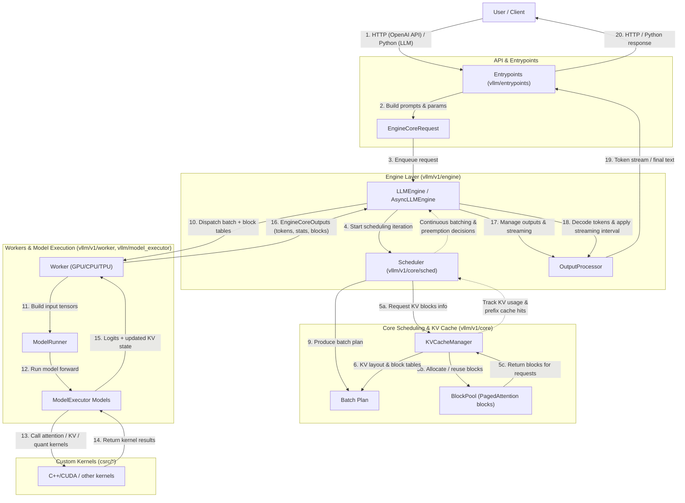

## vLLM Architecture & Code Navigation Guide

This document gives a **single, coherent overview** of vLLM: what it does, how the core systems fit together, and how to find the most important pieces of code. It is intentionally higher-level and narrative, and complements the more detailed design docs under `docs/`.

---

## 1. Introduction: What vLLM Does and Why It Matters

vLLM is a **high-performance inference and serving engine for large language models (LLMs)**. It focuses on:

- **Throughput**: Serving many concurrent requests efficiently via *continuous batching*.
- **Memory efficiency**: Using **PagedAttention** to manage KV (key-value) cache in fixed-size blocks, reducing fragmentation and enabling long-context use.
- **Ease of use**: Providing both a **Python API** (`LLM`) and an **OpenAI-compatible HTTP API server**.
- **Hardware and model breadth**: Supporting a wide variety of models (decoder-only, multimodal, Mamba, pooling) and hardware backends (NVIDIA, AMD, Intel, TPU, CPU, plus plugin accelerators).

vLLM V1, the current engine architecture, reuses proven kernels and utilities from earlier versions, while **re-architecting the core execution loop, scheduler, KV cache manager, and workers** to be simpler, more modular, and easier to extend.

For more background and motivation:

- High-level architecture overview: `docs/design/arch_overview.md`
- V1 user guide and changes from V0: `docs/usage/v1_guide.md`

---

## 2. Architecture Overview: High-Level System Design

At a high level, vLLM is organized into the following layers:

- **Entrypoints / APIs**: CLI, Python API (`LLM`), and OpenAI-compatible HTTP server.
- **Engine**: The **LLMEngine / AsyncLLMEngine** orchestrating request queues, scheduling, and interaction with workers.
- **Core (V1)**: Scheduler, KV cache manager, and block pool implementing continuous batching and PagedAttention.
- **Workers & Model Execution**: GPU/CPU/TPU workers running models and custom kernels.
- **Kernels & Extensions**: C++/CUDA/Triton-style kernels for attention, quantization, and other hot paths.

The following Mermaid diagram shows the **main data and control flows**, numbered in execution order:



**Key ideas**:

- The **engine** runs an internal loop that repeatedly asks the **scheduler** for what to run next.
- The **scheduler** uses KV cache usage, token budgets, and priorities to build a batch of tokens across many requests.
- **Workers** execute model forwards using **block tables** (which map sequence positions to KV cache blocks in GPU memory).
- The **output processor** streams or aggregates decoded tokens back to the client.

For a more detailed design discussion, see `docs/design/arch_overview.md` and `docs/design/paged_attention.md`.

---

## 3. Core Components: Deep Dives into Major Subsystems

This section focuses on the main subsystems you will typically interact with or need to understand when extending vLLM.

### 3.1 Entrypoints & APIs

- **Python API (`LLM`)**
  - File: `vllm/entrypoints/llm.py`
  - Provides an offline inference interface: construct an `LLM` object and call `.generate()` or `.encode()`.
  - Abstracts away engine configuration and model loading.
- **CLI & OpenAI-Compatible Server**
  - CLI entrypoint: `vllm/entrypoints/cli/main.py`
  - OpenAI server: `vllm/entrypoints/openai/api_server.py`
  - These translate HTTP or CLI invocations into **engine requests** with prompts, sampling parameters, and model configuration.

These components are mostly **stateless frontends** that:

1. Parse incoming user input.
2. Build `EngineCoreRequest`-compatible structures.
3. Pass them into the engine (synchronously for `LLM`, asynchronously for the API server).

### 3.2 Engine: LLMEngine and AsyncLLMEngine

- **Files**:
  - Legacy shim: `vllm/engine/llm_engine.py` (re-exports the V1 engine).
  - V1 engine: `vllm/v1/engine/llm_engine.py`, `vllm/v1/engine/async_llm.py`.
- **Responsibilities**:
  - Maintain request queues and internal engine state.
  - Repeatedly:
    - Collect ready requests.
    - Ask the **scheduler** for a batch plan.
    - Dispatch batches to **workers** (through the executor).
    - Feed **engine outputs** into the output processor for decoding/streaming.
  - Manage observability (metrics, tracing) via `vllm/v1/metrics`.

In V1, `LLMEngine` is designed to be **thin and orchestrational**:

- It delegates scheduling to the scheduler.
- It delegates KV cache logic to the KV cache manager.
- It delegates device execution to the executor and workers.

### 3.3 Scheduler and Continuous Batching

- **Files**:
  - Interface and implementation: `vllm/v1/core/sched/interface.py`, `vllm/v1/core/sched/scheduler.py`, `vllm/v1/core/sched/async_scheduler.py`.
  - Configuration: `vllm/config/scheduler.py`.
- **Concept**:
  - The scheduler works at the **iteration level**: each scheduling step corresponds to a single model forward (or micro-batch).
  - It outputs, conceptually, a mapping `{request_id: num_tokens}` indicating how many tokens each request should advance this step (covering both prompt and generation tokens).
  - This unifies:
    - Chunked prefills
    - Prefix caching reuse
    - Speculative decoding
    - Different scheduling policies (e.g., FCFS, priority-based)

The scheduler relies heavily on **KV cache usage** and **max token budgets** to decide which requests can be advanced without running out of memory or starving others.

### 3.4 KV Cache Manager, Block Pool, and PagedAttention

- **Files**:
  - KV cache manager: `vllm/v1/core/kv_cache_manager.py`
  - KV cache coordinator: `vllm/v1/core/kv_cache_coordinator.py`
  - Single-type KV managers: `vllm/v1/core/single_type_kv_cache_manager.py`
  - Block pool: `vllm/v1/core/block_pool.py`
  - PagedAttention kernels: `csrc/attention/` (CUDA/C++ implementations)
  - Design docs: `docs/design/paged_attention.md`, `docs/design/prefix_caching.md`, `docs/design/hybrid_kv_cache_manager.md`

**KVCacheManager**:

- Determines how many new KV blocks must be allocated for a scheduling step.
- Finds cache hits for prefix caching and speculative decoding.
- Builds **block tables** that map sequence positions to block IDs.

**BlockPool**:

- Owns a fixed number of `KVCacheBlock` objects representing contiguous slices of GPU memory.
- Manages:
  - Free block queues (with eviction order).
  - Mappings from block hashes to cached blocks for prefix reuse.
  - KV cache events when event logging is enabled.

**PagedAttention**:

- Attention kernels are written to **operate over block tables**, not contiguous KV memory.
- This allows the engine to treat KV cache as a set of **pages** (blocks) and remap sequences flexibly, enabling high utilization even with variable-length prompts and outputs.

### 3.5 Workers, Executors, and Model Execution

- **Files**:
  - Executors: `vllm/v1/executor/` (uniproc, multiproc, Ray-based, etc.).
  - Workers: `vllm/v1/worker/worker_base.py`, `vllm/v1/worker/gpu_worker.py`, `vllm/v1/worker/cpu_worker.py`, `vllm/v1/worker/tpu_worker.py`.
  - GPU model runner and helpers: `vllm/v1/worker/gpu/model_runner.py`, `vllm/v1/worker/gpu/input_batch.py`, `vllm/v1/worker/gpu/block_table.py`.
  - Model implementations: `vllm/model_executor/models/`.

**Execution pipeline**:

1. The engine (via an executor) calls into workers with a **batch plan** and block tables.
2. The worker builds device inputs (prompt token IDs, positions, attention masks, KV block tables).
3. The model runner executes the selected model (e.g., Llama, Mistral) using:
   - Custom attention kernels
   - Quantized matmuls
   - Optional CUDA graphs and other optimizations
4. Outputs (logits, next tokens, updated KV cache metadata) are sent back to the engine.

### 3.6 Plugins, Features, and Observability

- **Plugins & extensibility**:
  - Plugin system: `docs/design/plugin_system.md`
  - IO processor plugins, LoRA resolvers, etc.: `docs/design/io_processor_plugins.md`, `docs/design/lora_resolver_plugins.md`
  - Hardware plugins (e.g., Ascend, Spyre, Gaudi) live in separate repos but integrate through well-defined hooks.
- **Features**:
  - Quantization: `vllm/model_executor/layers/quantization/`, `docs/features/quantization/*`
  - LoRA: `vllm/lora/`, `docs/features/lora.md`
  - Structured output: `vllm/v1/structured_output/`, `docs/features/structured_outputs.md`
  - Speculative decoding: `vllm/v1/spec_decode/`, `docs/features/spec_decode.md`
- **Observability**:
  - Metrics, readers, and loggers: `vllm/v1/metrics/`, `docs/design/metrics.md`, `docs/usage/metrics.md`

---

## 4. Code Navigation Guide

This section is a **practical map** for exploring the codebase.

### 4.1 Start Here: High-Level Docs

- `README.md`: Project overview and links.
- `docs/design/arch_overview.md`: More detailed architecture overview, diagrams, and narrative.
- `docs/usage/v1_guide.md`: Differences between V0 and V1, feature status.
- `docs/features/*.md`: Deep dives into specific features like quantization, structured outputs, and spec decode.

### 4.2 Entrypoints and API Surface

- **Python API**:
  - `vllm/entrypoints/llm.py`: `LLM` class (offline inference).
- **CLI**:
  - `vllm/entrypoints/cli/main.py`: `vllm` CLI entrypoint.
  - `docs/cli/README.md`: CLI usage and subcommands.
- **OpenAI-compatible Server**:
  - `vllm/entrypoints/openai/api_server.py`: HTTP server.
  - `docs/serving/openai_compatible_server.md`: Configuration and usage.

### 4.3 Engine and Core

- **Engine (V1)**:
  - `vllm/v1/engine/llm_engine.py`: Main engine logic.
  - `vllm/v1/engine/async_llm.py`: Async wrapper used by the HTTP server.
  - `vllm/v1/engine/output_processor.py`: Streaming and output aggregation.
- **Scheduler & Core**:
  - `vllm/v1/core/sched/scheduler.py`: Default scheduler implementation.
  - `vllm/v1/core/sched/interface.py`: Scheduler interface.
  - `vllm/config/scheduler.py`: Scheduler configuration (`SchedulerConfig`).
- **KV Cache & PagedAttention**:
  - `vllm/v1/core/kv_cache_manager.py`: Coordinates KV cache groups and interactions with the block pool.
  - `vllm/v1/core/block_pool.py`: Manages KV blocks.
  - `csrc/attention/`: CUDA/C++ kernels for PagedAttention.
  - Design docs: `docs/design/paged_attention.md`, `docs/design/prefix_caching.md`.

### 4.4 Workers, Models, and Kernels

- **Workers & Executors**:
  - `vllm/v1/executor/`: Process topology and communication.
  - `vllm/v1/worker/`: Worker entrypoints and device-specific logic.
- **Model Executor**:
  - `vllm/model_executor/`: Model layers, quantization, rotary embeddings, etc.
  - `vllm/model_executor/models/`: Model wrappers for specific architectures.
- **Kernels (C++/CUDA)**:
  - `csrc/`: Custom operators and performance-critical code.
  - `cmake/`, `setup.py`, `pyproject.toml`: Build system integration.

### 4.5 Tests and Examples

- **Tests**:
  - `tests/engine/`, `tests/v1/`, `tests/models/`, etc.: Good reference for realistic usage and invariants.
- **Examples**:
  - `examples/`: End-to-end scripts for:
    - Simple generation
    - OpenAI-compatible API usage
    - Structured outputs, tool calling, quantization, and more.
  - `docs/examples/README.md`: Overview of example categories.

---

## 5. Examples and Use Cases

This section showcases a few **concrete usage patterns**, with references to where to find more.

### 5.1 Simple Offline Inference (Python API)

The simplest way to use vLLM is through the `LLM` class:

```python
from vllm import LLM, SamplingParams

prompts = [
    "Hello, my name is",
    "The capital of France is",
]

sampling_params = SamplingParams(temperature=0.8, top_p=0.95)

llm = LLM(model="facebook/opt-125m")
outputs = llm.generate(prompts, sampling_params)

for output in outputs:
    print("Prompt:", repr(output.prompt))
    print("Generation:", repr(output.outputs[0].text))
```

- This pattern is documented and elaborated in `docs/design/arch_overview.md` and the API docs under `docs/api/`.

### 5.2 Running the OpenAI-Compatible Server

You can start an HTTP server that speaks the OpenAI API:

```bash
vllm serve facebook/opt-125m
```

Then, from a client:

```python
import openai

openai.api_key = "EMPTY"
openai.base_url = "http://localhost:8000/v1/"

resp = openai.ChatCompletion.create(
    model="facebook/opt-125m",
    messages=[{"role": "user", "content": "Tell me a joke about GPUs."}],
)

print(resp.choices[0].message["content"])
```

See `docs/serving/openai_compatible_server.md` and `docs/deployment` for more deployment patterns (Kubernetes, NGINX, Ray, and others).

### 5.3 Structured Outputs and Tool Calling

vLLM supports **structured outputs** and **tool calling**, useful for building agents and applications requiring JSON or schema-constrained responses.

- Documentation:
  - `docs/features/structured_outputs.md`
  - `docs/features/tool_calling.md`
- Code:
  - Structured output manager: `vllm/v1/structured_output/`
  - Tool handling and parsing: `vllm/entrypoints/openai/tool_parsers/`

Typical flow:

1. Define a JSON schema or tool signature.
2. Pass it via the OpenAI-style API or vLLM-specific parameters.
3. Let vLLM enforce the structure during generation (via grammar/bitmasking backends).

### 5.4 Quantized and Specialized Models

vLLM can run many models under quantization schemes (INT4, INT8, FP8, GPTQ, AWQ, etc.).

- Docs: `docs/features/quantization/*`
- Code: `vllm/model_executor/layers/quantization/`, `csrc/quantization/`

Use cases:

- Reducing memory footprint to host larger models or more concurrent requests.
- Increasing throughput with minor quality trade-offs.

### 5.5 Multimodal and Mamba Models

vLLM supports multimodal models (e.g., LLaVA-style) and Mamba/Mamba2 hybrids.

- Docs:
  - `docs/features/multimodal_inputs.md`
  - `docs/usage/v1_guide.md` (feature tables)
- Code:
  - Multimodal processing: `vllm/multimodal/`, `vllm/v1/structured_output/` (for structured multimodal outputs).
  - Mamba-specific layers: `vllm/model_executor/layers/mamba/`, `vllm/v1/attention/backends/mamba_attn.py`.

---

## 6. Visual Aids: Diagrams, Tables, and Annotated Code

This section collects a few **visual and annotated references** to help build intuition.

### 6.1 End-to-End Flow Diagram

The Mermaid diagram in [Section 2](#2-architecture-overview-high-level-system-design) summarizes the typical lifecycle of a request:

- Request enters via **entrypoint**.
- Engine enqueues and repeatedly **schedules** it.
- Workers execute model forwards with **PagedAttention**.
- Output processor streams or returns final **tokens/text** to the client.

You can copy that diagram into any Mermaid-compatible viewer (or GitHub Markdown) for interactive inspection.

### 6.2 Feature and Component Tables

- For **V1 feature and hardware support status**, see the tables in `docs/usage/v1_guide.md`.
- For **configuration knobs**:
  - Engine and server arguments: `docs/configuration/engine_args.md`, `docs/configuration/serve_args.md`.
  - Environment variables: `docs/configuration/env_vars.md`.
- For **metrics and observability**:
  - `docs/usage/metrics.md`
  - `docs/design/metrics.md`

These tables are the authoritative source for current capabilities and constraints.

### 6.3 Annotated Code Reading Starting Points

When you want to understand how a feature works end to end, this pattern is often helpful:

1. **Find the user-facing surface** in `vllm/entrypoints/` or `examples/`.
2. **Trace into the engine** (`vllm/v1/engine/llm_engine.py`) to see how the request is turned into an `EngineCoreRequest`.
3. **Find the scheduler / KV cache behavior** in `vllm/v1/core/sched/` and `vllm/v1/core/kv_cache_manager.py`.
4. **Inspect model and kernel wiring** under `vllm/model_executor/` and `csrc/`.
5. **Cross-check behavior** via tests in `tests/` and feature docs under `docs/features/`.

Following this path gives you both **high-level intent** (from docs and examples) and **low-level detail** (from engine, core, and kernels) without getting lost in the size of the codebase.

---

If you’re extending vLLM (e.g., adding a new model, feature, or backend), reading this document alongside:

- `docs/design/arch_overview.md`
- `docs/usage/v1_guide.md`
- The relevant `docs/features/*.md`

will give you a solid mental model for how your changes fit into the overall architecture.


