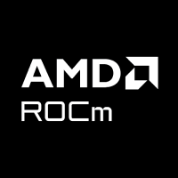
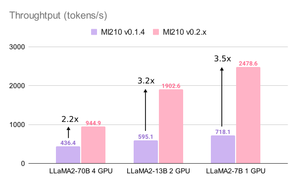
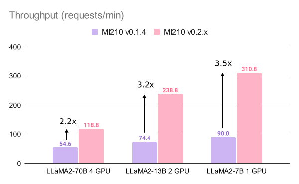

<p align="center">
  <picture>
    <source media="(prefers-color-scheme: dark)" srcset="docs/source/assets/logos/vllm-logo-text-dark.png">
    
  </picture>
  <picture>
    
  </picture>
</p>

<h1>
vLLM ROCm port
</h1>

This version of vLLM supports model inferencing and serving on AMD GPUs with ROCm. This ROCm port was adapted from [vLLM](https://github.com/vllm-project/vllm), a ROCm [community port](https://github.com/pcmoritz/vllm-public/tree/port-to-rocm) and [xformers](https://github.com/facebookresearch/xformers), replacing the attention forward method employed in xformers by the ROCm realization of [flash attention](https://github.com/ROCmSoftwarePlatform/flash-attention). Currently this port does not support AWQ quantization yet, but SqueezeLLM has been incorporated.

---

*Latest News*
- [2023/11] We have updated our ROCm port for vLLM v0.2.x.
- [2023/10] LLaMA-2 models are now supported. 7B/13B/70B models can be run and served on AMD GPUs!

---

## Getting Started

The following sections describes the installation of this ROCm port. If you intend to use our provided container, please skip to the [using docker](#using-docker) section.

## Dependencies

To build this project, the following pre-requisites must be met:

- [PyTorch](https://pytorch.org/) with ROCm (5.7.0 or later) support

- Install ROCm [flash-attention](https://github.com/ROCmSoftwarePlatform/flash-attention) following the instructions in [AMD ROCm Support](https://github.com/ROCmSoftwarePlatform/flash-attention#amd-gpurocm-support)

## Installation

Build the repository

```bash
git clone https://github.com/EmbeddedLLM/vllm-rocm.git
cd vllm-rocm/
python3 setup.py install
```

## Using Docker

A base docker image can be built from this repository:

```bash
docker build -t vllm-rocm .
```

Run a docker container with

```bash
docker run -it \
       --network=host \
       --group-add=video \
       --ipc=host \
       --cap-add=SYS_PTRACE \
       --security-opt seccomp=unconfined \
       --shm-size 8G \
       --device /dev/kfd \
       --device /dev/dri \
       vllm-rocm \
       bash
```

## Serving

The project supports native vLLM serving

```bash
python -m vllm.entrypoints.api_server \
    --model lmsys/vicuna-7b-v1.5 \
    --tensor-parallel-size 2
```

## Benchmarking

We benchmarked the inference throughput against our vLLM 0.1.4 port on various LLaMA2 models including LLaMA2-70B on 4 GPUs, LLaMA2-13B on 2 GPUs, and LLaMA2-7B on a single GPU. Our tests show that our vLLM 0.2.x port has > 2x speedup for LLaMA-70B, and > 3x for LLaMA-7B/13B compared with our previous 0.1.4 port.

<p align="center">
  <picture>
    
  </picture>
</p>

<p align="center">
  <picture>
    
  </picture>
</p>

The benchmark were obtained by running the vLLM benchmark scripts under the *benchmark* directory.

If your vLLM is installed using the provided [docker environment](#using-docker), you can benchmark the inferencing throughput following the steps below:
- Download the model you would like to evaluate to a directory of your choice (say a vicuna-7b model is downloaded to /path/to/your/model/vicuna-7b-v1.5)
- Run the docker and mount the model to /app/model

```bash
docker run -it \
       --network=host \
       --group-add=video \
       --ipc=host \
       --cap-add=SYS_PTRACE \
       --security-opt seccomp=unconfined \
       --shm-size 8G \
       --device /dev/kfd \
       --device /dev/dri \
       -v /path/to/your/model/vicuna-7b-v1.5:/app/model \
       vllm-rocm \
       bash
```
Inside the container, run
```bash
bash /app/benchmark_throughput.sh
```


## Acknowledgement

This ROCm port was built upon the following amazing projects:

- [vLLM](https://github.com/vllm-project/vllm) and [pcmoritz's ROCm fork](https://github.com/pcmoritz/vllm-public/tree/port-to-rocm)
- [flash-attention](https://github.com/ROCmSoftwarePlatform/flash-attention)
- [xformers](https://github.com/facebookresearch/xformers)
