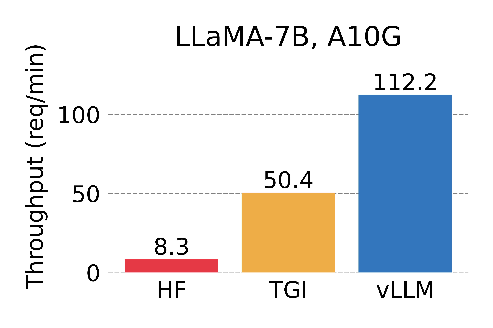
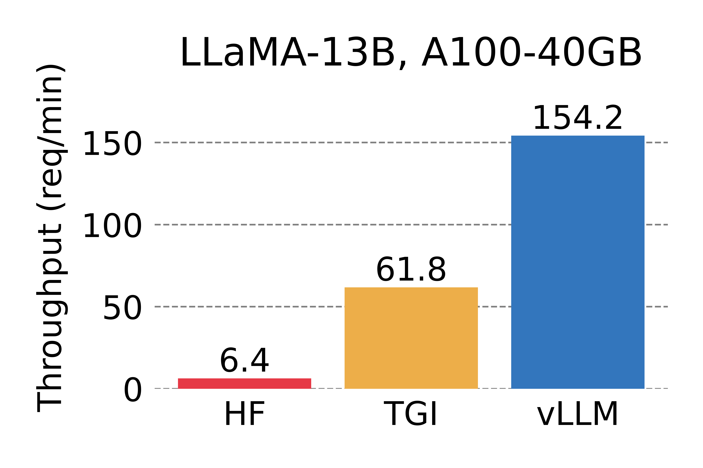
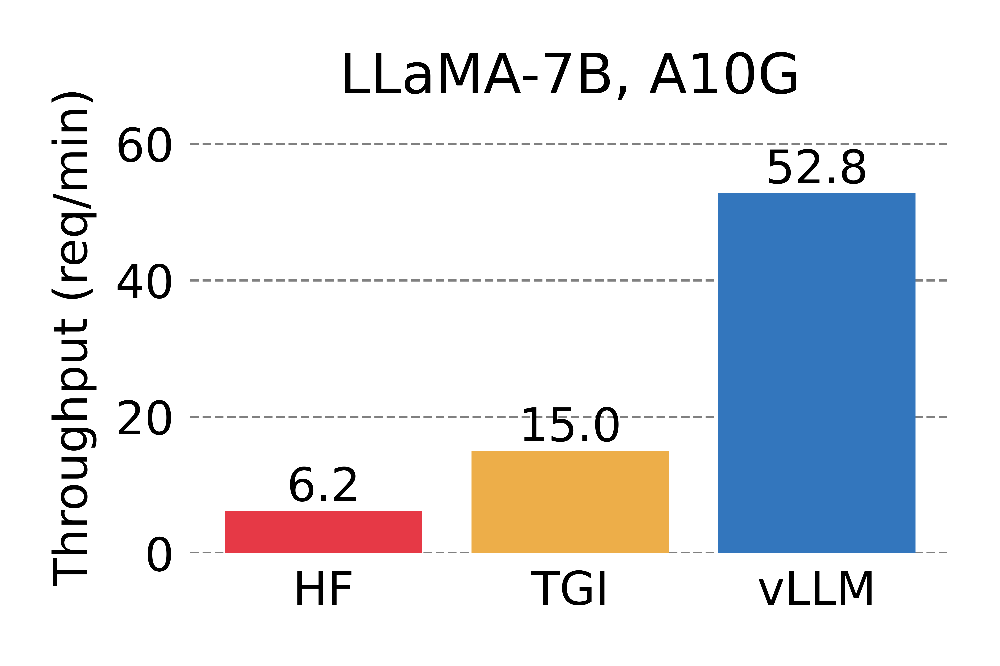
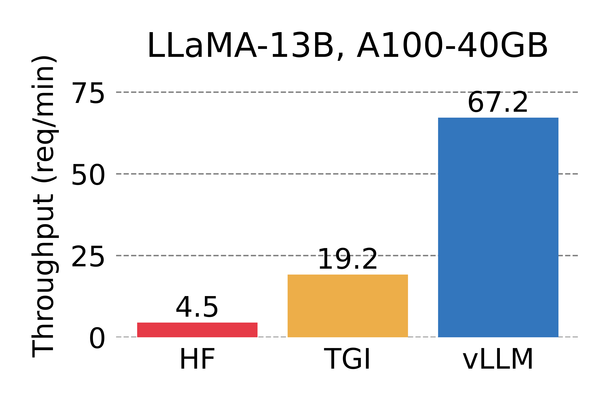

<p align="center">
  <picture>
    <source media="(prefers-color-scheme: dark)" srcset="./docs/source/assets/logos/vllm-logo-text-dark.png">
    
  </picture>
</p>

<h3 align="center">
Easy, fast, and cheap LLM serving for everyone
</h3>

<p align="center">
| <a href="https://vllm.readthedocs.io/en/latest/"><b>Documentation</b></a> | <a href=""><b>Blog</b></a> |

</p>

---

*Latest News* 🔥

- [2023/06] We officially released vLLM! vLLM has powered [LMSYS Vicuna and Chatbot Arena](https://chat.lmsys.org) since mid April. Check out our [blog post]().

---

vLLM is a fast and easy-to-use library for LLM inference and serving.

vLLM is fast with:

- State-of-the-art serving throughput
- Efficient management of attention key and value memory with **PagedAttention**
- Dynamic batching of incoming requests
- Optimized CUDA kernels

vLLM is flexible and easy to use with:

- Seamless integration with popular HuggingFace models
- High-throughput serving with various decoding algorithms, including *parallel sampling*, *beam search*, and more
- Tensor parallelism support for distributed inference
- Streaming outputs
- OpenAI-compatible API server

vLLM seamlessly supports many Huggingface models, including the following architectures:

- GPT-2 (e.g., `gpt2`, `gpt2-xl`, etc.)
- GPTNeoX (e.g., `EleutherAI/gpt-neox-20b`, `databricks/dolly-v2-12b`, `stabilityai/stablelm-tuned-alpha-7b`, etc.)
- LLaMA (e.g., `lmsys/vicuna-13b-v1.3`, `young-geng/koala`, `openlm-research/open_llama_13b`, etc.)
- OPT (e.g., `facebook/opt-66b`, `facebook/opt-iml-max-30b`, etc.)

Install vLLM with pip or [from source](https://vllm.readthedocs.io/en/latest/getting_started/installation.html#build-from-source):

```bash
pip install vllm
```

## Getting Started

Visit our [documentation](https://vllm.readthedocs.io/en/latest/) to get started.
- [Installation](https://vllm.readthedocs.io/en/latest/getting_started/installation.html)
- [Quickstart](https://vllm.readthedocs.io/en/latest/getting_started/quickstart.html)
- [Supported Models](https://vllm.readthedocs.io/en/latest/models/supported_models.html)

## Performance

vLLM outperforms HuggingFace Transformers (HF) by up to 24x and Text Generation Inference (TGI) by up to 3.5x, in terms of throughput.
For details, check out our [blog post]().

<p align="center">
  <picture>
  <source media="(prefers-color-scheme: dark)" srcset="./docs/source/assets/figures/perf_a10g_n1_dark.png">
  
  </picture>
  <picture>
  <source media="(prefers-color-scheme: dark)" srcset="./docs/source/assets/figures/perf_a100_n1_dark.png">
  
  </picture>
  <br>
  <em> Serving throughput when each request asks for 1 output completion. </em>
</p>

<p align="center">
  <picture>
  <source media="(prefers-color-scheme: dark)" srcset="./docs/source/assets/figures/perf_a10g_n3_dark.png">
  
  </picture>
  <picture>
  <source media="(prefers-color-scheme: dark)" srcset="./docs/source/assets/figures/perf_a100_n3_dark.png">
  
  </picture>  <br>
  <em> Serving throughput when each request asks for 3 output completions. </em>
</p>

## Contributing

We welcome and value any contributions and collaborations.
Please check out [CONTRIBUTING.md](./CONTRIBUTING.md) for how to get involved.
