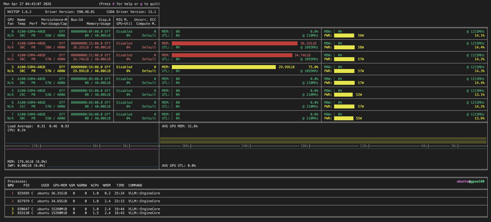

# vLLM MoE CPU Offload and GPU Expert Prefetch

This branch adds two independent MoE offload execution modes to vLLM:

```bash
--moe-cpu-offload
--moe-gpu-prefetch <num>
```

The original upstream vLLM README is preserved at [README.old](README.old).



## Flag Behavior

- Dense models ignore MoE offload flags and run normally.
- MoE models with `--moe-gpu-prefetch <num>` use Case 2.
- MoE models with `--moe-cpu-offload` use Case 1.
- If both flags are set, `--moe-gpu-prefetch <num>` wins and
  `--moe-cpu-offload` is ignored.

## Case 1: Passive CPU Offload

Flag:

```bash
--moe-cpu-offload
```

Summary:

- MoE models keep expert weights in CPU memory as the source of truth.
- Router path and KV cache stay on GPU.
- Active expert weights are passively copied from CPU to GPU only after router
  computation identifies the routed expert set.
- Active expert GPU copies are retired/freed after expert computation.
- Large MoE LLMs can run on smaller GPUs because inactive expert weights do not
  occupy GPU memory.
- Multiple large MoE LLM endpoints can share the same GPU more easily because
  each instance only stages active experts for compute.
- If the active expert set cannot fit as one group, execution can be split into
  smaller passive waves.
- Before GPU expert transfer, free GPU memory is checked. If memory is
  insufficient, transfer waits 5 seconds and retries up to 10 times.

Compute flow:

1. Keep full expert weights in CPU memory.
2. Run router computation on GPU.
3. Identify active experts from router output.
4. Copy only needed active expert weights to GPU.
5. Compute the active expert bucket.
6. Free the GPU expert copy after computation.

This trades performance for memory capacity. Inference can be slower than full
GPU expert residency because active expert weights are copied from CPU memory to
GPU memory during execution.

## Case 2: GPU Active Expert Prefetch

Flag:

```bash
--moe-gpu-prefetch <num>
```

Summary:

- Full MoE weights remain CPU-backed.
- Router path, KV cache, and essential runtime structures stay on GPU.
- A bounded GPU active expert cache keeps a configured number of expert models
  resident.
- Runtime tracks the active model list, current working model list, and missing
  model list.
- Missing experts are loaded into the GPU cache and cold experts are evicted
  when cache capacity is reached.
- If `<num>` is smaller than the model config active expert count, vLLM uses an
  effective prefetch size of `ceil(active_expert_count * 1.5)`.
- Logs report Case 2 selection, requested/effective prefetch size, and
  rate-limited pager state including active, working, and missing expert lists.

This mode trades more GPU memory than passive offload for fewer repeated
CPU-to-GPU expert transfers when routed experts are reused.

## Example Validation

The local harness validated:

- dense/base vLLM compatibility with MoE flags ignored,
- one `gemma-4-26B-A4B-it` MoE model on one 40GB GPU,
- two `gemma-4-26B-A4B-it` MoE model instances sharing one 40GB GPU from
  separate vLLM endpoints,
- valid completion responses from all tested endpoints,
- Case 1 passive offload and Case 2 GPU prefetch harness paths.

## Useful Files

- [Original README](README.old)
- [Feature work area](dev/moe)
- [Feature changelog](dev/moe/CHANGELOG.md)
- [Design notes](dev/moe/DESIGN.md)
- [Test harness](dev/moe/Makefile)
