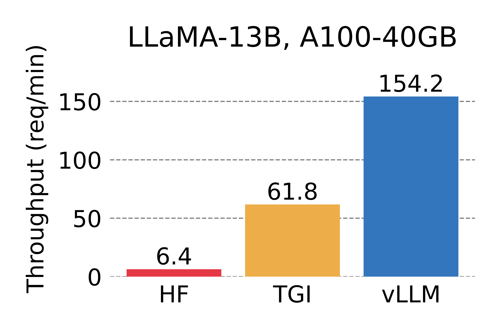

# vLLM: Easy, Fast, and Cheap LLM Serving for Everyone

| [**Documentation**](https://llm-serving-cacheflow.readthedocs-hosted.com/_/sharing/Cyo52MQgyoAWRQ79XA4iA2k8euwzzmjY?next=/en/latest/) | [**Blog**]() |

vLLM is a fast and easy-to-use library for LLM inference and serving.

## Latest News 🔥

- [2023/06] We officially released vLLM! vLLM has powered [LMSYS Vicuna and Chatbot Arena](https://chat.lmsys.org) since mid April. Check out our [blog post]().

## Getting Started

Visit our [documentation](https://llm-serving-cacheflow.readthedocs-hosted.com/_/sharing/Cyo52MQgyoAWRQ79XA4iA2k8euwzzmjY?next=/en/latest/) to get started.
- [Installation](https://llm-serving-cacheflow.readthedocs-hosted.com/_/sharing/Cyo52MQgyoAWRQ79XA4iA2k8euwzzmjY?next=/en/latest/getting_started/installation.html): `pip install vllm`
- [Quickstart](https://llm-serving-cacheflow.readthedocs-hosted.com/_/sharing/Cyo52MQgyoAWRQ79XA4iA2k8euwzzmjY?next=/en/latest/getting_started/quickstart.html)
- [Supported Models](https://llm-serving-cacheflow.readthedocs-hosted.com/_/sharing/Cyo52MQgyoAWRQ79XA4iA2k8euwzzmjY?next=/en/latest/models/supported_models.html)

## Key Features

vLLM comes with many powerful features that include:

- State-of-the-art performance in serving throughput
- Efficient management of attention key and value memory with **PagedAttention**
- Seamless integration with popular HuggingFace models
- Dynamic batching of incoming requests
- Optimized CUDA kernels
- High-throughput serving with various decoding algorithms, including *parallel sampling* and *beam search*
- Tensor parallelism support for distributed inference
- Streaming outputs
- OpenAI-compatible API server

## Performance

vLLM outperforms HuggingFace Transformers (HF) by up to 24x and Text Generation Inference (TGI) by up to 3.5x, in terms of throughput.
For details, check out our [blog post]().

  
  
   
  <em> Serving throughput when each request asks for 1 output completion. </em>

  
  
   
  <em> Serving throughput when each request asks for 3 output completions. </em>

## Contributing

We welcome and value any contributions and collaborations.
Please check out [CONTRIBUTING.md](./CONTRIBUTING.md) for how to get involved.
