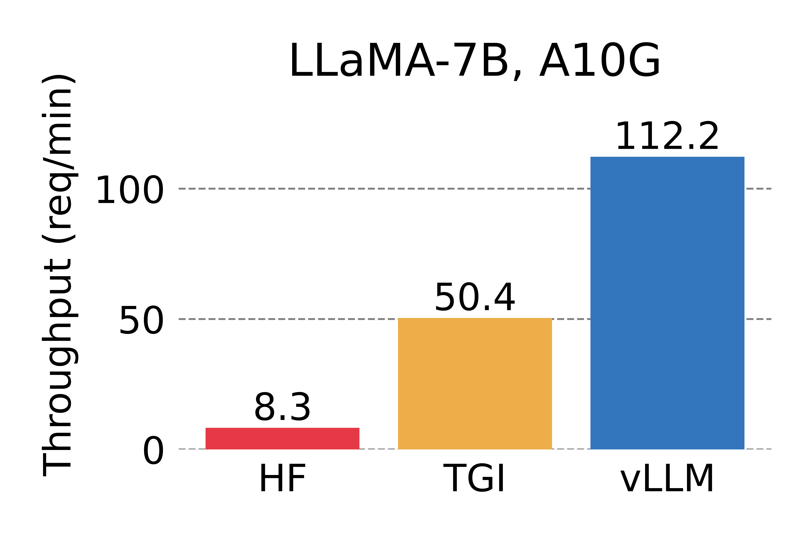

# vLLM: Easy, Fast, and Cheap LLM Serving for Everyone

| [**Documentation**](https://llm-serving-cacheflow.readthedocs-hosted.com/_/sharing/Cyo52MQgyoAWRQ79XA4iA2k8euwzzmjY?next=/en/latest/) | [**Blog**]() |

vLLM is a fast and easy-to-use library for LLM inference and serving.

## Latest News 🔥

- [2023/06] We officially released vLLM! vLLM has powered [LMSYS Vicuna and Chatbot Arena](https://chat.lmsys.org) since mid April. Check out our [blog post]().

## Getting Started

Visit our [documentation](https://llm-serving-cacheflow.readthedocs-hosted.com/_/sharing/Cyo52MQgyoAWRQ79XA4iA2k8euwzzmjY?next=/en/latest/) to get started.
- [Installation](https://llm-serving-cacheflow.readthedocs-hosted.com/_/sharing/Cyo52MQgyoAWRQ79XA4iA2k8euwzzmjY?next=/en/latest/getting_started/installation.html)
- [Quickstart](https://llm-serving-cacheflow.readthedocs-hosted.com/_/sharing/Cyo52MQgyoAWRQ79XA4iA2k8euwzzmjY?next=/en/latest/getting_started/quickstart.html)
- [Supported Models](https://llm-serving-cacheflow.readthedocs-hosted.com/_/sharing/Cyo52MQgyoAWRQ79XA4iA2k8euwzzmjY?next=/en/latest/models/supported_models.html)

## Key Features

vLLM comes with many powerful features that include:

- State-of-the-art performance in serving throughput
- Efficient management of cached attention keys and values with **PagedAttention**
- Seamless integration with popular HuggingFace models
- Advanced batching mechanism
- Optimized CUDA kernels
- Efficient support for various decoding algorithms such as parallel sampling and beam search
- Tensor parallelism support for multi-GPU inference
- Streaming outputs
- OpenAI-compatible API

## Performance

vLLM outperforms HuggingFace Transformers (HF) by up to 24x and Text Generation Inference (TGI) by up to 3.5x, in terms of throughput.
For a detailed explanation on this, check out our [blog post]().

| num_return_seqs | LLaMA-7B (A10G) | LLaMA-13B (A100) |
| :-------: | :------: | :----: |
| n = 1 |  |  |
| n = 3 |  |  |

## Contributing

We welcome any contributions and collaborations.
For guidance on how to contribute, please check out [CONTRIBUTING.md](./CONTRIBUTING.md).
