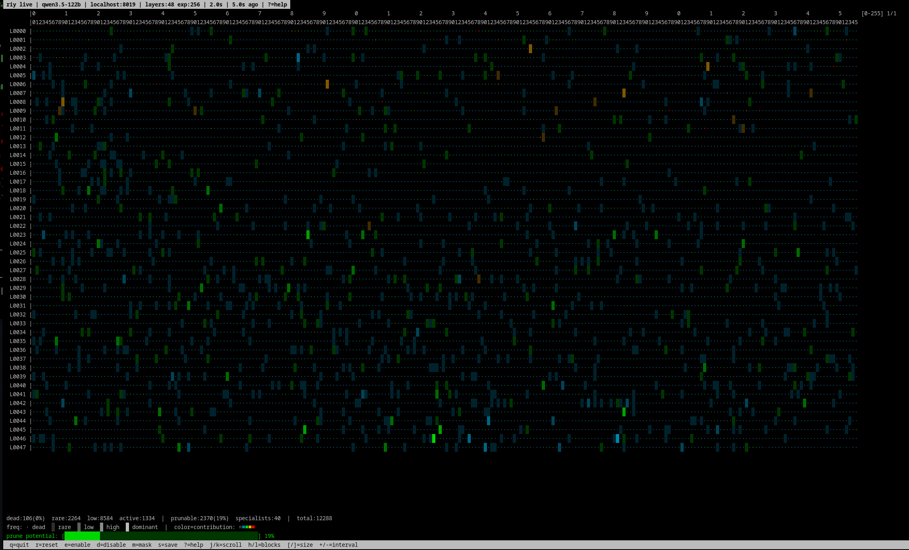

```
                    ██████╗ ██╗██╗   ██╗
                    ██╔══██╗██║╚██╗ ██╔╝
                    ██████╔╝██║ ╚████╔╝
                    ██╔══██╗██║  ╚██╔╝
                    ██║  ██║██║   ██║
                    ╚═╝  ╚═╝╚═╝   ╚═╝
          Runtime Expert Masking for MoE Models
                   ── Pruning on Air ──
```

# vllm rip-it-yourself

**See which experts your model actually uses. Mask the rest. No restart needed.**

RIY hooks into vLLM's MoE routing layer and gives you two things:

1. **Live statistics** — activation frequency and routing weight magnitude per `(layer, expert)`, collected on your actual workload
2. **Runtime masking** — deactivate experts via HTTP API, instantly reversible, no checkpoint modification

---

## Quick Start

```bash
# Start vLLM with any MoE model (the riy branch adds the hook automatically)
vllm serve Qwen/Qwen3.5-122B-A10B --trust-remote-code

# Start collecting stats
curl -X POST http://localhost:8019/riy/stats/start

# Run your workload, then check
curl http://localhost:8019/riy/stats | python3 -m json.tool

# Or use the live TUI
python3 tools/riy_live.py
```

```
  riy live | qwen3.5-122b | localhost:8019 | layers:48 exp:256 | 2.0s | ?=help
          |0    0    0    0    0    0    0    0    1    1    1    1    1
          |0    1    2    3    4    5    6    7    8    9    0    1    2
  L0001   |▓░▓█░░▒░░·░░▒░·░░░░░▒·░░░░·░░·░░░░▒░░··░░░░··░░░░░▓░··░░
  L0002   |█▒▓▓░░▒░░·░░▒░░░░░░░▒·░░░░·░░·░░░░▒░░··░░░░··░░░░░▓░··░░
  L0003   |▓░▓█░░▒░░·░░░░·░░░░░░·░░░░·░░·░░░░▒░░··░░░░··░░░░░▒░··░░
  L0004   |▓▒▒▓░░▒░░·░░▒░·░░░░░▒·░░░░·░░·░░░░░░░··░░░░··░░░░░▓░··░░
  ...
  dead:1840(15%)  rare:4211  low:3892  active:2345  |  prunable:6051(49%)  specialists:23
  freq: · dead  ░ rare  ▒ low  ▓ high  █ dominant  |  color=contribution: ■■■■■
  prune potential: [████████████████████████░░░░░░░░░░░░░░░░░░░░░░░] 49%
  q=quit  r=reset  p=prune  e=export  m=mask  s=save  d=stop  ?=help
```

---

## riy live — TUI Monitor



*riy live showing all 48 layers x 256 experts of Qwen3.5-122B-A10B (INT4 AutoRound)
on a single screen. Each character represents one expert. Fill density shows activation
frequency, color shows routing weight contribution (log scale). Summary statistics
at the bottom: 106 dead, 2264 rare, 19% prunable, 40 specialists.*

### Usage

```bash
python3 tools/riy_live.py                     # default: localhost:8019
python3 tools/riy_live.py --port 8019         # explicit RIY port
python3 tools/riy_live.py --vllm-port 8011    # vLLM API port (for model name)
python3 tools/riy_live.py --demo              # synthetic data, no vLLM needed
```

### Display

Each character in the grid represents one expert in one layer:

| Symbol | Meaning |
|--------|---------|
| `·` | Dead — never activated |
| `░` | Rare — activated < 1% of max |
| `▒` | Low — activated 1-10% of max |
| `▓` | High — frequently activated |
| `█` | Dominant — most activated |
| `X` | Masked — pruned by current filter |

Color indicates routing weight magnitude (contribution):

| Color | Contribution |
|-------|-------------|
| Dark/dim | Negligible |
| Cyan | Low |
| Green | Medium |
| Orange | High |
| Red (bold) | Dominant |

Both scales are logarithmic — rare experts remain visible instead of
being crushed to zero by a few dominant ones.

### Keybindings

| Key | Action |
|-----|--------|
| `p` | **Prune** — enter target percentage (0-100%), computes mask from current stats, applies live to vLLM, shows estimated VRAM savings |
| `e` | **Export** — save current mask as `riy_filter.<timestamp>.json` |
| `r` | **Reset** — zero all stats counters |
| `s` | **Save** — dump raw stats to `riy_stats_export.json` |
| `m` | **Mask toggle** — show/hide X overlay for pruned experts |
| `d` | **Disable** — stop stats collection |
| `j`/`k` | Scroll layers up/down |
| `h`/`l` | Scroll expert blocks left/right |
| `+`/`-` | Increase/decrease refresh interval |
| `?` | Help screen |
| `q` | Quit |

### Summary Statistics

The bottom section shows:

```
dead:106(0%)  rare:2264  low:8584  active:1334  |  prunable:2370(19%)  specialists:40  |  total:12288
prunable: [██████████░░░░░░░░░░░░░░░░░░░░░░░░░░░░░░░░░░░] 19%  ACTIVE: 20% (2457 exp, ~3.2GB)
```

- **dead** — zero activations (safe to prune)
- **rare** — less than 1% of most active expert
- **low** — 1-10% of most active
- **active** — more than 10% of most active
- **prunable** — dead + rare (conservative prune candidates)
- **specialists** — rare frequency but high contribution (caution!)
- **ACTIVE** — current prune filter applied, with estimated VRAM savings

---

## Why

MoE models activate only a fraction of their experts per token. Many experts
are rarely or never called for a given workload — but they still consume VRAM.

Existing pruning tools (like Cerebras REAP) use generic benchmarks to decide
which experts to cut. **RIY lets you measure on your own workload and decide
yourself.**

| | Cerebras REAP | vllm-riy |
|--|--------------|---------|
| Calibration data | Generic benchmarks | Your workload |
| Output | Static pruned model | Profile JSON, model unchanged |
| Reversibility | No | Yes, any time |
| Quantization-dependent | Yes | No — same profile, any quant |
| Automatic decisions | Yes | No — operator decides |

---

## API

RIY runs a standalone HTTP server on port **8019** inside the vLLM engine process.

| Method | Path | Description |
|--------|------|-------------|
| `GET` | `/riy/health` | Status: enabled, collecting, layers, experts |
| `GET` | `/riy/stats` | Raw per-(layer, expert) frequency + weight sum |
| `POST` | `/riy/stats/start` | Start collecting |
| `POST` | `/riy/stats/stop` | Stop collecting |
| `POST` | `/riy/stats/reset` | Zero all counters |
| `GET` | `/riy/mask` | Current mask |
| `POST` | `/riy/mask` | Set mask: `{"pruned_experts": [[0,3],[4,7]]}` |
| `DELETE` | `/riy/mask` | Clear mask |
| `POST` | `/riy/profile/load` | Load from file: `{"path": "/data/profile.json"}` |

---

## Profile Format

```json
{
  "version": 1,
  "model": "Qwen3.5-397B-A17B",
  "workload": "municipal German administrative",
  "pruned_experts": [[0, 3], [0, 11], [4, 7], [12, 2]]
}
```

Profiles are quantization-agnostic. Same profile works on BF16, FP8, INT4.
Share them, version them, publish them on HuggingFace.

---

## Workflow

```
1.  Start model — fully loaded, no mask
2.  curl -X POST :8019/riy/stats/start
3.  curl -X POST :8019/riy/stats/reset    ← clean slate
4.  Run your actual workload
5.  curl :8019/riy/stats > stats.json      ← export raw data
6.  Analyze offline, build profile
7.  curl -X POST :8019/riy/mask -d @profile.json  ← apply live
8.  Observe quality — clear mask if degraded
9.  Satisfied → save profile, use --riy-expert-profile next start
```

---

## Expert Categories

| Frequency | Contribution | Assessment |
|-----------|-------------|------------|
| Never | — | Dead — safe to prune |
| Rare | Low | Candidate — prune |
| Rare | High | Specialist — workload dependent, caution |
| Frequent | Low | Redundant — candidate |
| Frequent | High | Essential — keep |

The TUI shows these as:
- **Fill** `·░▒▓█` = activation frequency (log scale)
- **Color** dark → cyan → green → orange → red = routing weight magnitude (log scale)

---

## Using Profiles — Your Personal REAP

The key insight: **profiling and serving are separate steps.**

### Step 1: Profile on the full model

You need the complete, unmodified model loaded in vLLM to collect accurate
routing statistics. This requires the full VRAM footprint — no savings yet.

```bash
# Load the full model (e.g. Qwen3.5-397B on 2x GPUs)
vllm serve Qwen/Qwen3.5-397B-A17B --tensor-parallel-size 2

# Collect stats on YOUR workload — not a generic benchmark
curl -X POST :8019/riy/stats/start
# ... run your actual traffic ...
# Use the TUI to set a prune level: press 'p', enter '35'
# Export: press 'e' → riy_filter.20260319_143022.json
```

The profile is a plain JSON list of `(layer, expert)` tuples. It does not
contain weights, activations, or any model data. Just indices.

### Step 2: Serve with the profile

Now anyone can load the **same unmodified model** with your profile.
Masked experts are zeroed at load time — they consume no useful VRAM
and the routing weights are renormalized around them.

```bash
vllm serve Qwen/Qwen3.5-397B-A17B \
  --riy-expert-profile riy_filter.20260319_143022.json
```

No model conversion. No re-quantization. No export step. The original
HuggingFace checkpoint is used as-is.

### What this means

- **You create your own REAP-equivalent profile** — calibrated on your
  actual workload, not generic benchmarks
- **Profiles are shareable.** A German law office, a Japanese game studio,
  and a medical research lab would each produce different profiles for the
  same model — and each would be optimal for their use case
- **Profiles are stackable with quantization.** Profile a BF16 model,
  then apply the same profile to an INT4 AutoRound or FP8 version.
  The expert indices don't change across quantization formats
- **No vendor lock-in.** Profiles work on any vLLM installation with
  the RIY patch. The model on HuggingFace stays untouched

### Community profiles

Publish profiles on HuggingFace for others to use:

```
flash7777/riy-profiles/
  Qwen3.5-397B-A17B/
    german-administrative-35pct.json
    general-coding-20pct.json
    japanese-customer-support-40pct.json
```

Each profile documents its workload, prune percentage, and evaluation results.
Users pick the profile that matches their use case — or create their own.

---

## Installation

This is a branch on a vLLM fork. Apply the patch to any vLLM image:

```bash
# Generate patch
cd vllm-riy && git diff main -- vllm/ > riy.patch

# Apply to running container
podman run --name patch -v riy.patch:/tmp/riy.patch:ro your-vllm-image \
  bash -c "cd /usr/local/lib/python3.12/dist-packages && patch -p1 < /tmp/riy.patch"
podman commit patch your-vllm-image-riy
```

Or use `--riy-expert-profile` CLI flag for load-time masking.

---

## Limitations

- **Profiling requires the full model.** To collect accurate routing statistics,
  you must load the complete unmodified model — no VRAM savings during this step.
  Once the profile is created, subsequent loads with `--riy-expert-profile` zero
  the pruned expert weights at load time, reducing effective VRAM usage. The
  profiling is a one-time cost; the savings are permanent.
- **`--enforce-eager` required for stats.** CUDA Graphs replay the captured
  graph without executing Python — the stats hook doesn't fire during replay.
  Masking works with CUDA Graphs; stats collection does not. Use `--enforce-eager`
  during the profiling phase, then switch back to CUDA Graphs for production
  serving with the profile applied.
- **Single-process stats.** Stats are collected in the EngineCore worker process
  and served via a separate HTTP server on port 8019.

---

## License

Same as vLLM — Apache 2.0.

Part of the [flash7777/vllm](https://github.com/flash7777/vllm) fork, branch `riy`.
