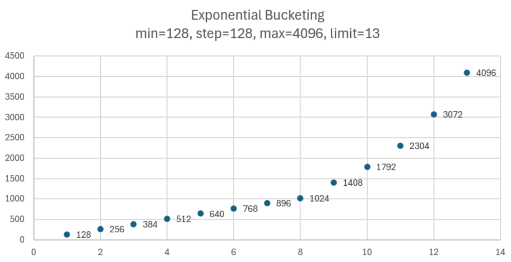

# vLLM with Intel® Gaudi® AI Accelerators

This README provides instructions on how to run vLLM with Intel Gaudi devices.

# Requirements and Installation

To set up the execution environment, please follow the instructions in the [Gaudi Installation Guide](https://docs.habana.ai/en/latest/Installation_Guide/index.html).
To achieve the best performance on HPU, please follow the methods outlined in the
[Optimizing Training Platform Guide](https://docs.habana.ai/en/latest/PyTorch/Model_Optimization_PyTorch/Optimization_in_Training_Platform.html).

## Requirements

- Python 3.10
- Intel Gaudi 2 and 3 AI accelerators
- Intel Gaudi software version 1.22.0 and above

## Running vLLM on Gaudi with Docker Compose
Starting with the 1.22 release, we are introducing ready-to-run container images that bundle vLLM and Gaudi software. Please follow the [instruction](https://github.com/HabanaAI/vllm-fork/tree/v0.9.0.1%2BGaudi-1.22.0/.cd) to quickly launch vLLM on Gaudi using a prebuilt Docker image and Docker Compose, with options for custom parameters and benchmarking.

## Quick Start Using Dockerfile
Set up the container with the latest Intel Gaudi Software Suite release using the Dockerfile.

### Ubuntu

```
$ docker build -f Dockerfile.hpu -t vllm-hpu-env  .
$ docker run -it --runtime=habana -e HABANA_VISIBLE_DEVICES=all -e OMPI_MCA_btl_vader_single_copy_mechanism=none --cap-add=sys_nice --net=host --rm vllm-hpu-env
```

> [!TIP]
> If you are facing the following error: `docker: Error response from daemon: Unknown runtime specified habana.`, please refer to the "Install Optional Packages" section
of [Install Driver and Software](https://docs.habana.ai/en/latest/Installation_Guide/Driver_Installation.html#install-driver-and-software) and "Configure Container
Runtime" section of [Docker Installation](https://docs.habana.ai/en/latest/Installation_Guide/Installation_Methods/Docker_Installation.html#configure-container-runtime).
Make sure you have ``habanalabs-container-runtime`` package installed and that ``habana`` container runtime is registered.

### Red Hat Enterprise Linux for Use with Red Hat OpenShift AI
> [!NOTE]
> Prerequisite:
Starting from the 1.22.x Intel Gaudi software version, the RHEL Docker image must be created manually before running the command.
Additionally, the path to the Docker image must be updated in the Dockerfile.hpu.ubi file.

```
$ docker build -f Dockerfile.hpu.ubi -t vllm-hpu-env  .
$ docker run -it --runtime=habana -e HABANA_VISIBLE_DEVICES=all -e OMPI_MCA_btl_vader_single_copy_mechanism=none --cap-add=sys_nice --net=host --rm vllm-hpu-env
```

## Build from Source

### Environment Verification
To verify that the Intel Gaudi software was correctly installed, run the following:

```{.console}
$ hl-smi # verify that hl-smi is in your PATH and each Gaudi accelerator is visible
$ apt list --installed | grep habana # verify that habanalabs-firmware-tools, habanalabs-graph, habanalabs-rdma-core, habanalabs-thunk and habanalabs-container-runtime are installed
$ pip list | grep habana # verify that habana-torch-plugin, habana-torch-dataloader, habana-pyhlml and habana-media-loader are installed
$ pip list | grep neural # verify that neural-compressor is installed
```

Refer to [System Verification and Final Tests](https://docs.habana.ai/en/latest/Installation_Guide/System_Verification_and_Final_Tests.html) for more details.

### Run Docker Image

It is highly recommended to use the latest Docker image from the Intel Gaudi vault.
Refer to the [Intel Gaudi documentation](https://docs.habana.ai/en/latest/Installation_Guide/Bare_Metal_Fresh_OS.html#pull-prebuilt-containers) for more details.

Use the following commands to run a Docker image. Make sure to update the versions below as listed in the [Support Matrix](https://docs.habana.ai/en/latest/Support_Matrix/Support_Matrix.html):

```{.console}
$ docker pull vault.habana.ai/gaudi-docker/1.22.0/ubuntu22.04/habanalabs/pytorch-installer-2.7.1:latest
$ docker run -it --runtime=habana -e HABANA_VISIBLE_DEVICES=all -e OMPI_MCA_btl_vader_single_copy_mechanism=none --cap-add=sys_nice --net=host --ipc=host vault.habana.ai/gaudi-docker/1.22.0/ubuntu22.04/habanalabs/pytorch-installer-2.7.1:latest
```

### Build and Install vLLM

Currently, multiple ways are provided which can be used to install vLLM with Intel® Gaudi®, pick **one** option:

#### 1. Build and Install the stable version

vLLM releases are being performed periodically to align with Intel® Gaudi® software releases. The stable version is released with a tag, and supports fully validated features and performance optimizations in Gaudi's [vLLM-fork](https://github.com/HabanaAI/vllm-fork). To install the stable release from [HabanaAI/vLLM-fork](https://github.com/HabanaAI/vllm-fork), run the following:

```{.console}
$ git clone https://github.com/HabanaAI/vllm-fork.git
$ cd vllm-fork
$ git checkout v0.9.0.1+Gaudi-1.22.0
$ pip install -r requirements-hpu.txt
$ python setup.py develop
```

#### 2. Build and Install the latest from vLLM-fork

Currently, the latest features and performance optimizations are being developed in Gaudi's [vLLM-fork](https://github.com/HabanaAI/vllm-fork) and periodically upstreamed to the vLLM main repository.
To install latest [HabanaAI/vLLM-fork](https://github.com/HabanaAI/vllm-fork), run the following:

```{.console}
$ git clone https://github.com/HabanaAI/vllm-fork.git
$ cd vllm-fork
$ git checkout habana_main
$ pip install --upgrade pip
$ pip install -r requirements-hpu.txt
$ python setup.py develop
```

#### 3. Build and Install from the vLLM main source

If you prefer to build and install directly from the main vLLM source, where periodically we are upstreaming new features, run the following:

```{.console}
$ git clone https://github.com/vllm-project/vllm.git
$ cd vllm
$ pip install -r requirements-hpu.txt
$ python setup.py develop
```

# Supported Features
| **Feature**   | **Description**   | **References**  |
|---    |---    |---    |
| Offline batched inference     | Offline inference using LLM class from vLLM Python API    | [Quickstart](https://docs.vllm.ai/en/stable/getting_started/quickstart.html#offline-batched-inference)<br>[Example](https://docs.vllm.ai/en/stable/getting_started/examples/offline_inference.html)   |
| Online inference via OpenAI-Compatible Server     | Online inference using HTTP server that implements OpenAI Chat and Completions API    | [Documentation](https://docs.vllm.ai/en/stable/serving/openai_compatible_server.html)<br>[Example](https://docs.vllm.ai/en/stable/getting_started/examples/openai_chat_completion_client.html)    |
| HPU autodetection     | HPU users do not need to specify the target platform, it will be detected automatically upon vLLM startup     | N/A   |
| Paged KV cache with algorithms enabled for Intel Gaudi accelerators   | vLLM HPU backend contains a custom Paged Attention and cache operators implementations optimized for Gaudi devices.   | N/A   |
| Custom Intel Gaudi operator implementations   | vLLM HPU backend provides optimized implementations of operators such as prefill attention, Root Mean Square Layer Normalization, Rotary Positional Encoding.     | N/A   |
| Tensor parallel inference (single or multi-node multi-HPU)     | vLLM HPU backend supports multi-HPU inference across multiple nodes with tensor parallelism with multiprocessing or Ray and HCCL.  | [Documentation](https://docs.vllm.ai/en/stable/serving/distributed_serving.html)<br>[Example](https://docs.ray.io/en/latest/serve/tutorials/vllm-example.html)<br>[HCCL reference](https://docs.habana.ai/en/latest/API_Reference_Guides/HCCL_APIs/index.html)    |
| Pipeline parallel inference (single or multi-node multi-HPU)   | vLLM HPU backend supports multi-HPU inference across single or multi-node with pipeline parallelism.   | [Documentation](https://docs.vllm.ai/en/stable/serving/distributed_serving.html)<br> [Running Pipeline Parallelism](https://github.com/HabanaAI/vllm-fork/blob/habana_main/README_GAUDI.md#pipeline-parallelism)   |
| Inference with HPU Graphs     | vLLM HPU backend uses HPU Graphs by default for optimal performance. When HPU Graphs are enabled, execution graphs will be recorded ahead of time and replayed later during inference, significantly reducing host overheads.  | [Documentation](https://docs.habana.ai/en/latest/PyTorch/Inference_on_PyTorch/Inference_Using_HPU_Graphs.html)<br>[vLLM HPU backend execution modes](https://docs.vllm.ai/en/stable/getting_started/gaudi-installation.html#execution-modes)<br>[Optimization guide](https://docs.vllm.ai/en/latest/getting_started/gaudi-installation.html#hpu-graph-capture)    |
| Inference with torch.compile   | vLLM HPU backend supports inference with `torch.compile` fully supports FP8 and BF16 precisions.    | [vLLM HPU backend execution modes](https://docs.vllm.ai/en/stable/getting_started/gaudi-installation.html#execution-modes)    |
| INC quantization  | vLLM HPU backend supports FP8 model and KV cache quantization and calibration with Intel Neural Compressor (INC).    | [Documentation](https://docs.habana.ai/en/latest/PyTorch/Inference_on_PyTorch/Inference_Using_FP8.html)   |
| AutoAWQ quantization | vLLM HPU backend supports inference with models quantized using AutoAWQ library. | [Library](https://github.com/casper-hansen/AutoAWQ) |
| AutoGPTQ quantization | vLLM HPU backend supports inference with models quantized using AutoGPTQ library. | [Library](https://github.com/AutoGPTQ/AutoGPTQ) |
| LoRA/MultiLoRA support    | vLLM HPU backend includes support for LoRA and MultiLoRA on supported models.     | [Documentation](https://docs.vllm.ai/en/stable/models/lora.html)<br>[Example](https://docs.vllm.ai/en/stable/getting_started/examples/multilora_inference.html)<br>[vLLM supported models](https://docs.vllm.ai/en/latest/models/supported_models.html)   |
| Multi-step scheduling support     | vLLM HPU backend includes multi-step scheduling support for host overhead reduction, configurable by standard `--num-scheduler-seqs` parameter.   | [Feature RFC](https://github.com/vllm-project/vllm/issues/6854)   |
| Automatic prefix caching   | vLLM HPU backend includes automatic prefix caching (APC) support for more efficient prefills, configurable by standard `--enable-prefix-caching` parameter. | [Documentation](https://docs.vllm.ai/en/stable/automatic_prefix_caching/apc.html)<br>[Details](https://docs.vllm.ai/en/stable/automatic_prefix_caching/details.html)  |
| Speculative decoding (functional release)     | vLLM HPU backend includes experimental speculative decoding support for improving inter-token latency in some scenarios, configurable via standard `--speculative_model` and `--num_speculative_tokens` parameters. (Not fully supported with torch.compile execution mode)   | [Documentation](https://docs.vllm.ai/en/stable/models/spec_decode.html)<br>[Example](https://docs.vllm.ai/en/stable/getting_started/examples/mlpspeculator.html)  |
| Multiprocessing backend   | Multiprocessing is the default distributed runtime in vLLM. The vLLM HPU backend supports it alongside Ray.   | [Documentation](https://docs.vllm.ai/en/latest/serving/distributed_serving.html)  |
| Multimodal   | vLLM HPU backend supports the inference for multi-modal models. (Not fully supported with t.compile execution mode) |  [Documentation](https://docs.vllm.ai/en/latest/serving/multimodal_inputs.html) |
| Multinode support   | vLLM HPU backend supports distributed, multiple-node inference with Ray.    | <REF>  |
| vLLM v1 architecture (early release)   | V1 architecture is now available for the HPU backend, and will gradually enable it for every use case we plan to support.   | [Documentation](https://docs.vllm.ai/en/latest/serving/distributed_serving.html) |
| Guided decode   | vLLM HPU supports a guided decoding backend for generating structured outputs.   | [Documentation](https://docs.vllm.ai/en/latest/features/structured_outputs.html)  |
| Delayed Sampling  (experimental) | vLLM HPU supports delayed sampling scheduling for asynchronous execution, enabled by `VLLM_DELAYED_SAMPLING=true` environment variable.   | N/A |
| Exponential bucketing | vLLM HPU supports exponential bucketing spacing instead of linear to automate configuration of bucketing mechanism, enabled by default. It can be disabled via `VLLM_EXPONENTIAL_BUCKETING=false` environment variable.   | N/A |
| Torchrun offline inference | Enabled support for tensor-parallel inference with torchrun on Gaudi | N/A |

> [!NOTE]
> All specified features are also supported with the `--enforce-eager` flag.

# Unsupported Features

- Beam search
- Prefill chunking (mixed-batch inferencing)

# Validated Models and Configurations

The following configurations have been validated to function with Gaudi 2 or Gaudi 3 devices with random or greedy sampling. Configurations that are not listed may or may not work.

| **Model**   | **Tensor Parallelism [x HPU]**   | **Datatype**    | **Validated on**    |
|:---    |:---:    |:---:    |:---:  |
| [meta-llama/Meta-Llama-3-8B](https://huggingface.co/meta-llama/Meta-Llama-3-8B)     | 1, 2, 8    | BF16   | Gaudi 2, Gaudi 3|
| [meta-llama/Meta-Llama-3-8B-Instruct](https://huggingface.co/meta-llama/Meta-Llama-3-8B-Instruct)     | 1, 2, 8    | BF16    | Gaudi 2, Gaudi 3|
| [meta-llama/Meta-Llama-3-70B](https://huggingface.co/meta-llama/Meta-Llama-3-70B)     | 8    | BF16    |Gaudi 2, Gaudi 3|
| [meta-llama/Meta-Llama-3-70B-Instruct](https://huggingface.co/meta-llama/Meta-Llama-3-70B-Instruct)     | 8    | BF16    |Gaudi 2, Gaudi 3|
| [meta-llama/Meta-Llama-3.1-8B](https://huggingface.co/meta-llama/Meta-Llama-3.1-8B)     | 1    | BF16, FP8, INT4, FP16 (Gaudi 2)    | Gaudi 2, Gaudi 3|
| [meta-llama/Meta-Llama-3.1-8B-Instruct](https://huggingface.co/meta-llama/Meta-Llama-3.1-8B-Instruct)     | 1    | BF16, FP8    | Gaudi 2, Gaudi 3|
| [meta-llama/Meta-Llama-3.1-70B](https://huggingface.co/meta-llama/Meta-Llama-3.1-70B)    | 2, 4, 8    | BF16, FP8, INT4   |Gaudi 2, Gaudi 3|
| [meta-llama/Meta-Llama-3.1-70B-Instruct](https://huggingface.co/meta-llama/Meta-Llama-3.1-70B-Instruct)     | 2, 4, 8    | BF16, FP8, FP16 (Gaudi 2)    |Gaudi 2, Gaudi 3|
| [meta-llama/Meta-Llama-3.1-405B](https://huggingface.co/meta-llama/Meta-Llama-3.1-405B)     | 8    | BF16, FP8    |Gaudi 3|
| [meta-llama/Meta-Llama-3.1-405B-Instruct](https://huggingface.co/meta-llama/Meta-Llama-3.1-405B-Instruct)     | 8    | BF16, FP8    |Gaudi 3|
| [meta-llama/Llama-3.2-11B-Vision](https://huggingface.co/meta-llama/Llama-3.2-11B-Vision)     | 1    | BF16, FP8    | Gaudi 2, Gaudi 3|
| [meta-llama/Llama-3.2-90B-Vision](https://huggingface.co/meta-llama/Llama-3.2-90B-Vision)     | 4, 8 (min. for Gaudi 2)    | BF16, FP8    | Gaudi 2, Gaudi 3|
| [meta-llama/Llama-3.2-90B-Vision-Instruct](https://huggingface.co/meta-llama/Llama-3.2-90B-Vision-Instruct)     | 4, 8 (min. for Gaudi 2)    | BF16    | Gaudi 2, Gaudi 3 |
| [meta-llama/Meta-Llama-3.3-70B](https://huggingface.co/meta-llama/Llama-3.3-70B)     | 4  | BF16, FP8    | Gaudi 3|
| [meta-llama/Meta-Llama-4-Scout-17B-16E](https://huggingface.co/meta-llama/Llama-4-Scout-17B-16E)     | 4, 8  | BF16, FP8    | Gaudi 3|
| [meta-llama/Meta-Llama-4-Maverick-17Bx128E](https://huggingface.co/meta-llama/Llama-4-maverick-17B-128E)     | 8  | BF16, FP8    | Gaudi 3|
| [meta-llama/Granite-3B-code-instruct-128k](https://huggingface.co/ibm-granite/granite-3b-code-instruct-128k)     | 1  | BF16    | Gaudi 3|
| [meta-llama/Granite-3.0-8B-instruct](https://huggingface.co/ibm-granite/granite-3.0-8b-instruct)     | 1  | BF16, FP8    | Gaudi 2, Gaudi 3|
| [meta-llama/Granite-20B-code-instruct-8k](https://huggingface.co/ibm-granite/granite-20b-code-instruct-8k)     | 1  | BF16, FP8    | Gaudi 2, Gaudi 3|
| [meta-llama/Granite-34B-code-instruc-8k](https://huggingface.co/ibm-granite/granite-34b-code-instruct-8k)     | 1  | BF16    | Gaudi 3|
| [mistralai/Mistral-Large-Instruct-2407](https://huggingface.co/mistralai/Mistral-Large-Instruct-2407)     | 1, 4    | BF16    | Gaudi 3|
| [mistralai/Mistral-7B-Instruct-v0.3](https://huggingface.co/mistralai/Mistral-7B-Instruct-v0.3)     | 1, 2    | BF16    | Gaudi 2|
| [mistralai/Mixtral-8x7B-Instruct-v0.1](https://huggingface.co/mistralai/Mixtral-8x7B-v0.1)     | 2    | FP8, BF16    |Gaudi 2, Gaudi 3|
| [llava-hf/llava-1.5-7b-hf](https://huggingface.co/llava-hf/llava-1.5-7b-hf)     | 1, 8    | BF16    | Gaudi 2, Gaudi 3 |
| [Qwen/Qwen2-72B-Instruct](https://huggingface.co/Qwen/Qwen2-72B-Instruct)     | 8    | BF16, FP8    |Gaudi 2, Gaudi 3|
| [Qwen/Qwen2.5-72B-Instruct](https://huggingface.co/Qwen/Qwen2.5-72B-Instruct)     | 8    | BF16, FP8    |Gaudi 2, Gaudi 3|
| [Qwen/Qwen2.5-VL-7B-Instruct](https://huggingface.co/Qwen/Qwen2.5-VL-7B-Instruct)     | 4    | BF16, FP8    |Gaudi 2, Gaudi 3|
| [Qwen/Qwen2.5-VL-72B-Instruct](https://huggingface.co/Qwen/Qwen2.5-VL-72B-Instruct)     | 4, 8    | BF16, FP8    |Gaudi 2, Gaudi 3|
| [Qwen/Qwen3-32B](https://huggingface.co/Qwen/Qwen3-32B)     | 8    | BF16    |Gaudi 3|
| [Qwen/Qwen3-30B-A3B](https://huggingface.co/Qwen/Qwen3-30B-A3B)     | 8    | BF16    |Gaudi 3|
| [meta-llama/CodeLlama-34b-Instruct-hf](https://huggingface.co/meta-llama/CodeLlama-34b-Instruct-hf)     | 1    | BF16    |Gaudi 3|
| [deepseek-ai/DeepSeek-R1](https://huggingface.co/deepseek-ai/DeepSeek-R1)<br> [quick start scripts](https://github.com/HabanaAI/vllm-fork/blob/deepseek_r1/scripts/DEEPSEEK_R1_ON_GAUDI.md)   | 8    | FP8, BF16    |Gaudi 2, Gaudi 3|

# Performance Tuning

## Execution Modes

Currently, vLLM for HPU supports four execution modes, determined by the selected HPU PyTorch Bridge backend (via the `PT_HPU_LAZY_MODE` environment variable) and the `--enforce-eager` flag.

| `PT_HPU_LAZY_MODE` | `enforce_eager` | Execution Mode     |
| ------------------ | --------------- | ------------------ |
| 0                  | 0               | torch.compile      |
| 0                  | 1               | PyTorch eager mode |
| 1                  | 0               | HPU Graphs         |
| 1                  | 1               | PyTorch lazy mode  |

> [!NOTE]
> Starting with the 1.21.0 Intel Gaudi software release, the `torch.compile` execution mode is the default for vLLM. HPU Graphs mode remains supported to ensure backward compatibility. Please verify the compatibility of the `torch.compile` mode with the information in the [Supported Features](https://github.com/HabanaAI/vllm-fork/blob/habana_main/README_GAUDI.md#supported-features) table.

> [!TIP]
> We recommend experimenting with the `PT_HPU_LAZY_MODE` environment variable to determine whether HPU Graphs or `torch.compile` mode performs better for your specific use case. While both modes generally deliver comparable performance, certain edge cases may favor one over the other.

## Bucketing Mechanism

Intel Gaudi accelerators perform best when operating on models with fixed tensor shapes. [Intel Gaudi Graph Compiler](https://docs.habana.ai/en/latest/Gaudi_Overview/Intel_Gaudi_Software_Suite.html#graph-compiler-and-runtime)
generates optimized binary code that implements the given model topology on Gaudi. In its default configuration, the produced binary code may be highly dependent on input and output tensor shapes, requiring graph recompilation
when encountering tensors with different shapes within the same topology. While these binaries efficiently utilize Gaudi, the compilation process itself can introduce noticeable overhead in end-to-end execution.
In dynamic inference serving scenarios, minimizing the number of graph compilations and reducing the risk of graph compilation occurring during server runtime is important. Currently, this is achieved by
"bucketing" the model's forward pass across three dimensions: `batch_size`, `query_length` (sequence length without context tokens) and `num_blocks` (context length counted in blocks).

> [!NOTE]
> Bucketing helps significantly reduce the number of required graphs, but does not handle graph compilation or device code generation. These tasks are performed during the warmup in HPUGraph capture phase.

Bucketing ranges are generated based on 4 parameters - `min`, `step`, `max` and `limit`, separately for the prompt and decode phase, and batch size and sequence length dimensions. These parameters can be observed in logs during vLLM startup:

```{.}
INFO 07-07 19:15:36 [exponential.py:36] Prompt bucket config (min, step, max_warmup, limit) bs:[1, 1, 4, 3], seq:[128, 128, 4096, 13]
INFO 07-07 19:15:36 [common.py:85] Generated 36 prompt buckets [bs, query, num_blocks]: [(1, 128, 0), (1, 256, 0), (1, 384, 0), (1, 512, 0), (1, 640, 0), (1, 768, 0), (1, 896, 0), (1, 1024, 0), (1, 1408, 0), (1, 1792, 0), (1, 2304, 0), (1, 3072, 0), (1, 4096, 0), (2, 128, 0), (2, 256, 0), (2, 384, 0), (2, 512, 0), (2, 640, 0), (2, 768, 0), (2, 896, 0), (2, 1024, 0), (2, 1408, 0), (2, 1792, 0), (2, 2304, 0), (2, 3072, 0), (2, 4096, 0), (4, 128, 0), (4, 256, 0), (4, 384, 0), (4, 512, 0), (4, 640, 0), (4, 768, 0), (4, 896, 0), (4, 1024, 0), (4, 1408, 0), (4, 1792, 0)]
INFO 07-07 19:15:36 [common.py:85] Generated 42 decode buckets [bs, query, num_blocks]: [(1, 1, 128), (1, 1, 256), (1, 1, 384), (1, 1, 512), (1, 1, 640), (1, 1, 768), (1, 1, 896), (1, 1, 1024), (1, 1, 1408), (1, 1, 1792), (1, 1, 2432), (1, 1, 3328), (1, 1, 4352), (1, 1, 5746), (2, 1, 128), (2, 1, 256), (2, 1, 384), (2, 1, 512), (2, 1, 640), (2, 1, 768), (2, 1, 896), (2, 1, 1024), (2, 1, 1408), (2, 1, 1792), (2, 1, 2432), (2, 1, 3328), (2, 1, 4352), (2, 1, 5746), (4, 1, 128), (4, 1, 256), (4, 1, 384), (4, 1, 512), (4, 1, 640), (4, 1, 768), (4, 1, 896), (4, 1, 1024), (4, 1, 1408), (4, 1, 1792), (4, 1, 2432), (4, 1, 3328), (4, 1, 4352), (4, 1, 5746)]
```

In the logged scenario, 36 buckets were generated for prompt (prefill) runs, and 42 buckets for decode runs. Each bucket corresponds to a separate optimized device binary for a given model with specified tensor
shapes. Whenever a batch of requests is processed, it is padded across batch and sequence length dimension to the smallest possible bucket.

Prompt bucktes can also be generated with context blocks while using Automatic Prefix Caching (default in vLLM V1). Example logs with Automatic Prefix Caching enabled using V1:

```{.}
INFO 07-07 19:27:37 [exponential.py:36] Prompt bucket config (min, step, max_warmup, limit) bs:[1, 1, 1, 1], seq:[128, 128, 1024, 11]
INFO 07-07 19:27:37 [common.py:85] Generated 36 prompt buckets [bs, query, num_blocks]: [(1, 128, 0), (1, 128, 1), (1, 128, 2), (1, 128, 3), (1, 128, 4), (1, 128, 5), (1, 128, 6), (1, 128, 7), (1, 256, 0), (1, 256, 1), (1, 256, 2), (1, 256, 3), (1, 256, 4), (1, 256, 5), (1, 256, 6), (1, 384, 0), (1, 384, 1), (1, 384, 2), (1, 384, 3), (1, 384, 4), (1, 384, 5), (1, 512, 0), (1, 512, 1), (1, 512, 2), (1, 512, 3), (1, 512, 4), (1, 640, 0), (1, 640, 1), (1, 640, 2), (1, 640, 3), (1, 768, 0), (1, 768, 1), (1, 768, 2), (1, 896, 0), (1, 896, 1), (1, 1024, 0)]
INFO 07-07 19:27:37 [common.py:85] Generated 42 decode buckets [bs, query, num_blocks]: [(1, 1, 128), (1, 1, 256), (1, 1, 384), (1, 1, 512), (1, 1, 640), (1, 1, 768), (1, 1, 896), (1, 1, 1024), (1, 1, 1408), (1, 1, 1792), (1, 1, 2432), (1, 1, 3328), (1, 1, 4352), (1, 1, 5888), (2, 1, 128), (2, 1, 256), (2, 1, 384), (2, 1, 512), (2, 1, 640), (2, 1, 768), (2, 1, 896), (2, 1, 1024), (2, 1, 1408), (2, 1, 1792), (2, 1, 2432), (2, 1, 3328), (2, 1, 4352), (2, 1, 5888), (4, 1, 128), (4, 1, 256), (4, 1, 384), (4, 1, 512), (4, 1, 640), (4, 1, 768), (4, 1, 896), (4, 1, 1024), (4, 1, 1408), (4, 1, 1792), (4, 1, 2432), (4, 1, 3328), (4, 1, 4352), (4, 1, 5888)]
```

> [!WARNING]
> If a request exceeds the maximum bucket size in any dimension, it will be processed without padding, and its processing may require a graph compilation, potentially significantly increasing end-to-end latency.
The boundaries of the buckets are user-configurable via environment variables, and upper bucket boundaries can be increased to avoid such scenario.

For example, if a request with 3 sequences, each having a maximum sequence length of 412, is sent to an idle vLLM server, it will be padded and executed as a `(4, 512, 0)` prefill bucket, WHERE 4=bs, 512 .... This is because the `batch_size`
(number of sequences) will be padded to 4 (the nearest batch size dimension higher than 3), and the maximum sequence length will be padded to 512 (the nearest sequence length dimension higher than 412). After the
prefill stage, it will be executed as a `(4, 1, 512)` decode bucket and will remain in this bucket until either the batch dimension changes (e.g., due to a request being completed), in which case it will become
a `(2, 1, 512)` bucket, or the context length increases beyond 512 tokens. It will become a `(4, 1, 640)` bucket at that point.

> [!NOTE]
> Bucketing is transparent to the user – padding in the sequence length dimension is never returned, and padding in the batch dimension does not create new requests.

### Exponential Strategy

Exponential strategy is the default warm-up mechanism. It is based on 4 parameters:
- `min`: the smallest value
- `step`: the rounding value for bucket boundaries
- `max`: the largest value
- `limit`: the number of buckets
> [!WARNING]
> These parameters are not configurable by the user.

The exponential bucketing strategy applies exponential spacing between buckets. The `min` and `max` values are always included in the warm-up, and the intermediate values are calculated using an exponent. The base remains unchanged. If duplicate values are generated, they are removed to ensure the warm-up process is as efficient as possible. All the values generated in this way, ranging from batch size and query length, will be warmed up with each other.

Example distribution is shown below:

```{.}
min = 128, step = 128, max = 4096, limit = 13
```



This strategy creates more buckets with smaller values closer to `min`. As the values increase toward `max`, the buckets become less frequent, meaning the distance between them gets larger. This helps prioritize warming up the smaller values more precisely, while still covering the full range.

### Linear Strategy

> [!NOTE]
> Starting from v1.22.0 Intel Gaudi Software release, Linear strategy is no longer the default warm-up mechanism.

Linear strategy is determined with 3 parameters only - `min`, `step` and `max`. They can be set separately for the prompt and decode phase, and batch size and sequence length dimensions, by user.

`min` determines the lowest value of the bucket. `step` determines the interval between buckets, and `max` determines the upper bound of the bucket. Furthermore, the interval between `min` and `step` has special handling: `min` is multiplied by consecutive powers of two until the multiplier is less than or equal to `step`. We refer to this as the ramp-up phase, which is used for handling lower batch sizes with minimal wastage, while allowing for larger padding on larger batch sizes.

**Example with ramp-up**

```{.}
min = 2, step = 32, max = 64
=> ramp_up = (2, 4, 8, 16)
=> stable = (32, 64)
=> buckets = ramp_up + stable => (2, 4, 8, 16, 32, 64)
```

**Example without ramp-up**

```{.}
min = 128, step = 128, max = 512
=> ramp_up = ()
=> stable = (128, 256, 384, 512)
=> buckets = ramp_up + stable => (128, 256, 384, 512)
```

## Warm-up

Warm-up is highly recommended step that occurs before the vLLM server starts listening to achieve the best performance results. It executes a forward pass for each bucket using dummy data. The goal is to pre-compile all graphs
and avoid any graph compilation overhead within bucket boundaries during server runtime. Each warm-up step is logged during vLLM startup.

This example uses the same buckets as those in the Bucketing Mechanism section. Each output line corresponds to the execution of a single bucket. When a bucket is executed for the first time, its graph
is compiled and can be reused later, avoiding further graph compilations.

```{.}
INFO 07-07 19:15:38 [hpu_model_runner.py:2679] [Warmup][Graph/prompt][1/36] batch_size:4 query_len:1792 num_blocks:0 free_mem:21.06 GiB
INFO 07-07 19:15:40 [hpu_model_runner.py:2679] [Warmup][Graph/prompt][2/36] batch_size:4 query_len:1408 num_blocks:0 free_mem:21.06 GiB
INFO 07-07 19:15:41 [hpu_model_runner.py:2679] [Warmup][Graph/prompt][3/36] batch_size:4 query_len:1024 num_blocks:0 free_mem:21.06 GiB
...
INFO 07-07 19:16:40 [hpu_model_runner.py:2679] [Warmup][Graph/prompt][35/36] batch_size:1 query_len:256 num_blocks:0 free_mem:21.06 GiB
INFO 07-07 19:16:42 [hpu_model_runner.py:2679] [Warmup][Graph/prompt][36/36] batch_size:1 query_len:128 num_blocks:0 free_mem:21.06 GiB
INFO 07-07 19:16:44 [hpu_model_runner.py:2679] [Warmup][Graph/decode][1/42] batch_size:4 query_len:1 num_blocks:5746 free_mem:21.06 GiB
INFO 07-07 19:16:46 [hpu_model_runner.py:2679] [Warmup][Graph/decode][2/42] batch_size:4 query_len:1 num_blocks:4352 free_mem:10.45 GiB
INFO 07-07 19:16:48 [hpu_model_runner.py:2679] [Warmup][Graph/decode][3/42] batch_size:4 query_len:1 num_blocks:3328 free_mem:10.45 GiB
...
INFO 07-07 19:18:28 [hpu_model_runner.py:2679] [Warmup][Graph/decode][41/42] batch_size:1 query_len:1 num_blocks:256 free_mem:10.45 GiB
INFO 07-07 19:18:31 [hpu_model_runner.py:2679] [Warmup][Graph/decode][42/42] batch_size:1 query_len:1 num_blocks:128 free_mem:10.45 GiB
```

> [!TIP]
> Compiling all the buckets may take some time and can be disabled by setting the `VLLM_SKIP_WARMUP=true` environment variable. Remember that if you do this, you may encounter graph compilations
when executing a given bucket for the first time.

> [!WARNING]
> Disabling warm-up is fine for development, but it is highly recommended to enable it in deployment.

## HPU Graph Capture

[HPU Graphs](https://docs.habana.ai/en/latest/PyTorch/Inference_on_PyTorch/Inference_Using_HPU_Graphs.html) are currently the most performant execution method of vLLM on Intel Gaudi. When HPU Graphs are enabled,
execution graphs will be traced (recorded) ahead of time (after performing warm-up), to be later replayed during inference, significantly reducing host overheads. Recording can take large amounts of memory, which
needs to be taken into account when allocating KV cache. Enabling HPU Graphs will impact the number of available KV cache blocks, but vLLM provides user-configurable variables to control memory management.

When HPU Graphs are used, they share the common memory pool ("usable memory") with the KV cache, as determined by the `gpu_memory_utilization` flag (default value is `0.9`). Before the KV cache is allocated,
the model weights are loaded onto the device, and a forward pass of the model is executed on dummy data to estimate memory usage. Only after that, the `gpu_memory_utilization` flag is applied. At its default value,
it marks 90% of the free device memory at that point as usable. Next, the KV cache is allocated, the model is warmed up, and HPU Graphs are captured. The `VLLM_GRAPH_RESERVED_MEM` environment variable defines
the ratio of memory reserved for HPU Graph capture. With its default value (`VLLM_GRAPH_RESERVED_MEM=0.1`), 10% of the usable memory will be reserved for graph capture (referred to as "usable graph memory"),
and the remaining 90% will be used for the KV cache.

> [!NOTE]
> `gpu_memory_utilization` does not represent the absolute memory usage across the HPU. Instead, it specifies the memory margin after loading the model and running a profile. For example, if a device has 100 GiB of
total memory and 50 GiB of free memory after loading the model weights and executing the profiling run, the default value of `gpu_memory_utilization` will mark 90% of the 50 GiB as usable, leaving 5 GiB as a margin,
regardless of the total device memory.

When many requests are pending, the vLLM scheduler attempts to fill the maximum batch size for decoding as quickly as possible. Once a request is finished, the decode batch size decreases.
When this happens, vLLM attempts to schedule a prefill iteration for requests in the waiting queue to restore the decode batch size to its previous state. In a fully loaded scenario, the decode
batch size is often at its maximum, making large-batch HPU graphs critical to capture. On the other hand prompt iterations will typically be executed with very low batch sizes (1-4).

## Recommended vLLM Parameters

- It is recommended to run inference on Gaudi 2 with `block_size` of 128 for BF16 data type. Using the default values (16, 32) may result in suboptimal performance due to underutilization of the Matrix
  Multiplication Engine (see [Gaudi Architecture](https://docs.habana.ai/en/latest/Gaudi_Overview/Gaudi_Architecture.html)).
- To achieve maximum throughput on Llama 7B, it is recommended to use a batch size of 128 or 256 and a maximum context length of 2048 with HPU Graphs enabled. If you experience out-of-memory issues,
  please refer to the Troubleshooting section below.

## Environment Variables

**Diagnostic and Profiling Knobs:**

- `VLLM_PROFILER_ENABLED`: if `true` - enables high-level profiler. Resulting JSON traces can be viewed at [perfetto.habana.ai](https://perfetto.habana.ai/#!/viewer). Disabled by default.
- `VLLM_HPU_LOG_STEP_GRAPH_COMPILATION`: if `true` - logs graph compilations for each vLLM engine step, but only if any compilation occurs. It is highly recommended to use this in conjunction with `PT_HPU_METRICS_GC_DETAILS=1`.
  Disabled by default.
- `VLLM_HPU_LOG_STEP_GRAPH_COMPILATION_ALL`: if `true` - logs graph compilations for every vLLM engine step, even if no compilation occurs. Disabled by default.
- `VLLM_HPU_LOG_STEP_CPU_FALLBACKS`: if `true` - logs CPU fallbacks for each vLLM engine step, but only if any fallback occurs. Disabled by default.
- `VLLM_HPU_LOG_STEP_CPU_FALLBACKS_ALL`: if `true` - logs CPU fallbacks for each vLLM engine step, even if no fallback occur. Disabled by default.
- `VLLM_T_COMPILE_FULLGRAPH`: if `true` - PyTorch compile function raises an error if any graph breaks happen during compilation. This allows for the easy detection of existing graph breaks, which usually reduce performance. Disabled by default.
- `VLLM_T_COMPILE_DYNAMIC_SHAPES`: if `true` - PyTorch compiles graph with dynamic options set to None. It causes using dynamic shapes when needed.
- `VLLM_FULL_WARMUP`: if `true` - PyTorch assumes that warm-up fully cover all possible tensor sizes and no compilation will occur afterwards. If compilation occurs after warmup, PyTorch will crash (with message like this: `Recompilation triggered with skip_guard_eval_unsafe stance. This usually means that you have not warmed up your model with enough inputs such that you can guarantee no more recompilations.`). If this happens, disable it. `false` by default.
- `VLLM_HPU_CONVERT_TO_FP8UZ` - Divides all the weights by 2 and multiplies scales by 2. This can be used to overcome limitations of Gaudi2 FP8 implementation for models that have checkpoint in FP8 (like Deepseek). More detailed explanation can be found [here](https://docs.habana.ai/en/latest/PyTorch/Reference/Debugging_Guide/Model_Troubleshooting.html?highlight=fnuz#using-torch-float8-e4m3fn-on-gaudi-2). Converting the model offline using script from vllm-hpu-extension is recommended.

<br/>**Performance Tuning Knobs:**

- `VLLM_GRAPH_RESERVED_MEM`: percentage of memory dedicated to HPUGraph capture. The default is `0.1`.
- `VLLM_EXPONENTIAL_BUCKETING`: if `true`, enables exponential bucket spacing instead of linear. The default is `true`.
- `VLLM_HANDLE_TOPK_DUPLICATES`: if ``true`` - handles duplicates outside top-k. The default is `false`.
- `VLLM_CONFIG_HIDDEN_LAYERS`: configures how many hidden layers to run in a HPUGraph for model splitting among hidden layers when TP is 1. It helps to improve throughput by reducing inter-token latency limitations in some models. The default is `1`.
- `VLLM_SKIP_WARMUP`: if `true`, warm-up is skipped. The default is `false`.

> [!TIP]
> When a deployed workload does not utilize the full context that a model can handle, it is good practice to limit the maximum values upfront based on the input and output token lengths that will be generated after serving the vLLM server.
<br><br>**Example:**<br>Let's assume that we want to deploy text generation model Qwen2.5-1.5B, which has a defined `max_position_embeddings` of 131072 (our `max_model_len`). At the same time, we know that our workload pattern will not use the full context length because we expect a maximum input token size of 1K and predict generating a maximum of 2K tokens as output. In this case, starting the vLLM server to be ready for the full context length is unnecessary. Instead, we should limit it upfront to achieve faster service preparation and decrease warm-up time. The recommended values in this example should be:
> - `--max-model-len`: `3072` - the sum of input and output sequences (1+2)*1024.  
> - `VLLM_PROMPT_SEQ_BUCKET_MAX`: `1024` - the maximum input token size that we expect to handle.

<br/>**Additional Performance Tuning Knobs - Linear Bucketing Strategy only:**
- `VLLM_{phase}_{dim}_BUCKET_{param}`: collection of 12 environment variables configuring ranges of bucketing mechanism (linear bucketing only).
  - `{phase}` is either `PROMPT` or `DECODE`
  - `{dim}` is either `BS`, `SEQ` or `BLOCK`
  - `{param}` is either `MIN`, `STEP` or `MAX`
  - Default values:
    - Prompt:

      - batch size min (`VLLM_PROMPT_BS_BUCKET_MIN`): `1`
      - batch size step (`VLLM_PROMPT_BS_BUCKET_STEP`): `min(max_num_seqs, 32)`
      - batch size max (`VLLM_PROMPT_BS_BUCKET_MAX`): `min(max_num_seqs, 64)`
      - sequence length min (`VLLM_PROMPT_SEQ_BUCKET_MIN`): `block_size`
      - sequence length step (`VLLM_PROMPT_SEQ_BUCKET_STEP`): `block_size`
      - sequence length max (`VLLM_PROMPT_SEQ_BUCKET_MAX`): `max_model_len`

    - Decode:

      - batch size min (`VLLM_DECODE_BS_BUCKET_MIN`): `1`
      - batch size step (`VLLM_DECODE_BS_BUCKET_STEP`): `min(max_num_seqs, 32)`
      - batch size max (`VLLM_DECODE_BS_BUCKET_MAX`): `max_num_seqs`
      - block size min (`VLLM_DECODE_BLOCK_BUCKET_MIN`): `block_size`
      - block size step (`VLLM_DECODE_BLOCK_BUCKET_STEP`): `block_size`
      - block size max (`VLLM_DECODE_BLOCK_BUCKET_MAX`): `max(128, (max_num_seqs*2048)/block_size)`
  - Recommended Values:
    - Prompt:

      - sequence length max (`VLLM_PROMPT_SEQ_BUCKET_MAX`): `input_tokens + output_tokens` rounded up to a multiple of `block_size` (especially recommended for models with high max_model_len)
    - Decode:

      - block size max (`VLLM_DECODE_BLOCK_BUCKET_MAX`): `max(128, (max_num_seqs*max_model_len/block_size)`

<br/>**HPU PyTorch Bridge Knobs:**

Additionally, there are HPU PyTorch Bridge environment variables impacting vLLM execution:

- `PT_HPU_LAZY_MODE`: if `0`, PyTorch Eager backend for Gaudi will be used. If `1`, PyTorch Lazy backend for Gaudi will be used. The default is `0`.

- `PT_HPU_ENABLE_LAZY_COLLECTIVES`: must be set to `true` for tensor parallel inference with HPU Graphs. The default is `true`.
- `PT_HPUGRAPH_DISABLE_TENSOR_CACHE`: must be set to `false` for Qwen and RoBERTa models. The default is `true`.
- `VLLM_PROMPT_USE_FLEX_ATTENTION`: enabled only for the Llama model, allowing usage of `torch.nn.attention.flex_attention` instead of FusedSDPA. Requires `VLLM_PROMPT_USE_FUSEDSDPA=0`. The default is `false`.

# Quantization, FP8 Inference and Model Calibration Process

> [!NOTE]
> Measurement files are required to run quantized models with vLLM on Gaudi accelerators. The FP8 model calibration procedure is described in detail in [docs.habana.ai vLLM Inference Section](https://docs.habana.ai/en/latest/PyTorch/vLLM_Inference/vLLM_FP8_Inference.html).
An end-to-end example tutorial for quantizing a BF16 Llama 3.1 model to FP8 and then inferencing is provided in this [Gaudi-tutorials repository](https://github.com/HabanaAI/Gaudi-tutorials/blob/main/PyTorch/vLLM_Tutorials/FP8_Quantization_using_INC/FP8_Quantization_using_INC.ipynb).

Once you have completed the model calibration process and collected the measurements, you can run FP8 inference with vLLM using the following command:

```bash
export QUANT_CONFIG=/path/to/quant/config/inc/meta-llama-3.1-405b-instruct/maxabs_quant_g3.json
vllm serve meta-llama/Llama-3.1-405B-Instruct --dtype bfloat16 --max-model-len  2048 --block-size 128 --max-num-seqs 32 --quantization inc --kv-cache-dtype fp8_inc --weights-load-device cpu --tensor-parallel-size 8
```

`QUANT_CONFIG` is an environment variable that points to the measurement or quantization configuration file. The measurement configuration file is used during the calibration procedure to collect
measurements for a given model. The quantization configuration is used during inference.

> [!TIP]
> If you are prototyping or testing your model with FP8, you can use the `VLLM_SKIP_WARMUP=true` environment variable to disable the warm-up stage, which is time-consuming.
However, disabling this feature in production environments is not recommended, as it can lead to a significant performance decrease.

> [!TIP]
> If you are benchmarking an FP8 model with `scale_format=const`, setting `VLLM_DISABLE_MARK_SCALES_AS_CONST=true` can help speed up the warm-up stage.

> [!TIP]
> When using FP8 models, you may experience timeouts caused by the long compilation time of FP8 operations. To mitigate this, set the following environment variables:
> - `VLLM_ENGINE_ITERATION_TIMEOUT_S` - to adjust the vLLM server timeout. You can set the value in seconds, e.g., 600 equals 10 minutes.
> - `VLLM_RPC_TIMEOUT` - to adjust the RPC protocol timeout used by the OpenAI-compatible API. This value is in microseconds, e.g., 600000 equals 10 minutes.

# Long Context Support

Long context feature enables support for a token context window exceeding 128K tokens. It is supported by the following models:
- [meta-llama/Llama-2-7b](https://huggingface.co/meta-llama/Llama-2-7b)
- [meta-llama/Llama-2-70b](https://huggingface.co/meta-llama/Llama-2-70b)
- [meta-llama/Meta-Llama-3-8B-Instruct](https://huggingface.co/meta-llama/Meta-Llama-3-8B-Instruct)
- [meta-llama/Meta-Llama-3.1-8B-Instruct](https://huggingface.co/meta-llama/Meta-Llama-3.1-8B-Instruct)
- [meta-llama/Meta-Llama-3-70B-Instruct](https://huggingface.co/meta-llama/Meta-Llama-3-70B-Instruct)
- [meta-llama/Meta-Llama-3.1-70B-Instruct](https://huggingface.co/meta-llama/Meta-Llama-3.1-70B-Instruct)

## Environment Variables Settings

Set the following environment variables to avoid OOM/functional issues.  Additional environment variable settings depend on context length:

- `VLLM_ENGINE_ITERATION_TIMEOUT_S=3600`
- `VLLM_RPC_TIMEOUT=100000`
- `VLLM_PROMPT_USE_FUSEDSDPA=1`
- `PT_HPU_ENABLE_LAZY_COLLECTIVES=true`
- `PT_HPUGRAPH_DISABLE_TENSOR_CACHE=1`
- `VLLM_ALLOW_LONG_MAX_MODEL_LEN=1`

**32K context length flags examples:**

- `VLLM_GRAPH_RESERVED_MEM`: The value depends on the model and context length settings. Use `VLLM_GRAPH_RESERVED_MEM=0.02` for Llama3.1-8B or `VLLM_GRAPH_RESERVED_MEM=0.1` for Llama3.1-70B.
- `VLLM_PROMPT_BS_BUCKET_MIN=1`: Suggested value, depends on the model. You can increase it until you reach an OOM error or decrease it if OOM occurs.
- `VLLM_PROMPT_BS_BUCKET_STEP=16`: Suggested value, depends on the model. Increasing the step value results in fewer buckets. If an OOM error occurs, the value should be increased.
- `VLLM_PROMPT_BS_BUCKET_MAX=16`: Suggested value, depends on the model.  You can increase it until you reach an OOM error or decrease it if OOM occurs.
- `VLLM_PROMPT_SEQ_BUCKET_MIN=24576`: Suggested value, depends on warmup results.
- `VLLM_PROMPT_SEQ_BUCKET_STEP=2048`: Suggested value, depends on warmup results. It is recommended to increase it to a higher value for faster warmup. `VLLM_PROMPT_SEQ_BUCKET_STEP=16384` - Suggested value for Intel Gaudi 3.
- `VLLM_PROMPT_SEQ_BUCKET_MAX=32768`: Value for context length of 32K. Use 16384 for 16K.
- `VLLM_DECODE_BLOCK_BUCKET_MIN=1024`: Suggested value, depends on warmup results.
- `VLLM_DECODE_BLOCK_BUCKET_STEP=1024`: Suggested value, depends on warmup results.
- `VLLM_DECODE_BLOCK_BUCKET_MAX=33792`: `max_num_seqs * max_decode_seq // self.block_size`, where `max_decode_seq` represents the sum of input and output sequences. For example:
  - `128 *((32 + 1)* 1024) / 128`
  - `32 *((32 + 1)* 1024) / 128`

## Batch Size Settings

The default `batch_size=256` is not optimal for long contexts (8K+). Recompilations may occur if there is not enough KV cache space for some sequence groups.

If recompilation or next recomputation warnings appear during inference, reduce `batch_size` to improve stability.

**Recompilation message example:**

```bash
Configuration: (prompt, 1, 36864) was not warmed-up!
```

**Warning message example:**

```bash
Sequence group cmpl-3cbf19b0c6d74b3f90b5d5db2ed2385e-0 is preempted by PreemptionMode.RECOMPUTE mode because there is not enough KV cache space. This can affect the end-to-end performance. Increase gpu_memory_utilization or tensor_parallel_size to provide more KV cache memory.
```

## Multi-Step Scheduling Feature Usage

Enabling Multi-Step Scheduling is recommended for better decode performance. Refer to vllm-project#6854 for more details.

# Pipeline Parallelism

Pipeline parallelism is a distributed model parallelization technique that splits the model vertically across its layers, distributing different parts of the model across multiple devices.
With this feature, when running a model that does not fit on a single node with tensor parallelism and requires a multi-node solution, we can split the model vertically across its layers and distribute the slices across available nodes.
For example, if we have two nodes, each with 8 HPUs, we no longer have to use `tensor_parallel_size=16` but can instead set `tensor_parallel_size=8` with pipeline_parallel_size=2.
Because pipeline parallelism runs a `pp_size` number of virtual engines on each device, we have to lower `max_num_seqs` accordingly, since it acts as a micro batch for each virtual engine.

## Running Pipeline Parallelism

The following example shows how to use Pipeline parallelism with vLLM on HPU:

```bash
vllm serve <model_path> --device hpu --tensor-parallel-size 8 --pipeline_parallel_size 2 --distributed-executor-backend ray
```

> [!NOTE]
> Currently, pipeline parallelism on Lazy mode requires the `PT_HPUGRAPH_DISABLE_TENSOR_CACHE=0` flag.

# Multi-node Support

vLLM works with a multi-node environment setup via Ray. To run models on multiple nodes, follow the procedure below.

## Prerequisites
Perform the following on all nodes:

- Install the latest [vllm-fork](https://github.com/HabanaAI/vllm-fork/blob/habana_main/README_GAUDI.md#build-and-install-vllm).

- Check if all Gaudi NIC ports are up by running:

> [!NOTE]
> Following commands should be run on the host and NOT inside the container.

```bash
cd /opt/habanalabs/qual/gaudi2/bin 
./manage_network_ifs.sh --status 
# All the ports should be in 'up' state. Try flipping the state
./manage_network_ifs.sh --down 
./manage_network_ifs.sh --up
# Give it a minute for the NIC's to flip and check the status again
```

- Set the following flags:

```bash
# Check the network interface for outbound/inbound comms. Command 'ip a' or 'ifconfig' should list all the interfaces
export GLOO_SOCKET_IFNAME=eth0
export HCCL_SOCKET_IFNAME=eth0
```

## 1. Start Ray on the head node:

```bash
ray start --head --port=6379
```

## 2. Add workers to the Ray cluster:

```bash
ray start --address='<ip-of-ray-head-node>:6379'
```

## 3. Start the vLLM server:

```bash
vllm serve meta-llama/Llama-3.1-405B-Instruct --dtype bfloat16 --max-model-len  2048 --block-size 128 --max-num-seqs 32 --tensor-parallel-size 16 --distributed-executor-backend ray
```

> [!NOTE]
> Running FP8 models with a multi-node setup is described in the documentation of FP8 calibration procedure: [README](https://github.com/HabanaAI/vllm-hpu-extension/blob/main/calibration/README.md).

# Other Online Serving Examples

Please refer to this [collection](https://github.com/HabanaAI/Gaudi-tutorials/tree/main/PyTorch/vLLM_Tutorials/Benchmarking_on_vLLM/Online_Static#quick-start) of static-batched online serving example scripts designed to help the user reproduce performance numbers with vLLM on Gaudi for various types of models and varying context lengths. Below is a list of the models and example scripts provided for 2K and 4K context length scenarios:
- deepseek-r1-distill-llama-70b_gaudi3_1.20_contextlen-2k
- deepseek-r1-distill-llama-70b_gaudi3_1.20_contextlen-4k
- llama-3.1-70b-instruct_gaudi3_1.20_contextlen-2k
- llama-3.1-70b-instruct_gaudi3_1.20_contextlen-4k
- llama-3.1-8b-instruct_gaudi3_1.20_contextlen-2k
- llama-3.1-8b-instruct_gaudi3_1.20_contextlen-4k
- llama-3.3-70b-instruct_gaudi3_1.20_contextlen-2k
- llama-3.3-70b-instruct_gaudi3_1.20_contextlen-4k

# Custom Performance Optimizations for vLLM on Gaudi

## Split QKV projection

This is an experimental performance optimization implemented for selected models: LLama, Mixtral, Granite, Gemma3 and GPTBigCode. It allows splitting the QKV projection into three separate operations - Q, K, and V projections. This approach is particularly beneficial in scenarios where models have high compute requirements, as it enables better pipelining of workloads between MME's and TPC's engines. For example, models with large batch sizes or long sequence lengths can see improved throughput due to reduced contention on compute resources. More information can be found in the [Gaudi Architecture](https://docs.habana.ai/en/v1.20.1/Gaudi_Overview/Gaudi_Architecture.html) page. To apply this optimization, use the `--split-qkv` argument for online mode or set `split_qkv=True` in offline mode.

> [!NOTE]
> Splitting QKV projection can also degrade the performance for cases with low compute, i.e. low batch size, short sequence lengths or using tensor parallelism. It should always be verified in a particular scenario using a profiling tool such as [perfetto.habana.ai](https://perfetto.habana.ai/#!/viewer) or by analyzing execution traces to ensure optimal performance.

> [!NOTE]
> This optimization doesn't work with FP8 precision at this moment. Support will be added in future releases.

# Troubleshooting

The following steps address Out of Memory related errors:
- Increase `gpu_memory_utilization` - This addresses insufficient overall memory. The vLLM pre-allocates HPU cache by using `gpu_memory_utilization%` of device memory. By default, `gpu_memory_utilization` is set to 0.9. By increasing this utilization, you can provide more KV cache space.
- Decrease `max_num_seqs` or `max_num_batched_tokens` - This may reduce the number of concurrent requests in a batch, thereby requiring less KV cache space when overall usable memory is limited.
- Increase `tensor_parallel_size` - This approach shards model weights, so each GPU has more memory available for KV cache.
- To maximize the memory available for the KV cache, you can disable `HPUGraph` completely. With HPU Graphs disabled, you are trading latency and throughput at lower batches for potentially higher throughput on higher batches. You can do that by adding `--enforce-eager` flag to the server (for online inference), or by passing `enforce_eager=True` argument to LLM constructor (for offline inference).
