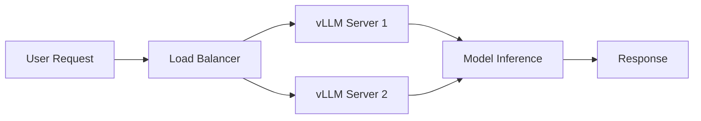
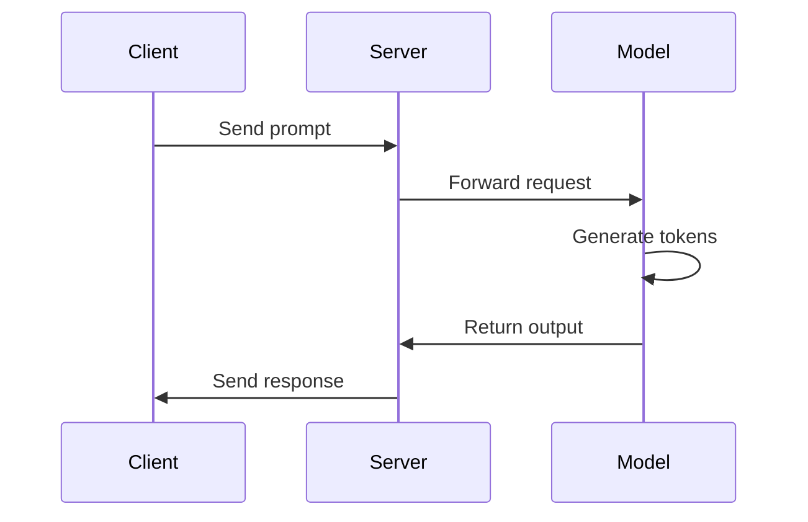

# vLLM Learning Materials - Style Guide

**Version:** 1.0
**Last Updated:** 2025-11-18
**Purpose:** Ensure consistency, professionalism, and quality across all learning materials

---

## Table of Contents

1. [Document Structure](#document-structure)
2. [Markdown Formatting](#markdown-formatting)
3. [Code Standards](#code-standards)
4. [Writing Style](#writing-style)
5. [File Organization](#file-organization)
6. [Visual Elements](#visual-elements)
7. [Technical Content](#technical-content)
8. [Common Mistakes](#common-mistakes)

---

## Document Structure

### Heading Hierarchy

Use a clear, logical heading hierarchy. **Never skip heading levels.**

```markdown
# H1: Document Title (One per document)
## H2: Major Sections
### H3: Subsections
#### H4: Sub-subsections
##### H5: Minor divisions (use sparingly)
###### H6: Rarely used
```

**Rules:**
- **H1**: Document title only - appears once at the top
- **H2**: Main sections (Overview, Setup, Implementation, etc.)
- **H3**: Major subsections within H2 sections
- **H4**: Details within H3 sections
- **H5-H6**: Use only when absolutely necessary for deep nesting

**Example - CORRECT:**

```markdown
# Tutorial: Understanding Attention Mechanisms

## Overview
Brief introduction...

## Theoretical Foundation
### Query, Key, Value Concepts
Explanation of QKV...

### Attention Scoring
How attention scores are calculated...

## Implementation
### Basic Attention
Code for basic attention...

#### Code Walkthrough
Line-by-line explanation...
```

**Example - INCORRECT:**

```markdown
# Tutorial: Understanding Attention Mechanisms

### Overview  ❌ (Skipped H2)
Brief introduction...

## Theoretical Foundation
##### Query, Key, Value Concepts  ❌ (Skipped H3, H4)
```

---

### Document Metadata

All documents should include metadata at the top:

```markdown
# Document Title

<!--
Difficulty: [Beginner/Intermediate/Advanced]
Duration: [Estimated time]
Prerequisites: [Required knowledge]
Last Updated: YYYY-MM-DD
-->
```

---

### Required Sections

**Tutorials must include:**
1. Overview
2. Learning Objectives
3. Prerequisites
4. Main Content
5. Exercises/Examples
6. Summary
7. Next Steps
8. Resources

**Labs must include:**
1. Overview
2. Problem Statement
3. Requirements
4. Setup Instructions
5. Implementation Guide
6. Testing
7. Submission Requirements

**Daily Plans must include:**
1. Overview & Goals
2. Schedule
3. Activities
4. Exercises
5. Quiz
6. Reflection

---

## Markdown Formatting

### Emphasis

**Bold** for emphasis and important terms:
```markdown
**Important concept** or **key term**
```

*Italic* for subtle emphasis or terminology:
```markdown
*variable name* or *technical term*
```

**Never use underscores for emphasis** - use asterisks:
```markdown
✓ **bold** and *italic*
✗ __bold__ and _italic_
```

---

### Lists

#### Unordered Lists

Use hyphens (`-`) for consistency:

```markdown
- Item one
- Item two
  - Nested item (2 spaces)
  - Another nested item
- Item three
```

**Not:**
```markdown
* Item one  ❌
+ Item two  ❌
```

#### Ordered Lists

Use `1.` for all items (auto-numbering):

```markdown
1. First step
1. Second step
1. Third step
```

**For nested ordered lists:**

```markdown
1. Main step one
   1. Sub-step A (3 spaces)
   1. Sub-step B
1. Main step two
```

#### Task Lists

Use for checklists:

```markdown
- [ ] Incomplete task
- [x] Completed task
- [ ] Another task
```

---

### Code Blocks

**Always specify the language** for syntax highlighting:

````markdown
```python
def example():
    pass
```

```bash
echo "Hello World"
```

```json
{
  "key": "value"
}
```
````

**Supported languages:**
- `python`
- `bash`
- `json`
- `yaml`
- `sql`
- `markdown`
- `cpp`
- `cuda`
- `text` (for plain output)

**For terminal output:**

````markdown
```
Expected output:
Hello, World!
Process completed successfully.
```
````

**For file paths in explanations:**

Use inline code:
```markdown
Edit the `config.yaml` file in the `/home/user/vllm-learn/` directory.
```

---

### Code Block Line Length

**Maximum line length: 80 characters**

**CORRECT:**

```python
def calculate_attention_scores(
    query: torch.Tensor,
    key: torch.Tensor,
    scaling_factor: float
) -> torch.Tensor:
    """
    Calculate attention scores between query and key.

    Args:
        query: Query tensor of shape (batch, seq_len, dim)
        key: Key tensor of shape (batch, seq_len, dim)
        scaling_factor: Factor to scale dot products

    Returns:
        Attention scores tensor
    """
    scores = torch.matmul(query, key.transpose(-2, -1))
    return scores / scaling_factor
```

**INCORRECT:**

```python
def calculate_attention_scores(query: torch.Tensor, key: torch.Tensor, scaling_factor: float) -> torch.Tensor:  ❌ Too long
    scores = torch.matmul(query, key.transpose(-2, -1))
    return scores / scaling_factor
```

---

### Links

**Internal links** (within the project):

```markdown
See [Tutorial 1](../tutorials/week1/day1_tutorial.md) for details.
```

**External links:**

```markdown
Read the [vLLM Documentation](https://docs.vllm.ai/en/latest/)
```

**Reference-style links** for repeated URLs:

```markdown
Check the [official docs][vllm-docs] and [GitHub repo][vllm-github].

[vllm-docs]: https://docs.vllm.ai/en/latest/
[vllm-github]: https://github.com/vllm-project/vllm
```

**Link text should be descriptive:**

```markdown
✓ Read the [vLLM architecture guide](url)
✗ Click [here](url)
✗ [Link](url)
```

---

### Tables

Use pipes (`|`) with proper alignment:

```markdown
| Column 1 | Column 2 | Column 3 |
|----------|----------|----------|
| Data 1   | Data 2   | Data 3   |
| Data 4   | Data 5   | Data 6   |
```

**For alignment:**

```markdown
| Left-aligned | Center-aligned | Right-aligned |
|:-------------|:--------------:|--------------:|
| Text         | Text           | 123           |
| More text    | More text      | 456           |
```

**Complex tables:**

For complex data, consider code blocks:

```markdown
```
Name            Age    Role
────────────────────────────────
Alice           28     Engineer
Bob             32     Manager
Charlie         25     Designer
```
```

---

### Horizontal Rules

Use three hyphens with blank lines:

```markdown
Content above

---

Content below
```

---

### Blockquotes

For important notes or quotes:

```markdown
> **Note:** This is an important point to remember.

> **Warning:** This operation is irreversible.

> **Tip:** Use this technique to improve performance.
```

**For multi-paragraph quotes:**

```markdown
> First paragraph of quote.
>
> Second paragraph of quote.
```

---

### Collapsible Sections

Use HTML `<details>` for hints, solutions, or additional info:

```markdown
<details>
<summary>Click to reveal solution</summary>

```python
def solution():
    return 42
```

Explanation of the solution...

</details>
```

**Important:** Blank lines around content are crucial for proper rendering.

---

## Code Standards

### Python Code Style

Follow **PEP 8** with these specifics:

#### Imports

```python
# Standard library
import os
import sys
from typing import List, Dict, Optional

# Third-party
import torch
import numpy as np

# Local
from vllm import LLM
from vllm.config import ModelConfig
```

#### Type Hints

**Always use type hints:**

```python
def process_tokens(
    tokens: List[int],
    max_length: int = 512,
    padding: Optional[str] = None
) -> torch.Tensor:
    """Process tokens into tensor."""
    pass
```

**For complex types:**

```python
from typing import List, Dict, Tuple, Optional, Union

def complex_function(
    data: Dict[str, List[int]],
    config: Optional[Dict[str, Union[str, int]]] = None
) -> Tuple[torch.Tensor, Dict[str, float]]:
    """Function with complex type hints."""
    pass
```

#### Docstrings

Use **Google style docstrings:**

```python
def calculate_attention(
    query: torch.Tensor,
    key: torch.Tensor,
    value: torch.Tensor,
    mask: Optional[torch.Tensor] = None
) -> torch.Tensor:
    """
    Calculate scaled dot-product attention.

    This function implements the attention mechanism as described
    in "Attention Is All You Need" (Vaswani et al., 2017).

    Args:
        query: Query tensor of shape (batch, heads, seq_len, dim).
        key: Key tensor of shape (batch, heads, seq_len, dim).
        value: Value tensor of shape (batch, heads, seq_len, dim).
        mask: Optional attention mask of shape (batch, 1, seq_len, seq_len).
            Default is None.

    Returns:
        Attention output tensor of shape (batch, heads, seq_len, dim).

    Raises:
        ValueError: If tensor dimensions don't match.

    Example:
        >>> query = torch.randn(2, 8, 10, 64)
        >>> key = torch.randn(2, 8, 10, 64)
        >>> value = torch.randn(2, 8, 10, 64)
        >>> output = calculate_attention(query, key, value)
        >>> output.shape
        torch.Size([2, 8, 10, 64])

    Note:
        This implementation uses scaled dot-product attention with
        optional masking for padding and causal attention.
    """
    # Implementation
    pass
```

**For classes:**

```python
class AttentionLayer:
    """
    Multi-head attention layer.

    This class implements a multi-head attention mechanism with
    learnable parameters for query, key, and value projections.

    Attributes:
        num_heads: Number of attention heads.
        head_dim: Dimension of each attention head.
        hidden_size: Total hidden dimension (num_heads * head_dim).
        dropout: Dropout probability for attention weights.

    Example:
        >>> layer = AttentionLayer(num_heads=8, hidden_size=512)
        >>> x = torch.randn(2, 10, 512)
        >>> output = layer(x)
        >>> output.shape
        torch.Size([2, 10, 512])
    """

    def __init__(
        self,
        num_heads: int,
        hidden_size: int,
        dropout: float = 0.1
    ):
        """
        Initialize attention layer.

        Args:
            num_heads: Number of attention heads.
            hidden_size: Hidden dimension size.
            dropout: Dropout probability. Default is 0.1.
        """
        pass
```

#### Comments

**Inline comments:**

```python
# Calculate attention scores with scaling
scores = torch.matmul(query, key.transpose(-2, -1)) / math.sqrt(d_k)

# Apply softmax to get attention weights
attention_weights = F.softmax(scores, dim=-1)
```

**Block comments:**

```python
# The following section implements the PagedAttention mechanism.
# This is a key optimization in vLLM that allows efficient memory
# management for attention computation by:
# 1. Organizing KV cache in pages
# 2. Enabling non-contiguous memory allocation
# 3. Reducing memory fragmentation
```

**TODO comments:**

```python
# TODO(username): Optimize this loop for better performance
# TODO: Add support for sparse attention patterns
```

---

### Naming Conventions

**Variables and functions:** `snake_case`

```python
user_input = get_user_input()
max_sequence_length = 2048
```

**Classes:** `PascalCase`

```python
class AttentionMechanism:
    pass

class TokenizerConfig:
    pass
```

**Constants:** `UPPER_SNAKE_CASE`

```python
MAX_BATCH_SIZE = 256
DEFAULT_TEMPERATURE = 1.0
```

**Private methods/attributes:** Prefix with `_`

```python
class Model:
    def __init__(self):
        self._hidden_state = None

    def _internal_method(self):
        pass
```

---

### Example Input/Output Format

**Always show complete examples:**

```python
# Example 1: Basic usage
input_text = "Hello, world!"
tokens = tokenizer.encode(input_text)
print(f"Input: {input_text}")
print(f"Tokens: {tokens}")
# Output:
# Input: Hello, world!
# Tokens: [15496, 11, 1917, 0]

# Example 2: Batch processing
inputs = ["First text", "Second text"]
outputs = model.generate(inputs, max_length=50)
for inp, out in zip(inputs, outputs):
    print(f"Input: {inp}")
    print(f"Output: {out}")
    print("---")
```

---

## Writing Style

### Tone and Voice

**Use:**
- **Second person ("you")** for instructions and tutorials
- **Active voice** instead of passive
- **Present tense** for descriptions
- **Clear, direct language**

**Examples:**

```markdown
✓ "You will implement a custom attention mechanism."
✗ "A custom attention mechanism will be implemented."

✓ "The function returns a tensor."
✗ "A tensor is returned by the function."

✓ "First, initialize the model."
✗ "Firstly, the model should be initialized."
```

---

### Technical Accuracy

**Be precise:**

```markdown
✓ "The function has O(n²) time complexity."
✗ "The function is slow."

✓ "This increases memory usage by 20%."
✗ "This uses more memory."

✓ "The model achieves 45.2 tokens/second throughput."
✗ "The model is fast."
```

---

### Clarity and Conciseness

**Prefer simple, direct sentences:**

```markdown
✓ "Use PyTorch 2.0 or later."
✗ "It is recommended that you should use PyTorch version 2.0 or any later version that may be available."

✓ "The cache stores computed values."
✗ "The cache is used for the purpose of storing values that have been computed."
```

---

### Terminology

**Use consistent terminology:**

| Preferred | Avoid |
|-----------|-------|
| vLLM | VLLM, Vllm, v-LLM |
| Large Language Model (LLM) | language model, LM |
| Key-Value cache (KV cache) | cache, key-value store |
| Attention mechanism | attention layer |
| Transformer | transformer model |
| Token | word piece, subword |

**Define acronyms on first use:**

```markdown
✓ "Large Language Models (LLMs) are neural networks..."
✗ "LLMs are neural networks..."
```

---

### Examples and Analogies

**Use relatable analogies:**

```markdown
> **Analogy:** Think of the attention mechanism like a spotlight on a stage.
> The query determines where to shine the light, the keys are potential
> positions on the stage, and the values are what you actually see when
> you look at those positions.
```

**Provide concrete examples:**

```markdown
For instance, if the input is "The cat sat on the mat", the tokenizer
might produce: `[464, 3797, 3332, 319, 262, 2603]`
```

---

### Instructional Language

**Use action verbs for steps:**

```markdown
1. **Install** the required packages
2. **Configure** the model parameters
3. **Run** the training script
4. **Validate** the output
```

**Common action verbs:**
- Install, download, configure, set up
- Create, build, implement, develop
- Run, execute, test, validate
- Review, analyze, examine, inspect

---

## File Organization

### File Naming Conventions

**General rules:**
- Use lowercase
- Use hyphens (`-`) for separators, not underscores
- Be descriptive but concise
- Include sequence numbers for ordered content

**Examples:**

```
✓ week1-day1-introduction.md
✓ lab-03-attention-mechanism.md
✓ coding-problem-two-sum.md
✓ system-design-llm-inference.md

✗ Week1Day1Introduction.md
✗ lab_03_attention_mechanism.md
✗ Lab3.md
✗ problem.md
```

---

### Directory Structure

**Standard structure:**

```
vllm-learn/
├── learning_materials/
│   ├── week1/
│   │   ├── day1/
│   │   │   ├── tutorial.md
│   │   │   ├── exercises/
│   │   │   └── solutions/
│   │   └── day2/
│   └── week2/
├── labs/
│   ├── lab-01-setup/
│   │   ├── README.md
│   │   ├── starter-code/
│   │   └── tests/
│   └── lab-02-attention/
├── coding-problems/
│   ├── arrays/
│   ├── trees/
│   └── dynamic-programming/
├── system-design/
│   ├── llm-serving/
│   └── distributed-training/
└── templates/
```

---

### README Files

**Every directory should have a README.md:**

```markdown
# Week 1: Introduction to vLLM

## Overview
This week covers...

## Daily Breakdown
- **Day 1:** [Topic]
- **Day 2:** [Topic]
- **Day 3:** [Topic]

## Learning Objectives
- [ ] Objective 1
- [ ] Objective 2

## Prerequisites
- [Prerequisite 1]
- [Prerequisite 2]
```

---

## Visual Elements

### Diagrams

**Use ASCII art for simple diagrams:**

```markdown
```
Input Sequence
     │
     ▼
┌────────────┐
│  Embedding │
└─────┬──────┘
      │
      ▼
┌────────────┐
│  Attention │
└─────┬──────┘
      │
      ▼
┌────────────┐
│    FFN     │
└─────┬──────┘
      │
      ▼
   Output
```
```

**For complex diagrams, reference images:**

```markdown


*Figure 1: vLLM architecture showing the PagedAttention mechanism*
```

---

### Mermaid Diagrams

**Use Mermaid for flowcharts and sequence diagrams:**

````markdown

````

**Sequence diagrams:**

````markdown

````

---

### Emoji Usage

**Use emojis sparingly for visual markers:**

| Emoji | Use Case | Example |
|-------|----------|---------|
| 📚 | Learning materials, theory | `📚 Theory Block` |
| 💻 | Coding, implementation | `💻 Hands-On Practice` |
| 🔬 | Labs, experiments | `🔬 Lab Work` |
| ☕ | Breaks | `☕ Break (15m)` |
| ✓ / ✗ | Correct / Incorrect | `✓ Good practice` |
| 📝 | Quizzes, notes | `📝 Daily Quiz` |
| 💡 | Tips, insights | `💡 Tip: Use caching` |
| ⚠️ | Warnings | `⚠️ Warning: Data loss` |
| 🚀 | Performance, optimization | `🚀 Performance Tip` |

**Don't overuse:**

```markdown
✓ "## 📚 Theory: Attention Mechanisms"
✗ "## 📚💡🔥 Theory: Attention Mechanisms ✨🎯"
```

**Never use in:**
- Code
- File names
- URLs
- Technical specifications

---

## Technical Content

### Code Examples

**Requirements for all code examples:**

1. **Must be complete and runnable**
   - Include all necessary imports
   - Define all variables
   - Show expected output

2. **Must be tested**
   - Verify code actually runs
   - Confirm output matches documentation

3. **Must be well-commented**
   - Explain non-obvious logic
   - Highlight important concepts
   - Add docstrings

**Example:**

```python
"""
Example: Basic text generation with vLLM.

This script demonstrates how to use vLLM for simple text generation
with a pre-trained model.
"""

from vllm import LLM, SamplingParams

# Initialize the model
# Using Llama-2-7B as an example (ensure model is downloaded)
llm = LLM(model="meta-llama/Llama-2-7b-hf")

# Configure sampling parameters
sampling_params = SamplingParams(
    temperature=0.8,  # Controls randomness
    top_p=0.95,       # Nucleus sampling threshold
    max_tokens=100    # Maximum tokens to generate
)

# Define prompts
prompts = [
    "The future of AI is",
    "Once upon a time",
]

# Generate outputs
outputs = llm.generate(prompts, sampling_params)

# Display results
for output in outputs:
    prompt = output.prompt
    generated_text = output.outputs[0].text
    print(f"Prompt: {prompt}")
    print(f"Generated: {generated_text}")
    print("-" * 80)

# Expected output (approximate, due to randomness):
# Prompt: The future of AI is
# Generated: bright and full of possibilities. As technology continues...
# --------------------------------------------------------------------------------
# Prompt: Once upon a time
# Generated: in a faraway land, there lived a brave knight who...
# --------------------------------------------------------------------------------
```

---

### Mathematical Notation

**Use LaTeX for equations:**

Inline math: `$f(x) = x^2$` renders as: $f(x) = x^2$

Block math:
```markdown
$$
\text{Attention}(Q, K, V) = \text{softmax}\left(\frac{QK^T}{\sqrt{d_k}}\right)V
$$
```

**Define all variables:**

```markdown
Where:
- $Q$ is the query matrix
- $K$ is the key matrix
- $V$ is the value matrix
- $d_k$ is the dimension of the key vectors
```

---

### References and Citations

**In-text references:**

```markdown
According to the original Transformer paper (Vaswani et al., 2017), the
attention mechanism can be described as...
```

**Reference list:**

```markdown
## References

1. Vaswani, A., Shazeer, N., Parmar, N., et al. (2017). "Attention Is All
   You Need." *Advances in Neural Information Processing Systems*.
   [arXiv:1706.03762](https://arxiv.org/abs/1706.03762)

2. Kwon, W., Li, Z., Zhuang, S., et al. (2023). "Efficient Memory Management
   for Large Language Model Serving with PagedAttention." *SOSP 2023*.
   [arXiv:2309.06180](https://arxiv.org/abs/2309.06180)
```

---

## Common Mistakes

### Formatting Mistakes

**1. Inconsistent spacing:**

```markdown
✗
## Section
Content starts immediately without blank line.
## Next Section

✓
## Section

Content has blank lines before and after.

## Next Section
```

**2. Mixing list styles:**

```markdown
✗
- Item 1
* Item 2
+ Item 3

✓
- Item 1
- Item 2
- Item 3
```

**3. Code blocks without language:**

````markdown
✗
```
def function():
    pass
```

✓
```python
def function():
    pass
```
````

**4. Incorrect link syntax:**

```markdown
✗ [Link text] (https://example.com)  ← Space before URL
✗ [Link text](https://example.com )  ← Space in URL

✓ [Link text](https://example.com)
```

---

### Content Mistakes

**1. Vague instructions:**

```markdown
✗ "Set up the environment."
✓ "Run `pip install vllm torch transformers` to install dependencies."
```

**2. Missing expected output:**

```markdown
✗
```python
result = calculate(5, 3)
print(result)
```

✓
```python
result = calculate(5, 3)
print(result)
# Output: 8
```
```

**3. Undefined acronyms:**

```markdown
✗ "Configure the KV cache size."
✓ "Configure the Key-Value (KV) cache size."
```

**4. Incomplete code examples:**

```markdown
✗
```python
# Missing imports and context
model.generate(prompt)
```

✓
```python
from vllm import LLM, SamplingParams

model = LLM("meta-llama/Llama-2-7b-hf")
params = SamplingParams(temperature=0.8)
output = model.generate("Hello", params)
print(output[0].outputs[0].text)
```
```

---

## Checklist

Before finalizing any document, verify:

### Structure
- [ ] H1 title present and unique
- [ ] Logical heading hierarchy (no skipped levels)
- [ ] Metadata included
- [ ] Required sections present
- [ ] Table of contents (for long documents)

### Formatting
- [ ] Consistent list formatting (hyphens)
- [ ] All code blocks have language tags
- [ ] Tables properly formatted
- [ ] Links working and descriptive
- [ ] Proper spacing around elements

### Code Quality
- [ ] All code examples tested and working
- [ ] Type hints included
- [ ] Docstrings complete
- [ ] Expected outputs shown
- [ ] Proper error handling

### Content
- [ ] Clear learning objectives
- [ ] Prerequisites stated
- [ ] Examples concrete and complete
- [ ] Technical terms defined
- [ ] No typos or grammatical errors

### Professional Quality
- [ ] Consistent terminology
- [ ] Active voice used
- [ ] Appropriate tone
- [ ] Proper citations
- [ ] Cross-references accurate

---

## Version History

| Version | Date | Changes |
|---------|------|---------|
| 1.0 | 2025-11-18 | Initial style guide created |

---

## Getting Help

**Questions about this style guide?**
- Open an issue in the repository
- Consult with other agents
- Reference the templates for examples

**Contributing improvements:**
- Submit suggestions for clarifications
- Propose new sections
- Report inconsistencies

---

**Remember:** Consistency is key. When in doubt, check the templates and existing high-quality materials for examples.
