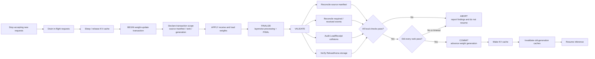
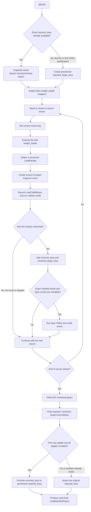

# Designing Weight Updates as Transactions: A Unified Plan for #48312

Status: **partially implemented and still evolving**. This document combines the commit history on `feat/reload-arena` with the findings in `REPORT.md`, `DESIGN.md`, and `LOAD_MANIFEST_DESIGN.md`. It describes the transaction semantics required by weight reload and weight-transfer operations, and distinguishes implemented behavior from future work. Stable storage, first-load manifests, manifest-driven completion, structured `LoadReceipt`s, and event-key collision auditing are implemented. A unified `ReloadTransaction` coordinator, an all-rank commit barrier, rollback, and several cache/state checkers are not.

## 1. Why a weight update must be a transaction

An RL weight synchronization or checkpoint reload is not merely a sequence of `copy_` calls. It may pause request processing, receive weights, restore checkpoint layouts, invoke many kinds of `weight_loader`, rerun `process_weights_after_loading` (PWAL), rebuild quantization or MoE-derived state, wake the KV cache, and resume inference. If any stage is incomplete, the API may report success while the model contains a partial update or internally inconsistent state.

Correctness therefore cannot mean “no function raised.” It must mean: **every declared source arrived; every source was routed to the correct rank-local target fragment; every required fragment was consumed; graph-visible storage remained stable after PWAL; every rank passed validation; and only then did the model resume serving.** This gives the following lifecycle:

```text
BEGIN
  -> establish the update scope and baselines
  -> APPLY: receive and load weights
  -> FINALIZE: finish PWAL and layer restoration
  -> VALIDATE: reconcile sources, event manifests, arena storage, and state
  -> COMMIT: resume inference only after every check passes
  -> ABORT: do not treat the update as successful if any check fails
```

“Transaction” here means atomic visibility, completeness validation, and a unified commit gate; it is not a database transaction. Only some checks currently fail closed. Initial-baseline collisions, incomplete first real updates after dummy initialization, and declared source-manifest mismatches raise immediately. Ordinary reload completion and arena violations are primarily exposed through `LoadManifestReport`, so callers must still enforce `report.ok`. The unified commit gate is therefore unfinished. The system also does not retain an old-weight snapshot: **ABORT currently means rejecting the update and refusing to continue serving, not automatically rolling back to the previous values.**

### 1.1 End-to-end transaction flow

The first diagram retains the original service lifecycle and places the implemented manifest, receipt, and arena checks at their intended transaction boundary:



The internal loading path is:



## 2. Transaction invariants

| Area | Invariant | Current status |
|---|---|---|
| Storage identity | Addresses captured by CUDA Graphs, quantization kernels, or MoE workspaces remain stable across reload | Arena and per-layer verification implemented |
| Source completeness | Declared source names equal the names actually received | Transfer source manifest implemented; required for the first streamed update after dummy init |
| Loader completeness | Every logical event consumed during the correct first load occurs again during reload | Required/received manifest implemented |
| Fragment uniqueness | Q/K/V and MoE expert/shard events do not collapse because of incomplete receipts | Structured receipts and collision audit implemented |
| Completion timing | Layer completion depends on event sets, not internal `copy_` counts or numel estimates | Manifest-driven completion implemented; `load_numel` removed |
| Rank isolation | Every TP/PP/DP/EP rank validates only its rank-local fragments | Rank-local reports implemented; unified global barrier pending |
| Keyless state | Non-persistent buffers, aliases, and derived values are preserved or rebuilt according to policy | Partially covered; unified checker pending |
| Routing correctness | A source reaches the correct rank, expert, and shard, not merely any loader | Receipt identity exists; distributed sentinel validation pending |
| Cache coherence | Prefix, LoRA, and multimodal caches never serve state from an old weight generation | Unified generation checker pending |

These invariants require different mechanisms, but they share one commit point. A transaction report should aggregate them instead of allowing each update entry point to make an unrelated decision.

## 3. Implementation history

The branch evolved in stages: stabilize storage first, establish verifiable manifests next, then make the manifest authoritative for completion.

| Commit | Purpose |
|---|---|
| `5532d3a69` | Introduced layer-owned `ReloadArena` storage for graph-visible temporary tensors |
| `6f725f866`, `dead65972` | Moved Machete and RDNA3 WNA16 MoE derived scratch tensors into the arena |
| `14a226b68` | Added capture-time module-level storage manifests beyond arena-owned tensors |
| `91e05c188` through `ba8bd7a2f` | Added registry, first-forward, dataflow, and MoE-expert CI discovery |
| `bdc1ee506` | Moved arena snapshot/verification into the per-layer reload pipeline |
| `3a90010d3` | Observed required events during the first real load instead of predicting them from model structure |
| `7645c60fb` | Added source, target, and fragment manifests across loader and weight-transfer paths |
| `19969814d` | Removed `load_numel/load_numel_total` and made manifests drive completion |
| `cd44e02e3` | Added structured `LoadReceipt`s for QKV, merged-column, RoutedExperts, and composed loaders |
| `810280d52` | Added event-key collision auditing for missing fields, status conflicts, and schema drift |

Older descriptions that label `CompletionManifestChecker` as design-only are now stale. Manifests, structured receipts, and collision auditing have code and model-level validation. What remains is a unified coordinator and a global all-rank commit decision.

### 3.1 Status legend and summary

The document uses four status labels:

- **[Implemented]**: code exists on the branch and has unit-test or real-model evidence;
- **[Partially implemented]**: lower-level state or checks exist, but the unified gate or some update paths are missing;
- **[To be implemented]**: design only; no complete runtime implementation can be relied upon;
- **[TBD]**: the interface shape has not been decided; example code expresses responsibilities only.

#### Implemented

- Stable ReloadArena storage, per-layer snapshot/verification, and module-level storage manifests;
- first-checkpoint-load observation of `required_keys` and reload-time collection of `received_keys`;
- source-to-target-fragment events and rank-local `LoadManifestScope`/`LoadManifestReport`;
- provisional dummy baselines and promotion to exact event baselines after a complete first real update;
- manifest completion in place of `load_numel/load_numel_total`;
- `LoadReceipt`/`LoadFragment` support in QKV, MergedColumn, RoutedExperts, and composed loaders;
- event-key/target collisions, status conflicts, schema drift, and declared-schema mismatch detection;
- declared source-manifest validation in `WeightTransferEngine`;
- Qwen3 MoE TP/EP, Qwen CUDA IPC, and synthetic negative tests.

#### Partially implemented

- Fail-closed behavior: first-load collisions, incomplete dummy-first-real updates, and declared source mismatches fail directly; normal completion/arena findings still depend on callers enforcing `report.ok`;
- distributed commit: rank-local scopes/reports and multi-rank validation exist, but no universal all-rank commit barrier exists;
- loader coverage: standard checkpoint, IPC/NCCL, and several external loaders are covered, while sparse/direct mutation needs a transaction hook;
- draft/MTP: independent scopes are required by design, but no common model-role/generation protocol exists;
- keyless and derived state: the arena covers some graph-visible tensors, but there is no general buffer/alias checker.

#### To be implemented

- A unified coordinator and its final public/internal API;
- all-rank commit barrier, timeout, and all-or-none resume;
- rollback through a shadow model/double buffer or undo log;
- transaction ID, weight generation, late-chunk rejection, and concurrent-update isolation;
- a standard source/dirty-generation protocol for sparse and direct updates;
- `LoaderEpochChecker`, `KeylessStateChecker`, `ShardRoutingChecker`, `CacheGenerationChecker`, and `IdempotencyChecker`;
- formal target/draft/MTP scope types and independent reconciliation;
- generation-based invalidation for prefix, LoRA, multimodal, and related caches.

## 4. [Implemented] Three layers of identity

### 4.1 Source identity

A source identity is the stable sender-side or checkpoint-side name, for example:

```text
model.layers.0.self_attn.q_proj.weight
model.layers.0.mlp.experts.7.gate_proj.weight
```

Checkpoint loaders use `observe_weight_sources()` to preserve the original source key while the model performs name mapping, packed routing, or expert routing. Chunked IPC/NCCL transfers may independently declare `expected_source_names`, allowing final reconciliation:

```text
missing = expected_source_names - received_source_names
unexpected = received_source_names - expected_source_names
```

Dummy initialization has no checkpoint source stream and cannot learn a source baseline. For IPC/NCCL transfers where the caller chooses and chunks the source set, the first real transfer must carry an authoritative source manifest; otherwise a source that never arrived cannot be distinguished from a source that was not expected. When loading a complete checkpoint directly, the checkpoint index/iterator can define the source boundary, but the rank-local provisional target baseline must still be satisfied.

### 4.2 Target-fragment identity

One Parameter does not necessarily represent one logical weight. QKV, merged MLP, MoE, and quantized weights often place multiple sources into one packed Parameter. The target identity must therefore be:

```text
parameter name + logical fragment
```

Examples:

```text
weight[loaded_shard_id='q']
w13_weight[shard_id='w1',expert_id=7,weight_name='...w13_weight']
```

### 4.3 Full load-event identity

The final manifest event is:

```text
source key => target fragment
```

Examples:

```text
model.layers.0.self_attn.q_proj.weight=>weight[loaded_shard_id='q']
model.layers.0.mlp.experts.7.gate_proj.weight=>w13_weight[shard_id='w1',expert_id=7,weight_name='model.layers.0.mlp.experts.w13_weight']
```

Transaction completion compares full event sets. Collision auditing additionally compares target fragments without source names, because different sources can incorrectly claim the same target if a receipt omits a discriminator.

## 5. [Implemented] Structured LoadReceipt

Every logical loader call returns a structured receipt:

```python
@dataclass(frozen=True)
class LoadReceipt:
    consumed: bool
    fragment: LoadFragment
    collision_policy: LoadCollisionPolicy
```

A normal successful load returns:

```python
return LoadReceipt.accepted(loaded_shard_id="q")
```

An expert not owned by the current rank returns:

```python
return LoadReceipt.skipped(
    shard_id=shard_id,
    expert_id=expert_id,
    weight_name=weight_name,
)
```

An existing loader with many branches and a historical `None`/`bool` result can migrate through a declarative adapter:

```python
@returns_load_receipt("shard_id", "expert_id", "weight_name")
def weight_loader(..., return_success=False):
    ...
```

`LoadReceipt.__bool__()` preserves conditional-loader truthiness, so existing `if success:` routing continues to work. Loaders not yet migrated use `_legacy_load_receipt(bound_args, result)`, which infers fragments from known argument names. That path is a migration fallback and should not be the default for new loaders.

### 5.1 Fragment definitions in validated model paths

| Loader | Receipt fragment | Reason |
|---|---|---|
| `QKVParallelLinear` | `loaded_shard_id=q/k/v` | Distinguishes Q, K, and V regions inside one packed Parameter |
| `MergedColumnParallelLinear` | `loaded_shard_id=0/1/...` | Distinguishes gate/up or other merged shards |
| `RoutedExperts` | `shard_id + expert_id + weight_name` | Distinguishes experts, w1/w2/w3, and quantized/special weight branches |
| Ordinary one-to-one loader | Empty fragment | Source and parameter name already identify one target |
| Composed loader | Propagates the underlying receipt unchanged | Post-load `copy_(fn(param))` is not a second source-consumption event |

A receipt describes which logical fragment one loader invocation consumed. It does not count internal `copy_` calls. This is why the model can handle the #44814 failure class without numel-based completion.

## 6. [Implemented] Event-key collision audit

Comparing first-load and reload sets has a blind spot: if both phases return the same incomplete receipt, two distinct fragments can collapse on both sides and still satisfy `required == received`. Commit `810280d52` adds `LoadEventAudit`, an independent witness mechanism.

For every loader call, the audit creates a `LoadCallWitness` containing the loader module/qualname, source key, target parameter name, stable serializable scalar arguments from `BoundArguments`, and loaded-tensor shape/dtype. It never records tensor contents, object addresses, or device pointers.

| Finding | Meaning |
|---|---|
| `EVENT_KEY_COLLISION` | One full event key corresponds to two different call witnesses |
| `TARGET_ALIAS_COLLISION` | Different sources or calls incorrectly claim the same target fragment |
| `STATUS_CONFLICT` | One logical event is both accepted and skipped in one transaction |
| `SCHEMA_DRIFT` | One loader returns different fragment schemas during one load |
| `RECEIPT_SCHEMA_MISMATCH` | The decorator declaration and actual receipt fields disagree |

If a QKV loader omits `loaded_shard_id`, its source keys are still different, but all targets collapse to `weight`. The audit reports:

```text
TARGET_ALIAS_COLLISION
first_source=q_proj.weight
second_source=k_proj.weight
differing_arguments=('loaded_shard_id',)
possible_missing_receipt_fields=('loaded_shard_id',)
```

Identical duplicate calls are not identity collisions. A loader that intentionally allows several sources to overwrite one target must explicitly use `collision_policy=LoadCollisionPolicy.OVERWRITE`; model-name allowlists are not used.

`finalize_load_recording()` rejects collisions while establishing a checkpoint baseline. During reload, collision findings are added to `LoadManifestReport.completion_findings`, making the rank-local `report.ok` false.

## 7. [Implemented] Manifest creation and replay

### 7.1 Normal first checkpoint load

```text
model parameters exist
-> record_metadata_for_reloading(model)
-> record_load_consumption(model) wraps effective weight loaders
-> checkpoint iteration establishes a source context
-> loader returns or is adapted to LoadReceipt
-> source=>target[fragment] is added to required_keys
-> LoadEventAudit runs in parallel
-> finalize_load_recording(model)
-> original loaders are restored; the baseline becomes valid if no collision exists
```

`required_keys` is observed ground truth, not a prediction derived from `state_dict()`, parameter counts, or architecture names. EP-nonlocal experts, shared aliases, and runtime state without checkpoint sources are therefore absent from the rank-local required set by construction.

### 7.2 Normal reload

```text
initialize_layerwise_reload(model)
-> snapshot arena storage
-> restore reloadable layers to checkpoint/meta layout
-> install online loader wrappers
-> add each consumed receipt to received_keys
-> when required_keys is a subset of received_keys, allow layer PWAL
-> after checkpoint exhaustion, perform final set reconciliation
-> verify arena snapshots
-> produce a rank-local LoadManifestReport
```

The event set determines completion. `copied_numel_diagnostic` may remain as a log-only metric, but it does not participate in completion, commit, or fallback decisions.

### 7.3 First real update after dummy initialization

A dummy load has no source stream and can establish only a provisional target baseline:

```text
required_target_keys = rank-local parameter targets that must be touched
required_keys = empty, meaning no exact source/fragment baseline exists yet
```

The first real update must satisfy every provisional target. Chunked IPC/NCCL transfers must additionally prove that every source in the independently declared source manifest arrived. One target may contain many QKV or MoE fragments, so the first touch cannot trigger early PWAL; this phase remains buffered until transaction finalization. After successful validation, `received_keys` is promoted to permanent `required_keys`, and later reloads can finalize layers from exact events.

### 7.4 Online quantization and external tensor loaders

First-load online quantization may also lack an exact fragment baseline and follows the provisional-target path. Modelexpress, RunAI, Tensorizer, or processed-tensor transfers may bypass vLLM `weight_loader` functions entirely. They must publish source-to-target events through `record_external_tensor_manifest()` or `record_direct_load_consumption()` rather than fabricating receipts. Coverage must follow the actual dataflow; the mere presence of a loader file does not imply transaction coverage.

## 8. [Implemented] Storage transaction: ReloadArena and PWAL

The manifest proves that every logical weight was loaded. The arena proves that graph and kernel consumers still reference valid storage after PWAL. These are separate invariants and both are required.

At reload start, each arena-backed layer snapshots slot identities. After PWAL rebuilds derived tensors, `arena.verify(snapshot)` checks for missing slots, moved addresses, or layout changes. The arena owns stable buffers, and PWAL uses `put()` to refresh values in existing storage instead of rebinding graph-visible tensors. Verification must happen before `LayerReloadingInfo.reset()` clears the snapshot.

The current report is:

```python
LoadManifestReport(
    scope=LoadManifestScope(...),
    required_event_count=...,
    received_event_count=...,
    completion_findings=(...),
    arena_findings=(...),
)
```

`report.ok` is true only when completion and arena findings are both empty. Collision findings currently belong to `completion_findings`.

## 9. [Partially implemented] Distributed scope and commit decision

Manifests must remain per worker/rank; they cannot be unioned before reconciliation. TP, PP, and EP workers legitimately consume different fragments. A union could hide a missing rank-0 event behind an event received by rank 1. Each report therefore carries global rank/world size and TP, PP, DP, and EP coordinates.

The intended global protocol is:

```text
each rank completes local APPLY and VALIDATE
-> controller collects every rank-local LoadManifestReport
-> if any report.ok is false, ABORT the entire update
-> if every report.ok is true, cross a barrier and COMMIT/RESUME together
```

Rank-local report generation and multi-rank model validation exist. A universal global commit barrier does not. Until it does, each entry point must check all worker reports rather than rank 0 alone, and a successful rank must not resume before failed ranks.

MTP and speculative decoding require independent scopes. Target and draft models can have different parameter sets, parallel layouts, and update cadence. Events must not share an unqualified set. A future scope should contain at least:

```text
model_role = target | draft | mtp
model_instance_id
parallel coordinates
weight generation
```

If only the target model is updated, the draft scope must explicitly be out of the transaction rather than appearing to have missing receipts.

## 10. [Partially implemented] Entry-point coverage and transaction boundaries

Weight updates have many entry points: checkpoint `reload_weights`, IPC, NCCL, sparse NCCL, Modelexpress, RunAI, Tensorizer, and framework RPC calls to `model.load_weights`. A gate attached to one API method cannot claim complete coverage.

The paths fall into three groups:

1. **Checkpoint-format paths using standard `weight_loader`s:** covered by source observation, LoadReceipt, layerwise manifests, and arena verification.
2. **Processed-tensor or direct-state restoration paths:** publish external/direct manifest events and should not be forced into fragment-loader semantics.
3. **Sparse patches using `index_copy_` or similar direct mutations:** do not invoke standard loaders and need an explicit source manifest, dirty-generation marker, and commit check.

A future coordinator should sit at the resume boundary rather than at one named API. Every entry point must run `begin_update -> observe/apply -> finish_update -> validate -> commit`. Nested paths need transaction-depth or reentrancy guards so `reload_weights`, an NCCL engine, and `model.load_weights` do not run initialize/finalize repeatedly.

## 11. [TBD] Candidate responsibilities and interface for a unified transaction

> **Interface TBD:** It has not been decided whether coordination ultimately belongs in a `ReloadTransaction` class, the `WeightTransferEngine` lifecycle, or a worker/controller protocol. The following code expresses BEGIN/APPLY/FINALIZE/VALIDATE/COMMIT/ABORT responsibilities only. It is not an implemented API and does not prescribe the final class name, method signatures, or call hierarchy.

One possible responsibility split is:

```python
class ReloadTransaction:
    def begin(self) -> None:
        """Freeze scope, clear received state, and snapshot arenas/caches."""

    def apply(self, update) -> None:
        """The only phase allowed to mutate model state."""

    def finalize(self) -> None:
        """Finish layerwise processing, PWAL, and backend finalization."""

    def validate(self) -> list[LoadManifestReport]:
        """Read-only aggregation of source, receipt, collision, arena, and checks."""

    def commit(self) -> None:
        """Advance generation and resume only after every rank passes."""

    def abort(self, findings) -> NoReturn:
        """Refuse to resume; a future implementation may roll back here."""
```

A common checker protocol could be:

```python
class ReloadChecker(Protocol):
    name: str
    def snapshot(self, ctx: ReloadContext) -> None: ...
    def verify(self, ctx: ReloadContext) -> list[Finding]: ...
```

Existing data can support `CompletionManifestChecker` (required/received/source/collision) and `StorageIdentityChecker` (arena/module storage). Future checkers include:

- `KeylessStateChecker` for `persistent=False` buffers, aliases, and state without checkpoint keys;
- `LoaderEpochChecker` to prevent checkpoint-layout loaders from writing kernel-layout storage;
- `ShardRoutingChecker` with rank-distinct sentinels for TP/EP routing;
- `CacheGenerationChecker` for prefix, LoRA, and multimodal cache invalidation;
- `IdempotencyChecker` to verify that an identity reload preserves parameters, buffers, storage, and output.

## 12. [Partially implemented / incomplete] Failure semantics, rollback, and concurrency

The key contract is that an unvalidated update must not be reported as successful. Missing/unexpected source names, missing required events, untouched dummy targets, receipt collisions/schema errors, arena drift, or any failed rank must eventually reject the transaction.

APPLY currently mutates the live model in place, so a failure may leave partially changed values. A production transaction needs one of:

1. **Shadow/double-buffer update:** load and validate an invisible model or arena generation, then atomically switch on commit. This provides true rollback at the cost of memory.
2. **Undo log:** save parameters/buffers before modification and restore them on failure. Memory can be managed layer by layer, but PWAL-derived state and aliases make this more complex.

Until rollback exists, an aborted worker must not accept new requests. The controller should destroy and rebuild it rather than use a possibly partial model.

Only one transaction may be active for one model instance. Each update should receive a monotonically increasing `transaction_id` and `weight_generation`; late chunks, duplicate finalization, and old-generation RPCs must be rejected. A rank timeout should become an abort finding rather than an indefinite barrier wait.

## 13. [Implemented] Validation matrix and evidence

| Scenario | Result |
|---|---|
| Synthetic composed/Mamba loader with two internal `copy_` calls | One logical receipt; no early completion from double numel counting |
| Packed QKV loading | Three independent fragments; missing-field test triggers target collision |
| RoutedExperts MoE | Expert, shard, and weight category are present in receipts |
| EP-nonlocal expert | Returns skipped and is absent from rank-local required events |
| Qwen3 MoE dummy -> real -> reload, TP=1 | Both real loads 789/789; tokens `[15616, 534]` |
| Qwen3 MoE TP=2 | Exact manifests complete on both ranks |
| Qwen3 MoE EP=2 | Rank-local expert reconciliation, 405/405 per rank |
| Qwen3-0.6B packed CUDA IPC | 310/310; IPC output matches cold load |
| Negative collision tests | Missing QKV/MoE fields, status conflict, and schema drift detected |
| Explicit overwrite and identical duplicate calls | No false positive |

Relevant logs are under:

```text
logs/loaders/load_receipt_moe_tp1.log
logs/loaders/load_receipt_moe_ep2.log
logs/loaders/load_receipt_rl_ipc.log
logs/loaders/collision_moe_tp1.log
logs/loaders/manifest_only_moe_tp2.log
logs/loaders/manifest_only_deepseek_fp8.log
```

The latest collision-enabled Qwen3 MoE TP1 run completed the first real load and second reload at `789/789`, produced `completion_findings=[]`, and ended with `FLOW_OK=True`.

## 14. [Implemented] Code map

| Capability | Location |
|---|---|
| `LoadReceipt`, `LoadFragment`, `LoadCollisionPolicy` | `vllm/model_executor/load_receipt.py` |
| Source context | `vllm/model_executor/model_loader/reload/source.py` |
| Required/received sets, dummy baseline, layerwise finalization | `vllm/model_executor/model_loader/reload/layerwise.py` |
| Collision witnesses and audit | `vllm/model_executor/model_loader/reload/audit.py` |
| Manifest scope/report and per-layer state | `vllm/model_executor/model_loader/reload/types.py` |
| Transfer source manifest | `vllm/distributed/weight_transfer/base.py` |
| Loader observation entry points | `default_loader.py`, `bitsandbytes_loader.py`, `tensorizer_loader.py`, `runai_streamer_loader.py`, etc. |
| QKV and merged-column receipts | `vllm/model_executor/layers/linear.py` |
| MoE receipts | `vllm/model_executor/layers/fused_moe/routed_experts.py` |
| Composed receipt propagation | `vllm/model_executor/model_loader/weight_utils.py` |
| Stable arena | `vllm/model_executor/reload_arena.py` and backend integration points |

## 15. [To be implemented] Completion criteria and next steps

The weight-update transaction is complete only when all update entry points participate in a transaction scope; a first real load can establish a collision-free exact manifest; the first streamed update after dummy/online initialization has an independent source declaration; reload completion is entirely manifest-driven; every rank commits at one barrier; any violation prevents resume; target/draft/MTP scopes are isolated; caches invalidate by generation; and failures either roll back or force worker reconstruction.

Recommended order:

1. Extract a coordinator plus common `Finding`/`Report` types, initially wiring existing completion, collision, and arena checks without changing behavior.
2. Add an all-rank commit barrier and timeout in the worker/controller path.
3. Add source-manifest and dirty-generation hooks for sparse/direct updates.
4. Implement keyless-state, loader-epoch, and cache-generation checkers.
5. Define independent target, draft, and MTP scopes.
6. Choose shadow-model or undo-log rollback.
7. Graduate new checkers from observation to strict gating and add them to the continuous model matrix.

The governing rule is: **the first load establishes collision-free, provable ground truth; every update replays and reconciles that ground truth; the arena proves storage stability; and a cross-rank gate decides whether the update commits. A path without evidence of completeness must never be considered successful merely because an HTTP or RPC call returned successfully.**
