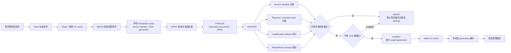
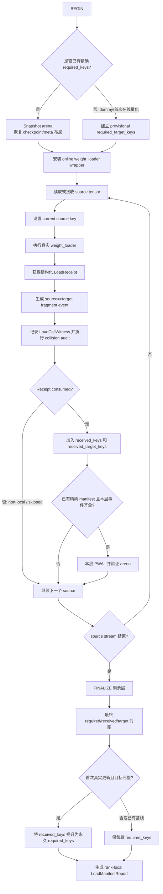

# 将权重更新设计成事务：#48312 的统一方案

状态：**部分实现，持续演进**。本文结合 `feat/reload-arena` 分支的历史提交、`REPORT.md`、`DESIGN.md` 和 `LOAD_MANIFEST_DESIGN.md`，描述权重 reload/transfer 应当具备的事务语义，并明确哪些能力已经落地、哪些仍属于后续设计。当前实现已经覆盖稳定存储、首次加载 manifest、manifest 驱动完成条件、结构化 `LoadReceipt` 和 event-key collision 审计，但尚未实现统一的 `ReloadTransaction` 协调器、跨 rank 的全局 commit barrier、失败回滚，以及缓存代际等所有检查器。

## 1. 为什么要把权重更新看成事务

一次 RL 权重同步或 checkpoint reload 并不是简单执行若干次 `copy_`。它会经过暂停请求、接收权重、恢复 checkpoint 布局、调用不同类型的 `weight_loader`、重新运行 `process_weights_after_loading`（下文简称 PWAL）、重建量化或 MoE 派生状态、恢复 KV cache 并继续推理。任何一步不完整，都可能出现“接口返回成功，但模型已经处于部分更新或内部状态不一致”的情况。

因此，正确性不能定义为“函数没有抛异常”，而应定义为：**本次更新声明的全部 source 均已到达；每个 source 被正确路由到本 rank 的目标 fragment；所有必需 fragment 均已消费；PWAL 后图可见存储地址没有漂移；所有 rank 都通过检查；只有这时模型才能恢复服务。** 这对应下面的事务生命周期：

```text
BEGIN
  → 建立本次更新的 scope 和基线
  → APPLY：接收并加载权重
  → FINALIZE：完成 PWAL 和层恢复
  → VALIDATE：source、event manifest、arena、其他状态逐项对账
  → COMMIT：所有检查通过后恢复推理
  → ABORT：任一检查失败则禁止将本次更新视为成功
```

这里的“事务”强调原子可见性、完整性验证和统一提交门禁，不等同于数据库事务。当前只有部分检查已经 fail closed：首次基线 collision、dummy 首次真实更新不完整以及显式声明的 source manifest 不匹配会直接失败；普通 reload 的 completion/arena 问题目前主要进入 `LoadManifestReport`，仍要求调用方检查 `report.ok`。因此统一 commit gate 尚未完成。系统也没有保存旧权重副本，所以 **ABORT 目前表示拒绝把更新视为成功并停止继续服务，不表示已经自动回滚到旧模型值**。


### 1.1 端到端事务流程图

下面保留原方案中的服务生命周期，并将当前已经实现的 manifest、receipt 和 arena 校验放回统一事务位置：



事务内部的实际权重加载流程如下：



## 2. 需要维护的事务不变量

| 类别 | 不变量 | 当前状态 |
|---|---|---|
| 存储身份 | CUDA Graph、量化 kernel 或 MoE workspace 捕获的地址在 reload 前后不变 | 已实现 arena 与逐层校验 |
| source 完整性 | 发送端声明的 source 名称与接收端实际收到的名称一致 | 已实现 transfer source manifest；dummy 首次真实传输强制声明 |
| loader 完整性 | 首次加载实际消费的逻辑事件，在 reload 时全部再次发生 | 已实现 required/received manifest |
| fragment 唯一性 | Q/K/V、MoE expert/shard 等不能因为回执字段缺失而折叠为同一事件 | 已实现结构化 `LoadReceipt` 与 collision audit |
| 完成时机 | 层是否完成由事件集合决定，不能由内部 `copy_` 次数或 numel 猜测 | 已实现 manifest 驱动，`load_numel` 已删除 |
| rank 隔离 | TP/PP/DP/EP 各 rank 只验证本 rank 应消费的 fragment | 已实现 rank-local report；全局 barrier 尚未统一实现 |
| 无 key 状态 | 非持久 buffer、alias、派生值在 reload 后应保留或按声明重建 | 部分覆盖，统一 checker 尚未实现 |
| 路由正确性 | source 不仅要“被加载”，还必须落到正确 rank、expert 和 shard | receipt 提供身份；跨 rank sentinel 仍待实现 |
| 缓存一致性 | prefix cache、LoRA、多模态缓存等不得继续使用旧权重代际 | 尚未实现统一 generation checker |

这些不变量由不同机制维护，但它们共享同一个提交时刻，因此应由统一事务报告汇总，而不是散落在各个入口函数里各自判断。

## 3. 当前实现的历史演进

本分支不是一次性加入完整事务，而是按“先稳定存储，再建立可验证 manifest，最后让 manifest 成为完成条件”的顺序演进：

| 提交 | 作用 |
|---|---|
| `5532d3a69` | 引入 layer-owned `ReloadArena`，为图可见临时 tensor 提供稳定存储 |
| `6f725f866`、`dead65972` | 将 Machete、RDNA3 WNA16 MoE 等派生 scratch 接入 arena |
| `14a226b68` | 捕获 module-level tensor storage，补充 arena 以外的第二层存储检查 |
| `91e05c188`～`ba8bd7a2f` | 建立 registry、首次 forward、dataflow 和 MoE experts 的 CI 扫描 |
| `bdc1ee506` | 将 arena snapshot/verify 放入逐层 reload 流程 |
| `3a90010d3` | required 集合改为首次真实加载时观察，不再根据模型结构预测 |
| `7645c60fb` | 加入 source、target、fragment manifest，覆盖多 loader 和 weight-transfer 路径 |
| `19969814d` | 删除 `load_numel/load_numel_total`，由 manifest 决定完成时机 |
| `cd44e02e3` | 引入结构化 `LoadReceipt`，迁移 QKV、MergedColumn、RoutedExperts 和 composed loader |
| `810280d52` | 引入 event-key collision 审计，检测 receipt 字段遗漏、状态冲突和 schema 漂移 |

因此，旧文档中把 `CompletionManifestChecker` 标成“design”的描述已经过时：manifest、结构化回执和 collision audit 已经有代码和模型验证。仍未落地的是将这些能力统一包装成一个显式 `ReloadTransaction` 对象，以及将所有 rank 的报告统一成一个全局 commit 决策。


### 3.1 实现状态总览

本文使用以下标记，避免把目标设计误写成现有能力：

- **【已实现】**：分支中已经有代码，并至少经过单元测试或真实模型验证；
- **【部分实现】**：底层数据和局部检查已经存在，但尚未接入统一 commit gate，或仍有入口没有覆盖；
- **【待实现】**：当前只有设计，没有可依赖的完整运行时代码；
- **【待定】**：接口形式尚未确定，文中的代码仅用于表达职责边界，不能作为最终 API。

#### 已实现

- ReloadArena 稳定存储、逐层 snapshot/verify，以及 module-level storage manifest；
- 首次 checkpoint 加载期间观察 `required_keys`，reload 期间记录 `received_keys`；
- source→target fragment event、rank-local `LoadManifestScope/LoadManifestReport`；
- dummy 首轮 provisional target baseline，以及完整首轮后提升为精确事件基线；
- manifest 完成条件取代 `load_numel/load_numel_total`；
- `LoadReceipt/LoadFragment`，以及 QKV、MergedColumn、RoutedExperts、composed loader 接入；
- event-key/target collision、状态冲突、schema drift 和声明不匹配审计；
- WeightTransferEngine 的 declared source manifest 检查；
- Qwen3 MoE TP/EP、Qwen CUDA IPC 和多类 synthetic 负向测试。

#### 部分实现

- Fail-closed：首次 collision、dummy 首轮不完整和 declared source mismatch 已直接失败；普通 reload 的 completion/arena finding 仍主要依赖调用方检查 `report.ok`；
- 分布式提交：已经生成 rank-local scope/report，并做过多 rank 验证，但尚无统一 all-rank commit barrier；
- loader 覆盖：标准 checkpoint、IPC/NCCL 和若干 external loader 已接入，sparse/direct mutation 仍需独立事务 hook；
- draft/MTP：设计上要求独立 scope，但尚未形成统一 model-role/generation 协议；
- keyless state 和派生状态：arena 覆盖部分图可见 tensor，尚无统一 buffer/alias checker。

#### 待实现

- 统一事务协调器及其最终 API；
- 所有 rank 的 commit barrier、timeout 和 all-or-none resume；
- rollback：shadow model/双缓冲或 undo log；
- transaction ID、weight generation、晚到 chunk 和并发更新隔离；
- sparse/direct update 的标准 source/dirty-generation 协议；
- `LoaderEpochChecker`、`KeylessStateChecker`、`ShardRoutingChecker`、`CacheGenerationChecker` 和 `IdempotencyChecker`；
- target、draft、MTP 的正式 scope 数据结构及独立对账；
- prefix cache、LoRA、多模态等缓存的 generation 失效机制。

## 4. 【已实现】事务中的三层身份

### 4.1 Source identity

source identity 是发送端或 checkpoint 侧的稳定权重名称，例如：

```text
model.layers.0.self_attn.q_proj.weight
model.layers.0.mlp.experts.7.gate_proj.weight
```

checkpoint loader 通过 `observe_weight_sources()` 在迭代权重时保存当前 source key，使模型内部经过名称映射、packed routing 或 expert routing 后仍能知道原始 source。IPC/NCCL 等分块传输还可以独立声明 `expected_source_names`，接收端在 transaction finalize 时检查：

```text
missing = expected_source_names - received_source_names
unexpected = received_source_names - expected_source_names
```

dummy 初始化没有真实 checkpoint source，因此无法从首次 dummy load 学到 source 基线。对于可能分块、丢包或由调用方决定发送集合的 IPC/NCCL 传输，第一次真实传输必须携带权威 source manifest；否则无法判断某个从未到达的 source。直接读取完整 checkpoint 文件时，checkpoint 索引/迭代器本身可以作为 source 边界，但仍要结合 provisional target baseline 检查本 rank 的目标是否全部触达。

### 4.2 Target fragment identity

一个 Parameter 不一定对应一个逻辑权重。QKV、merged MLP、MoE 和量化权重经常将多个 source 写入同一个 packed Parameter，因此目标身份必须表示为：

```text
param_name + logical fragment
```

例如：

```text
weight[loaded_shard_id='q']
w13_weight[shard_id='w1',expert_id=7,weight_name='...w13_weight']
```

### 4.3 Full load event identity

最终 manifest 事件是：

```text
source_key => target fragment
```

例如：

```text
model.layers.0.self_attn.q_proj.weight=>weight[loaded_shard_id='q']
model.layers.0.mlp.experts.7.gate_proj.weight=>w13_weight[shard_id='w1',expert_id=7,weight_name='model.layers.0.mlp.experts.w13_weight']
```

事务完成条件比较的是完整事件集合；collision audit 还会单独比较去掉 source 后的 target fragment，防止不同 source 因 receipt 不完整而错误声明同一个目标区域。

## 5. 【已实现】结构化 LoadReceipt

每次逻辑 loader 调用返回一个结构化回执：

```python
@dataclass(frozen=True)
class LoadReceipt:
    consumed: bool
    fragment: LoadFragment
    collision_policy: LoadCollisionPolicy
```

普通成功加载：

```python
return LoadReceipt.accepted(loaded_shard_id="q")
```

当前 rank 不负责的 expert：

```python
return LoadReceipt.skipped(
    shard_id=shard_id,
    expert_id=expert_id,
    weight_name=weight_name,
)
```

分支复杂、暂时仍返回 `None/bool` 的旧 loader 可以用 decorator 迁移：

```python
@returns_load_receipt("shard_id", "expert_id", "weight_name")
def weight_loader(..., return_success=False):
    ...
```

`LoadReceipt.__bool__()` 保留旧条件 loader 的 truthiness，因此现有 `if success:` 路由可以继续工作。尚未迁移的 loader 通过 `_legacy_load_receipt(bound_args, result)` 兼容；该路径仍会从约定参数名推测 fragment，只是迁移期 fallback，不应成为新增 loader 的默认设计。

### 5.1 当前模型路径的 fragment 定义

| Loader | Receipt fragment | 原因 |
|---|---|---|
| `QKVParallelLinear` | `loaded_shard_id=q/k/v` | 同一个 packed Parameter 内必须区分 Q、K、V 区域 |
| `MergedColumnParallelLinear` | `loaded_shard_id=0/1/...` | gate/up 等 source 写入不同 merged shard |
| `RoutedExperts` | `shard_id + expert_id + weight_name` | 区分 expert、w1/w2/w3 及量化或特殊权重分支 |
| 普通一对一 loader | 空 fragment | source 和 param 已足以确定唯一目标 |
| composed loader | 原样传播底层 receipt | 后处理 `copy_(fn(param))` 不是第二个 source 消费事件 |

receipt 描述的是“本次 loader 调用消费了哪个逻辑 fragment”，而不是内部执行了几次 `copy_`。这正是它能够覆盖 #44814 类型问题的原因。

## 6. 【已实现】Event-key collision 审计

只比较首次基线和 reload 的集合仍有盲点：如果首次加载和 reload 都返回同一个不完整 receipt，两个不同 fragment 会在两边同时折叠，最终仍可能出现 `required == received`。`810280d52` 增加了独立于 receipt 的 `LoadEventAudit` 来检测这种情况。

每次 loader 调用除了生成 manifest key，还生成 `LoadCallWitness`。witness 记录：loader 的 module/qualname、source key、目标参数名、`BoundArguments` 中稳定可序列化的标量参数，以及 loaded tensor 的 shape/dtype；它不记录 Tensor 内容、对象地址或设备指针。审计类型包括：

| Finding | 含义 |
|---|---|
| `EVENT_KEY_COLLISION` | 同一完整 event key 对应两个不同调用 witness |
| `TARGET_ALIAS_COLLISION` | 不同 source 或调用错误地声明同一 target fragment |
| `STATUS_CONFLICT` | 同一逻辑事件在同一事务中既 accepted 又 skipped |
| `SCHEMA_DRIFT` | 同一个 loader 在一轮加载中返回了不同 fragment schema |
| `RECEIPT_SCHEMA_MISMATCH` | decorator 声明的字段与实际 receipt 不一致 |

例如 QKV loader 漏掉 `loaded_shard_id` 时，完整 source key 仍然不同，但 target 都退化为 `weight`，审计会给出：

```text
TARGET_ALIAS_COLLISION
first_source=q_proj.weight
second_source=k_proj.weight
differing_arguments=('loaded_shard_id',)
possible_missing_receipt_fields=('loaded_shard_id',)
```

完全相同的重复调用不视为 identity collision。如果业务确实需要多个 source 有意覆盖同一目标，loader 必须显式返回 `collision_policy=LoadCollisionPolicy.OVERWRITE`；不能使用按模型名称维护的隐式白名单。

首次 checkpoint 加载在 `finalize_load_recording()` 汇总 collision，发现问题就拒绝建立错误基线；reload 阶段将 collision 写入 `LoadManifestReport.completion_findings`，使该 rank 的 `report.ok` 变为 false。

## 7. 【已实现】Manifest 的建立与使用

### 7.1 普通 checkpoint 首次加载

```text
模型参数已经创建
→ record_metadata_for_reloading(model)
→ record_load_consumption(model)，包装每个有效 weight_loader
→ checkpoint stream 逐个设置 source context
→ loader 返回或被适配为 LoadReceipt
→ 记录 source=>target[fragment] 到 required_keys
→ 同时运行 LoadEventAudit
→ finalize_load_recording(model)
→ 恢复原 loader；collision 为零后基线生效
```

`required_keys` 是实际观察结果，不是根据 `state_dict()`、Parameter 数量或模型架构预测出来的集合。因此 EP 非本地 expert、共享 alias、没有 checkpoint source 的运行时状态不会被错误加入本 rank 的 required 集合。

### 7.2 普通 reload

```text
initialize_layerwise_reload(model)
→ snapshot arena
→ 将需要重载的层恢复到 meta/checkpoint 布局
→ 安装 online loader wrapper
→ 每个成功 receipt 加入 received_keys
→ required_keys ⊆ received_keys 时允许该层执行 PWAL
→ checkpoint iterator 结束后做最终集合对账
→ 校验 arena snapshot
→ 生成 rank-local LoadManifestReport
```

完成条件是事件集合，不再使用 `load_numel >= load_numel_total`。`copied_numel_diagnostic` 可以保留用于日志，但不参与完成、commit 或 fallback 判断。

### 7.3 Dummy 初始化后的第一次真实传输

Dummy loader 没有 source stream，只能建立 provisional target baseline：

```text
required_target_keys = 本 rank 必须触达的参数目标
required_keys = 空，表示尚无精确 source/fragment 基线
```

第一次真实更新必须完成目标检查；对于 IPC/NCCL 等分块传输还必须完成 source 检查：发送端声明的 source manifest 全部到达，并且所有 provisional target 都至少被成功 receipt 触达。由于一个 target 可能承载多个 QKV/MoE fragment，这一轮不能在第一次触达 target 后提前执行 PWAL，必须缓冲到事务结束。验证通过后，本轮 `received_keys` 被提升为永久 `required_keys`，后续 reload 即可按精确事件逐层完成。

### 7.4 在线量化与外部 tensor loader

首次在线量化同样可能没有精确 fragment 基线，应使用 provisional target 流程。对于 Modelexpress、RunAI、Tensorizer 或直接传输已经处理好的 tensor、完全绕过 `weight_loader` 的路径，不能伪造 loader receipt；它们应通过 `record_external_tensor_manifest()` 或 `record_direct_load_consumption()` 发布 source→target 事件。覆盖能力必须按 loader 的真实数据流声明，不能仅因为目录中存在某个 loader 文件就认为已经自动覆盖。

## 8. 【已实现】存储事务：ReloadArena 与 PWAL

manifest 证明“该加载的逻辑权重都加载了”，arena 证明“PWAL 后图和 kernel 仍引用正确存储”。两者解决不同问题，必须同时存在。

每个使用 arena 的 layer 在 reload 开始时 snapshot slot identity；PWAL 重建后调用 `arena.verify(snapshot)`，检查 slot 是否消失、地址移动或 layout 改变。arena 自身拥有稳定 buffer，PWAL 通过 `put()` 将新派生值写回已有 storage，而不是重新绑定 graph-visible tensor。逐层验证必须发生在 `LayerReloadingInfo.reset()` 之前，否则 snapshot 会丢失。

当前 `LoadManifestReport` 包含：

```python
LoadManifestReport(
    scope=LoadManifestScope(...),
    required_event_count=...,
    received_event_count=...,
    completion_findings=(...),
    arena_findings=(...),
)
```

`report.ok` 只有在 completion 和 arena finding 都为空时才为 true。collision finding 当前归入 completion findings。

## 9. 【部分实现】分布式事务 scope 与提交决策

manifest 必须按 worker/rank 保存，不能先跨 rank 求并集。TP、PP、EP worker 本来就消费不同 fragment；如果先合并，rank 0 缺失的事件可能被 rank 1 的事件掩盖。每份 report 携带：global rank/world size，以及 TP、PP、DP、EP 的 rank/world size。

正确的全局提交协议应当是：

```text
每个 rank 完成本地 APPLY 和 VALIDATE
→ controller 收集所有 rank 的 LoadManifestReport
→ 任一 report.ok == false，则整个 update ABORT
→ 所有 report.ok == true，经过 barrier 后统一 COMMIT/RESUME
```

当前已经能够生成和收集 rank-local report，也完成了 TP/EP 等模型验证；但统一的全局 commit barrier 尚未抽象成通用 `ReloadTransaction`。在此之前，各入口必须明确检查所有 worker report，不能只检查 rank 0，也不能让通过的 rank 先恢复请求。

MTP 和投机推理应使用独立 scope。target model 与 draft model 可能具有不同参数集合、并行配置和更新节奏，不能把事件放进同一个无前缀集合。建议 scope 至少包含：

```text
model_role = target | draft | mtp
model_instance_id
parallel coordinates
weight generation
```

如果只更新 target，draft scope 必须明确声明“不参与本事务”，而不是因没有 receipt 被误判为缺失。

## 10. 【部分实现】入口覆盖与事务边界

权重更新入口并不唯一：checkpoint `reload_weights`、IPC、NCCL、sparse NCCL、Modelexpress、RunAI、Tensorizer，以及框架通过 RPC 直接调用 `model.load_weights`。因此不能只在某个 API 名称上放一个 gate，然后声称覆盖全部流程。

当前可归纳为三类：

1. **调用标准 `weight_loader` 的 checkpoint-format 路径**：通过 source observation、LoadReceipt、layerwise manifest 和 arena 完整覆盖。
2. **传输已处理 tensor、直接恢复 state 的路径**：通过 external/direct manifest 发布事件，不应强行套用 fragment loader 语义。
3. **直接对已有 Parameter 做 `index_copy_` 等 sparse patch 的路径**：不会触发标准 loader，需要独立声明 source manifest、dirty generation 和 commit 检查；这是当前仍需继续补齐的路径。

未来统一协调器应位于“模型恢复推理之前”，而不是绑定某个调用入口。所有入口都必须执行：`begin_update → observe/apply → finish_update → validate → commit`。嵌套入口必须有 transaction depth/reentrancy guard，避免 `reload_weights`、NCCL engine 和 `model.load_weights` 重复执行 initialize/finalize。

## 11. 【待定】统一 ReloadTransaction 的候选职责与接口

> **接口待定：** 当前尚未决定最终由 `ReloadTransaction` 类、WeightTransferEngine 生命周期，还是 worker/controller 协议承担协调职责。下面的代码只表达 BEGIN/APPLY/FINALIZE/VALIDATE/COMMIT/ABORT 的职责边界，不是已实现接口，也不作为后续代码必须遵循的类名、方法签名或调用层级。

候选职责可以表示为：

```python
class ReloadTransaction:
    def begin(self) -> None:
        """冻结 scope，清空本轮 received 状态，snapshot arena/cache。"""

    def apply(self, update) -> None:
        """唯一允许修改模型状态的阶段。"""

    def finalize(self) -> None:
        """完成 layerwise processing、PWAL 和 backend finalize。"""

    def validate(self) -> list[LoadManifestReport]:
        """只读汇总 source、receipt、collision、arena 和扩展 checker。"""

    def commit(self) -> None:
        """所有 rank 通过后提升 generation 并恢复服务。"""

    def abort(self, findings) -> NoReturn:
        """禁止恢复服务；未来可在这里执行 rollback。"""
```

检查器建议采用统一协议：

```python
class ReloadChecker(Protocol):
    name: str
    def snapshot(self, ctx: ReloadContext) -> None: ...
    def verify(self, ctx: ReloadContext) -> list[Finding]: ...
```

已经具备 checker 数据基础的模块包括：`CompletionManifestChecker`（required/received/source/collision）和 `StorageIdentityChecker`（arena/module storage）。后续应补充：

- `KeylessStateChecker`：persistent=False buffer、alias 和无 checkpoint key 状态；
- `LoaderEpochChecker`：防止 checkpoint-layout loader 写入 kernel-layout storage；
- `ShardRoutingChecker`：通过 rank-distinct sentinel 验证 TP/EP 路由；
- `CacheGenerationChecker`：更新后使 prefix/LoRA/多模态缓存失效；
- `IdempotencyChecker`：identity reload 时验证参数、buffer、storage 和输出不变。

## 12. 【部分实现 / 待完善】失败语义、rollback 与并发

当前事务最重要的保证是“不把未验证更新报告为成功”。发现以下问题时必须失败：source manifest 缺失或多余；required event 未收到；dummy target 未触达；LoadReceipt collision/schema 错误；arena storage 漂移；任一 rank report 不通过。

但当前 apply 是原地修改，失败时模型可能已经部分写入。因此生产级事务还需要二选一：

1. **Shadow/双缓冲更新**：在不可见的新模型或新 arena generation 上完成加载和验证，commit 时原子切换；优点是真正可回滚，代价是额外显存。
2. **Undo log**：更新前保存将被修改的 parameter/buffer，失败时恢复；显存可按层控制，但必须覆盖 PWAL 派生状态和 alias，复杂度较高。

在 rollback 落地之前，ABORT 后必须保持 worker 不接收新请求，由上层销毁并重建 worker，不能继续使用“可能已部分更新”的模型。

并发方面，同一个 model instance 同时只允许一个 active transaction。每次更新分配单调递增的 `transaction_id/weight_generation`；晚到的 chunk、重复 finalize、旧 generation 的 RPC 都必须被拒绝。跨 rank timeout 也应作为 violation 进入统一 abort，而不是无限等待。

## 13. 【已实现】验证矩阵与现有证据

当前实现已覆盖以下关键场景：

| 场景 | 结果 |
|---|---|
| synthetic composed/Mamba loader，内部执行两次 `copy_` | 一个逻辑 receipt，不会因 numel 双计数提前完成 |
| QKV q/k/v packed loading | 三个独立 fragment；漏字段测试触发 target collision |
| RoutedExperts 普通 MoE | expert/shard/weight 类型均进入 receipt |
| EP 非本地 expert | 返回 skipped，不进入本 rank required 集合 |
| Qwen3 MoE dummy→real→reload，TP=1 | 两轮 789/789，token `[15616, 534]` |
| Qwen3 MoE TP=2 | 两个 rank 的精确 manifest 均完成 |
| Qwen3 MoE EP=2 | 每个 rank 按本地 expert 对账，405/405 |
| Qwen3-0.6B packed CUDA IPC | 310/310，冷加载与 IPC 输出一致 |
| LoadReceipt collision 负向测试 | QKV/MoE 字段缺失、状态冲突、schema drift 均可检测 |
| 显式 overwrite 与相同重复调用 | 不产生误报 |

主要日志位于：

```text
logs/loaders/load_receipt_moe_tp1.log
logs/loaders/load_receipt_moe_ep2.log
logs/loaders/load_receipt_rl_ipc.log
logs/loaders/collision_moe_tp1.log
logs/loaders/manifest_only_moe_tp2.log
logs/loaders/manifest_only_deepseek_fp8.log
```

最后一次 collision 版本的 Qwen3 MoE TP1 实测结果为：首次真实加载 `789/789`，第二次 reload `789/789`，`completion_findings=[]`，`FLOW_OK=True`。

## 14. 【已实现】代码位置

| 功能 | 代码位置 |
|---|---|
| `LoadReceipt/LoadFragment/LoadCollisionPolicy` | `vllm/model_executor/load_receipt.py` |
| source context | `vllm/model_executor/model_loader/reload/source.py` |
| required/received、dummy baseline、layerwise finalize | `vllm/model_executor/model_loader/reload/layerwise.py` |
| collision witness/audit | `vllm/model_executor/model_loader/reload/audit.py` |
| manifest scope/report、逐层状态 | `vllm/model_executor/model_loader/reload/types.py` |
| transport source manifest | `vllm/distributed/weight_transfer/base.py` |
| loader 入口 observation | `default_loader.py`、`bitsandbytes_loader.py`、`tensorizer_loader.py`、`runai_streamer_loader.py` 等 |
| QKV/Merged receipt | `vllm/model_executor/layers/linear.py` |
| MoE receipt | `vllm/model_executor/layers/fused_moe/routed_experts.py` |
| composed receipt 传播 | `vllm/model_executor/model_loader/weight_utils.py` |
| arena | `vllm/model_executor/reload_arena.py` 及各 backend 接入点 |

## 15. 【待实现】完成标准与后续顺序

将“权重更新事务”视为完整落地，至少需要满足：所有权重更新入口都被纳入 transaction scope；首次真实加载可以建立无 collision 的精确 manifest；dummy/在线量化后的首轮流式传输必须有独立 source 声明；reload 完成完全由 manifest 驱动；所有 rank 在同一 barrier 上提交；任何 violation 都禁止恢复推理；target/draft/MTP scope 隔离；缓存代际正确失效；失败后能够回滚或强制重建 worker。

建议后续按以下顺序推进：

1. 抽取显式 `ReloadTransaction` 和统一 `Finding/Report`，把现有 completion、collision、arena 先接入，不改变行为；
2. 在 worker/controller 增加 all-rank commit barrier 和 timeout；
3. 给 sparse/direct update 路径补 source manifest 与 generation/dirty 标记；
4. 实现 keyless state、loader epoch 和 cache generation checker；
5. 明确 target、draft、MTP 独立 scope；
6. 选择 shadow model 或 undo log，补齐真正 rollback；
7. 将新增 checker 从观察模式逐步升级为 strict gate，并纳入持续模型矩阵。

总体原则是：**首次加载负责建立可证明、无碰撞的 ground truth；每次更新负责重放并对账这份 ground truth；arena 证明地址稳定；跨 rank gate 决定全局是否提交。任何没有证据证明完整性的路径，都不能仅凭 HTTP/RPC 成功返回而被视为事务成功。**
