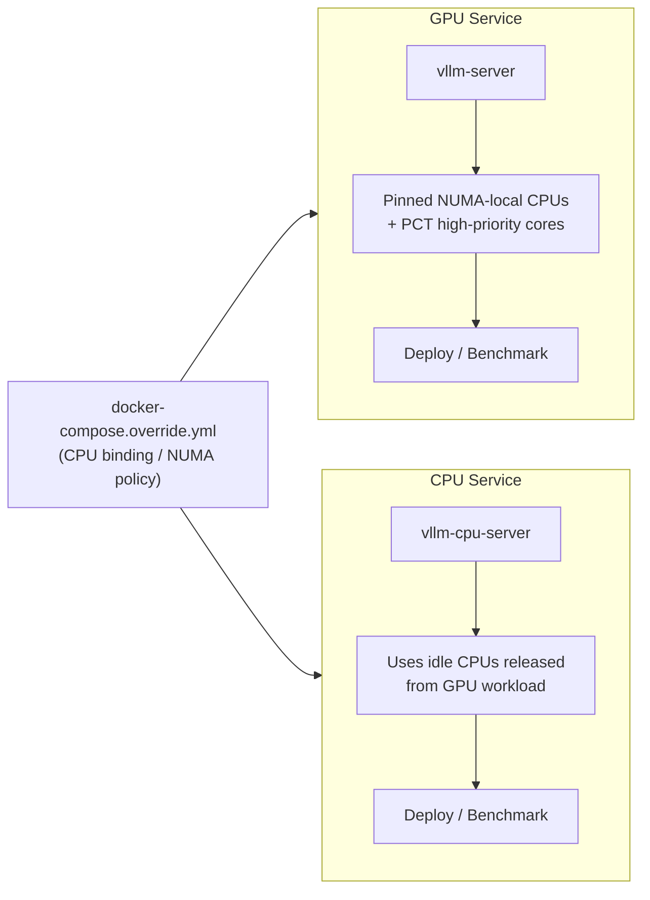

# Pinning CPU Cores for Improving vLLM Performance on GPUs

This guide explains how to pin CPU cores for GPU-based vLLM inference and reuse idle CPUs for CPU-only inference workloads.

CPU pinning improves:

- **NUMA locality** for GPU workloads
- **Latency stability** for scheduling and tokenization threads
- **System utilization** by reusing idle CPUs for CPU inference

Intel **Priority Core Turbo (PCT)** can further improve GPU inference by ensuring latency-sensitive threads run on **high‑priority turbo cores**.

The validated platform for this workflow:

- **Intel Xeon 6776P (Xeon 6 platform)**

---

## Architecture Overview



**docker-compose.override.yml** defines CPU pinning policy:

- GPU services run on **NUMA‑local CPUs**
- PCT cores are used for latency-sensitive GPU threads
- Remaining CPUs can be assigned to **CPU-only inference workloads**

---

## 0. (Optional) Enable Priority Core Turbo

Follow [Enabling Priority Core Turbo](priority_core_turbo/README.md)
to enable PCT on Intel® Xeon® 6 platforms.

After enabling PCT a CPU list file will be generated:

```bash
priority_core_turbo/results/clos0_cpulist.txt
```

This list is used for CPU binding.

---

## 1. Environment Setup

Install required dependencies:

```bash
pip install -r requirements_cpu_binding.txt
```

---

## 2. GPU vLLM Service with CPU Pinning

Generate the CPU binding configuration:

```bash
export MODEL="meta-llama/Llama-3.1-405B-Instruct"
export HF_TOKEN="<your huggingface token>"

python3 generate_cpu_binding_from_csv.py   --settings cpu_binding_gnr.csv   --output docker-compose.override.yml
```

This generates a **docker-compose.override.yml** containing cpuset rules using lookup table
inside the cpu_binding_gnr.csv file.

All **deploy** and **benchmark** runs should include this override file.

---

### Deploy Mode

Runs a persistent OpenAI‑compatible vLLM server.

```bash
MODE=deploy MODEL="meta-llama/Llama-3.1-405B-Instruct" PORT=8000 docker compose   -f docker-compose.yml   -f docker-compose.override.yml   --profile deploy up
```

Test:

```bash
curl http://localhost:8000/v1/models
```

---

### Benchmark Mode

Runs the automated benchmark driver.

```bash
MODE=benchmark docker compose   -f docker-compose.yml   -f docker-compose.override.yml   --profile benchmark up
```

Results:

```bash
benchmarks/results/
```

---

## 3. Reusing Idle CPUs for CPU vLLM

Idle CPUs released from the GPU workload can be reused for CPU inference.

Generate CPU binding including CPU service named as "vllm-cpu-server" provided in docker-compose.cpu.yml:

```bash
python3 generate_cpu_binding_from_csv.py   --settings cpu_binding_gnr.csv   --output docker-compose.override.yml   --cpuservice vllm-cpu-server
```

---

### Running GPU and CPU Together

Both GPU and CPU services can run simultaneously while sharing the same CPU binding policy.

#### Deploy Mode

```bash
MODE=deploy MODEL="meta-llama/Llama-3.1-405B-Instruct" PORT=8000 CPU_MODEL=meta-llama/Llama-3.1-8B-Instruct CPU_PORT=8001 docker compose   -f docker-compose.yml   -f docker-compose.cpu.yml   -f docker-compose.override.yml   --profile deploy up
```

Test:

```bash
curl http://localhost:8000/v1/models
curl http://localhost:8001/v1/models
```

#### Benchmark Mode

```bash
MODE=benchmark docker compose   -f docker-compose.yml   -f docker-compose.cpu.yml   -f docker-compose.override.yml   --profile benchmark up
```

Outputs:

```bash
benchmarks/results/
benchmarks/results-cpu/
```

---

## Key Takeaways

- **docker-compose.override.yml** defines NUMA-aware CPU pinning
- GPU inference uses **closest CPUs and PCT turbo cores**
- CPU inference uses **remaining idle CPUs**
- Both stacks support **deploy and benchmark workflows**
