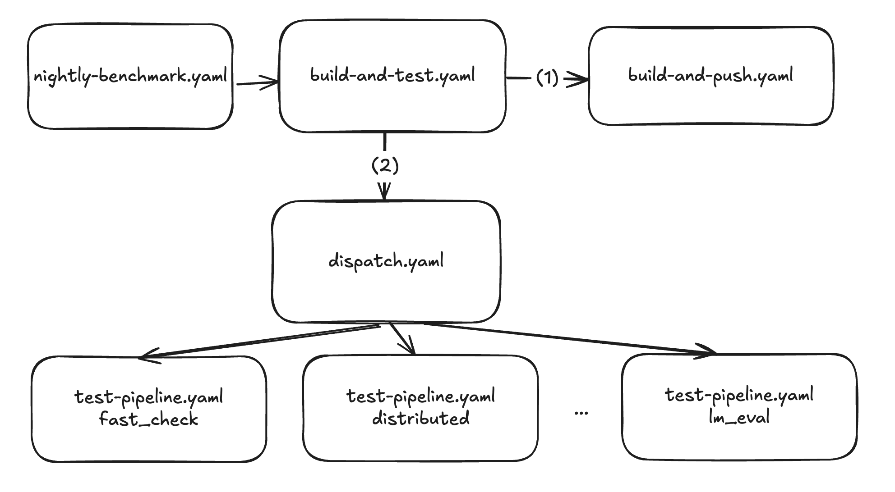

# Testing Guide (Cohere)

## TL;DR

- we have entry workflows [build-and-test](https://github.com/cohere-ai/vllm-cohere/actions/workflows/build-and-test.yaml) (feature tests), [build-and-eval](https://github.com/cohere-ai/vllm-cohere/actions/workflows/build-and-eval.yaml) (`lm_eval` / `bee_eval`), and [build-and-bench](https://github.com/cohere-ai/vllm-cohere/actions/workflows/build-and-bench.yaml) (perf benchmarks) to build docker images against a commit and run tests with those images
- the testing groups are: `cpu`, `fast_check`, `model_arch`, `quantization` (expands to `quantization_32bit_logits`), `GG_TB` (expands to `guided_generation`, `bee_sample_tb_check`), `lm_eval`, `bee_eval`, `performance`, `speculative_decoding`, `vision` (details below)
- `fast_check` and `all` also trigger CPU tests in parallel on a `ubuntu-latest` runner
- CPU tests also run automatically on every PR to `cohere` via `pr-cpu-tests.yaml`
- to kick off tests, you can use the GitHub Actions UI -> `build-and-test` / `build-and-eval` / `build-and-bench` -> new workflow, or use `gh cli`
- runner hardware options: `h100, mi300x, a100, b200, gb200, all`
- tensor parallel: omit suffix on each model to use `recommended_tp` from `tests/cohere/configs/tp_model_map.json`, or add `model:tpN` (e.g. `command-r7b_fp8:tp1`). If any entry uses `:tpN`, every entry in the same run must use the same `:tpN`.

```bash
# Run eval benchmarks (lm_eval/bee_eval); default TP per model from tp_model_map.json
gh workflow run build-and-eval.yaml --ref <sha> -f evaluations=bee_eval -f models=command-r7b_fp8

# Same run with an explicit shared TP suffix on all listed models
gh workflow run build-and-eval.yaml --ref <sha> -f evaluations=bee_eval -f models=command-r7b_fp8:tp1

# Run perf benchmarks; optional :tpN on models the same way
gh workflow run build-and-bench.yaml --ref <sha> -f benchmarks=perf_100 -f models=command-r7b_fp8:tp1

# Run feature tests (fast_check, GG_TB, speculative_decoding, etc.)
gh workflow run build-and-test.yaml --ref <sha> -f features=all

# Run on AMD GPU
gh workflow run build-and-test.yaml --ref <sha> -f gpu=mi300x -f features=fast_check

# Override the checkpoint prefix (defaults to gs://cohere-model-efficiency-ci/engines/)
gh workflow run build-and-eval.yaml --ref <sha> -f model_path=gs://cohere-model-efficiency-ci/engines/
```

- `--ref` tells GHA where to look for the workflow file and which ref to run against.
- the job will fail if any of the tests fail; for pytest based test groups you can see a summary of the output in the job UI.

NOTE: if you specify a branch in `--ref`, the workflow may fail if you make changes to the branch in the middle (between image build and test start). It is safer to use the commit sha.

## Running Tests Locally

### Prerequisites

1. **Install dependencies** (from repo root):

   ```bash
   cd tests
   bash cohere/scripts/setup_tests.sh
   ```

   This will:
   - Auto-detect your GPU platform (NVIDIA/AMD)
   - Install test dependencies
   - Reinstall vLLM in editable mode using precompiled wheels for C++/CUDA extensions
   - Apply hardware profiles from `tests/cohere/configs/hardware_profiles.yaml` via `apply_hardware_profiles.py`, exporting `VLLM_HARDWARE_PROFILE_ARGS` with the resolved CLI flags
   - This allows testing local source code changes while using optimized compiled extensions

2. **Download model checkpoints** (optional, only needed for eval/performance/guided_generation/speculative_decoding/vision tests):

   ```bash
   # Set environment variables
   export ENGINES_DIR=/root/repos/engines
   export MODELS=command-r7b_fp8,command-a_fp8,command-a-vision_fp8,command-a-reasoning_fp8,c4-25a218t_fp8,c4-25a218t_int4a16,c4-v2-25a218t_int4a16_gs32_gptq,c4-v2-25a218t_int4a16_gs32_awq_gptq,c4-25a218t_w4a8
   export HF_CACHE_DIR=/path/to/hf_cache

   # Download all models for all test groups
   bash cohere/scripts/download_checkpoints.sh models
   ```

   Note: This requires GCP authentication (`gcloud auth login`) as models are stored in `gs://cohere-model-efficiency-ci/`

### Environment Variables

Configure these environment variables to customize paths:

**Directory paths** (set in `run_tests.sh`, exported to child scripts):

- `ENGINES_DIR` - Directory for model checkpoints (default: `/root/engines`)
- `VLLM_WORKSPACE` - Path to vllm-cohere repo (default: `/vllm-workspace`)
- `BEE_DIR` - Path to bee evaluation tool (default: `/app/cohere/apiary/bee`)
- `OUTPUT_DIR` - Directory for test outputs and XML reports (default: `/root/output`)

**Test configuration:**

- `HF_CACHE_DIR` - HuggingFace cache directory (default: `/home/runner/_work/hf_cache`)
- `TP_SIZE` - Tensor parallel size for eval/performance tests (default: `1`)
- `MODELS` - Comma-separated list of models for eval/performance tests (default: `command-r7b_fp8`)
- `TEST_DATA_FILE` - Path to eval config YAML file (required for lm_eval tests)

**Hardware profile args** (set automatically by `setup_tests.sh`):

- `VLLM_HARDWARE_PROFILE_ARGS` - CLI-style engine args resolved from `tests/cohere/configs/hardware_profiles.yaml` (e.g. `--gpu-memory-utilization 0.95 --enable-chunked-prefill --cudagraph-capture-sizes 64`). Tests consume this via `test_utils_engine_args.py` helpers that merge profile defaults with test-specific overrides. See [Hardware Profiles](#hardware-profiles) below.

### Running Test Groups

All tests are run from the `tests/` directory using `run_tests.sh`:

You can also run specific pytest tests directly:

```bash
# Setup environment first
tests/cohere/scripts/setup_tests.sh

# Set environment variables as needed
export VLLM_WORKER_MULTIPROC_METHOD=spawn
export VLLM_LOGGING_LEVEL=DEBUG
```

### Examples

**Run lm_eval tests on command-a_fp8 with TP=2:**

```bash
MODELS=command-a_fp8 \
TP_SIZE=2 \
VLLM_WORKSPACE=/host/vllm-cohere \
ENGINES_DIR=/host/engines \
TEST_GROUP=lm_eval \
HF_ALLOW_CODE_EVAL=1 \
bash cohere/scripts/run_tests.sh
```

**Run multiple models in bee eval:**

```bash
MODELS=command-a_fp8,command-a-vision_fp8,c4-25a218t_fp8 \
TP_SIZE=4 \
VLLM_WORKSPACE=/host/vllm-cohere \
ENGINES_DIR=/host/engines \
TEST_GROUP=bee_eval \
bash cohere/scripts/run_tests.sh
```

**Run performance benchmarks on command-a_fp8 with TP=2:**

```bash
MODELS=command-a_fp8 \
TP_SIZE=2 \
VLLM_WORKSPACE=/host/vllm-cohere \
ENGINES_DIR=/host/engines \
TEST_GROUP=performance \
bash cohere/scripts/run_tests.sh
```

**Run fast_check on specific GPU:**

```bash
cd tests
CUDA_VISIBLE_DEVICES=2 TEST_GROUP=fast_check bash cohere/scripts/run_tests.sh
```

## Test Documentation

Test planning and compatibility tracking live in three connected documents:

| Document | Purpose |
| --- | --- |
| [`observability_matrix.md`](./observability_matrix.md) | Central registry of every test entry and benchmark metric, each with a unique `<cat>.<feat>.<seq>` ID. |
| [`feature_matrix.md`](./feature_matrix.md) | Cross-feature compatibility tables recording which test cases verify compatibility between features, inputs, hardware, etc. |
| [`features/*.md`](./features/) | Per-feature detail docs (How it runs, Checks, Measurements, Compatibility, Implementation). |

Start at the observability matrix to find a test entry, follow links to the
feature doc for details, and check the feature matrix for cross-cutting
compatibility.

## Test Groups

| Group | Duration | Description |
| ------- | ---------- | ------------- |
| `cpu` | ~5m | CPU-only tests run inside a pre-built `vllm-cpu` Docker image on `ubuntu-latest`. Triggered automatically by `fast_check` or `all`. Includes Cohere CPU tests, CPU-safe tool parsers, V1 core scheduler tests, and logits processor correctness tests. |
| `fast_check` | ~1h | Core functionality tests run on every PR. Includes V1 core tests, basic correctness, entrypoints. |
| `lm_eval` | ~15m | Run GSM8K, NIAH, metabench, RULER against Command R7B (default). Configurable via `TP_SIZE` and `MODELS`. |
| `bee_eval` | ~3h | Run bee eval tasks against multiple models. Includes lm_eval for long context tests. Configurable via `TP_SIZE` and `MODELS`. |
| `GG_TB` | ~20m | Guided generation and thinking budget regression bucket. Expands into `guided_generation`, `bee_sample_tb_check`. |
| ↳ `guided_generation` | ~10m | *(internal group, use `GG_TB` or `all`)* Guided generation tests with Command 4 and Command A models (TP=4). |
| ↳ `bee_sample_tb_check` | ~10m | *(internal group, use `GG_TB` or `all`)* Bee samples with per-task thinking budgets enabled on C5 (TP=1). Validates that `thinking_token_budget` produces passing scores. |
| `speculative_decoding` | ~15m | EAGLE speculative decoding tests, validates mean acceptance length metrics. |
| `performance` | ~1.5h | Serving benchmarks for CR7B (TP=1) or Command A (TP=2+). Configurable via `TP_SIZE` and `MODELS`. |
| `vision` | ~10m | Vision model tests with Command-A Vision, verifies multi-image input handling. |
| `model_arch` | ~10m | Model architecture regression bucket combining reward model checks and C5 sanity checks. |
| `quantization` | ~20m | Quantization regression bucket. Expands into `quantization_32bit_logits` (LM-head fp32 microbenchmark and C5 fp32 logits consistency). |
| ↳ `quantization_32bit_logits` | ~20m | *(internal group, use `quantization` or `all`)* LM-head fp32 microbenchmark (`test_logits_processor.py`) and full C5 fp32 logits consistency check (`test_c5_fp32_logits.py`). Runs on H100, A100, B200, GB200; not supported on MI300x. |

## Hardware Profiles

Engine args for vLLM tests (memory utilization, chunked prefill, cudagraph capture sizes, etc.) are centralized in `tests/cohere/configs/hardware_profiles.yaml` rather than hardcoded in each test file.

**How it works:**

1. `setup_tests.sh` runs `apply_hardware_profiles.py --gpu-type $GPU_TYPE`, which reads `hardware_profiles.yaml`, merges the `vllm-default` profile with any GPU-specific profile (e.g. `vllm-b200`), and exports the result as `VLLM_HARDWARE_PROFILE_ARGS`.
2. Tests import helpers from `tests/cohere/test_utils_engine_args.py`:
   - `get_engine_kwargs_with_overrides(test_kwargs, ...)` — for `LLM(...)` constructor tests. Returns a merged `dict`.
   - `get_async_engine_args_with_overrides(test_kwargs, ...)` — for `AsyncLLM.from_engine_args(...)` tests. Returns an `AsyncEngineArgs` instance.
3. Profile args provide defaults; test-specific kwargs always win on overlap. Both helpers log the merge result for debuggability.

**Key files:**

| File | Purpose |
| ------ | --------- |
| `tests/cohere/configs/hardware_profiles.yaml` | Declares per-GPU engine args and env vars |
| `tests/cohere/scripts/apply_hardware_profiles.py` | Reads YAML profiles, emits shell `export` statements |
| `tests/cohere/test_utils_engine_args.py` | Parses `VLLM_HARDWARE_PROFILE_ARGS` and merges with test kwargs |

**Adding or changing engine args:**

- To change a default for all tests, edit the `vllm-default` profile in `hardware_profiles.yaml`.
- To add a GPU-specific override, add/edit the matching `vllm-<gpu>` profile.
- List values (e.g. `cudagraph-capture-sizes: [1, 4, 16, 64]`) are emitted as space-separated CLI args and parsed via `nargs='+'`.

## Test Output

When `OUTPUT_DIR` is set, pytest automatically generates JUnit XML reports:

- For lm_eval tests: `${OUTPUT_DIR}/report_<config_name>_<timestamp>.xml`
- For other tests: `${OUTPUT_DIR}/report_<timestamp>.xml`

Other outputs written to `OUTPUT_DIR`:

- `eval_results_summary.json` - Bee eval results summary
- `benchmark_results_summary.json` - Performance benchmark results
- `unit_results_summary.json` - Model-architecture microbenchmark summary
- `speculative_decoding_test.log` - Speculative decoding test logs
- `co-bench` - Bee eval results in co-bench format

For GitHub Actions uploads (via `upload-results`), `result_upload_branch` controls branch routing:

- `build-and-test.yaml` default: `None` (disables uploads unless set)
- `build-and-eval.yaml` and `build-and-bench.yaml` default: `ci_dump`
- `nightly-benchmark.yaml` scheduled runs fall back to `gh-pages`; manual dispatch defaults to `ci_dump` (overridable via the `result_upload_branch` input)
- uploaded records include CI run metadata (`ci_run_id`, `ci_run_attempt`, `ci_run_number`, `ci_workflow`, `ci_run_url`)

## Runners

We currently use kubernetes for self-hosted GPU runners, where the GPUs are taken from `model-efficiency` quota. Currently there are max 1 2xH100 machine and 2 1xH100 machines (assuming quota available). The details on the machines are configured here in infra repo: [infra/k8s/actions-runners-cw-efficiency/values.yaml](https://github.com/cohere-ai/infra/blob/main/k8s/actions-runners-cw-efficiency/values.yaml)

One current limitation is that the CI runners don't have persistent storage, which means we need to save/load model checkpoints and other artifacts from cloud storage. The overall bucket for these artifacts is `gs://cohere-model-efficiency-ci` and is organized by the type of checkpoints:

1. for private models we copy the checkpoint directly to `/home/runner/_work/engines/<model-name>/` (e.g., `command-r7b_fp8`, `command-a_fp8`). The full GCS path is built as `<MODEL_PATH_PREFIX><model-name>`, where `MODEL_PATH_PREFIX` is required and passed in via workflows (typically `gs://cohere-model-efficiency-ci/engines/`). This keeps the path pattern consistent across tests.
2. for public/huggingface checkpoints we `tar` then copy the entire hf cache, then mount it in `$HF_HOME` before running tests. The reason for using `tar` is that the hf cache often has symlinks which are not handled well by `gcloud storage cp`.

When adding new checkpoints, for (1) you can just copy the artifacts to the gcp storage bucket under `<MODEL_PATH_PREFIX><model-name>`. This should be the case for majority Cohere-specific tests and changes. For (2) e.g. new tests from upstream which use new models, we need to run a one-off copy step after the test runs (reach out to Conway).

## Workflow



- [build-and-test](https://github.com/cohere-ai/vllm-cohere/actions/workflows/build-and-test.yaml) triggers image build and feature-test dispatch
- [build-and-eval](https://github.com/cohere-ai/vllm-cohere/actions/workflows/build-and-eval.yaml) triggers image build and eval dispatch (`lm_eval`, `bee_eval`)
- [build-and-bench](https://github.com/cohere-ai/vllm-cohere/actions/workflows/build-and-bench.yaml) triggers image build and perf dispatch
- [dispatcher](https://github.com/cohere-ai/vllm-cohere/actions/workflows/dispatcher.yaml) decides which test groups to run on which runners (based on `runner_map.json` and `tp_model_map.json`), and calls (one or more instances of):
- [test-pipeline](https://github.com/cohere-ai/vllm-cohere/actions/workflows/test-pipeline.yaml) which contains shared test setup, runs the test script `run_tests.sh`, and does optional post-processing

## Adding Tests

For adding new tests, there are a few options:

1. Add to existing group (if it fits the category); just append the pytest command under the test group definition in `tests/cohere/scripts/run_tests.sh`
2. Create new group; follow the existing template and create a new test group. Make sure to add in `run_tests.sh` as well as workflow files so the dispatcher can see the new group. Also specify the test_group to runner mapping in `runner_map.json` and model compatibility in `tp_model_map.json`.
3. Add new model: upload checkpoint to GCS bucket under `<MODEL_PATH_PREFIX><model-name>`, update `tp_model_map.json` (specify per device type and per model TP constraints via `minimum_tp` and `recommended_tp`), and optionally `model_eval_map.json` for lm-eval tests; `eval-config.json` for bee eval tests. If you want to verify the bee eval results, add the ground truth values in `bee_tasks/ground_truths.json`.

We prefer to add new python/pytest file instead of modifying existing ones since that will make upstream merges easier, and have a clear separation between core vLLM tests and Cohere-specific tests.
