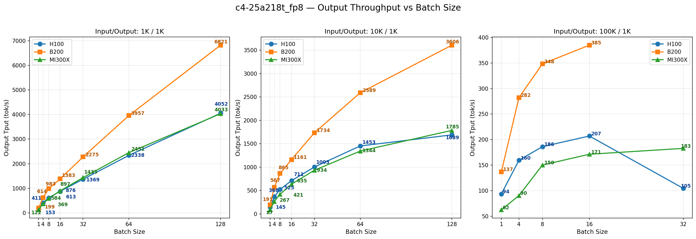
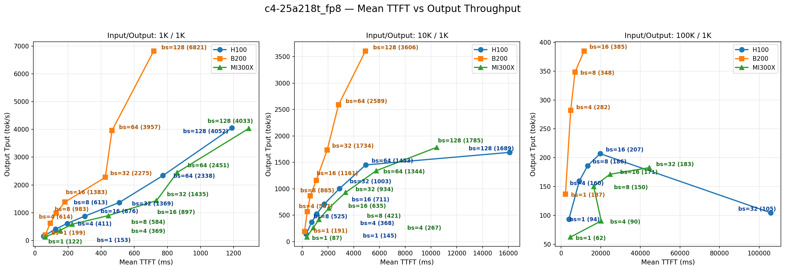
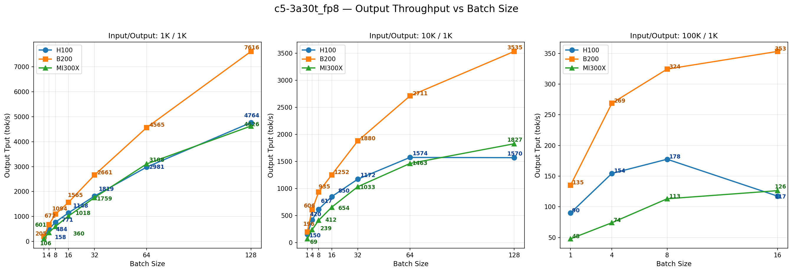
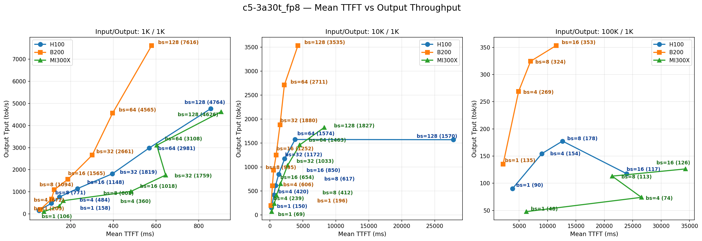

# Serving Performance Benchmarks

Auto-generated charts comparing serving throughput and latency across H100, B200, and MI300X devices.

Input/output shapes: 1K/1K, 10K/1K, 100K/1K (all with output length 1000). Values are medians of up to the last 5 CI benchmark runs.

## c4-25a218t_fp8 (TP=4)

### Throughput vs Batch Size

### TTFT vs Throughput

## c5-3a30t_fp8 (TP=1)

### Throughput vs Batch Size

### TTFT vs Throughput

