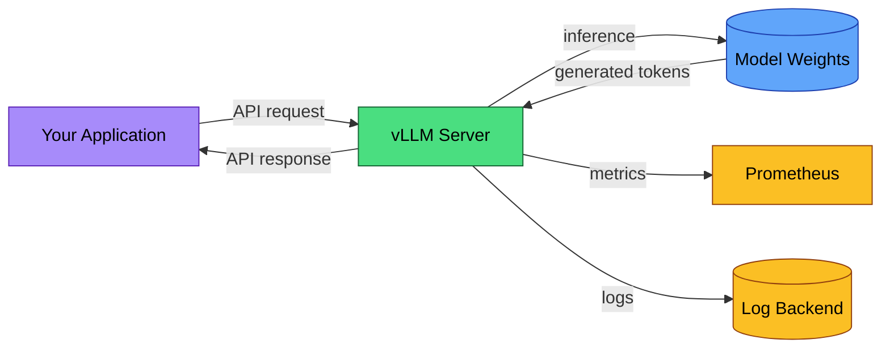

# EU AI Act Compliance Guide for vLLM Deployers

vLLM is inference infrastructure. It takes model weights, serves them over an OpenAI-compatible API, and handles the scheduling, batching, and memory management that make high-throughput serving possible. It does not train models. It does not make decisions. But the system you build on top of it might.

When you self-host a model with vLLM, you become the **provider** of that AI system under the EU AI Act. There is no upstream API vendor absorbing compliance obligations on your behalf. Every requirement lands on you.

This guide maps vLLM's existing capabilities to EU AI Act obligations and identifies what you need to add.

## Is your system in scope?

Articles 12, 13, and 14 apply only to **high-risk AI systems** as defined in Annex III. Most vLLM deployments (internal tools, chatbots, code assistants, content generation) are not high-risk.

Your system is likely high-risk if it is used for:
- **Recruitment or HR decisions** (screening CVs, evaluating candidates, task allocation)
- **Credit scoring or insurance pricing**
- **Law enforcement or border control**
- **Critical infrastructure management** (energy, water, transport)
- **Education assessment** (grading, admissions)
- **Access to essential public services**

If your use case does not fall under Annex III, the high-risk obligations (Articles 9-15) do not apply via the Annex III pathway, though risk classification is context-dependent. **Do not self-classify without legal review.** You still have obligations under **Article 50** (transparency for systems interacting directly with users) and **GDPR** (if processing personal data). Those are your baseline. Read the relevant sections below.

## How vLLM fits

vLLM is the inference engine layer. It sits between your application code and the model weights on disk (or in GPU memory). Understanding where it falls in your architecture determines which compliance obligations attach to it directly versus to surrounding systems.

**What vLLM does:**
- Loads model weights and serves them via an OpenAI-compatible HTTP API
- Handles continuous batching, PagedAttention memory management, and tensor parallelism
- Exposes `/v1/chat/completions`, `/v1/completions`, `/v1/embeddings`, and `/v1/models` endpoints
- Supports streaming and non-streaming responses
- Provides Prometheus metrics on a `/metrics` endpoint
- Supports structured output (JSON mode, grammar-guided decoding), tool calling, and function calling

**What vLLM does not do:**
- Store conversation history or user data persistently
- Make autonomous decisions based on model output
- Apply content moderation or safety filtering (that is your application layer)
- Log request/response content by default

This distinction matters. vLLM gives you the serving infrastructure. Compliance is about what you build around it.

## Data flow diagram



Unlike gateway architectures (LiteLLM, Portkey) where requests fan out to multiple third-party providers, vLLM's data flow is local. Prompts go in, tokens come out. No data leaves your infrastructure unless your application layer sends it somewhere.

This is the core compliance advantage of self-hosting with vLLM: **you control the entire data path**.

## Article 12: Record-keeping

Article 12 requires automatic event recording for the lifetime of high-risk AI systems. vLLM provides two categories of observability: Prometheus metrics (quantitative) and request logging (qualitative). Neither is sufficient alone.

### What Prometheus metrics cover

vLLM exposes metrics on the `/metrics` endpoint with the `vllm:` prefix. These are available by default when running the OpenAI-compatible server.

| Metric | Type | What it measures |
|--------|------|-----------------|
| `vllm:e2e_request_latency_seconds` | Histogram | End-to-end request latency |
| `vllm:time_to_first_token_seconds` | Histogram | Time to first token (TTFT) |
| `vllm:inter_token_latency_seconds` | Histogram | Inter-token latency |
| `vllm:request_prompt_tokens` | Histogram | Input token counts per request |
| `vllm:request_generation_tokens` | Histogram | Output token counts per request |
| `vllm:request_success_total` | Counter | Completed requests by finish reason |
| `vllm:num_requests_running` | Gauge | Requests currently in RUNNING state |
| `vllm:num_requests_waiting` | Gauge | Requests currently in WAITING state |
| `vllm:num_requests_swapped` | Gauge | Requests currently in SWAPPED state |
| `vllm:gpu_cache_usage_perc` | Gauge | GPU KV cache utilization |
| `vllm:request_prefill_time_seconds` | Histogram | Prefill phase duration |
| `vllm:request_decode_time_seconds` | Histogram | Decode phase duration |

All metrics include a `model_name` label.

### What Prometheus metrics do NOT cover

Prometheus metrics capture operational telemetry: latency distributions, throughput, resource utilization. They do not capture:

- **Prompt content** (what the user sent)
- **Response content** (what the model generated)
- **User identity** (who made the request)
- **Request parameters** (temperature, top_p, max_tokens, system prompt)
- **Per-request traceability** (linking a specific input to a specific output)

Article 12 requires all of these for high-risk systems. Prometheus gives you system health. Compliance requires content-level audit trails.

### Mapping to Article 12 requirements

| Article 12 Requirement | vLLM Feature | Status |
|------------------------|-------------|--------|
| Event timestamps | Prometheus scrape timestamps; request logs | **Partial** |
| Model version tracking | `--served-model-name` + `model_name` metric label | **Covered** |
| Input content logging | Not logged by default | **Gap** |
| Output content logging | `VLLM_DEBUG_LOG_API_SERVER_RESPONSE=true` (debug only) | **Gap** |
| Token consumption | `vllm:request_prompt_tokens`, `vllm:request_generation_tokens` | **Covered** |
| Error recording | `vllm:request_success_total` by finish reason; server logs | **Covered** |
| Operation latency | `vllm:e2e_request_latency_seconds` | **Covered** |
| User identification | Not tracked by vLLM; must come from your app layer | **Gap** |
| Request parameters | Not logged by default | **Gap** |
| Data retention (6+ months) | No built-in persistence; your responsibility | **Gap** |
| Request traceability | `--enable-request-id-headers` adds `X-Request-Id` | **Available** |

vLLM covers approximately 40% of Article 12 requirements out of the box. The critical gap is **content logging**: vLLM does not persistently record what goes in or what comes out. You must build this.

## Configuring compliant logging

### Step 1: Enable request ID tracking

```bash
vllm serve meta-llama/Llama-3.1-8B-Instruct \\
  --enable-request-id-headers
```

This adds an `X-Request-Id` header to every response. If the client sends an `X-Request-Id` header, vLLM uses it; otherwise, vLLM generates a UUID. This is the correlation key for your audit trail.

### Step 2: Enable request logging

By default, vLLM logs metadata about each request. Ensure this is not disabled:

```bash
# Do NOT pass --disable-log-requests in production compliance deployments
vllm serve meta-llama/Llama-3.1-8B-Instruct \\
  --enable-request-id-headers \\
  --max-log-len 1000
```

The `--max-log-len` flag controls how much of the request is logged. Set it high enough to capture meaningful content for audit purposes.

### Step 3: Build a compliance logging middleware

vLLM supports custom ASGI middleware via the `--middleware` flag. This is where you capture the full request/response content that Prometheus does not provide.

```python
# compliance_middleware.py
import json
import time
import logging
import uuid
from starlette.middleware.base import BaseHTTPMiddleware
from starlette.requests import Request
from starlette.responses import Response, StreamingResponse

logger = logging.getLogger("compliance")

class ComplianceLoggingMiddleware(BaseHTTPMiddleware):
    """
    Captures full request/response content for Article 12 compliance.
    Logs to a structured JSON format suitable for audit backends.
    Handles both streaming and non-streaming responses.
    """

    AUDITABLE_PATHS = {"/v1/chat/completions", "/v1/completions", "/v1/embeddings"}

    async def dispatch(self, request: Request, call_next):
        if request.url.path not in self.AUDITABLE_PATHS:
            return await call_next(request)

        request_id = request.headers.get("x-request-id", str(uuid.uuid4()))
        start_time = time.time()

        # Capture request body
        body_bytes = await request.body()
        request_body = json.loads(body_bytes) if body_bytes else {}
        is_streaming = request_body.get("stream", False)

        response = await call_next(request)

        def build_audit_record(output_data, end_time):
            return {
                "request_id": request_id,
                "timestamp": time.strftime("%Y-%m-%dT%H:%M:%SZ", time.gmtime(start_time)),
                "latency_ms": round((end_time - start_time) * 1000, 2),
                "endpoint": request.url.path,
                "model": request_body.get("model", "unknown"),
                "parameters": {
                    "temperature": request_body.get("temperature"),
                    "max_tokens": request_body.get("max_tokens"),
                    "top_p": request_body.get("top_p"),
                    "stream": is_streaming,
                },
                "input": request_body.get("messages") or request_body.get("prompt"),
                "output": output_data,
                "user": request_body.get("user"),
                "status_code": response.status_code,
            }

        if is_streaming:
            # Wrap the stream: yield chunks to client while accumulating for audit
            async def logging_iterator():
                response_body = b""
                async for chunk in response.body_iterator:
                    response_body += chunk if isinstance(chunk, bytes) else chunk.encode()
                    yield chunk
                # Log after stream completes
                record = build_audit_record(
                    response_body.decode("utf-8", errors="ignore"), time.time()
                )
                logger.info(json.dumps(record))

            return StreamingResponse(
                content=logging_iterator(),
                status_code=response.status_code,
                headers=dict(response.headers),
                media_type=response.media_type,
            )

        # Non-streaming: consume body, log, return new Response
        response_body = b""
        async for chunk in response.body_iterator:
            response_body += chunk if isinstance(chunk, bytes) else chunk.encode()

        record = build_audit_record(
            json.loads(response_body) if response_body else None, time.time()
        )
        logger.info(json.dumps(record))

        return Response(
            content=response_body,
            status_code=response.status_code,
            headers=dict(response.headers),
            media_type=response.media_type,
        )
```

Deploy it:

```bash
vllm serve meta-llama/Llama-3.1-8B-Instruct \\
  --enable-request-id-headers \\
  --middleware compliance_middleware.ComplianceLoggingMiddleware
```

> **Note on streaming:** The middleware above handles both streaming and non-streaming responses. For streaming (`"stream": true`), it wraps the response body iterator to yield chunks to the client in real time while accumulating them for the audit log. This adds minimal memory overhead proportional to response size. For very high-throughput streaming deployments, consider logging at the application layer instead to avoid per-chunk accumulation.

### Step 4: Configure log persistence

vLLM does not store logs persistently. Route your compliance logs to a durable backend with a retention policy:

- **Minimum 6 months** for deployers (Article 26(5))
- **Minimum 10 years** for providers (Article 18)

Options: Elasticsearch, Loki, S3 + Athena, PostgreSQL, or any append-only store with retention policies. The middleware above outputs structured JSON; pipe it to your preferred sink.

### Step 5: YAML configuration for reproducibility

Document your vLLM configuration in a YAML file for audit purposes:

```yaml
# vllm-config.yaml
# Article 12: Configuration that forms part of the audit trail.

model: meta-llama/Llama-3.1-8B-Instruct
served-model-name: ["llama-3.1-8b"]
api-key: "${VLLM_API_KEY}"
host: "0.0.0.0"
port: 8000

# Observability
enable-request-id-headers: true
disable-log-requests: false
disable-log-stats: false
max-log-len: 2000

# Middleware
middleware: ["compliance_middleware.ComplianceLoggingMiddleware"]

# Hardware
tensor-parallel-size: 1
gpu-memory-utilization: 0.90
```

Launch with:

```bash
vllm serve --config vllm-config.yaml
```

## Article 13: Transparency

When you self-host a model with vLLM, you are the provider. There is no OpenAI or Anthropic Terms of Service to point to. You must produce and maintain the transparency documentation yourself.

Article 13 requires that users of high-risk systems receive:

1. **System identity and purpose**: What model is running, what it is intended to do, and what it should not be used for
2. **Capabilities and limitations**: Known failure modes, hallucination tendencies, languages supported, context window limits
3. **Training data summary**: What the model was trained on (source this from the model card; for Llama models, see Meta's documentation)
4. **Interpretation guidance**: How to read and act on model outputs; confidence signals if available

What vLLM contributes:
- `--served-model-name` identifies the model in every API response
- The `/v1/models` endpoint lists all available models
- Structured output (JSON mode, guided decoding) makes outputs machine-parseable, which supports downstream interpretation

What you must add:
- A model card or system documentation page covering items 1-4 above
- Version tracking: when you update model weights, document the change
- User-facing documentation accessible to non-technical stakeholders

## Article 14: Human oversight

Article 14 requires that high-risk AI systems are designed so that **natural persons** can effectively oversee them. This means human actors who can interpret outputs, decide not to use them, and intervene or halt the system.

vLLM's automated controls (rate limiting via `--max-num-seqs`, API key authentication via `--api-key`, structured output constraints) are **technical safeguards** under Articles 9 and 15. They are not human oversight.

What Article 14 requires and where it lives in a vLLM deployment:

| Requirement | What it means | Where it lives |
|-------------|---------------|----------------|
| Interpret outputs | A person reviews model output before it acts | Your application layer |
| Decide not to use | A person can reject a model recommendation | Your application layer |
| Intervene / halt | A person can stop the system mid-operation | Server admin: stop the vLLM process, revoke API key, or use a circuit breaker in your app |
| Understand limitations | Oversight personnel know what the model can and cannot do | Training and documentation (Article 13 deliverables) |
| Escalation | Flagged outputs route to human review | Your application layer; vLLM middleware can trigger flags but cannot route to humans |

vLLM provides the **infrastructure** for human oversight: logged outputs that humans can review, API keys that can be revoked, a server process that can be stopped. The oversight logic (review queues, approval workflows, human-in-the-loop gates) is your responsibility.

### Practical pattern: human-in-the-loop with vLLM

```
User request
    |
    v
Your Application (pre-check: is this a high-risk decision?)
    |                          |
    v                          v
  Low-risk path            High-risk path
    |                          |
    v                          v
  vLLM inference           vLLM inference
    |                          |
    v                          v
  Return to user           Queue for human review
                               |
                               v
                           Human approves / rejects / edits
                               |
                               v
                           Return to user (with audit log entry)
```

The branching logic lives in your application, not in vLLM. vLLM serves both paths identically.

## Article 50: User disclosure

Article 50 applies to **all** AI systems that interact directly with natural persons, not only high-risk systems. If a user is chatting with a model served by vLLM and does not know they are talking to an AI, you are in violation.

Requirements:
1. **Inform users** that they are interacting with an AI system (before or at the start of interaction)
2. **Mark AI-generated content** when it could be mistaken for human-created content (text, images, audio, video)
3. **Label deepfakes** clearly when generating synthetic media

vLLM does not provide user-facing disclosure mechanisms. It is a backend server. Disclosure must happen at the interface layer:

```python
# Example: Adding disclosure to your API wrapper
from openai import OpenAI

client = OpenAI(base_url="http://localhost:8000/v1", api_key="your-key")

SYSTEM_DISCLOSURE = (
    "You are an AI assistant powered by [Model Name], "
    "served via vLLM. Your responses are generated by a "
    "large language model and should be verified by a human "
    "for critical decisions."
)

response = client.chat.completions.create(
    model="llama-3.1-8b",
    messages=[
        {"role": "system", "content": SYSTEM_DISCLOSURE},
        {"role": "user", "content": user_message},
    ],
)

# Include disclosure metadata in your UI response
result = {
    "content": response.choices[0].message.content,
    "disclosure": {
        "ai_generated": True,
        "model": response.model,
        "request_id": response.id,
    },
}
```

The disclosure must be visible to the end user. A system prompt alone is insufficient if the user never sees it. Your frontend must surface the `ai_generated` flag.

## GDPR considerations

Self-hosting with vLLM gives you a structural advantage: **no cross-border data transfer by default**. Prompts never leave your infrastructure. This eliminates the need for Standard Contractual Clauses, adequacy decisions, or Transfer Impact Assessments that apply when using US-based API providers.

But data protection obligations still apply in full:

1. **Legal basis** (Article 6): Document why you process user prompts. Consent, legitimate interest, and contractual necessity are the common bases.

2. **Data minimization** (Article 5(1)(c)): Log what compliance requires, not everything. If you do not need prompt content for Article 12, do not store it.

3. **Storage limitation** (Article 5(1)(e)): Define retention periods. Article 12 compliance logs need 6+ months; GDPR says delete when no longer necessary. These can conflict. Document your rationale.

4. **Data Protection Impact Assessment** (Article 35): Required if your AI system processes personal data at scale or makes decisions affecting individuals. Self-hosting does not exempt you.

5. **Record of Processing Activities** (Article 30): Document each processing activity involving personal data.

6. **Right to erasure** (Article 17): If a user requests deletion, you must remove their data from compliance logs unless retention is legally required. Document this exception.

### Where GDPR risk re-emerges

Self-hosting eliminates transfer risk only if:
- Model weights are stored on your infrastructure (not streamed from a remote API)
- Compliance logs stay in your jurisdiction
- You do not send prompts or responses to external monitoring services (Datadog US, Langfuse Cloud, etc.)

If your Prometheus or logging backend is hosted outside the EU, you have reintroduced cross-border transfer.

Generate a GDPR Article 30 data flow map:

```bash
pip install ai-trace-auditor
aitrace flow ./your-vllm-deployment -o data-flows.md
```

## Full compliance scan

Run a complete EU AI Act compliance scan against your vLLM deployment codebase:

```bash
pip install ai-trace-auditor

# Scan your deployment code (application layer + vLLM config)
aitrace comply ./your-vllm-deployment --split -o compliance/
```

This generates:
- `compliance/annex-iv.md` -- Technical documentation (Article 11)
- `compliance/audit-trail.md` -- Record-keeping assessment (Article 12)
- `compliance/data-flows.md` -- Data flow mapping (Article 13 + GDPR Article 30)
- `compliance/user-disclosure.md` -- Transparency obligations (Article 50)

Review each file. The scanner identifies what your codebase provides and what is missing. It cannot assess your organizational processes (human oversight procedures, staff training, incident response), which are also required for high-risk systems.

## Resources

- [EU AI Act full text](https://artificialintelligenceact.eu/)
- [vLLM documentation](https://docs.vllm.ai/en/stable/)
- [vLLM metrics reference](https://docs.vllm.ai/en/stable/design/metrics/)
- [vLLM server arguments](https://docs.vllm.ai/en/stable/cli/serve/)
- [vLLM logging configuration](https://docs.vllm.ai/en/latest/examples/others/logging_configuration/)
- [vLLM environment variables](https://docs.vllm.ai/en/stable/configuration/env_vars/)
- [AI Trace Auditor](https://github.com/BipinRimal314/ai-trace-auditor) -- open-source compliance scanning

---

*This guide was generated with assistance from [AI Trace Auditor](https://github.com/BipinRimal314/ai-trace-auditor) and reviewed for accuracy. It is not legal advice. Consult a qualified professional for compliance decisions.*
