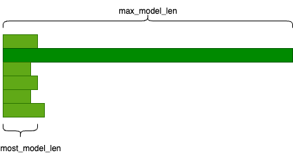

# TPU Optimization Tips

This doc serves as a collection of handy tips for optimizing your vLLM on TPU workload.

## Get started

Looking for setup and installation instructions? Find them [here](https://docs.vllm.ai/projects/tpu/en/latest/getting_started/installation/).

### TPU workload sizing

When selecting the ideal number of chips for a single serving instance, it's important to account for both the model size and the average request context length. Adequate HBM for the KV cache is essential to ensure a sufficient number of concurrent requests can be processed.

The following colab [calculator](https://colab.research.google.com/github/ericehanley/rightsize-vllm/blob/main/HBM_Calculator.ipynb) will tell you:

- KV cache size requirement per token and per request
- TPU/GPU memory consumed by the model weights
- TPU/GPU memory allocated for the KV cache
- Maximum \# of requests you can approximately set (--max-num-seqs)

This approach serves as a general rule of thumb.

#### Latency-throughput tradeoff

As with rightsizing the number of chips for your workload, consider adjusting `--max-num-seqs` to fine-tune the latency-throughput balance. Decreasing `--max-num-seqs` and/or increasing the number of chips can help reduce latency.

`--max-num-seqs` defines the number of concurrent decode slots, effectively limiting the number of requests the server can process tokens for simultaneously. Increasing this value allows the server to pre-allocate more HBM to handle a higher number of concurrent requests, which can maximize overall throughput. However, this often increases the end-to-end (e2e) latency per request.

Therefore, carefully tuning `--max-num-seqs` is crucial to achieving the desired balance between latency and throughput for your specific workload.

In a similar way, `--max-num-batch-tokens` can be adjusted down to improve latency, or adjusted up to improve throughput.

#### Compilation and Caching

Coming from a GPU background, one of the key differences you'll notice with TPUs is an initial compilation step. TPUs are specialized accelerators (ASICs) that achieve maximum performance by executing pre-compiled, static computation graphs via the XLA compiler. Unlike GPUs, which can handle dynamic input shapes more flexibly, TPUs require a specific compiled graph for each tensor shape (e.g., batch size and sequence length) they process.

To manage this, vLLM performs a one-time "warmup" process when you first launch the server. During this phase, it pre-compiles the model for various common input shapes and saves these compiled graphs to a cache on disk or remote storage (located at `~/.cache/vllm/xla_cache` by default). This process can range significantly, anywhere from a few minutes to an hour depending on the size of the model and context length used.

Although the first compilation can take some time, for all subsequent server launches, vLLM can load these graphs directly from the cache, eliminating the compilation time for future runs.

Use `VLLM_XLA_CACHE_PATH` environment variable to write to shareable storage for future deployed nodes (like when using autoscaling).

#### Reducing compilation time

This initial compilation time ranges significantly and is impacted by many of the arguments discussed in this optimization doc. Factors that influence the length of time to compile are things like model size and `--max-num-batch-tokens`. Other arguments you can tune are things like `VLLM_TPU_MOST_MODEL_LEN`.

### Optimize based on your data

#### max-model-len vs. most-model-len

If most of your requests are shorter than the maximum model length but you still need to accommodate occasional longer requests, setting a high maximum model length can negatively impact performance. In these cases, you can try introducing most-model-len by specifying the `VLLM_TPU_MOST_MODEL_LEN` environment variable.

For example, 1% requests are 32k length and 99% requests are 2k length. You can pass 32k into `--max-model-len 32768` and use `VLLM_TPU_MOST_MODEL_LEN=2048`.

The requests get subdivided into max-model-len and most-model-len categories, for the latter category, you can gain better performance since the server can process more requests at a time.

#### Padding

For online serving with latency requirements, consider switching to bucket padding by setting the `VLLM_TPU_BUCKET_PADDING_GAP` environment variable. Because of the layout of the TPU, try using increments of 128 (e.g., 128, 256, etc.)

The server pads the requests into fixed lengths before sending them to the model to avoid recompilation. To read more about TPU padding, see [here](https://cloud.google.com/tpu/docs/performance-guide#xla-efficiencies). Currently, there are 2 ways to pad the requests:

1. the default exponential padding (pad to the nearest power of 2)
2. bucket padding (pad to the nearest linearly increasing bucket).

When using bucket padding, the buckets start from 16, end at max_model_len, and increment by `VLLM_TPU_BUCKET_PADDING_GAP`.

For example, max_model_len=512, padding_gap=64, the buckets will be [16, 32, 64, 128, 192, 256, 320, 384, 448, 512].

The fewer tokens you pad, the less unnecessary computation TPU does, the better performance you can get. For example, if num_tokens=300, with exponential padding, you pad to 512, with the bucket_padding above, you pad to 320.

However, you need to be careful to choose the padding gap. If the gap is too small, it means the number of buckets is large, leading to increased warmup (precompile) time and higher memory to store the compiled graph. Too many compiled graphs may lead to HBM OOM. Conversely, an overly large gap yields no performance improvement compared to the default exponential padding.

#### Quantization

If possible, use the precision that matches the chip’s hardware acceleration:

- v5e has int4/int8 hardware acceleration in the MXU
- v6e has int4/int8 hardware acceleration in the MXU

Supported quantized formats and features in vLLM on TPU [Jul '25]:

- INT8 W8A8
- INT8 W8A16
- FP8 KV cache
- [WIP] FP8 W8A8
- [WIP] AWQ
- [WIP] FP4 W4A8

#### Parallelization

Don't set TP to be less than the number of chips on a single-host deployment.

Although it’s common to do this with GPUs, don't try to fragment 2 or 8 different workloads across 8 chips on a single host. If you need 1 or 4 chips, just create an instance with 1 or 4 chips (these are partial-host machine types).

### Tune your workloads

Although we try to have great default configs, we strongly recommend you check out the [vLLM auto-tuner](../../benchmarks/auto_tune/README.md) to optimize your workloads for your use case.

### Future Topics We'll Cover

#### Profiling

The auto-tuner provides a profile of optimized configurations as its final step. However, interpreting this profile can be challenging for new users. We plan to expand this section in the future with more detailed guidance. In the meantime, you can learn how to collect a TPU profile using vLLM's native profiling tools [here](../examples/offline_inference/profiling_tpu.md). This profile can provide valuable insights into your workload's performance.

#### SPMD

More details to come.

**Want us to cover something that isn't listed here? Open up an issue please and cite this doc. We'd love to hear your questions or tips.**
