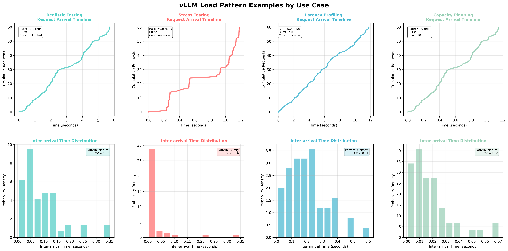

# Benchmark Suites

vLLM provides comprehensive benchmarking tools for performance testing and evaluation:

- **[Benchmark CLI](#benchmark-cli)**: `vllm bench` CLI tools and specialized benchmark scripts for interactive performance testing
- **[Parameter sweeps](#parameter-sweeps)**: Automate `vllm bench` runs for multiple configurations
- **[Performance benchmarks](#performance-benchmarks)**: Automated CI benchmarks for development
- **[Nightly benchmarks](#nightly-benchmarks)**: Comparative benchmarks against alternatives

[Benchmark CLI]: #benchmark-cli

## Benchmark CLI

This section guides you through running benchmark tests with the extensive
datasets supported on vLLM. It's a living document, updated as new features and datasets
become available.

### Dataset Overview

<style>
th {
  min-width: 0 !important;
}
</style>

| Dataset | Online | Offline | Data Path |
|---------|--------|---------|-----------|
| ShareGPT | ✅ | ✅ | `wget https://huggingface.co/datasets/anon8231489123/ShareGPT_Vicuna_unfiltered/resolve/main/ShareGPT_V3_unfiltered_cleaned_split.json` |
| ShareGPT4V (Image) | ✅ | ✅ | `wget https://huggingface.co/datasets/Lin-Chen/ShareGPT4V/resolve/main/sharegpt4v_instruct_gpt4-vision_cap100k.json`<br>Note that the images need to be downloaded separately. For example, to download COCO's 2017 Train images:<br>`wget http://images.cocodataset.org/zips/train2017.zip` |
| ShareGPT4Video (Video) | ✅ | ✅ | `git clone https://huggingface.co/datasets/ShareGPT4Video/ShareGPT4Video` |
| BurstGPT | ✅ | ✅ | `wget https://github.com/HPMLL/BurstGPT/releases/download/v1.1/BurstGPT_without_fails_2.csv` |
| Sonnet (deprecated) | ✅ | ✅ | Local file: `benchmarks/sonnet.txt` |
| Random | ✅ | ✅ | `synthetic` |
| RandomMultiModal (Image/Video) | 🟡 | 🚧 | `synthetic` |
| RandomForReranking | ✅ | ✅ | `synthetic` |
| Prefix Repetition | ✅ | ✅ | `synthetic` |
| HuggingFace-VisionArena | ✅ | ✅ | `lmarena-ai/VisionArena-Chat` |
| HuggingFace-MMVU | ✅ | ✅ | `yale-nlp/MMVU` |
| HuggingFace-InstructCoder | ✅ | ✅ | `likaixin/InstructCoder` |
| HuggingFace-AIMO | ✅ | ✅ | `AI-MO/aimo-validation-aime`, `AI-MO/NuminaMath-1.5`, `AI-MO/NuminaMath-CoT` |
| HuggingFace-Other | ✅ | ✅ | `lmms-lab/LLaVA-OneVision-Data`, `Aeala/ShareGPT_Vicuna_unfiltered` |
| HuggingFace-MTBench | ✅ | ✅ | `philschmid/mt-bench` |
| HuggingFace-Blazedit | ✅ | ✅ | `vdaita/edit_5k_char`, `vdaita/edit_10k_char` |
| Spec Bench | ✅ | ✅ | `wget https://raw.githubusercontent.com/hemingkx/Spec-Bench/refs/heads/main/data/spec_bench/question.jsonl` |
| Custom | ✅ | ✅ | Local file: `data.jsonl` |

Legend:

- ✅ - supported
- 🟡 - Partial support
- 🚧 - to be supported

!!! note
    HuggingFace dataset's `dataset-name` should be set to `hf`.
    For local `dataset-path`, please set `hf-name` to its Hugging Face ID like

    ```bash
    --dataset-path /datasets/VisionArena-Chat/ --hf-name lmarena-ai/VisionArena-Chat
    ```

### Examples

#### 🚀 Online Benchmark

<details class="admonition abstract" markdown="1">
<summary>Show more</summary>

First start serving your model:

```bash
vllm serve NousResearch/Hermes-3-Llama-3.1-8B
```

Then run the benchmarking script:

```bash
# download dataset
# wget https://huggingface.co/datasets/anon8231489123/ShareGPT_Vicuna_unfiltered/resolve/main/ShareGPT_V3_unfiltered_cleaned_split.json
vllm bench serve \
  --backend vllm \
  --model NousResearch/Hermes-3-Llama-3.1-8B \
  --endpoint /v1/completions \
  --dataset-name sharegpt \
  --dataset-path <your data path>/ShareGPT_V3_unfiltered_cleaned_split.json \
  --num-prompts 10
```

If successful, you will see the following output:

```text
============ Serving Benchmark Result ============
Successful requests:                     10
Benchmark duration (s):                  5.78
Total input tokens:                      1369
Total generated tokens:                  2212
Request throughput (req/s):              1.73
Output token throughput (tok/s):         382.89
Total Token throughput (tok/s):          619.85
---------------Time to First Token----------------
Mean TTFT (ms):                          71.54
Median TTFT (ms):                        73.88
P99 TTFT (ms):                           79.49
-----Time per Output Token (excl. 1st token)------
Mean TPOT (ms):                          7.91
Median TPOT (ms):                        7.96
P99 TPOT (ms):                           8.03
---------------Inter-token Latency----------------
Mean ITL (ms):                           7.74
Median ITL (ms):                         7.70
P99 ITL (ms):                            8.39
==================================================
```

##### Custom Dataset

If the dataset you want to benchmark is not supported yet in vLLM, even then you can benchmark on it using `CustomDataset`. Your data needs to be in `.jsonl` format and needs to have "prompt" field per entry, e.g., data.jsonl

```json
{"prompt": "What is the capital of India?"}
{"prompt": "What is the capital of Iran?"}
{"prompt": "What is the capital of China?"}
```

```bash
# start server
vllm serve meta-llama/Llama-3.1-8B-Instruct
```

```bash
# run benchmarking script
vllm bench serve --port 9001 --save-result --save-detailed \
  --backend vllm \
  --model meta-llama/Llama-3.1-8B-Instruct \
  --endpoint /v1/completions \
  --dataset-name custom \
  --dataset-path <path-to-your-data-jsonl> \
  --custom-skip-chat-template \
  --num-prompts 80 \
  --max-concurrency 1 \
  --temperature=0.3 \
  --top-p=0.75 \
  --result-dir "./log/"
```

You can skip applying chat template if your data already has it by using `--custom-skip-chat-template`.

##### VisionArena Benchmark for Vision Language Models

```bash
# need a model with vision capability here
vllm serve Qwen/Qwen2-VL-7B-Instruct
```

```bash
vllm bench serve \
  --backend openai-chat \
  --model Qwen/Qwen2-VL-7B-Instruct \
  --endpoint /v1/chat/completions \
  --dataset-name hf \
  --dataset-path lmarena-ai/VisionArena-Chat \
  --hf-split train \
  --num-prompts 1000
```

##### InstructCoder Benchmark with Speculative Decoding

``` bash
vllm serve meta-llama/Meta-Llama-3-8B-Instruct \
    --speculative-config $'{"method": "ngram",
    "num_speculative_tokens": 5, "prompt_lookup_max": 5,
    "prompt_lookup_min": 2}'
```

``` bash
vllm bench serve \
    --model meta-llama/Meta-Llama-3-8B-Instruct \
    --dataset-name hf \
    --dataset-path likaixin/InstructCoder \
    --num-prompts 2048
```

##### Spec Bench Benchmark with Speculative Decoding

``` bash
vllm serve meta-llama/Meta-Llama-3-8B-Instruct \
    --speculative-config $'{"method": "ngram",
    "num_speculative_tokens": 5, "prompt_lookup_max": 5,
    "prompt_lookup_min": 2}'
```

[SpecBench dataset](https://github.com/hemingkx/Spec-Bench)

Run all categories:

``` bash
# Download the dataset using:
# wget https://raw.githubusercontent.com/hemingkx/Spec-Bench/refs/heads/main/data/spec_bench/question.jsonl

vllm bench serve \
    --model meta-llama/Meta-Llama-3-8B-Instruct \
    --dataset-name spec_bench \
    --dataset-path "<YOUR_DOWNLOADED_PATH>/data/spec_bench/question.jsonl" \
    --num-prompts -1
```

Available categories include `[writing, roleplay, reasoning, math, coding, extraction, stem, humanities, translation, summarization, qa, math_reasoning, rag]`.

Run only a specific category like "summarization":

``` bash
vllm bench serve \
    --model meta-llama/Meta-Llama-3-8B-Instruct \
    --dataset-name spec_bench \
    --dataset-path "<YOUR_DOWNLOADED_PATH>/data/spec_bench/question.jsonl" \
    --num-prompts -1
    --spec-bench-category "summarization"
```

##### Other HuggingFaceDataset Examples

```bash
vllm serve Qwen/Qwen2-VL-7B-Instruct
```

`lmms-lab/LLaVA-OneVision-Data`:

```bash
vllm bench serve \
  --backend openai-chat \
  --model Qwen/Qwen2-VL-7B-Instruct \
  --endpoint /v1/chat/completions \
  --dataset-name hf \
  --dataset-path lmms-lab/LLaVA-OneVision-Data \
  --hf-split train \
  --hf-subset "chart2text(cauldron)" \
  --num-prompts 10
```

`Aeala/ShareGPT_Vicuna_unfiltered`:

```bash
vllm bench serve \
  --backend openai-chat \
  --model Qwen/Qwen2-VL-7B-Instruct \
  --endpoint /v1/chat/completions \
  --dataset-name hf \
  --dataset-path Aeala/ShareGPT_Vicuna_unfiltered \
  --hf-split train \
  --num-prompts 10
```

`AI-MO/aimo-validation-aime`:

``` bash
vllm bench serve \
    --model Qwen/QwQ-32B \
    --dataset-name hf \
    --dataset-path AI-MO/aimo-validation-aime \
    --num-prompts 10 \
    --seed 42
```

`philschmid/mt-bench`:

``` bash
vllm bench serve \
    --model Qwen/QwQ-32B \
    --dataset-name hf \
    --dataset-path philschmid/mt-bench \
    --num-prompts 80
```

`vdaita/edit_5k_char` or `vdaita/edit_10k_char`:

``` bash
vllm bench serve \
    --model Qwen/QwQ-32B \
    --dataset-name hf \
    --dataset-path vdaita/edit_5k_char \
    --num-prompts 90 \
    --blazedit-min-distance 0.01 \
    --blazedit-max-distance 0.99
```

##### Running With Sampling Parameters

When using OpenAI-compatible backends such as `vllm`, optional sampling
parameters can be specified. Example client command:

```bash
vllm bench serve \
  --backend vllm \
  --model NousResearch/Hermes-3-Llama-3.1-8B \
  --endpoint /v1/completions \
  --dataset-name sharegpt \
  --dataset-path <your data path>/ShareGPT_V3_unfiltered_cleaned_split.json \
  --top-k 10 \
  --top-p 0.9 \
  --temperature 0.5 \
  --num-prompts 10
```

##### Running With Ramp-Up Request Rate

The benchmark tool also supports ramping up the request rate over the
duration of the benchmark run. This can be useful for stress testing the
server or finding the maximum throughput that it can handle, given some latency budget.

Two ramp-up strategies are supported:

- `linear`: Increases the request rate linearly from a start value to an end value.
- `exponential`: Increases the request rate exponentially.

The following arguments can be used to control the ramp-up:

- `--ramp-up-strategy`: The ramp-up strategy to use (`linear` or `exponential`).
- `--ramp-up-start-rps`: The request rate at the beginning of the benchmark.
- `--ramp-up-end-rps`: The request rate at the end of the benchmark.

##### Load Pattern Configuration

vLLM's benchmark serving script provides sophisticated load pattern simulation capabilities through three key parameters that control request generation and concurrency behavior:

###### Load Pattern Control Parameters

- `--request-rate`: Controls the target request generation rate (requests per second). Set to `inf` for maximum throughput testing or finite values for controlled load simulation.
- `--burstiness`: Controls traffic variability using a Gamma distribution (range: > 0). Lower values create bursty traffic, higher values create uniform traffic.
- `--max-concurrency`: Limits concurrent outstanding requests. If this argument is not provided, concurrency is unlimited. Set a value to simulate backpressure.

These parameters work together to create realistic load patterns with carefully chosen defaults. The `--request-rate` parameter defaults to `inf` (infinite), which sends all requests immediately for maximum throughput testing. When set to finite values, it uses either a Poisson process (default `--burstiness=1.0`) or Gamma distribution for realistic request timing. The `--burstiness` parameter only takes effect when `--request-rate` is not infinite - a value of 1.0 creates natural Poisson traffic, while lower values (0.1-0.5) create bursty patterns and higher values (2.0-5.0) create uniform spacing. The `--max-concurrency` parameter defaults to `None` (unlimited) but can be set to simulate real-world constraints where a load balancer or API gateway limits concurrent connections. When combined, these parameters allow you to simulate everything from unrestricted stress testing (`--request-rate=inf`) to production-like scenarios with realistic arrival patterns and resource constraints.

The `--burstiness` parameter mathematically controls request arrival patterns using a Gamma distribution where:

- Shape parameter: `burstiness` value
- Coefficient of Variation (CV): $\frac{1}{\sqrt{burstiness}}$
- Traffic characteristics:
    - `burstiness = 0.1`: Highly bursty traffic (CV ≈ 3.16) - stress testing
    - `burstiness = 1.0`: Natural Poisson traffic (CV = 1.0) - realistic simulation  
    - `burstiness = 5.0`: Uniform traffic (CV ≈ 0.45) - controlled load testing



*Figure: Load pattern examples for each use case. Top row: Request arrival timelines showing cumulative requests over time. Bottom row: Inter-arrival time distributions showing traffic variability patterns. Each column represents a different use case with its specific parameter settings and resulting traffic characteristics.*

Load Pattern Recommendations by Use Case:

| Use Case           | Burstiness   | Request Rate    | Max Concurrency | Description                                               |
| ---                | ---          | ---             | ---             | ---                                                       |
| Maximum Throughput | N/A          | Infinite        | Limited         | **Most common**: Simulates load balancer/gateway limits with unlimited user demand |
| Realistic Testing  | 1.0          | Moderate (5-20) | Infinite        | Natural Poisson traffic patterns for baseline performance |
| Stress Testing     | 0.1-0.5      | High (20-100)   | Infinite        | Challenging burst patterns to test resilience             |
| Latency Profiling  | 2.0-5.0      | Low (1-10)      | Infinite        | Uniform load for consistent timing analysis               |
| Capacity Planning  | 1.0          | Variable        | Limited         | Test resource limits with realistic constraints           |
| SLA Validation     | 1.0          | Target rate     | SLA limit       | Production-like constraints for compliance testing        |

These load patterns help evaluate different aspects of your vLLM deployment, from basic performance characteristics to resilience under challenging traffic conditions.

The **Maximum Throughput** pattern (`--request-rate=inf --max-concurrency=<limit>`) is the most commonly used configuration for production benchmarking. This simulates real-world deployment architectures where:

- Users send requests as fast as they can (infinite rate)
- A load balancer or API gateway controls the maximum concurrent connections
- The system operates at its concurrency limit, revealing true throughput capacity
- `--burstiness` has no effect since request timing is not controlled when rate is infinite

This pattern helps determine optimal concurrency settings for your production load balancer configuration.

To effectively configure load patterns, especially for **Capacity Planning** and **SLA Validation** use cases, you need to understand your system's resource limits. During startup, vLLM reports KV cache configuration that directly impacts your load testing parameters:

```text
GPU KV cache size: 15,728,640 tokens
Maximum concurrency for 8,192 tokens per request: 1920
```

Where:

- GPU KV cache size: Total tokens that can be cached across all concurrent requests
- Maximum concurrency: Theoretical maximum concurrent requests for the given `max_model_len`
- Calculation: `max_concurrency = kv_cache_size / max_model_len`

Using KV cache metrics for load pattern configuration:

- For Capacity Planning: Set `--max-concurrency` to 80-90% of the reported maximum to test realistic resource constraints
- For SLA Validation: Use the reported maximum as your SLA limit to ensure compliance testing matches production capacity
- For Realistic Testing: Monitor memory usage when approaching theoretical limits to understand sustainable request rates
- Request rate guidance: Use the KV cache size to estimate sustainable request rates for your specific workload and sequence lengths

</details>

#### 📈 Offline Throughput Benchmark

<details class="admonition abstract" markdown="1">
<summary>Show more</summary>

```bash
vllm bench throughput \
  --model NousResearch/Hermes-3-Llama-3.1-8B \
  --dataset-name sonnet \
  --dataset-path vllm/benchmarks/sonnet.txt \
  --num-prompts 10
```

If successful, you will see the following output

```text
Throughput: 7.15 requests/s, 4656.00 total tokens/s, 1072.15 output tokens/s
Total num prompt tokens:  5014
Total num output tokens:  1500
```

##### VisionArena Benchmark for Vision Language Models

```bash
vllm bench throughput \
  --model Qwen/Qwen2-VL-7B-Instruct \
  --backend vllm-chat \
  --dataset-name hf \
  --dataset-path lmarena-ai/VisionArena-Chat \
  --num-prompts 1000 \
  --hf-split train
```

The `num prompt tokens` now includes image token counts

```text
Throughput: 2.55 requests/s, 4036.92 total tokens/s, 326.90 output tokens/s
Total num prompt tokens:  14527
Total num output tokens:  1280
```

##### InstructCoder Benchmark with Speculative Decoding

``` bash
VLLM_WORKER_MULTIPROC_METHOD=spawn \
vllm bench throughput \
    --dataset-name=hf \
    --dataset-path=likaixin/InstructCoder \
    --model=meta-llama/Meta-Llama-3-8B-Instruct \
    --input-len=1000 \
    --output-len=100 \
    --num-prompts=2048 \
    --async-engine \
    --speculative-config $'{"method": "ngram",
    "num_speculative_tokens": 5, "prompt_lookup_max": 5,
    "prompt_lookup_min": 2}'
```

```text
Throughput: 104.77 requests/s, 23836.22 total tokens/s, 10477.10 output tokens/s
Total num prompt tokens:  261136
Total num output tokens:  204800
```

##### Other HuggingFaceDataset Examples

`lmms-lab/LLaVA-OneVision-Data`:

```bash
vllm bench throughput \
  --model Qwen/Qwen2-VL-7B-Instruct \
  --backend vllm-chat \
  --dataset-name hf \
  --dataset-path lmms-lab/LLaVA-OneVision-Data \
  --hf-split train \
  --hf-subset "chart2text(cauldron)" \
  --num-prompts 10
```

`Aeala/ShareGPT_Vicuna_unfiltered`:

```bash
vllm bench throughput \
  --model Qwen/Qwen2-VL-7B-Instruct \
  --backend vllm-chat \
  --dataset-name hf \
  --dataset-path Aeala/ShareGPT_Vicuna_unfiltered \
  --hf-split train \
  --num-prompts 10
```

`AI-MO/aimo-validation-aime`:

```bash
vllm bench throughput \
  --model Qwen/QwQ-32B \
  --backend vllm \
  --dataset-name hf \
  --dataset-path AI-MO/aimo-validation-aime \
  --hf-split train \
  --num-prompts 10
```

Benchmark with LoRA adapters:

``` bash
# download dataset
# wget https://huggingface.co/datasets/anon8231489123/ShareGPT_Vicuna_unfiltered/resolve/main/ShareGPT_V3_unfiltered_cleaned_split.json
vllm bench throughput \
  --model meta-llama/Llama-2-7b-hf \
  --backend vllm \
  --dataset_path <your data path>/ShareGPT_V3_unfiltered_cleaned_split.json \
  --dataset_name sharegpt \
  --num-prompts 10 \
  --max-loras 2 \
  --max-lora-rank 8 \
  --enable-lora \
  --lora-path yard1/llama-2-7b-sql-lora-test
```

</details>

#### 🛠️ Structured Output Benchmark

<details class="admonition abstract" markdown="1">
<summary>Show more</summary>

Benchmark the performance of structured output generation (JSON, grammar, regex).

##### Server Setup

```bash
vllm serve NousResearch/Hermes-3-Llama-3.1-8B
```

##### JSON Schema Benchmark

```bash
python3 benchmarks/benchmark_serving_structured_output.py \
  --backend vllm \
  --model NousResearch/Hermes-3-Llama-3.1-8B \
  --dataset json \
  --structured-output-ratio 1.0 \
  --request-rate 10 \
  --num-prompts 1000
```

##### Grammar-based Generation Benchmark

```bash
python3 benchmarks/benchmark_serving_structured_output.py \
  --backend vllm \
  --model NousResearch/Hermes-3-Llama-3.1-8B \
  --dataset grammar \
  --structure-type grammar \
  --request-rate 10 \
  --num-prompts 1000
```

##### Regex-based Generation Benchmark

```bash
python3 benchmarks/benchmark_serving_structured_output.py \
  --backend vllm \
  --model NousResearch/Hermes-3-Llama-3.1-8B \
  --dataset regex \
  --request-rate 10 \
  --num-prompts 1000
```

##### Choice-based Generation Benchmark

```bash
python3 benchmarks/benchmark_serving_structured_output.py \
  --backend vllm \
  --model NousResearch/Hermes-3-Llama-3.1-8B \
  --dataset choice \
  --request-rate 10 \
  --num-prompts 1000
```

##### XGrammar Benchmark Dataset

```bash
python3 benchmarks/benchmark_serving_structured_output.py \
  --backend vllm \
  --model NousResearch/Hermes-3-Llama-3.1-8B \
  --dataset xgrammar_bench \
  --request-rate 10 \
  --num-prompts 1000
```

</details>

#### 📚 Long Document QA Benchmark

<details class="admonition abstract" markdown="1">
<summary>Show more</summary>

Benchmark the performance of long document question-answering with prefix caching.

##### Basic Long Document QA Test

```bash
python3 benchmarks/benchmark_long_document_qa_throughput.py \
  --model meta-llama/Llama-2-7b-chat-hf \
  --enable-prefix-caching \
  --num-documents 16 \
  --document-length 2000 \
  --output-len 50 \
  --repeat-count 5
```

##### Different Repeat Modes

```bash
# Random mode (default) - shuffle prompts randomly
python3 benchmarks/benchmark_long_document_qa_throughput.py \
  --model meta-llama/Llama-2-7b-chat-hf \
  --enable-prefix-caching \
  --num-documents 8 \
  --document-length 3000 \
  --repeat-count 3 \
  --repeat-mode random

# Tile mode - repeat entire prompt list in sequence
python3 benchmarks/benchmark_long_document_qa_throughput.py \
  --model meta-llama/Llama-2-7b-chat-hf \
  --enable-prefix-caching \
  --num-documents 8 \
  --document-length 3000 \
  --repeat-count 3 \
  --repeat-mode tile

# Interleave mode - repeat each prompt consecutively
python3 benchmarks/benchmark_long_document_qa_throughput.py \
  --model meta-llama/Llama-2-7b-chat-hf \
  --enable-prefix-caching \
  --num-documents 8 \
  --document-length 3000 \
  --repeat-count 3 \
  --repeat-mode interleave
```

</details>

#### 🗂️ Prefix Caching Benchmark

<details class="admonition abstract" markdown="1">
<summary>Show more</summary>

Benchmark the efficiency of automatic prefix caching.

##### Fixed Prompt with Prefix Caching

```bash
python3 benchmarks/benchmark_prefix_caching.py \
  --model meta-llama/Llama-2-7b-chat-hf \
  --enable-prefix-caching \
  --num-prompts 1 \
  --repeat-count 100 \
  --input-length-range 128:256
```

##### ShareGPT Dataset with Prefix Caching

```bash
# download dataset
# wget https://huggingface.co/datasets/anon8231489123/ShareGPT_Vicuna_unfiltered/resolve/main/ShareGPT_V3_unfiltered_cleaned_split.json

python3 benchmarks/benchmark_prefix_caching.py \
  --model meta-llama/Llama-2-7b-chat-hf \
  --dataset-path /path/ShareGPT_V3_unfiltered_cleaned_split.json \
  --enable-prefix-caching \
  --num-prompts 20 \
  --repeat-count 5 \
  --input-length-range 128:256
```

##### Prefix Repetition Dataset

```bash
vllm bench serve \
  --backend openai \
  --model meta-llama/Llama-2-7b-chat-hf \
  --dataset-name prefix_repetition \
  --num-prompts 100 \
  --prefix-repetition-prefix-len 512 \
  --prefix-repetition-suffix-len 128 \
  --prefix-repetition-num-prefixes 5 \
  --prefix-repetition-output-len 128
```

</details>

#### ⚡ Request Prioritization Benchmark

<details class="admonition abstract" markdown="1">
<summary>Show more</summary>

Benchmark the performance of request prioritization in vLLM.

##### Basic Prioritization Test

```bash
python3 benchmarks/benchmark_prioritization.py \
  --model meta-llama/Llama-2-7b-chat-hf \
  --input-len 128 \
  --output-len 64 \
  --num-prompts 100 \
  --scheduling-policy priority
```

##### Multiple Sequences per Prompt

```bash
python3 benchmarks/benchmark_prioritization.py \
  --model meta-llama/Llama-2-7b-chat-hf \
  --input-len 128 \
  --output-len 64 \
  --num-prompts 100 \
  --scheduling-policy priority \
  --n 2
```

</details>

#### 👁️ Multi-Modal Benchmark

<details class="admonition abstract" markdown="1">
<summary>Show more</summary>

Benchmark the performance of multi-modal requests in vLLM.

##### Images (ShareGPT4V)

Start vLLM:

```bash
vllm serve Qwen/Qwen2.5-VL-7B-Instruct \
  --dtype bfloat16 \
  --limit-mm-per-prompt '{"image": 1}' \
  --allowed-local-media-path /path/to/sharegpt4v/images
```

Send requests with images:

```bash
vllm bench serve \
  --backend openai-chat \
  --model Qwen/Qwen2.5-VL-7B-Instruct \
  --dataset-name sharegpt \
  --dataset-path /path/to/ShareGPT4V/sharegpt4v_instruct_gpt4-vision_cap100k.json \
  --num-prompts 100 \
  --save-result \
  --result-dir ~/vllm_benchmark_results \
  --save-detailed \
  --endpoint /v1/chat/completions
```

##### Videos (ShareGPT4Video)

Start vLLM:

```bash
vllm serve Qwen/Qwen2.5-VL-7B-Instruct \
  --dtype bfloat16 \
  --limit-mm-per-prompt '{"video": 1}' \
  --allowed-local-media-path /path/to/sharegpt4video/videos
```

Send requests with videos:

```bash
vllm bench serve \
  --backend openai-chat \
  --model Qwen/Qwen2.5-VL-7B-Instruct \
  --dataset-name sharegpt \
  --dataset-path /path/to/ShareGPT4Video/llava_v1_5_mix665k_with_video_chatgpt72k_share4video28k.json \
  --num-prompts 100 \
  --save-result \
  --result-dir ~/vllm_benchmark_results \
  --save-detailed \
  --endpoint /v1/chat/completions
```

##### Synthetic Random Images (random-mm)

Generate synthetic image inputs alongside random text prompts to stress-test vision models without external datasets.

Notes:

- Works only with online benchmark via the OpenAI backend (`--backend openai-chat`) and endpoint `/v1/chat/completions`.
- Video sampling is not yet implemented.

Start the server (example):

```bash
vllm serve Qwen/Qwen2.5-VL-3B-Instruct \
  --dtype bfloat16 \
  --max-model-len 16384 \
  --limit-mm-per-prompt '{"image": 3, "video": 0}' \
  --mm-processor-kwargs max_pixels=1003520
```

Benchmark. It is recommended to use the flag `--ignore-eos` to simulate real responses. You can set the size of the output via the arg `random-output-len`.

Ex.1: Fixed number of items and a single image resolution, enforcing generation of approx 40 tokens:

```bash
vllm bench serve \
  --backend openai-chat \
  --model Qwen/Qwen2.5-VL-3B-Instruct \
  --endpoint /v1/chat/completions \
  --dataset-name random-mm \
  --num-prompts 100 \
  --max-concurrency 10 \
  --random-prefix-len 25 \
  --random-input-len 300 \
  --random-output-len 40 \
  --random-range-ratio 0.2 \
  --random-mm-base-items-per-request 2 \
  --random-mm-limit-mm-per-prompt '{"image": 3, "video": 0}' \
  --random-mm-bucket-config '{(224, 224, 1): 1.0}' \
  --request-rate inf \
  --ignore-eos \
  --seed 42
```

The number of items per request can be controlled by passing multiple image buckets:

```bash
  --random-mm-base-items-per-request 2 \
  --random-mm-num-mm-items-range-ratio 0.5 \
  --random-mm-limit-mm-per-prompt '{"image": 4, "video": 0}' \
  --random-mm-bucket-config '{(256, 256, 1): 0.7, (720, 1280, 1): 0.3}' \
```

Flags specific to `random-mm`:

- `--random-mm-base-items-per-request`: base number of multimodal items per request.
- `--random-mm-num-mm-items-range-ratio`: vary item count uniformly in the closed integer range [floor(n·(1−r)), ceil(n·(1+r))]. Set r=0 to keep it fixed; r=1 allows 0 items.
- `--random-mm-limit-mm-per-prompt`: per-modality hard caps, e.g. '{"image": 3, "video": 0}'.
- `--random-mm-bucket-config`: dict mapping (H, W, T) → probability. Entries with probability 0 are removed; remaining probabilities are renormalized to sum to 1. Use T=1 for images. Set any T>1 for videos (video sampling not yet supported).

Behavioral notes:

- If the requested base item count cannot be satisfied under the provided per-prompt limits, the tool raises an error rather than silently clamping.

How sampling works:

- Determine per-request item count k by sampling uniformly from the integer range defined by `--random-mm-base-items-per-request` and `--random-mm-num-mm-items-range-ratio`, then clamp k to at most the sum of per-modality limits.
- For each of the k items, sample a bucket (H, W, T) according to the normalized probabilities in `--random-mm-bucket-config`, while tracking how many items of each modality have been added.
- If a modality (e.g., image) reaches its limit from `--random-mm-limit-mm-per-prompt`, all buckets of that modality are excluded and the remaining bucket probabilities are renormalized before continuing.
This should be seen as an edge case, and if this behavior can be avoided by setting `--random-mm-limit-mm-per-prompt` to a large number. Note that this might result in errors due to engine config `--limit-mm-per-prompt`.
- The resulting request contains synthetic image data in `multi_modal_data` (OpenAI Chat format). When `random-mm` is used with the OpenAI Chat backend, prompts remain text and MM content is attached via `multi_modal_data`.

</details>

#### Embedding Benchmark

Benchmark the performance of embedding requests in vLLM.

<details class="admonition abstract" markdown="1">
<summary>Show more</summary>

##### Text Embeddings

Unlike generative models which use Completions API or Chat Completions API,
you should set `--backend openai-embeddings` and `--endpoint /v1/embeddings` to use the Embeddings API.

You can use any text dataset to benchmark the model, such as ShareGPT.

Start the server:

```bash
vllm serve jinaai/jina-embeddings-v3 --trust-remote-code
```

Run the benchmark:

```bash
# download dataset
# wget https://huggingface.co/datasets/anon8231489123/ShareGPT_Vicuna_unfiltered/resolve/main/ShareGPT_V3_unfiltered_cleaned_split.json
vllm bench serve \
  --model jinaai/jina-embeddings-v3 \
  --backend openai-embeddings \
  --endpoint /v1/embeddings \
  --dataset-name sharegpt \
  --dataset-path <your data path>/ShareGPT_V3_unfiltered_cleaned_split.json
```

##### Multi-modal Embeddings

Unlike generative models which use Completions API or Chat Completions API,
you should set `--endpoint /v1/embeddings` to use the Embeddings API. The backend to use depends on the model:

- CLIP: `--backend openai-embeddings-clip`
- VLM2Vec: `--backend openai-embeddings-vlm2vec`

For other models, please add your own implementation inside [vllm/benchmarks/lib/endpoint_request_func.py](../../vllm/benchmarks/lib/endpoint_request_func.py) to match the expected instruction format.

You can use any text or multi-modal dataset to benchmark the model, as long as the model supports it.
For example, you can use ShareGPT and VisionArena to benchmark vision-language embeddings.

Serve and benchmark CLIP:

```bash
# Run this in another process
vllm serve openai/clip-vit-base-patch32

# Run these one by one after the server is up
# download dataset
# wget https://huggingface.co/datasets/anon8231489123/ShareGPT_Vicuna_unfiltered/resolve/main/ShareGPT_V3_unfiltered_cleaned_split.json
vllm bench serve \
  --model openai/clip-vit-base-patch32 \
  --backend openai-embeddings-clip \
  --endpoint /v1/embeddings \
  --dataset-name sharegpt \
  --dataset-path <your data path>/ShareGPT_V3_unfiltered_cleaned_split.json

vllm bench serve \
  --model openai/clip-vit-base-patch32 \
  --backend openai-embeddings-clip \
  --endpoint /v1/embeddings \
  --dataset-name hf \
  --dataset-path lmarena-ai/VisionArena-Chat
```

Serve and benchmark VLM2Vec:

```bash
# Run this in another process
vllm serve TIGER-Lab/VLM2Vec-Full --runner pooling \
  --trust-remote-code \
  --chat-template examples/template_vlm2vec_phi3v.jinja

# Run these one by one after the server is up
# download dataset
# wget https://huggingface.co/datasets/anon8231489123/ShareGPT_Vicuna_unfiltered/resolve/main/ShareGPT_V3_unfiltered_cleaned_split.json
vllm bench serve \
  --model TIGER-Lab/VLM2Vec-Full \
  --backend openai-embeddings-vlm2vec \
  --endpoint /v1/embeddings \
  --dataset-name sharegpt \
  --dataset-path <your data path>/ShareGPT_V3_unfiltered_cleaned_split.json

vllm bench serve \
  --model TIGER-Lab/VLM2Vec-Full \
  --backend openai-embeddings-vlm2vec \
  --endpoint /v1/embeddings \
  --dataset-name hf \
  --dataset-path lmarena-ai/VisionArena-Chat
```

</details>

#### Reranker Benchmark

Benchmark the performance of rerank requests in vLLM.

<details class="admonition abstract" markdown="1">
<summary>Show more</summary>

Unlike generative models which use Completions API or Chat Completions API,
you should set `--backend vllm-rerank` and `--endpoint /v1/rerank` to use the Reranker API.

For reranking, the only supported dataset is `--dataset-name random-rerank`

Start the server:

```bash
vllm serve BAAI/bge-reranker-v2-m3
```

Run the benchmark:

```bash
vllm bench serve \
  --model BAAI/bge-reranker-v2-m3 \
  --backend vllm-rerank \
  --endpoint /v1/rerank \
  --dataset-name random-rerank \
  --tokenizer BAAI/bge-reranker-v2-m3 \
  --random-input-len 512 \
  --num-prompts 10 \
  --random-batch-size 5
```

For reranker models, this will create `num_prompts / random_batch_size` requests with
`random_batch_size` "documents" where each one has close to `random_input_len` tokens.
In the example above, this results in 2 rerank requests with 5 "documents" each where
each document has close to 512 tokens.

Please note that the `/v1/rerank` is also supported by embedding models. So if you're running
with an embedding model, also set `--no_reranker`. Because in this case the query is
treated as a individual prompt by the server, here we send `random_batch_size - 1` documents
to account for the extra prompt which is the query. The token accounting to report the
throughput numbers correctly is also adjusted.

</details>

## Parameter Sweeps

### Online Benchmark

[`vllm/benchmarks/sweep/serve.py`](../../vllm/benchmarks/sweep/serve.py) automatically starts `vllm serve` and runs `vllm bench serve` to evaluate vLLM over multiple configurations.

Follow these steps to run the script:

1. Construct the base command to `vllm serve`, and pass it to the `--serve-cmd` option.
2. Construct the base command to `vllm bench serve`, and pass it to the `--bench-cmd` option.
3. (Optional) If you would like to vary the settings of `vllm serve`, create a new JSON file and populate it with the parameter combinations you want to test. Pass the file path to `--serve-params`.

    - Example: Tuning `--max-num-seqs` and `--max-num-batched-tokens`:

    ```json
    [
        {
            "max_num_seqs": 32,
            "max_num_batched_tokens": 1024
        },
        {
            "max_num_seqs": 64,
            "max_num_batched_tokens": 1024
        },
        {
            "max_num_seqs": 64,
            "max_num_batched_tokens": 2048
        },
        {
            "max_num_seqs": 128,
            "max_num_batched_tokens": 2048
        },
        {
            "max_num_seqs": 128,
            "max_num_batched_tokens": 4096
        },
        {
            "max_num_seqs": 256,
            "max_num_batched_tokens": 4096
        }
    ]
    ```

4. (Optional) If you would like to vary the settings of `vllm bench serve`, create a new JSON file and populate it with the parameter combinations you want to test. Pass the file path to `--bench-params`.

    - Example: Using different input/output lengths for random dataset:

    ```json
    [
        {
            "random_input_len": 128,
            "random_output_len": 32
        },
        {
            "random_input_len": 256,
            "random_output_len": 64
        },
        {
            "random_input_len": 512,
            "random_output_len": 128
        }
    ]
    ```

5. Determine where you want to save the results, and pass that to `--output-dir`.

Example command:

```bash
python -m vllm.benchmarks.sweep.serve \
    --serve-cmd 'vllm serve meta-llama/Llama-2-7b-chat-hf' \
    --bench-cmd 'vllm bench serve --model meta-llama/Llama-2-7b-chat-hf --backend vllm --endpoint /v1/completions --dataset-name sharegpt --dataset-path benchmarks/ShareGPT_V3_unfiltered_cleaned_split.json' \
    --serve-params benchmarks/serve_hparams.json \
    --bench-params benchmarks/bench_hparams.json \
    -o benchmarks/results
```

!!! important
    If both `--serve-params` and `--bench-params` are passed, the script will iterate over the Cartesian product between them.
    You can use `--dry-run` to preview the commands to be run.

    We only start the server once for each `--serve-params`, and keep it running for multiple `--bench-params`.
    Between each benchmark run, we call the `/reset_prefix_cache` and `/reset_mm_cache` endpoints to get a clean slate for the next run.
    In case you are using a custom `--serve-cmd`, you can override the commands used for resetting the state by setting `--after-bench-cmd`.

!!! note
    By default, each parameter combination is run 3 times to make the results more reliable. You can adjust the number of runs by setting `--num-runs`.

!!! tip
    You can use the `--resume` option to continue the parameter sweep if one of the runs failed.
  
### SLA Auto-Tuner

[`vllm/benchmarks/sweep/serve_sla.py`](../../vllm/benchmarks/sweep/serve_sla.py) is a wrapper over [`vllm/benchmarks/sweep/serve.py`](../../vllm/benchmarks/sweep/serve.py) that tunes either the request rate or concurrency (choose using `--sla-variable`) in order to satisfy the SLA constraints given by `--sla-params`.

For example, to ensure E2E latency within different target values for 99% of requests:

```json
[
    {
        "p99_e2el_ms": "<=200"
    },
    {
        "p99_e2el_ms": "<=500"
    },
    {
        "p99_e2el_ms": "<=1000"
    },
    {
        "p99_e2el_ms": "<=2000"
    }
]
```

Example command:

```bash
python -m vllm.benchmarks.sweep.serve_sla \
    --serve-cmd 'vllm serve meta-llama/Llama-2-7b-chat-hf' \
    --bench-cmd 'vllm bench serve --model meta-llama/Llama-2-7b-chat-hf --backend vllm --endpoint /v1/completions --dataset-name sharegpt --dataset-path benchmarks/ShareGPT_V3_unfiltered_cleaned_split.json' \
    --serve-params benchmarks/serve_hparams.json \
    --bench-params benchmarks/bench_hparams.json \
    --sla-params benchmarks/sla_hparams.json \
    --sla-variable max_concurrency \
    -o benchmarks/results
```

The algorithm for adjusting the SLA variable is as follows:

1. Run the benchmark with infinite QPS, and use the corresponding metrics to determine the initial value of the variable.
    - For example, the initial request rate is set to the concurrency under infinite QPS.
2. If the SLA is still satisfied, keep doubling the value until the SLA is no longer satisfied. This gives a relatively narrow window that contains the point where the SLA is barely satisfied.
3. Apply binary search over the window to find the maximum value that still satisfies the SLA.

!!! important
    SLA tuning is applied over each combination of `--serve-params`, `--bench-params`, and `--sla-params`.

    For a given combination of `--serve-params` and `--bench-params`, we share the benchmark results across `--sla-params` to avoid rerunning benchmarks with the same SLA variable value.

### Visualizer

[`vllm/benchmarks/sweep/plot.py`](../../vllm/benchmarks/sweep/plot.py) can be used to plot performance curves from parameter sweep results.

Example command:

```bash
python -m vllm.benchmarks.sweep.plot benchmarks/results/<timestamp> \
    --var-x max_concurrency \
    --row-by random_input_len \
    --col-by random_output_len \
    --curve-by api_server_count,max_num_batched_tokens \
    --filter-by 'max_concurrency<=1024'
```

!!! tip
    You can use `--dry-run` to preview the figures to be plotted.

## Performance Benchmarks

The performance benchmarks are used for development to confirm whether new changes improve performance under various workloads. They are triggered on every commit with both the `perf-benchmarks` and `ready` labels, and when a PR is merged into vLLM.

### Manually Trigger the benchmark

Use [vllm-ci-test-repo images](https://gallery.ecr.aws/q9t5s3a7/vllm-ci-test-repo) with vLLM benchmark suite.
For CPU environment, please use the image with "-cpu" postfix.

Here is an example for docker run command for CPU.

```bash
docker run -it --entrypoint /bin/bash -v /data/huggingface:/root/.cache/huggingface  -e HF_TOKEN=''  --shm-size=16g --name vllm-cpu-ci  public.ecr.aws/q9t5s3a7/vllm-ci-test-repo:1da94e673c257373280026f75ceb4effac80e892-cpu
```

Then, run below command inside the docker instance.

```bash
bash .buildkite/nightly-benchmarks/scripts/run-performance-benchmarks.sh
```

When run, benchmark script generates results under **benchmark/results** folder, along with the benchmark_results.md and benchmark_results.json.

#### Runtime environment variables

- `ON_CPU`: set the value to '1' on Intel® Xeon® Processors. Default value is 0.
- `SERVING_JSON`: JSON file to use for the serving tests. Default value is empty string (use default file).
- `LATENCY_JSON`: JSON file to use for the latency tests. Default value is empty string (use default file).
- `THROUGHPUT_JSON`: JSON file to use for the throughout tests. Default value is empty string (use default file).
- `REMOTE_HOST`: IP for the remote vLLM service to benchmark. Default value is empty string.
- `REMOTE_PORT`: Port for the remote vLLM service to benchmark. Default value is empty string.

For more results visualization, check the [visualizing the results](https://github.com/intel-ai-tce/vllm/blob/more_cpu_models/.buildkite/nightly-benchmarks/README.md#visualizing-the-results).

The latest performance results are hosted on the public [vLLM Performance Dashboard](https://hud.pytorch.org/benchmark/llms?repoName=vllm-project%2Fvllm).

More information on the performance benchmarks and their parameters can be found in [Benchmark README](https://github.com/intel-ai-tce/vllm/blob/more_cpu_models/.buildkite/nightly-benchmarks/README.md) and [performance benchmark description](../../.buildkite/nightly-benchmarks/performance-benchmarks-descriptions.md).

### Continuous Benchmarking

The continuous benchmarking provides automated performance monitoring for vLLM across different models and GPU devices. This helps track vLLM's performance characteristics over time and identify any performance regressions or improvements.

#### How It Works

The continuous benchmarking is triggered via a [GitHub workflow CI](https://github.com/pytorch/pytorch-integration-testing/actions/workflows/vllm-benchmark.yml) in the PyTorch infrastructure repository, which runs automatically every 4 hours. The workflow executes three types of performance tests:

- **Serving tests**: Measure request handling and API performance
- **Throughput tests**: Evaluate token generation rates
- **Latency tests**: Assess response time characteristics

#### Benchmark Configuration

The benchmarking currently runs on a predefined set of models configured in the [vllm-benchmarks directory](https://github.com/pytorch/pytorch-integration-testing/tree/main/vllm-benchmarks/benchmarks). To add new models for benchmarking:

1. Navigate to the appropriate GPU directory in the benchmarks configuration
2. Add your model specifications to the corresponding configuration files
3. The new models will be included in the next scheduled benchmark run

#### Viewing Results

All continuous benchmarking results are automatically published to the public [vLLM Performance Dashboard](https://hud.pytorch.org/benchmark/llms?repoName=vllm-project%2Fvllm).

## Nightly Benchmarks

These compare vLLM's performance against alternatives (`tgi`, `trt-llm`, and `lmdeploy`) when there are major updates of vLLM (e.g., bumping up to a new version). They are primarily intended for consumers to evaluate when to choose vLLM over other options and are triggered on every commit with both the `perf-benchmarks` and `nightly-benchmarks` labels.

The latest nightly benchmark results are shared in major release blog posts such as [vLLM v0.6.0](https://blog.vllm.ai/2024/09/05/perf-update.html).

More information on the nightly benchmarks and their parameters can be found [here](../../.buildkite/nightly-benchmarks/nightly-descriptions.md).
