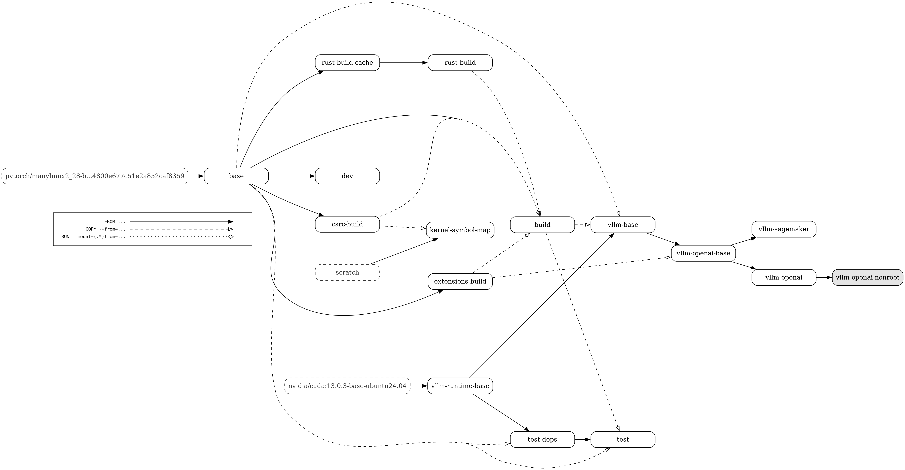

# Dockerfile

We provide a [docker/Dockerfile](../../../docker/Dockerfile) to construct the image for running an OpenAI compatible server with vLLM.
More information about deploying with Docker can be found [here](../../deployment/docker.md).

Below is a visual representation of the multi-stage Dockerfile. The build graph contains the following nodes:

- All build stages
- The default build target (highlighted in grey)
- External images (with dashed borders)

The edges of the build graph represent:

- `FROM ...` dependencies (with a solid line and a full arrow head)

- `COPY --from=...` dependencies (with a dashed line and an empty arrow head)

- `RUN --mount=(.\*)from=...` dependencies (with a dotted line and an empty diamond arrow head)

The `test-deps` stage branches from `vllm-runtime-base` so Git and the test
requirements remain cached independently of per-commit vLLM wheels and source.

The `vllm-runtime-base` stage explicitly installs the current Ubuntu
`ca-certificates` package so clients using the system trust store receive
certificate removals when the image is rebuilt. This complements the Python
`certifi` bundle used by other HTTP clients.

The `extensions-build` stage can also produce an optional source-built Triton
wheel. `vllm-openai-base` installs that wheel after its other Python
dependencies so dependency resolution cannot restore an older Triton version.

With `BUILD_NIXL=true`, `extensions-build` also builds NIXL, including its NIXL
EP extension for the installed PyTorch, with `tools/build_nixl_with_torch215_for_rubin.py`.
`vllm-openai-base` then replaces the NIXL packages installed from the KV-connector
requirements with these wheels.

The AWS EFA images are built separately by `docker/Dockerfile.efa` on top of a
`vllm-openai` image built with `INSTALL_KV_CONNECTORS=true`. It adds a minimal
AWS EFA userspace install (libfabric, aws-ofi-nccl and hwloc), the EFA Mooncake
wheel (x86_64 only), and DeepEP built for NCCL GIN over EFA. Kernel modules and
host limits remain host-managed.

```bash
docker build -f docker/Dockerfile.efa \
    --build-arg BASE_IMAGE=vllm/vllm-openai:latest -t vllm:openai-efa docker/
```

The release pipeline publishes the CUDA 13.0 EFA image to DockerHub as
`vllm/vllm-openai:latest-efa` and `vllm/vllm-openai:v<version>-efa` for releases,
and as `vllm/vllm-openai:efa-nightly` and `vllm/vllm-openai:efa-nightly-<commit>`
for nightly builds.

The image does not change vLLM's Mooncake protocol default (`rdma`). To use
EFA, set it per connector:

- `MooncakeConnector`: `"mooncake_protocol": "efa"` in `kv_connector_extra_config`.
- `MooncakeStoreConnector`: `"protocol": "efa"` in the JSON file at `MOONCAKE_CONFIG_PATH`.

The EFA Mooncake wheel is x86_64-only, so use `tcp` on arm64.

  > <figure markdown="span">
  >   { align="center" alt="query" width="100%" }
  > </figure>
  >
  > Made using: <https://github.com/patrickhoefler/dockerfilegraph>
  >
  > Commands to regenerate the build graph (make sure to run it **from the \`root\` directory of the vLLM repository** where the dockerfile is present):
  >
  > ```bash
  > dockerfilegraph \
  >   -o png \
  >   --concentrate \
  >   --legend \
  >   --dpi 200 \
  >   --max-label-length 50 \
  >   --filename docker/Dockerfile
  > ```
  >
  > or in case you want to run it directly with the docker image:
  >
  > ```bash
  > docker run \
  >    --rm \
  >    --user "$(id -u):$(id -g)" \
  >    --workdir /workspace \
  >    --volume "$(pwd)":/workspace \
  >    ghcr.io/patrickhoefler/dockerfilegraph:alpine \
  >    --output png \
  >    --dpi 200 \
  >    --max-label-length 50 \
  >    --filename docker/Dockerfile \
  >    --concentrate \
  >    --legend
  > ```
  >
  > (To run it for a different file, you can pass in a different argument to the flag `--filename`.)
