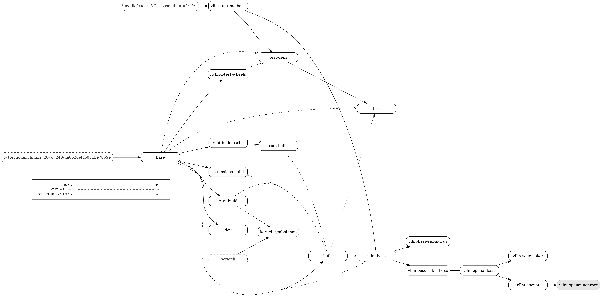

# Dockerfile

We provide a [docker/Dockerfile](../../../docker/Dockerfile) to construct the image for running an OpenAI compatible server with vLLM.
More information about deploying with Docker can be found [here](../../deployment/docker.md).

Below is a visual representation of the multi-stage Dockerfile. The build graph contains the following nodes:

- All build stages
- The default build target (highlighted in grey)
- External images (with dashed borders)

The edges of the build graph represent:

- `FROM ...` dependencies (with a solid line and a full arrow head)

- `COPY --from=...` dependencies (with a dashed line and an empty arrow head)

- `RUN --mount=(.\*)from=...` dependencies (with a dotted line and an empty diamond arrow head)

The stages are cut by how often their inputs change, so that a build reruns,
and a host pulls, only what a commit changed.

The `requirement-pins` stage cuts the PyTorch and FlashInfer pins out of
`requirements/cuda.txt` into one small file each. `base` installs only the
PyTorch pins, so the native builds on top of it (`csrc-build`,
`extensions-build`, `hybrid-test-wheels`) recompile when a pin changes, not on
every edit to `requirements/`. It also passes on
`requirements/rubin-prerelease.txt`, as an empty file unless
`INSTALL_RUBIN_PRERELEASE=true`, so an edit to the Rubin pins keeps non-Rubin
dependency and native-build layers cached, and extracts `[tool.uv]` from
`pyproject.toml` (verified with `tomllib`, failing closed on mismatch) so
unrelated `pyproject.toml` edits leave `test-deps` cached. `rust-build-cache`
branches from `toolchain` and depends on no Python requirements. `vllm-runtime-base` installs PyTorch,
FlashInfer with its precompiled kernels, and the remaining requirements as
three layers in that order, so a routine dependency bump rebuilds only the last.

Copy into a stage only the requirement files it reads. Copying the entire
`requirements/` directory makes unrelated changes, such as ROCm test pins,
invalidate CUDA dependency layers and their downstream native builds.

The `test-deps` stage branches from `vllm-runtime-base` so Git and the test
requirements remain cached independently of per-commit vLLM wheels and source.
It ends by installing vLLM's own runtime requirements, `tests/vllm_test_utils`,
and DeepEP, so the per-commit wheel install has nothing left to change; the
`test-wheel` stage fails the build if it still does.

The `test` image adds four `COPY --link` layers to `test-deps`: the compiled
extensions, the Rust frontend, the Python files of the vLLM wheel, and the
source tree. The first three come from `test-wheel`, which installs the wheel
and sorts its files with `tools/ci/split_vllm_install.sh`; the last comes from
`test-src` (which branches from `toolchain` so it runs in parallel with
`test-deps`). A host that has the previous commit's image pulls only the layers
whose files changed.

The `hybrid-test-wheels` stage builds the `mamba-ssm` and `causal-conv1d`
wheels that `test-deps` installs. It branches from `base`, so it rebuilds with
`base` or when `tools/build_hybrid_test_wheels.sh` changes, in parallel with
`csrc-build`.

The `vllm-runtime-base` stage explicitly installs the current Ubuntu
`ca-certificates` package so clients using the system trust store receive
certificate removals when the image is rebuilt. This complements the Python
`certifi` bundle used by other HTTP clients.

When `INSTALL_KV_CONNECTORS=true`, `vllm-openai-base` also installs a minimal
AWS EFA userspace (libfabric, aws-ofi-nccl and hwloc), which NIXL's LIBFABRIC
backend and Mooncake's EFA transport load at runtime. Kernel modules and host
limits remain host-managed.

The release pipeline publishes the CUDA 13.0 EFA image to DockerHub as
`vllm/vllm-openai:latest-efa` and `vllm/vllm-openai:v<version>-efa` for releases,
and as `vllm/vllm-openai:efa-nightly` and `vllm/vllm-openai:efa-nightly-<commit>`
for nightly builds.

The image does not change vLLM's Mooncake protocol default (`rdma`). To use
EFA, set it per connector:

- `MooncakeConnector`: `"mooncake_protocol": "efa"` in `kv_connector_extra_config`.
- `MooncakeStoreConnector`: `"protocol": "efa"` in the JSON file at `MOONCAKE_CONFIG_PATH`.

`docker/Dockerfile.efa` builds the `-efa` images on top of such a
`vllm-openai` image. It replaces DeepEP with the amazon-contributing fork for
NCCL GIN over EFA and sets `NCCL_NET_PLUGIN=ofi` and `NCCL_TUNER_PLUGIN=ofi`.

```bash
docker build -f docker/Dockerfile.efa \
    --build-arg BASE_IMAGE=vllm/vllm-openai:latest -t vllm:openai-efa docker/
```

  > <figure markdown="span">
  >   { align="center" alt="query" width="100%" }
  > </figure>
  >
  > Made using: <https://github.com/patrickhoefler/dockerfilegraph>
  >
  > Commands to regenerate the build graph (make sure to run it **from the \`root\` directory of the vLLM repository** where the dockerfile is present):
  >
  > ```bash
  > dockerfilegraph \
  >   -o png \
  >   --concentrate \
  >   --legend \
  >   --dpi 200 \
  >   --max-label-length 50 \
  >   --filename docker/Dockerfile
  > ```
  >
  > or in case you want to run it directly with the docker image:
  >
  > ```bash
  > docker run \
  >    --rm \
  >    --user "$(id -u):$(id -g)" \
  >    --workdir /workspace \
  >    --volume "$(pwd)":/workspace \
  >    ghcr.io/patrickhoefler/dockerfilegraph:alpine \
  >    --output png \
  >    --dpi 200 \
  >    --max-label-length 50 \
  >    --filename docker/Dockerfile \
  >    --concentrate \
  >    --legend
  > ```
  >
  > (To run it for a different file, you can pass in a different argument to the flag `--filename`.)
