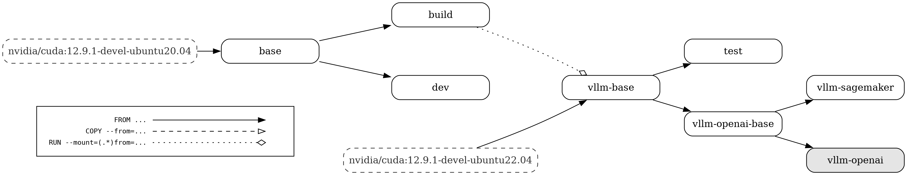

# Dockerfile

We provide a [docker/Dockerfile](../../../docker/Dockerfile) to construct the image for running an OpenAI compatible server with vLLM.
More information about deploying with Docker can be found [here](../../deployment/docker.md).

Below is a visual representation of the multi-stage Dockerfile. The build graph contains the following nodes:

- All build stages
- The default build target (highlighted in grey)
- External images (with dashed borders)

The edges of the build graph represent:

- `FROM ...` dependencies (with a solid line and a full arrow head)

- `COPY --from=...` dependencies (with a dashed line and an empty arrow head)

- `RUN --mount=(.\*)from=...` dependencies (with a dotted line and an empty diamond arrow head)

  > <figure markdown="span">
  >   { align="center" alt="query" width="100%" }
  > </figure>
  >
  > Made using: <https://github.com/patrickhoefler/dockerfilegraph>
  >
  > Commands to regenerate the build graph (make sure to run it **from the \`root\` directory of the vLLM repository** where the dockerfile is present):
  >
  > ```bash
  > dockerfilegraph \
  >   -o png \
  >   --legend \
  >   --dpi 200 \
  >   --max-label-length 50 \
  >   --filename docker/Dockerfile
  > ```
  >
  > or in case you want to run it directly with the docker image:
  >
  > ```bash
  > docker run \
  >    --rm \
  >    --user "$(id -u):$(id -g)" \
  >    --workdir /workspace \
  >    --volume "$(pwd)":/workspace \
  >    ghcr.io/patrickhoefler/dockerfilegraph:alpine \
  >    --output png \
  >    --dpi 200 \
  >    --max-label-length 50 \
  >    --filename docker/Dockerfile \
  >    --legend
  > ```
  >
  > (To run it for a different file, you can pass in a different argument to the flag `--filename`.)
