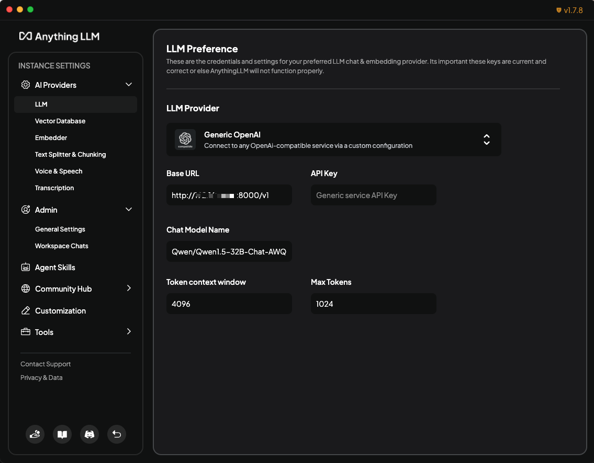
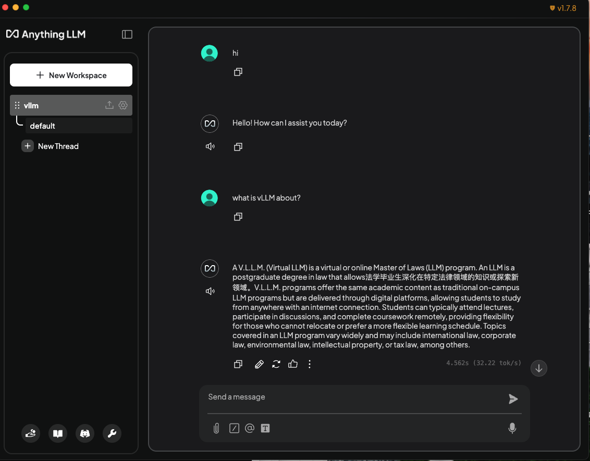
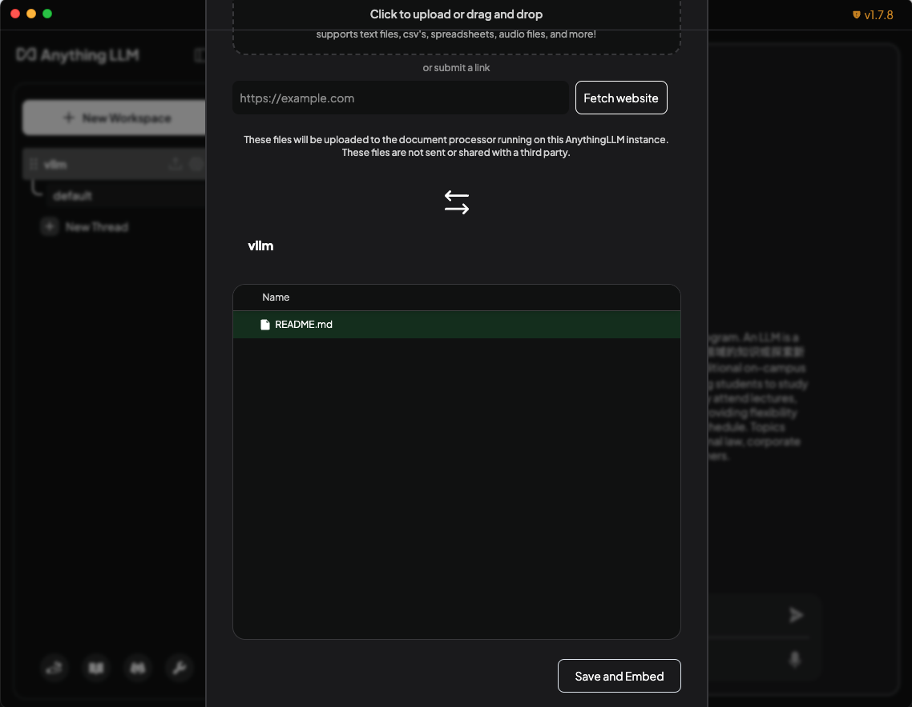
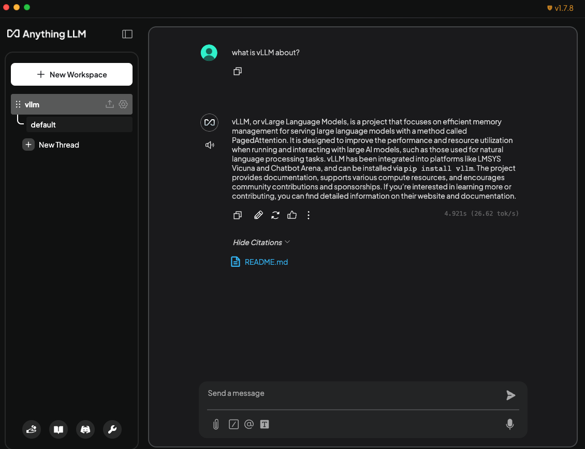

# AnythingLLM

[AnythingLLM](https://github.com/Mintplex-Labs/anything-llm) is a full-stack application that enables you to turn any document, resource, or piece of content into context that any LLM can use as references during chatting.

It allows you to deploy a large language model (LLM) server with vLLM as the backend, which exposes OpenAI-compatible endpoints.

## Prerequisites

Set up the vLLM environment:

```bash
pip install vllm
```

## Deploy

1. Start the vLLM server with a supported chat-completion model, for example:

    ```bash
    vllm serve Qwen/Qwen1.5-32B-Chat-AWQ --max-model-len 4096
    ```

1. Download and install [AnythingLLM Desktop](https://anythingllm.com/desktop).

1. Configure the AI provider:

    - At the bottom, click the 🔧 wrench icon -> **Open settings** -> **AI Providers** -> **LLM**.
    - Enter the following values:
        - LLM Provider: Generic OpenAI
        - Base URL: `http://{vllm server host}:{vllm server port}/v1`
        - Chat Model Name: `Qwen/Qwen1.5-32B-Chat-AWQ`

    

1. Create a workspace:

    1. At the bottom, click the ↺ back icon and back to workspaces.
    1. Create a workspace (e.g., `vllm`) and start chatting.

    

1. Add a document.

    1. Click the 📎 attachment icon.
    1. Upload a document.
    1. Select and move the document into your workspace.
    1. Save and embed it.

    

1. Chat using your document as context.

    
