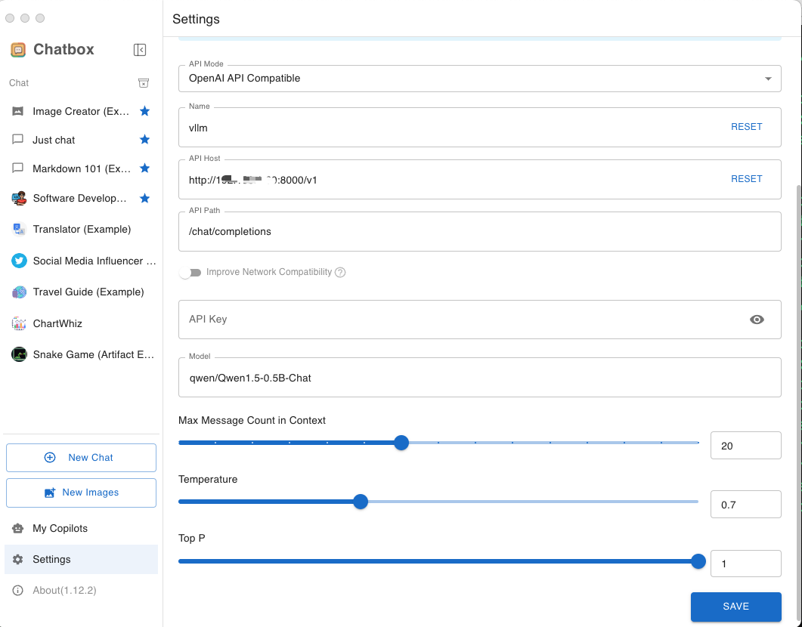
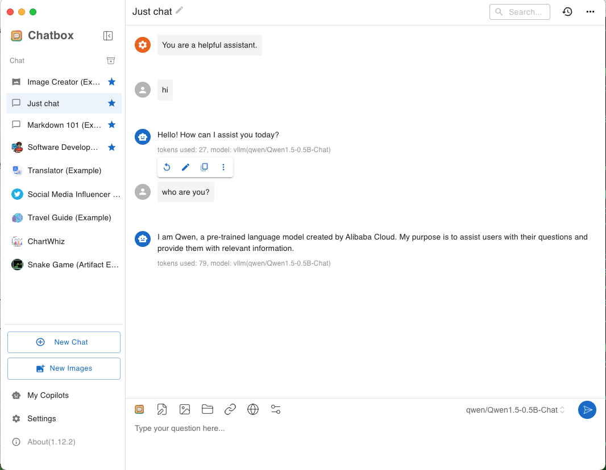

# Chatbox

[Chatbox](https://github.com/chatboxai/chatbox) is a desktop client for LLMs, available on Windows, Mac, Linux.

It allows you to deploy a large language model (LLM) server with vLLM as the backend, which exposes OpenAI-compatible endpoints.

## Prerequisites

Set up the vLLM environment:

```bash
pip install vllm
```

## Deploy

1. Start the vLLM server with the supported chat completion model, e.g.

    ```bash
    vllm serve qwen/Qwen1.5-0.5B-Chat
    ```

1. Download and install [Chatbox desktop](https://chatboxai.app/en#download).

1. On the bottom left of settings, Add Custom Provider
    - API Mode: `OpenAI API Compatible`
    - Name: vllm
    - API Host: `http://{vllm server host}:{vllm server port}/v1`
    - API Path: `/chat/completions`
    - Model: `qwen/Qwen1.5-0.5B-Chat`

    

1. Go to `Just chat`, and start to chat:

    
