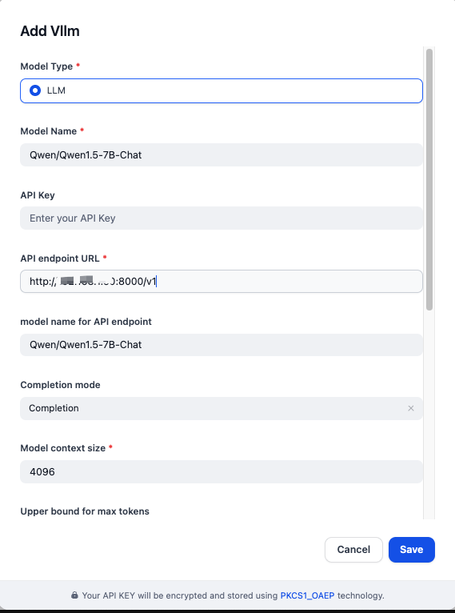
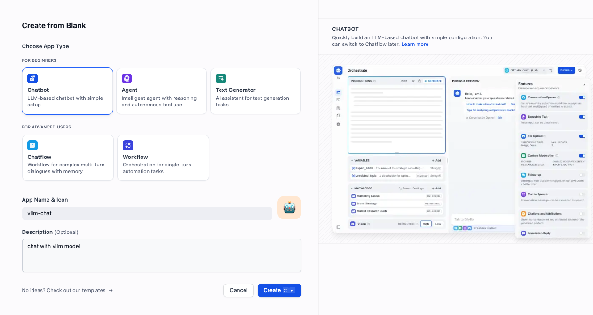
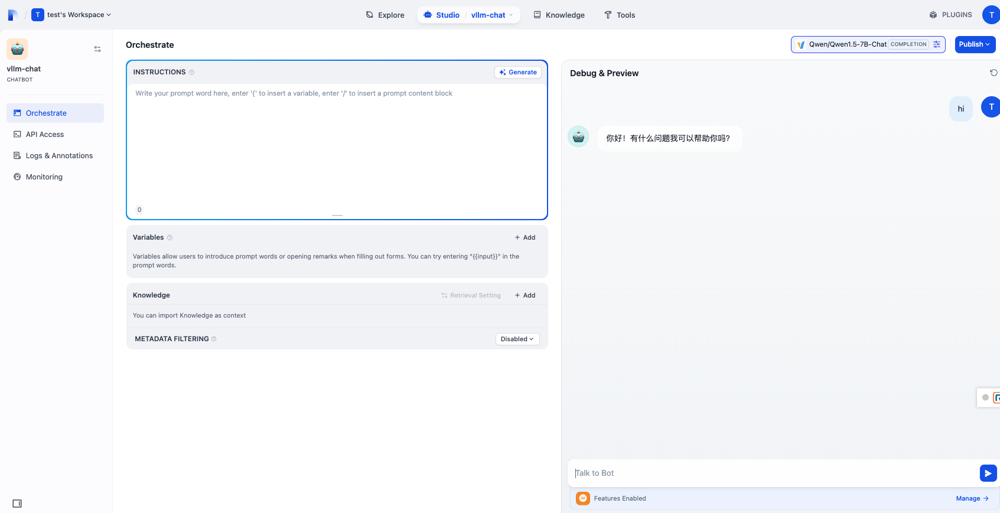

# Dify

[Dify](https://github.com/langgenius/dify) is an open-source LLM app development platform. Its intuitive interface combines agentic AI workflow, RAG pipeline, agent capabilities, model management, observability features, and more, allowing you to quickly move from prototype to production.

It supports vLLM as a model provider to efficiently serve large language models.

This guide walks you through deploying Dify using a vLLM backend.

## Prerequisites

Set up the vLLM environment:

```bash
pip install vllm
```

And install [Docker](https://docs.docker.com/engine/install/) and [Docker Compose](https://docs.docker.com/compose/install/).

## Deploy

1. Start the vLLM server with the supported chat completion model, e.g.

    ```bash
    vllm serve Qwen/Qwen1.5-7B-Chat
    ```

1. Start the Dify server with docker compose ([details](https://github.com/langgenius/dify?tab=readme-ov-file#quick-start)):

    ```bash
    git clone https://github.com/langgenius/dify.git
    cd dify
    cd docker
    cp .env.example .env
    docker compose up -d
    ```

1. Open the browser to access `http://localhost/install`, config the basic login information and login.

1. In the top-right user menu (under the profile icon), go to Settings, then click `Model Provider`, and locate the `vLLM` provider to install it.

1. Fill in the model provider details as follows:

    - **Model Type**: `LLM`
    - **Model Name**: `Qwen/Qwen1.5-7B-Chat`
    - **API Endpoint URL**: `http://{vllm_server_host}:{vllm_server_port}/v1`
    - **Model Name for API Endpoint**: `Qwen/Qwen1.5-7B-Chat`
    - **Completion Mode**: `Completion`

    

1. To create a test chatbot, go to `Studio → Chatbot → Create from Blank`, then select Chatbot as the type:

    

1. Click the chatbot you just created to open the chat interface and start interacting with the model:

    
