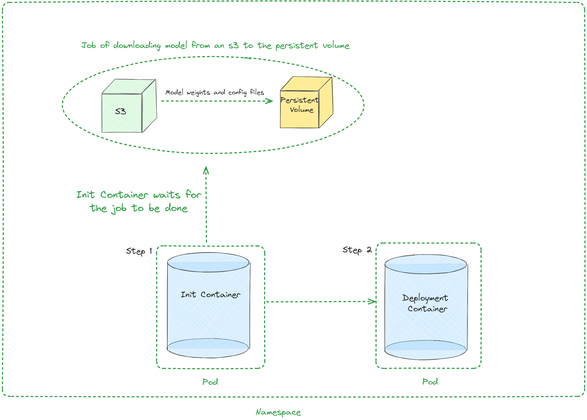

[](){ #deployment-helm }

A Helm chart to deploy vLLM for Kubernetes

Helm is a package manager for Kubernetes. It will help you to deploy vLLM on k8s and automate the deployment of vLLM Kubernetes applications. With Helm, you can deploy the same framework architecture with different configurations to multiple namespaces by overriding variable values.

This guide will walk you through the process of deploying vLLM with Helm, including the necessary prerequisites, steps for helm installation and documentation on architecture and values file.

## Prerequisites

Before you begin, ensure that you have the following:

- A running Kubernetes cluster
- NVIDIA Kubernetes Device Plugin (`k8s-device-plugin`): This can be found at [https://github.com/NVIDIA/k8s-device-plugin](https://github.com/NVIDIA/k8s-device-plugin)
- Available GPU resources in your cluster
- S3 with the model which will be deployed

## Installing the chart

To install the chart with the release name `test-vllm`:

```bash
helm upgrade --install --create-namespace --namespace=ns-vllm test-vllm . -f values.yaml --set secrets.s3endpoint=$ACCESS_POINT --set secrets.s3bucketname=$BUCKET --set secrets.s3accesskeyid=$ACCESS_KEY --set secrets.s3accesskey=$SECRET_KEY
```

## Uninstalling the Chart

To uninstall the `test-vllm` deployment:

```bash
helm uninstall test-vllm --namespace=ns-vllm
```

The command removes all the Kubernetes components associated with the
chart **including persistent volumes** and deletes the release.

## Architecture



## Values

| Key                                        | Type    | Default                                                                                                                                                  | Description                                                                                                                               |
|--------------------------------------------|---------|----------------------------------------------------------------------------------------------------------------------------------------------------------|-------------------------------------------------------------------------------------------------------------------------------------------|
| autoscaling                                | object  | {"enabled":false,"maxReplicas":100,"minReplicas":1,"targetCPUUtilizationPercentage":80}                                                                  | Autoscaling configuration                                                                                                                 |
| autoscaling.enabled                        | bool    | false                                                                                                                                                    | Enable autoscaling                                                                                                                        |
| autoscaling.maxReplicas                    | int     | 100                                                                                                                                                      | Maximum replicas                                                                                                                          |
| autoscaling.minReplicas                    | int     | 1                                                                                                                                                        | Minimum replicas                                                                                                                          |
| autoscaling.targetCPUUtilizationPercentage | int     | 80                                                                                                                                                       | Target CPU utilization for autoscaling                                                                                                    |
| configs                                    | object  | {}                                                                                                                                                       | Configmap                                                                                                                                 |
| containerPort                              | int     | 8000                                                                                                                                                     | Container port                                                                                                                            |
| customObjects                              | list    | []                                                                                                                                                       | Custom Objects configuration                                                                                                              |
| deploymentStrategy                         | object  | {}                                                                                                                                                       | Deployment strategy configuration                                                                                                         |
| externalConfigs                            | list    | []                                                                                                                                                       | External configuration                                                                                                                    |
| extraContainers                            | list    | []                                                                                                                                                       | Additional containers configuration                                                                                                       |
| extraInit                                  | object  | {"pvcStorage":"1Gi","s3modelpath":"relative_s3_model_path/opt-125m", "awsEc2MetadataDisabled": true}                                                     | Additional configuration for the init container                                                                                           |
| extraInit.pvcStorage                       | string  | "50Gi"                                                                                                                                                   | Storage size of the s3                                                                                                                    |
| extraInit.s3modelpath                      | string  | "relative_s3_model_path/opt-125m"                                                                                                                        | Path of the model on the s3 which hosts model weights and config files                                                                    |
| extraInit.awsEc2MetadataDisabled           | boolean | true                                                                                                                                                     | Disables the use of the Amazon EC2 instance metadata service                                                                              |
| extraPorts                                 | list    | []                                                                                                                                                       | Additional ports configuration                                                                                                            |
| gpuModels                                  | list    | ["TYPE_GPU_USED"]                                                                                                                                        | Type of gpu used                                                                                                                          |
| image                                      | object  | {"command":["vllm","serve","/data/","--served-model-name","opt-125m","--host","0.0.0.0","--port","8000"],"repository":"vllm/vllm-openai","tag":"latest"} | Image configuration                                                                                                                       |
| image.command                              | list    | ["vllm","serve","/data/","--served-model-name","opt-125m","--host","0.0.0.0","--port","8000"]                                                            | Container launch command                                                                                                                  |
| image.repository                           | string  | "vllm/vllm-openai"                                                                                                                                       | Image repository                                                                                                                          |
| image.tag                                  | string  | "latest"                                                                                                                                                 | Image tag                                                                                                                                 |
| livenessProbe                              | object  | {"failureThreshold":3,"httpGet":{"path":"/health","port":8000},"initialDelaySeconds":15,"periodSeconds":10}                                              | Liveness probe configuration                                                                                                              |
| livenessProbe.failureThreshold             | int     | 3                                                                                                                                                        | Number of times after which if a probe fails in a row, Kubernetes considers that the overall check has failed: the container is not alive |
| livenessProbe.httpGet                      | object  | {"path":"/health","port":8000}                                                                                                                           | Configuration of the Kubelet http request on the server                                                                                   |
| livenessProbe.httpGet.path                 | string  | "/health"                                                                                                                                                | Path to access on the HTTP server                                                                                                         |
| livenessProbe.httpGet.port                 | int     | 8000                                                                                                                                                     | Name or number of the port to access on the container, on which the server is listening                                                   |
| livenessProbe.initialDelaySeconds          | int     | 15                                                                                                                                                       | Number of seconds after the container has started before liveness probe is initiated                                                      |
| livenessProbe.periodSeconds                | int     | 10                                                                                                                                                       | How often (in seconds) to perform the liveness probe                                                                                      |
| maxUnavailablePodDisruptionBudget          | string  | ""                                                                                                                                                       | Disruption Budget Configuration                                                                                                           |
| readinessProbe                             | object  | {"failureThreshold":3,"httpGet":{"path":"/health","port":8000},"initialDelaySeconds":5,"periodSeconds":5}                                                | Readiness probe configuration                                                                                                             |
| readinessProbe.failureThreshold            | int     | 3                                                                                                                                                        | Number of times after which if a probe fails in a row, Kubernetes considers that the overall check has failed: the container is not ready |
| readinessProbe.httpGet                     | object  | {"path":"/health","port":8000}                                                                                                                           | Configuration of the Kubelet http request on the server                                                                                   |
| readinessProbe.httpGet.path                | string  | "/health"                                                                                                                                                | Path to access on the HTTP server                                                                                                         |
| readinessProbe.httpGet.port                | int     | 8000                                                                                                                                                     | Name or number of the port to access on the container, on which the server is listening                                                   |
| readinessProbe.initialDelaySeconds         | int     | 5                                                                                                                                                        | Number of seconds after the container has started before readiness probe is initiated                                                     |
| readinessProbe.periodSeconds               | int     | 5                                                                                                                                                        | How often (in seconds) to perform the readiness probe                                                                                     |
| replicaCount                               | int     | 1                                                                                                                                                        | Number of replicas                                                                                                                        |
| resources                                  | object  | {"limits":{"cpu":4,"memory":"16Gi","nvidia.com/gpu":1},"requests":{"cpu":4,"memory":"16Gi","nvidia.com/gpu":1}}                                          | Resource configuration                                                                                                                    |
| resources.limits."nvidia.com/gpu"          | int     | 1                                                                                                                                                        | Number of gpus used                                                                                                                       |
| resources.limits.cpu                       | int     | 4                                                                                                                                                        | Number of CPUs                                                                                                                            |
| resources.limits.memory                    | string  | "16Gi"                                                                                                                                                   | CPU memory configuration                                                                                                                  |
| resources.requests."nvidia.com/gpu"        | int     | 1                                                                                                                                                        | Number of gpus used                                                                                                                       |
| resources.requests.cpu                     | int     | 4                                                                                                                                                        | Number of CPUs                                                                                                                            |
| resources.requests.memory                  | string  | "16Gi"                                                                                                                                                   | CPU memory configuration                                                                                                                  |
| secrets                                    | object  | {}                                                                                                                                                       | Secrets configuration                                                                                                                     |
| serviceName                                | string  | Service name                                                                                                                                             |                                                                                                                                           |
| servicePort                                | int     | 80                                                                                                                                                       | Service port                                                                                                                              |
| labels.environment                         | string  | test                                                                                                                                                     | Environment name                                                                                                                          |
