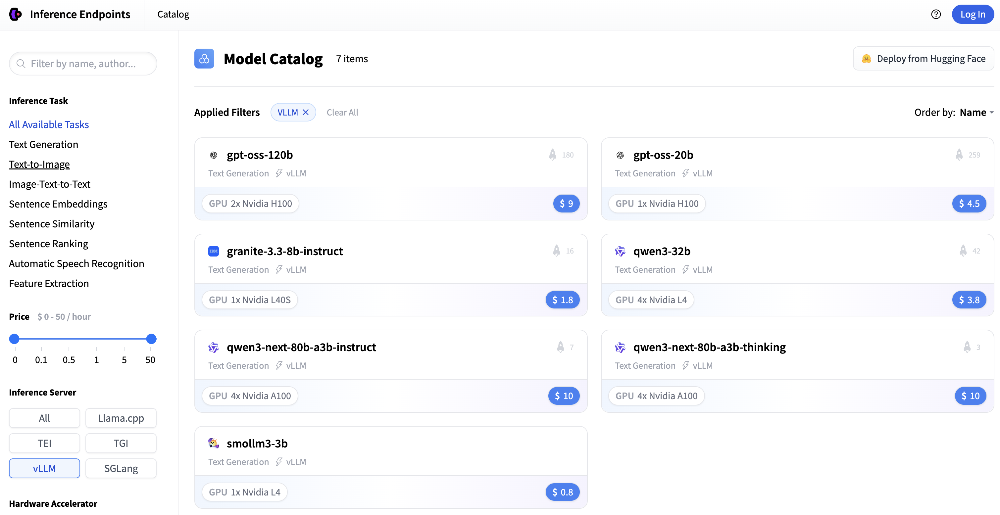
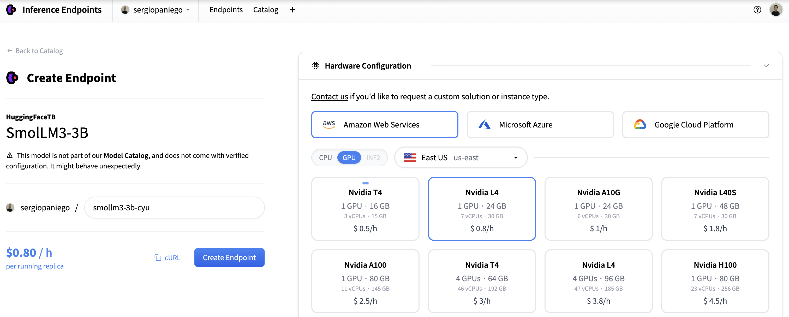

# Hugging Face Inference Endpoints

## Overview

Models compatible with vLLM can be deployed on Hugging Face Inference Endpoints, either starting from the [Hugging Face Hub](https://huggingface.co) or directly from the [Inference Endpoints](https://endpoints.huggingface.co/) interface. This allows you to serve models in a fully managed environment with GPU acceleration, auto-scaling, and monitoring, without managing the infrastructure manually.

For advanced details on vLLM integration and deployment options, see [Advanced Deployment Details](#advanced-deployment-details).

## Deployment Methods

- [**Method 1: Deploy from the Catalog.**](#method-1-deploy-from-the-catalog) One-click deploy models from the Hugging Face Hub with ready-made optimized configurations.
- [**Method 2: Guided Deployment (Transformers Models).**](#method-2-guided-deployment-transformers-models) Instantly deploy models tagged with `transformers` from the Hub UI using the **Deploy** button.
- [**Method 3: Manual Deployment (Advanced Models).**](#method-3-manual-deployment-advanced-models) For models that either use custom code with the `transformers` tag, or don’t run with standard `transformers` but are supported by vLLM. This method requires manual configuration.

### Method 1: Deploy from the Catalog

This is the easiest way to get started with vLLM on Hugging Face Inference Endpoints. You can browse a catalog of models with verified and optimized deployment configuration at [Inference Endpoints](https://endpoints.huggingface.co/catalog) to maximize performance.

1. Go to [Endpoints Catalog](https://endpoints.huggingface.co/catalog) and in the **Inference Server** options, select `vLLM`.This will display the current list of models with optimized preconfigured options.

    

1. Select the desired model and click **Create Endpoint**.

    

1. Once the deployment is ready, you can use the endpoint. Update the `DEPLOYMENT_URL` with the URL provided in the console, remembering to append `/v1` as required.

    ```python
    # pip install openai
    from openai import OpenAI
    import os

    client = OpenAI(
        base_url=DEPLOYMENT_URL,
        api_key=os.environ["HF_TOKEN"],  # https://huggingface.co/settings/tokens
    )

    chat_completion = client.chat.completions.create(
        model="HuggingFaceTB/SmolLM3-3B",
        messages=[
            {
                "role": "user",
                "content": [
                    {
                        "type": "text",
                        "text": "Give me a brief explanation of gravity in simple terms.",
                    }
                ],
            }
        ],
        stream=True,
    )

    for message in chat_completion:
        print(message.choices[0].delta.content, end="")
    ```

!!! note
    The catalog provides models optimized for vLLM, including GPU settings and inference engine configurations. You can monitor the endpoint and update the **container or its configuration** from the Inference Endpoints UI.

### Method 2: Guided Deployment (Transformers Models)

This method applies to models with the [`transformers` library tag](https://huggingface.co/models?library=transformers) in their metadata. It allows you to deploy a model directly from the Hub UI without manual configuration.

1. Navigate to a model on [Hugging Face Hub](https://huggingface.co/models).  
   For this example we will use the [`ibm-granite/granite-docling-258M`](https://huggingface.co/ibm-granite/granite-docling-258M) model. You can verify that the model is compatible by checking the front matter in the [README](https://huggingface.co/ibm-granite/granite-docling-258M/blob/main/README.md), where the library is tagged as `library: transformers`.

2. Locate the **Deploy** button. The button appears for models tagged with `transformers` at the top right of the [model card](https://huggingface.co/ibm-granite/granite-docling-258M).

    

3. Click the **Deploy** button > **HF Inference Endpoints**. You will be taken to the Inference Endpoints interface to configure the deployment.

    

4. Select the Hardware (we choose AWS>GPU>T4 for the example) and Container Configuration. Choose `vLLM` as the container type and finalize the deployment pressing **Create Endpoint**.

    

5. Use the deployed endpoint. Update the `DEPLOYMENT_URL` with the URL provided in the console (remember to add `/v1` needed). You can then use your endpoint programmatically or via the SDK.

    ```python
    # pip install openai
    from openai import OpenAI
    import os

    client = OpenAI(
        base_url=DEPLOYMENT_URL,
        api_key=os.environ["HF_TOKEN"],  # https://huggingface.co/settings/tokens
    )

    chat_completion = client.chat.completions.create(
        model="ibm-granite/granite-docling-258M",
        messages=[
            {
                "role": "user",
                "content": [
                    {
                        "type": "image_url",
                        "image_url": {
                            "url": "https://huggingface.co/ibm-granite/granite-docling-258M/resolve/main/assets/new_arxiv.png",
                        },
                    },
                    {
                        "type": "text",
                        "text": "Convert this page to docling.",
                    },
                ]
            }
        ],
        stream=True,
    )

    for message in chat_completion:
        print(message.choices[0].delta.content, end="")
    ```

!!! note
    This method uses best-guess defaults. You may need to adjust the configuration to fit your specific requirements.

### Method 3: Manual Deployment (Advanced Models)

Some models require manual deployment because they:

- Use custom code with the `transformers` tag
- Don't run with standard `transformers` but are supported by `vLLM`

These models cannot be deployed using the **Deploy** button on the model card.

In this guide, we demonstrate manual deployment using the [`rednote-hilab/dots.ocr`](https://huggingface.co/rednote-hilab/dots.ocr) model, an OCR model integrated with vLLM (see vLLM [PR](https://github.com/vllm-project/vllm/pull/24645)).

1. Start a new deployment. Go to [Inference Endpoints](https://endpoints.huggingface.co/) and click `New`.

    

2. Search the model in the Hub. In the dialog, switch to **Hub** and search for the desired model.

    

3. Choosing infrastructure. On the configuration page, select the cloud provider and hardware from the available options.  
   For this demo, we choose AWS and L4 GPU. Adjust according to your hardware needs.

    

4. Configure the container. Scroll to the **Container Configuration** and select `vLLM` as the container type.

    

5. Create the endpoint. Click **Create Endpoint** to deploy the model.

    Once the endpoint is ready, you can use it with the OpenAI Completion API, cURL, or other SDKs. Remember to append `/v1` to the deployment URL if needed.

!!! note
    You can adjust the **container settings** (Container URI, Container Arguments) from the Inference Endpoints UI and press **Update Endpoint**. This redeploys the endpoint with the updated container configuration. Changes to the model itself require creating a new endpoint or redeploying with a different model. For example, for this demo, you may need to update the Container URI to the nightly image (`vllm/vllm-openai:nightly`) and add the `--trust-remote-code` flag in the container arguments.

## Advanced Deployment Details

With the [Transformers modeling backend integration](https://blog.vllm.ai/2025/04/11/transformers-backend.html), vLLM now offers Day 0 support for any model compatible with `transformers`. This means you can deploy such models immediately, leveraging vLLM’s optimized inference without additional backend modifications.

Hugging Face Inference Endpoints provides a fully managed environment for serving models via vLLM. You can deploy models without configuring servers, installing dependencies, or managing clusters. Endpoints also support deployment across multiple cloud providers (AWS, Azure, GCP) without the need for separate accounts.

The platform integrates seamlessly with the Hugging Face Hub, allowing you to deploy any vLLM- or `transformers`-compatible model, track usage, and update the inference engine directly. The vLLM engine comes preconfigured, enabling optimized inference and easy switching between models or engines without modifying your code. This setup simplifies production deployment: endpoints are ready in minutes, include monitoring and logging, and let you focus on serving models rather than maintaining infrastructure.

## Next Steps

- Explore the [Inference Endpoints](https://endpoints.huggingface.co/catalog) model catalog
- Read the Inference Endpoints [documentation](https://huggingface.co/docs/inference-endpoints/en/index)
- Learn about [Inference Endpoints engines](https://huggingface.co/docs/inference-endpoints/en/engines/vllm)
- Understand the [Transformers modeling backend integration](https://blog.vllm.ai/2025/04/11/transformers-backend.html)
