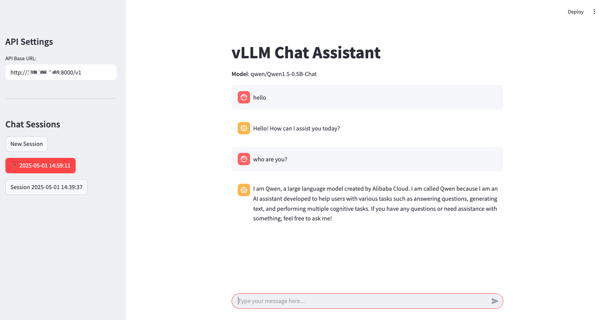

[](){ #deployment-streamlit }

[Streamlit](https://github.com/streamlit/streamlit) lets you transform Python scripts into interactive web apps in minutes, instead of weeks. Build dashboards, generate reports, or create chat apps.

It can be quickly integrated with vLLM as a backend API server, enabling powerful LLM inference via API calls.

## Prerequisites

- Setup vLLM environment

## Deploy

- Start the vLLM server with the supported chat completion model, e.g.

```bash
vllm serve qwen/Qwen1.5-0.5B-Chat
```

- Install streamlit and openai:

```bash
pip install streamlit openai
```

- Use the script: <gh-file:examples/online_serving/streamlit_openai_chatbot_webserver.py>

- Start the streamlit web UI and start to chat:

```bash
streamlit run streamlit_openai_chatbot_webserver.py

# or specify the VLLM_API_BASE or VLLM_API_KEY
VLLM_API_BASE="http://vllm-server-host:vllm-server-port/v1" \
    streamlit run streamlit_openai_chatbot_webserver.py

# start with debug mode to view more details
streamlit run streamlit_openai_chatbot_webserver.py --logger.level=debug
```


