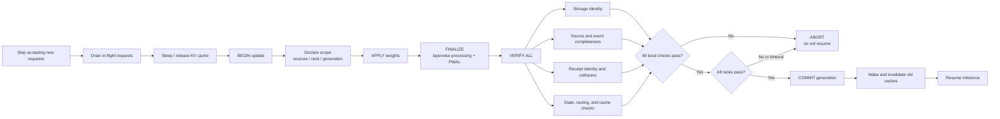
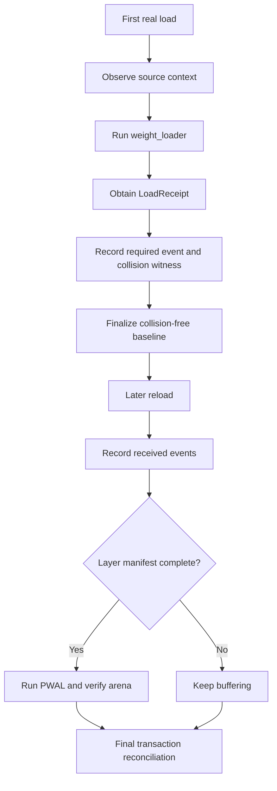

# Reload as a Transaction — the Top-Down Design for #48312

Status: **partially implemented**. This document is the transaction design for [RFC #48312: Weight Reload Correctness for RL](https://github.com/vllm-project/vllm/issues/48312). It defines what a correct weight update must guarantee, which RFC failure category each mechanism addresses, and where the remaining gaps are. It intentionally describes the correctness contract before the implementation. Detailed manifest and receipt internals belong in `LOAD_MANIFEST_DESIGN.md`.

Status labels used below:

- **Implemented**: code exists on `feat/reload-arena` and has test or model evidence.
- **Partially implemented**: the mechanism exists, but coverage or commit enforcement is incomplete.
- **To be implemented**: design only.
- **TBD**: even the final API or ownership boundary has not been decided.

## 1. Why a transaction, not a collection of fixes

The reload investigation found several independent classes of failure. Stable storage fixes one class, but it cannot prove that all weights arrived, that a loader wrote the correct shard, that non-checkpoint state survived, or that downstream caches were invalidated.

| Category | The invariant is about | Typical failure | Primary mechanism | Status |
|---|---|---|---|---|
| 1. Storage identity | A captured address remains valid | CUDA Graph or kernel keeps an address that PWAL replaced | `ReloadArena` and storage verification | Partially implemented |
| 2. Value refresh | Derived storage contains values from the new weights | Address is stable, but scratch/scale contents remain stale | Arena `put()` and backend refresh hooks | Partially implemented |
| 3. Loader correctness | Every reload entry point runs the complete lifecycle, and loading is complete with the correct layout, key mapping, fragment, rank, expert, and shard | A caller invokes raw `model.load_weights`, a loader finishes early, uses a stale layout, drops a key, or writes the wrong destination | Transaction entry-point guard, completion/source manifests, `LoadReceipt`, collision audit, and distributed sentinels | Manifest and receipt checks implemented; universal entry-point guard and sentinels pending |
| 4. State preservation | State without a checkpoint key survives or is rebuilt, and consumers do not retain an old weight generation | Non-persistent buffers, aliases, config-dependent state, or caches become stale | Keyless-state, config-context, idempotency, and cache-generation checks | Partially implemented |

These invariants do not share one mechanism. They share one **decision point**: immediately before the engine resumes inference. A weight update is correct only if every applicable invariant is proven at that point.

### 1.1 RFC categories 1–4 and their tracked issues

The following table maps every numbered issue listed by RFC #48312 under categories 1–4 to the checker or policy in this document. Cross-category issues intentionally appear more than once when one fix cannot prove both invariants.

| RFC category | Tracked issue | Failure represented in this design | Transaction section |
|---|---|---|---|
| 1. Storage identity | [#48251](https://github.com/vllm-project/vllm/issues/48251) | Generic MLA post-load tensors are rebound after graph capture | C1 `StorageIdentityChecker`; its stale attention-sink copy also maps to C2 |
| 1. Storage identity | [#40390](https://github.com/vllm-project/vllm/issues/40390) | ROCm AITER unquantized-MoE shuffle replaces graph-visible runtime parameters | C1 `StorageIdentityChecker` |
| 1. Storage identity | [#46009](https://github.com/vllm-project/vllm/issues/46009) | ROCm unquantized-MoE padding replaces parameter storage through `.data` | C1 `StorageIdentityChecker` |
| 1. Storage identity | [#41670](https://github.com/vllm-project/vllm/issues/41670) | Rebuilding CUTLASS grouped-GEMM FP8 experts replaces stride and staged-scale storage | C1 `StorageIdentityChecker`, with C2 refresh implications |
| 1. Storage identity | [#48438](https://github.com/vllm-project/vllm/issues/48438) | Marlin workspace and act-order sort-index storage are rebound | C1 `StorageIdentityChecker` |
| 1. Storage identity | [#48539](https://github.com/vllm-project/vllm/issues/48539) | Machete act-order permutation storage is recreated on every post-load pass | C1 `StorageIdentityChecker` |
| 1. Storage identity | [RFC #48478](https://github.com/vllm-project/vllm/issues/48478) | Defines the production fail-closed graph-storage contract for category 1 | C1 production registration/verification boundary |
| 2. Runtime value refresh | [#48251](https://github.com/vllm-project/vllm/issues/48251) | A BF16/FP16 checkpoint sink changes while its FP32 runtime copy remains stale | C2 `DerivedValueRefreshChecker` |
| 3. Loader lifecycle | [#42821](https://github.com/vllm-project/vllm/issues/42821), proposed fix [#42823](https://github.com/vllm-project/vllm/pull/42823) | A direct post-init `model.load_weights` call bypasses restore/load/PWAL/copy-back and writes checkpoint-format bytes into kernel-layout storage | C3a `ReloadEntryPointChecker` and the transaction protocol |
| 3. Loader lifecycle | [#44814](https://github.com/vllm-project/vllm/pull/44814) | A composed loader double-counts copied elements and finalizes Mamba2 before `mixer.D` arrives | C3b `CompletionManifestChecker` |
| 3. Loader lifecycle | [#37334](https://github.com/vllm-project/vllm/issues/37334), [#38746](https://github.com/vllm-project/vllm/issues/38746) | Skipped/shared tensors make numel completion finish too early or never finish | C3b `CompletionManifestChecker` |
| 4. Reload state preservation | [#42481](https://github.com/vllm-project/vllm/issues/42481) | Parent/child parameter-buffer aliasing is not preserved during copy-back | C4a `KeylessStateChecker` |
| 4. Reload state preservation | [#44371](https://github.com/vllm-project/vllm/issues/44371) | Unloaded non-persistent buffers are overwritten from materialized/meta state | C4a `KeylessStateChecker` |
| 4. Reload state preservation | [#44613](https://github.com/vllm-project/vllm/issues/44613) | Backend rebuild depends on a global config value that was not snapshotted | C4b `ConfigContextChecker` |
| 4. Reload state preservation | [#45989](https://github.com/vllm-project/vllm/issues/45989) | Reload rebuilds MoE with a missing or incorrect active `VllmConfig` | C4b `ConfigContextChecker` |
| 4. Reload state preservation | [#48284](https://github.com/vllm-project/vllm/issues/48284) | Identity reload changes unquantized hybrid/Mamba state and output | C4c `IdempotencyChecker` |
| 4. Reload state preservation | [#40647](https://github.com/vllm-project/vllm/issues/40647) | Historical umbrella for config-context, alias, and unloaded-state failures | C4a plus C4b; tracked by the more specific issues above |
| 4. Reload state preservation | [#45835](https://github.com/vllm-project/vllm/pull/45835) | Partial FP8 updates need an explicit preserve-or-reject policy for omitted scales | C4a state policy plus C3b exact key accounting |

The transaction model is therefore:

```text
BEGIN -> APPLY -> FINALIZE -> VERIFY ALL -> COMMIT or ABORT
```

The important inversion is that reload no longer “does some work and hopes.” It collects evidence and refuses to call the update successful when required evidence is missing.

## 2. End-to-end lifecycle



A transaction has four properties:

1. **A baseline exists before mutation.** Address snapshots, required load events, source declarations, and state policies are established before they are verified.
2. **Mutation is bounded.** Loading and PWAL happen in APPLY/FINALIZE; verification should inspect rather than silently repair state.
3. **Commit is explicit.** API success, copied numel, and “no exception” are not correctness oracles.
4. **Failure is fail closed.** A failed rank or unproven invariant must prevent every rank from resuming.

Current limitation: updates modify the live model in place. ABORT means “reject the update and do not continue serving,” not automatic rollback. True rollback remains future work.

## 3. The checks and the problems they solve

### C1 — StorageIdentityChecker

**Problem.** PWAL may rebuild a tensor that a CUDA Graph, quantized kernel, or MoE backend captured by address. The Python object appears valid, but replay still reads the old allocation. This failure class includes Marlin/Machete scratch tensors, CUTLASS layouts, W4A8 derived storage, and MLA-related state.

**Invariant.** Every graph-visible slot that existed at BEGIN still exists after FINALIZE with the same storage identity and compatible layout.

**Mechanism.** A layer-owned `ReloadArena` owns stable buffers. Backends refresh values with `put()` rather than rebinding tensors. Reload snapshots arena slots before restoring checkpoint layout and verifies them after PWAL.

**Status: Partially implemented.** Arena integration, per-layer verification, module-level storage manifests, and registry/dataflow CI sweeps are present. `StorageIdentityChecker` is not complete because the runtime gate only has authoritative coverage for registered storage, while the edge conditions below are not universally covered.

#### Pointer-drift coverage boundaries — Remain to be done

The existing runtime gate is strict for storage already registered in a `ReloadArena`, and the current CI sweeps compare pointers across repeated PWAL/rebuild passes for covered backends. This is not yet a universal first-load -> real reload pointer oracle. The following boundaries remain open and are part of C1:

1. **Storage that bypasses the arena.** A backend can bind a fresh tensor to an ordinary layer/kernel attribute without modifying any registered arena slot. Runtime arena verification cannot see that rebind. CI currently discovers many such tensors by inspecting attributes, containers, partials, and closures, but discovery is heuristic. A new network structure or allocation pattern can remain invisible unless it is registered or the census is extended.
2. **Lazy storage created on first forward.** Repeating `process_weights_after_loading` does not cover tensors allocated only when a kernel first executes. CI must run the relevant forward path before taking the baseline, perform reload, execute the path again, and compare every graph-visible address. The existing lazy-storage tests cover selected backends, not the complete backend/model matrix.
3. **A precise definition of which pointers must remain stable.** Comparing every `named_parameter` and buffer is incorrect because checkpoint-format parameters may legitimately be restored, materialized, or copied back during reload. The universal oracle must distinguish replaceable checkpoint storage from CUDA-Graph-visible or long-lived runtime storage, otherwise it will either miss escaped tensors or report legitimate pointer changes.
4. **End-to-end stale-read validation.** Pointer equality alone proves address stability, not that the stable allocation contains values derived from the new weights. CI still needs a generalized test lane that captures with weight generation A, reloads distinct values B, creates allocation pressure, replays the captured graph, and verifies B-derived output. Existing backend-specific reproductions are evidence, but they are not a universal CI gate.

Completion criteria for this item are: automatic registration or sound discovery of graph-visible storage, coverage of first-forward allocation, an explicit pointer-stability policy, and a continuous real-model/backend reload matrix. Until then, adding a new architecture or backend requires an explicit storage-coverage review even if the generic CI sweeps pass.

### C2 — DerivedValueRefreshChecker

**Problem.** Stable storage alone is insufficient. A backend may keep the same address but fail to write newly derived scales, permutations, workspaces, or packed values after the base weights change.

**Invariant.** Every derived slot declares its source generation and is refreshed from the committed weights before resume.

**Mechanism.** Arena-backed tensors are updated in place. A future generalized checker should track a derived-value generation or refresh receipt rather than infer correctness from address stability.

**Status: Partially implemented.** Arena `put()` covers migrated backends, but there is no general refresh-generation checker.

### C3a — ReloadEntryPointChecker

**Problem.** After first load, PWAL may convert parameters from checkpoint layout to kernel layout while preserving their `weight_loader`. A caller that invokes `model.load_weights` directly bypasses the reload lifecycle and writes checkpoint-format bytes into kernel-layout storage. This is the root cause of #42821; it is not primarily a stale-loader-epoch problem.

**Invariant.** Every post-initialization weight mutation, including direct `model.load_weights`, executes inside exactly one reload transaction: restore checkpoint layout, load, run PWAL/finalization, copy results back into stable runtime storage, validate all applicable C1-C4 evidence, and only then commit/resume.

**Mechanism.** PR #42823 proposes wrapping `model.load_weights` after initial model loading so subsequent direct calls run `initialize_layerwise_reload -> original_load_weights -> finalize_layerwise_reload`. That closes the specific bypass. How these functions relate to the eventual `ReloadTransaction` protocol is intentionally left open below. A layout epoch may still be useful as defense in depth, but by itself it does not establish completeness, storage validation, all-rank commit, cache invalidation, or abort semantics.

**Status: To be implemented as a transaction entry-point contract.** The current worker and transfer paths call the layerwise functions explicitly, but raw post-init `model.load_weights` is not universally enrolled in a transaction. PR #42823 is the concrete proposed adapter for that entry point.

#### Protocol design question: should `initialize_layerwise_reload` and `finalize_layerwise_reload` become the complete protocol?

This is **TBD** and should be resolved through design discussion. There are two plausible designs.

**Option A: extend the existing pair into the public transaction boundary.** `initialize_layerwise_reload` would perform transaction BEGIN in addition to restoring loadable layout, and `finalize_layerwise_reload` would perform PWAL, validation, all-rank decision, COMMIT/ABORT, and cleanup. This minimizes the number of APIs and makes PR #42823's wrapper close to the final shape. It may be appropriate if every update entry point can reliably call the pair, both functions receive a transaction/controller context, and `finalize` has explicit success-versus-failure semantics.

**Option B: keep the pair as layer-format hooks under a separate `ReloadTransaction`.** The transaction owns scope, nesting, reports, distributed commit, and abort; it calls the existing pair only for checkpoint-layout restore and PWAL/copy-back. This preserves their current narrow responsibility and lets direct mutation paths participate even when they do not need layerwise restore.

The decision cannot be made only from the current names or implementation. The complete protocol must account for:

- they do not own request draining, dirty-state tracking, transaction ID/generation, or model-role scope;
- they cannot independently reconcile source manifests or collect all-rank results;
- `finalize_layerwise_reload` runs PWAL and copy-back, but transaction validation and COMMIT must happen after it;
- nested callers (`reload_weights` calling a wrapped `model.load_weights`) need one reentrant transaction owner, not two independently initialized lifecycles;
- loader exceptions require ABORT cleanup and must not accidentally turn a partial load into a successful FINALIZE/COMMIT;
- direct mutation paths that do not call `model.load_weights` still need to join the same protocol.

Under Option B, the layering would be:

```text
public mutation entry point / model.load_weights adapter
  -> ReloadTransaction.begin()              # scope, generation, baselines
  -> initialize_layerwise_reload()          # restore loadable layer layout
  -> APPLY callback                         # original load_weights/transfer
  -> finalize_layerwise_reload()            # PWAL + stable copy-back
  -> ReloadTransaction.validate()            # C1-C4, rank-local report
  -> controller all-rank decision
  -> commit() or abort()
```

Under Option A, the same responsibilities must be represented by the initialize/finalize pair rather than omitted; in particular, `finalize_layerwise_reload` would need enough context to distinguish successful APPLY from an exception and to participate in the global decision.

Whichever option is chosen, the `model.load_weights` adapter should activate only after first-load initialization, preserve the original return value, and use a transaction-depth guard. If it is already inside the same transaction, it should execute only the APPLY callback. On an exception it needs explicit cleanup/abort semantics. An unconditional `finally: finalize_layerwise_reload(...)` is safe only if `finalize` accepts the failed outcome, performs cleanup without treating a partial load as valid, and irrevocably prevents COMMIT.

The design should choose between A and B after answering these review questions:

1. Can every checkpoint, IPC/NCCL, sparse/direct, and framework-RPC update be represented by the same initialize/finalize pair?
2. Should worker/controller responsibilities such as request draining and all-rank commit live in model-loader code?
3. What object carries transaction ID, generation, model role, source manifest, and rank-local findings between initialize and finalize?
4. How does finalize distinguish success, partial load, loader exception, validation failure, and global timeout?
5. Can nested calls be proven to produce exactly one BEGIN, one validation, and one COMMIT/ABORT?

Until these questions are answered, neither option is the implementation contract.

### C3b — CompletionManifestChecker

**Problem.** Numel counting cannot represent logical loading. A composed loader may execute two `copy_` calls for one source, Q/K/V may share one Parameter, MoE experts may be rank-local, and a missing source contributes zero calls. These cases can cause premature completion or silent omissions.

**Invariant.** The exact logical events consumed by a correct first load are all consumed again during reload, in the same rank-local scope. A streamed transfer must also reconcile its declared source set.

**Mechanism.** The first real load observes events of the form:

```text
source_key => target_parameter[logical_fragment]
```

Reload records `received_keys`; layer completion is driven by `required_keys <= received_keys`, not copied numel. Dummy initialization uses the metadata-only probe in Section 4.1 when a local safetensors schema exists; otherwise it establishes a provisional target baseline and promotes the first complete real update to an exact event baseline.

**Status: Implemented for covered paths.** `load_numel/load_numel_total` have been removed as completion state. Checkpoint loaders, IPC/NCCL transfer hooks, and several external/direct loaders publish manifests. Sparse direct mutation still needs a standard hook.

### C3c — LoadReceiptIdentityChecker

**Problem.** A manifest can still be wrong if its receipt identity is incomplete. For example, Q, K, and V can collapse to one packed target, or multiple MoE experts/shards can collapse to one event. If the first load and reload both make the same mistake, ordinary set equality passes.

**Invariant.** Each loader returns a structured description of whether it consumed the source and which logical target fragment it wrote. Distinct semantic calls must not collapse to one event or target key.

**Mechanism.** `LoadReceipt` carries `consumed`, a `LoadFragment`, and a collision policy. Current schemas include:

| Loader | Logical fragment |
|---|---|
| `QKVParallelLinear` | `loaded_shard_id=q/k/v` |
| `MergedColumnParallelLinear` | `loaded_shard_id=0/1/...` |
| `RoutedExperts` | `shard_id + expert_id + weight_name` |
| Composed loader | The underlying receipt, unchanged |

`LoadEventAudit` independently derives a stable call witness from source, loader identity, scalar arguments, shape, and dtype. It detects:

- `EVENT_KEY_COLLISION`;
- `TARGET_ALIAS_COLLISION`;
- `STATUS_CONFLICT` between accepted and skipped;
- `SCHEMA_DRIFT`;
- `RECEIPT_SCHEMA_MISMATCH`.

**Status: Implemented.** QKV, merged-column, RoutedExperts, composed loaders, legacy adaptation, negative collision tests, and real Qwen MoE validation are present. New loaders still need deliberate schema review.

### C3d — ShardRoutingChecker

**Problem.** A loader may consume every expected key yet ignore `tp_rank`, map an expert to the wrong EP rank, or write a correct shard into the wrong destination. Completeness alone cannot prove placement.

**Invariant.** Rank-distinct and shard-distinct values land in the expected rank-local target fragment.

**Mechanism.** A distributed test lane injects sentinel values and verifies placement on every TP/EP rank. Runtime receipts provide the fragment identity but do not prove the tensor bytes landed there.

**Status: To be implemented.** Rank-local receipt scopes and TP/EP model tests exist; generalized sentinel verification does not.

### C4a — KeylessStateChecker

**Problem.** Not every model state item has a checkpoint key. `persistent=False` buffers, parameter aliases, runtime bookkeeping, and backend caches can be overwritten, independently copied, or recreated with the wrong persistence policy during reload.

**Invariant.** Each keyless state item declares one policy: PRESERVE, RECOMPUTE, or INVALIDATE. Aliases preserve their relationship and must not be treated as independent values.

**Mechanism.** Snapshot values, persistence flags, and alias relationships at BEGIN; verify the declared policy after FINALIZE.

**Status: To be implemented.** Existing metadata and arena logic cover individual cases, not a general policy checker.

### C4b — ConfigContextChecker

**Problem.** PWAL can depend on the active `VllmConfig`. Reloading outside the original config context can fail or rebuild a backend using a different configuration.

**Invariant.** Every config-dependent rebuild runs under the same relevant configuration identity as model initialization.

**Mechanism.** Bound APPLY/FINALIZE with `set_current_vllm_config` and verify that no PWAL-reachable config lookup escaped or used a mismatched config.

**Status: Partially implemented.** The config boundary exists in the current reload path; generalized identity verification is pending.

### C4c — IdempotencyChecker

**Problem.** Reloading weights with values identical to the current model may still change buffers, layouts, addresses, or output. Such a change reveals an untracked side effect even when ordinary accuracy tests are unavailable.

**Invariant.** An identity update preserves parameter/buffer values, required storage identities, and deterministic output.

**Mechanism.** Run an admission test per model/backend using identical weights and compare state plus greedy output.

**Status: To be implemented as a common checker.** Individual smoke tests provide partial evidence.

### C4d — CacheGenerationChecker

**Problem.** Prefix KV, LoRA, multimodal, or backend-specific caches can serve generation-N state after weights advance to generation N+1.

**Invariant.** Every registered cache either includes weight generation in its key or is invalidated before COMMIT resumes inference.

**Mechanism.** Advance `weight_generation` only at commit and require cache participants to acknowledge the new generation.

**Status: To be implemented.** No unified cache-generation protocol exists.

## 4. How the implemented load manifest works

The implementation has three identities:

1. **Source identity:** the original checkpoint or sender-side name.
2. **Target-fragment identity:** parameter name plus QKV/MoE/merged logical fragment.
3. **Full event identity:** `source => target[fragment]`.

The high-level flow is:



### 4.1 Metadata-only baseline for `DummyModelLoader`

**Status: Implemented for local safetensors models.** A dummy-loaded model no longer has to learn its first exact event baseline from the first real transfer when the checkpoint schema is locally available. `DummyModelLoader` reads only safetensors headers, creates one meta tensor per source, and runs the model's real `load_weights` method under `LoadProbeMode`, a `TorchDispatchMode` that suppresses mutable tensor operators. The same model-specific name mapping, QKV/merged routing, MoE expert routing, composed loaders, and `LoadReceipt` wrappers therefore execute without reading checkpoint payloads or copying weight data.

```text
local safetensors headers
  -> (source name, shape, dtype) meta tensors
  -> real model.load_weights
  -> real weight_loader dispatch and LoadReceipt
  -> TorchDispatchMode intercepts copy_/index_copy_/other schema writes
  -> exact rank-local required event manifest
  -> ordinary dummy PWAL and warmup
```

The probe is architecture-generic because it does not predict mappings from the model structure; it executes each architecture's actual `load_weights`. Coverage is fail closed:

- every intercepted write is associated with the active source key;
- every source that writes must produce a `LoadReceipt` event;
- mutable operators are detected from dispatcher schema alias annotations, not a `copy_` allowlist;
- factories and source-derived materialization stay on the meta device;
- unsupported/data-dependent operators raise instead of inventing a default event;
- Python-side model bindings are restored after the probe, and parameter/buffer/module rebinding is rejected.

This gate found two unobserved GPT-OSS attention-sink writes during validation. Those paths now call the parameter's `weight_loader` instead of copying directly, so they participate in the same receipt protocol.

The following H200 model matrix completed automatic dummy probing, a subsequent real checkpoint reload, exact required/received reconciliation, and inference:

| Model/structure | Probe result | Real reload result |
|---|---:|---:|
| Qwen3-0.6B, packed attention QKV | 310 events | 310/310 |
| Qwen3-30B-A3B 2-layer MoE | 789 events | 789/789 |
| Qwen3-30B-A3B 2-layer MoE, TP=2 | 789 events per rank | 789/789 per rank |
| DeepSeek-V3 reduced MoE/MLA | 785 events | 785/785 |
| GPT-OSS 20B 2-layer MXFP4/MoE | 41 events | 41/41 |
| TinyLlama GPTQ act-order | 663 events | 663/663 |
| Qwen3 MoE W4A8 | 2,341 events | 2,341/2,341 |

Unit tests additionally pin ordinary, routed-fragment, composed/double-write, factory-allocation, data-dependent failure, direct-write-without-receipt, metadata-reader, provisional-fallback, and exception-restoration behavior.

If the dummy model does not have a local safetensors schema (for example, an unresolved remote model ID or another checkpoint format), the existing provisional `required_target_keys` path remains active. The first real update must then carry an independently declared source manifest, is buffered until the source stream ends, and promotes its exact observed events only after target/source reconciliation succeeds. First-load online quantization also retains this provisional path where the checkpoint-layout probe cannot run before layer processing.

This implementation answers the category-3 completeness problem. It does not replace storage, state, routing, or cache checkers.

### 4.2 Layerwise staging, PWAL, receipts, and arena storage

The reload path operates on three distinct kinds of storage. They must not be conflated:

1. **Temporary checkpoint/runtime tensors.** `initialize_layerwise_reload` saves the serving tensors in `info.kernel_tensors`, restores the layer's checkpoint-format metadata on the meta device, and `materialize_layer` allocates temporary tensors. Buffered `weight_loader` calls write the new checkpoint values into these temporary tensors.
2. **Original serving parameter/buffer storage.** CUDA graphs or kernels may retain these addresses. After PWAL converts the temporary tensors into runtime layout, `_copy_and_restore_kernel_tensors` copies their values into the original storage and rebinds the layer to the original objects.
3. **ReloadArena slots.** These are neither parameters nor buffers and are not handled by `_copy_and_restore_kernel_tensors`. PWAL or a later forward updates/reacquires them through the arena API.

The resulting non-attention lifecycle is:

```text
save original runtime parameter/buffer storage
  -> restore checkpoint-layout metadata on meta
  -> materialize temporary tensors
  -> replay buffered weight_loader calls into the temporary tensors
  -> quant_method.process_weights_after_loading(layer)
  -> PWAL updates/reacquires ReloadArena slots
  -> copy processed temporary parameters/buffers into original storage
  -> rebind the layer to the original serving objects
  -> verify registered arena slot identity
```

Calling both `param.weight_loader(...)` and `_copy_and_restore_kernel_tensors(...)` is necessary. The loader understands checkpoint layout and must not write directly into storage that may already have a transformed kernel layout. The copy-back occurs only after PWAL has produced the new runtime layout, and publishes that result at the old graph-visible addresses. On first load `info.kernel_tensors` is `None`, so there is no old serving storage to restore and copy-back is a no-op.

Attention and MLA layers are deferred. `_finalize_attention_layer` reloads their scales and calls `layer.process_weights_after_loading(model_config.dtype)` after the other layers have completed. MLA updates derived `W_UV` and `W_UK_T` slots from this path. Ordinary quantized linear and MoE layers enter PWAL through `quant_method.process_weights_after_loading(layer)`.

The arena has two acquisition forms:

- `arena.put(name, value)` publishes an already computed derived value. The first call adopts a private contiguous copy; later calls perform `existing.copy_(value)`. The caller must bind and expose the returned stable tensor.
- `arena.get_or_alloc(name, shape, dtype, device, init=...)` returns stable workspace or scratch storage whose contents will be produced later by the caller or kernel. Reacquisition returns the same tensor; `ZERO` clears it when reacquired, while `EMPTY`/`PRESERVE` keep the existing contents.

`_verify_layer_arena` is a registered-slot contract assertion, not a complete storage oracle. At reload initialization it snapshots the identity and specification of slots already present in the layer's arena; after PWAL it reports slots that vanished, moved, or changed layout. The public arena APIs already make such drift unlikely by returning existing storage or copying in place, so this check primarily catches arena replacement, direct `_slots` mutation, or a regression in the arena implementation. It cannot prove that every graph-visible tensor was registered, that a backend bound the consumer to the tensor returned by the arena, that newly created slots were captured, or that a stable slot received generation-N+1 values.

`online_process_loader` calls `_wrap_parameters_weight_loader(layer)` on both sides of the original loader invocation. The pre-call scan catches parameters registered or replaced between source events. The post-call scan catches parameters dynamically created or replaced by the current loader and extends the provisional target manifest before completion is evaluated. Wrapping is idempotent, so ordinary static layers only pay a repeated scan and do not accumulate wrapper layers.

Each loader invocation also produces a `LoadReceipt`. `_audit_load_receipt` is intentionally a stateful observer with no return value: it adds the invocation to the layer's `LoadEventAudit`, which compares multiple calls over the whole load. The audit detects event-key collisions, consumed-status conflicts, unique-target alias collisions, declared receipt-schema mismatch, and schema drift. A single first event cannot reveal most of these failures; findings are therefore drained at initial-load or reload finalization. To provide strict transaction semantics, those accumulated findings must be checked before per-layer publish and included in the all-rank commit decision.

## 5. Report and commit policy

The current rank-local report contains scope coordinates, required and received event counts, completion findings, and arena findings. `report.ok` is true only when both finding sets are empty. Receipt collision findings are currently included in completion findings.

The intended policy is per checker:

```text
strict  -> any violation aborts the update
warn    -> record and resume while a new checker gathers field evidence
off     -> checker is disabled explicitly
```

A new checker should normally land in warn mode, gather real-model evidence, then graduate to strict. One noisy checker must be downgradeable without disabling all other protections.

Current enforcement is incomplete:

- first-load receipt collisions fail immediately;
- incomplete dummy-first-real updates fail immediately;
- declared source-manifest mismatches fail immediately;
- normal reload completion and arena findings are reported, but a universal resume gate does not yet enforce all reports.

## 6. Multi-rank commit

Reload is collective. Validation is rank-local, but the decision must be global:

```text
each rank validates its own scope
-> controller collects every report
-> one failed or timed-out rank aborts the update
-> all ranks cross one commit barrier
-> all ranks resume together
```

Manifests must not be unioned before reconciliation because one rank's event could hide another rank's omission. Target, draft, and MTP models also require independent scopes containing at least model role, model instance, parallel coordinates, and weight generation.

**Status: Partially implemented.** Rank-local TP/PP/DP/EP scopes and multi-rank validation exist. A universal all-rank commit barrier, timeout, and model-role scope protocol remain to be implemented.

## 7. Entry points and coverage boundaries

Updates do not all pass through `reload_weights`:

```text
checkpoint reload -> model.load_weights -> standard weight_loaders
IPC/NCCL transfer -> receive weights -> standard or processed-tensor loading
external loaders  -> direct state restoration or published tensors
sparse transfer   -> direct index_copy_ into parameters
framework RPC     -> may call model.load_weights directly
```

A gate attached to one API method is therefore insufficient. The robust boundary is “before the model resumes after any weight mutation.” Standard loader paths publish receipts, processed-tensor paths publish external/direct manifest events, and sparse mutation paths must mark the model dirty and publish their own transaction evidence.

Nested paths require a transaction-depth or reentrancy guard. Otherwise `reload_weights`, a transfer engine, and a wrapped `model.load_weights` can initialize/finalize the same reload more than once.

**Status: Partially implemented.** Standard checkpoint, IPC/NCCL, Modelexpress, RunAI, Tensorizer, and sharded paths have hooks or tests. Sparse/direct mutation and arbitrary framework RPC remain explicit gaps.

## 8. [TBD] Unified transaction interface

The final ownership boundary is deliberately **TBD**. It may become a `ReloadTransaction` class, an extension of the `WeightTransferEngine` lifecycle, or a worker/controller protocol. The design requires these responsibilities, not these exact methods:

```python
class ReloadTransaction:
    def begin(self) -> None: ...      # freeze scope and snapshot baselines
    def apply(self, update) -> None: ...
    def finalize(self) -> None: ...   # PWAL and backend finalization
    def validate(self) -> Report: ...
    def commit(self) -> None: ...     # all-rank generation advance
    def abort(self, findings) -> NoReturn: ...
```

The final API must answer:

- who owns nesting and reentrancy;
- where rank-local reports are collected;
- which component prevents resume;
- how target/draft/MTP scopes are represented;
- how non-loader mutations join a transaction;
- how rollback or worker reconstruction is triggered.

Until these questions are resolved, the example above is not an implementation contract.

## 9. Rollback and concurrency

APPLY currently mutates the live model. A production transaction needs either:

1. **Shadow/double-buffer update:** build and validate an invisible model or generation, then atomically switch; or
2. **Undo log:** save modified state and restore it on failure, including aliases and PWAL-derived tensors.

Until rollback exists, ABORT must prevent new requests and force worker reconstruction.

Only one update may be active per model instance. A future protocol needs a monotonic transaction ID and weight generation, rejection of late chunks and duplicate finalize calls, and timeout-driven global abort.

**Status: To be implemented.**

## 10. Implemented evidence

| Scenario | Result |
|---|---|
| Composed/Mamba-style loader with two internal `copy_` calls | One logical event; no numel-driven early completion |
| Packed QKV | q/k/v are independent fragments; missing shard identity is detected |
| RoutedExperts MoE | expert, shard, and weight category are recorded |
| EP-nonlocal expert | skipped and excluded from rank-local required events |
| Qwen3 MoE dummy -> real -> reload, TP=1 | 789/789 twice; stable tokens `[15616, 534]` |
| Qwen3 MoE TP=2 | Exact manifests complete on both ranks |
| Qwen3 MoE EP=2 | 405/405 per rank |
| Qwen3-0.6B packed CUDA IPC | 310/310; output matches cold load |
| Collision negative tests | Missing QKV/MoE fields, status conflicts, and schema drift detected |
| Identical duplicate and explicit overwrite | No false collision |

Relevant logs are in the reproduction workspace under `logs/loaders/`, including `load_receipt_moe_tp1.log`, `load_receipt_moe_ep2.log`, `load_receipt_rl_ipc.log`, and `collision_moe_tp1.log`.

## 11. Implementation history and code map

| Commit | Capability |
|---|---|
| `5532d3a69` | Layer-owned stable `ReloadArena` |
| `14a226b68` | Module-level storage manifest |
| `91e05c188`–`ba8bd7a2f` | Registry, first-forward, dataflow, and MoE CI discovery |
| `bdc1ee506` | Per-layer arena verification inside reload |
| `3a90010d3` | First-load observation of required events |
| `7645c60fb` | Source/target/fragment manifests and transfer coverage |
| `19969814d` | Manifest-driven completion; removal of load numel state |
| `cd44e02e3` | Structured LoadReceipt integration |
| `810280d52` | Event-key collision audit |

| Capability | Main code location |
|---|---|
| Structured receipts | `vllm/model_executor/load_receipt.py` |
| Source context | `vllm/model_executor/model_loader/reload/source.py` |
| Manifest lifecycle | `vllm/model_executor/model_loader/reload/layerwise.py` |
| Collision audit | `vllm/model_executor/model_loader/reload/audit.py` |
| Metadata-only dummy probe | `vllm/model_executor/model_loader/reload/probe.py` |
| Automatic dummy baseline | `vllm/model_executor/model_loader/dummy_loader.py` |
| Scope and report types | `vllm/model_executor/model_loader/reload/types.py` |
| Transfer source manifest | `vllm/distributed/weight_transfer/base.py` |
| QKV/merged receipts | `vllm/model_executor/layers/linear.py` |
| MoE receipts | `vllm/model_executor/layers/fused_moe/routed_experts.py` |
| Stable storage | `vllm/model_executor/reload_arena.py` |

## 12. Remaining work, in dependency order

1. Define the unified report/finding model and wire existing completion, collision, and arena evidence into one gate without changing behavior.
2. Add the all-rank commit barrier and timeout at the resume boundary.
3. Add transaction hooks for sparse/direct updates and arbitrary framework entry points.
4. Integrate the post-init `model.load_weights` adapter into the transaction protocol, define exception-safe layerwise abort cleanup, and implement keyless-state checks.
5. Define target, draft, and MTP scopes plus weight generation.
6. Add cache-generation invalidation and distributed shard sentinels.
7. Choose shadow-model or undo-log rollback.
8. Graduate proven checks from warn to strict and keep them in a continuous model matrix.

The governing rule is: **each mechanism proves one invariant, while the transaction combines those proofs into one all-or-none decision. A successful RPC is never sufficient evidence that a weight update is correct.**
