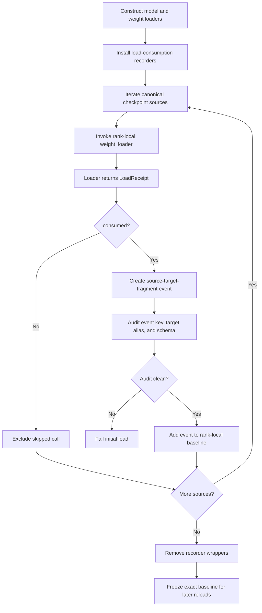
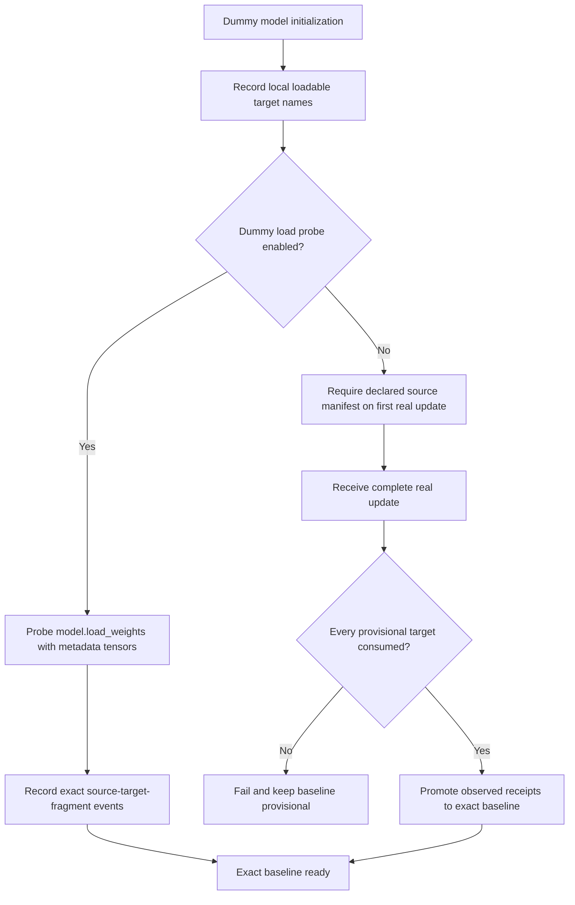
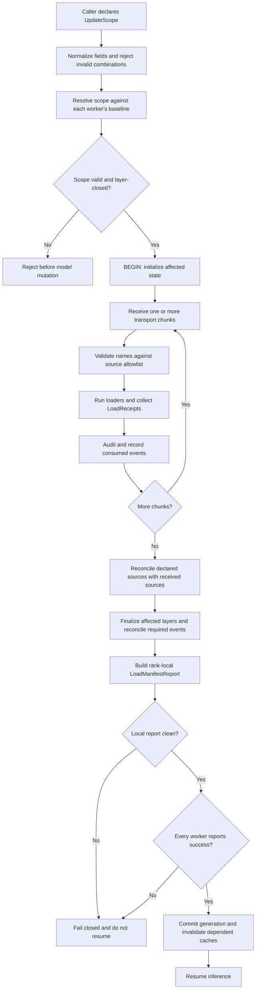
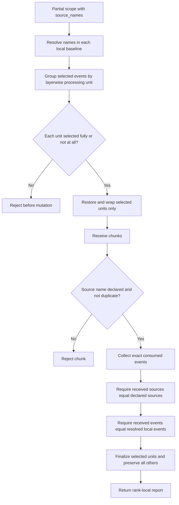
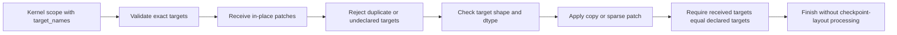
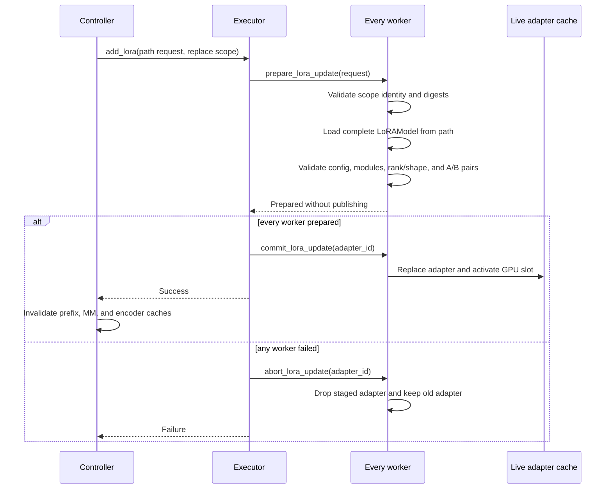
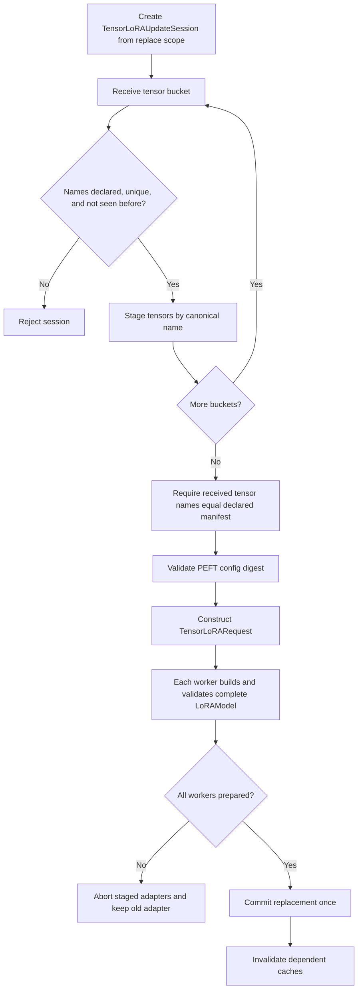
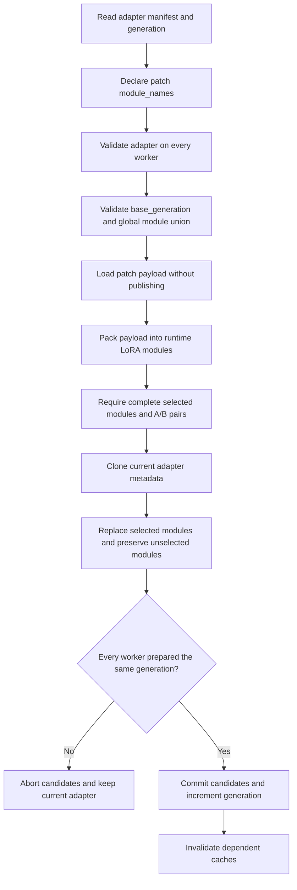

# Load Receipts and Weight Update Scopes

## Status and purpose

This document describes the end-to-end completion protocol implemented by load
receipts and explicit update scopes. It complements `TRANSACTION.md`: this
document owns the identity, baseline, scope-resolution, receipt, and
reconciliation flow, while `TRANSACTION.md` covers the wider reload transaction,
including storage stability and the engine-level commit decision.

The protocol answers four questions for every update:

1. What state is the caller allowed to change?
2. What logical load events must each worker observe?
3. Did the transport deliver the declared sources and did loaders consume the
   expected target fragments?
4. Is the worker allowed to report success?

It does not provide rollback for base-weight updates. A failed base update is
rejected and serving must not resume with that worker's partially mutated model.
LoRA replacement is different: it stages a complete adapter before replacing the
live adapter.

## Concepts

### Load receipt

A `LoadReceipt` is the result of one logical `weight_loader` invocation:

```text
LoadReceipt(
    consumed=True | False,
    fragment=(loaded_shard_id=q, expert_id=7, ...),
    collision_policy=unique | overwrite,
)
```

`consumed=False` means that the loader deliberately skipped the source, for
example because an expert does not belong to the local EP rank. A skipped call
does not enter the completion baseline.

The fragment identifies the logical part of a packed target. Examples include
Q/K/V shards, merged-column indices, and `(shard_id, expert_id, weight_name)` for
routed experts. A loader invocation is one logical event regardless of how many
internal `copy_` operations it performs.

Legacy loaders may still return `None` or `bool`; the compatibility adapter
derives a receipt from known scalar loader arguments. New packed or conditional
loaders should return a structured receipt deliberately.

### Load event

A consumed receipt becomes a structured, rank-local `LoadEventIdentity`:

```text
(canonical source name, target parameter name, logical fragment)
```

For example:

```text
model.layers.0.self_attn.q_proj.weight
  => model.layers.0.self_attn.qkv_proj.weight[loaded_shard_id='q']
```

Event identity is never reconstructed by parsing this display string. The
source, target, and fragment remain separate structured fields.

### Baseline

The initial known-good load records the exact events consumed by each worker.
This rank-local baseline is the completion contract for later full reloads and
the source of truth from which partial checkpoint scopes are resolved.

Baselines must remain rank-local. TP, PP, DP, and EP workers can consume
different targets or fragments; unioning their events before reconciliation
could hide a missing shard on one worker behind an event observed by another.

### Update scope

An `UpdateScope` declares which model state one update may change. For an
explicit scope, the declaration is both an allowlist and an exact completion
contract:

- missing in-scope state fails completion;
- consumed out-of-scope state is rejected;
- state outside the scope is preserved;
- duplicate transport names are rejected;
- transport chunks are delivery units, not independent scopes.

## Baseline construction

### Real initial checkpoint load

The recorder wraps effective loaders before the first checkpoint iterator is
consumed. It records only successful, consumed applications and removes itself
immediately after loading.



The collision audit detects event-key collisions, target alias collisions,
accepted/skipped status conflicts, schema drift, and receipt-schema mismatch.
This prevents a baseline from silently treating distinct semantic loader calls
as the same event.

### Dummy model load

A dummy load has no canonical checkpoint source stream. It therefore records a
provisional target-only baseline. There are two ways to obtain an exact baseline:



Partial checkpoint updates and adapter-only replacement are rejected while the
base model has only a provisional dummy baseline. The first real update must be
complete so that later scopes are based on an authoritative event set.

The baseline API returns `exact`, `provisional`, or `unavailable`. Aggregating
rank-local reports also exposes `atomic_source_groups`: a legal partial
checkpoint scope is a union of these groups.

## Common update lifecycle

Checkpoint transports validate completion at two independent levels:

- **source manifest:** did IPC/NCCL deliver exactly the declared source names?
- **load events:** did rank-local loaders consume the required target fragments?

Matching only one level is insufficient. A source can arrive but be routed to
the wrong fragment, while correct loader receipts cannot prove that an omitted
transport chunk was intentional.



The report includes worker parallel coordinates, required and received event
counts, completion findings, scope kind/mode, declared source names, and the
rank-local sources selected from the baseline.

## Scope modes

`UpdateScope` is a serializable tagged declaration:

```text
kind=base_checkpoint, mode=full
kind=base_checkpoint, mode=partial, source_names=[...]
kind=base_kernel, target_names=[...]
kind=lora_adapter, operation=replace|patch|remove,
    adapter_id=..., adapter_name=..., base_generation=...,
    module_names=[...], tensor_names=[...],
    config_digest=..., artifact_digest=...
```

`None` normalizes to the backward-compatible full checkpoint scope. Duplicate
names, empty explicit sets, unknown fields, and inconsistent field combinations
fail at normalization.

### Full checkpoint reload

Full checkpoint mode uses every event in the worker's exact baseline. Its
completion rule is a lower bound: every baseline event must be observed, while
additional accepted applications remain compatible with legacy full reload.
Transport source equality is enforced when the caller supplies
`expected_names`; it is mandatory for the first real update after an unprobed
dummy load.


This compatibility mode is suitable for a complete replacement stream. It is
not a declaration that omitted weights should retain their old values.

### Partial checkpoint reload

The caller supplies exact canonical checkpoint `source_names`. Each worker
looks those names up in its own baseline and expands them to the corresponding
target fragments.

Checkpoint restoration and `process_weights_after_loading` operate on whole
layerwise processing units. A partial scope is accepted only if every affected
unit selects all of its baseline events. Selecting only Q from packed QKV, one
quantization scale, or a subset of a processed MoE unit is rejected before
restoration begins.



PP ranks with no selected local events are valid no-op participants. TP and EP
ranks can resolve the same global source declaration to different local event
sets, but each rank must reconcile its own set exactly.

### Kernel-format update

Kernel-format updates target already processed parameters directly and do not
restore checkpoint layout or rerun post-load processing. The caller declares
exact `target_names`; parameter-level subsets are therefore legal.



This mode does not use checkpoint load receipts because it bypasses
`weight_loader`. Its equivalent completion evidence is exact target-name,
shape, dtype, and transport reconciliation.

### LoRA adapter replacement from a path

A LoRA scope identifies one adapter and a complete `replace` operation. A
path-backed request may declare artifact and PEFT configuration digests, but
cannot declare `tensor_names` because the worker reads the artifact itself.



The prepare phase protects the old adapter from load or validation failures.
Commit is coordinated after all workers prepare, but automatic rollback of a
commit failure is not provided.

### LoRA adapter replacement from tensors

The tensor-backed path is intended for training integrations that deliver one
adapter across multiple buckets. It requires an exact global `tensor_names`
manifest and a PEFT configuration.



Transport buckets do not become separate update scopes. Installation occurs
once, after the complete tensor manifest and all A/B pairs have been validated.

### LoRA adapter removal

A remove scope carries only adapter identity and `operation=remove`; replacement
fields are invalid. Removal has no receipt stream because no new adapter payload
is consumed. The controller must remove the identified adapter on every worker
and invalidate caches that may retain adapter-dependent results.

### LoRA adapter partial patch

A patch updates complete runtime LoRA modules while preserving every module
outside the scope. The caller obtains `module_names` and `generation` from
`GET /weight_update_manifest`, then declares the selected modules and matching
`base_generation`. Packed QKV and MoE modules are atomic runtime modules; their
internal fragments cannot be patched independently.



## Completion semantics by mode

| Mode | Declaration | Completion rule | Out-of-scope input | Processing boundary |
| --- | --- | --- | --- | --- |
| Full checkpoint | Omitted or `mode=full` | Initial local events are a subset of received events | Compatible extras may be accepted | All reloadable layers |
| Partial checkpoint | Exact source names | Resolved local events equal received events | Reject | Whole layerwise units only |
| Kernel format | Exact target names | Declared targets equal received targets | Reject | Individual runtime parameters |
| LoRA path replace | Adapter identity and optional digests | Every worker stages one complete validated adapter | Reject identity/digest mismatch | Complete adapter |
| LoRA tensor replace | Adapter identity, exact tensor names, config | Declared tensors equal accumulated tensors; every worker stages successfully | Reject unknown/duplicate tensors | Complete adapter |
| LoRA partial patch | Adapter identity, generation, modules, payload | Every selected runtime module has complete A/B weights on every owning worker | Reject stale generation or undeclared modules | Selected complete runtime modules |
| LoRA remove | Adapter identity | Adapter removed on every worker | No payload allowed | Complete adapter |

## Failure boundaries

The protocol fails before mutation whenever possible:

- malformed scope declarations;
- partial checkpoint scopes that split a processing unit;
- undeclared or duplicate transport names;
- load-receipt collision or schema findings;
- LoRA identity, manifest, digest, module, shape, or A/B-pair mismatch.

Failures discovered after a base checkpoint/kernel mutation are fail-closed:
the update is unsuccessful and the engine must not resume that generation. The
current implementation does not reconstruct the previous base-weight values.

LoRA replacement keeps the old adapter until preparation succeeds everywhere.
An abort discards pending adapters. Once commit begins, however, a worker-level
commit failure is not automatically rolled back on workers that already
published the replacement.

## Compatibility and migration

- Omitting a scope preserves legacy full-checkpoint behavior.
- Existing `expected_names` remains accepted. If an explicit scope also
  declares names, both declarations must agree.
- Legacy `None`/`bool` loaders are adapted to receipts while loader schemas are
  migrated.
- Exact lower-and-upper-bound completion is required for explicit scopes.
- Full reload retains lower-bound event completion to tolerate established
  broadcast and loader behavior.
- A dummy model must establish an exact baseline through probing or its first
  complete real update before partial checkpoint or LoRA-only updates.

## Required validation

- a real first load records consumed rank-local events and excludes skipped EP
  applications;
- receipt schemas distinguish packed QKV, merged projections, and routed MoE
  fragments without collisions;
- dummy probing or first-real-update promotion produces an exact baseline;
- full reload detects missing baseline events without rejecting compatible
  extras;
- partial scopes accept unions of atomic source groups and reject split units;
- source and event reconciliation catch unknown, missing, duplicate, and
  unexpected names independently;
- PP no-op and TP/EP rank-local resolutions succeed;
- kernel scopes enforce exact target names, shapes, and dtypes;
- path-backed and multi-bucket tensor-backed LoRA replacement stage before
  publish and install exactly once;
- LoRA manifest/config mismatch and incomplete A/B pairs preserve the old
  adapter;
- every worker report is checked and dependent caches are invalidated before
  inference resumes.
