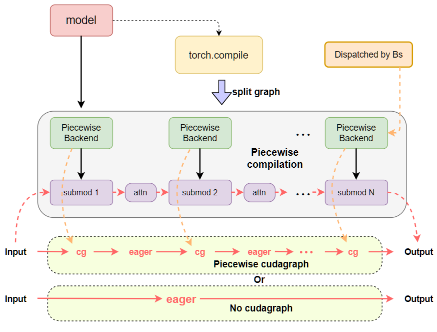
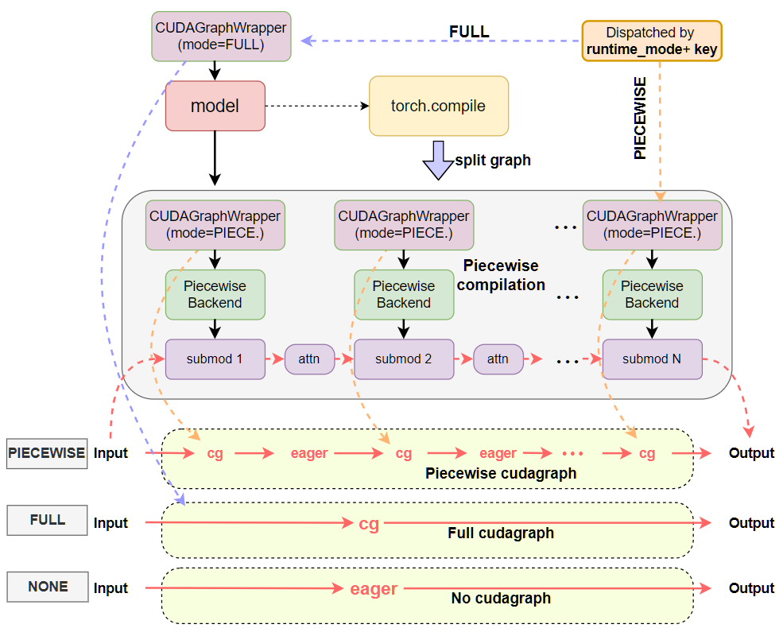
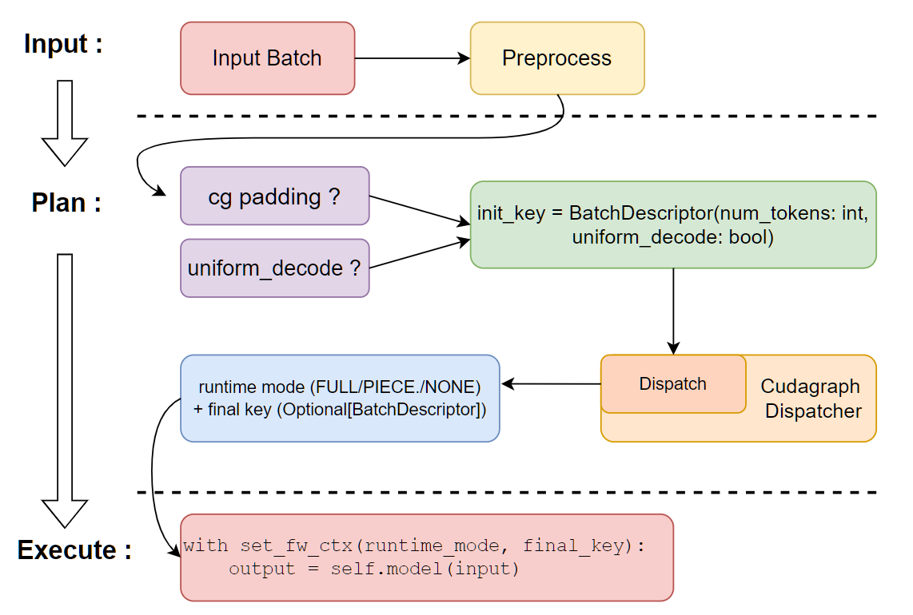
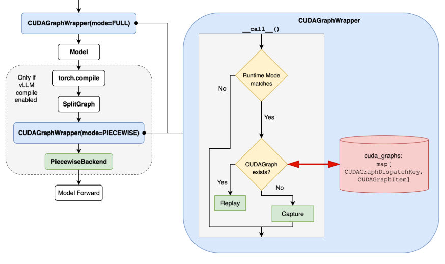

# CUDA Graphs

This write-up introduces the new CUDA Graphs modes in vLLM v1 beyond previous [torch.compile integration](torch_compile.md). To summarize, we:

1. Added flexible `cudagraph_mode` configuration
2. Made full CUDA Graphs support orthogonal to compilation
3. Introduced a CUDA Graphs dispatcher as a central controller that picks the desired runtime mode and CUDA Graphs per batch automatically

In this document we will discuss the:

* [Motivation](#motivation)
* [CUDA Graphs modes](#cudagraphmodes)
* [Detailed design](#detailed-design)
* [Example usage of the different CUDA Graphs modes](#usage-guide)

!!! note
    In this document, we refer to pure decode (`max_query_len=1`) or speculative decode (`max_query_len =1+num_spec_tokens`) as **uniform decode** batches, and the opposite would be **non-uniform** batches (i.e., prefill or mixed prefill-decode batches).

!!! note
    The following contents are mostly based on the last commit of <https://github.com/vllm-project/vllm/pull/20059>.

## Motivation

Initial piecewise compilation was built to allow piecewise cudagraph capture, excluding cudagraph-unsupported operations (mainly attention). This allowed some speedup from cudagraphs while maintaining compatibility with all attention backends. We later added support for "full cudagraphs" by not compiling piecewise, so that we could further reduce the latency in cases where attention supported cudagraphs. However, this tight coupling between compilation and cudagraph capture led to an all-or-nothing experience with little flexibility. Many attention backends also weren’t ready for unified "full" CUDA Graphs capture (e.g., only FlashAttention 3 supports it currently) or only support CUDA Graphs for pure decode batches (e.g., Flashinfer, FlashMLA, and Mamba, etc.). That led to confusing performance/compatibility tradeoffs, inconsistent CUDA Graphs support, and increasingly complex code structure.

This led us to seek a more fine-grained CUDA Graphs solution with the following features:

* Explicitly aware of CUDA Graphs for prefill/mixed or (uniform-)decode batch and capture them separately.
* Separate CUDAGraph capture logic from compilation (as much as feasible) for feature orthogonality, which suggest:
    * Capturing piecewise and full cudagraphs using the same compiled graph, and
    * Full cudagraph capture without compilation.
* Dispatch between full and piecewise cudagraph at runtime depending on batch composition.
* Centralized control of CUDAGraph behavior for reduced code complexity and allowed more extendibility.

These features allow the most flexibility for cudagraph capture and compilation for all kinds of startup/performance tradeoffs and feature support.

## `CudagraphModes`

[CUDAGraphMode][vllm.config.compilation.CUDAGraphMode] is the single knob you tune in `CompilationConfig.cudagraph_mode`:

* `NONE` — turn CUDA Graphs off. Good for debugging.
* `PIECEWISE` —  a single-mode strategy (and past default). It is the most flexible: attention or other CUDA Graphs-incompatible operations stay eager, everything else goes into CUDA Graphs. Requires piecewise compilation.
* `FULL` — a single-mode strategy, which only captures full CUDA Graphs for non-uniform batches, then uniform-decode batches reuse the CUDA Graph of non-uniform batch of the same batch_size, since they are compatible; can be good for small models or workloads with small prompts.
* `FULL_DECODE_ONLY` — full CUDA Graph for uniform decode, no cudagraph for prefill/mixed etc; suitable for decode instances in a P/D setup where prefill is not as important, this way we can save the memory needed for `PIECEWISE` CUDA Graphs.
* `FULL_AND_PIECEWISE` — (default mode) full CUDA Graph for uniform decode, piecewise CUDA Graphs for others; generally the most performant setting, especially for low latency with small models or MoEs, but also requires the most memory and takes the longest to capture.

Defaults: If you’re on v1 with piecewise compilation, we default to `FULL_AND_PIECEWISE` for better performance, (for pooling models, it's still `PIECEWISE`). Otherwise, e.g. if piecewise compilation unavailable, we default to `NONE`.

While `NONE` , `PIECEWISE`, and `FULL` are single-mode configurations and simply equivalent to past implementations of eager execution, piecewise CUDA Graphs, and full CUDA Graphs respectively, `FULL_DECODE_ONLY` and `FULL_AND_PIECEWISE` are newly appended dual-mode configurations, which require dispatching to switch between concrete runtime modes according to runtime batches dynamically.

!!! note
    Here, the single-modes `NONE`, `PIECEWISE`, and `FULL` are treated as the runtime modes for CUDA Graphs dispatching. If using a dual-mode, the dispatcher will always dispatch to one of its member modes (plus a potantial `NONE` if no suitable CUDA Graph available), depending on the batch composition.

While cascade attention is not cudagraph compatible, it is now compatible with all possible cudagraph mode configurations. If a batch uses cascade attention, it always gets dispatched to `PIECEWISE` mode if available (otherwise `NONE`).

!!! note
    Not all CUDA Graph modes are compatible with every attention backend. We automatically "downgrade" modes to the closest supported mode. For example, if a backend only supports CUDA Graphs for pure decode/uniform batches, we convert `FULL` to `FULL_AND_PIECEWISE` if piecewise compilation is enabled, and `FULL_DECODE_ONLY` otherwise.

## Detailed Design

### Overview

The new CUDA Graphs logic is built on top of piecewise compilation and supports dual CUDA Graphs runtime mode switching. The system contains the following core components:

* [CUDAGraphWrapper][vllm.compilation.cuda_graph.CUDAGraphWrapper]: wrapper that handles CUDAGraph capture & replay on the wrapped callable
* [CudagraphDispatcher][vllm.v1.cudagraph_dispatcher.CudagraphDispatcher]: the central controller that contains the single source of truth about CUDA Graphs and handles dispatching between them.
* [CUDAGraphMode][vllm.config.compilation.CUDAGraphMode]: enum describing the supported and runtime modes (introduced above).
* [BatchDescriptor][vllm.forward_context.BatchDescriptor], serving as a unique representation of the runtime batch used for dispatching.

See the following figures for a quick comparison between the previous and current design patterns of CUDA Graphs with inductor compilation. We can see that previously the CUDA Graphs logic and compilation logic were tightly coupled into the vllm `PiecewiseBackend`, and CUDA Graphs was implicitly dispatched by `batch_size` idly. Now the CUDA Graphs logic is separated into the `CUDAGraphWrapper` class, responsible for both full and piecewise CUDA Graphs abilities, and dispatching is **explicitly** done via **runtime mode** plus the `BatchDescriptor` as the **dispatch key** via `CudagraphDispatcher`.

**Before:**



**After:**



### `BatchDescriptor`

[BatchDescriptor][vllm.forward_context.BatchDescriptor] is a component within `ForwardContext`, alongside the CUDA Graphs runtime modes, serving as the core structure for dispatching keys at runtime. The prototype is:

```python
class BatchDescriptor(NamedTuple):
    num_tokens: int
    num_reqs: int
    uniform: bool = False
    has_lora: bool = False
```

where `num_tokens` can be the padded token length, and `uniform` indicates if all the requests have the same query lengths. Many attention backends only support full cudagraphs when the batches are uniform; pure decode batches are uniform but may not be query length 1 (i.e. `num_tokens == num_reqs`), this occurs in the validation pass of spec-decode where "decode" batches will have a query length of  `1+num_spec_tokens`.

The goal of this structure is to uniquely identify a (padded) batch with minimal possible items corresponding to a CUDA Graphs item.

!!! note
    The prototype of `BatchDescriptor` may be extended for more general situations in the future, e.g., include more items, like `uniform_query_len` to support multiple different uniform decode lengths settings (<https://github.com/vllm-project/vllm/pull/23679>), or other modifications needed to support CUDA Graphs for models whose inputs are not necessarily token length aware (for example, some multi-modal inputs).

### `CudagraphDispatcher`

The [CudagraphDispatcher][vllm.v1.cudagraph_dispatcher.CudagraphDispatcher] takes responsibility for maintaining two sets of valid dispatching keys, one set for `FULL` runtime mode and one set for `PIECEWISE` runtime mode, and dispatches the correct runtime mode and the dispatching keys before executing the model's forwards. It will take in the initial key (a rough batch_descriptor for the padded input) and return the selected runtime mode and the final batch_descriptor, then tell the CUDAGraphWarpper instances that decision through forward contexts. Notice that `CudagraphDispatcher` is the only source of truth for available CUDA Graph keys and `CUDAGraphWrapper` instances can blindly trust the forward context on what CUDA Graphs to dispatch to. This lets us simplify the wrapper code and centralize the logic in the dispatcher.

The dispatching keys are initialized through the dispatcher's `initialize_cudagraph_keys` method, which is called by the gpu_model_runner after all possible attention backends are initialized. This is where we can get much fancier in the future and “prepare” all kinds of CUDA Graphs combinations. For now, we just append available keys based on the valid combos of `decode_mode`/`mixed_mode` of `cudagraph_mode` and `cudagraph_capture_sizes` in the compilation config.

The dispatch code looks like:

```python
batch_descriptor=BatchDescriptor(num_tokens=num_input_tokens, uniform_decode=...)
runtime_mode, batch_descriptor = cudagraphdispatcher.dispatch(batch_descriptor)
# execution
with set_forward_context(
    ..., 
    cudagraph_runtime_mode=runtime_mode, 
    batch_descriptor=batch_descriptor,
):
     output = self.model(...)
```

Inside the `dispatch()` method, the dispatcher will search the proper CUDA Graphs runtime mode and existing dispatching keys for a return. We basically search the existing keys following the priority: `FULL`>`PIECEWISE`>`None`. If the dispatching key does not exist, default to return `NONE` mode for eager execution. The implementations can be found [here](https://github.com/vllm-project/vllm/blob/main/vllm/v1/cudagraph_dispatcher.py#L91).

Here is a simplified illustration of the workflow at runtime in the model executor:


### `CUDAGraphWrapper`

A [CUDAGraphWrapper][vllm.compilation.cuda_graph.CUDAGraphWrapper] instance wraps a runnable and simply mimics the runnable with appended CUDA Graphs abilities. Each wrapper instance is bound to a specific `runtime_mode`, which is restricted to `PIECEWISE` and `FULL` mode, and takes responsibility for capturing/replaying and passing through (directly calling) the runnable.  At runtime, each wrapper would:

1. inspect the runtime_mode and batch_descriptor(dispatching key) from the global forward context.
2. If runtime_mode is `NONE` or runtime_mode does not match the mode of the wrapper, just call the runnable directly.
3. Otherwise, i.e., the runtime_mode matches the mode of the wrapper, the wrapper will perform CUDA Graphs capture (if key does not exist, create
a new entry and cache it) or replay (if key exists in the cache).

The above steps are based on the assumption that the CUDA Graphs wrapper would directly trust what’s in the forward context (controlled by the dispatcher). This lets us simplify and centralize the logic, reducing the complexity as well as the risk of mismatched state between the wrappers and the dispatcher. It also allows reusing the wrapper class for both `FULL` and `PIECEWISE` runtime modes. See the implementation [here](https://github.com/vllm-project/vllm/blob/f751e50b7a2aae3110d83ed0d88202fc91b3e78a/vllm/compilation/cuda_graph.py#L106).

#### Nested Wrapper design

The core mechanism of making a full CUDA Graphs and piecewise CUDA Graphs coexist and compatible is the nested CUDA Graphs wrapper design, building on top of piecewise compilation with only a single piecewise FX graph.  We wrap a FULL mode wrapper outside the entire model for the full CUDA Graphs functionality; meanwhile, each piecewise backend is wrapped via a `PIECEWISE` mode wrapper inside the compilation.

The flow chart below should clearly describe how it works.


Therefore, for a `FULL` runtime mode, it is safe to capture/replay a full CUDA Graph since the piecewise wrapper is not activated. The situation is similar for `PIECEWISE` mode, as there are no conflicts between the `FULL` mode wrapper and `PIECEWISE` mode wrappers.  For the `NONE` runtime mode, both `FULL` and `PIECEWISE` wrappers would not be activated, so we simply fall through to eager execution.

### Full CUDA Graph capturing & warm-up

The CUDA Graphs capturing happens when the runner first calls the model forward (using `_dummy_run`) with a non-`NONE` runtime mode. For full CUDA Graph capture, we explicitly capture different cases (i.e., prefill/mixed batch or uniform_decode batch) by properly setting attention metadata to make sure the underlying attention backends launch the desired kernel routines. To distinguish prefill/mixed batch or uniform_decode batch, the most important property is the `max_query_len` in attn_metadata (true for most attention backends). We set it to the desired `uniform_query_len` for uniform_decode otherwise we make it just the `num_tokens` for a non-uniform_decode batch.

The CUDA Graphs wrapper no longer manages the warm-up logic. The warm-up process is now controlled directly by the GPU model runner, where the `NONE` runtime mode is assigned to play an eager execution for warm-up. When warming up for a full CUDA Graph, it is also important to explicitly run attention during the warmup `dummy_run` call.

## CUDA Graphs Compatibility of Attention Backends

To signal the CUDA Graphs compatibility of the attention backends, we introduce a new enum type [AttentionCGSupport][vllm.v1.attention.backends.utils.AttentionCGSupport], which is an enum type that tracks the capability of the attention backend to support CUDA Graphs. The value is sorted in the order of the capability, i.e., `ALWAYS`> `UNIFORM_BATCH`> `UNIFORM_SINGLE_TOKEN_DECODE`> `NEVER`.

```python
class AttentionCGSupport(enum.Enum):
    """ Constants for the CUDA Graphs support of the attention backend
    Here we do not consider the cascade attention, as currently
    it is never CUDA Graphs supported."""

    ALWAYS = 3
    """CUDA Graphs always supported; supports mixed-prefill-decode"""
    UNIFORM_BATCH = 2
    """CUDA Graphs supported for batches the only contain query lengths that are
    the same, this can be used for spec-decode 
        i.e. "decodes" are 1 + num_speculative_tokens"""
    UNIFORM_SINGLE_TOKEN_DECODE = 1
    """CUDA Graphs supported for batches the only contain query_len==1 decodes"""
    NEVER = 0
    """NO CUDA Graphs support"""
```

Suppose we have hybrid attention backends (e.g., in mamba mixer models). In that case, we seek the minimum capability of all backends to determine the final capability of the model, and we might resolve the incompatible CUDA Graphs mode by downgrading the mode to the best fit one. For example, downgrading `FULL` mode to `FULL_AND_PIECEWISE` mode if the minimum capability is `UNIFORM_BATCH`, or `PIECEWISE` mode if the minimum capability is `NEVER` for -O3 compilation mode. For the complete fallback policy, please see the code for [this][vllm.v1.worker.gpu_model_runner.GPUModelRunner._check_and_update_cudagraph_mode].

The following table lists backends that support full CUDA Graphs at the time of writing.

| Attention Backend | cudagraph_support | Comments |
|:---|:---|:---|
| FlashAttention v2 | `UNIFORM_BATCH` | Actually `ALWAYS` but workaround to fallback to `FULL_AND_PIECEWISE` for performance reason |
| FlashAttention v3 | `ALWAYS` | has unified routine for both batches, so `FULL` mode is good |
| Triton Attention | `ALWAYS` | prefer `FULL_AND_PIECEWISE` since it has different kernels for prefill/mixed and pure decode batches |
| AITER FlashAttention | `UNIFORM_BATCH`| |
| FlashInfer | `UNIFORM_SINGLE_TOKEN_DECODE` | Will be set to `UNIFORM_BATCH` when using TRTLLM attention on Blackwell |
| FlashMLA | `UNIFORM_BATCH` | |
| FlashInferMLA | `UNIFORM_BATCH` | |
| AITER MLA | `UNIFORM_SINGLE_TOKEN_DECODE` | |
| CUTLASS MLA | `UNIFORM_SINGLE_TOKEN_DECODE` | |
| Mamba attention| `UNIFORM_SINGLE_TOKEN_DECODE` | |

Unlisted backends are all declared as `NEVER`.

## Usage guide

Now the CLI is directly using the uppercase string of cudagraph_mode for compilation_config: `--compilation-config '{"cudagraph_mode": "..."}'`, where `...` should be one of `NONE`, `PIECEWISE`, `FULL`, `FULL_DECODE_ONLY`, and `FULL_AND_PIECEWISE`. Note that all `PIECEWISE` related modes require piecewise compilation, and all `FULL` related modes need CUDA Graphs support of attention backends. For example:

```bash
vllm serve --model meta-llama/Llama-3.1-8B-Instruct --compilation-config '{"cudagraph_mode": "FULL_AND_PIECEWISE"}'
```

### Python examples

```python
import os
os.environ.setdefault("VLLM_LOGGING_LEVEL", "DEBUG")

import vllm
from vllm.config import CUDAGraphMode

compilation_config = {"mode": 3, "cudagraph_mode": "FULL_AND_PIECEWISE"}
model = vllm.LLM(
    model="meta-llama/Llama-3.1-8B-Instruct",
    dtype="auto",
    compilation_config=compilation_config,
)
sampling_params = vllm.SamplingParams(
    temperature=0,  # greedy decoding
    max_tokens=1024,
)
outputs = model.generate(
    ["My name is John and"],
    sampling_params=sampling_params,
)
```

### Piecewise compilation and full graph custom passes (attention fusion, sequence parallelism)

Unfortunately, some custom compile passes have to see the whole graph to be effective and hence aren't compatible with piecewise compilation. This includes `AttnFusionPass` and `SequenceParallelismPass`. As a short-term solution, we automatically disable piecewise compilation (by setting `splitting_ops=[]`) when attention fusion is enabled. We use CUDA Graph modes `FULL` or `FULL_DECODE_ONLY` (depending on backend support). However, this leads to another optimization incompatibility and confusing performance tradeoffs.

Long term, we've added the ability to partition the graph in Inductor instead of right after Dynamo. It can be enabled with `CompilationConfig.use_inductor_graph_partition=True` but is currently experimental and only available with `torch>=2.9`. This also increases compilation time as it has to compile the whole graph and cannot reuse piecewise compilation artifacts. Once vLLM supports 2.9, we plan to make this the default approach as it will also speed up piecewise cudagraph capture.

## About the Performance

See the following links for examples:

* [20059#issuecomment-3160858458](https://github.com/vllm-project/vllm/pull/20059#issuecomment-3160858458)
* [20059#issuecomment-3188735226](https://github.com/vllm-project/vllm/pull/20059#issuecomment-3188735226)
* [20059#issuecomment-3219888738](https://github.com/vllm-project/vllm/pull/20059#issuecomment-3219888738)
