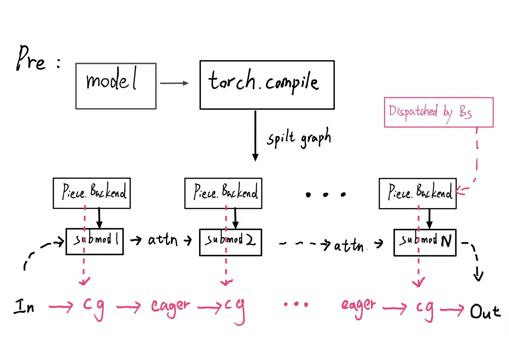
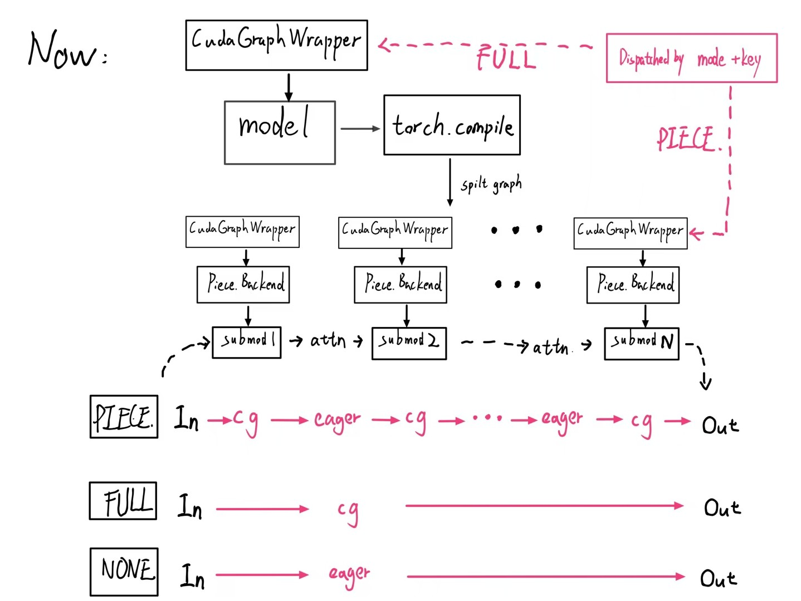
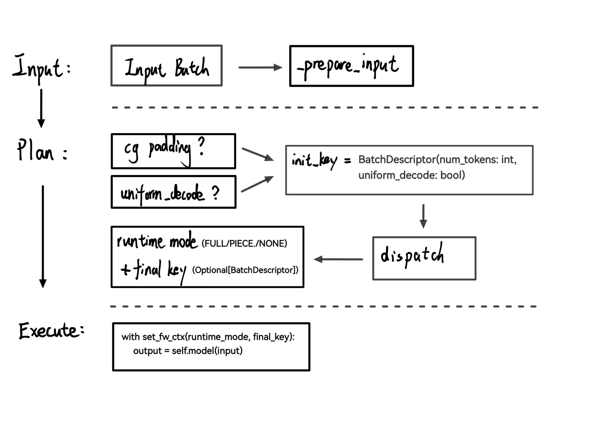

# CUDA Graphs in vLLM v1

This write-up introduces the new CUDA Graph modes in vLLM v1 beyond previous [torch.compile Integration](torch_compile.md). To summarize, we (a.) added flexible `cudagraph_mode` configuration, (b.) made full CUDA Graphs support orthogonal to compilation, and (c.) introduced a cudagraph dispatcher as a central controller that picks the desired runtime mode and cudagraphs per batch automatically.  

Throughout the document, we will walk through the motivation, cudagraph modes, the detailed design, and the usage examples of the CUDA Graph modes.

!!! note
    In this document, we refer to pure decode (`max_query_len=1`) or speculative decode (`max_query_len =1+num_spec_tokens`) as **uniform decode** batches, and the opposite would be **non-uniform** batches (i.e., prefill or mixed prefill-decode batches).

!!! note
    The following contents are based on the last commit of <gh-pr:20059>.


## Motivation

In the past [torch.compile integration](torch_compile.md), we achieved a balance between performance and attention operation compatibility using piecewise compilation (+piecewise cudagraph). However, when users flipped on full CUDA Graphs, which rely on no splitting compilation, the experience used to be all-or-nothing, tightly coupled to compilation, and therefore lost the flexibility attention supports (i.e., cascade attention is incompatible with cudagraph). Many attention backends also weren’t ready for unified "full" cuda graphs capture (e.g., only FlashAttention 3 supports it currently) or only support cuda graphs for pure decode batches (e.g., Flashinfer, FlashMLA, and Mamba, etc.). That may lead to confusing performance/compatibility tradeoffs, inconsistent cudagraph supports, and increasingly complex code structures.

So we seek a more fine-grained cudagraph solution that can:

* Explicitly aware of whether a batch is prefill/mixed batch or a uniform decode batch and should capture/replay the cudagraphs accordingly, as a unified full cudagraph for different cases of the same batchsize is commonly unfeasible (e.g., for many attention backends).
* Capture "full" while maintaining the ability to use piecewise cudagraphs. i.e, can dispatch cudagraph-incompatible routines (e.g., cascade attention or mixed prefill/decode batches for some attention backends) into piecewise cudagraphs.
* Achieve centralized control of the cudagraph behavior via a dispatcher, which makes cudagraph dispatching easier to understand and more extensible.
* Final and also minor, add cuda graph support to models that do not fit vllm's torch.compile integration system design in v1.

Apart from the above concerns, we also found that when a batch cannot hit a full cudagraph, the host-side eager execution of the flattened compiled fx graph(previous behavior) can be slower than the piecewise compiled fx graph in Python (see [here](gh-pr:20059>)). So we favor maintaining the piecewise compilation when enabling full cudagraphs to reduce host-side overhead. We can safely do this as full cudagraph and compilation are actually orthogonal to each other.


## CudagraphModes

`CUDAGraphMode` (enum type) is the single knob you tune in `CompilationConfig.cudagraph_mode`:

* `NONE` — turn CG off. Good for debugging.
* `PIECEWISE` — default in v1. It is the most flexible: attention or other cudagraph-incompatible operations stay eager, everything else goes into CG.
* `FULL` — a single-mode strategy, which only captures full cudagraphs for non-uniform batches, then uniform-decode batches reuse the cudagraph of non-uniform batch of the same batch_size, since they are compatible; can be good for small models or workloads with small prompts.
* `FULL_DECODE_ONLY` — full cudagraph for uniform decode, eager run for prefill/mixed etc; suitable for decode instances in a P/D setup where prefill is not as important, so we can save some memory.
* `FULL_AND_PIECEWISE` — full cudagraph for uniform decode, piecewise cudagraph for others; the general most performant setting for most models.

Defaults: If you’re on v1 with piecewise compilation, we default to `PIECEWISE` for safety reasons (for mamba mixer models, it's `FULL_AND_PIECEWISE`). Otherwise, we default to `NONE`.

!!! note
    We also fuse the subset modes `NONE`, `PIECEWISE`, and `FULL` as the concrete runtime modes for cudagraph dispatching, so they are treated as one of the "decode_mode" or "mixed_mode" at runtime.

While `NONE` , `PIECEWISE`, and `FULL` are single-mode configurations and simply equivalent to past implementations of eager execution, piecewise cudagraph, and full cudagraph respectively, `FULL_DECODE_ONLY` and `FULL_AND_PIECEWISE` are newly appended dual-mode configurations, which require dispatching to switch between concrete runtime modes according to runtime batches dynamically.

!!! note
    Not all the above modes are valid for every attention backend. We will discuss the compatibility later. But for users' experience, we alias `FULL` mode to `FULL_AND_PIECEWISE` (-O 3) or `FULL_DECODE_ONLY` (-O 0) for attention backends that support cudagraph for only pure decode or uniform decode.


## Detailed Design

### Overview

The new CUDA Graph logic is built on top of piecewise compilation and supports dual cudagraph runtime mode switching. To make the system work, there are two core classes, i.e., [CUDAGraphWrapper][vllm.compilation.cuda_graph.CUDAGraphWrapper] and [CudagraphDispatcher][vllm.v1.cudagraph_dispatcher.CudagraphDispatcher] and an auxiliary component, i.e., [CUDAGraphMode][vllm.config.compilation.CUDAGraphMode] (introduced above) used for runtime mode, [BatchDescriptor][vllm.forward_context.BatchDescriptor] serving as the dispatch key.

See the following figures for a quick comparison between the previous and current design patterns of cudagraph with inductor compilation. We can see that previously the cudagraph logic and compilation logic were tightly coupled into the vllm `PiecewiseBackend`, and cudagraph was implicitly dispatched by `batch_size` idly. Now the cudagraph logic is separated into the `CUDAGraphWrapper` class, responsible for both full and piecewise cudagraphs abilities, and dispatching is **explicitly** done via **runtime mode** plus the `BatchDescriptor` as the **dispatch key** via `CudagraphDispatcher`.






### [BatchDescriptor][vllm.forward_context.BatchDescriptor]

`BatchDescriptor` is a component within `ForwardContext`, alongside the cudagraph runtime modes, serving as the core structure for dispatching keys at runtime. The prototype is:

```python
class BatchDescriptor(NamedTuple):
    num_tokens: int
    uniform_decode: bool = False
```

where num_tokens can be the padded token length, and uniform_decode is determined by if `max_query_len` of a batch is equal to the desired `max_query_len` of a uniform_decode, and the num_scheduled_tokens is divisible by that desired `max_query_len`.

The goal of this structure is to uniquely identify a (padded) batch with minimal possible items corresponding to a cudagraph item. We are safe to exclude items like `uniform_query_len` because it is a constant at runtime for a certain setup currently. For example, it should be either `1` for a commonly pure decode or `1+num_spec_tokens` for a validation phase of speculative decode.

!!! note
    The prototype of `BatchDescriptor` may be extended for more general situations in the future, e.g., include more items, like `uniform_query_len` to support multiple different uniform decode lengths settings (<gh-pr:23679>), or other modifications needed to support cudagraphs for models whose inputs are not necessarily token length aware (for example, some multi-modal inputs).


### [CudagraphDispatcher][vllm.v1.cudagraph_dispatcher.CudagraphDispatcher]

The dispatcher takes responsibility for maintaining two sets of valid dispatching keys, one set for `FULL` runtime mode and one set for `PIECEWISE` runtime mode, and dispatches the correct runtime mode and the dispatching keys before executing the model's forwards. It will take in the initial key (a rough batch_descriptor for the padded input) and return the selected runtime mode and the final batch_descriptor, then tell the CUDAGraphWarpper instances that decision through forward contexts.  We should notice that CudagraphDispatcher is the only source of truth for available cudagraph keys, and the CUDAGraphWrapper instances could have less logic and unquestioningly trust the forward context on what cudagraph to dispatch to.

The dispatching keys are initialized through the dispatcher's `initialize_cudagraph_keys` method, which is called by the gpu_model_runner after all possible attention backends are initialized. This is where we can get much fancier in the future and “prepare” all kinds of cudagraph combos. But for now, we just append available keys based on the valid combos of `decode_mode`/`mixed_mode` of cudagraph_mode and `cudagraph_capture_sizes` in the compilation config.

The dispatching code is like:

```python
batch_descriptor=BatchDescriptor(num_tokens=num_input_tokens, uniform_decode=...)
runtime_mode, batch_descriptor = cudagraphdispatcher.dispatch(batch_descriptor)
# execution
with set_forward_context(..., 
            cudagraph_runtime_mode=runtime_mode, 
            batch_descriptor=batch_descriptor):
     output = self.model(...)
```

Inside the `dispatch()` method, the dispatcher will search the proper cudagraph runtime mode and existing dispatching keys for a return. We basically search the existing keys following the priority: `FULL`>`PIECEWISE`>`None`. If the dispatching key does not exist, default to return `NONE` mode for eager execution. The implementations can be found [here](https://github.com/vllm-project/vllm/blob/main/vllm/v1/cudagraph_dispatcher.py#L91).

Here is a simplified illustration of the workflow at runtime in the model executor:



### [CUDAGraphWrapper][vllm.compilation.cuda_graph.CUDAGraphWrapper]

A `CUDAGraphWrapper` instance wraps a runnable and simply mimics the runnable with appended cudagraph abilities. Each wrapper instance is bound to a specific `runtime_mode`, which is restricted to `PIECEWISE` and `FULL` mode, and takes responsibility for capturing/replaying and passing through (directly calling) the runnable.  At runtime, each wrapper would:

1. inspect the runtime_mode and batch_descriptor(dispatching key) from the global forward context.
2. If runtime_mode is `NONE` or runtime_mode does not match the mode of the wrapper, just call the runnable directly.
3. Otherwise, i.e., the runtime_mode matches the mode of the wrapper, the wrapper will perform cudagraph capture(if key does not exist, create
a new entry and cache it) or replay (if key exists in the cache).

The above steps are based on the assumption that the cudagraph wrapper would directly trust what’s in the forward context (controlled by the dispatcher) without any fallback behavior. See the implementation [here](https://github.com/vllm-project/vllm/blob/main/vllm/compilation/cuda_graph.py#L106).


#### Nested Wrapper design

The core mechanism of making a full cudagraph and piecewise cudagraph coexist and compatible is the nested cudagraph wrapper design, building on top of piecewise compilation with only a single piecewise fx graph.  We wrap a FULL mode wrapper outside the entire model for the full cudagraph functionality; meanwhile, each piecewise backend is wrapped via a `PIECEWISE` mode wrapper inside the compilation.

The flow chart below should clearly describe how it works.


Therefore, for a `FULL` runtime mode, it is safe to capture/replay a full cudagraph since the piecewise wrapper is not activated. The situation is similar for `PIECEWISE` mode, as there are no conflicts between the `FULL` mode wrapper and `PIECEWISE` mode wrappers.  For the `NONE` runtime mode, both `FULL` and `PIECEWISE` wrappers would not be activated, so an eager execution is passed.


### Full cudagraph capturing & warm-up

The cudagraph capturing happens on the first call runner's dummy_run in a non-`NONE` runtime mode. And for full cudagraph capture (pass `FULL` runtime mode), the core idea of explicitly capturing different cases (i.e., prefill/mixed batch or uniform_decode batch ) is to tell the underlying attention backend to launch the desired kernel routines (i.e., may launch different kernels or combos for different cases) via carefully crafting the attn_metadatas. To distinguish prefill/mixed batch or uniform_decode batch, the most important property is the `max_query_len` in attn_metadata (true for most attention backends). we set it to the desired uniform_query_len for uniform_decode otherwise we make it just the `num_tokens` for a non-uniform_decode batch.

The cudagraph wrapper no longer manages the warm-up logic. The warm-up process is now controlled directly by the GPU model runner, where the `NONE` runtime mode is assigned to play an eager execution for warm-up. When warming up for a full cudagraph, it is also important to pass `force_attention=True` to the `dummy_run` function to explicitly warm up the attention backends.


## Cudagraph Compatibility of Attention Backends

To signal the cuda graph compatibility of the attention backends, we introduce a new enum type [AttentionCGSupport][vllm.v1.attention.backends.utils.AttentionCGSupport], which is an enum type that tracks the capability of the attention backend to support cudagraph. The value is sorted in the order of the capability, i.e., `ALWAYS`> `UNIFORM_BATCH`> `UNIFORM_SINGLE_TOKEN_DECODE`> `NEVER`.

```python
class AttentionCGSupport(enum.Enum):
    """ Constants for the cudagraph support of the attention backend
    Here we do not consider the cascade attention, as currently
    it is never cudagraph supported."""

    ALWAYS = 3
    """Cudagraph always supported; supports mixed-prefill-decode"""
    UNIFORM_BATCH = 2
    """Cudagraph supported for batches the only contain query lengths that are
    the same, this can be used for spec-decode 
        i.e. "decodes" are 1 + num_speculative_tokens"""
    UNIFORM_SINGLE_TOKEN_DECODE = 1
    """Cudagraph supported for batches the only contain query_len==1 decodes"""
    NEVER = 0
    """NO cudagraph support"""
```

Suppose we have hybrid attention backends (e.g., in mamba mixer models). In that case, we seek the minimum capability of all backends to determine the final capability of the model, and we might resolve the incompatible cudagraph mode by downgrading the mode to the best fit one. For example, downgrading `FULL` mode to `FULL_AND_PIECEWISE` mode if the minimum capability is `UNIFORM_BATCH`, or `PIECEWISE` mode if the minimum capability is `NEVER` for -O3 compilation level. For the complete fallback policy, please see the code of [initialize_cudagraph_capture][vllm.v1.worker.gpu_model_runner.GPUModelRunner.initialize_cudagraph_capture].

The following table lists backends that support full cudagraph at the time of writing.

| Attention Backend | cudagraph_support | Comments |
|:---|:---|:---|
| FlashAttention v2 | `UNIFORM_BATCH` | Actually `ALWAYS` but workaround to fallback to `FULL_AND_PIECEWISE` for performance reason |
| FlashAttention v3 | `ALWAYS` | has unified routine for both batches, so `FULL` mode is good |
| Triton Attention | `ALWAYS` | prefer `FULL_AND_PIECEWISE` since it has different kernels for prefill/mixed and pure decode batches |
| AITER FlashAttention | `ALWAYS`| |
| FlashInfer | `UNIFORM_SINGLE_TOKEN_DECODE` | |
| FlashMLA | `UNIFORM_BATCH` | |
| AITER MLA | `UNIFORM_SINGLE_TOKEN_DECODE` | |
| CUTLASS MLA | `UNIFORM_SINGLE_TOKEN_DECODE` | |
| Mamba attention| `UNIFORM_SINGLE_TOKEN_DECODE` | Default is `FULL_AND_PIECEWISE` |

Unlisted backends are all declared as `NEVER`.


## Usage guide

Now the CLI is directly using the uppercase string of cudagraph_mode for compilation_config: `--compilation-config '{"cudagraph_mode": "..."}'`, where `...` should be one of `NONE`, `PIECEWISE`, `FULL`, `FULL_DECODE_ONLY`, and `FULL_AND_PIECEWISE`. Note that all `PIECEWISE` related modes require piecewise compilation, and all `FULL` related modes need cudagraph support of attention backends. For example:

```bash
vllm serve --model meta-llama/Llama-3.1-8B-Instruct --compilation-config '{"cudagraph_mode": "FULL_AND_PIECEWISE"}'
```


### Python examples

```python
import os
os.environ.setdefault("VLLM_LOGGING_LEVEL", "DEBUG")

import vllm
from vllm.config import CUDAGraphMode

compilation_config = {"level": 3, "cudagraph_mode": "FULL_AND_PIECEWISE"}
model = vllm.LLM(
            model="meta-llama/Llama-3.1-8B-Instruct",
            dtype='auto',
            compilation_config = compilation_config,
        )
sampling_params = vllm.SamplingParams(
    temperature=0,  # greedy decoding
    max_tokens=1024,
)
outputs = model.generate(
    "My name is John and",
    sampling_params=sampling_params,
)
```


### Migration from legacy flags

Legacy `use_cudagraph` and `full_cuda_graph` are unified by `cudagraph_mode`:

* `use_cudagraph=False` → `NONE`.
* `use_cudagraph=True` and `full_cuda_graph=False` → `PIECEWISE`.
* `full_cuda_graph=True` → directly set `FULL` and account for the graceful fallback policy.

As they are deprecated and will be removed in the next major or minor release, i.e., v0.11.0 or v1.0.0, we recommend using cudagraph_mode instead.


### NOTE for attention ops fusion

Currently, the default behavior of cudagraph_mode != `NONE` would always keep the attention ops in the splitting_ops to get a piecewise fx graph, causing attention ops fusion to be incompatible with piecewise cudagraph. In case one needs attention ops fusion, one can just manually pass `splitting_ops=[]` to compilation_config to retain the flattened fx graph, and use cudagraph_mode = "FULL" or "FULL_DECODE_ONLY" (should just avoid the PIECEWISE in mode even though we are using -O3). Currently, this RFC <gh-issue:23261> is tracking the progress of making attention ops fusion compatible with piecewise cudagraph to allow `FULL_AND_PIECEWISE` mode.


## About the Performance

See the following links for examples:

comment1: <https://github.com/vllm-project/vllm/pull/20059#issuecomment-3160858458>
comment2: <https://github.com/vllm-project/vllm/pull/20059#issuecomment-3188735226>
comment3: <https://github.com/vllm-project/vllm/pull/20059#issuecomment-3219888738>

