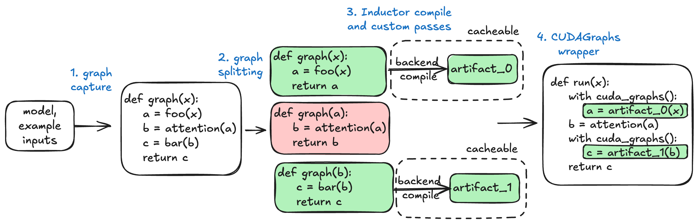
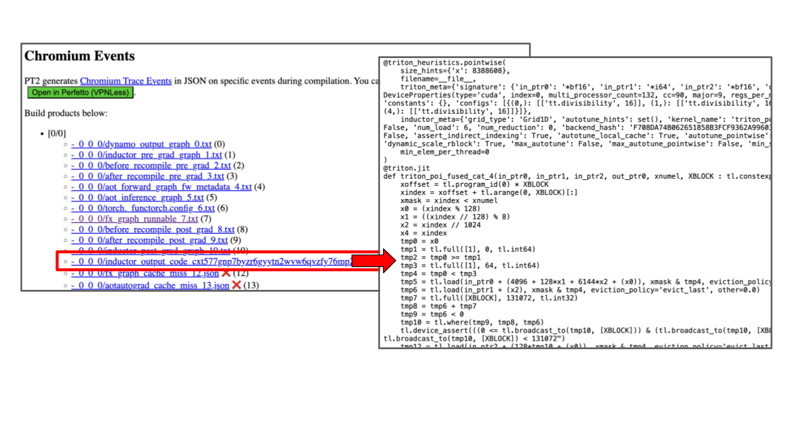
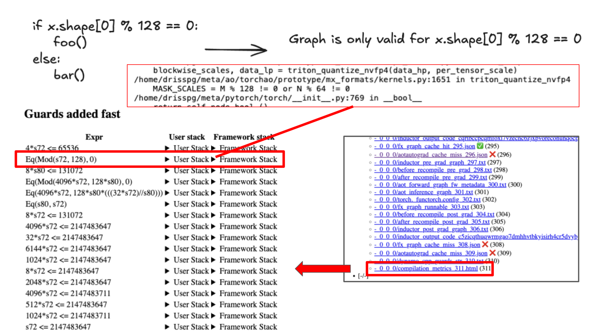

# How to debug the vLLM-torch.compile integration

TL;DR:

- use tlparse to acquire torch.compile logs. Include these logs in bug reports and/or support asks.
- The vLLM-torch.compile integration is multiple pieces. vLLM exposes flags to turn off each piece:

| Online Flag | Offline Flag   |      Result |
|----------|----------|-------------|
| --enforce-eager | enforce_eager=True |  Turn off torch.compile and CUDAGraphs |
| -O.mode=0 | mode=CompilationMode.NONE |  Turn off torch.compile only |
| -O.cudagraph_mode=NONE | compilation_config=CompilationConfig(cudagraph_mode=CUDAGraphMode.NONE) |  Turn off CUDAGraphs only |
| -O.backend=eager | compilation_config=CompilationConfig(backend='eager') |  Turn off TorchInductor |

## vLLM-torch.compile overview

To improve performance, vLLM leverages torch.compile and CUDAGraphs to speed things up.
torch.compile generates optimized kernels for PyTorch code while CUDAGraphs eliminates overhead.
Most notably, vLLM-compile is NOT torch.compile, it is a custom compiler built using internal PyTorch Compile APIs.



- Given a model, we do a full graph capture via TorchDynamo that is dynamic on the batch size (number of tokens)
- vLLM then optionally splits and/or specializes this graph and then uses TorchInductor to compile each graph into a compiled artifact.
This step may use vLLM custom Inductor passes to further optimize the graph.
- The compiled artifact is saved to vLLM's compile cache so that it can be loaded in the future.
- vLLM applies CUDAGraphs to reduce CPU overheads.

Things can go wrong in each of the four steps. When something does go wrong, please try to isolate the subsystem
that went wrong -- this will allow you to turn off the minimal number of things to keep reliability
goals while minimizing impact to performance and also helps us (vLLM) when you open a bug report.

For more details on the design, please see the following resources:

- [Introduction to vLLM-torch.compile blogpost](https://blog.vllm.ai/2025/08/20/torch-compile.html)
- [vLLM-torch.compile integration design](https://docs.vllm.ai/en/latest/design/torch_compile.html)
- [vLLM Office Hours #26](https://www.youtube.com/live/xLyxc7hxCJc?si=Xulo9pe53C6ywf0V&t=561)
- [Talk at PyTorch Conference 2025](https://youtu.be/1wV1ESbGrVQ?si=s1GqymUfwiwOrDTg&t=725)

## Use tlparse

Use [tlparse](https://github.com/meta-pytorch/tlparse) to acquire torch.compile logs. These logs show all stages of the compilation process,
including the fused kernels that torch.compile produces.
If you can, we recommend sending these or pieces of these along with any bug reports --
they are very helpful.

Install tlparse:

```sh
pip install tlparse
```

Usage (offline inference)

```sh
TORCH_TRACE=~/trace_dir python my_script.py
tlparse ~/trace_dir/<the_first_log_file>
```

Usage (serving)

```sh
TORCH_TRACE=~/trace_dir vllm serve
# ctrl-c out of the server
tlparse ~/trace_dir/<the_first_log_file>
```

The `tlparse` command outputs some HTML files (perhaps into e.g. `./tl_out/index.html`).
Open it to see the logs. It'll look something like the following:



## Turn off vLLM-torch.compile integration

Pass `--enforce-eager` to turn off the vLLM-torch.compile integration and run entirely
in eager mode. This includes turning off CUDAGraphs.

```sh
# Online
vllm serve --enforce-eager
```

```py
# Offline
LLM(model, enforce_eager=True)
```

To turn off just torch.compile, pass `mode = NONE` to the compilation config.
(`-O` is short for `--compilation_config`):

```sh
# Online
vllm serve -O.mode=0
```

```py
# Offline
from vllm.config.compilation import CompilationConfig, CompilationMode
LLM(model, compilation_config=CompilationConfig(mode=CompilationMode.NONE))
```

To turn off just CUDAGraphs, pass `cudagraph_mode = NONE`:

```sh
# Online
vllm serve -O.cudagraph_mode=NONE
```

```py
# Offline
from vllm.config.compilation import CompilationConfig, CUDAGraphMode
LLM(model, compilation_config=CompilationConfig(cudagraph_mode=CUDAGraphMode.NONE))
```

## Debugging TorchDynamo

vLLM requires model code be capturable into a full graph via TorchDynamo (torch.compile's frontend).
TorchDynamo does not support all of Python. It will error (in fullgraph mode) if it cannot support
a feature (this is sometimes known as a graph break).

If you encounter a graph break, please [open an issue to pytorch/pytorch](https://github.com/pytorch/pytorch) so the PyTorch devs can prioritize.
Then, try your best to rewrite the code to avoid the graph break.
For more information, see this [Dynamo guide](https://docs.pytorch.org/docs/stable/compile/programming_model.dynamo_core_concepts.html).

## Debugging Dynamic Shape full graph capture

vLLM requires that the model's forward pass be capturable into a full graph that is dynamic
on the batch size (i.e. the number of tokens). It (by default) compiles this one graph into
one artifact and uses this artifact for all batch sizes.

If your code cannot be captured with Dynamic Shapes, you may see silent incorrectness,
loud errors, or CUDA illegal memory accesses. For example, the following is not
capturable into a single graph:

```py
if data.size[0] % 128 == 0:
    foo(...)
else:
    bar(...)
```

This problem is easy to diagnose. Use tlparse and click on `compilation_metrics`:
it will tell you symbolic constraints on the batch size. If there is any constraint
that restricts the batch sizes, then we've got a problem.



To avoid this, please either:

1. avoid branching on the number of tokens
2. wrap the branching logic into a custom operator. TorchDynamo does not
trace into custom operators.

## Debugging TorchInductor

TorchInductor takes a captured graph and then compiles it down to some Python code
that may call 1+ triton kernels. On rare (but unfortunate) occasions, it may
produce an incorrect triton kernel. This may manifest as silent incorrectness,
CUDA illegal memory accesses, or loud errors.

To debug if TorchInductor is at fault, you can disable it by passing `backend='eager'`
to the compilation config:

```sh
# online
vllm serve -O.backend=eager
```

```py
# offline
LLM(compilation_config=CompilationConfig(backend='eager'))
```

If Inductor is at fault, [file a bug to PyTorch](https://github.com/pytorch/pytorch).
If you're feeling adventurous, you can debug the triton kernels in the Inductor output code
(that you can locate via using tlparse).


You can also use `TORCH_LOGS=output_code <command>` to print the Inductor output code.

### Editable TorchInductor code

You can edit the TorchInductor code that gets run by setting `VLLM_COMPILE_CACHE_SAVE_FORMAT=unpacked`
or passing `-O.compile_cache_save_format=unpacked`. The default is `binary`, which means it is not editable.

This is a useful technique: you can put breakpoints (e.g. `torch.distributed.breakpoint()`)
and print statements in the output code.

## Debugging vLLM-compile cache

vLLM built its own cache for torch.compile artifacts. The idea is that the artifacts
can be compiled once and then reused after they have been compiled. This
is a layer on top of [torch.compile's compiler cache](https://docs.pytorch.org/tutorials/recipes/torch_compile_caching_tutorial.html).

While torch.compile's compiler cache is rock-stable, vLLM's compiler cache is unfortunately
not always correct. You can disable it via setting `VLLM_DISABLE_COMPILE_CACHE=1`.

You can also manually remove this cache.

- Remove vLLM's compile cache with `rm -rf ~/.cache/vllm` (look at logs to see if the location changed)
- Remove torch.compile's built-in caches with `rm -rf /tmp/torchinductor_$(whoami)`

vLLM's cache is a mapping from cache key to a compiled artifact. vLLM computes
the cache key via combining multiple factors (e.g. config flags and model name).
If vLLM's compile cache is wrong, this usually means that a factor is missing.
Please see [this example](https://github.com/vllm-project/vllm/blob/18b39828d90413d05d770dfd2e2f48304f4ca0eb/vllm/config/model.py#L310)
of how vLLM computes part of the cache key.

## Debugging CUDAGraphs

CUDAGraphs is a feature that allows one to:

- Capture a callable that launches 1+ CUDA kernels into a CUDAGraph
- Replay the CUDAGraph

The captured CUDAGraph contains all of the memory used during the capture process.
The replay of the CUDAGraph reads and writes to exactly the same regions of memory.

This leads to some restrictions:

1. In order to use CUDAGraphs on new data, you'll need to copy the data into a buffer
that the CUDAGraph is reading from
2. CUDAGraphs only capture CUDA kernels, they don't capture work done on CPU.

vLLM uses the raw CUDAGraphs API, which is unsafe when used incorrectly.

To turn off just CUDAGraphs, pass `cudagraph_mode = NONE`:

```sh
# Online
vllm serve -O.cudagraph_mode=NONE
```

```py
# Offline
from vllm.config.compilation import CompilationConfig, CUDAGraphMode
LLM(model, compilation_config=CompilationConfig(cudagraph_mode=CUDAGraphMode.NONE))
```
