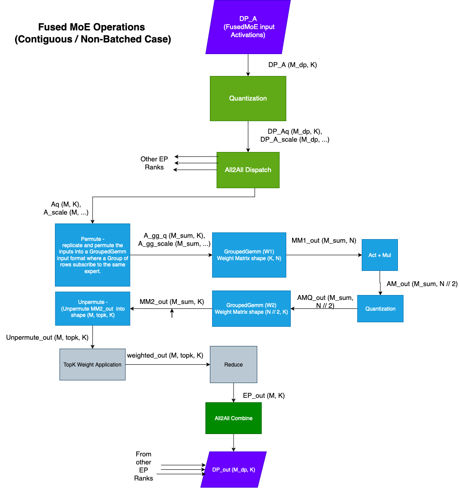
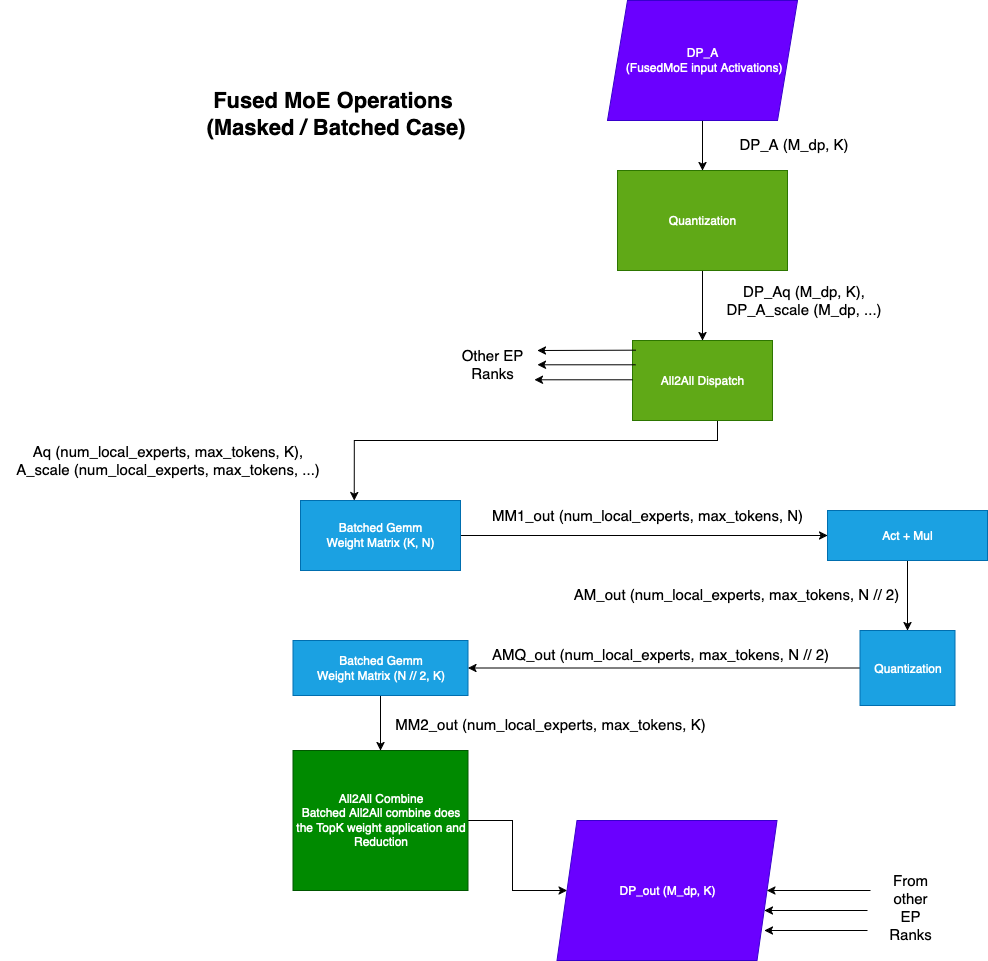
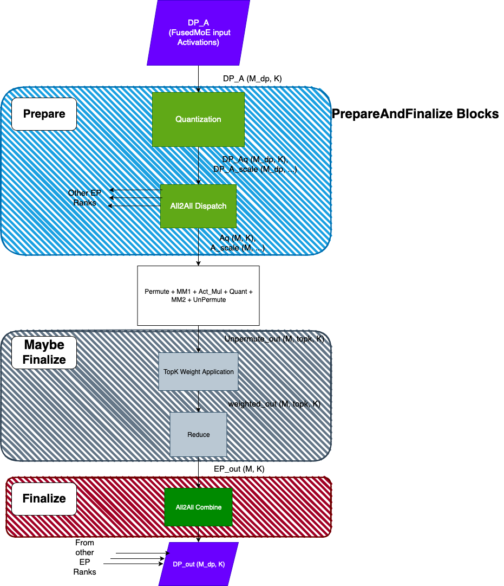
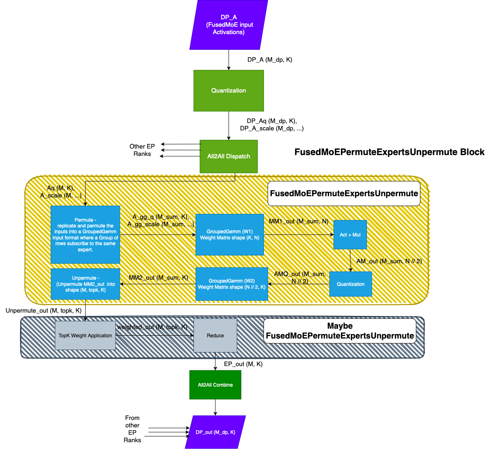

# Fused MoE Modular Kernel

## Introduction

The MoE kernel framework is implemented in [`modular_kernel.py`](../../vllm/model_executor/layers/fused_moe/modular_kernel.py). The top-level class is `FusedMoEKernel`, which wraps either a `FusedMoEKernelModularImpl` (for modular kernels) or a `FusedMoEKernelMonolithicImpl` (for monolithic kernels that handle routing internally).

Based on the format of the input activations, fused MoE implementations are broadly classified into 2 types.

* Contiguous / Standard / Non-Batched, and
* Batched

!!! note
    The terms Contiguous, Standard, and Non-Batched are used interchangeably throughout the document.

The input activation format completely depends on the All2All Dispatch being used.

* In the Contiguous variant, the All2All Dispatch returns the activations as a contiguous tensor of shape (M, K) along with TopK Ids and TopK weights of shape (M, num_topk). Look at `DeepEPHTPrepareAndFinalize` for an example.
* In the Batched variant, the All2All Dispatch returns the activations as a tensor of shape (num_experts, max_tokens, K). Here, the activations/tokens that subscribe to the same expert are batched together. Note that not all entries of the tensor are valid. The activations tensor is typically accompanied by an `expert_num_tokens` tensor of size `num_experts`, where `expert_num_tokens[i]` indicates the number of valid tokens that subscribe to the ith expert. Look at `DeepEPLLPrepareAndFinalize` for an example.

The fused MoE operation is generally made of multiple operations, in both the Contiguous and Batched variants, as described in the diagrams below





!!! note
    The main difference, in terms of operations, between the Batched and Non-Batched cases is the Permute / Unpermute operations. All other operations remain.

## Motivation

As can be seen from the diagrams, there are a lot of operations and there can be a variety of implementations for each operation. The set of ways the operations can be put together to make a valid fused MoE implementation quickly becomes intractable. The Modular Kernel framework addresses this issue,  by grouping the operations into logical components. This broad categorization makes the combinations manageable and prevents code-duplication. This also decouples the All2All Dispatch & Combine implementations from the fused MoE implementations and allows for their independent development and testing. Furthermore, the Modular Kernel framework introduces Abstract classes for the different components thus providing a well-defined skeleton for future implementations.

The rest of the document will focus on the Contiguous / Non-Batched case. Extrapolating to the Batched case should be straight-forward.

## Class Hierarchy

The kernel framework uses two parallel hierarchies — one for prepare/finalize (dispatch/combine) and one for experts (the actual computation):

```text
FusedMoEPrepareAndFinalize (ABC)
  ├── FusedMoEPrepareAndFinalizeModular  (topk_ids/weights interface)
  └── FusedMoEPrepareAndFinalizeMonolithic  (router_logits interface)

FusedMoEExperts (ABC)
  ├── FusedMoEExpertsModular  (receives pre-routed tokens)
  └── FusedMoEExpertsMonolithic  (handles routing internally)

FusedMoEKernel  (top-level wrapper)
  └── impl: FusedMoEKernelModularImpl | FusedMoEKernelMonolithicImpl
```

`FusedMoEExperts` is the common base for both modular and monolithic experts. It provides the oracle/support-checking system via `is_supported_config()` — a static method that checks quantization type, activation format, platform capabilities, and other constraints to determine whether a particular experts class can handle a given deployment configuration.

## ModularKernel Components

`FusedMoEKernelModularImpl` splits the fused MoE operation into 3 parts:

1. TopKWeightAndReduce
2. FusedMoEPrepareAndFinalizeModular
3. FusedMoEExpertsModular

### TopKWeightAndReduce

The TopK Weight Application and Reduction components happen right after the Unpermute operation and before the All2All Combine. Note that the `FusedMoEExpertsModular` is responsible for the Unpermute and `FusedMoEPrepareAndFinalizeModular` is responsible for the All2All Combine. There is value in doing the TopK Weight Application and Reduction in the `FusedMoEExpertsModular`. But some implementations choose to do it `FusedMoEPrepareAndFinalizeModular`. In order to enable this flexibility, we have a TopKWeightAndReduce abstract class.

Please find the implementations of TopKWeightAndReduce [here](../../vllm/model_executor/layers/fused_moe/topk_weight_and_reduce.py).

`FusedMoEPrepareAndFinalizeModular::finalize()` method accepts a `TopKWeightAndReduce` argument that is invoked inside the method.
The `FusedMoEKernelModularImpl` acts as a bridge between the `FusedMoEExpertsModular` and `FusedMoEPrepareAndFinalize` implementations to determine where the TopK Weight Application and Reduction happens.

* `FusedMoEExpertsModular::finalize_weight_and_reduce_impl` method returns `TopKWeightAndReduceNoOP` if the `FusedMoEExpertsModular` implementation does the weight application and reduction itself.
* `FusedMoEExpertsModular::finalize_weight_and_reduce_impl` method returns `TopKWeightAndReduceContiguous` / `TopKWeightAndReduceNaiveBatched` / `TopKWeightAndReduceDelegate` if the `FusedMoEExpertsModular` implementation needs the `FusedMoEPrepareAndFinalizeModular::finalize()` to do the weight application and reduction.

### FusedMoEPrepareAndFinalizeModular

The `FusedMoEPrepareAndFinalizeModular` abstract class (inheriting from `FusedMoEPrepareAndFinalize`) exposes `prepare`, `prepare_async`, `finalize`, and `finalize_async` functions.
The `prepare` function is responsible for input activation Quantization and All2All Dispatch. If `supports_async()` returns True, the class also implements `prepare_async` and `finalize_async`. `prepare_async` is like `prepare` except it does not wait to receive results from other workers — instead it returns a "receiver" callback that must be invoked to wait for the final results. This can be used to interleave work with the initial all-to-all communication, e.g. overlapping shared experts with fused experts via DBO (Dual Batch Overlap). `finalize_async` similarly allows overlapping the combine step with shared expert computation. The `finalize` function is responsible for invoking the All2All Combine. Additionally the `finalize` function may or may not do the TopK weight application and reduction (Please refer to the TopKWeightAndReduce section).



### FusedMoEExpertsModular

The `FusedMoEExpertsModular` class is where the crux of the MoE operations happen. The `FusedMoEExpertsModular` abstract class exposes a few important functions,

* apply()
* workspace_shapes()
* workspace_dtype()
* finalize_weight_and_reduce_impl()

#### apply()

The `apply` method is where the implementations perform

* Permute
* Matmul with weight W1
* Act + Mul
* Quantization
* Matmul with weight W2
* Unpermute
* Maybe TopK Weight Application + Reduction

#### workspace_shapes()

The core fused MoE implementation performs a series of operations. It would be inefficient to create output memory for each of these operations separately. To that effect, implementations are required to declare 2 workspace shapes and the fused MoE output shape as outputs of the `workspace_shapes()` method, and the workspace dtype via the separate `workspace_dtype()` method. This information is used to allocate the workspace tensors and the output tensor in `FusedMoEKernelModularImpl` and passed on to the `FusedMoEExpertsModular::apply()` method. The workspaces could then be used as intermediate buffers in the fused MoE implementation.

#### finalize_weight_and_reduce_impl()

It is sometimes efficient to perform TopK weight application and Reduction inside the `FusedMoEExpertsModular::apply()`. Find an example [here](https://github.com/vllm-project/vllm/pull/20228). We have a `TopKWeightAndReduce` abstract class to facilitate such implementations. Please refer to the TopKWeightAndReduce section.
`FusedMoEExpertsModular::finalize_weight_and_reduce_impl()` returns the `TopKWeightAndReduce` object that the implementation wants the `FusedMoEPrepareAndFinalizeModular::finalize()` to use.



### FusedMoEKernel

`FusedMoEKernel` is the top-level wrapper that composes a `FusedMoEPrepareAndFinalize` and a `FusedMoEExperts`. Based on whether both components are modular or monolithic, it creates either a `FusedMoEKernelModularImpl` or `FusedMoEKernelMonolithicImpl`.

`FusedMoEKernelModularImpl` pseudocode/sketch:

```py
class FusedMoEKernel:
    def __init__(self,
                 prepare_finalize: FusedMoEPrepareAndFinalize,
                 fused_experts: FusedMoEExperts):
        # Creates FusedMoEKernelModularImpl or FusedMoEKernelMonolithicImpl
        # based on the types of prepare_finalize and fused_experts.
        if modular:
            self.impl = FusedMoEKernelModularImpl(prepare_finalize, fused_experts)
        else:
            self.impl = FusedMoEKernelMonolithicImpl(prepare_finalize, fused_experts)

class FusedMoEKernelModularImpl:
    def __init__(self,
                 prepare_finalize: FusedMoEPrepareAndFinalizeModular,
                 fused_experts: FusedMoEExpertsModular):

        self.prepare_finalize = prepare_finalize
        self.fused_experts = fused_experts

    def apply(self, hidden_states, w1, w2, topk_weights, topk_ids, ...):

        Aq, A_scale, _, _, _ = self.prepare_finalize.prepare(hidden_states, ...)

        workspace13_shape, workspace2_shape, output_shape = \
            self.fused_experts.workspace_shapes(...)

        # allocate workspaces
        workspace_dtype = self.fused_experts.workspace_dtype(...)
        workspace_13 = torch.empty(workspace13_shape, dtype=workspace_dtype, ...)
        workspace_2 = torch.empty(workspace2_shape, dtype=workspace_dtype, ...)

        # execute fused_experts
        fe_out = self.fused_experts.apply(Aq, A_scale, workspace13, workspace2, ...)

        # war_impl is TopKWeightAndReduceNoOP if the fused_experts implementation
        # performs the TopK Weight Application and Reduction itself.
        war_impl = self.fused_experts.finalize_weight_and_reduce_impl()

        output = self.prepare_finalize.finalize(fe_out, war_impl, ...)

        return output
```

## How-To

### How To Add a FusedMoEPrepareAndFinalizeModular Type

Typically a FusedMoEPrepareAndFinalizeModular type is backed by an All2All Dispatch & Combine implementation / kernel. For example,

* DeepEPHTPrepareAndFinalize type is backed by DeepEP High-Throughput All2All kernels, and
* DeepEPLLPrepareAndFinalize type is backed by DeepEP Low-Latency All2All kernels.

#### Step 1: Add an All2All manager

The purpose of the All2All Manager is to set up the All2All kernel implementations. The `FusedMoEPrepareAndFinalizeModular` implementations typically fetch a kernel-implementation "handle" from the All2All Manager to invoke the Dispatch and Combine functions. Please look at the All2All Manager implementations [here](../../vllm/distributed/device_communicators/all2all.py).

#### Step 2: Add a FusedMoEPrepareAndFinalizeModular Type

This section describes the significance of the various functions exposed by the `FusedMoEPrepareAndFinalizeModular` abstract class.

`FusedMoEPrepareAndFinalizeModular::prepare()`: The prepare method implements the Quantization and All2All Dispatch. Typically the Dispatch function from the relevant All2All Manager is invoked.

`FusedMoEPrepareAndFinalize::supports_async()`: Indicates whether or not this subclass implements `prepare_async` and `finalize_async`. Defaults to False.

`FusedMoEPrepareAndFinalizeModular::prepare_async()`: The prepare_async method implements the Quantization and All2All Dispatch. It does not wait for the result of the dispatch operation but instead returns a thunk that can be invoked to wait for the final results. Typically the Dispatch function from the relevant All2All Manager is invoked.

`FusedMoEPrepareAndFinalizeModular::finalize_async()`: Like `finalize` but allows overlapping the combine step with other work (e.g. shared expert computation).

`FusedMoEPrepareAndFinalizeModular::finalize()`: Maybe perform TopK Weight Application and Reduction and All2All Combine. Typically the Combine function from the relevant All2AllManager is invoked.

`FusedMoEPrepareAndFinalizeModular::activation_format()`: Return `FusedMoEActivationFormat.BatchedExperts` if the output of the prepare method (i.e. the All2All dispatch) is Batched. Return `FusedMoEActivationFormat.Standard` otherwise.

`FusedMoEPrepareAndFinalizeModular::topk_indices_dtype()`: Data type of the TopK ids. Some All2All kernels have strict requirements pertaining to the data type of the TopK ids. This requirement is passed on to the `FusedMoe::select_experts` function so it could be respected. If there are no strict requirements return None.

`FusedMoEPrepareAndFinalizeModular::max_num_tokens_per_rank()`: This is the maximum number of tokens that would be submitted to the All2All Dispatch at once.

`FusedMoEPrepareAndFinalizeModular::num_dispatchers()`: Total number of dispatching units. This value determines the size of the Dispatch output. The Dispatch output is of shape (num_local_experts, max_num_tokens, K). Here max_num_tokens = num_dispatchers() * max_num_tokens_per_rank().

We suggest picking an already existing `FusedMoEPrepareAndFinalizeModular` implementation that matches your All2All implementation closely and using it as a reference.

### How To Add a FusedMoEExpertsModular Type

FusedMoEExpertsModular performs the core of the fused MoE operations. The various functions exposed by the abstract class and their significance is as follows,

`FusedMoEExperts::activation_format()`: A static method returning the activation format (Standard or BatchedExperts) for the `apply` method.

`FusedMoEExperts::is_supported_config()`: A static method used by the oracle system to determine whether a particular experts class can handle a given deployment configuration. Checks quantization type, activation format, platform capabilities, and other constraints.

`FusedMoEExpertsModular::workspace_shapes()` /
`FusedMoEExpertsModular::finalize_weight_and_reduce_impl` /
`FusedMoEExpertsModular::apply`: Refer to `FusedMoEExpertsModular` section above.

### FusedMoEKernel Initialization — The Oracle System

Kernel selection has been refactored into an **oracle** system under [`fused_moe/oracle/`](../../vllm/model_executor/layers/fused_moe/oracle/). Each quantization type has its own oracle module (e.g., `fp8.py`, `nvfp4.py`, `unquantized.py`, `int8.py`, `mxfp4.py`, `mxfp8.py`, `int_wna16.py`, `w4a8.py`, `w4a8_int8.py`).

All oracles inherit from `MoEKernelOracle` (in `oracle/base.py`), which defines:

* `get_priority_backends(moe_config)` — returns platform-appropriate backends in priority order
* `backend_to_kernel_cls(backend)` — maps a backend enum to its concrete `FusedMoEExperts` subclasses
* `select_backend(moe_config, ...)` — selects the best backend for a given configuration
* `make_kernel(moe_config, ...)` — constructs the `FusedMoEKernel` object

Each `FusedMoEExperts` subclass declares its capabilities via the static `is_supported_config()` method. The oracle iterates through backends in priority order, finds a compatible experts class, pairs it with the appropriate `FusedMoEPrepareAndFinalize`, and constructs the `FusedMoEKernel`.

The resulting `FusedMoEKernel` is stored on `FusedMoEMethodBase.moe_kernel`. The `FusedMoEMethodBase.apply()` and `apply_monolithic()` methods delegate to the kernel.

### How To Unit Test

We have `FusedMoEModularKernel` unit tests at [test_modular_kernel_combinations.py](../../tests/kernels/moe/test_modular_kernel_combinations.py).

The unit test iterates through all combinations of `FusedMoEPrepareAndFinalizeModular` and `FusedMoEExpertsModular` types and if they are
compatible, runs some correctness tests.
If you are adding some `FusedMoEPrepareAndFinalizeModular` / `FusedMoEExpertsModular` implementations,

1. Add the implementation type to `MK_ALL_PREPARE_FINALIZE_TYPES` and `MK_FUSED_EXPERT_TYPES` in [mk_objects.py](../../tests/kernels/moe/modular_kernel_tools/mk_objects.py) respectively.
2. Update `Config::is_batched_prepare_finalize()`, `Config::is_batched_fused_experts()`, `Config::is_standard_fused_experts()`,
`Config::is_fe_16bit_supported()`,  `Config::is_fe_fp8_supported()`, `Config::is_fe_block_fp8_supported()`
methods in [/tests/kernels/moe/modular_kernel_tools/common.py](../../tests/kernels/moe/modular_kernel_tools/common.py)

Doing this will add the new implementation to the test suite.

### How To Check `FusedMoEPrepareAndFinalizeModular` & `FusedMoEExpertsModular` Compatibility

The unit test file [test_modular_kernel_combinations.py](../../tests/kernels/moe/test_modular_kernel_combinations.py) can also be executed as a standalone script.
Example: `python3 -m tests.kernels.moe.test_modular_kernel_combinations --pf-type DeepEPLLPrepareAndFinalize --experts-type BatchedTritonExperts`
As a side effect, this script can be used to test `FusedMoEPrepareAndFinalizeModular` & `FusedMoEExpertsModular` compatibility. When invoked
with incompatible types, the script will error.

### How To Profile

Please take a look at [profile_modular_kernel.py](../../tests/kernels/moe/modular_kernel_tools/profile_modular_kernel.py)
The script can be used to generate Torch traces for a single `FusedMoEKernel::apply()` call for any compatible
`FusedMoEPrepareAndFinalizeModular` and `FusedMoEExpertsModular` types.
Example: `python3 -m tests.kernels.moe.modular_kernel_tools.profile_modular_kernel --pf-type DeepEPLLPrepareAndFinalize --experts-type BatchedTritonExperts`

## FusedMoEPrepareAndFinalizeModular Implementations

See [Fused MoE Kernel features](./moe_kernel_features.md#fused-moe-modular-all2all-backends) for a list of all the available modular prepare and finalize subclasses.

## FusedMoEExpertsModular

See [Fused MoE Kernel features](./moe_kernel_features.md#fused-experts-kernels) for a list of all the available modular experts.
