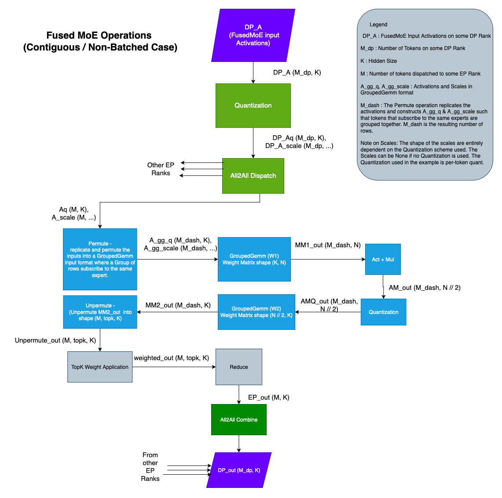
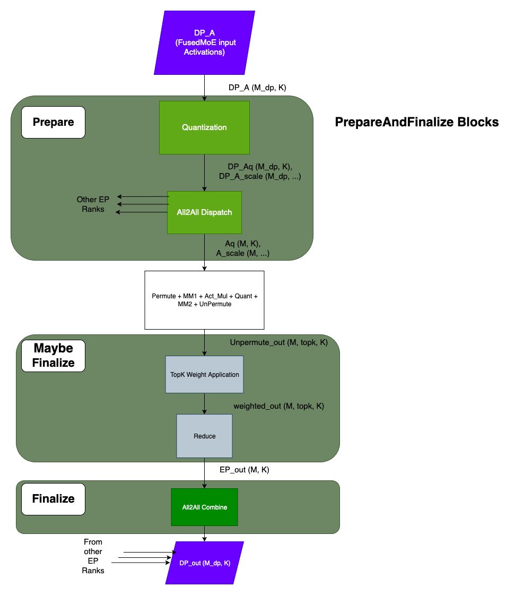

## Introduction
FusedMoEModularKernel is implemented [here](https://github.com/vllm-project/vllm/blob/main/vllm/model_executor/layers/fused_moe/modular_kernel.py)

The FusedMoE operation is generally made of multiple operations as described in the diagrams below




Note that the main difference, in terms of operations, between the Batched and Non-Batched cases is the Permute / Unpermute operations. All other operations remain.

The FusedMoEModularKernel framework groups these operations into logical components so the implementations of the FusedMoE operation is streamlined. The rest of the document focuses on the Contiguous / Non-Batched case. Extrapolating to the Batched case should be straight-forward.

## ModularKernel Components:
FusedMoEModularKernel splits the FusedMoE operation into 3 parts,
1. TopKWeightAndReduce
2. FusedMoEPrepareAndFinalize
3. FusedMoEPermuteExpertsUnpermute

### TopKWeightAndReduce
The TopK Weight Application and Reduction components happen right after the Unpermute operation and before the All2All Combine. Note that the `FusedMoEPermuteExpertsUnpermute` is responsible for the Unpermute and `FusedMoEPrepareAndFinalize` is responsible for the All2All Combine. There is value in doing the TopK Weight Application and Reduction in the `FusedMoEPermuteExpertsUnpermute`. But some implementations choose to do it `FusedMoEPrepareAndFinalize`. In order to enable this flexibility, we have a TopKWeightAndReduce abstract class.
Please find the implementations of TopKWeightAndReduce [here](https://github.com/vllm-project/vllm/blob/main/vllm/model_executor/layers/fused_moe/topk_weight_and_reduce.py).

The `FusedMoEModularKernel` acts as a bridge between the `FusedMoEPermuteExpertsUnpermute` and `FusedMoEPerpareAndFinalize` implementations to determine where the TopK Weight Application and Reduction happens.

`FusedMoEPrepareAndFinalize::finalize()` method accepts a `TopKWeightAndReduce` argument that is invoked inside the method. This is queried from the `FusedMoEPermuteExpertsUnpermute` implementation.

`FusedMoEPermuteExpertsUnpermute` returns `TopKWeightAndReduceNoOp` if the `FusedMoEPermuteExpertsUnpermute` implementation does the weight application and reduction itself.
`FusedMoEPermuteExpertsUnpermute` returns `TopKWeightAndReduceContiguous` / `TopKWeightAndReduceNaiveBatched` / `TopKWeightAndReduceDelegate` if the `FusedMoEPermuteExpertsUnpermute` implementation needs the `FusedMoEPrepareAndFinalize::finalize()` to do the weight application and reduction.

### FusedMoEPrepareAndFinalize
The `FusedMoEPrepareAndFinalize` abstract class exposes `prepare` and `finalize` functions.
The `prepare` function is responsible for input activation Quantization and All2All Dispatch. The `finalize` function is responsible for invoking the All2All Combine. Additionally the finalize function may or may not do the TopK weight application and reduction (Please refer to the TopKWeightAndReduce section)



### FusedMoEPermuteExpertsUnpermute
The `FusedMoEPermuteExpertsUnpermute` class is where most of the operations happen. The `FusedMoEPermuteExpertsUnpermute` abstract class exposes a few important functions,
* apply()
* workspace_shapes()
* finalize_weight_and_reduce_impl()

#### apply()
The `apply` method is where the implementations should perform
    - Premute
    - Matmul with weight W1
    - Act + Mul
    - Quantization
    - Matmul with weight W2
    - Unpermute
    - Maybe TopK Weight Application + Reduction

#### workspace_shapes()
The core FusedMoE implementation performs a series of operations. It would be inefficient to create output memory for each of these operations separately. To that effect, the implementations are required to provide 2 workspace shapes that could be used as intermediate buffers between operations. The `workspace_shapes()` function declares these workspace shapes that are allocated in `FusedMoEModularKernel::forward()` and passed to the `FusedMoEPermuteExpertsUnpermute::apply()` function.

#### finalize_weight_and_reduce_impl()
It is sometimes efficient to perform TopK weight application and Reduction inside the `FusedMoEPermuteExpertsUnpermute::apply()`. An example is [here](https://github.com/vllm-project/vllm/pull/20228). We have a `TopKWeightAndReduce` abstract class to facilitate such implementations. Please refer to the TopKWeightAndReduce section.
`FusedMoEPermuteExpertsUnpermute::finalize_weight_and_reduce_impl()` returns the `TopKWeightAndReduce` object that the implementation wants the `FusedMoEPrepareAndFinalize::finalize()` to use.


### FusedMoEModularKernel
`FusedMoEModularKernel` is composed of the `FusedMoEPrepareAndFinalize` and `FusedMoEPermuteExpertsUnpermute` objects.
`FusedMoEModularKernel` pseudocode/sketch,

```
FusedMoEModularKernel::__init__(self,
            prepare_finalize: FusedMoEPrepareAndFinalize,
            fused_experts: FusedMoEPermuteExpertsUnpermute):
    self.prepare_finalize = prepare_finalize
    self.fused_experts = fused_experts

FusedMoEModularKernel::forward(self, DP_A):
    Aq, A_scale, _, _, _ = self.prepare_finalize.prepare(DP_A, ...)
    workspace13_shape, workspace2_shape, _, _ = self.fused_experts.workspace_shapes(...)

    # allocate workspaces
    workspace_13 = torch.empty(workspace13_shape, ...)
    workspace_2 = torch.empty(workspace2_shape, ...)

    # execute fused_experts
    fe_out = self.fused_experts.apply(Aq, A_scale, workspace13, workspace2, ...)

    # war_impl is an object of type TopKWeightAndReduceNoOp if the fused_experts implementations performs the TopK Weight Application and Reduction.
    war_impl = self.fused_experts.finalize_weight_and_reduce_impl()
    output = self.prepare_finalize.finalize(fe_out, war_impl,...)
                            
    return output
```

## How-To

### How To Add a FusedMoEPrepareAndFinalize Type
Typically a FusedMoEPrepareAndFinalize type is backed by an All2All Dispatch & Combine implementations / kernels. For example,
* PplxPrepareAndFinalize type is backed by Pplx All2All kernels,
* DeepEPHTPrepareAndFinalize type is backed by DeepEP High-Throughtput All2All kernels, and
* DeepEPLLPrepareAndFinalize type is backed by DeepEP Low-Latency All2All kernels.

#### Step 1: Add an All2All manager
    The purpose of the All2All Manager is to setup the All2All kernel implementations. The `FusedMoEPrepareAndFinalize` implementations
    typically fetch a kernel-implementation "handle" from the All2All Manager to invoke the Dispatch and Combine functions.
    Please look at the All2All Manager implementations [here](https://github.com/vllm-project/vllm/blob/main/vllm/distributed/device_communicators/all2all.py). 

#### Step 2: Add a FusedMoEPrepareAndFinalize Type

    `FusedMoEPrepareAndFinalize::prepare()` :
        The prepare method implements the Quantization and All2All Dispatch. Typically the Dispatch function from the relevant All2All Manager is invoked.
 
    `FusedMoEPrepareAndFinalize::finalize()` :
        Maybe perform TopK Weight Application and Reduction and All2All Combine. Typically the Combine function from the relevant All2AllManager is invoked.

    `FusedMoEPrepareAndFinalize::activation_format()` : 
        Return `FusedMoEActivationFormat.BatchedExperts` if the output of the prepare method (i.e. the All2All dispatch) is Batched. Return `FusedMoEActivationFormat.Standard` otherwise.

    `FusedMoEPrepareAndFinalize::topk_indices_dtype()` :
        Data type of the TopK ids. Some All2All kernels have strict requirements pertaining to the data type of the TopK ids.
        This requirement is passed on to the `FusedMoe::select_experts` function so it could be respected. If there are
        no strict requirements return None.

    `FusedMoEPrepareAndFinalize::max_num_tokens_per_rank()` : 
        This is the maximum number of tokens that would be submitted to the All2All Dispatch at once.

    `FusedMoEPrepareAndFinalize::num_dispatchers()`:
        Total number of dispatching units. This value determines size of the Dispatch output. The Dispatch output is
        of shape (num_local_experts, max_num_tokens, K). Here max_num_tokens = num_dispatchers() * max_num_tokens_per_rank().

    We suggest picking an already existing `FusedMoEPrepareAndFinalize` implementation that matches your All2All
    implementation closely and using it as a base reference. 

### How To Add a FusedMoEPermuteExpertsUnpermute Type
    FusedMoEPermuteExpertsUnpermute performs the core of the FusedMoE operations. The various functions exposed by the
    abstract class are as follows, 

    `FusedMoEPermuteExpertsUnpermute::activation_formats()`: Return the supported Input and Output activation formats.

    `FusedMoEPermuteExpertsUnpermute::supports_chunking()`: Return True if the implementation supports chunking. Typically
        implementations that input `FusedMoEActivationFormat.Standard` support chunking and `FusedMoEActivationFormat.Batched` do not.

    `FusedMoEPermuteExpertsUnpermute::supports_expert_map()` : Return True if the implementation supports expert map. 

    `FusedMoEPermuteExpertsUnpermute::workspace_shapes()` /
    `FusedMoEPermuteExpertsUnpermute::finalize_weight_and_reduce_impl` /
    `FusedMoEPermuteExpertsUnpermute::apply` : Refer to `FusedMoEPermuteExpertsUnpermute` section above.

### FusedMoEModularKernel Initialization
During Engine startup,
* The `FusedMoEPrepareAndFinalize` object is created in [vllm/model_executor/layers/fused_moe/layer.py](https://github.com/vllm-project/vllm/blob/5ac3168ee342f4cae17b0b67375e647bd5dd9151/vllm/model_executor/layers/fused_moe/layer.py#L190)
* The `FusedMoEPermuteExpertsUnpermute` object is created in `FusedMoEMethodBase::select_gemm_impl`
The two objects are put together to form a FusedMoEModularKernel object [here](https://github.com/vllm-project/vllm/blob/5ac3168ee342f4cae17b0b67375e647bd5dd9151/vllm/model_executor/layers/fused_moe/layer.py#L198)

### How To Unit Test
We are have FusedMoEModularKernel unit tests [test_modular_kernel_combinations.py](https://github.com/vllm-project/vllm/blob/5ac3168ee342f4cae17b0b67375e647bd5dd9151/tests/kernels/moe/test_modular_kernel_combinations.py)
The unit test iterates through all combinations of `FusedMoEPrepareAndFinalize` and `FusedMoEPremuteExpertsUnpermute` types and if they are
compatible, runs some correctness tests.
If you are adding some `FusedMoEPrepareAndFinalize` / `FusedMoEPermuteExpertsUnpermute` implementations,
1. please add the implementations to `MK_ALL_PREPARE_FINALIZE_TYPES` and `MK_FUSED_EXPERT_TYPES` respectively.
2. Update `Config::is_batched_prepare_finalize()`, `Config::is_batched_fused_experts()`, `Config::is_standard_fused_experts()`,
`Config::is_fe_16bit_supported()`,  `Config::is_fe_fp8_supported()`, `Config::is_fe_block_fp8_supported()`,
`Config::is_fe_supports_chunking()` methods in [/tests/kernels/moe/modular_kernel_tools/common.py](https://github.com/vllm-project/vllm/blob/main/tests/kernels/moe/modular_kernel_tools/common.py)

Doing this will add the new implementation to the test suite.

### How To Check `FusedMoEPrepareAndFinalize` & `FusedMoEPermuteExpertsUnpermute` Compatibility
The unit test file [test_modular_kernel_combinations.py](https://github.com/vllm-project/vllm/blob/5ac3168ee342f4cae17b0b67375e647bd5dd9151/tests/kernels/moe/test_modular_kernel_combinations.py) can also be executed as a standalone script.
Example: `python3 -m tests.kernels.moe.test_modular_kernel_combinations --pf-type PplxPrepareAndFinalize --experts-type BatchedTritonExperts`
As a side-effect, this script can be used to test `FusedMoEPrepareAndFinalize` & `FusedMoEPermuteExpertsUnpermute` compatibility. When invoked
with incompatible types, the script will error.

### How To Profile
Please take a look at [profile_modular_kernel.py](https://github.com/vllm-project/vllm/blob/main/tests/kernels/moe/modular_kernel_tools/profile_modular_kernel.py)
The script can be used to generate Torch traces for a single `FusedMoEModularKernel::forward()` call for any compatible
`FusedMoEPrepareAndFinalize` and `FusedMoEPermuteExpertsUnpermute` types.
Example: `python3 -m tests.kernels.moe.modular_kernel_tools.profile_modular_kernel --pf-type PplxPrepareAndFinalize --experts-type BatchedTritonExperts`

## FusedMoEPrepareAndFinalize Implementations
The following table lists the `FusedMoEPrepareAndFinalize` implementations at the time of writing,

| Implementation | Type | Comments |
| :--- | :--- | :--- |
| DeepEPHTPrepareAndFinalize | Contiguous / Non-Batched | Uses the DeepEP High-Throughput all2all kernels. |
| DeepEPLLPrepareAndFinalize | Batched | Uses the DeepEP Low-Latency all2all kernels. |
| PplxPrepareAndFinalize | Batched | Uses the Perplexity all2all kernels. |
| FlashInferCutlassMoEPrepareAndFinalize | Contiguous | |
| MoEPrepareAndFinalizeNoEP | Contiguous | This implementation is used when there is no EP. i.e. no all2all kernels are invoked. |
| BatchedPrepareAndFinalize | Batched | A reference prepare/finalize class that reorganizes the tokens into expert batched format, i.e. E x max_num_tokens x K. (Doesn’t use any all2all kernels. This is primarily used in unit testing) |

## FusedMoEPermuteExpertsUnpermute
The following table lists the `FusedMoEPermuteExpertsUnpermute` implementations at the time of writing,

| Implementation | Type | Comment |
| :--- | :--- | :--- |
| BatchedDeepGemmExperts | Batched | Uses the DeepGemm’s Masked Grouped Gemm kernels for the fused_moe operation. |
| BatchedTritonExperts | Batched | Uses a Triton Kernel for the Batched matmuls. |
| BatchedTritonOrDeepGemmExperts | Batched | Chooses either the `BatchedDeepGemmExperts` or `BatchedTritonExperts` based on environment settings. |
| DeepGemmExperts | Contiguous / Non-Batched | Uses DeepGemm’s Grouped Gemm kernels for fused_moe operation. |
| TritonExperts | Contiguous / Non-Batched | Uses a Triton Kernel for fused_moe matmuls. |
| TritonOrDeepGemmExperts | Contiguous / Non-Batched | Chooses either the `DeepGemmExperts` or `TritonExperts` based on fused_moe inputs. |
| CutlassExpertsFP8 | Supports both Batched and Contiguous formats | Uses Cutlass Grouped Gemm implementations for the fp8 matmuls. |
| CutlassExpertsFP4 | Supports both Batched and Contiguous formats | Uses Cutlass Grouped Gemm implementations for the fp4 matmuls. |
| FlashInferExperts | Contiguous | Uses fused_moe operation from FlashInfer |
| NaiveBatchedExperts | Batched | Reference Batched Experts implementation. Primarily used in unit tests. |
