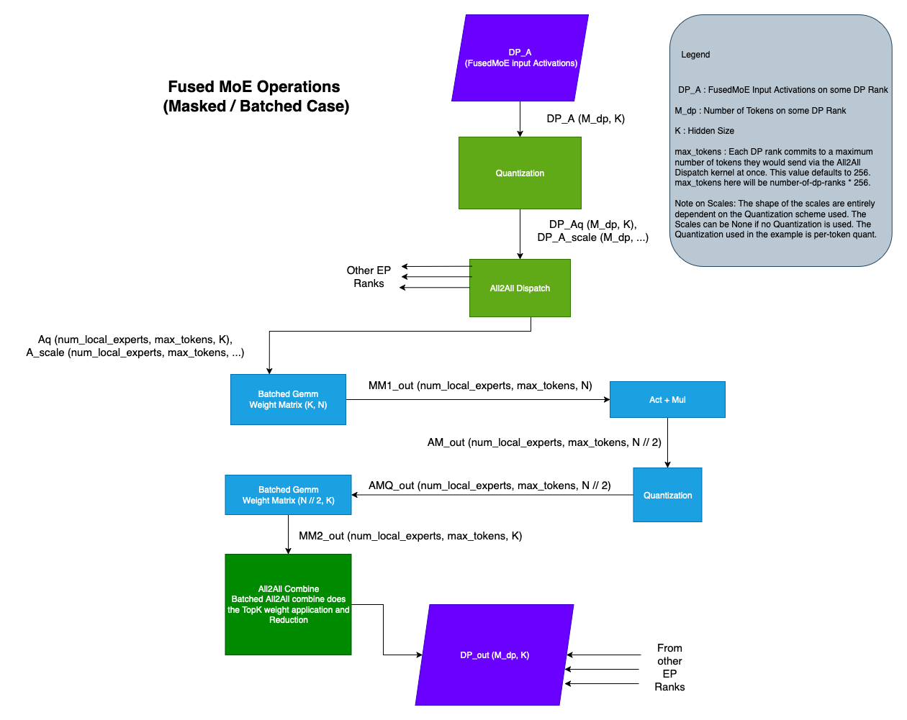
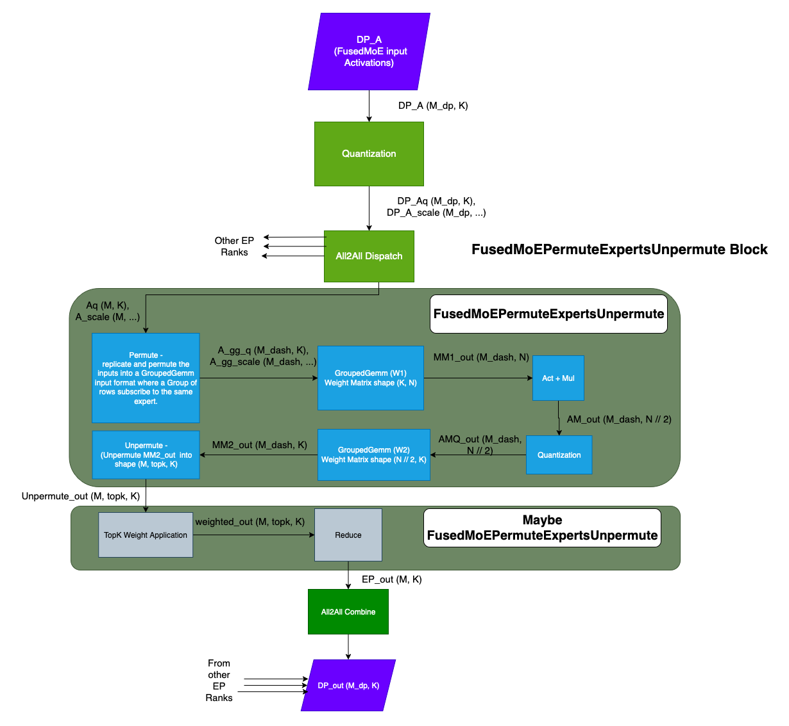

# Fused MoE Modular Kernel

## Introduction

FusedMoEKernelModular is implemented [here](../../vllm/model_executor/layers/fused_moe/modular_kernel.py)

Based on the format of the input activations, FusedMoE implementations are broadly classified into 2 types.

* Contiguous / Standard / Non-Batched, and
* Batched

!!! note
    The terms Contiguous, Standard, and Non-Batched are used interchangeably throughout the document.

The input activation format completely depends on the All2All Dispatch being used.

* In the Contiguous variant, the All2All Dispatch returns the activations as a contiguous tensor of shape (M, K) along with TopK Ids and TopK weights of shape (M, num_topk). Look at `DeepEPHTPrepareAndFinalize` for an example.
* In the Batched variant, the All2All Dispatch returns the activations as a tensor of shape (num_experts, max_tokens, K). Here, the activations/tokens that subscribe to the same expert are batched together. Note that not all entries of the tensor are valid. The activations tensor is typically accompanied by an `expert_num_tokens` tensor of size `num_experts`, where `expert_num_tokens[i]` indicates the number of valid tokens that subscribe to the ith expert. Look at `PplxPrepareAndFinalize` or `DeepEPLLPrepareAndFinalize` for an example.

The FusedMoE operation is generally made of multiple operations, in both the Contiguous and Batched variants, as described in the diagrams below




!!! note
    The main difference, in terms of operations, between the Batched and Non-Batched cases is the Permute / Unpermute operations. All other operations remain.

## Motivation

As can be seen from the diagrams, there are a lot of operations and there can be a variety of implementations for each operation. The set of ways the operations can be put together to make a valid FusedMoE implementation quickly becomes intractable. The Modular Kernel framework addresses this issue,  by grouping the operations into logical components. This broad categorization makes the combinations manageable and prevents code-duplication. This also decouples the All2All Dispatch & Combine implementations from the FusedMoE implementations and allows for their independent development and testing. Furthermore, the Modular Kernel framework introduces Abstract classes for the different components thus providing a well-defined skeleton for future implementations.

The rest of the document will focus on the Contiguous / Non-Batched case. Extrapolating to the Batched case should be straight-forward.

## ModularKernel Components

FusedMoEKernelModular splits the FusedMoE operation into 3 parts,

1. TopKWeightAndReduce
2. FusedMoEPrepareAndFinalizeModular
3. FusedMoEExpertsModular

### TopKWeightAndReduce

The TopK Weight Application and Reduction components happen right after the Unpermute operation and before the All2All Combine. Note that the `FusedMoEExpertsModular` is responsible for the Unpermute and `FusedMoEPrepareAndFinalizeModular` is responsible for the All2All Combine. There is value in doing the TopK Weight Application and Reduction in the `FusedMoEExpertsModular`. But some implementations choose to do it `FusedMoEPrepareAndFinalizeModular`. In order to enable this flexibility, we have a TopKWeightAndReduce abstract class.

Please find the implementations of TopKWeightAndReduce [here](../../vllm/model_executor/layers/fused_moe/topk_weight_and_reduce.py).

`FusedMoEPrepareAndFinalizeModular::finalize()` method accepts a `TopKWeightAndReduce` argument that is invoked inside the method.
The `FusedMoEKernelModular` acts as a bridge between the `FusedMoEExpertsModular` and `FusedMoEPerpareAndFinalize` implementations to determine where the TopK Weight Application and Reduction happens.

* `FusedMoEExpertsModular::finalize_weight_and_reduce_impl` method returns `TopKWeightAndReduceNoOp` if the `FusedMoEExpertsModular` implementation does the weight application and reduction itself.
* `FusedMoEExpertsModular::finalize_weight_and_reduce_impl` method returns `TopKWeightAndReduceContiguous` / `TopKWeightAndReduceNaiveBatched` / `TopKWeightAndReduceDelegate` if the `FusedMoEExpertsModular` implementation needs the `FusedMoEPrepareAndFinalizeModular::finalize()` to do the weight application and reduction.

### FusedMoEPrepareAndFinalizeModular

The `FusedMoEPrepareAndFinalizeModular` abstract class exposes `prepare`, `prepare_no_receive`  and `finalize` functions.
The `prepare` function is responsible for input activation Quantization and All2All Dispatch. If implemented, The `prepare_no_receive` is like `prepare` except it does not wait to receive results from other workers.  Instead it returns a "receiver" callback that must be invoked to wait for the final results of worker. It is not required that this method is supported by all `FusedMoEPrepareAndFinalizeModular` classes, but if it is available, it can be used to interleave work with the initial all to all communication, e.g. interleaving shared experts with fused experts.  The `finalize` function is responsible for invoking the All2All Combine. Additionally the `finalize` function may or may not do the TopK weight application and reduction (Please refer to the TopKWeightAndReduce section)


### FusedMoEExpertsModular

The `FusedMoEExpertsModular` class is where the crux of the MoE operations happen. The `FusedMoEExpertsModular` abstract class exposes a few important functions,

* apply()
* workspace_shapes()
* finalize_weight_and_reduce_impl()

#### apply()

The `apply` method is where the implementations perform

* Permute
* Matmul with weight W1
* Act + Mul
* Quantization
* Matmul with weight W2
* Unpermute
* Maybe TopK Weight Application + Reduction

#### workspace_shapes()

The core FusedMoE implementation performs a series of operations. It would be inefficient to create output memory for each of these operations separately. To that effect, implementations are required to declare 2 workspace shapes, the workspace datatype and the FusedMoE output shape as outputs of the workspace_shapes() method. This information is used to allocate the workspace tensors and the output tensor in `FusedMoEKernelModular::forward()` and passed on to the `FusedMoEExpertsModular::apply()` method. The workspaces could then be used as intermediate buffers in the FusedMoE implementation.

#### finalize_weight_and_reduce_impl()

It is sometimes efficient to perform TopK weight application and Reduction inside the `FusedMoEExpertsModular::apply()`. Find an example [here](https://github.com/vllm-project/vllm/pull/20228). We have a `TopKWeightAndReduce` abstract class to facilitate such implementations. Please refer to the TopKWeightAndReduce section.
`FusedMoEExpertsModular::finalize_weight_and_reduce_impl()` returns the `TopKWeightAndReduce` object that the implementation wants the `FusedMoEPrepareAndFinalizeModular::finalize()` to use.



### FusedMoEKernelModular

`FusedMoEKernelModular` is composed of the `FusedMoEPrepareAndFinalizeModular` and `FusedMoEExpertsModular` objects.
`FusedMoEKernelModular` pseudocode/sketch,

```py
class FusedMoEKernelModular:
    def __init__(self,
                 prepare_finalize: FusedMoEPrepareAndFinalizeModular,
                 fused_experts: FusedMoEExpertsModular):

        self.prepare_finalize = prepare_finalize
        self.fused_experts = fused_experts

    def forward(self, DP_A):

        Aq, A_scale, _, _, _ = self.prepare_finalize.prepare(DP_A, ...)

        workspace13_shape, workspace2_shape, _, _ = self.fused_experts.workspace_shapes(...)

        # allocate workspaces
        workspace_13 = torch.empty(workspace13_shape, ...)
        workspace_2 = torch.empty(workspace2_shape, ...)

        # execute fused_experts
        fe_out = self.fused_experts.apply(Aq, A_scale, workspace13, workspace2, ...)

        # war_impl is an object of type TopKWeightAndReduceNoOp if the fused_experts implementations
        # performs the TopK Weight Application and Reduction.
        war_impl = self.fused_experts.finalize_weight_and_reduce_impl()

        output = self.prepare_finalize.finalize(fe_out, war_impl,...)

        return output
```

## How-To

### How To Add a FusedMoEPrepareAndFinalizeModular Type

Typically a FusedMoEPrepareAndFinalizeModular type is backed by an All2All Dispatch & Combine implementation / kernel. For example,

* PplxPrepareAndFinalize type is backed by Pplx All2All kernels,
* DeepEPHTPrepareAndFinalize type is backed by DeepEP High-Throughput All2All kernels, and
* DeepEPLLPrepareAndFinalize type is backed by DeepEP Low-Latency All2All kernels.

#### Step 1: Add an All2All manager

The purpose of the All2All Manager is to set up the All2All kernel implementations. The `FusedMoEPrepareAndFinalizeModular` implementations typically fetch a kernel-implementation "handle" from the All2All Manager to invoke the Dispatch and Combine functions. Please look at the All2All Manager implementations [here](../../vllm/distributed/device_communicators/all2all.py).

#### Step 2: Add a FusedMoEPrepareAndFinalizeModular Type

This section describes the significance of the various functions exposed by the `FusedMoEPrepareAndFinalizeModular` abstract class.

`FusedMoEPrepareAndFinalizeModular::prepare()`: The prepare method implements the Quantization and All2All Dispatch. Typically the Dispatch function from the relevant All2All Manager is invoked.

`FusedMoEPrepareAndFinalizeModular::has_prepare_no_receive()`: Indicates whether or not this subclass implements `prepare_no_receive`. Defaults to False.

`FusedMoEPrepareAndFinalizeModular::prepare_no_receive()`: The prepare_no_receive method implements the Quantization and All2All Dispatch. It does not wait for the result of the dispatch operation but instead returns a thunk that can be invoked to wait for the final results. Typically the Dispatch function from the relevant All2All Manager is invoked.

`FusedMoEPrepareAndFinalizeModular::finalize()`: Maybe perform TopK Weight Application and Reduction and All2All Combine. Typically the Combine function from the relevant All2AllManager is invoked.

`FusedMoEPrepareAndFinalizeModular::activation_format()`: Return `FusedMoEActivationFormat.BatchedExperts` if the output of the prepare method (i.e. the All2All dispatch) is Batched. Return `FusedMoEActivationFormat.Standard` otherwise.

`FusedMoEPrepareAndFinalizeModular::topk_indices_dtype()`: Data type of the TopK ids. Some All2All kernels have strict requirements pertaining to the data type of the TopK ids. This requirement is passed on to the `FusedMoe::select_experts` function so it could be respected. If there are no strict requirements return None.

`FusedMoEPrepareAndFinalizeModular::max_num_tokens_per_rank()`: This is the maximum number of tokens that would be submitted to the All2All Dispatch at once.

`FusedMoEPrepareAndFinalizeModular::num_dispatchers()`: Total number of dispatching units. This value determines the size of the Dispatch output. The Dispatch output is of shape (num_local_experts, max_num_tokens, K). Here max_num_tokens = num_dispatchers() * max_num_tokens_per_rank().

We suggest picking an already existing `FusedMoEPrepareAndFinalizeModular` implementation that matches your All2All implementation closely and using it as a reference.

### How To Add a FusedMoEExpertsModular Type

FusedMoEExpertsModular performs the core of the FusedMoE operations. The various functions exposed by the abstract class and their significance is as follows,

`FusedMoEExpertsModular::activation_formats()`: Return the supported Input and Output activation formats. i.e. Contiguous / Batched format.

`FusedMoEExpertsModular::supports_chunking()`: Return True if the implementation supports chunking. Typically
implementations that input `FusedMoEActivationFormat.Standard` support chunking and `FusedMoEActivationFormat.BatchedExperts` do not.

`FusedMoEExpertsModular::supports_expert_map()`: Return True if the implementation supports expert map.

`FusedMoEExpertsModular::workspace_shapes()` /
`FusedMoEExpertsModular::finalize_weight_and_reduce_impl` /
`FusedMoEExpertsModular::apply`: Refer to `FusedMoEExpertsModular` section above.

### FusedMoEKernelModular Initialization

`FusedMoEMethodBase` class has 3 methods that are collectively responsible in creating the `FusedMoEKernelModular` object. They are,

* maybe_make_prepare_finalize,
* select_gemm_impl, and
* init_prepare_finalize

#### maybe_make_prepare_finalize

The `maybe_make_prepare_finalize` method is responsible for constructing an instance of `FusedMoEPrepareAndFinalizeModular` when appropriate based on the current all2all backend, e.g. when EP + DP is enabled.  The base class method currently constructs all the `FusedMoEPrepareAndFinalizeModular` objects for the EP+DP case.  Derived classes can override this method to construct prepare/finalize objects for different scenarios, e.g. `ModelOptNvFp4FusedMoE` can construct a `FlashInferCutlassMoEPrepareAndFinalize` for the EP+TP case.
Please refer to the implementations in,

* `ModelOptNvFp4FusedMoE`

#### select_gemm_impl

The `select_gemm_impl` method is undefined in the base class. It is the responsibility of the derived class to implement a method that constructs a valid/appropriate `FusedMoEExpertsModular` object.
Please refer to the implementations in,

* `UnquantizedFusedMoEMethod`
* `CompressedTensorsW8A8Fp8MoEMethod`
* `CompressedTensorsW8A8Fp8MoECutlassMethod`
* `Fp8MoEMethod`
* `ModelOptNvFp4FusedMoE`
derived classes.

#### init_prepare_finalize

Based on the input and env settings, the `init_prepare_finalize` method creates the appropriate `FusedMoEPrepareAndFinalizeModular` object. The method then queries `select_gemm_impl` for the appropriate `FusedMoEExpertsModular` object and builds the `FusedMoEKernelModular` object

Please take a look at [init_prepare_finalize](https://github.com/vllm-project/vllm/blob/1cbf951ba272c230823b947631065b826409fa62/vllm/model_executor/layers/fused_moe/layer.py#L188).
**Important**: The `FusedMoEMethodBase` derived classes use the `FusedMoEMethodBase::fused_experts` object in their `apply` methods. When settings permit the construction of a valid `FusedMoEKernelModular` object, we override `FusedMoEMethodBase::fused_experts` with it. This essentially makes the derived classes agnostic to what FusedMoE implementation is used.

### How To Unit Test

We have `FusedMoEKernelModular` unit tests at [test_modular_kernel_combinations.py](../../tests/kernels/moe/test_modular_kernel_combinations.py).

The unit test iterates through all combinations of `FusedMoEPrepareAndFinalizeModular` and `FusedMoEPremuteExpertsUnpermute` types and if they are
compatible, runs some correctness tests.
If you are adding some `FusedMoEPrepareAndFinalizeModular` / `FusedMoEExpertsModular` implementations,

1. Add the implementation type to `MK_ALL_PREPARE_FINALIZE_TYPES` and `MK_FUSED_EXPERT_TYPES` in [mk_objects.py](../../tests/kernels/moe/modular_kernel_tools/mk_objects.py) respectively.
2. Update `Config::is_batched_prepare_finalize()`, `Config::is_batched_fused_experts()`, `Config::is_standard_fused_experts()`,
`Config::is_fe_16bit_supported()`,  `Config::is_fe_fp8_supported()`, `Config::is_fe_block_fp8_supported()`,
`Config::is_fe_supports_chunking()` methods in [/tests/kernels/moe/modular_kernel_tools/common.py](../../tests/kernels/moe/modular_kernel_tools/common.py)

Doing this will add the new implementation to the test suite.

### How To Check `FusedMoEPrepareAndFinalizeModular` & `FusedMoEExpertsModular` Compatibility

The unit test file [test_modular_kernel_combinations.py](../../tests/kernels/moe/test_modular_kernel_combinations.py) can also be executed as a standalone script.
Example: `python3 -m tests.kernels.moe.test_modular_kernel_combinations --pf-type PplxPrepareAndFinalize --experts-type BatchedTritonExperts`
As a side effect, this script can be used to test `FusedMoEPrepareAndFinalizeModular` & `FusedMoEExpertsModular` compatibility. When invoked
with incompatible types, the script will error.

### How To Profile

Please take a look at [profile_modular_kernel.py](../../tests/kernels/moe/modular_kernel_tools/profile_modular_kernel.py)
The script can be used to generate Torch traces for a single `FusedMoEKernelModular::forward()` call for any compatible
`FusedMoEPrepareAndFinalizeModular` and `FusedMoEExpertsModular` types.
Example: `python3 -m tests.kernels.moe.modular_kernel_tools.profile_modular_kernel --pf-type PplxPrepareAndFinalize --experts-type BatchedTritonExperts`

## FusedMoEPrepareAndFinalizeModular Implementations

See [Fused MoE Kernel features](./moe_kernel_features.md#fused-moe-modular-all2all-backends) for a list of all the available modular prepare and finalize subclasses.

## FusedMoEExpertsModular

See [Fused MoE Kernel features](./moe_kernel_features.md#fused-moe-experts-kernels) for a list of all the available modular experts.
