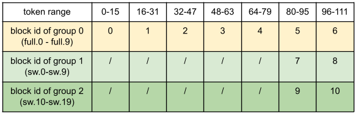
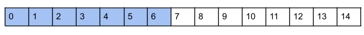
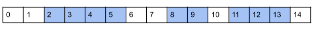

# Hybrid KV Cache Manager

!!! warning
    This document was written based on commit [458e74](https://github.com/vllm-project/vllm/commit/458e74eb907f96069e6d8a4f3c9f457001fef2ea). This feature is still in its early stage and things may change.

## What is a hybrid model?

Many recent "hybrid" LLMs combine multiple attention types within one model. For example:

1. Sliding window attention (sw) + full attention (full): gpt-oss, Gemma 2/3, Ministral, cohere, etc.
2. Mamba + full: Bamba, Jamba, Minimax, etc.
3. Local chunked attention + full: Llama4

To serve these models efficiently, our [KVCacheManager][vllm.v1.core.kv_cache_manager.KVCacheManager] must:

1. Allocate different slots to different layer type, for example:
    - Full attention layers: reserve slots for **all** tokens.
    - Sliding window layers: reserve slots only for the most recent **`sliding_window_size`** tokens.
2. Support layer-specific prefix-cache rules, for example:
    - Full attention: a cache hit prefix requires **all** tokens remain in the KV cache.
    - Sliding window: a cache hit prefix only requires the last **`sliding_window_size`** tokens remain in the KV cache.

## Definitions

1. **kv hidden size**: The number of bytes to store one token's KV cache for a single layer.
2. **block**: the memory reserved for kv cache are divided into multiple *blocks* with the same *page size* (defined below)
3. **block size**: number of tokens inside a block
4. **page size**: the physical memory size of a block, defined as:

    $$
    \text{num_layers} \times \text{block_size} \times \text{kv_hidden_size}
    $$

    `num_layers` doesn't mean the total number of layers in the model. The exact number depends on the context in this doc.

    !!! note
        This is different from `KVCacheSpec.page_size_bytes` in the code, which is defined as:

        $$
        \text{block_size} \times \text{kv_hidden_size}
        $$

## Allocation

### High level idea

We use a single memory pool for all layer types. The memory pool is split into multiple blocks with the same page size. [KVCacheManager][vllm.v1.core.kv_cache_manager.KVCacheManager] allocates different numbers of blocks to different layers according to its attention type.

The core challenge is ensuring every layer type uses the same **page size**.  For full-attention-only models, the page size is straightforward, defined as:

$$
\text{page_size} = \text{block_size} \times \text{num_hidden_layers} \times \text{kv_hidden_size}
$$

However, in hybrid models, `num_hidden_layers` varies by attention type, which would normally produce mismatched page sizes. The cases below show how we unify them.

### Case 1: toy model

Let's start with a toy example: a model has 1 full attention layer and 3 sliding window attention layers. All layers have the same `kv_hidden_size`.

We let each block to hold `block_size` tokens for one layer, so:

$$
\text{page_size} = \text{kv_hidden_size} \times \text{block_size}
$$

[KVCacheManager][vllm.v1.core.kv_cache_manager.KVCacheManager] allocates a different number of blocks to each layer.

This case is only a toy example. For real models, please refer to the following cases.

### Case 2: same `kv_hidden_size` and a regular pattern

When the model has more layers, e.g., 20 sliding window attention layers and 10 full attention layers with the same `kv_hidden_size`. Calling the allocator once per layer (30 calls) is OK but becomes inefficient. As a solution, we group the allocation of layers that need the same number of blocks to reduce the number of calls.

The grouping is feasible because there is usually a beautiful ratio between the number of different types of layers. For example:

- Gemma-2: 1 sw : 1 full
- Llama 4: 3 local : 1 full

Our example can be regarded as 2 sw : 1 full. We can allocate blocks as if there are 2 sw and 1 full in the model, and repeat the result by 10 times to generate the `block_ids` for the 30 layers. The page size becomes:

$$
10 \times \text{kv_hidden_size} \times \text{block_size}
$$

Assume `block_size` 16, sliding window size 32, request length 112, then for the above example model, we need to allocate 11 blocks (0-6 for full, 7-8 for sw group 1, 9-10 for sw group 2).

Here, "/" denotes no block needed (sliding‑window layers don't need slots for early tokens).

See the formal definition below. The layers are divided into multiple *KV Cache Groups* so that there is:

1. **Identical attention type inside each group**: Each group only contains layers with the same attention type and thus need the same number of blocks for a given request. This enables layers in the same group share the same block ids without memory waste.
2. **Identical page size across groups**: Because our memory pool only have one page size.

Our example model is divided into 3 KV cache groups:

- Group 0: 10 full attention layers (full.0 - full.9)
- Group 1: 10 sliding window attention layers (sw.0 - sw.9)
- Group 2: 10 sliding window attention layers (sw.10 - sw.19)

Obviously, it satisfies rule 1. For rule 2, all 3 groups have

$$
10 \times \text{kv_hidden_size} \times \text{block_size}
$$

as their page size.

### Case 3: same `kv_hidden_size` and no regular pattern

Unfortunately, not all models have such a beautiful ratio, and approach in Case 2 will produce too many small groups. For example, Gemma-3-27b has 52 sliding window attention layers and 10 full attention layers. With the constraints in case 2, it would be 26 sliding window groups and 5 full attention groups, each contains 2 layers. The allocation is still inefficient. To reduce the number of kv cache groups, we group layers using the smallest layer count among all attention types. For example, min(52, 10)=10 layers per group in Gemma-3-27b. Then the grouping result is:

- Group 0: 10 full attention layers (full.0 - full.9)
- Group 1: 10 sliding window attention layers (sw.0 - sw.9)
- Group 2: 10 sliding window attention layers (sw.10 - sw.19)
- ...
- Group 6: 10 sliding window attention layers (sw.40 - sw.49)
- Group 7: 2 sliding window attention layers (sw.50 - sw.51) and 8 padding layers

We will update this algorithm if this heuristic leads to a bad result when a new model comes out (e.g., 20 full + 30 sw, the group size should be 10 instead of 20).

This case happens in Gemma-3 series models, and models in case 2 but with eagle speculative decoding which introduce one full attention layer. The solution has some memory waste and is not perfect. Please report any cases where padding overhead becomes unacceptable so we can refine the algorithm.

### Case 4: different `kv_hidden_size` (mainly hybrid mamba models)

Some architectures (e.g., Bamba, Jamba, Minimax) interleave standard attention layers with Mamba layers, where each Mamba layer's state size per token can be much larger than the attention layers' `kv_hidden_size`. Because we only support a single page size across all groups, we must reconcile these differing hidden sizes.

The current algorithm is:

1. Increase the `block_size` of attention layers until
    $$
    \text{block_size} \times \text{kv_hidden_size}_{\text{att}} \ge \text{state_size}_{\text{mamba}}
    $$
2. Pad the mamba state per layer to
    $$
    \text{block_size} \times \text{kv_hidden_size}_{\text{att}}
    $$
3. Apply the grouping strategy in case 3.

!!! note
    This can lead to more than 400 `block_size` for attention layers, which is too large. Another padding strategy is to increase `block_size` until

    $$
    \text{block_size} \times \text{kv_hidden_size}_{\text{att}} \times \text{num_attn_layers} \ge \text{state_size}_{\text{mamba}}
    $$

    This padding strategy is still a work in progress.

### Case 5: KV sharing

KV sharing refers to a layer using the KV cache of another layer, e.g., gemma-3n.
In these models, [KVCacheManager][vllm.v1.core.kv_cache_manager.KVCacheManager] ignores all layers with kv sharing and only allocates KV cache for layers that need kv cache, and some patches are made in model runner to apply the allocation result to kv sharing layers.

## Prefix caching

For simplicity, we assume `block_size=1` in this section.

### High level idea

The block pool uses a dict similar to `tuple(block_hash, group_id) -> block` to catch the full blocks. That means the same tokens of different groups are cached and evicted independently.

When a new request comes in, we check the cache hit prefix of each group, and return the intersection of these groups as the cached prefix of the request. See below for the detailed algorithm for checking the cache hit of one group & performing the intersection.

### Case 0: full attention only models

For full attention layers, blocks are allocated for all tokens in the request. For details on the underlying design, see [Prefix Caching](prefix_caching.md)

To find the longest cache hit prefix of a request, we enumerate from left (the first block) to right (the last block), checking whether the block is cached, and exit when cache misses. For example, we will return the first 7 tokens (0-6) as the cache hit prefix in the below example (blue blocks are cached):

### Case 1: sliding window attention only models

For sliding window attention layers, a naive implementation for memory allocation is to allocate `sliding_window_size` blocks and fill in the blocks in a round-robin way. But this naive implementation is not compatible with prefix caching so we didn't pick this design. In vLLM,  we allocate different blocks for different tokens and free blocks that are outside the sliding window.

For a new request, the cache hit prefix only requires the last `sliding_window_size - 1` tokens being cached.
Let's say `sliding_window_size = 4` and `block_size = 1`, and the request is a 15-token prompt (blue blocks are cached):

There are 3 possible cache hit prefixes:

- cache hit length 5, compute prefill with [2, 3, 4] → [5, 6, …, 14]
- cache hit length 6, compute prefill with [3, 4, 5] → [6, 7, …, 14]
- cache hit length 14, compute prefill with [11, 12, 13] → [14] (most efficient)

We can check the cache hit from right to left, and early exit when we find a match.This is opposite from full attention, where we check from left to right and early exit when the match fails. One potential cons (compared to full attention) is that we end up iterating over the entire list of tokens when there's no match, which is often a common case. This could potentially cause non-negligible overheads, but fine with full + swa, as discussed below.

### Case 2: sliding window attention + full attention models

The first problem is how to find the cache hit prefix. We need to "intersect" the cache hits of global and sliding window attention layers by:

1. Get the longest cache hit for full attention (scanning from left to right)
2. Get the longest cache hit for sliding window attention that is within that length. Implemented by checking cache hits from right to left starting from the cache hit length of full attention.

It can be ensured that the resulting cache hit of sliding window attention layers is also a cache hit of full attention layers. This is more efficient than finding all possible prefixes of each group and doing the intersection, because our approach can exit early if there is no cache hit.

The algorithm applies to models with exactly two attention types full attention + X, where X can be an arbitrary efficient attention algorithm like sliding window, llama 4 local attention, and mamba. It doesn't support models without full attention layers, and models with more than 2 types of attention. This is enough for most hybrid models at the moment of writing this doc.

The second question is the cache eviction policy. For now, we use one LRU queue for all kv cache groups. The blocks are added to the LRU queue when freed, either because the request is finished or the block is out of the sliding window.

### Case 3: mamba models

The prefix caching support of the mamba model is work in progress. Once implemented, models with mamba layer + full attention layer can be supported via the full attention + X algorithm in case 2.

## Implementation

### Overview

The `KVCacheManager` is organized into 3 layers:

- **[KVCacheManager][vllm.v1.core.kv_cache_manager.KVCacheManager]**: The interface between the scheduler and kv cache management system.
- **[KVCacheCoordinator][vllm.v1.core.kv_cache_coordinator.KVCacheCoordinator]**: coordinate per-group SingleTypeKVCacheManagers to generate the allocation result of a request. Depending on the model's configuration, one of these coordinators is chosen:
    - **[KVCacheCoordinatorNoPrefixCache][vllm.v1.core.kv_cache_coordinator.KVCacheCoordinatorNoPrefixCache]**: Used when prefix caching is disabled.
    - **[UnitaryKVCacheCoordinator][vllm.v1.core.kv_cache_coordinator.UnitaryKVCacheCoordinator]**: If only one KV cache group. The prefix caching logic is simplified as no intersection is needed.
    - **[HybridKVCacheCoordinator][vllm.v1.core.kv_cache_coordinator.HybridKVCacheCoordinator]**: Handles exactly two KV cache groups (must include one full‑attention group plus one other efficient‑attention group). Other cases are not implemented. You can disable prefix caching to use the KVCacheCoordinatorNoPrefixCache.
- **[SingleTypeKVCacheManager][vllm.v1.core.single_type_kv_cache_manager.SingleTypeKVCacheManager]**: Each instance manages allocation and prefix caching for one KV cache group, implementing the attention‑type–specific logic (e.g., full attention, sliding window, Mamba).

The blue box in the above figure shows the case with 10 full attention layers and 20 sliding window attention layers, thus:

- use `HybridKVCacheCoordinator`
- use 1 `FullAttentionManager` and 2 `SlidingWindowManager` for the 3 `KVCacheGroup`s.

### Memory Layout

For a model with n `KVCacheGroup`s, each with m layers, we allocate m buffers. Each buffer is shared by n layers, one from each group.

The following figure is for a model with 10 full attention layers (full.0 - full.9) and 20 sliding window attention layers (sw.0-sw.19). It follows "case 2" in "Allocation" section and is divided into 3 groups:

- Group 0: 10 full attention layers (full.0 - full.9)
- Group 1: 10 sliding window attention layers (sw.0 - sw.9)
- Group 2: 10 sliding window attention layers (sw.10 - sw.19)

And for a request, we allocate 11 blocks with `block_id` 0-6 to group 0, 7-8 to group 1, and 9-10 to group 2.

With such an example, the physical memory is divided into 10 buffers (`KVCacheTensor` 0 - `KVCacheTensor` 9). Each buffer is shared by 3 layers (e.g., `KVCacheTensor` 0 is shared by full.0 from group 0, sw.0 from group 1, and sw.10 from group 2) and is divided into pieces with size `block_size * kv_hidden_size`. The KV cache of these 3 attention layers are saved to different pieces of the buffer based on the allocated `block_ids`:

!!! note
    One logic "block" is mapped to 10 pieces in the 10 buffers of the physical memory.
