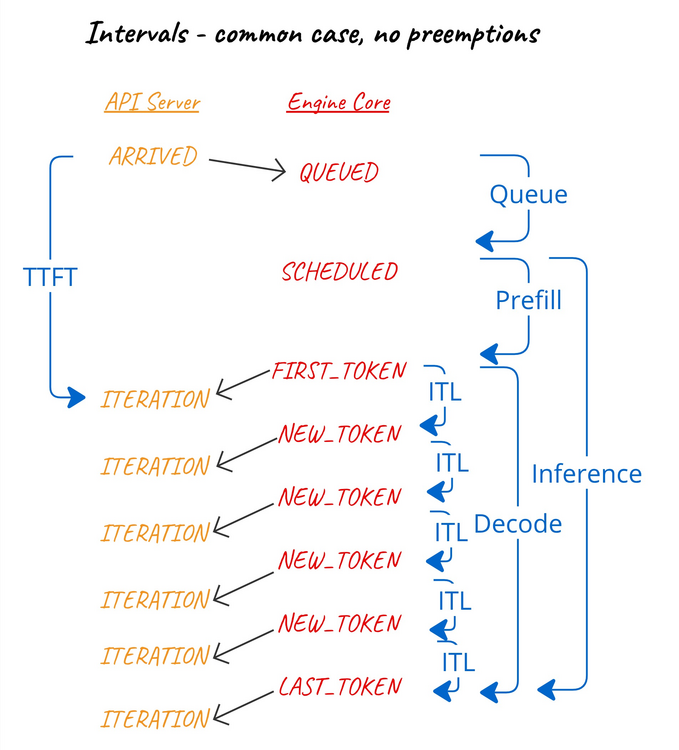
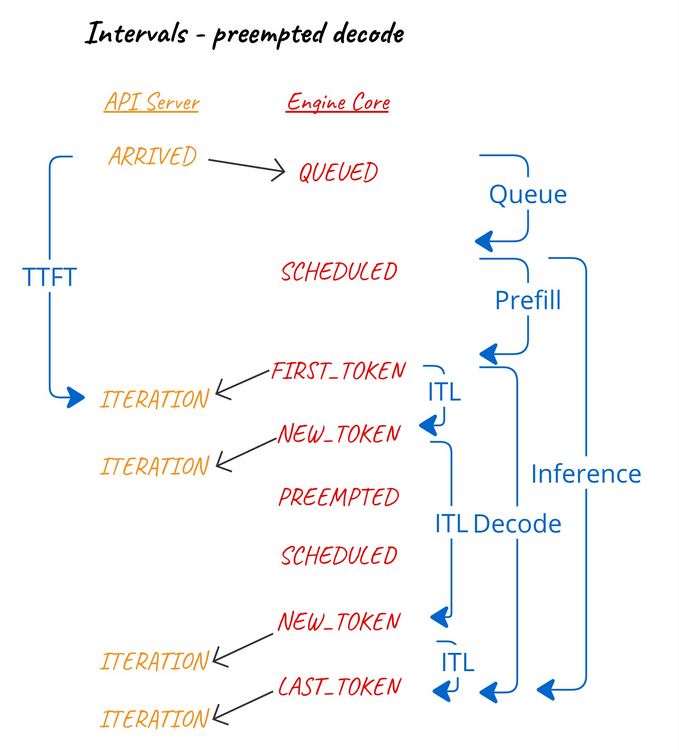
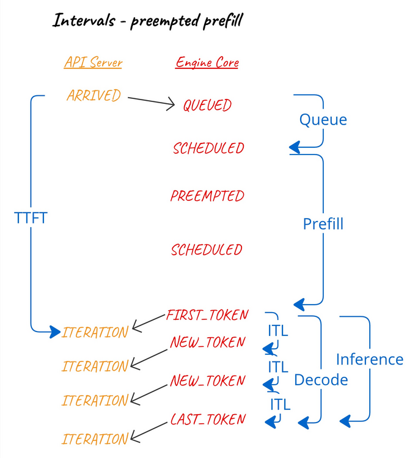

# Metrics

vLLM exposes a rich set of metrics to support observability and capacity planning for the V1 engine.

## Objectives

- Provide comprehensive coverage of engine and request level metrics to aid production monitoring.
- Prioritize Prometheus integrations, as this is what we expect to be used in production environments.
- Offer logging support (i.e. printing metrics to the info log) for ad-hoc testing, debugging, development, and exploratory use cases.

## Background

Metrics in vLLM can be categorized as follows:

1. Server-level metrics: Global metrics that track the state and performance of the LLM engine. These are typically exposed as Gauges or Counters in Prometheus.
2. Request-level metrics: Metrics that track the characteristics (e.g. size and timing) of individual requests. These are typically exposed as Histograms in Prometheus and are often the SLOs that an SRE monitoring vLLM will be tracking.

The mental model is that server-level metrics help explain the values of request-level metrics.

### Metrics Overview

### v1 Metrics

In v1, the following metrics are exposed via a Prometheus-compatible `/metrics` endpoint using the `vllm:` prefix:

- `vllm:num_requests_running` (Gauge) - Number of requests currently running.
- `vllm:num_requests_waiting` (Gauge) - Number of requests currently waiting.
- `vllm:kv_cache_usage_perc` (Gauge) - Fraction of used KV cache blocks (0–1).
- `vllm:prefix_cache_queries` (Counter) - Number of prefix cache queries.
- `vllm:prefix_cache_hits` (Counter) - Number of prefix cache hits.
- `vllm:mm_cache_queries` (Counter) - (For multimodal models) Number of multimodal cache queries.
- `vllm:mm_cache_hits` (Counter) - (For multimodal models) Number of multimodal cache hits.
- `vllm:num_preemptions_total` (Counter) - Number of preemptions.
- `vllm:prompt_tokens_total` (Counter) - Total number of prompt tokens processed.
- `vllm:generation_tokens_total` (Counter) - Total number of generated tokens.
- `vllm:iteration_tokens_total` (Histogram) - Histogram of tokens processed in each engine step.
- `vllm:cache_config_info` (Gauge) - Information about the cache configuration.
- `vllm:request_success_total` (Counter) - Number of finished requests (by finish reason).
- `vllm:request_prompt_tokens` (Histogram) - Histogram of input prompt token counts.
- `vllm:request_generation_tokens` (Histogram) - Histogram of generation token counts.
- `vllm:request_params_n` (Histogram) - Histogram of request parameter n.
- `vllm:request_params_max_tokens` - (Histogram) - Histogram of max_tokens parameter in requests.
- `vllm:time_to_first_token_seconds` (Histogram) - Time to first token (TTFT).
- `vllm:inter_token_latency_seconds` (Histogram) - Inter-token latency.
- `vllm:e2e_request_latency_seconds` (Histogram) - End-to-end request latency.
- `vllm:request_queue_time_seconds` (Histogram) - Time spent in the queue.
- `vllm:request_inference_time_seconds` (Histogram) - Request inference time.
- `vllm:request_prefill_time_seconds` (Histogram) - Request prefill time.
- `vllm:request_decode_time_seconds` (Histogram) - Request decode time.

These are documented under [Inferencing and Serving -> Production Metrics](../usage/metrics.md).

### Grafana Dashboard

vLLM also provides [a reference example](../../examples/online_serving/prometheus_grafana/README.md) for how to collect and store these metrics using Prometheus and visualize them using a Grafana dashboard.

The subset of metrics exposed in the Grafana dashboard gives us an indication of which metrics are especially important:

- `vllm:e2e_request_latency_seconds_bucket` - End to end request latency measured in seconds.
- `vllm:prompt_tokens` - Prompt tokens.
- `vllm:generation_tokens` - Generation tokens.
- `vllm:time_per_output_token_seconds` - Inter-token latency (Time Per Output Token, TPOT) in seconds.
- `vllm:time_to_first_token_seconds` - Time to First Token (TTFT) latency in seconds.
- `vllm:num_requests_running` (also, `_swapped` and `_waiting`) - Number of requests in the RUNNING, WAITING, and SWAPPED states.
- `vllm:kv_cache_usage_perc` - Percentage of used cache blocks by vLLM.
- `vllm:request_prompt_tokens` - Request prompt length.
- `vllm:request_generation_tokens` - Request generation length.
- `vllm:request_success` - Number of finished requests by their finish reason: either an EOS token was generated or the max sequence length was reached.
- `vllm:request_queue_time_seconds` - Queue time.
- `vllm:request_prefill_time_seconds` - Requests prefill time.
- `vllm:request_decode_time_seconds` - Requests decode time.
- `vllm:request_max_num_generation_tokens` - Max generation tokens in a sequence group.

See [the PR which added this Dashboard](https://github.com/vllm-project/vllm/pull/2316) for interesting and useful background on the choices made here.

### Prometheus Client Library

Prometheus support was initially added [using the aioprometheus library](https://github.com/vllm-project/vllm/pull/1890), but a switch was made quickly to [prometheus_client](https://github.com/vllm-project/vllm/pull/2730). The rationale is discussed in both linked PRs.

During those migrations we briefly lost a `MetricsMiddleware` to track HTTP metrics, but this was reinstated [using prometheus_fastapi_instrumentator](https://github.com/vllm-project/vllm/pull/15657):

```bash
$ curl http://0.0.0.0:8000/metrics 2>/dev/null  | grep -P '^http_(?!.*(_bucket|_created|_sum)).*'
http_requests_total{handler="/v1/completions",method="POST",status="2xx"} 201.0
http_request_size_bytes_count{handler="/v1/completions"} 201.0
http_response_size_bytes_count{handler="/v1/completions"} 201.0
http_request_duration_highr_seconds_count 201.0
http_request_duration_seconds_count{handler="/v1/completions",method="POST"} 201.0
```

### Multi-process Mode

Historically, metrics were collected in the engine core process and multiprocess mode was used to make them available in the API server process. See <https://github.com/vllm-project/vllm/pull/7279>.

More recently, metrics are collected in the API server process and multiprocess mode is only used when `--api-server-count > 1`. See <https://github.com/vllm-project/vllm/pull/17546> and details on [API server scale-out](../serving/data_parallel_deployment.md#internal-load-balancing).

### Built in Python/Process Metrics

The following metrics are supported by default by `prometheus_client`, but they are not exposed when multiprocess mode is used:

- `python_gc_objects_collected_total`
- `python_gc_objects_uncollectable_total`
- `python_gc_collections_total`
- `python_info`
- `process_virtual_memory_bytes`
- `process_resident_memory_bytes`
- `process_start_time_seconds`
- `process_cpu_seconds_total`
- `process_open_fds`
- `process_max_fds`

Therefore, these metrics are unavailable when `--api-server-count > 1`. It's questionable how relevant these are since they do not aggregate these stats for all processes that make up a vLLM instance.

## Metrics Design

The ["Even Better Observability"](https://github.com/vllm-project/vllm/issues/3616) feature where was where much of the metrics design was planned. For example, see where [a detailed roadmap was laid out](https://github.com/vllm-project/vllm/issues/3616#issuecomment-2030858781).

### Legacy PRs

To help understand the background to the metrics design, here are some of the relevant PRs which added the original, now legacy, metrics:

- <https://github.com/vllm-project/vllm/pull/1890>
- <https://github.com/vllm-project/vllm/pull/2316>
- <https://github.com/vllm-project/vllm/pull/2730>
- <https://github.com/vllm-project/vllm/pull/4464>
- <https://github.com/vllm-project/vllm/pull/7279>

### Metrics Implementation PRs

For background, here are the relevant PRs relating to the metrics implementation <https://github.com/vllm-project/vllm/issues/10582>:

- <https://github.com/vllm-project/vllm/pull/11962>
- <https://github.com/vllm-project/vllm/pull/11973>
- <https://github.com/vllm-project/vllm/pull/10907>
- <https://github.com/vllm-project/vllm/pull/12416>
- <https://github.com/vllm-project/vllm/pull/12478>
- <https://github.com/vllm-project/vllm/pull/12516>
- <https://github.com/vllm-project/vllm/pull/12530>
- <https://github.com/vllm-project/vllm/pull/12561>
- <https://github.com/vllm-project/vllm/pull/12579>
- <https://github.com/vllm-project/vllm/pull/12592>
- <https://github.com/vllm-project/vllm/pull/12644>

### Metrics Collection

In v1, we wish to move computation and overhead out of the engine core
process to minimize the time between each forward pass.

The overall idea of V1 EngineCore design is:

- EngineCore is the inner loop. Performance is most critical here
- AsyncLLM is the outer loop. This is overlapped with GPU execution
  (ideally), so this is where any "overheads" should be if
  possible. So AsyncLLM.output_handler_loop is the ideal place for the
  metrics bookkeeping if possible.

We will achieve this by collecting metrics in the frontend API server,
and base these metrics on information we can glean from the
`EngineCoreOutputs` returned by the engine core process to the
frontend.

### Interval Calculations

Many of our metrics are the time interval between various events in
the processing of a request. It is best practice to use timestamps
based on "monotonic time" (`time.monotonic()`) rather than "wall-clock
time" (`time.time()`) to calculate intervals as the former is
unaffected by system clock changes (e.g. from NTP).

It's also important to note that monotonic clocks differ between
processes - each process has its own reference point. So it is
meaningless to compare monotonic timestamps from different processes.

Therefore, in order to calculate an interval, we must compare two
monotonic timestamps from the same process.

### Scheduler Stats

The engine core process will collect some key statistics from the
scheduler - e.g. the number of requests that were scheduled or waiting
after the last scheduler pass - and include those statistics in
`EngineCoreOutputs`.

### Engine Core Events

The engine core will also record the timestamp of certain per-request
events so that the frontend can calculate the interval between these
events.

The events are:

- `QUEUED` - when the request was received by the engine core and
  added to the scheduler queue.
- `SCHEDULED` - when the request was first scheduled for execution.
- `PREEMPTED` - the request has been put back in the waiting queue
  in order to make room for other requests to complete. It will be
  re-scheduled in future and re-start its prefill phase.
- `NEW_TOKENS` - when the output included in `EngineCoreOutput` was
  generated. Since this is common to all requests in a given
  iteration, we use a single timestamp on `EngineCoreOutputs` to
  record this event.

And the calculated intervals are:

- Queue interval - between `QUEUED` and most recent `SCHEDULED`.
- Prefill interval - between most recent `SCHEDULED` and the subsequent
  first `NEW_TOKENS`.
- Decode interval - between first (after the most recent `SCHEDULED`) and
  last `NEW_TOKENS`.
- Inference interval - between most recent `SCHEDULED` and last `NEW_TOKENS`.
- Inter-token interval - between successive `NEW_TOKENS`.

Put another way:



We explored the possibility of having the frontend calculate these
intervals using the timing of events visible by the frontend. However,
the frontend does not have visibility into the timing of the `QUEUED`
and `SCHEDULED` events and, since we need to calculate intervals based
on monotonic timestamps from the same process ... we need the engine
core to record timestamps for all of these events.

#### Interval Calculations vs Preemptions

When a preemption occurs during decode, since any already generated
tokens are reused, we consider the preemption as affecting the
inter-token, decode, and inference intervals.



When a preemption occurs during prefill (assuming such an event
is possible), we consider the preemption as affecting the
time-to-first-token and prefill intervals.



### Frontend Stats Collection

As the frontend processes a single `EngineCoreOutputs` - i.e. the
output from a single engine core iteration - it collects various
statistics relating to that iteration:

- The total number of new tokens generated in this iteration.
- The total number of prompt tokens processed by the prefills that
  completed in this iteration.
- The queue intervals for any requests that were scheduled in this
  iteration.
- The prefill intervals for any requests that completed prefill in
  this iteration.
- The inter-token intervals (Time Per Output Token, TPOT), for all
  requests included in this iteration.
- The Time-To-First-Token (TTFT) for any requests that completed
  prefill in this iteration. However, we calculate this interval
  relative to when the request was first received by the frontend
  (`arrival_time`) in order to account for input processing time.

For any requests that were completed in a given iteration, we also
record:

- The inference and decode intervals - relative to the scheduled and
  first token events, as described above.
- End-to-end latency - the interval between frontend `arrival_time`
  and the frontend receiving the final token.

### KV Cache Residency Metrics

We also emit a set of histograms that describe how long sampled KV cache
blocks stay resident and how often they are reused. Sampling
(`--kv-cache-metrics-sample`) keeps the overhead tiny; when a block is
chosen we record:

- `lifetime` – allocation ⟶ eviction
- `idle before eviction` – last touch ⟶ eviction
- `reuse gaps` – the pauses between touches when the block gets reused

Those map directly to the Prometheus metrics:

- `vllm:kv_block_lifetime_seconds` – how long each sampled block exists.
- `vllm:kv_block_idle_before_evict_seconds` – idle tail after the final access.
- `vllm:kv_block_reuse_gap_seconds` – time between consecutive touches.

The engine core only ships raw eviction events via `SchedulerStats`; the
frontend drains them, turns them into Prometheus observations, and also
exposes the same data through `LLM.get_metrics()` when logging is on.
Looking at lifetime and idle time on one chart makes it easy to spot
stranded cache or workloads that pin prompts for a long decode.

### Metrics Publishing - Logging

The `LoggingStatLogger` metrics publisher outputs a log `INFO` message
every 5 seconds with some key metrics:

- The current number of running/waiting requests
- The current GPU cache usage
- The number of prompt tokens processed per second over the past 5
  seconds
- The number of new tokens generated per second over the past 5
  seconds
- The prefix cache hit rate over the most recent 1k kv-cache block queries

### Metrics Publishing - Prometheus

The `PrometheusStatLogger` metrics publisher makes the metrics
available via a `/metrics` HTTP endpoint in a Prometheus-compatible
format. A Prometheus instance can then be configured to poll this
endpoint (e.g. every second) and record the values in its time-series
database. Prometheus is often used via Grafana, allowing these metrics
to be graphed over time.

Prometheus supports the following metric types:

- Counter: a value that will increase over time, never reducing, and
  generally reset to zero when the vLLM instance restarts. For
  example, the number of tokens generated over the lifetime of the
  instance.
- Gauge: a value that goes up and down, for example the number of
  requests currently scheduled for execution.
- Histogram: a count of metric samples, recorded in buckets. For
  example, the number of requests whose TTFT was <1ms, <5ms, <10ms,
  <20ms, and so on.

Prometheus metrics can also be labelled, allowing metrics to be
combined according to matching labels. In vLLM, we add a `model_name`
label to every metric which includes the name of the model served by
that instance.

Example output:

```bash
$ curl http://0.0.0.0:8000/metrics
# HELP vllm:num_requests_running Number of requests in model execution batches.
# TYPE vllm:num_requests_running gauge
vllm:num_requests_running{model_name="meta-llama/Llama-3.1-8B-Instruct"} 8.0
...
# HELP vllm:generation_tokens_total Number of generation tokens processed.
# TYPE vllm:generation_tokens_total counter
vllm:generation_tokens_total{model_name="meta-llama/Llama-3.1-8B-Instruct"} 27453.0
...
# HELP vllm:request_success_total Count of successfully processed requests.
# TYPE vllm:request_success_total counter
vllm:request_success_total{finished_reason="stop",model_name="meta-llama/Llama-3.1-8B-Instruct"} 1.0
vllm:request_success_total{finished_reason="length",model_name="meta-llama/Llama-3.1-8B-Instruct"} 131.0
vllm:request_success_total{finished_reason="abort",model_name="meta-llama/Llama-3.1-8B-Instruct"} 0.0
...
# HELP vllm:time_to_first_token_seconds Histogram of time to first token in seconds.
# TYPE vllm:time_to_first_token_seconds histogram
vllm:time_to_first_token_seconds_bucket{le="0.001",model_name="meta-llama/Llama-3.1-8B-Instruct"} 0.0
vllm:time_to_first_token_seconds_bucket{le="0.005",model_name="meta-llama/Llama-3.1-8B-Instruct"} 0.0
vllm:time_to_first_token_seconds_bucket{le="0.01",model_name="meta-llama/Llama-3.1-8B-Instruct"} 0.0
vllm:time_to_first_token_seconds_bucket{le="0.02",model_name="meta-llama/Llama-3.1-8B-Instruct"} 13.0
vllm:time_to_first_token_seconds_bucket{le="0.04",model_name="meta-llama/Llama-3.1-8B-Instruct"} 97.0
vllm:time_to_first_token_seconds_bucket{le="0.06",model_name="meta-llama/Llama-3.1-8B-Instruct"} 123.0
vllm:time_to_first_token_seconds_bucket{le="0.08",model_name="meta-llama/Llama-3.1-8B-Instruct"} 138.0
vllm:time_to_first_token_seconds_bucket{le="0.1",model_name="meta-llama/Llama-3.1-8B-Instruct"} 140.0
vllm:time_to_first_token_seconds_count{model_name="meta-llama/Llama-3.1-8B-Instruct"} 140.0
```

!!! note
    The choice of histogram buckets to be most useful to users
    across a broad set of use cases is not straightforward and will
    require refinement over time.

### Cache Config Info

`prometheus_client` has support for
[Info metrics](https://prometheus.github.io/client_python/instrumenting/info/)
which are equivalent to a `Gauge` whose value is permanently set to 1,
but exposes interesting key/value pair information via labels. This is
used for information about an instance that does not change - so it
only needs to be observed at startup - and allows comparing across
instances in Prometheus.

We use this concept for the `vllm:cache_config_info` metric:

```text
# HELP vllm:cache_config_info Information of the LLMEngine CacheConfig
# TYPE vllm:cache_config_info gauge
vllm:cache_config_info{block_size="16",cache_dtype="auto",calculate_kv_scales="False",cpu_offload_gb="0",enable_prefix_caching="False",gpu_memory_utilization="0.9",...} 1.0
```

However, `prometheus_client` has
[never supported Info metrics in multiprocessing mode](https://github.com/prometheus/client_python/pull/300) -
for [unclear reasons](gh-pr:7279#discussion_r1710417152). We
simply use a `Gauge` metric set to 1 and
`multiprocess_mode="mostrecent"` instead.

### LoRA Metrics

The `vllm:lora_requests_info` `Gauge` is somewhat similar, except the
value is the current wall-clock time, and is updated every iteration.

The label names used are:

- `running_lora_adapters`: a per-adapter count of the number requests
  running using that adapter, formatted as a comma-separated string.
- `waiting_lora_adapters`: similar, except counting requests that are
  waiting to be scheduled.
- `max_lora` - the static "max number of LoRAs in a single batch."
  configuration.

Encoding a running/waiting counts for multiple adapters in a
comma-separated string seems quite misguided - we could use labels to
distinguish between per-adapter counts. This should be revisited.

Note that `multiprocess_mode="livemostrecent"` is used - the most
recent metric is used, but only from currently running processes.

This was added in <https://github.com/vllm-project/vllm/pull/9477> and there is
[at least one known user](https://github.com/kubernetes-sigs/gateway-api-inference-extension/pull/54).
If we revisit this design and deprecate the old metric, we should
coordinate with downstream users so they can migrate before the removal.

### Prefix Cache metrics

The discussion in <https://github.com/vllm-project/vllm/issues/10582> about adding prefix cache metrics yielded
some interesting points which may be relevant to how we approach
future metrics.

Every time the prefix cache is queried, we record the number of tokens
queried and the number of queried tokens present in the cache
(i.e. hits).

However, the metric of interest is the hit rate - i.e. the number of
hits per query.

In the case of logging, we expect the user is best served by
calculating the hit rate over a fixed number of the most recent
queries (the interval is fixed to 1k most recent queries for now).

In the case of Prometheus though, we should take advantage of the
time-series nature of Prometheus and allow the user to calculate the
hit rate over an interval of their choosing. For example, a PromQL
query to calculate the hit interval of the past 5 minutes:

```text
rate(cache_query_hit[5m]) / rate(cache_query_total[5m])
```

To achieve this, we should record the queries and hits as counters in
Prometheus, rather than recording the hit rate as a gauge.

## Deprecated Metrics

### How To Deprecate

Deprecating metrics shouldn't be taken lightly. Users may not notice a
metric has been deprecated, and may be quite inconvenienced when it is
suddenly (from their perspective) when it is removed, even if there is
an equivalent metric for them to use.

As an example, see how `vllm:avg_prompt_throughput_toks_per_s` was
[deprecated](https://github.com/vllm-project/vllm/pull/2764) (with a comment in the code),
[removed](https://github.com/vllm-project/vllm/pull/12383), and then [noticed by a user](https://github.com/vllm-project/vllm/issues/13218).

In general:

1. We should be cautious about deprecating metrics, especially since
   it can be hard to predict the user impact.
2. We should include a prominent deprecation notice in the help string
   that is included in the `/metrics' output.
3. We should list deprecated metrics in user-facing documentation and
   release notes.
4. We should consider hiding deprecated metrics behind a CLI argument
   in order to give administrators
   [an escape hatch](https://kubernetes.io/docs/concepts/cluster-administration/system-metrics/#show-hidden-metrics)
   for some time before deleting them.

See the [deprecation policy](../contributing/deprecation_policy.md) for
the project-wide deprecation policy.

### Unimplemented - `vllm:tokens_total`

Added by <https://github.com/vllm-project/vllm/pull/4464>, but apparently never implemented. This can just be
removed.

### Duplicated - Queue Time

The `vllm:time_in_queue_requests` Histogram metric was added by
<https://github.com/vllm-project/vllm/pull/9659> and its calculation is:

```python
    self.metrics.first_scheduled_time = now
    self.metrics.time_in_queue = now - self.metrics.arrival_time
```

Two weeks later, <https://github.com/vllm-project/vllm/pull/4464> added `vllm:request_queue_time_seconds` leaving
us with:

```python
if seq_group.is_finished():
    if (seq_group.metrics.first_scheduled_time is not None and
            seq_group.metrics.first_token_time is not None):
        time_queue_requests.append(
            seq_group.metrics.first_scheduled_time -
            seq_group.metrics.arrival_time)
    ...
    if seq_group.metrics.time_in_queue is not None:
        time_in_queue_requests.append(
            seq_group.metrics.time_in_queue)
```

This seems duplicative, and one of them should be removed. The latter
is used by the Grafana dashboard, so we should deprecate or remove the
former.

### Prefix Cache Hit Rate

See above - we now expose 'queries' and 'hits' counters rather than a
'hit rate' gauge.

### KV Cache Offloading

Two legacy metrics relate to a "swapped" preemption mode that is no
longer relevant in v1:

- `vllm:num_requests_swapped`
- `vllm:cpu_cache_usage_perc`

In this mode, when a request is preempted (e.g. to make room in KV
cache to complete other requests), we swap kv cache blocks out to CPU
memory. This is also known as "KV cache offloading" and is configured
with `--swap-space` and `--preemption-mode`.

Historically, [vLLM has long supported beam search](https://github.com/vllm-project/vllm/issues/6226). The
SequenceGroup encapsulated the idea of N Sequences which
all shared the same prompt kv blocks. This enabled KV cache block
sharing between requests, and copy-on-write to do branching. CPU
swapping was intended for these beam search like cases.

Later, the concept of prefix caching was introduced, which allowed KV
cache blocks to be shared implicitly. This proved to be a better
option than CPU swapping since blocks can be evicted slowly on demand
and the part of the prompt that was evicted can be recomputed.

SequenceGroup was removed in V1, although a replacement will be
required for "parallel sampling" (`n>1`).
[Beam search was moved out of the core](https://github.com/vllm-project/vllm/issues/8306). There was a
lot of complex code for a very uncommon feature.

In V1, with prefix caching being better (zero over head) and therefore
on by default, the preemption and recompute strategy should work
better.

## Future Work

### Parallel Sampling

Some legacy metrics are only relevant in the context of "parallel
sampling". This is where the `n` parameter in a request is used to
request multiple completions from the same prompt.

As part of adding parallel sampling support in <https://github.com/vllm-project/vllm/pull/10980>, we should
also add these metrics.

- `vllm:request_params_n` (Histogram)

  Observes the value of the 'n' parameter of every finished request.

- `vllm:request_max_num_generation_tokens` (Histogram)

  Observes the maximum output length of all sequences in every finished
  sequence group. In the absence of parallel sampling, this is
  equivalent to `vllm:request_generation_tokens`.

### Speculative Decoding

Some legacy metrics are specific to "speculative decoding". This is where
we generate candidate tokens using a faster, approximate method or
model and then validate those tokens with the larger model.

- `vllm:spec_decode_draft_acceptance_rate` (Gauge)
- `vllm:spec_decode_efficiency` (Gauge)
- `vllm:spec_decode_num_accepted_tokens` (Counter)
- `vllm:spec_decode_num_draft_tokens` (Counter)
- `vllm:spec_decode_num_emitted_tokens` (Counter)

There is a PR under review (<https://github.com/vllm-project/vllm/pull/12193>) to add "prompt lookup (ngram)"
speculative decoding to v1. Other techniques will follow. We should
revisit these metrics in this context.

!!! note
    We should probably expose acceptance rate as separate accepted
    and draft counters, like we do for prefix caching hit rate. Efficiency
    likely also needs similar treatment.

### Autoscaling and Load-balancing

A common use case for our metrics is to support automated scaling of
vLLM instances.

For related discussion from the
[Kubernetes Serving Working Group](https://github.com/kubernetes/community/tree/master/wg-serving),
see:

- [Standardizing Large Model Server Metrics in Kubernetes](https://docs.google.com/document/d/1SpSp1E6moa4HSrJnS4x3NpLuj88sMXr2tbofKlzTZpk)
- [Benchmarking LLM Workloads for Performance Evaluation and Autoscaling in Kubernetes](https://docs.google.com/document/d/1k4Q4X14hW4vftElIuYGDu5KDe2LtV1XammoG-Xi3bbQ)
- [Inference Perf](https://github.com/kubernetes-sigs/wg-serving/tree/main/proposals/013-inference-perf)
- <https://github.com/vllm-project/vllm/issues/5041> and <https://github.com/vllm-project/vllm/pull/12726>.
  
This is a non-trivial topic. Consider this comment from Rob:

> I think this metric should focus on trying to estimate what the max
> concurrency that will cause the average request length > queries per
> second ... since this is really what will "saturate" the server.

A clear goal is that we should expose the metrics required to detect
this saturation point, so administrators can implement auto-scaling
rules based on those. However, in order to do so, we need to have a
clear view on how an administrator (and automated monitoring system)
should judge an instance as approaching saturation:

> To identify, what is the saturation point for model server compute
> (the inflection point where we cannot get more throughput with a
> higher request rate, but start to incur additional latency) so we
> can autoscale effectively?

### Metric Naming

Our approach to naming metrics probably deserves to be revisited:

1. The use of colons in metric names seems contrary to
   ["colons are reserved for user defined recording rules"](https://prometheus.io/docs/concepts/data_model/#metric-names-and-labels).
2. Most of our metrics follow the convention of ending with units, but
   not all do.
3. Some of our metric names end with `_total`:

    If there is a suffix of `_total` on the metric name, it will be removed. When
    exposing the time series for counter, a `_total` suffix will be added. This is
    for compatibility between OpenMetrics and the Prometheus text format, as OpenMetrics
    requires the `_total` suffix.

### Adding More Metrics

There is no shortage of ideas for new metrics:

- Examples from other projects like
  [TGI](https://github.com/IBM/text-generation-inference?tab=readme-ov-file#metrics)
- Proposals arising from specific use cases, like the Kubernetes
  auto-scaling topic above
- Proposals that might arise out of standardisation efforts like
  [OpenTelemetry Semantic Conventions for Gen AI](https://github.com/open-telemetry/semantic-conventions/tree/main/docs/gen-ai).

We should be cautious in our approach to adding new metrics. While
metrics are often relatively straightforward to add:

1. They can be difficult to remove - see the section on deprecation
   above.
2. They can have a meaningful performance impact when enabled. And
   metrics are usually of very limited use unless they can be enabled
   by default and in production.
3. They have an impact on development and maintenance of the
   project. Every metric added over time has made this effort more
   time-consuming, and perhaps not all metrics justify this ongoing
   investment in their maintenance.

## Tracing - OpenTelemetry

Metrics provide an aggregated view over time of the system's
performance and health. Tracing, on the other hand, tracks individual
requests as they move through different services and components. Both
fall under the more general heading of "Observability".

vLLM has support for OpenTelemetry tracing:

- Added by <https://github.com/vllm-project/vllm/pull/4687> and reinstated by <https://github.com/vllm-project/vllm/pull/20372>
- Configured with `--oltp-traces-endpoint` and `--collect-detailed-traces`
- [OpenTelemetry blog post](https://opentelemetry.io/blog/2024/llm-observability/)
- [User-facing docs](../examples/online_serving/opentelemetry.md)
- [Blog post](https://medium.com/@ronen.schaffer/follow-the-trail-supercharging-vllm-with-opentelemetry-distributed-tracing-aa655229b46f)
- [IBM product docs](https://www.ibm.com/docs/en/instana-observability/current?topic=mgaa-monitoring-large-language-models-llms-vllm-public-preview)

OpenTelemetry has a
[Gen AI Working Group](https://github.com/open-telemetry/community/blob/main/projects/gen-ai.md).

Since metrics is a big enough topic on its own, we consider the topic
of tracing to be quite separate from metrics.

### OpenTelemetry Model Forward vs Execute Time

The current implementation exposes the following two metrics:

- `vllm:model_forward_time_milliseconds` (Histogram) - The time spent
  in the model forward pass when this request was in the batch.
- `vllm:model_execute_time_milliseconds` (Histogram) - The time spent
  in the model execute function. This will include model forward,
  block/sync across workers, cpu-gpu sync time and sampling time.

These metrics are only enabled when OpenTelemetry tracing is enabled
and if `--collect-detailed-traces=all/model/worker` is used. The
documentation for this option states:

> collect detailed traces for the specified modules. This involves
> use of possibly costly and or blocking operations and hence might
> have a performance impact.

The metrics were added by <https://github.com/vllm-project/vllm/pull/7089> and who up in an OpenTelemetry trace
as:

```text
-> gen_ai.latency.time_in_scheduler: Double(0.017550230026245117)
-> gen_ai.latency.time_in_model_forward: Double(3.151565277099609)
-> gen_ai.latency.time_in_model_execute: Double(3.6468167304992676)
```

We already have `inference_time` and `decode_time` metrics, so the
question is whether there are sufficiently common use cases for the
higher-resolution timings to justify the overhead.

Since we are going to treat the question of OpenTelemetry support
separately, we will include these particular metrics under that topic.
