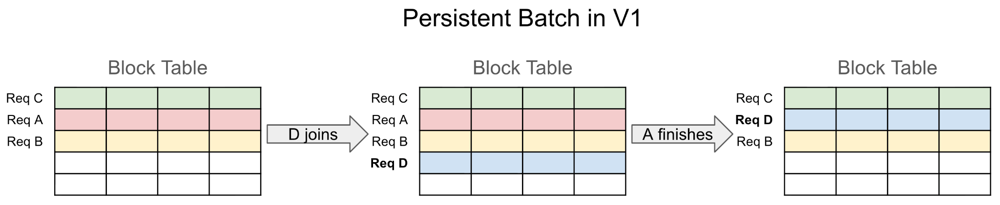
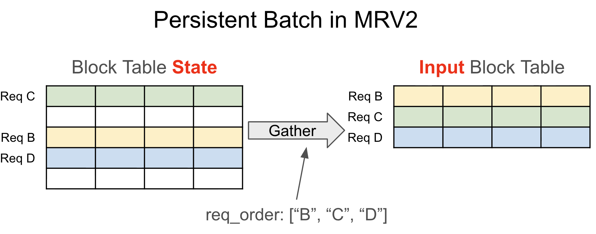
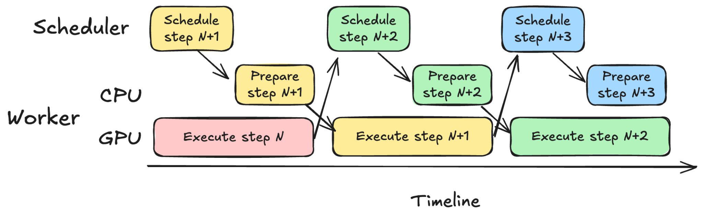
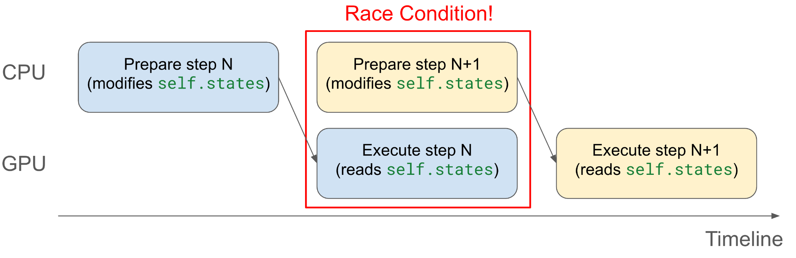
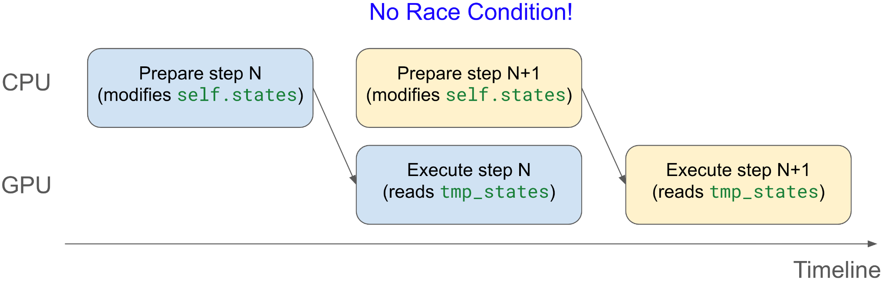

# Model Runner V2 Design Document

## Introduction

Since vLLM V1 was first implemented, we discovered several fundamental design mistakes and accumulated significant technical debt. Many features were bolted on that were not considered in the original design. We also gained valuable insights into sampling techniques (for example, Gumbel-max sampling), tools (for example, Triton), and CUDA features (for example, UVA). With this knowledge, we implemented Model Runner V2 (MRV2) from first principles to be cleaner, more efficient, and more modular.

In hindsight, many of V1's design choices were suboptimal. While MRV2 is not yet feature-complete, not rigorously tested, and still has open design decisions, we believe it is a substantial improvement over V1.

This document describes the design of MRV2.

## 1. Persistent Batch

One significant source of friction in V1 is its persistent batch implementation.

### Background

V1 introduced persistent batches to minimize CPU overhead during input preparation. When requests are scheduled for a step, the model runner must construct contiguous input tensors (for example, block tables and per-request temperature values) to feed into the model. Building these tensors from scratch each step is often very slow in Python, especially for large tensors like block tables.

The persistent batch optimization exploits the fact that request batches in consecutive steps are mostly identical. Only a few requests (if any) join or finish per step. By maintaining persistent state tensors and applying incremental diffs instead of reconstructing inputs from scratch, CPU overhead can be reduced significantly.

### Problems with V1's Approach

While efficient, V1's persistent batch design introduced unnecessary complexity due to coupling persistent state with input tensors. V1 uses persistent state tensors directly as model and sampler inputs, which imposes strict layout and ordering requirements. When requests join or finish, this often requires complex tensor-wide reordering rather than simple row insertion/removal.

V1 also had to maintain `CachedRequestState`, a redundant backup copy of request state, because rows in persistent tensors can be overwritten while requests are still active.

The result is complex bookkeeping that becomes more difficult under async scheduling.



### MRV2's Solution

MRV2 decouples persistent state tensors from per-step input tensors. Given request ordering for the step (usually determined by the attention backend), MRV2 gathers input tensors from persistent state.

1. Pre-allocate a fixed-size tensor with `max_num_reqs` rows (1024 by default on most platforms).
2. Assign each request a permanent row for its active lifetime (until finish or preemption).
3. Treat preemption as completion. On resume, re-add request data as fresh state.

This removes the need for `CachedRequestState` and simplifies bookkeeping. Large state tensors are mostly stored on GPU memory, so gather runs in parallel on the GPU with low overhead.



## 2. Async-First

vLLM now relies heavily on asynchronous scheduling. The scheduler and worker prepare inputs for step `N+1` while the GPU executes step `N`, overlapping CPU and GPU work to maximize utilization.

V1 was not originally designed with async scheduling in mind, and support required retrofitted behavior and hacks. MRV2 instead assumes the core model execution loop is a CUDA stream with no CPU synchronization points. CPU entrypoints queue work onto the stream.



## 3. Removing Async Barrier

A key requirement for async execution is that CPU operations remain non-blocking. Both explicit sync (for example, `torch.accelerator.synchronize`) and implicit sync (for example, unpinned `.to("cuda")`) must be avoided.

However, async execution can introduce race conditions when CPU and GPU concurrently touch the same memory.

Example (unsafe):

```python
class ModelRunner:
    def __init__(self, ...):
        # Pinned buffer
        self.states = torch.zeros(
            max_num_reqs, dtype=torch.int32, device="cpu", pin_memory=True
        )

    def execute_step(self, ...):
        self.states[req_idx] = new_req.data
        states = self.states.to("cuda", non_blocking=True)
```

The CPU may modify `self.states` while GPU is still reading from it via async copy.

V1 addresses this with an async barrier around critical sections. That avoids races but has drawbacks:

1. Easy to miss protected buffers (bug-prone).
2. Inflexible organization (all CPU work must stay inside barrier).
3. Potentially less overlap due to synchronization.



### MRV2's Solution: Eliminate the Race

MRV2 separates persistent CPU state from the copied tensor:

```python
class ModelRunner:
    def __init__(self, ...):
        # Not pinned
        self.states = torch.zeros(
            max_num_reqs, dtype=torch.int32, device="cpu", pin_memory=False
        )

    def execute_step(self, ...):
        self.states[req_idx] = new_req.data
        tmp_states = self.states.pin_memory()
        states = tmp_states.to("cuda", non_blocking=True)
```

Now CPU writes to `self.states` while GPU reads from `tmp_states`, eliminating the race without explicit synchronization.



## 4. StagedWriteTensor

For large tensors like block tables, MRV2 avoids full CPU-to-GPU copies each step by using `StagedWriteTensor`:

1. Keep the base tensor on GPU.
2. Stage diffs on CPU.
3. Pack diffs into contiguous buffers.
4. Copy packed diffs to GPU.
5. Launch one kernel to apply diffs.

Example usage:

```python
# Initialize state on GPU
state = StagedWriteTensor(size=(1024, 1000), dtype=torch.int32, device="cuda")

# Write [3, 1, 2] into row 2, starting at index 3
state.stage_write(row=2, start=3, value=[3, 1, 2])

# Write [-1, -2, -5] into row 0, starting at index 1
state.stage_write(row=0, start=1, value=[-1, -2, -5])

# Apply staged changes
state.apply_write()
```

This supports ragged updates with no CPU-GPU synchronization and minimal kernel launches. It is especially useful for block tables and mixed CPU/GPU-written states such as `num_computed_tokens`.

## 5. GPU-Native Input Metadata Preparation and Output Processing

MRV2 uses Triton kernels to prepare inputs such as `input_ids`, `positions`, `query_start_loc`, and `seq_lens`.

Benefits:

1. Better async behavior: GPU can derive values (for example with speculative decoding) that CPU may not know yet.
2. Lower CPU overhead: input prep is very cheap on GPU and avoids Python bottlenecks.

### Universal Virtual Addressing (UVA)

MRV2 uses UVA in some paths to let GPU kernels access large CPU-resident tensors directly (for example `prefill_token_ids`) without duplicating those tensors into GPU memory.

## 6. Triton-Native Sampler

MRV2 reimplements sampling mostly in Triton for better numeric/memory control and optimization.

### Gumbel Sampling Kernel

MRV2 introduces a Triton Gumbel sampling kernel that avoids explicit softmax materialization and uses stateless in-kernel RNG from seed input.

### Efficient Top-K Logprobs

V1 materializes full-vocabulary logprobs before top-k. MRV2 identifies top-k tokens from logits first, then computes logprobs only for selected tokens. This reduces peak GPU memory usage.

### Memory-Efficient Prompt Logprobs

MRV2 supports finer-grained chunking, including chunking inside a single prompt, to avoid memory spikes on long prompts.

### Better Compatibility with Speculative Decoding

Instead of expanding per-request sampling states to match per-logit shapes, MRV2 uses indirection (`idx_mapping`) inside kernels to map each logits vector to the right request state. This simplifies support for complex sampling parameters and logits processors.

## 7. Modularity

MRV2 emphasizes modularity. Compared to V1's large, entangled `gpu_model_runner.py`, MRV2 splits feature logic across dedicated files (for example, `mrope_utils.py`, `penalties.py`, and many others).

It also consolidates model inputs into an `InputBatch` class and reduces direct model-runner attribute coupling.

## 8. No Abuse of `dummy_run`

In V1, `dummy_run` handled too many responsibilities:

- Initial memory profiling and `torch.compile`
- CUDA graph capture
- Warmups
- Empty DP forward passes for EP+DP

MRV2 simplifies this:

1. `execute_model` supports dummy runs without affecting state.
2. `dummy_run` delegates to `execute_model` for profiling, warmup, and empty DP forward passes.
3. CUDA graph capture uses a separate dedicated path.

This reduces complexity and removes bugs caused by divergence between `execute_model` and `dummy_run` behavior.

## 9. Explicit CUDA Graph Management

V1's CUDA graph handling is implicit and hard to reason about. MRV2 uses a `CUDAGraphManager` that explicitly captures and launches full CUDA graphs through standard PyTorch APIs.

This makes graph lifecycle and execution mode decisions more understandable and easier to extend. Example: MRV2 can capture multiple draft-model forward passes into one CUDA graph.

## Development Philosophy

MRV2 changes should meet a higher code quality bar. As feature gaps with V1 are filled, features should be reconsidered from first principles in the MRV2 design context instead of quickly porting V1 behavior.

A key requirement is preserving modularity and clean abstraction boundaries, even if that requires more upfront design iteration.
