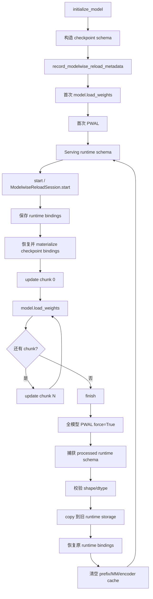
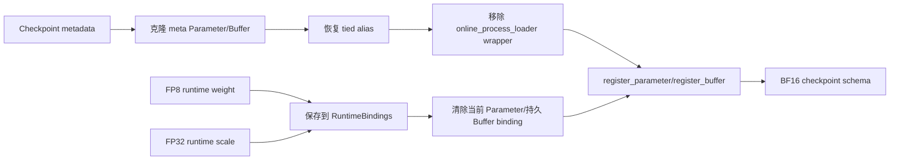
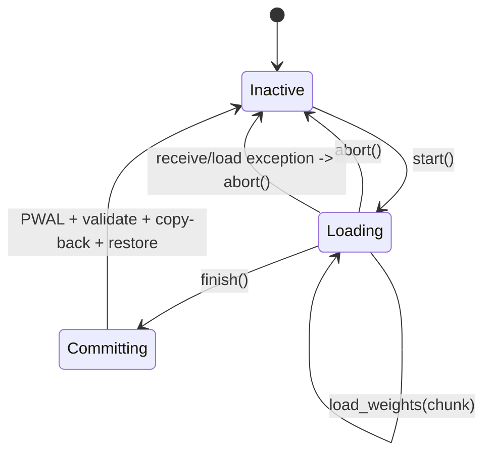
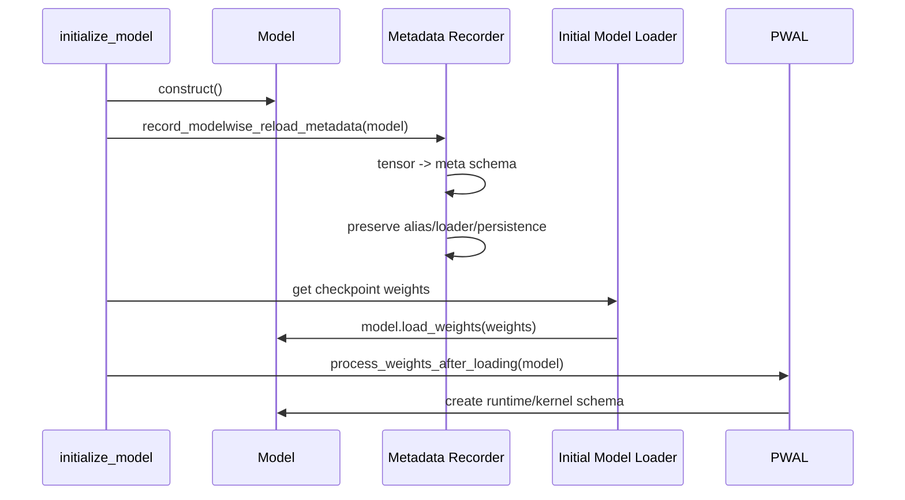
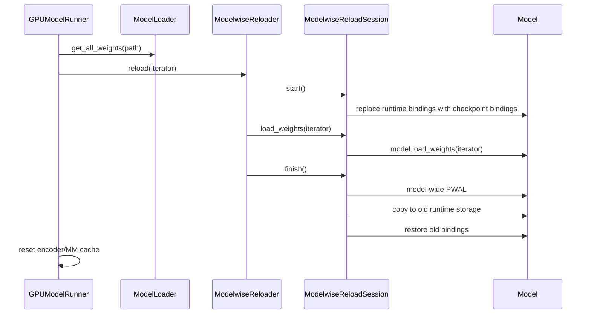
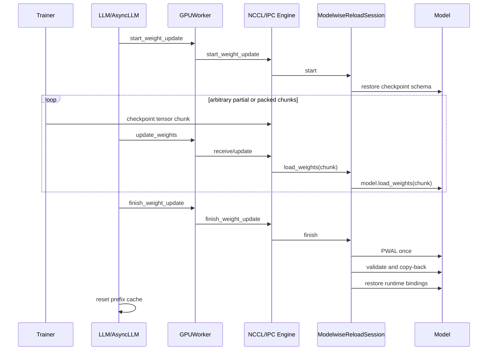

# Modelwise Weight Reload 完整方案

## 1. 背景与目标

vLLM 的 checkpoint 权重与 serving 时 kernel 实际使用的权重不一定是同一种表示。
一次初始加载可能经过：

```text
checkpoint tensor
    -> 模型名称映射
    -> TP/EP shard
    -> QKV、gate/up、expert fusion
    -> padding、transpose、layout conversion
    -> quantization、scale 生成、repack
    -> MLA/Attention/HPC 派生状态生成
    -> runtime/kernel tensor
```

因此，在线 reload 不能简单地把新的 checkpoint tensor `copy_` 到当前 runtime
Parameter。尤其是在线 FP8、INT8、GPTQ-Marlin、compressed-tensors 和 MLA：

- checkpoint 与 runtime 的 shape、dtype 或 layout 可能不同；
- PWAL 可能替换 Parameter/Buffer；
- forward 可能读取由 PWAL 生成的普通 tensor attribute；
- CUDA Graph 和 kernel 可能要求 runtime storage 地址保持不变。

旧 layerwise reload 将上述转换按 layer 分割，并通过 tensor 数量或 `numel` 推断
每层何时加载完成。这导致正确性依赖：

- checkpoint 顺序；
- layer 边界；
- fused tensor 的计数方式；
- padding 和 shard 后的元素数；
- 一个 layer 是否包含额外的 derived state；
- packed buffer 是否恰好跨越 layer 边界。

Modelwise Reload 的目标是：

1. 继续使用每个模型原生的 `model.load_weights()`。
2. 将 checkpoint 到 runtime 的转换作为一个模型级事务。
3. 支持一次或多次 partial/packed weight update。
4. 只以显式 `finish` 作为完成边界，不使用 `numel`。
5. 统一执行 quant、Attention、MLA 和 HPC 的 PWAL。
6. commit 后保持原 runtime Parameter、Buffer 和 storage 地址不变。
7. 接收失败时恢复旧模型，不提交半成品权重。

## 2. 核心设计

Modelwise Reload 同时维护两套 tensor schema：

```text
Checkpoint schema
    model.load_weights() 能够加载的原始 Parameter/Buffer 结构

Runtime schema
    PWAL 后 serving kernel 实际读取的 Parameter/Buffer 结构
```

模型初始化后、首次 checkpoint 加载前记录 checkpoint schema。执行 reload 时：

```text
1. 保存当前 runtime bindings。
2. 临时恢复 checkpoint bindings。
3. 一次或多次调用 model.load_weights(chunk)。
4. 显式 finish 时执行全模型 PWAL。
5. 校验处理后的 runtime schema。
6. 将处理结果 copy 回原 runtime storage。
7. 恢复原 runtime bindings。
```

Modelwise Reload 不尝试让运行态模型直接接收 checkpoint 权重，而是临时把模型恢复
为 `model.load_weights()` 所期望的结构。

## 3. 总体架构



### 3.1 数据平面与控制平面

```text
控制平面
LLM / AsyncLLM
    -> GPUWorker
        -> WeightTransferEngine
            -> ModelwiseReloadSession

数据平面
filesystem / NCCL / CUDA IPC
    -> Iterable[(checkpoint_name, tensor)]
        -> ModelwiseReloadSession.load_weights()
            -> model.load_weights()
                -> Parameter.weight_loader()
```

传输后端只负责产生 checkpoint tensor；模型仍负责名称映射、分片和融合。

## 4. 模块介绍

### 4.1 `record_modelwise_reload_metadata`

位置：

```text
vllm/model_executor/model_loader/reload/modelwise.py
```

调用时机：

```text
模型构造完成
    -> 首次 checkpoint load 之前
    -> 首次 PWAL 之前
```

入口位于 `initialize_model()`：

```python
model = model_class(...)
record_modelwise_reload_metadata(model)
return model
```

它记录的是 checkpoint tensor binding graph，而不是 tensor 数值。每个 entry 包含：

- module path；
- attribute name；
- Parameter 或 Buffer 类型；
- `None` slot；
- shape、stride、dtype、device-independent meta representation；
- tensor subclass；
- `weight_loader` 及自定义属性；
- tied/shared tensor alias；
- Buffer persistence。

真实权重被转换为 meta tensor，避免永久保留一份 BF16 checkpoint 权重。

#### 非持久 Buffer

非持久 Buffer 不属于 checkpoint，不记录也不替换，例如：

```text
rotary_emb.cos_sin_cache
```

这类 Buffer 在整个 reload 中保持原 binding。否则构造阶段的未初始化 cache 可能覆盖
当前有效 runtime cache，造成权重 checksum 正确但推理错误。

#### Alias

通过原 tensor identity 去重：

```text
embed_tokens.weight ─┐
                     ├─ 同一个 metadata entry
lm_head.weight ──────┘
```

恢复 checkpoint schema 时仍会注册同一个 Parameter 对象。

#### Metadata 生命周期

metadata 保存于：

```python
WeakKeyDictionary[model, _ModelMetadata]
```

模型被销毁后 metadata 可自动释放，不形成全局强引用。

### 4.2 `_ModelMetadata`

描述 checkpoint schema：

```python
@dataclass(frozen=True)
class _ModelMetadata:
    parameters: dict[(module_path, name), _TensorMetadata]
    buffers: dict[(module_path, name), _TensorMetadata]
    restore_device: torch.device
```

其中 `_TensorMetadata.tensor` 是 meta tensor 或 `None`。

### 4.3 `_RuntimeBindings`

描述事务开始时 serving 模型的当前 binding：

```python
@dataclass(frozen=True)
class _RuntimeBindings:
    parameters: dict[(module_path, name), Tensor | None]
    buffers: dict[(module_path, name), Tensor | None]
    buffer_persistence: dict[(module_path, name), bool]
```

这里保存真实 runtime 对象的强引用，保证 reload 期间：

- runtime tensor 不被释放；
- finish 后能够恢复原 Python object；
- 能够向原 storage 原位提交；
- CUDA Graph/kernel 持有的地址仍然有效。

### 4.4 `_restore_checkpoint_bindings`

职责：将模型从 runtime schema 临时重绑为 checkpoint schema。



具体步骤：

1. 建立 `module_path -> module` 索引。
2. 删除当前 runtime Parameter 和持久 Buffer binding。
3. 保留 non-persistent runtime Buffer。
4. 从 metadata 克隆 checkpoint meta tensor。
5. 恢复共享 Parameter/Buffer alias。
6. 将 `online_process_loader` 解包为原 checkpoint loader。
7. 重新执行 `register_parameter()`/`register_buffer()`。

此阶段不加载权重值，也不运行 PWAL。

### 4.5 `_materialize_checkpoint_bindings`

metadata 中的 tensor 位于 meta device，没有实际 storage。该模块在 reload start 时按
目标 device 分配临时 checkpoint storage：

```text
BF16 meta Parameter
    -> BF16 CUDA/CPU Parameter with storage
```

共享 tensor 只 materialize 一次，所有 alias 继续指向同一个对象。

### 4.6 `ModelwiseReloadSession`

这是核心事务对象，状态机为：



#### `start()`

执行：

```text
检查没有活动事务
    -> 获取 checkpoint metadata
    -> capture runtime bindings
    -> 禁止 TorchAO 特殊 reload 分支
    -> restore checkpoint bindings
    -> materialize checkpoint tensors
```

start 完成后，serving runtime tensor 仍被 `_RuntimeBindings` 持有，但 model tree 当前
暴露的是 checkpoint tensor。

事务期间必须暂停或隔离推理，因为 forward 不能消费尚未 PWAL 的 checkpoint schema。

#### `load_weights(weights)`

直接调用：

```python
loaded = self.model.load_weights(weights)
```

允许执行任意次数：

```python
session.load_weights(chunk_0)
session.load_weights(chunk_1)
session.load_weights(chunk_2)
```

该阶段：

- 不运行 PWAL；
- 不进行 layer finalization；
- 不统计 `numel`；
- 不假设 tensor 顺序；
- 不把 packed buffer 边界视为完成边界。

返回的 loaded name 仅用于日志和诊断，不用于决定事务是否完成。

#### `finish()`

执行一次模型级 commit：

```text
process_weights_after_loading(force=True)
    -> capture processed bindings
    -> validate processed schema against runtime schema
    -> copy processed values to old runtime storage
    -> restore old runtime bindings
```

无论 PWAL、校验还是 copy 是否抛异常，`finally` 都会恢复 runtime binding。

#### `abort()`

不运行 PWAL、不 copy-back，只恢复事务开始时的 runtime binding。因此接收失败不会
提交临时 checkpoint tensor。

### 4.7 `ModelwiseReloader`

提供单次文件系统 reload 的便捷封装：

```python
session.start()
try:
    session.load_weights(weights)
    session.finish()
except:
    session.abort()
    raise
```

调用点位于 `GPUModelRunner.reload_weights()` 的 checkpoint-format 分支。

### 4.8 `process_weights_after_loading(force=True)`

finish 阶段统一处理三类 post-load 状态：

```text
第一阶段：QuantizeMethodBase
    FP8/INT8 quantization
    GPTQ/Marlin/compressed-tensors repack
    scale、zero、packed layout 生成

第二阶段：Attention/MLAAttention/MMEncoderAttention
    Attention 后处理
    MLA derived weights
    encoder attention runtime state

第三阶段：HpcModule
    HpcRopeNorm 等模型/后端专用状态
```

`force=True` 会移除首次加载留下的 “already processed” 标志，使 PWAL 可以安全重新
执行。

每个模块的 PWAL 仍在其 reload arena scope 中运行，以便派生 tensor 复用稳定的
arena storage。

### 4.9 `_validate_copy_back`

commit 前对完整 runtime schema 做预检查：

```text
旧 runtime tensor shape/dtype
        ==
新 processed tensor shape/dtype
```

先完成全量校验，再开始 copy，避免发现第 N 个 tensor 不兼容时，前 N-1 个 tensor
已经被提交。

当前允许 processed schema 中缺失旧 Buffer，因为某些 runtime-only Buffer 不属于
本次 checkpoint commit；Parameter 缺失则视为错误。

### 4.10 `_copy_back` 与 `_restore_runtime_bindings`

`_copy_back` 不替换 runtime object：

```python
old_runtime_tensor.data.copy_(processed_tensor)
```

然后 `_restore_runtime_bindings` 把 model tree 重新指向旧对象：

```text
module.weight is original_runtime_weight
storage.data_ptr() == original_data_ptr
```

这保证 graph-visible storage identity 稳定。

### 4.11 `reload_storage_guard`

Modelwise Reload 外层仍由 storage guard 包围，用于校验：

- reload arena identity；
- 模块级 graph-visible storage；
- 全局 storage manifest。

Modelwise 自身负责 Parameter/Buffer schema 和 copy-back；storage guard 负责更广泛的
graph-visible runtime 状态验证，两者职责不同。

### 4.12 NCCL 与 CUDA IPC Engine

两个 backend 都持有：

```python
self.reload_session: ModelwiseReloadSession | None
```

生命周期映射：

| Weight transfer API | Modelwise 操作 |
|---|---|
| `start_weight_update()` | 创建 session 并执行 `start()` |
| `update_weights()` | 接收一个或多个 chunk，执行 `session.load_weights()` |
| `finish_weight_update()` | 执行 `session.finish()` |
| `abort_weight_update()` | 执行 `session.abort()` |

#### Unpacked NCCL

```text
receive tensor
    -> session.load_weights([(name, tensor)])
```

每个 tensor 可以单独进入 `model.load_weights()`，但不会触发 PWAL。

#### Packed NCCL

```text
packed buffer 0 -> unpack -> session.load_weights(chunk 0)
packed buffer 1 -> unpack -> session.load_weights(chunk 1)
packed buffer 2 -> unpack -> session.load_weights(chunk 2)
```

一次上层 update API 可以包含多个内部 buffer，PWAL 仍只由 finish 触发。

#### CUDA IPC

IPC handle 被重建为 receiver device tensor，组成一个 chunk 后传入
`session.load_weights()`。packed 模式可多次回调 update，但它们共享同一个 session。

### 4.13 `GPUWorker`

Worker 负责控制事务合法性：

- 不允许嵌套 start；
- 没有 start 时拒绝 update/finish；
- update 接收失败时自动 abort；
- finish 无论成功失败都清除 active 标志。

Worker 不管理 layer 状态，也不判断权重完成数量。

### 4.14 `LLM` 与 `AsyncLLM`

控制器调用顺序：

```python
llm.start_weight_update()
llm.update_weights(chunk_0)
llm.update_weights(chunk_1)
llm.finish_weight_update()
```

finish 成功后清空 prefix cache。文件系统 reload 还会清空 encoder/MM cache，避免继续
消费旧权重生成的缓存状态。

## 5. 完整数据流

### 5.1 初始化数据流



### 5.2 文件系统 Reload 数据流



### 5.3 NCCL/IPC Streaming 数据流



### 5.4 Tensor 状态变化示例

以 BF16 checkpoint 到在线 FP8 runtime 为例：

```text
Serving 前
module.weight       -> FP8 runtime Parameter Rw
module.weight_scale -> FP32 runtime Buffer Rs

start
RuntimeBindings = {weight: Rw, weight_scale: Rs}
module.weight       -> BF16 temporary checkpoint Parameter Cw
module.weight_scale -> checkpoint schema 对应的临时状态

update × N
model.load_weights() 将 BF16 值写入 Cw

finish / PWAL
Cw -> FP8 processed Parameter Pw
   -> FP32 processed scale Ps

commit
Rw.copy_(Pw)
Rs.copy_(Ps)

restore
module.weight       is Rw
module.weight_scale is Rs
```

## 6. 如何替代 Layerwise Reload

### 6.1 Layerwise 的旧职责

旧流程大致为：

```text
record_metadata_for_reloading
    -> initialize_layerwise_reload
        -> 为每层恢复 checkpoint tensor
        -> 包装 weight_loader
        -> 统计每层应加载的 numel
    -> model.load_weights
        -> 每收到 tensor 更新 layer 计数
        -> 猜测 layer 是否完成
        -> 逐层 PWAL/copy-back
    -> finalize_layerwise_reload
```

它将 completion 与 layer/tensor 数量绑定。

### 6.2 Modelwise 的职责映射

| Layerwise 组件/职责 | Modelwise 替代 |
|---|---|
| `record_metadata_for_reloading()` | `record_modelwise_reload_metadata()` |
| `initialize_layerwise_reload()` | `ModelwiseReloadSession.start()` |
| 每层 loader wrapper | 删除；恢复原 checkpoint loader |
| layer `load_numel`/`load_numel_total` | 删除 |
| tensor 到齐自动 finalize layer | 删除 |
| deferred attention processing | 统一进入 model-wide PWAL |
| `finalize_layerwise_processing()` | `process_weights_after_loading(force=True)` |
| `finalize_layerwise_reload()` | `session.finish()` |
| layer 异常清理 | `session.abort()` |

### 6.3 新文件系统路径

```python
if is_checkpoint_format:
    loaded_weights = ModelwiseReloader(
        model,
        model_config,
        device,
    ).reload(weights_iterator)
else:
    # 已是最终 runtime/kernel format
    for name, weight in weights_iterator:
        model.get_parameter(name).copy_(weight)
```

checkpoint-format 与 runtime-format 的边界保持明确：

- checkpoint format：Modelwise + `model.load_weights()` + PWAL；
- runtime format：shape/dtype/layout 已匹配时直接原位 copy。

### 6.4 新 Weight Transfer 路径

旧方式可能在每个 update 或每层达到 `numel` 后执行 PWAL。新方式必须使用：

```text
start
    -> update × N
    -> finish
```

传输协议不需要携带：

- layer completion；
- expected layer numel；
- total loaded numel；
- packed chunk 是否为最后一块。

控制器的 finish 请求就是权威事务边界。

### 6.5 迁移步骤

建议按以下顺序完全移除 layerwise：

1. 初始化阶段同时记录 layerwise 和 modelwise metadata。
2. 文件系统 checkpoint reload 切换到 `ModelwiseReloader`。
3. NCCL/IPC 切换到 `ModelwiseReloadSession`。
4. 验证量化矩阵、MLA、MoE、partial 和 packed update。
5. 确认代码中不再引用：

   ```text
   initialize_layerwise_reload
   finalize_layerwise_reload
   finalize_layerwise_processing
   load_numel
   load_numel_total
   ```

6. 删除传输路径中的 layerwise completion metadata。
7. 删除 `record_metadata_for_reloading()` 的调用。
8. 删除 `reload/layerwise.py` 和仅供 layerwise 使用的 helper。
9. 更新 `reload/__init__.py` 的导出和模块说明。

当前工作树中 checkpoint filesystem、NCCL 和 IPC 已切换到 modelwise，但为了兼容或
过渡，`reload/__init__.py` 与初始化路径仍保留旧 layerwise metadata/API。完全替代时
应完成步骤 6–9。

## 7. 正确性不变量

### 7.1 事务边界

```text
start 之前：模型只能处于 runtime schema
start 到 finish/abort：模型处于 checkpoint/loading schema，不允许 serving
finish 之后：模型恢复 runtime schema
abort 之后：模型恢复事务开始前的 runtime schema
```

### 7.2 完成条件

唯一完成条件：

```text
显式 finish_weight_update()
```

以下都不是完成条件：

- 收到某个 tensor；
- 收到某个 layer 的所有 tensor；
- `loaded_numel == expected_numel`；
- packed buffer 用满；
- packed producer 没有更多当前 buffer；
- 单次 `update_weights()` 返回。

### 7.3 Storage Identity

成功 commit 后，对所有已有 runtime Parameter/Buffer：

```python
new_binding is old_binding
new_binding.untyped_storage().data_ptr() == old_data_ptr
```

若 PWAL 产生与旧 runtime 不兼容的 shape/dtype，则拒绝 commit。

### 7.4 Runtime-only State

non-persistent Buffer 不参与 checkpoint 恢复。模型或 backend 产生的普通 derived
tensor 应由 model-wide PWAL/reload arena 更新，而不是通过 checkpoint binding
恢复。

### 7.5 Cache Consistency

权重版本提交后必须失效旧权重产生的缓存：

- prefix cache；
- encoder cache；
- multimodal cache；
- 外部 KV connector cache（如部署启用，应由更高层控制器处理）。

## 8. 异常与回滚

### 8.1 Start 失败

checkpoint binding 恢复或 materialize 失败：

```text
立即恢复 runtime bindings
    -> 恢复 TorchAO 状态
    -> session 保持 inactive
```

### 8.2 Receive/Load 失败

Worker 捕获异常并调用：

```python
weight_transfer_engine.abort_weight_update()
```

临时 checkpoint tensor 被丢弃，旧 runtime storage 未被写入。

### 8.3 PWAL 或校验失败

`finish()` 的 `finally` 会恢复 runtime bindings。因为 copy-back 前先全量验证，PWAL
和 schema validation 失败不会提交临时值。

### 8.4 Copy-back 中途失败

copy-back 是原位写操作；如果底层 `copy_` 在部分 tensor 已提交后失败，事务无法完全
回滚。该情况应 fail closed，worker 不应继续 serving，应重启或重新完整加载模型。

## 9. 内存与性能

### 9.1 峰值显存

Modelwise start 会同时持有：

```text
完整 runtime schema
+ 完整临时 checkpoint schema
+ PWAL 临时 workspace
```

峰值显存高于 layerwise。Modelwise 以简化正确性和完整模型 post-load 语义换取 reload
期间的额外显存。

部署可通过以下方式预留空间：

- 减少 KV cache；
- reload 前释放或缩小 cache；
- 使用 CPU/UVA offloading；
- 在请求 drain 后执行 reload；
- 将 checkpoint staging 放在容量更大的 device/host memory。

### 9.2 Packed Chunk 不降低 Staging 峰值

packed NCCL/IPC 减少传输 buffer 峰值，但当前 modelwise 仍 materialize 完整 checkpoint
schema。因此：

```text
传输分块 != checkpoint staging 分层释放
```

若未来需要降低 staging 峰值，应设计显式 model reload state 或可释放的 checkpoint
tensor arena，而不是重新引入 `numel` completion。

### 9.3 PWAL 次数

无论有多少 partial 或 packed chunks，一个成功事务只执行一次 model-wide PWAL，避免
重复量化/repack，并确保跨层或模型级 derived state 看到一致的权重版本。

## 10. 已验证场景

### 10.1 文件系统 Reload

已验证的完整 modelwise reload 包括：

- 在线 FP8 per-tensor、per-block、per-channel；
- 在线 INT8 weight-only；
- 在线 MXFP8；
- compressed-tensors FP8 block、W4A16、W4A8 MoE；
- GPTQ、AutoGPTQ、GPTQ-Marlin；
- experts INT8 MoE。

### 10.2 NCCL/IPC

H200 上使用本地 Qwen3-0.6B、BF16 trainer 权重和在线 FP8 runtime 验证：

| Backend | 模式 | 结果 |
|---|---|---:|
| CUDA IPC | 四次 partial update | Pass |
| NCCL | 四次 partial update | Pass |
| CUDA IPC | 384 MiB buffer，三个 packed chunks | Pass |
| NCCL | 一次 API update，内部三个 packed chunks | Pass |

所有场景均满足：

- finish 前保持 BF16 checkpoint schema；
- finish 前不执行 PWAL；
- 推理 token 与冷加载一致；
- runtime Parameter/Buffer identity change count 为 0；
- NCCL/IPC 不使用 `load_numel` completion。

### 10.3 自动化测试

单元测试覆盖：

- processed value copy 回原 runtime storage；
- multiple chunks；
- explicit finish 是唯一 PWAL 边界；
- abort；
- tied parameter alias；
- non-persistent Buffer；
- receive failure 自动 abort；
- finish 状态清理；
- prefix cache invalidation。

## 11. 限制与后续工作

### 11.1 当前限制

1. reload 期间模型 tree 暂时是 checkpoint schema，不能同时 serving。
2. 峰值显存约为 runtime + checkpoint staging + PWAL workspace。
3. processed tensor 必须与原 runtime tensor shape/dtype 一致。
4. 普通 tensor attribute 必须由 PWAL 或 reload arena 正确刷新。
5. copy-back 中途的硬件错误不能完整回滚。
6. 部分 checkpoint update 的完整性目前由调用者/协议保证，loaded name 只用于诊断。

### 11.2 推荐演进方向

长期可以为模型和 quant method 引入显式接口：

```python
reload_state = model.create_checkpoint_reload_state()
model.load_weights_into(reload_state, chunks)
processed_state = model.process_reload_state(reload_state)
model.commit_reload_state(processed_state)
```

这能逐步替代当前对 `_parameters/_buffers` 的通用反射恢复，并让模型显式声明：

- checkpoint destinations；
- runtime destinations；
- derived tensor；
- commit/abort 行为；
- staging 内存策略。

在该接口普及前，Modelwise Reload 提供了无需修改所有模型类、同时兼容量化和模型专用
PWAL 的统一方案。

## 12. 结论

Modelwise Reload 将 reload 的核心抽象从：

```text
逐层接收 + numel 猜测完成 + 逐层 PWAL
```

替换为：

```text
模型级显式事务
    -> 恢复 checkpoint schema
    -> model.load_weights(chunk) × N
    -> finish 时统一 PWAL
    -> 校验并原位提交到旧 runtime storage
```

它保留模型原有 weight loader 的名称映射、分片和融合能力，删除 layer completion
推断，统一处理 quant/MLA/HPC derived state，并使 NCCL、IPC、文件系统 reload 使用
同一套生命周期。
