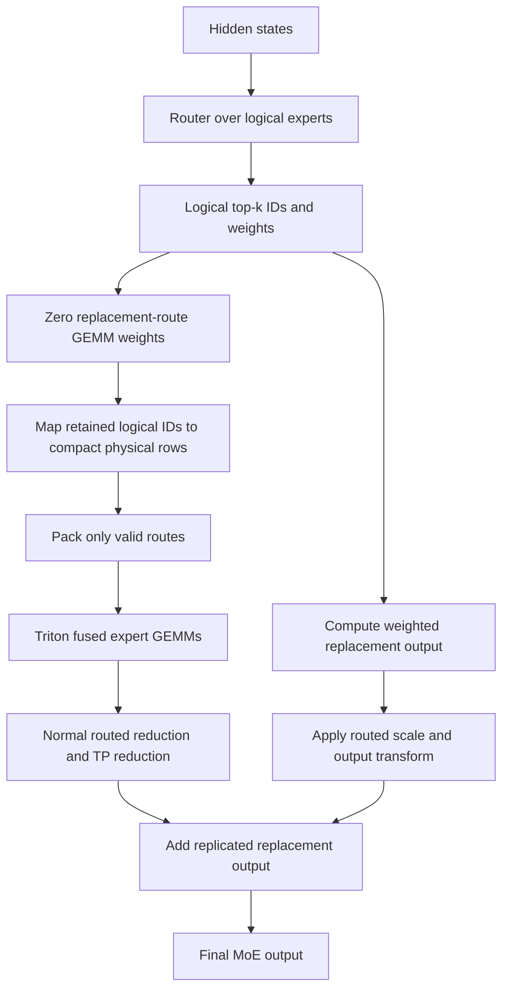

# MoNE Expert Replacement Design

## Overview

MoNE (Mixture of Novice Experts) replaces selected routed experts with learned
constant output vectors. A replaced, or novice, expert no longer needs its
gate, up, and down projection weights and does not need an expert GEMM at
inference time.

The implementation integrates this behavior into the shared fused MoE stack
instead of introducing a separate model or kernel path. Model adapters only
describe which logical experts are replacements and how checkpoint weights map
into the shared representation.

The design has four goals:

1. Preserve the checkpoint's routing semantics exactly.
2. Store retained expert weights in a compact physical layout.
3. Exclude replacement routes from GEMM scheduling.
4. Keep model-specific integration small and reuse the normal fused MoE stack.

The implementation is currently inference-only and supports constant expert
replacements.

## Mathematical model

For hidden state \(x\), a normal routed MoE layer produces

\[
y = \sum_{r=1}^{k} w_r E_{e_r}(x),
\]

where \(e_r\) and \(w_r\) are the expert ID and router weight for route \(r\).

For a replacement expert \(j\), the checkpoint stores a constant vector
\(v_j\), so

\[
E_j(x) = v_j.
\]

The output can therefore be split without changing its value:

\[
y =
\sum_{r:e_r \notin R} w_r E_{e_r}(x)
+
\sum_{r:e_r \in R} w_r v_{e_r},
\]

where \(R\) is the set of replacement expert IDs. The first sum is evaluated by
the normal fused expert kernel. The second sum is evaluated by a small
replacement-output kernel and added to the final routed output.

Router weights are not renormalized after this split. Replacement routes keep
their original weights in the constant-vector sum. After that contribution is
computed, their weights are zeroed before the routes enter the expert GEMM
path.

## Logical and physical experts

The router continues to operate over the checkpoint's full logical expert
space. Expert weights are allocated only for retained compute experts.

For example, given six logical experts with replacements 1 and 4:

```text
logical expert IDs:        [0, 1, 2, 3, 4, 5]
retained compute IDs:      [0,    2, 3,    5]
physical weight rows:      [0,    1, 2,    3]
logical_to_physical map:   [0, -1, 1, 2, -1, 3]
replacement_index map:     [-1, 0, -1, -1, 1, -1]
```

A negative `logical_to_physical` entry means that the logical route has no
expert weight row and must not be scheduled for GEMM. `replacement_index`
selects the corresponding constant vector.

This distinction appears in the fused MoE configuration as:

- `num_logical_experts`: router-visible expert count.
- `num_experts`: retained physical compute-expert count.
- `expert_map`: logical-to-physical row mapping.

The abstraction is implemented by
[`ExpertReplacement`](../../vllm/model_executor/layers/fused_moe/expert_replacement.py)
and its current implementation,
[`ConstantExpertReplacement`](../../vllm/model_executor/layers/fused_moe/expert_replacement.py).

## Checkpoint contract

### Recommended metadata

New checkpoints should use versioned `mone` metadata:

```json
{
  "mone": {
    "version": 1,
    "replacement_type": "constant",
    "experts_by_layer": {
      "1": [3, 7],
      "2": [0, 9]
    }
  }
}
```

The current metadata version is `1`, and the only supported replacement type is
`constant`.

### Legacy metadata

Existing checkpoints using `approximate_experts` remain supported. The value
may be either:

- A dictionary keyed by integer or string layer indices.
- A list whose position is the layer index.

For example:

```json
{
  "approximate_experts": {
    "1": [3, 7],
    "2": [0, 9]
  }
}
```

Legacy model types are registered through compatibility config classes:

- `deepseek_v2_compressed`
- `minimax_m2_compressed`
- `olmoe_compressed`

The preferred format is native model configuration plus versioned `mone`
metadata. The compatibility classes exist only to load older checkpoints.

### Replacement weights

For each replacement expert, the checkpoint supplies:

```text
<expert checkpoint prefix>.<logical expert ID>.approx_value
```

The tensor must contain one value per routed output dimension. Retained experts
continue to use their normal gate, up, and down projection tensors.

Replacement parameters are initialized with `NaN`. The model loader clears this
state before loading and validates it afterward. Loading fails if any expert
declared in the metadata does not provide an `approx_value` tensor.

## Initialization and weight loading

Each model adapter passes its configuration and layer index to
`make_mone_replacement`.

If the layer has no replacement metadata, the function returns `None` and the
normal MoE path is unchanged. Otherwise it:

1. Validates replacement IDs.
2. Computes the retained logical expert IDs.
3. Builds `logical_to_physical` and `replacement_index`.
4. Allocates only the compact retained expert weights.
5. Allocates one constant output vector per replacement expert.

The weight mapping enumerates retained logical experts in physical-row order.
For the earlier six-expert example, checkpoint expert 2 loads into physical row
1 rather than row 2. Replacement `approx_value` tensors load into the separate
constant-vector parameter.

Model load entry points call:

```text
clear_mone_load_state(model)
load checkpoint weights
validate_mone_weights_loaded(model)
```

This fail-closed behavior prevents an incomplete checkpoint from silently
serving with uninitialized replacement outputs.

## Forward path



The main steps are:

1. The normal router selects top-k logical expert IDs and weights.
2. `transform_routes` computes the weighted constant-vector contribution.
3. Replacement-route weights are zeroed for the GEMM path.
4. Logical IDs remain unchanged.
5. `expert_map` translates retained logical IDs to compact physical rows and
   maps replacements to `-1`.
6. Triton route alignment omits invalid routes instead of assigning them a
   dummy physical expert.
7. The retained expert GEMMs and normal routed reduction run as usual.
8. The replacement output is added after tensor-parallel reduction.

Keeping logical IDs until route packing is important. It lets the router,
grouped top-k logic, and checkpoint semantics remain independent of the
physical weight layout.

## Why invalid routes are removed

An earlier fallback mapped replacement routes to physical expert 0 and assigned
them zero weight. That is mathematically correct, but the routes still enter
alignment and GEMM scheduling. It can:

- Launch unnecessary GEMM work.
- Add padding to expert 0's route block.
- Change Triton packing and tuning behavior.
- Hide the intended memory and compute benefit.

The implemented path instead enables `skip_invalid_expert_routes`. Route
alignment looks up each logical ID in `expert_map` and completely omits entries
whose physical row is negative. The reduction path likewise ignores invalid
routes.

This is why the current implementation requires a backend that explicitly
supports invalid expert-map routes rather than relying on zero-weight dummy
GEMMs.

## Tensor-parallel behavior

Retained expert computations follow the model's normal tensor-parallel
behavior. Replacement values are replicated on every tensor-parallel rank.

The runner therefore adds the replacement contribution only after the regular
routed output has been tensor-parallel reduced. Adding it before reduction
would multiply the constant contribution by the tensor-parallel world size.

When a model applies a routed scaling factor to the output or uses a routed
output transform, the same operations are applied to the replacement output
before it is added.

## Shared fused MoE integration

The replacement abstraction is carried by the standard fused MoE components:

- `FusedMoE` accepts `num_logical_experts` and `expert_replacement`.
- `RoutedExperts` owns the replacement module and exposes its expert map.
- `MoERunner` transforms routes and recombines the replacement contribution.
- The Triton expert path skips invalid expert-map routes.
- Weight-mapping helpers compact retained expert weights.

Model-specific code does not implement replacement mathematics or kernels. A
model adapter is responsible only for:

1. Supplying the layer index and logical expert count.
2. Passing the replacement object to `FusedMoE`.
3. Mapping its checkpoint expert names.
4. Clearing and validating replacement weights around checkpoint loading.

## Integrated model families

### MiniMax M2

`MiniMaxM2MoE` constructs a replacement per layer using
`num_local_experts` as the logical expert count. Its existing router and weight
loader otherwise remain unchanged.

### DeepSeek V2/V3

`DeepseekV2MoE` uses `n_routed_experts` as the logical count and allocates only
retained physical experts. Its per-layer expert mapping handles compact expert
rows and replacement values.

The DeepSeek integration also covers architecture classes that inherit the
DeepSeek implementation.

### GLM-5/5.2

Upstream vLLM registers `GlmMoeDsaForCausalLM` in the `deepseek_v2` module:

```python
class GlmMoeDsaForCausalLM(DeepseekV2ForCausalLM):
    ...
```

Consequently, GLM-5/5.2 uses the same MoE construction, expert mapping, forward
path, and weight loading as DeepSeek. Native `glm_moe_dsa` configuration keeps
GLM-specific hyperparameters, while the shared DeepSeek implementation consumes
them.

No GLM-specific replacement kernel or execution path is needed.

### OLMoE

`OlmoeMoE` passes its configuration and layer index into the shared
replacement factory. The legacy `OlmoneForCausalLM` architecture name maps to
the normal `OlmoeForCausalLM` implementation.

## Current limitations

The implementation deliberately fails at initialization for combinations that
have not been made correct:

- Only constant replacements are supported.
- The Triton decomposed MoE backend is required.
- Monolithic MoE backends are unsupported.
- Expert parallelism is unsupported.
- Data parallelism for the replacement path is unsupported.
- Prefill-context parallelism is unsupported.
- EPLB and redundant experts are unsupported.
- MoE LoRA is unsupported.
- Applying router weights to expert inputs is unsupported.
- DeepSeek MoNE cannot use the ROCm AITER fused-shared-expert path.

Tensor parallelism is supported. Quantized retained-expert configurations still
depend on the selected Triton quantization method and should be validated per
quantization scheme.

When `--moe-backend auto` is used with an expert replacement, vLLM selects
Triton. Selecting another backend explicitly raises an error.

## Adding another model

A new model can reuse the implementation when its replaced expert output is a
weighted constant vector in the routed output space.

The minimal integration procedure is:

1. Pass the model config and layer index to `make_mone_replacement`.
2. Keep the router's full logical expert count.
3. Allocate `replacement.num_compute_experts` physical experts.
4. Pass both `num_logical_experts` and `expert_replacement` to `FusedMoE`.
5. Map retained checkpoint expert weights into compact physical rows.
6. Map replacement `approx_value` tensors into
   `expert_replacement.values`.
7. Clear and validate replacement load state around checkpoint loading.
8. Add a mapping test and an end-to-end fused MoE correctness test.
9. Run model-level quality evaluation against a trusted implementation.

If the model already inherits an integrated MoE implementation and uses a
compatible checkpoint layout, no additional runtime code may be necessary, as
with GLM-5/5.2.

## Correctness testing

The unit tests cover:

- Versioned and legacy metadata parsing.
- Logical-to-physical expert mapping.
- Constant-vector weight loading and missing-weight validation.
- Route transformation and exact side-output computation.
- Exclusion of invalid routes from Triton alignment and reduction.
- End-to-end equality between `FusedMoE` output and an explicitly constructed
  retained-expert-plus-replacement result.
- DeepSeek-style compact mapping for a 256-expert GLM layout.
- Native GLM configuration using the shared DeepSeek path.

Relevant tests are in:

- [`tests/kernels/moe/test_expert_replacement.py`](../../tests/kernels/moe/test_expert_replacement.py)
- [`tests/transformers_utils/test_mone_config.py`](../../tests/transformers_utils/test_mone_config.py)

Model-level validation has been performed on MiniMax M2, DeepSeek V2 Lite, and
GLM-5.2 MoNE checkpoints. Quality evaluation should remain part of validation
for every new model family or checkpoint conversion.

## Main implementation files

- [`expert_replacement.py`](../../vllm/model_executor/layers/fused_moe/expert_replacement.py):
  metadata, compact maps, constant-vector kernels, and weight mapping.
- [`layer.py`](../../vllm/model_executor/layers/fused_moe/layer.py):
  construction, validation, and backend selection.
- [`routed_experts.py`](../../vllm/model_executor/layers/fused_moe/routed_experts.py):
  replacement ownership, expert map, and loading integration.
- [`moe_runner.py`](../../vllm/model_executor/layers/fused_moe/runner/moe_runner.py):
  route transformation and output recombination.
- [`triton_moe.py`](../../vllm/model_executor/layers/fused_moe/experts/triton_moe.py):
  invalid-route-aware Triton dispatch.
- [`deepseek_v2.py`](../../vllm/model_executor/models/deepseek_v2.py):
  DeepSeek and GLM family integration.
- [`minimax_m2.py`](../../vllm/model_executor/models/minimax_m2.py):
  MiniMax M2 integration.
- [`olmoe.py`](../../vllm/model_executor/models/olmoe.py):
  OLMoE integration.
