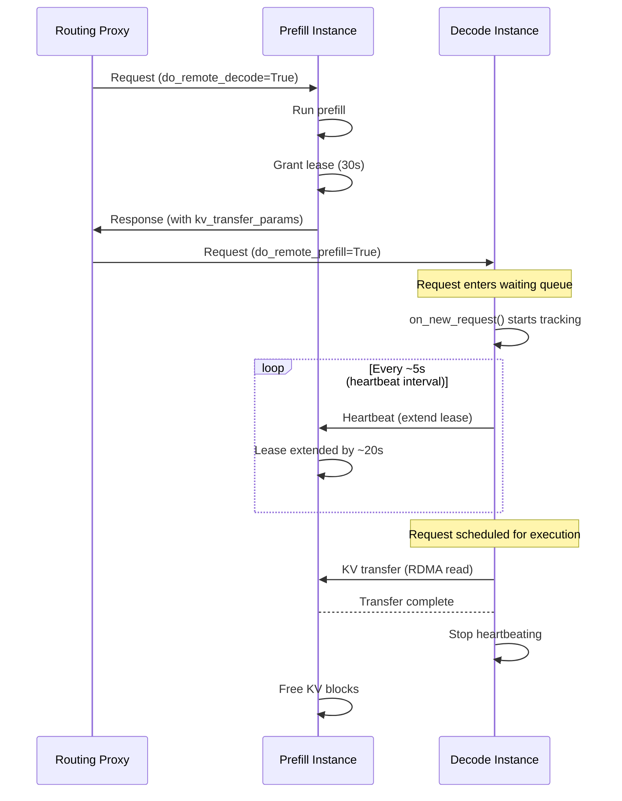
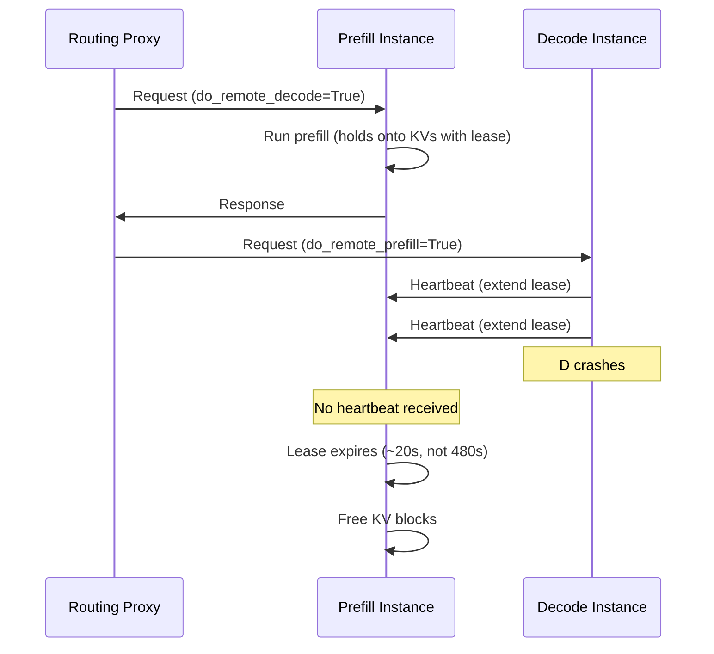

# NIXL KV Cache Lease Renewal

In disaggregated prefill/decode deployments, the Prefill instance (P) must hold KV cache blocks in GPU memory after completing a prefill, waiting for the Decode instance (D) to read them via RDMA. A mechanism is needed to determine when those blocks can safely be freed when D isn't able to retrieve them. This mechanism was introduced in [PR #41383](https://github.com/vllm-project/vllm/pull/41383).

## Motivation

### The single-timeout problem

The original design used a single, large timeout (`VLLM_NIXL_ABORT_REQUEST_TIMEOUT`, default 480s) to control how long P retains KV blocks. When D crashed or disconnected, P would hold onto potentially several GBs of "dead" blocks for up to 8 minutes before reclaiming them. During this window, subsequent requests hitting P would find reduced cache capacity and experience degraded performance.

### The overloading problem

Simply lowering the timeout introduces a different failure mode. Under traffic surges, requests can sit in D's waiting queue for a long time before being scheduled. If the fixed timeout on P is too short, blocks get freed before D ever has a chance to read them --- causing unnecessary recomputation and wasted prefill work.

### Solution: lease renewal via heartbeats

The lease renewal mechanism addresses both problems simultaneously. P grants a **short initial lease** (default 30s) when prefill completes. While a request is **queued or in-flight** on D, D **periodically sends heartbeats** to P extending the lease. If D crashes and stops heartbeating, P reclaims blocks within seconds of the last heartbeat rather than waiting minutes. If D is merely overloaded, the heartbeats keep the blocks alive for as long as needed.

## How It Works

### Lease lifecycle

When P finishes a prefill, it pins the KV blocks with an initial lease duration (`kv_lease_duration`, default 30s). From that point, the blocks are held until either:

1. **D completes the KV transfer** --- P receives a read-completion notification and frees the blocks immediately.
2. **D keeps heartbeating** --- each heartbeat extends the lease by `lease_duration * 2/3` (~20s), keeping blocks alive indefinitely while D is healthy.
3. **No heartbeat arrives** --- the lease expires and P reclaims the blocks.

### Piggybacking on NIXL notifications

Rather than introducing a new transport channel, heartbeats reuse NIXL's existing notification system (`send_notif` / `get_new_notifs`). The notification medium is backend-specific, with automatic fallback from IB/RoCE to TCP already handled by NIXL. Each single heartbeat message sent from D to a particular P renews all requests pinned in P on behalf of that D --- in other words, a single batched message per iteration renews the lease of multiple requests.

### Scheduler-side tracking (D)

A critical insight is that heartbeating must start **as soon as a request enters D's scheduler** --- not when it gets scheduled for execution. Under heavy load, a request may sit in the waiting queue for much longer than the initial lease duration, and the gap between arrival and scheduling is unbounded.

To achieve this, D's connector (`NixlConnectorScheduler`) hooks into the scheduler via `on_new_request()`. When a request with `do_remote_prefill=True` arrives, the connector immediately starts tracking it for heartbeats. Requests are grouped by `remote_engine_id` for efficient batching. On each scheduler step, heartbeat metadata is packaged into `NixlConnectorMetadata` and sent to the worker, throttled by a heartbeat interval of `lease_duration // 6` (~5s).

Tracking stops when either the KV transfer completes (via `update_connector_output`) or the request finishes/aborts (via `request_finished`).

### Timing and simplicity

Heartbeat sending and processing happen **in the forward loop**, not in a background thread. This means timing is not millisecond-precise --- a long model forward pass will delay heartbeats. However, the lease durations are configured with sufficient margin: with default settings, the heartbeat interval (~5s) and lease extension (~20s) are at least an order of magnitude larger than a typical forward pass. This avoids lock complexity between threads while keeping the design simple and extensible.

## Happy Path



## Decode Instance Crash



### Worker-side sending and receiving

**On D (sending):** During `start_load_kv()` (called every forward pass), the worker reads `metadata.heartbeat_by_engine` and sends batched heartbeat notifications to each remote P engine. If D hasn't yet handshaked with P for a given engine (common for requests still in the waiting queue), it triggers a **proactive handshake** in a background thread.
The heartbeat is deferred to the next step once the handshake completes --- the early handshake also **speeds up the eventual KV transfer.**

**On P (receiving):** In `_get_new_notifs()`, P's worker checks incoming NIXL notifications. Messages starting with `"HB:"` are routed to `_handle_heartbeat()`, which extends the lease expiry for each referenced request using `max(old_expiry, now + lease_extension)`. This ensures leases are never accidentally shortened.

## Bidirectional KV Transfer

For multi-turn conversations, [bidirectional KV transfer](../features/disagg_prefill.md) allows D to cache KV blocks that P can pull from on subsequent turns. Since the timing of the next conversational turn is **client-dependent** (not controlled by the system), the heartbeat-based lease mechanism does not apply here. Instead, a separate `decoder_kv_blocks_ttl` (default 480s) provides a simple fixed timeout for blocks cached on D. If the client takes too long to continue the conversation, the blocks expire and P recomputes. Future work may extend a symmetric heartbeat mechanism to this case.

## Key Design Decisions

- **Per-request leasing, not per-instance.** P has no notion of which D its KV blocks belong to --- block ownership is only resolved after prefill completes and the router selects a D. Leasing at the request level avoids coupling P/D selection in the load balancer. In practice, D batches lease extensions toward the same P by grouping requests with the same `remote_engine_id`.

- **NIXL notifications as transport.** Heartbeats reuse the existing `send_notif`/`get_new_notifs` system rather than adding ZMQ connections or API changes. The notification medium is backend-specific with IB/RoCE-to-TCP fallback already handled, making heartbeats work across any NIXL-supported transport.

- **No background thread.** Heartbeat sending and processing happen in the forward loop (`start_load_kv` / `get_finished`). This avoids lock complexity between threads. Lease durations provide sufficient margin over forward-pass latency (seconds vs. milliseconds).

- **Proactive handshake.** When D needs to heartbeat a P engine it hasn't connected to yet (common for requests still in the waiting queue), it triggers an early handshake in a background thread. This also speeds up the eventual KV transfer.

- **Heterogeneous TP support.** When P TP > D TP (e.g., P TP=4, D TP=2), a single D worker pulls from multiple P workers. Heartbeats must be sent to all P workers for a given engine. Conversely, when D TP > P TP, a single P receives notifications from multiple Ds, which simply refreshes the TTL multiple times with no downside.

## Configuration

The lease mechanism is controlled through `kv_connector_extra_config` in `--kv-transfer-config`:

| Parameter               | Default | Description                                                                                                                                                   |
|-------------------------|---------|---------------------------------------------------------------------------------------------------------------------------------------------------------------|
| `kv_lease_duration`     | 30s     | Initial lease duration on P. Heartbeat interval and extension amount are derived automatically (`interval = duration // 6`, `extension = duration * 2 // 3`). |
| `decoder_kv_blocks_ttl` | 480s    | TTL for KV blocks cached on D in bidirectional transfer mode. Simple fixed timeout, not renewed via heartbeats.                                               |

```bash
vllm serve <MODEL> \
  --kv-transfer-config '{
    "kv_connector": "NixlConnector",
    "kv_role": "kv_both",
    "kv_connector_extra_config": {"kv_lease_duration": 60}
  }'
```

For full NixlConnector configuration details, see the [NixlConnector Usage Guide](../features/nixl_connector_usage.md).
