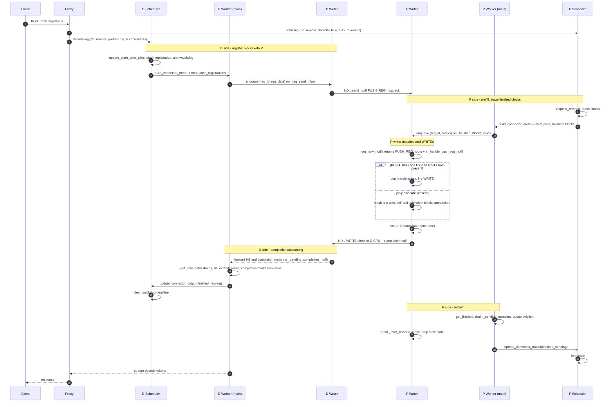

# NIXL push-mode KV transfer

The default NIXL connector is **pull-based**: the decode (D) instance
reads KV blocks from the prefill (P) instance via `NIXL READ` after
prefill completes. `NixlPushConnector` adds a **push-based** alternative
in which P writes the KV blocks directly into D's pre-allocated memory
via `NIXL WRITE`.

This document describes the threading, queues, and scheduling
interactions specific to the push design. The pull-mode design is
unchanged; the push connector reuses the same handshake, NIXL agent
setup, and metadata path wherever possible.

## High-level flow



## Threads

``NixlPushConnectorWorker`` introduces a single dedicated background
thread per worker (i.e. per TP rank), named ``nixl-push-writer``.
Each owns the new push-specific NIXL operations on its rank:

* ``nixl_wrapper.get_new_notifs()`` — receive notifications.
* ``nixl_wrapper.send_notif(...)`` for the ``PUSH_REG:<msgpack>`` (D
  side) and for the per-WRITE completion notif (P side).
* ``nixl_wrapper.make_prepped_xfer(...) / transfer(...)`` — submit the
  WRITE itself.

Heartbeats continue to go out from the engine main thread via the
existing base-worker ``_send_heartbeats`` plumbing inside
``start_load_kv``.

### Wake model

The writer thread blocks on ``_push_writer_wake`` (a
``threading.Event``) when it has no work. Three callers set the
event:

1. **``start_load_kv``** (worker main thread, called once per engine
   step with the scheduler's metadata) — sets the wake only when the
   step actually hands the writer new work, i.e. when
   ``meta.push_registrations`` or ``meta.push_finished_blocks`` is
   non-empty. This is the wake for new transfers.
2. **``get_finished``** (worker main thread, called once per engine
   step to report completions) — always sets the wake. The writer is
   the sole consumer of ``nixl_wrapper.get_new_notifs()`` for push,
   so this gives it a chance to drain inbound notifs (heartbeats from
   D, completion notifs after a WRITE, late-arriving ``PUSH_REG``)
   even when there is no new metadata to act on.
3. **Handshake-completion callback** (background handshake executor
   thread) — when a deferred D→P handshake finishes successfully, the
   future's done-callback re-enqueues the registration onto
   ``_reg_send_inbox`` and sets the wake so the corresponding
   ``send_notif`` runs on the writer (we never call ``send_notif`` from
   the executor thread). On this second pass ``_ensure_handshake``
   returns ``None`` (the agent is now connected), so the writer sends
   the ``PUSH_REG`` directly. If the handshake *failed*, the callback
   fails the request instead of re-enqueuing, so there is no retry
   loop.

In addition to event-driven wakes, the writer self-polls at
``_PUSH_WRITER_POLL_INTERVAL_MS = 1.0`` ms while there are P-side
finished blocks waiting for an unmatched ``PUSH_REG``.

When a request completes on P (lease expires or the WRITE finishes),
``get_finished`` enqueues the request id onto ``_evict_finished_inbox``,
which the writer drains to drop stale ``_push_finished_blocks`` /
``_pending_d_registrations`` and stop self-polling.

## Writer-local matching tables

| Table                          | Owner            | Holds                                                                  |
|--------------------------------|------------------|------------------------------------------------------------------------|
| `_pending_d_registrations`     | writer           | D registrations received from a remote D, waiting for P's blocks       |
| `_push_finished_blocks`        | writer           | P blocks staged by the scheduler, waiting for a remote D registration  |

Either side can arrive first. The writer matches in both directions:
when a ``PUSH_REG`` arrives we look up ``_push_finished_blocks``, and
when finished blocks arrive we look up ``_pending_d_registrations``.
Both lookups try an exact ``request_id`` match first, then fall back
to comparing the ids after stripping the trailing per-engine random
suffix (via ``get_base_request_id``). The fallback exists because the
proxy hands the same ``X-Request-Id`` to both legs, so P and D wrap it
into the same ``cmpl-<uuid>-<index>`` form and differ only by the
8-hex randomization suffix that ``input_processor.assign_request_id``
appends per engine. Stripping just that suffix normalizes both sides
to the same id while preserving the completion index (so multi-prompt
sub-requests stay distinct). It also works whether or not
``VLLM_DISABLE_REQUEST_ID_RANDOMIZATION`` is set, which matters since
that env var is slated for removal upstream.

## Wire format

A push registration is sent as a NIXL notification:

```text
PUSH_REG:<msgpack-encoded dict>
```

Fields in the dict:

| Field                | Set by | Meaning                                                                |
|----------------------|--------|------------------------------------------------------------------------|
| ``request_id``       | D      | D's own vLLM request id; P's match key, echoed in the completion notif |
| ``decode_engine_id`` | D      | D's engine id (P uses this for the reverse handshake)                  |
| ``decode_host``      | D      | D's NIXL side-channel host                                             |
| ``decode_port``      | D      | D's NIXL side-channel port                                             |
| ``decode_tp_size``   | D      | D's tensor-parallel size                                               |
| ``local_block_ids``  | D      | per-group lists of D's *logical* block ids (preallocated)              |
| ``remote_engine_id`` | D      | P's engine id (for the existing P-side handshake)                      |
| ``remote_host``      | D      | P's NIXL side-channel host                                             |
| ``remote_port``      | D      | P's NIXL side-channel port                                             |
| ``remote_tp_size``   | D      | P's tensor-parallel size                                               |

D ships **logical** block ids; P expands them to physical block ids at
WRITE-submission time using the ratio learned during the NIXL
handshake (`remote_physical_blocks_per_logical`). This matches the
pull-mode contract — schedulers ship logical ids, workers expand to
physical at submission.

The completion notif sent from P to D after a WRITE is the existing
`<request_id>:<tp_size>` format used in pull mode (here ``request_id``
is D's own request id, taken from the registration), so the D-side
accounting code is unchanged.

## Scheduler-side responsibilities

`NixlPushConnectorScheduler` extends the base scheduler with:

* **D side** — `update_state_after_alloc` stashes registration data in
  `_push_pending_registrations` and arms a soft watchdog
  (`_push_registration_deadlines`). `build_connector_meta` drains the
  stash into `meta.push_registrations` and any expired entries are
  dropped with a warning.
* **P side** — `request_finished` stashes block IDs in
  `_finished_request_blocks` (for the lease and for
  `has_pending_push_work`) and `_newly_finished_push_blocks` (for the
  next worker step via `meta.push_finished_blocks`).
* **Both sides** — `has_pending_push_work` keeps the engine main loop
  stepping while there is in-flight push state, so the writer always
  gets at least one wake per step.

`update_connector_output`:

* `finished_sending` (P side) clears the lease entry.
* `finished_recving` (D side) clears the watchdog deadline.

## Timeouts and watchdogs

Two per-request timers are armed on the scheduler:

* **D-side registration watchdog** — ``_push_registration_deadlines``.
  If a registered request does not see a push completion within
  ``push_registration_timeout`` seconds (defaults to
  ``decoder_kv_blocks_ttl``), ``build_connector_meta`` drops the stale
  registration and the pending entry, logs a warning, and stops trying
  to resend the registration. The corresponding request remains tracked
  in ``_reqs_need_recv``; it is the engine's request-level abort path
  (or the user / proxy timing out the HTTP call) that ultimately fails
  the request.
* **P-side block lease** — same ``_kv_lease_duration`` used by pull
  mode. ``request_finished`` sets the expiration in ``_reqs_need_send``
  and ``update_connector_output(finished_sending=...)`` clears it on
  successful WRITE. Stale leases are reaped by ``get_finished`` in the
  base worker, which then enqueues the eviction onto
  ``_evict_finished_inbox`` so the writer also stops self-polling.

## Failure handling

* **D-side handshake failure (P→D handshake before sending PUSH_REG)** —
  the future's done-callback calls ``_handle_failed_transfer(rid, None)``,
  which marks D's pre-allocated blocks invalid and enqueues onto
  ``_failed_recv_reqs`` so the next ``get_finished`` reports the
  request as a failed recv. Same recv-side accounting as pull mode.
* **D-side ``send_notif`` failure when shipping the PUSH_REG to P** —
  identical handling: ``_handle_failed_transfer`` marks the recv as
  failed.
* **P-side WRITE submission failure** — the WRITE handle (if any) is
  released and ``xfer_stats.record_failed_transfer()`` bumps the
  failure counter. We deliberately do not call
  ``_handle_failed_transfer`` here: ``req_id`` on the P side has no
  entry in ``_recving_metadata`` (P is not the receiver), so the
  helper would put a P-local request id into ``_failed_recv_reqs``
  and trip the assertion in the base worker's ``get_finished``. The
  outbound WRITE is dropped on the floor; D's lease watchdog handles
  the missing completion.

## Summary

The push design is a small, well-contained extension on top of the
existing NIXL connector:

* one new connector class, one new scheduler class, one new worker
  class — all subclasses of the existing base classes;
* one dedicated background thread per worker;
* a few cross-thread queues, each with a single consumer (the writer);
  most have one producer, except ``_reg_send_inbox``, which is fed both
  by the engine main thread (new registrations) and by the
  handshake-completion callback (registrations replayed after their
  D→P handshake finishes);
* one new notification type (`PUSH_REG:<msgpack>`).

Behavior on the engine main thread is otherwise unchanged. The writer
thread is event-driven and idle when there is no push work.
