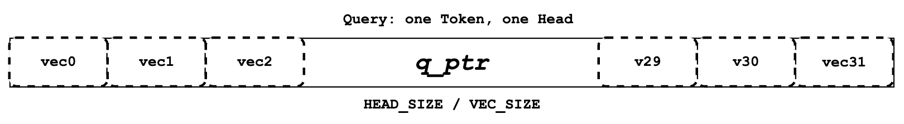
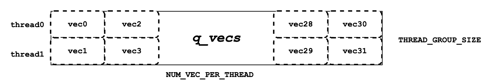
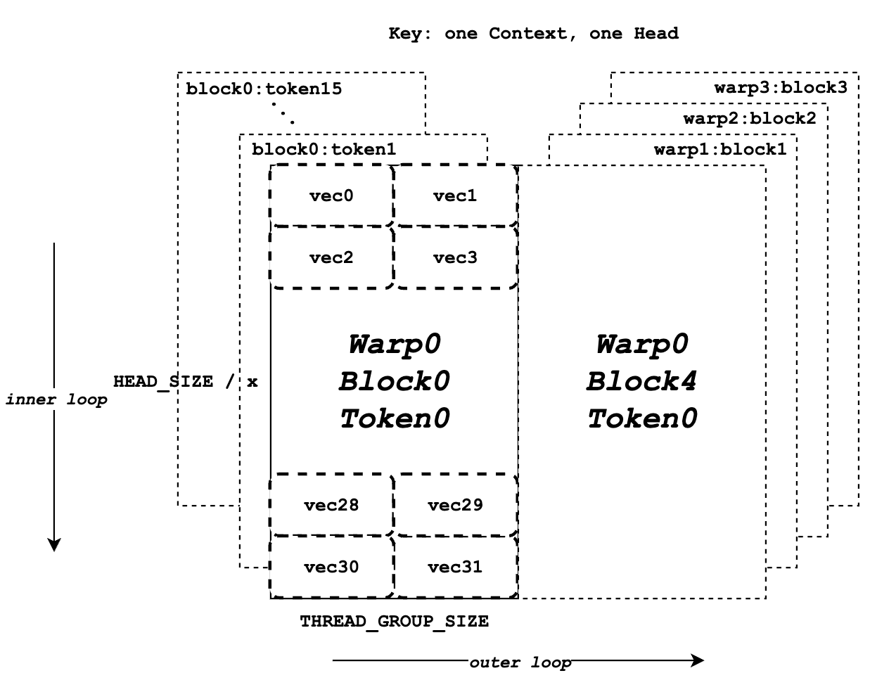
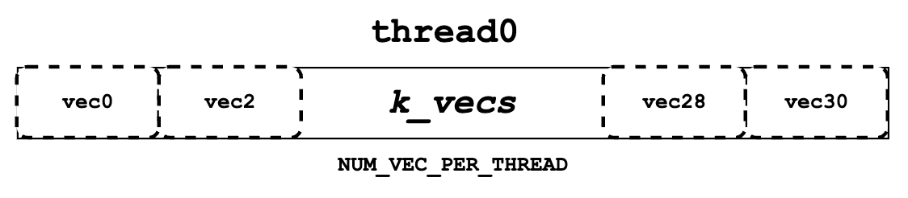
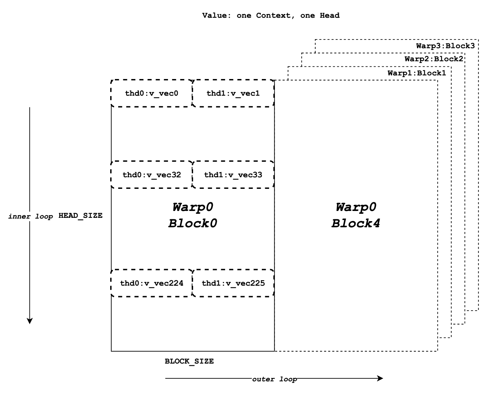
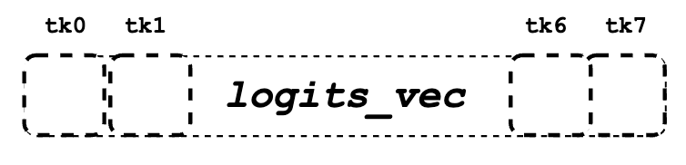
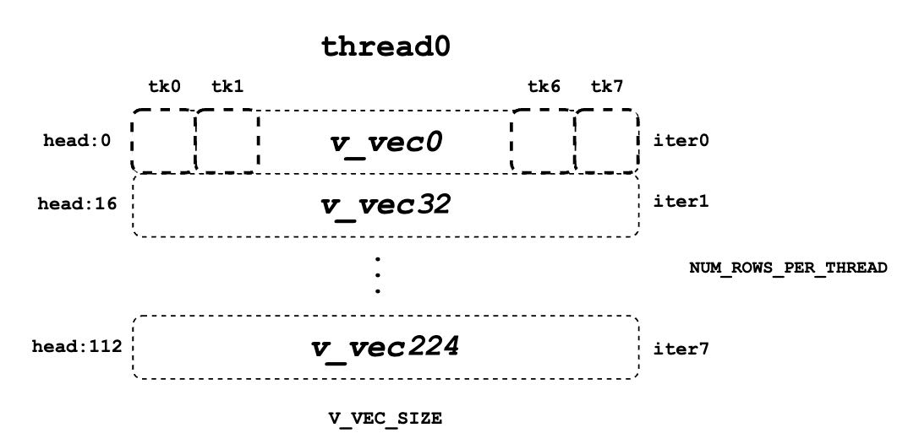

# Paged Attention

!!! warning
    This is a historical document based on the [original paper for vLLM](https://arxiv.org/abs/2309.06180).
    It no longer describes the code used in vLLM today.

Currently, vLLM utilizes its own implementation of a multi-head query
attention kernel (`csrc/attention/attention_kernels.cu`).
This kernel is designed to be compatible with
vLLM's paged KV caches, where the key and value cache are stored in
separate blocks (note that this block concept differs from the GPU
thread block. So in a later document, I will refer to vLLM paged
attention block as "block", while refer to GPU thread block as
"thread block").

To achieve high performance, this kernel relies on a specially
designed memory layout and access method, specifically when threads
read data from global memory to shared memory. The purpose of this
document is to provide a high-level explanation of the kernel
implementation step by step, aiding those who wish to learn about the
vLLM multi-head query attention kernel. After going through this
document, users will likely have a better understanding and feel easier
to follow the actual implementation.

Please note that this document may not cover all details, such as how
to calculate the correct index for the corresponding data or the dot
multiplication implementation. However, after reading this document
and becoming familiar with the high-level logic flow, it should be
easier for you to read the actual code and understand the details.

## Inputs

The kernel function takes a list of arguments for the current thread
to perform its assigned work. The three most important arguments are
the input pointers `q`, `k_cache`, and `v_cache`, which point
to query, key, and value data on global memory that need to be read
and processed. The output pointer `out` points to global memory
where the result should be written. These four pointers actually
refer to multidimensional arrays, but each thread only accesses the
portion of data assigned to it. I have omitted all other runtime
parameters here for simplicity.

```cpp
template<typename scalar_t, int HEAD_SIZE, int BLOCK_SIZE, int NUM_THREADS, int PARTITION_SIZE = 0>
__device__ void paged_attention_kernel(
    ... // Other side args.
    const scalar_t* __restrict__ out,       // [num_seqs, num_heads, max_num_partitions, head_size]
    const scalar_t* __restrict__ q,         // [num_seqs, num_heads, head_size]
    const scalar_t* __restrict__ k_cache,   // [num_blocks, num_kv_heads, head_size/x, block_size, x]
    const scalar_t* __restrict__ v_cache,   // [num_blocks, num_kv_heads, head_size, block_size]
    ... // Other side args.
)
```

There are also a list of template arguments above the function
signature that are determined during compilation time. `scalar_t`
represents the data type of the query, key, and value data elements,
such as FP16. `HEAD_SIZE` indicates the number of elements in each
head. `BLOCK_SIZE` refers to the number of tokens in each block.
`NUM_THREADS` denotes the number of threads in each thread block.
`PARTITION_SIZE` represents the number of tensor parallel GPUs (For
simplicity, we assume this is 0 and tensor parallel is disabled).

With these arguments, we need to perform a sequence of preparations.
This includes calculating the current head index, block index, and
other necessary variables. However, for now, we can ignore these
preparations and proceed directly to the actual calculations. It will
be easier to understand them once we grasp the entire flow.

## Concepts

Just before we dive into the calculation flow, I want to describe a
few concepts that are needed for later sections. However, you may
skip this section and return later if you encounter any confusing
terminologies.

- **Sequence**: A sequence represents a client request. For example,
  the data pointed to by `q` has a shape of
  `[num_seqs, num_heads, head_size]`. That represents there are total
  `num_seqs` of query sequence data are pointed by `q`. Since this
  kernel is a single query attention kernel, each sequence only has one
  query token. Hence, the `num_seqs` equals the total number of tokens
  that are processed in the batch.
- **Context**: The context consists of the generated tokens from the
  sequence. For instance, `["What", "is", "your"]` are the context
  tokens, and the input query token is `"name"`. The model might
  generate the token `"?"`.
- **Vec**: The vec is a list of elements that are fetched and
  calculated together. For query and key data, the vec size
  (`VEC_SIZE`) is determined so that each thread group can fetch and
  calculate 16 bytes of data at a time. For value data, the vec size
  (`V_VEC_SIZE`) is determined so that each thread can fetch and
  calculate 16 bytes of data at a time. For example, if the
  `scalar_t` is FP16 (2 bytes) and `THREAD_GROUP_SIZE` is 2, the
  `VEC_SIZE` will be 4, while the `V_VEC_SIZE` will be 8.
- **Thread group**: The thread group is a small group of
  threads(`THREAD_GROUP_SIZE`) that fetches and calculates one
  query token and one key token at a time. Each thread handles only a
  portion of the token data. The total number of elements processed by
  one thread group is referred as `x`. For example, if the thread
  group contains 2 threads and the head size is 8, then thread 0
  handles the query and key elements at index 0, 2, 4, 6, while thread
  1 handles the elements at index 1, 3, 5, 7.
- **Block**: The key and value cache data in vLLM are split into
  blocks. Each block stores data for a fixed number(`BLOCK_SIZE`)
  of tokens at one head. Each block may contain only a portion of the
  whole context tokens. For example, if the block size is 16 and the
  head size is 128, then for one head, one block can store 16 * 128 =
  2048 elements.
- **Warp**: A warp is a group of 32 threads(`WARP_SIZE`) that
  execute simultaneously on a stream multiprocessor (SM). In this
  kernel, each warp processes the calculation between one query token
  and key tokens of one entire block at a time (it may process multiple
  blocks in multiple iterations). For example, if there are 4 warps and
  6 blocks for one context, the assignment would be like warp 0 handles
  the 0th, 4th blocks, warp 1 handles the 1st, 5th blocks, warp 2
  handles the 2nd block and warp 3 handles the 3rd block.
- **Thread block**: A thread block is a group of
  threads(`NUM_THREADS`) that can access the same shared memory.
  Each thread block contains multiple warps(`NUM_WARPS`), and in
  this kernel, each thread block processes the calculation between one
  query token and key tokens of a whole context.
- **Grid**: A grid is a collection of thread blocks and defines the
  shape of the collection. In this kernel, the shape is
  `(num_heads, num_seqs, max_num_partitions)`. Therefore, each thread
  block only handles the calculation for one head, one sequence, and
  one partition.

## Query

This section will introduce how query data is stored in memory and
fetched by each thread. As mentioned above, each thread group fetches
one query token data, while each thread itself only handles a part of
one query token data. Within each warp, every thread group will fetch
the same query token data, but will multiply it with different key
token data.

```cpp
const scalar_t* q_ptr = q + seq_idx * q_stride + head_idx * HEAD_SIZE;
```



Each thread defines its own `q_ptr` which points to the assigned
query token data on global memory. For example, if `VEC_SIZE` is 4
and `HEAD_SIZE` is 128, the `q_ptr` points to data that contains
total of 128 elements divided into 128 / 4 = 32 vecs.



```cpp
__shared__ Q_vec q_vecs[THREAD_GROUP_SIZE][NUM_VECS_PER_THREAD];
```

Next, we need to read the global memory data pointed to by `q_ptr`
into shared memory as `q_vecs`. It is important to note that each
vecs is assigned to a different row. For example, if the
`THREAD_GROUP_SIZE` is 2, thread 0 will handle the 0th row vecs,
while thread 1 handles the 1st row vecs. By reading the query data in
this way, neighboring threads like thread 0 and thread 1 can read
neighbor memory, achieving the memory coalescing to improve
performance.

## Key

Similar to the "Query" section, this section introduces memory layout
and assignment for keys. While each thread group only handle one
query token one kernel run, it may handle multiple key tokens across
multiple iterations. Meanwhile, each warp will process multiple blocks
of key tokens in multiple iterations, ensuring that all context
tokens are processed by the entire thread group after the kernel run.
In this context, "handle" refers to performing the dot multiplication
between query data and key data.

```cpp
const scalar_t* k_ptr = k_cache + physical_block_number * kv_block_stride
                    + kv_head_idx * kv_head_stride
                    + physical_block_offset * x;
```

Unlike to `q_ptr`, `k_ptr` in each thread will point to different
key token at different iterations. As shown above, that `k_ptr`
points to key token data based on `k_cache` at assigned block,
assigned head and assigned token.



The diagram above illustrates the memory layout for key data. It
assumes that the `BLOCK_SIZE` is 16, `HEAD_SIZE` is 128, `x` is
8, `THREAD_GROUP_SIZE` is 2, and there are a total of 4 warps. Each
rectangle represents all the elements for one key token at one head,
which will be processed by one thread group. The left half shows the
total 16 blocks of key token data for warp 0, while the right half
represents the remaining key token data for other warps or
iterations. Inside each rectangle, there are a total 32 vecs (128
elements for one token) that will be processed by 2 threads (one
thread group) separately.



```cpp
K_vec k_vecs[NUM_VECS_PER_THREAD]
```

Next, we need to read the key token data from `k_ptr` and store
them on register memory as `k_vecs`. We use register memory for
`k_vecs` because it will only be accessed by one thread once,
whereas `q_vecs` will be accessed by multiple threads multiple
times. Each `k_vecs` will contain multiple vectors for later
calculation. Each vec will be set at each inner iteration. The
assignment of vecs allows neighboring threads in a warp to read
neighboring memory together, which again promotes the memory
coalescing. For instance, thread 0 will read vec 0, while thread 1
will read vec 1. In the next inner loop, thread 0 will read vec 2,
while thread 1 will read vec 3, and so on.

You may still be a little confused about the overall flow. Don't
worry, please keep reading the next "QK" section. It will illustrate
the query and key calculation flow in a clearer and higher-level
manner.

## QK

As shown the pseudocode below, before the entire for loop block, we
fetch the query data for one token and store it in `q_vecs`. Then,
in the outer for loop, we iterate through different `k_ptrs` that
point to different tokens and prepare the `k_vecs` in the inner for
loop. Finally, we perform the dot multiplication between the
`q_vecs` and each `k_vecs`.

```cpp
q_vecs = ...
for ... {
    k_ptr = ...
    for ... {
        k_vecs[i] = ...
    }
    ...
    float qk = scale * Qk_dot<scalar_t, THREAD_GROUP_SIZE>::dot(q_vecs[thread_group_offset], k_vecs);
}
```

As mentioned before, for each thread, it only fetches part of the
query and key token data at a time. However, there will be a cross
thread group reduction happen in the `Qk_dot<>::dot` . So `qk`
returned here is not just between part of the query and key token dot
multiplication, but actually a full result between entire query and
key token data.

For example, if the value of `HEAD_SIZE` is 128 and
`THREAD_GROUP_SIZE` is 2, each thread's `k_vecs` will contain
total 64 elements. However, the returned `qk` is actually the
result of dot multiplication between 128 query elements and 128 key
elements. If you want to learn more about the details of the dot
multiplication and reduction, you may refer to the implementation of
`Qk_dot<>::dot`. However, for the sake of simplicity, I will not
cover it in this document.

## Softmax

Next, we need to calculate the normalized softmax for all `qk`s,
as shown above, where each $x$ represents a `qk`. To do this,
we must obtain the reduced value of `qk_max`($m(x)$) and
the `exp_sum`($\ell(x)$) of all `qk`s. The reduction
should be performed across the entire thread block, encompassing
results between the query token and all context key tokens.

$$
\begin{gather*}
m(x):=\max _i \quad x_i \\ \quad f(x):=\left[\begin{array}{lll}e^{x_1-m(x)} & \ldots & e^{x_B-m(x)}\end{array}\right]\\ \quad \ell(x):=\sum_i f(x)_i \\
\quad \operatorname{softmax}(x):=\frac{f(x)}{\ell(x)}
\end{gather*}
$$

### `qk_max` and `logits`

Just right after we get the `qk` result, we can set the temporary
`logits` result with `qk` (In the end, the `logits` should
store the normalized softmax result). Also we can compare and collect
the `qk_max` for all `qk`s that are calculated by current
thread group.

```cpp
if (thread_group_offset == 0) {
    const bool mask = token_idx >= context_len;
    logits[token_idx - start_token_idx] = mask ? 0.f : qk;
    qk_max = mask ? qk_max : fmaxf(qk_max, qk);
}
```

Please note that the `logits` here is on shared memory, so each
thread group will set the fields for its own assigned context tokens.
Overall, the size of logits should be number of context tokens.

```cpp
for (int mask = WARP_SIZE / 2; mask >= THREAD_GROUP_SIZE; mask /= 2) {
    qk_max = fmaxf(qk_max, VLLM_SHFL_XOR_SYNC(qk_max, mask));
}

if (lane == 0) {
    red_smem[warp_idx] = qk_max;
}
```

Then we need to get the reduced `qk_max` across each warp. The main
idea is to make threads in warp to communicate with each other and
get the final max `qk` .

```cpp
for (int mask = NUM_WARPS / 2; mask >= 1; mask /= 2) {
    qk_max = fmaxf(qk_max, VLLM_SHFL_XOR_SYNC(qk_max, mask));
}
qk_max = VLLM_SHFL_SYNC(qk_max, 0);
```

Finally, we can get the reduced `qk_max` from whole thread block by
compare the `qk_max` from all warps in this thread block. Then we
need to broadcast the final result to each thread.

### `exp_sum`

Similar to `qk_max`, we need to get the reduced sum value from the
entire thread block too.

```cpp
for (int i = thread_idx; i < num_tokens; i += NUM_THREADS) {
    float val = __expf(logits[i] - qk_max);
    logits[i] = val;
    exp_sum += val;
}
...
exp_sum = block_sum<NUM_WARPS>(&red_smem[NUM_WARPS], exp_sum);
```

Firstly, sum all exp values from each thread group, and meanwhile,
convert each entry of `logits` from `qk` to `exp(qk - qk_max)`.
Please note, the `qk_max` here is already the max `qk` across the
whole thread block. And then we can do reduction for `exp_sum`
across whole thread block just like the `qk_max`.

```cpp
const float inv_sum = __fdividef(1.f, exp_sum + 1e-6f);
for (int i = thread_idx; i < num_tokens; i += NUM_THREADS) {
    logits[i] *= inv_sum;
}
```

Finally, with the reduced `qk_max` and `exp_sum`, we can obtain
the final normalized softmax result as `logits`. This `logits`
variable will be used for dot multiplication with the value data in
later steps. Now, it should store the normalized softmax result of
`qk` for all assigned context tokens.

## Value







Now we need to retrieve the value data and perform dot multiplication
with `logits`. Unlike query and key, there is no thread group
concept for value data. As shown in diagram, different from key token
memory layout, elements from the same column correspond to the same
value token. For one block of value data, there are `HEAD_SIZE` of
rows and `BLOCK_SIZE` of columns that are split into multiple
`v_vecs`.

Each thread always fetches `V_VEC_SIZE` elements from the same
`V_VEC_SIZE` of tokens at a time. As a result, a single thread
retrieves multiple `v_vec`s from different rows and the same
columns through multiple inner iterations. For each `v_vec`, it
needs to be dot multiplied with the corresponding `logits_vec`,
which is also `V_VEC_SIZE` elements from `logits`. Overall, with
multiple inner iterations, each warp will process one block of value
tokens. And with multiple outer iterations, the whole context value
tokens are processed

```cpp
float accs[NUM_ROWS_PER_THREAD];
for ... { // Iteration over different blocks.
    logits_vec = ...
    for ... { // Iteration over different rows.
        v_vec = ...
        ...
        accs[i] += dot(logits_vec, v_vec);
    }
}
```

As shown in the above pseudocode, in the outer loop, similar to
`k_ptr`, `logits_vec` iterates over different blocks and reads
`V_VEC_SIZE` elements from `logits`. In the inner loop, each
thread reads `V_VEC_SIZE` elements from the same tokens as a
`v_vec` and performs dot multiplication. It is important to note
that in each inner iteration, the thread fetches different head
position elements for the same tokens. The dot result is then
accumulated in `accs`. Therefore, each entry of `accs` is mapped
to a head position assigned to the current thread.

For example, if `BLOCK_SIZE` is 16 and `V_VEC_SIZE` is 8, each
thread fetches 8 value elements for 8 tokens at a time. Each element
is from different tokens at the same head position. If `HEAD_SIZE`
is 128 and `WARP_SIZE` is 32, for each inner loop, a warp needs to
fetch `WARP_SIZE * V_VEC_SIZE = 256` elements. This means there are
a total of 128 * 16 / 256 = 8 inner iterations for a warp to handle
a whole block of value tokens. And each `accs` in each thread
contains 8 elements that accumulated at 8 different head positions.
For the thread 0, the `accs` variable will have 8 elements, which
are 0th, 32nd … 224th elements of a value head that are accumulated
from all assigned 8 tokens.

## LV

Now, we need to perform reduction for `accs` within each warp. This
process allows each thread to accumulate the `accs` for the
assigned head positions of all tokens in one block.

```cpp
for (int i = 0; i < NUM_ROWS_PER_THREAD; i++) {
    float acc = accs[i];
    for (int mask = NUM_V_VECS_PER_ROW / 2; mask >= 1; mask /= 2) {
        acc += VLLM_SHFL_XOR_SYNC(acc, mask);
    }
    accs[i] = acc;
}
```

Next, we perform reduction for `accs` across all warps, allowing
each thread to have the accumulation of `accs` for the assigned
head positions of all context tokens. Please note that each `accs`
in every thread only stores the accumulation for a portion of
elements of the entire head for all context tokens. However, overall,
all results for output have been calculated but are just stored in
different thread register memory.

??? code

    ```cpp
    float* out_smem = reinterpret_cast<float*>(shared_mem);
    for (int i = NUM_WARPS; i > 1; i /= 2) {
        // Upper warps write to shared memory.
        ...
        float* dst = &out_smem[(warp_idx - mid) * HEAD_SIZE];
        for (int i = 0; i < NUM_ROWS_PER_THREAD; i++) {
            ...
            dst[row_idx] = accs[i];
        }

        // Lower warps update the output.
        const float* src = &out_smem[warp_idx * HEAD_SIZE];
        for (int i = 0; i < NUM_ROWS_PER_THREAD; i++) {
            ...
            accs[i] += src[row_idx];
        }

        // Write out the accs.
    }
    ```

## Output

Now we can write all of calculated result from local register memory
to final output global memory.

```cpp
scalar_t* out_ptr = out + seq_idx * num_heads * max_num_partitions * HEAD_SIZE
                + head_idx * max_num_partitions * HEAD_SIZE
                + partition_idx * HEAD_SIZE;
```

First, we need to define the `out_ptr` variable, which points to
the start address of the assigned sequence and assigned head.

```cpp
for (int i = 0; i < NUM_ROWS_PER_THREAD; i++) {
    const int row_idx = lane / NUM_V_VECS_PER_ROW + i * NUM_ROWS_PER_ITER;
    if (row_idx < HEAD_SIZE && lane % NUM_V_VECS_PER_ROW == 0) {
        from_float(*(out_ptr + row_idx), accs[i]);
    }
}
```

Finally, we need to iterate over different assigned head positions
and write out the corresponding accumulated result based on the
`out_ptr`.

## Citation

```bibtex
@inproceedings{kwon2023efficient,
  title={Efficient Memory Management for Large Language Model Serving with PagedAttention},
  author={Woosuk Kwon and Zhuohan Li and Siyuan Zhuang and Ying Sheng and Lianmin Zheng and Cody Hao Yu and Joseph E. Gonzalez and Hao Zhang and Ion Stoica},
  booktitle={Proceedings of the ACM SIGOPS 29th Symposium on Operating Systems Principles},
  year={2023}
}
```
