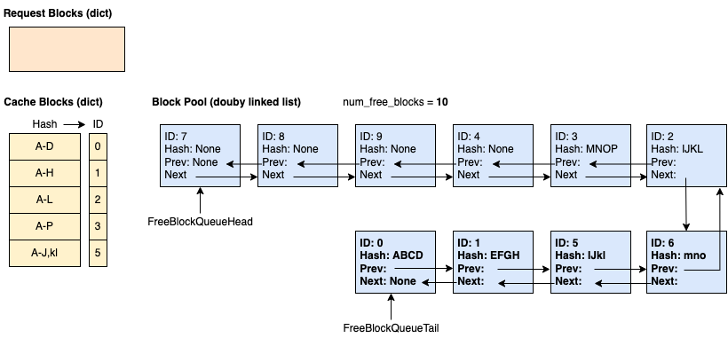

# Automatic Prefix Caching

Prefix caching kv-cache blocks is a popular optimization in LLM inference to avoid redundant prompt computations. The core idea is simple – we cache the kv-cache blocks of processed requests, and reuse these blocks when a new request comes in with the same prefix as previous requests. Since prefix caching is almost a free lunch and won’t change model outputs, it has been widely used by many public endpoints (e.g., OpenAI, Anthropic, etc.) and most open source LLM inference frameworks (e.g., SGLang).

While there are many ways to implement prefix caching, vLLM chooses a hash-based approach. Specifically, we hash each kv-cache block by the tokens in the block and the tokens in the prefix before the block:

```text
                    Block 1                  Block 2                  Block 3
         [A gentle breeze stirred] [the leaves as children] [laughed in the distance]
Block 1: |<--- block tokens ---->|
Block 2: |<------- prefix ------>| |<--- block tokens --->|
Block 3: |<------------------ prefix -------------------->| |<--- block tokens ---->|
```

In the example above, the KV cache in the first block can be uniquely identified with the token “A gentle breeze stirred”. The third block can be uniquely identified with the tokens in the block “laughed in the distance”, along with the prefix tokens “A gentle breeze stirred the leaves as children”. Therefore, we can build the block hash of `hash(tuple[components])`, where components are:

* Parent hash value: The hash value of the parent hash block.
* Block tokens: A tuple of tokens in this block. The reason to include the exact tokens is to reduce potential hash value collision.
* Extra hashes: Other values required to make this block unique, such as LoRA IDs, multi-modality input hashes (see the example below), and cache salts to isolate caches in multi-tenant environments.

!!! note "Note 1"
    We only cache full blocks.

!!! note "Note 2"
    The above hash key structure is not 100% collision free. Theoretically it’s still possible for the different prefix tokens to have the same hash value. To avoid any hash collisions **in a multi-tenant setup, we advise to use SHA256** as hash function instead of the default builtin hash.
    SHA256 is supported since vLLM v0.8.3 and must be enabled with a command line argument. It comes with a performance impact of about 100-200ns per token (~6ms for 50k tokens of context).

**A hashing example with multi-modality inputs**  
In this example, we illustrate how prefix caching works with multi-modality inputs (e.g., images). Assuming we have a request with the following messages:

```text
messages = [
    {"role": "user",
     "content": [
         {"type": "text",
          "text": "What's in this image?"
         },
         {"type": "image_url",
          "image_url": {"url": image_url},
         },
    ]},
]
```

It will become the following prompt:

```text
Prompt:
    <s>[INST]What's in this image?\n[IMG][/INST]

Tokenized prompt:
    [1, 3, 7493, 1681, 1294, 1593, 3937, 9551, 10, 4]

Prompt with placeholders (<P>):
    [1, 3, 7493, 1681, 1294, 1593, 3937, 9551, <P>, <P>, ..., <P>, 4]
```

As we can see, after the tokenization, the `[IMG]` will be replaced by a sequence of placeholder tokens, and these placeholders will be replaced by image embeddings during prefill. The challenge for prefix caching to support this case is we need to differentiate images from the placeholders. To address this problem, we encode the image hash generated by the frontend image processor. For example, the hash of the blocks in the above prompt would be (assuming block size 16, and we have 41 placeholder tokens):

```text
Block 0
    Parent hash: None
    Token IDs: 1, 3, 7493, 1681, 1294, 1593, 3937, 9551, <p>, ..., <p>
    Extra hash: <image hash>
Block 1
    Parent hash: Block 0 hash
    Token IDs: <p>, ..., <p>
    Extra hash: <image hash>
Block 2
    Parent hash: Block 1 hash
    Token IDs: <p>, ..., <p>
    Extra hash: <image hash>
Block 3
    Parent hash: Block 2 hash
    Token IDs: <p>, ..., <p>, 4
    Extra hash: <image hash>
```

In the rest of this document, we first introduce the data structure used for prefix caching in vLLM v1, followed by the prefix caching workflow of major KV cache operators (e.g., allocate, append, free, eviction). Finally, we use an example to illustrate the end to end prefix caching workflow.

**Cache Isolation for Security**
To improve privacy in shared environments, vLLM supports isolating prefix cache reuse through optional per-request salting. By including a `cache_salt` in the request, this value is injected into the hash of the first block, ensuring that only requests with the same salt can reuse cached KV blocks. This prevents timing-based attacks where an adversary could infer cached content by observing latency differences. This offers protection without compromising performance.

```json
{
  "messages": [
    {"role": "system", "content": "You are a helpful assistant."},
    {"role": "user", "content": "Here is a document with details about the world series: ..."},
    {"role": "user", "content": "Who won the world series in 2020?"}
  ],
  "cache_salt": "your-cache-salt"
}
```

With this setup, cache sharing is limited to users or requests that explicitly agree on a common salt, enabling cache reuse within a trust group while isolating others.

## Data Structure

The prefix caching in vLLM v1 is implemented in the KV cache manager. The basic building block is the “Block” data class (simplified):

```python
class KVCacheBlock:
    # The block ID (immutable)
    block_id: int
    # The block hash (will be assigned when the block is full,
    # and will be reset when the block is evicted).
    block_hash: BlockHash
    # The number of requests using this block now.
    ref_cnt: int

    # The pointers to form a doubly linked list for the free queue.
    prev_free_block: "KVCacheBlock | None" = None
    next_free_block: "KVCacheBlock | None" = None
```

There are two design points to highlight:

1. We allocate all KVCacheBlock when initializing the KV cache manager to be a block pool. This avoids Python object creation overheads and can easily track all blocks all the time.  
2. We introduce doubly linked list pointers directly in the KVCacheBlock, so that we could construct a free queue directly. This gives us two benefits:  
    1. We could have O(1) complexity moving elements in the middle to the tail.  
    2. We could avoid introducing another Python queue (e.g., `deque`) which has a wrapper to the elements.

As a result, we will have the following components when the KV cache manager is initialized:


* Block Pool: A list of KVCacheBlock.  
* Free Block Queue: Only store the pointers of head and tail blocks for manipulations.  
* Cache blocks: Mapping from hash key to block IDs.  
* Request blocks: Mapping from request ID to allocated block IDs.

## Operations

### Block Allocation

**New request:** Workflow for the scheduler to schedule a new request with KV cache block allocation:

1. The scheduler calls `kv_cache_manager.get_computed_blocks()` to get a sequence of blocks that have already been computed. This is done by hashing the prompt tokens in the request and looking up cache blocks.  
2. The scheduler calls `kv_cache_manager.allocate_slots()`. It does the following steps:  
    1. Compute the number of new required blocks, and return if there are no sufficient blocks to allocate.  
    2. “Touch” the computed blocks. It increases the reference count of the computed block by one, and removes the block from the free queue if the block wasn’t used by other requests. This is to avoid these computed blocks being evicted. See the example in the next section for illustration.  
    3. Allocate new blocks by popping the heads of the free queue. If the head block is a cached block, this also “evicts” the block so that no other requests can reuse it anymore from now on.  
    4. If an allocated block is already full of tokens, we immediately add it to the cache block, so that the block can be reused by other requests in the same batch.

**Running request:** Workflow for the scheduler to schedule a running request with KV cache block allocation:

1. The scheduler calls `kv_cache_manager.allocate_slots()`. It does the following steps:  
    1. Compute the number of new required blocks, and return if there are no sufficient blocks to allocate.  
    2. Allocate new blocks by popping the heads of the free queue. If the head block is a cached block, this also “evicts” the block so that no other requests can reuse it anymore from now on.  
    3. Append token IDs to the slots in existing blocks as well as the new blocks. If a block is full, we add it to the cache block to cache it.

**Duplicated blocks**  
Assuming block size is 4 and you send a request (Request 1\) with prompt ABCDEF and decoding length 3:

```text
Prompt: [A, B, C, D, E, F]
Output: [G, H, I]

Time 0:
  Tokens: [A, B, C, D, E, F, G]
  Block Table: [0 (ABCD), 1 (EFG)]
  Cache Blocks: 0
Time 1:
  Tokens: [A, B, C, D, E, F, G, H]
  Block Table: [0 (ABCD), 1 (EFGH)]
  Cache Blocks: 0, 1
Time 2:
  Tokens: [A, B, C, D, E, F, G, H, I]
  Block Table: [0 (ABCD), 1 (EFGH), 2 (I)]
  Cache Blocks: 0, 1
```

Now block 0 and block 1 are cached, and we send the same request again (Request 2\) with greedy sampling, so that it will produce exactly the same outputs as the Request 1:

```text
Prompt: [A, B, C, D, E, F]
Output: [G, H, I]

Time 0:
  Tokens: [A, B, C, D, E, F, G]
  Block Table: [0 (ABCD), 3 (EFG)]
  Cache Blocks: 0, 1
Time 1:
  Tokens: [A, B, C, D, E, F, G, H]
  Block Table: [0 (ABCD), 3 (EFGH)]
  Cache Blocks: 0, 1, 3
```

As can be seen, block 3 is a new full block and is cached. However, it is redundant as block 1, meaning that we cached the same block twice. In v0, when detecting block 3 is duplicated, we free block 3 and let Request 2 use block 1 instead, so its block table becomes `[0, 1]` in Time 1. However, the block table in vLLM v1 is append-only, meaning that changing the block table from `[0, 3]` to `[0, 1]` is not allowed. As a result, we will have duplicated blocks for the hash key E-H. This duplication will be eliminated when the request is freed.

### Free

When a request is finished, we free all its blocks if no other requests are using them (reference count = 0). In this example, we free request 1 and block 2, 3, 4, 8 associated with it. We can see that the freed blocks are added to the tail of the free queue in the *reverse* order. This is because the last block of a request must hash more tokens and is less likely to be reused by other requests. As a result, it should be evicted first.


### Eviction (LRU)

When the head block (least recently used block) of the free queue is cached, we have to evict the block to prevent it from being used by other requests. Specifically, eviction involves the following steps:

1. Pop the block from the head of the free queue. This is the LRU block to be evicted.  
2. Remove the block ID from the cache block.  
3. Remove the block hash.

## Example

In this example, we assume the block size is 4 (each block can cache 4 tokens), and we have 10 blocks in the KV-cache manager in total.

**Time 1: The cache is empty and a new request comes in.** We allocate 4 blocks. 3 of them are already full and cached. The fourth block is partially full with 3 of 4 tokens.


**Time 2: Request 0 makes the block 3 full and asks for a new block to keep decoding.** We cache block 3 and allocate block 4.


**Time 3: Request 1 comes in with the 14 prompt tokens, where the first 10 tokens are the same as request 0.** We can see that only the first 2 blocks (8 tokens) hit the cache, because the 3rd block only matches 2 of 4 tokens.


**Time 4: Request 0 is finished and free.** Blocks 2, 3 and 4 are added to the free queue in the reverse order (but block 2 and 3 are still cached). Block 0 and 1 are not added to the free queue because they are being used by Request 1.


**Time 5: Request 1 is finished and free.**



**Time 6: Request 2 comes in with the 29 prompt tokens, where the first 12 tokens are the same as request 0\.** Note that even the block order in the free queue was `7 - 8 - 9 - 4 - 3 - 2 - 6 - 5 - 1 - 0`, the cache hit blocks (i.e., 0, 1, 2) are touched and removed from the queue before allocation, so the free queue becomes `7 - 8 - 9 - 4 - 3 - 6 - 5`. As a result, the allocated blocks are 0 (cached), 1 (cached), 2 (cached), 7, 8, 9, 4, 3 (evicted).


