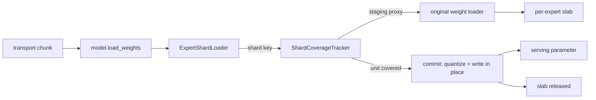

# Streaming per-unit expert reload

## Problem

`ModelwiseReloadSession` rebinds the whole model to its checkpoint schema,
materializes it, and only runs post-load processing at `finish`
(`docs/design/modelwise_reload.md` §9.1). Peak memory during a reload is
therefore `runtime + full checkpoint staging + processing workspace`. For MoE
models the checkpoint staging is dominated by expert weights, and none of it is
released until the transaction ends.

The expert weights, however, do not need to be held that long. A per-tensor FP8
MoE layer can finalize one expert as soon as that expert's shards have arrived:
the serving value depends on the expert's own `w1`/`w3` weights and their two
scales, and on nothing else in the layer.

## What a quantizable unit is

Two independent facts decide when a group of incoming shards can be converted:

| Fact | Owner | Example |
|---|---|---|
| Which shards a parameter is loaded in | the layer | `RoutedExperts` writes `(expert, "w1"/"w3")` for `w13_*`, `(expert, "w2")` for `w2_*` |
| Which shards share a serving-format value | the quant method | per-tensor FP8: `w1` and `w3` of one expert share one scale; block/group/channel: every shard stands alone |

A `ReloadUnit` is the intersection: a set of `(parameter, expert, shard)` keys
plus the commit that turns them into serving values. Completion is set
coverage, never an element count, so shard order, chunk boundaries,
retransmissions, TP narrowing and EP-remote experts are all handled by
construction.

```text
ReloadUnit("w13[7]")
  keys   = {(w13_weight, 7, w1), (w13_weight, 7, w3),
            (w13_weight_scale, 7, w1), (w13_weight_scale, 7, w3)}
  staged = {w13_weight: [2I, H] fp8, w13_weight_scale: [2] fp32}
  commit = requantize both halves onto max(s1, s3), write w13_weight[7]
```

## Mechanism



### `ExpertShardLoader`

Installed on every expert parameter when the layer is built, and kept for the
lifetime of the model (`replace_parameter` carries `weight_loader` across
post-load processing). It:

- derives the shard key from the loader's own arguments, mapping the global
  expert id to this rank's local id and ignoring remote experts;
- asks the active tracker where the write should land, then calls the original
  loader unchanged, so name mapping, TP narrowing, padding and fusion logic are
  reused verbatim;
- restores loader attributes (`quant_method`, `is_transposed`, ...) that
  `replace_parameter` drops when it rebuilds a parameter, since the reload
  writes through a serving-schema parameter rather than a freshly created one;
- records the observed shard keys even outside a reload, which gives the shard
  space a checkpoint actually provides.

### `ShardCoverageTracker`

Owns the staging slabs and the coverage state for one layer:

- a slab holds **one expert's checkpoint-format slice**, exposed to the loader
  through an expert-dimension broadcast so `param.data[expert]` keeps working;
- its shape is declared by the unit (`StagingSpec`), because the serving
  parameter may have been reduced -- per-tensor FP8 stores `[E, 2]` scales on
  disk and `[E]` at runtime;
- parameters absent from `staged` are written straight into serving storage;
- when a unit's last key arrives, `commit` runs and the slab is dropped;
- `finish` commits deferred units (values reduced across the layer, such as
  per-tensor input scales) and raises on any partially covered unit.

### Session integration

`ModelwiseReloadSession` asks every layer's quant method for units. Layers that
provide them keep their serving bindings: they are excluded from checkpoint
restore, from model-wide post-load processing and from copy-back, because they
publish serving values themselves. Everything else follows the existing
whole-model transaction.

## Fp8MoEMethod

Units are declared only when one expert can be finalized alone, that is for the
Triton and batched-Triton backends on non-FNUZ platforms. Backends that shuffle
or pad at layer scope (FlashInfer, Marlin, AITER, DeepGEMM) return `None` and
fall back to the whole-model transaction.

| Unit | Keys | Staged | Commit |
|---|---|---|---|
| `w13[e]` (per-tensor) | weight and scale of `w1`, `w3` | `[2I, H]` fp8, `[2]` fp32 | requantize both halves onto `max(s1, s3)` and write `w13_weight[e]`, `w13_weight_scale[e]` |
| `w13[e]` (block) | same keys | none | nothing: block scales are already serving format |
| `w2[e]` | `w2_weight`, `w2_weight_scale` | none | nothing: not a fused parameter, so the loader writes serving format directly |
| `input_scale` (static activation) | every expert's input scales | `()` fp32 each | max across experts, deferred to `finish` |

The requantization is the per-expert body of
`process_fp8_weight_tensor_strategy_moe`, extracted as
`requantize_fp8_w13_expert` and shared with cold start, so a streamed reload is
bit-identical to loading the checkpoint from scratch.

## Guarantees and limits

- Parameter objects and storage addresses never change, so captured CUDA graphs
  stay valid.
- A unit is all-or-nothing: staged shards become visible only at commit. `w2`
  and other non-fused parameters are written directly, so their (already
  atomic) per-expert write is visible immediately.
- A partially covered unit fails the transaction at `finish`, before the model
  returns to serving.
- Committed experts cannot be rolled back. An abort after any commit leaves a
  mixed-version model; the worker must complete an update or restart, matching
  the runtime-format reload contract.
- `VLLM_RELOAD_STREAMING_EXPERTS=0` disables unit discovery and restores the
  previous whole-model behaviour.

## Verification

H200, Qwen3-30B-A3B (2 layers, 128 experts) converted to per-tensor FP8, dynamic
activation, Triton backend. Checkpoint B is checkpoint A with a random per-tensor
factor, so `w1` and `w3` scales differ per expert and the max-scale
requantization is exercised.

| Check | Result |
|---|---|
| Units discovered | 256 per layer (128 experts x 2) |
| Serving tensors vs cold load of B | bit-identical (sha256 per parameter) |
| Parameter identity / storage address changes | 0 |
| Generated tokens | match cold load of B, differ from A |
| Reload peak extra memory, streaming | 1256 MiB |
| Reload peak extra memory, `VLLM_RELOAD_STREAMING_EXPERTS=0` | 2409 MiB |

The same checkpoint pair was then pushed through vLLM's NCCL weight-transfer
engine, with the trainer side driven by `vllm-rl-day0-kit`'s publisher on a
second GPU: 1567 tensors in 5 packed buckets (non-expert and expert phases), so
one expert's shards can straddle a bucket boundary. The server logged
`Streaming reload: 2 layer(s) commit 512 unit(s) in place`, and completions
after the update matched a cold-served checkpoint B and differed from A.

The 1.15 GiB difference is exactly the expert checkpoint staging the streaming
path no longer holds. The remaining 1.2 GiB is the embedding and LM head, which
the whole-model transaction still stages; extending units to dense and embedding
layers is the natural next step.
