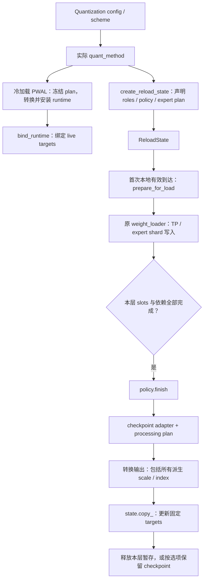

# 离线量化 Reload 接入排查与实施指南

## 1. 范围与结论

排查日期：2026-09-19。基线为 `hapi-review-weight-reload-tracker` 分支
`ba1e6ebf17` 加当前工作区已有的 Marlin/Humming processing plan 改动，
**不是仅依据该 commit，也不是对社区最新 main 的支持承诺**。
本次仅做源码审计与文档整理，不新增实现，不运行 GPU 验证。

这里的“接入”特指：

```text
checkpoint-format 冷加载
  -> 安装 tracer / 观察普通 loader
  -> 冷加载 PWAL 创建固定运行时结构
  -> bind_runtime
  -> reload 恢复可加载布局
  -> 原 loader 写入新 checkpoint
  -> 可重入转换
  -> 原位更新已绑定 runtime targets
```

不是“能调用原有 layerwise reload”，也不是“有同名 GEMM 后端”。
已有流程见 [调用流程与模型示例](reload-flow-walkthrough.md)，
FP8 各 policy 的存储选择见 [加载布局排查](reload-loading-layout.md)。

### 1.1 核心结论

1. 当前树中只有 `Fp8LinearMethod` 和 `Fp8MoEMethod` 定义
   `create_reload_state`。其他离线量化入口尚未完成这套流程的接入。
2. FP8 的 Marlin/Humming 后端已接入，不代表 AWQ/GPTQ 使用的
   Marlin/Humming，或独立 `quantization="humming"` 已接入。
3. ModelOpt mixed 的部分 block-FP8 MoE 会直接返回 `Fp8MoEMethod`，
   因而可以复用已有入口；同一模型的 ModelOpt linear 并没有因此接入。
4. “该层有 policy”不等于“整个模型可以 reload”。
   根模型/子模块后处理、量化 KV cache、MLA、未量化 MoE、
   transform wrapper 等仍可能使 tracer 初始化明确失败。
5. 最大的增量工作不只是添加 builder，而是把旧 PWAL 的
   **数值转换、参数替换、kernel/config/workspace 创建**拆开，并绑定所有派生输出。
6. 当前 FP8 路径本身还存在限制，以及本次静态发现的动态 kernel 包装问题；
   不能把“已提供入口”写成“所有后端、硬件和模型全部验证通过”。

### 1.2 判定口径

| 标记 | 含义 |
| --- | --- |
| 条件接入 | 存在实际 builder/policy，但仍受格式、后端和模型限制 |
| 委托接入 | factory 的特定分支返回已有 FP8 method，不是该家族整体接入 |
| 未接入 | 实际 method 没有 reload builder；即使其 PWAL 很简单也不会自动放行 |
| 非本轮范围 | 在线量化、非权重量化或用户自定义插件 |
| 原生不支持 | 原量化实现就不支持该层/配置，不能记为 reload 独有缺口 |

本排查覆盖仓库内注册表、实际 method/scheme 分派、相关后处理和模型级阻碍。
不穷举外部插件，也不把每个 kernel 的硬件可用性当作已经实测。
后文的“建议”“应当”是接入要求，不表示对应机制已经实现。

## 2. 注册入口总表

源头：[量化注册表](../../../vllm/model_executor/layers/quantization/__init__.py)。
同一 config 的别名合并，不重复计算成独立实现。

| 入口 | 实际路径 | 当前状态与主要缺口 |
| --- | --- | --- |
| `fp8` | `Fp8LinearMethod`、`Fp8MoEMethod` | 条件接入，见第 4 节 |
| `awq`、`awq_marlin`、`auto_awq` | `AutoAWQConfig` | 未接入；dense、MoE、fallback 均需审计 |
| `gptq`、`gptq_marlin`、`auto_gptq` | `AutoGPTQConfig` | 未接入；packed weights、zeros、act-order 等 |
| `moe_wna16` | `MoeWNA16Method`；dense 委托 AWQ/GPTQ | 未接入；不是 FP8 Marlin policy 的别名 |
| `modelopt` | `ModelOptLinearMethod`、`ModelOptFp8MoEMethod` | 未接入；同为 FP8 也不是 `Fp8LinearMethod` |
| `modelopt_fp4` | generic ModelOpt linear、NVFP4 MoE | 未接入；分级 scale、派生输出、后端 packing |
| `modelopt_mxfp8` | generic ModelOpt linear、MXFP8 MoE | 未接入；编码 scale、once guard、emulation |
| `modelopt_mixed` | 每层选择不同算法和 method | 仅部分 block-FP8 MoE 委托接入，其余未接入 |
| checkpoint 中的 `mxfp8` | ModelOpt MXFP8 兼容入口 | 未接入；须与 CLI 在线 shorthand 区分 |
| `compressed-tensors` | linear scheme、MoE method、embedding、transform | 未接入；逐 scheme 接，不应整个 wrapper 一次性放行 |
| `quark` | `QuarkLinearMethod` + scheme、Quark MoE | 未接入；FP8/INT8/OCP MX/NVFP4 均需覆盖 |
| `inc` | `INCLinearMethod` + scheme，或委托其他 method | 未接入；含 AWQ/GPTQ/Humming 等委托分支 |
| `mxfp4` | `Mxfp4MoEMethod` | 未接入；此 config 的 dense 本来走未量化，不是缺一个 MXFP4 dense policy |
| `gpt_oss_mxfp4` | `GptOssMxfp4MoEMethod` | 未接入；bias、precision config 内 scale 等 |
| `humming` | `HummingLinearMethod`、`HummingMoEMethod` | 未接入；通用 schema/requant 与 FP8 专用路径不同 |
| `torchao` | `TorchAOLinearMethod` | serialized checkpoint 分支未接入；在线分支不在本轮 |
| `fbgemm_fp8` | `FBGEMMFp8LinearMethod` | 未接入；已标 deprecated，但注册入口仍存在 |
| `fp_quant` | `FPQuantLinearMethod` | 未接入；已标 deprecated，无自定义 PWAL 不等于自动支持 |
| `deepseek_v4_fp8` | V4/V4.1 专用 config，按平台与层分派 | 部分 FP8 层可委托；混合格式和模型后处理阻碍整模型接入 |
| `experts_int8` | 在线 `Int8OnlineMoEMethod` 兼容入口 | 非离线量化遗漏 |
| `online` | 在线量化 config | 非本轮范围 |
| `fp8_per_tensor`、`fp8_per_block`、`fp8_per_channel` | 在线 shorthand | 非本轮范围 |
| `int8_per_channel_weight_only`、`nvfp4_per_token` | 在线 shorthand | 非本轮范围 |
| CLI 在线 shorthand `mxfp8` | 在线 MXFP8 | 不要与上面的 checkpoint 元数据入口混为一谈 |

`turboquant`、KV cache 的量化配置不是本表中的离线权重入口。
`register_quantization_config` 可增加或覆盖入口；外部插件必须另行审计实际返回的 method。

## 3. 各家族待接入清单

### 3.1 AWQ、GPTQ 与 MoeWNA16

源码：[AWQ](../../../vllm/model_executor/layers/quantization/auto_awq.py)、
[GPTQ](../../../vllm/model_executor/layers/quantization/auto_gptq.py)、
[MoeWNA16](../../../vllm/model_executor/layers/quantization/moe_wna16.py)。

| 实际 method | 接入前需要拆开的工作 |
| --- | --- |
| `AutoAWQLinearMethod` | 审计 checkpoint 与执行布局是否相同；即使可直接 copy，也需显式入口和 roles |
| `AutoAWQMarlinLinearMethod` | AWQ 非标准 bit order/output-axis packing 先转标准 GPTQ-like 格式，再执行所选 kernel 转换 |
| `AutoGPTQLinearMethod` | 将所选 mixed-precision kernel 的 PWAL 拆为固定结构与可重入 packing |
| `AutoAWQMoEMethod` | expert packing、scales/zeros、后端配置，不能复用冷加载 expert slots |
| `AutoGPTQMoEMethod` | `convert_to_wna16_moe_kernel_format` 与 `_setup_kernel` 分离；补齐派生 global scales、bias、别名 |
| `MoeWNA16Method` | 独立专家 fallback 路径；dense 仍按 AWQ/GPTQ 的实际 method 接入 |

特别注意：

- AWQ 的“checkpoint 布局”和“送给 kernel 的标准布局”不同。
  loader 的目的地仍应符合原 checkpoint loader 合约；不能直接向 runtime packed layout 写入。
- `g_idx`、`qzeros`、`scales` 是否为输入 role，要依据实际配置和 loader，
  不能看到属性就全部加入 expected。
- `g_idx` 等可能随新 checkpoint 改变数值。冻结的是格式、尺寸和算法选择，
  不是未经约定就冻结其内容；由它派生的排序/置换应重新计算并写入固定 target。
- GPTQ MoE 的转换存在“返回 tuple”和“直接重写 layer，例如 Humming”两类分支。
  后者必须先提取无 layer 副作用的转换接口，不能在 reload 中直接重放。
- `w13_weight = w13_qweight` 一类别名，必须保持 kernel 实际读取对象的所有权关系。
  有 bias 的配置还需要处理冷加载时 `_loaded_expert_biases` 决定的参数存在性。
- 不满足 Marlin 条件时可能转入 `MoeWNA16Method`；不能只测试主分支就声明 AWQ/GPTQ MoE 全覆盖。

建议优先统一“checkpoint adapter + backend packing plan”，
而不是给 AWQ/GPTQ 的每个后端复制一整套 policy。
现有 `MarlinFP8*ProcessingPlan` 是 FP8 专用，不能仅改参数名拿来处理 INT4。

### 3.2 ModelOpt

源码：[modelopt.py](../../../vllm/model_executor/layers/quantization/modelopt.py)。

| 路径 | 当前结构 | 接入重点 |
| --- | --- | --- |
| 所有 generic linear | `ModelOptLinearMethod`，`QuantSpec` / `CkptCtx` / weight、activation key / format scheme | 已有职责拆分，但没有 trace 入口；提取可重入数值过程 |
| FP8 MoE | `ModelOptFp8MoEMethod` | 对齐 tensor/block scale 语义，复用转换而不是假装 method 是 `Fp8MoEMethod` |
| NVFP4 MoE | `ModelOptNvFp4FusedMoE` | block/global/input scales、派生系数、packed output |
| MXFP8 MoE | `ModelOptMxFp8FusedMoE` | 去除 reload 对 once guard 的依赖；精确处理编码 scale 和 emulation |
| mixed block-FP8 MoE | 返回 `Fp8MoEMethod` | 委托接入，仍继承其所有限制 |
| mixed 其他层 | generic linear 或上述专用 MoE | 未接入 |

`ModelOptLinearMethod.process_weights_after_loading` 不只是 kernel packing：

```text
format.pre_process
  -> weight key.process_weights
  -> activation key.process_weights
  -> maybe_fuse_global_scales
  -> format.post_process
  -> 特定保留 buffer / BMM kernel 调整
  -> kernel.process_weights_after_loading
```

建议保留这条数值顺序，将 structural 选择记录在 plan 中。
`_retain_weight_for_gather` 相关 buffer 也可能持有权重引用，必须纳入绑定与更新；
不能只更新 `layer.weight` 就认为所有消费者都更新了。
MXFP8 BMM 分支中 kernel 的重建属于冷加载安装工作，reload 不应重复创建。

MXFP8 MoE 有 `_already_called_process_weights_after_loading`：
直接再次调用会跳过新权重转换，清掉 flag 再调用则会重建运行时结构，两者都不是接入方案。
emulation 在特定配置下冷加载直接把 MXFP8 解量化为 BF16；
这需要“新 MXFP8 输入 -> 新 BF16 输出”的可重入 plan，不能对 BF16 runtime
做同 dtype alias 的假设，也不能试图还原旧 checkpoint 数值。

### 3.3 Compressed Tensors

入口：[compressed_tensors.py](../../../vllm/model_executor/layers/quantization/compressed_tensors/compressed_tensors.py)。
`CompressedTensorsLinearMethod` 委托给 `layer.scheme`；
scheme 已经能调用某个 FP8 kernel，并不意味着外层 method 已被 tracer 接纳。

以下 concrete linear schemes 全部尚未接入：

| Scheme | 主要接入方向 |
| --- | --- |
| `CompressedTensorsW8A8Fp8` | checkpoint scale 命名/粒度适配，复用 FP8 数值转换 |
| `CompressedTensorsW8A16Fp8` | weight-only 语义与所选后端，不能强加 activation scale role |
| `CompressedTensorsW8A8Int8` | weight/input scales、zero point 和所选 INT8 kernel |
| `CompressedTensorsWNA16` | packed INT、group scale/zero、mixed-precision kernel plan |
| `CompressedTensorsWNA8O8Int` | packed 权重与 INT8 输出/激活路径的独立语义 |
| `CompressedTensorsW4A8Int` | W4A8 packing 与 INT activation 元数据 |
| `CompressedTensorsW4A8Fp8` | INT4 权重和 FP8 activation 的混合表示 |
| `CompressedTensorsW4A4Fp4` | NVFP4，不能因类名没有 NV 而归入 MXFP4 |
| `CompressedTensorsW4A4Mxfp4` | MXFP4 packed 权重与编码 scale |
| `CompressedTensorsW8A8Mxfp8` | MXFP8 scale 编码和目标布局 |
| `CompressedTensorsWNA4Int` | 按实际 scheme 审计 packed weights 与 scales/zeros |
| `CompressedTensorsWNA8Int` | 与上一项分别核对，不因命名类似而共用错误布局 |

源码目录：[schemes](../../../vllm/model_executor/layers/quantization/compressed_tensors/schemes)。

以下 concrete MoE methods 全部尚未接入：

| Method（公共前缀 `CompressedTensors`） | 额外关注点 |
| --- | --- |
| `WNA16MoEMethod` | packed INT experts 与后端转换 |
| `W4A16FlydslMoEMethod` | 独立 FlyDSL 路径和硬件/量化配置条件 |
| `W8A8Fp8MoEMethod` | 可优先对接 FP8 processing plan，但不能跳过 schema 适配 |
| `W8A8Int8MoEMethod` | INT8 专家与 scale/zero |
| `W4A8Fp8MoEMethod` | INT4/FP8 混合输入输出 |
| `W4A8Int8MoEMethod` | INT4/INT8 混合输入输出 |
| `W4A4Nvfp4MoEMethod` | 包括其 `use_a16` 分支，global scales 与后端布局 |
| `W4A4Mxfp4MoEMethod` | MXFP4 scale swizzle/packing |
| `W8A8Mxfp8MoEMethod` | MXFP8 scale 表示与专家映射 |

源码目录：[compressed_tensors_moe](../../../vllm/model_executor/layers/quantization/compressed_tensors/compressed_tensors_moe)。

还有三类不能遗漏：

1. [量化 embedding](../../../vllm/model_executor/layers/quantization/compressed_tensors/compressed_tensors_embedding.py)：
   `CompressedTensorsEmbeddingWNA16Int` 不是普通 copy embedding；
   ParallelLMHead 的 linear 路径和真正 embedding 也要分别审计。
2. [transform wrapper](../../../vllm/model_executor/layers/quantization/compressed_tensors/transform)：
   `CompressedTensorsLinearTransformMethod`、`HadamardTransform`、
   `QutlassNvFP4LinearMethod`。即使内部 scheme 接入，外层 wrapper 与
   子模块 PWAL 仍可能被拒绝；应组合转换和明确 state 所有权，不能重复注册同一权重。
3. `CompressedTensorsKVCacheMethod`：不属于离线权重 policy 的替代品，
   量化 attention 还需要独立设计。

### 3.4 Quark

源码：[quark.py](../../../vllm/model_executor/layers/quantization/quark/quark.py)、
[schemes](../../../vllm/model_executor/layers/quantization/quark/schemes)、
[quark_moe.py](../../../vllm/model_executor/layers/quantization/quark/quark_moe.py)。

| 类别 | 未接入的 concrete schemes/methods |
| --- | --- |
| Linear FP8 | `QuarkW8A8Fp8`、`QuarkW8A8Fp8PerBlock` |
| Linear INT8 | `QuarkW8A8Int8` |
| Linear mixed/MX/FP4 | `QuarkW4A8_MXFP4_FP8`、`QuarkNVFP4`、`QuarkOCP_MX` |
| MoE FP8/INT8 | `QuarkW8A8Fp8MoEMethod`、`QuarkW8A8Int8MoEMethod` |
| MoE mixed/MX/FP4 | `QuarkW4A8Fp8MoEMethod`、`QuarkOCP_MX_MoEMethod`、`QuarkNvfp4MoEMethod` |

接入应从外层 `QuarkLinearMethod` 的 scheme 分派开始，
显式选择已支持的 scheme，不将所有 scheme 自动视为同一 policy。
AMD 的 E4M3FN/FNUZ 归一化、preshuffle、scale 编码都属于每轮需要重新执行的数值转换；
硬件/算法选择、kernel/config 创建属于冷加载结构。
OCP MX 不能只按“MXFP4”一个标签覆盖，必须保留实际 weight/activation 格式组合。

Quark 的 ignored 层可能采用在线动态量化配置；
这部分不是离线 checkpoint 接入目标。`QuarkKVCacheMethod` 也仍需单独处理。

### 3.5 INC / AutoRound

源码：[INC 入口](../../../vllm/model_executor/layers/quantization/inc/inc.py)、
[scheme factory](../../../vllm/model_executor/layers/quantization/inc/schemes/factory.py)。

| Scheme family | 实际分派与缺口 |
| --- | --- |
| `INCFp8Scheme` | `INCLinearMethod(INCFp8LinearScheme(...))`，没有直接采用 FP8 builder |
| `INCMxfp8Scheme` | `INCMxfp8LinearScheme`、`INCMxfp8MoEMethod`，均未接入 |
| `INCMxfp4Scheme` | `INCMxfp4LinearMethod`、`INCMxfp4MoEMethod`，均未接入 |
| `INCWna16Scheme` | CPU/CUDA/XPU 等分支；可能委托 AWQ/GPTQ、MoeWNA16、独立 Humming，均不能自动放行 |

WNA16 还需覆盖 `INCWNA16LinearScheme`、`INCXPULinearMethod`、
`INCARKLinearMethod`、`INCXPUW4A8LinearMethod` 的实际转换。
`INCWNA16LinearScheme` 内部返回 AWQ/GPTQ kernel/method 的路径，
应复用那些家族的 plan，不另写相同 packing。

INC FP8 scheme 没有专门的 MoE override，基类默认报不支持；
这是原生能力边界，不应记成“只缺一个 INC FP8 MoE reload policy”。
HF AutoRound 元数据可被重定向到 INC，不能只搜索 CLI `inc` 来判断覆盖范围。

### 3.6 MXFP4 与 GPT-OSS MXFP4

源码：[mxfp4.py](../../../vllm/model_executor/layers/quantization/mxfp4.py)。

`Mxfp4MoEMethod` 和 `GptOssMxfp4MoEMethod` 都没有 builder。
其中 GPT-OSS 的 Triton 路径会将 swizzled scales 放进 precision config，
并释放公开 scale 参数。接入时必须：

- 记录输入 packed weight/encoded scale/bias 的真实 loader 形状。
- 把 precision config 内实际消费的 tensor 显式注册为 target。
- 将 scale swizzle 与 config/kernel 创建分开；前者每轮执行，后者只做一次。
- 对 bias、padding、gated projection 顺序分别定义转换，不能只覆盖四个 weight/scale。
- 保留各 backend 的 dtype 和 scale 编码，不把 E8M0 bytes 当 FP32 scale view。
- 为每个 backend 证明其 kernel/config 内没有遗漏的权重缓存。

`mxfp4` config 的 dense 使用未量化 linear；它与 ModelOpt/CT/INC 的
MXFP4 linear 路径不是同一个入口。

### 3.7 独立 Humming

源码：[quantization/humming.py](../../../vllm/model_executor/layers/quantization/humming.py)、
[共享工具](../../../vllm/model_executor/layers/quantization/utils/humming_utils.py)。

当前 FP8 专用路径记录了 processing plan；
独立 `HummingLinearMethod` / `HummingMoEMethod` 尚未采用该协议。
独立路径包含：

```text
source schema conversion
  -> input schema conversion
  -> 可选 force_requant
  -> prepare_layer_config
  -> transform
  -> 参数安装、执行配置/辅助对象创建
```

linear 可能覆盖 `self.weight_schema` / `self.input_schema`，
MoE 有 `self.processed` guard。reload 不能复用“已变成 runtime schema”的对象
去解释新 checkpoint，更不能清 flag 后重放完整 PWAL。

建议分两批：

1. 先接无 force-requant、输入 schema 转换不依赖权重数值的普通路径，
   复用现有 `HummingTensorProcessingPlan` 的冻结 schema/config 和 transform。
2. 再设计通用 requant/input-schema conversion 的显式输入输出，
   保留 source schema，绑定所有额外输出，验证最终 schema 不随 checkpoint 改变。

已有 FP8 Humming plan 仍会调用外部 schema 的转换接口，并校验返回 schema；
它不是“完全不接触第三方 metadata 代码”。接入通用路径时需保留该边界，
不能把外部对象是否会突变当作默认保证。

### 3.8 FBGEMM FP8、FPQuant、TorchAO

| 家族 | 关键问题 | 建议 |
| --- | --- | --- |
| [FBGEMM FP8](../../../vllm/model_executor/layers/quantization/fbgemm_fp8.py) | 独立 channel-wise method；FNUZ、转置、可选 Marlin/kernel PWAL；`input_scale_ub` 可由 config 生成 | 区分 checkpoint role 与生成常量，不能套 tensor-wise scale 归并规则 |
| [FPQuant](../../../vllm/model_executor/layers/quantization/fp_quant.py) | packed `qweight`、`scales`、两个 global scale、Hadamard matrix；无独立 PWAL 仍被入口拒绝 | 审计实际加载与 runtime identity 后可做显式 copy-like policy，不放宽全局白名单 |
| [TorchAO](../../../vllm/model_executor/layers/quantization/torchao.py) | serialized tensor subclass 转当前硬件 packed tensor，并替换 Parameter | 先建立底层 tensor leaves、结构 schema、runtime targets 合约；不把外层 wrapper 当普通 dense Tensor |

FBGEMM FP8 / FPQuant 当前已 deprecated，建议低于主流离线格式排期。
TorchAO 的在线量化分支不是本轮目标；serialized checkpoint 的结构化 tensor
也不能在没有 transport 表示定义时直接套用当前 NCCL/IPC 普通 tensor 传输。

### 3.9 DeepSeek V4 / V4.1 专用入口

源码：[V4 config](../../../vllm/models/deepseek_v4/quant_config.py)、
[V4.1 config](../../../vllm/models/deepseek_v41/quant_config.py)。

该入口不是统一的“FP8 模型”：

- 部分 experts 会返回普通 `Fp8MoEMethod`，可继承已有层级能力。
- V4.1 的 32x32 MXFP8 linear 使用 ModelOpt 路径，尚未接入。
- FP4 experts 可走 MXFP4 或 ModelOpt NVFP4，尚未接入。
- CUDA/ROCm 等模型实现还包含模型级 PWAL，当前 tracer 的根模型检查会拒绝。
- MLA/特殊 attention、平台特有模块的后处理还需独立梳理。

因此必须先确定实际 model class 和每层 method，再逐项闭合；
只完成 FP8 experts 不应对外标为 DeepSeek V4/V4.1 整模型支持。

## 4. 已有 FP8 接入仍需注明的限制

源码：[FP8 builders](../../../vllm/model_executor/layers/quantization/fp8.py)、
[policies](../../../vllm/model_executor/model_loader/reload/fp8.py)。

当前存在多种 linear tensor/block policy，以及 DeepGEMM、Triton、CUTLASS、
FlashInfer、CPU、XPU、AITER、HPC、Marlin、Humming 等 MoE 分派，
包括已列入 builder 的 batched 分支。
准确边界以 builder 的显式白名单和条件为准，不按 backend 名称模糊推断。

主要限制：

- 只接 checkpoint-format 离线 FP8，不接非 serialized 在线输入，
  也不接 `is_weights_pre_processed()` 标记的 runtime-format 权重。
- MoE bias、fused shared experts、`weight_scale_refine` 等组合被拒绝。
- FNUZ 仅允许 builder 指定的后端；不是所有 FP8 backend 通用支持。
- 部分 per-tensor 路径要求 static activation；DeepGEMM MoE 要求 block quant。
- static-input MoE + EPLB + EP 大于 1 的组合被拒绝，
  不能让逐层到达顺序任意触发跨 rank collective。
- Marlin/Humming 已有 plan 和 reload 回归，不等于所有原生 kernel/第三方版本
  已验证。既有测试与环境限制见 [布局排查文档](reload-loading-layout.md)；
  本轮没有新增 native forward 或模型评估证据。

### 4.1 本次发现：动态 FlashInfer/DeepGEMM wrapper

这是**静态代码发现，尚未 GPU 复现，本轮不修复**：

1. `Fp8LinearMethod.create_reload_state` 对
   `FlashInferFp8DeepGEMMDynamicBlockScaledKernel` 使用局部变量
   `kernel.fallback` 判断并选择 `DeepGEMMReloadPolicy`。
2. `DeepGEMMReloadPolicy.bind` 保存的是 `method.fp8_linear`，即外层 wrapper。
3. linear 的 `finish` 调用 `self.kernel.prepare_weights(...)`。
4. 当前 [wrapper](../../../vllm/model_executor/kernels/linear/scaled_mm/flashinfer.py)
   和其基类没有该方法或相应属性转发；方法定义在 DeepGEMM 子 kernel。

因此该组合不能归为完成支持。建议让 plan 明确持有转换 provider，
同时验证外层 dispatch kernel 和 fallback 的身份/配置；
不要只改成 fallback 后丢失对外层 runtime dispatch 的绑定检查。
应增加实际 wrapper 对象的回归，而不是只用裸 DeepGEMM mock。

### 4.2 后端相同不代表转换协议相同

后续核对需要同时覆盖 kernel 分派目录，而不只看量化 config：

| Kernel 层 | 当前目录中的实现范围 | 接入要求 |
| --- | --- | --- |
| [mixed_precision](../../../vllm/model_executor/kernels/linear/mixed_precision) | Marlin、Machete、AllSpark、Humming、CUTLASS、CPU/Zentorch、XPU、Exllama、Conch、Triton、RDNA、dynamic 4bit | 各自提取/复用 packing；仅为上层明确支持的组合开放 |
| [nvfp4](../../../vllm/model_executor/kernels/linear/nvfp4) | B12x、FBGEMM、Humming、CUTLASS、Marlin、FlashInfer、emulation、PyTorch | 分级 scales 和 packing 均需审计 |
| [mxfp4](../../../vllm/model_executor/kernels/linear/mxfp4) | B12x、AITER、Marlin、FlashInfer、Humming、emulation、XPU | encoded scales、padding 和 runtime 容器均需审计 |
| [scaled_mm](../../../vllm/model_executor/kernels/linear/scaled_mm) | FP8、INT8、MXFP8 等执行路径 | 现有 FP8 白名单只覆盖其中一部分方法/格式组合 |

这是源码覆盖索引，不表示目录中每个 kernel 都可被每种量化格式选中。
不要通过“一次支持所有 MPLinearKernel 子类”绕过逐组合验证。

## 5. 接入合约：先分清结构与数值

### 5.1 PWAL 的拆分原则

| 工作 | 冷加载一次 | 每轮 reload |
| --- | --- | --- |
| backend/experts class、算法、group/block 大小、shape 选择 | 冻结并校验 | 不重选 |
| schema/config/workspace/kernel 对象创建与安装 | 是 | 不重新创建、注册或替换 |
| 参数改名、Parameter 替换、runtime buffer 安装 | 是 | 仅恢复临时 loader alias，不替换 live target |
| scale 归并、reciprocal、乘积、FNUZ 归一化、requant | 首次执行 | 根据新 checkpoint 重算 |
| weight/scale transpose、shuffle、packing、padding | 首次执行 | 同一固定算法重新执行 |
| placement / expert mapping | 冷加载使用当时映射 | 每轮从当前映射生成，轮内冻结 |
| shape/格式依赖的辅助常量 | 可缓存 | 校验复用 |
| 从新权重数值派生的索引/系数 | 首次计算 | 更新固定 targets，不能误作常量 |

拆分不要求所有“只执行一次”的语句必须排在所有数值处理之前。
有些 schema/config 需要冷加载转换后才能确定，允许在冷加载的后段安装。
关键是不把这些安装副作用混进可重入函数。

“可重入”也不是对 runtime packed tensor 连续执行两次的幂等性：
它的输入是**每轮新写入的 canonical checkpoint 布局**。

### 5.2 推荐职责边界



- **Checkpoint adapter** 是职责名称，不要求新建统一基类：
  解释该格式的名称、scale 语义、packing 和 loader 元数据。
- **Processing plan** 保存固定转换规则，接收本轮 tensor，返回转换结果；
  不持有 live layer 来注册/删除 Parameter，不重新选 kernel。
- **Policy** 选择 alias/staging，验证 plan/runtime，不决定远端专家路由。
- **State** 维护输入、固定 targets、到达槽位与依赖。
- **Transport** 负责轮次、接收、完成通知；不内嵌量化转换。

优先使用已有函数和数据结构。只有两个格式真正共享同一合约时才抽取公共层，
不要为每个“格式 x 后端”组合复制一个完整框架。

## 6. 一个新离线格式的接入步骤

### 步骤 A：列出真实输入与输出

为实际 method 的每种支持配置填写以下表格，作为代码 review 的前置材料：

| 字段 | 必须回答的问题 |
| --- | --- |
| checkpoint role | 冷加载时由哪个 loader 写入？是否可选？是否一定有到达？ |
| canonical layout | dtype、shape、stride、packed axis、group/block、scale 编码分别是什么？ |
| sharding | TP/EP 维度、shard 参数、replicated scalar、fused projection 如何处理？ |
| runtime target | 属性、buffer、kernel/config 内部 tensor 的 getter 是什么？ |
| 派生关系 | 一对一、改名、一对多，还是仅输入无公开对应参数？ |
| 存储策略 | 哪些 role 可以共享 runtime storage，哪些必须 staging？ |
| 固定结构 | plan/kernel/schema/workspace 的哪些信息必须保持不变？ |
| 失败边界 | 哪些配置初始化即拒绝？哪些数值/结构变化轮次开始时拒绝？ |

不要把 config 创建的常量、workspace 或从 weight 派生的 scale 加入
checkpoint roles，否则 observe 会因“无冷加载到达”失败。
反之，forward 真正读取的派生值不能只列在注释里而不更新。

### 步骤 B：提取可重入转换，保持冷加载行为一致

先让冷加载 PWAL 调用提取后的数值转换，再安装原有 Parameter/kernel/config。
随后让 reload 调用同一转换。这样冷加载与 reload 有一个共同的数值来源。

不采用以下方式：

- 创建临时 `nn.Module`/假 layer，填上几十个属性，再调用旧 PWAL。
- 临时换掉 `layer.weight`，转换完成后换回。
- 重置 `processed` / `_already_called_process_weights_after_loading` 来重放旧流程。
- reload 时再次调用 config factory、选择 backend 或创建 workspace。
- 只复制 weight，不更新 scale、zero、precision config 内缓存。

转换允许使用临时 tensor；“只创建一次”的限制针对运行时结构与持久对象，
不是禁止一切 scratch allocation。

### 步骤 C：显式创建 ReloadState

在实际 method 上提供 `create_reload_state(layer, key)`，
或由外层 scheme wrapper 明确委托给已审计的 builder。
这一时刻真实权重尚未加载，builder 不能读取未初始化权重的数值。

需要指定：

- roles：真正的 checkpoint 输入；
- policy：实际格式/后端的转换策略；
- `runtime_names`：改名或消失的 role；
- `expert_plan`：RoutedExperts 每轮布局计划；
- dependencies：真实的跨 state 更新依赖，而不是任意排序补丁。

默认 fail-closed：未知 scheme/backend 直接给出可定位错误。
不能为了接一个格式而把所有 `QuantizeMethodBase` 加入普通 copy 白名单。

### 步骤 D：绑定运行时输出

一对一同名目标可使用默认绑定，改名用 `runtime_names`。
例如输入 `weight_scale_inv` 经 PWAL 改为 `weight_scale`，
对应关系必须由 builder/policy 声明，不是框架从名字或数值自动推断。

一对多场景：

```text
输入 role: checkpoint_scale
runtime_names["checkpoint_scale"] = None

policy.bind:
  bind_target("scale_0", getter_to_runtime_scale_0)
  bind_target("scale_1", getter_to_runtime_scale_1)

policy.finish:
  new_scale_0, new_scale_1 = plan.process(new_checkpoint_scale)
  copy_ 到两个已绑定 target
```

这是协议示意，不是已新增的实现。
目标可以在 module、kernel 或 config 内；getter 必须解析到实际参与执行的 tensor，
而不是一个已经脱离 runtime 的旧引用。
保存 kernel/config 对象身份还不够，内部会被 forward 使用的 tensor 也需要校验。

### 步骤 E：恢复可加载布局，再逐层完成

在第一份有效本地分片到达时，由 policy 为该 state 准备本轮输入。
普通参数继续使用冷加载 observe 记录的 slots；
RoutedExperts 使用第 8 节的每轮 mapping。

全部 slots 和依赖到齐后：

1. 校验固定 plan/runtime 合约。
2. 通过 `state.work(role)` 获取转换输入。
3. 用可重入 plan 重算所有输出，包括派生值。
4. 将结果写回原 targets；不能替换对象或修改其 shape/stride。
5. 默认及时释放本层输入暂存；保留模式则保留 canonical 输入。

建议在可行时先检查所有输出的 dtype/shape 再开始 copy，
但这**不会**把当前流程变成事务：原始 loader 可能早已通过 alias 修改 runtime，
多 target 的写入也不具备回滚能力。

### 步骤 F：沿现有 transport 接入

已支持的 NCCL/IPC 路径使用 `reload_mode="trace"`，
并在冷加载时初始化 tracer。不能在一个按旧方式冷加载的模型上临时切换到 trace。
`preserve_checkpoint` 决定是否保留本轮 canonical loader 输出。

新量化格式原则上只增加格式/后端能力，不需要在 NCCL/IPC 各复制一套转换流程。
不过它必须先满足 transport 的数据合约，例如 packed dtype、tensor subclass
如何表示、分片名称和完整到达集合。其他传输后端不因 policy 增加而自动获得 trace 支持。

## 7. 内存策略：可加载布局，不是旧数值逆变换

当前 `ReloadState.prepare_sources` 允许显式选中的 role 复用 runtime 的
稠密物理 storage，构造 canonical loader view。它不恢复上轮 checkpoint 数值。
完整新 checkpoint 会覆盖旧内容，因此通常不需要把旧 packed 数值“解码回来”。

| 情况 | 默认策略 |
| --- | --- |
| dtype 相同、稠密 storage 容量足够、canonical metadata 连续且语义允许 | 可以构造共享 storage 的加载 view |
| runtime 是转置 view，但其底层物理布局可提供稠密加载区 | 可复用；不修改 live tensor 的 stride |
| checkpoint FP8，runtime INT32 packed | staging，不做跨 dtype reinterpret |
| checkpoint FP32 scale，runtime E8M0/uint8 或其他编码 | staging，再重新编码 |
| runtime scale 比 checkpoint 更小，例如聚合后单值 | staging；容量不够 |
| 一个输入派生多个 runtime targets | 输入单独安排，显式更新所有 targets |
| `preserve_checkpoint=True` | 不复用 runtime 输入区；有破坏性的转换使用 work 副本 |

补充限制：

- alias 表示共享 storage，不是 `dst is src`，也不是要求 incoming NCCL/IPC tensor
  与 runtime 是同一个对象。
- `preserve_checkpoint=False` 是允许优化，不是保证每个 role 零额外显存。
- 原位转换必须证明输入与输出的重叠安全；“最后调用 copy_”不能自动解决 shuffle
  或 packing 的读写覆盖问题。
- 逐层完成降低的是可释放暂存的生命周期。若 checkpoint 按 role 横跨很多层交错，
  多个未完成 state 仍会同时保有暂存，不能承诺峰值恒为单层。
- 保留的是本 rank loader 处理后的 canonical 分片，不是原始文件字节、
  完整全局 checkpoint 或上一轮 rollback 快照。
- 当前保留持续到下一次 begin/abort；不是永久 checkpoint cache。

## 8. RoutedExperts 与 EPLB 的接入要求

源码：[RoutedExpertsReloadPlan](../../../vllm/model_executor/model_loader/reload/moe.py)。

每轮根据当前 `get_expert_mapping()` 和 expert manager 的 global-to-local
映射构造 expected slots，不复用冷加载时的专家归属。
轮内 mapping 变化时失败；调用方应暂停 EPLB 和推理，而不是把 validate 当作锁。

现有 plan 仍有 FP8 场景约束，不能直接宣布适用于所有离线 MoE：

- 每个 role 的冷加载 metadata 第一维必须等于 `local_num_experts`。
- 必须存在非空、连续、容量不变的本地专家归属。
- 通过 `f"experts.{role}".startswith(prefix)` 与 mapping 中前缀匹配 role。
- slot key 由 role、expert_id、shard_id 组成；gated 与否影响 `w3`。
- 三维 fused incoming tensor 要先经过 `RoutedExperts.load_weights` 解包。

WNA16 的 qweight/qzeros/g_idx、全层标量、投影共用 scale、bias 等新 roles
必须逐项检查是否满足这些条件。若不满足，建议先明确两类所有权：

| 所有权 | 到达与布局规则 |
| --- | --- |
| 按 expert 分片 | 每轮按当前 mapping 生成，支持当前物理副本的加载语义 |
| layer/global/replicated metadata | 不伪造 expert 维度；另行定义槽位与依赖 |

这可能要求扩展 expert plan 的 role 描述，或把全层输入放入单独 state。
应由真实 loader 合约决定，不以修改 metadata shape 的方式迎合现有检查。
外层模型的 `get_expert_mapping` 也必须覆盖新角色，不能只改 policy。

涉及跨 rank scale reduction 的转换，必须明确所有 rank 参与顺序。
当前逐层到齐即时 finish 与任意到达顺序不天然适配 collective；
在统一调度实现前应拒绝相应组合，不能依赖“测试通常同序”。

EPLB 本身搬运运行时专家权重不必重走 checkpoint loader。
这里要求的是：**下一轮 checkpoint reload** 使用已变化的 placement，
并且新接入格式的 runtime targets 与 EPLB 实际管理/搬运的 tensor 集合一致。

## 9. 整模型与非量化模块的阻碍

源码：[create_model_reload_tracer](../../../vllm/model_executor/model_loader/reload/integration.py)。

| 场景 | 当前行为 | 后续方向 |
| --- | --- | --- |
| 根模型定义 PWAL | 拒绝 | 明确模型级派生输出、依赖、可重入转换 |
| 子模块有 PWAL 但无 builder | 拒绝 | 为真正有副作用的模块定义合约，不能跳过 |
| 量化 KV cache / 特殊 attention / MLA | 拒绝相应 attention 路径 | 单独审计 scale、缓存与派生参数 |
| 普通未量化 Linear/Embedding | 精确白名单走 CopyReloadPolicy | 保持布局不变 |
| `UnquantizedFusedMoEMethod` | 不在 copy 白名单 | 需要专家感知的独立接入，不能当普通参数 observe |
| 同一个 Parameter 对象的普通 tied weights | copy 路径按对象去重并建立依赖 | 不等于所有共享 storage 自动处理 |
| 不同 Parameter 对象共享 storage | 不是上述去重覆盖范围 | 显式所有权设计；不能任意双写 |
| 非持久 buffer、config 内 tensor | 不会因“存在于模型”自动成为 role | 显式绑定真正需要更新的目标 |

量化配置经常把某些 experts 排除量化，这会返回 `UnquantizedFusedMoEMethod`。
即使量化层全部完成，也可能因为这个分支无法启动 trace。
因此验收必须包含量化/非量化混合模型，而不是只测单个 quant method。

## 10. 验证方案与完成标准

### 10.1 先定义每个测试的合约

测试设计先写清：

1. 模块负责哪个转换或生命周期？
2. 输入与输出的格式、对象身份有什么约束？
3. 防止哪个具体错误？
4. unit、kernel、integration、model eval 中最低成本的有效层级是什么？

优先扩展现有
[reload 测试](../../../tests/model_executor/model_loader/test_reload.py)
和 [quantization 测试目录](../../../tests/quantization)，
不要为每个 policy 建一套重复的大型测试框架。

### 10.2 必须覆盖的行为

| 层级 | 验收点 |
| --- | --- |
| 纯转换 | checkpoint B 冷加载结果与 A -> reload B 一致；使用不同权重和 scale，不能仅自拷贝 |
| 可重入 | A -> B -> C 多轮转换正确；不再次创建 schema/config/kernel/workspace |
| 绑定 | Parameter、storage、shape、stride 及实际执行侧派生 targets 保持规定不变量 |
| 内存 | preserve 开关、可 alias 与必须 staging 分支、到层释放、保留值未被转换污染 |
| 参数合约 | 可选 bias/zero/input scale、packed axis、非默认 group size、TP 切片与 fused projection |
| 到达 | 多 chunk、合法乱序、重复/缺失/未知 slot、部分层已完成后出错 |
| 专家 | EPLB 轮间 placement 变化、物理副本、本地/非本地、fused 解包、轮内变化拒绝 |
| 原生 kernel | 真正的 repack/transform 和 forward，不只 mock；硬件不支持时明确记为未验证 |
| 分布式 | TP/EP 的多 rank NCCL 与 IPC 完整轮次，collective 顺序与完成边界 |
| 整模型 | 冷加载 B 与 reload B 的输出/精度评估，混合未量化层、模型后处理边界 |
| 图执行 | 已捕获图引用正确，reload 后 eager/graph 输出一致；不是仅 data_ptr 不变 |
| 性能/显存 | 分别记录常驻与峰值、preserve 开关、checkpoint 到达顺序，不只报告单 tensor 大小 |

mock 可验证生命周期，但不能代替 native 数值转换证据。
遇到第三方 ABI/API 不兼容时，应报告具体阻碍，不能把跳过写成该后端通过。
模型输出受影响的接入还需要 `tests/evals/` 或适合的 `vllm bench` 验证结果。

### 10.3 提交前 checklist

- [ ] 注册入口、实际 method、scheme、backend 的支持范围写明。
- [ ] unsupported 组合在初始化或写入前明确拒绝，不静默回退。
- [ ] 冷加载和 reload 复用同一数值转换。
- [ ] reload 不重建 live Parameter/kernel/config/workspace。
- [ ] 每个 role 有真实到达依据，每个派生输出有 target。
- [ ] 每个 alias 有 dtype/layout/capacity/重叠安全依据。
- [ ] MoE 按本轮 mapping 加载，非 expert 元数据另行处理。
- [ ] 完整性失败后不恢复 serving；当前协议不提供 rollback。
- [ ] 单元、native、transport、模型评估结果分别列出，不相互替代。
- [ ] 文档支持表与新增测试同步更新。

## 11. 建议实施顺序

以下是基于源码复用程度和风险的建议，不是已完成任务或工期承诺。

| 批次 | 工作 | 原因与退出条件 |
| --- | --- | --- |
| P0 | 修正 FP8 dynamic wrapper 绑定；整理 role/derived target 合约；明确模型/attention 限制 | 先避免新增格式复制已有边界问题 |
| P1 | CT FP8 linear/MoE、ModelOpt FP8 linear/MoE | 与现有 FP8 数值过程最接近；仍需各自 schema/scale 适配 |
| P2 | AWQ/GPTQ dense，随后 MoE/MoeWNA16；补未量化 experts | 覆盖主要 INT weight-only 家族；逐 backend 开放，不一次宣称全覆盖 |
| P3 | ModelOpt/CT 的 NVFP4、MXFP8、MXFP4 与 GPT-OSS | 建立 encoded scale、precision config、bias 和 packed target 的通用经验 |
| P4 | Quark、INC 的其余 schemes，以及独立 Humming 通用入口 | 复用已验证 plan，重点补平台差异、OCP MX、requant 和委托链 |
| 独立任务 | 量化 embedding、transform wrapper、量化 KV/MLA、模型级 PWAL | 这些不是给 linear 加 policy 就能解决的附属小项 |
| 低优先级 | FBGEMM FP8、FPQuant、TorchAO serialized | 前两者 deprecated；后者需要 tensor subclass/transport 合约设计 |

某一批次完成不应修改整个量化家族的状态为“支持”。
建议最终维护“格式 + 实际 method + backend + 硬件 + 模型限制 + 验证层级”的矩阵，
按已经闭合的组合逐项开放。

## 12. 排查证据与复查方法

本次逐项跟踪：

```text
注册名 / override
  -> get_quant_method
  -> 实际 method / layer.scheme / wrapper
  -> create_weights 与 weight_loader
  -> process_weights_after_loading
  -> kernel/oracle/helpers
  -> create_reload_state 与 integration gate
```

核心证据入口：

- [trace.py](../../../vllm/model_executor/model_loader/reload/trace.py)：
  metadata、slots、prepare_sources、targets、逐层完成与保留生命周期。
- [integration.py](../../../vllm/model_executor/model_loader/reload/integration.py)：
  builder 分派、copy 白名单、模型/模块/attention 限制。
- [FP8 processing](../../../vllm/model_executor/layers/quantization/utils/fp8_processing.py)：
  当前固定 plan 与纯 tensor 输入输出示例。
- [Marlin FP8 processing](../../../vllm/model_executor/layers/quantization/utils/marlin_utils_fp8.py)、
  [Humming processing](../../../vllm/model_executor/layers/quantization/utils/humming_utils.py)：
  本轮工作区已有的专用 plan，不代表其他格式自动接入。

后续实现前可重新执行以下只读查询，并继续追踪委托关系，不能只统计方法名：

```bash
rg -n 'def create_reload_state' vllm
rg -n 'def get_quant_method|def process_weights_after_loading' \
  vllm/model_executor/layers/quantization vllm/models
rg -n 'get_linear_method|get_moe_method' \
  vllm/model_executor/layers/quantization/inc
rg -n 'processing_plan|prepare_weights' \
  vllm/model_executor/kernels/linear \
  vllm/model_executor/layers/fused_moe/oracle
```

本文件记录的是本次静态审计结果和接入设计，不新增后端能力，
也不以历史回归测试替代本次没有执行的全量离线量化验证。

## 13. 需要模型级特殊适配的 FP8 模型

本节针对“先完成一个模型级 FP8 reload”单独列出模型。
这里的“模型级特殊适配”不是指模型使用了 FP8，而是指模型本身存在
额外的 `process_weights_after_loading`、专用 quant config、MTP/MLA/
DeepSpark wrapper，或者同一个模型内混合多种量化格式。

普通的 decoder-only FP8 模型，如果所有量化 Linear/MoE 都直接使用
`Fp8LinearMethod`/`Fp8MoEMethod`，且模型根节点和特殊 attention 没有
额外 PWAL，通常只需要通用 FP8 reload policy，不需要本节的模型专用适配。

### 13.1 DeepSeek V4 / V4.1

相关入口：

- [DeepSeek V4 quant config](../../../vllm/models/deepseek_v4/quant_config.py)
- [DeepSeek V4.1 quant config](../../../vllm/models/deepseek_v41/quant_config.py)
- [DeepSeek V4 model](../../../vllm/models/deepseek_v4/nvidia/model.py)
- [DeepSeek V4.1 model](../../../vllm/models/deepseek_v41/nvidia/model.py)

这是当前模型级 FP8 reload 中最复杂的一组，主要原因是：

- 使用专用 `DeepseekV4FP8Config`，不是普通 `Fp8Config` 的简单别名。
- 同一模型内可能同时出现 FP8、MXFP8、MXFP4 和 NVFP4。
- FP8 routed experts 可以委托到 `Fp8MoEMethod`，但 MXFP4/NVFP4 experts
  会走其他 method，不能据此宣布整模型支持。
- V4.1 的部分 32x32 MXFP8 Linear 会使用 `ModelOptLinearMethod`。
- DeepSeek V4/V4.1 的 model、MTP、DeepSpark、VL wrapper 存在模型级
  后处理。
- MLA、shared experts、routed experts 的权重和 scale 布局不完全相同。
- NVIDIA、AMD、XPU、CPU 版本的后处理和 kernel 选择存在差异。

接入时至少要拆分：

```text
模型级 PWAL
  -> 固定结构初始化 / 可重入数值转换
FP8 shared/linear
  -> Fp8LinearMethod policy
FP8 routed experts
  -> Fp8MoEMethod + 当前 expert mapping
MXFP8 linear
  -> ModelOpt processing plan
MXFP4/NVFP4 experts
  -> 各自独立 processing plan
MLA / quantized attention
  -> 单独的 attention reload policy
MTP / DeepSpark / VL
  -> 独立 state 或明确排除
```

因此不能只给 `DeepseekV4FP8Config` 添加一个 builder。
必须先按实际模型 class、平台和 checkpoint quantization config 列出每一类
module 的 method，然后逐类闭合。

### 13.2 Kimi K3

相关入口：

- [Kimi K3 model](../../../vllm/models/kimi_k3/nvidia/model.py)
- [Kimi K3 MLA](../../../vllm/models/kimi_k3/nvidia/mla.py)
- [Kimi K3 KDA](../../../vllm/models/kimi_k3/nvidia/kda.py)
- [Kimi K3 DeepSpark MLA](../../../vllm/models/kimi_k3/nvidia/dspark_mla.py)

Kimi K3 需要关注：

- language model 和 VL wrapper 可能定义模型级 PWAL。
- MLA 有独立的权重后处理和量化配置。
- KDA 的部分 projection 会根据 `ModelOptMixedPrecisionConfig`
  选择特殊 FP8 block 格式。
- MTP、DeepSpark MLA 等子路径可能有独立的 quant config 和后处理。

如果只验证普通语言模型主干，需要明确排除 MLA、KDA、MTP 和 VL；
否则当前 tracer 会在模型级 PWAL 或特殊 attention 处拒绝。

### 13.3 HY V4

相关入口：

- [HY V4 MTP](../../../vllm/models/hy_v4/nvidia/mtp.py)
- [HY V4 model](../../../vllm/models/hy_v4/nvidia/model.py)
- [HY V4 attention](../../../vllm/models/hy_v4/nvidia/attention.py)

HY V4 的主要风险在 MTP，而不是普通 FP8 Linear：

- MTP 会根据 backbone quant config 重新构造或复制 quant config。
- 需要重新处理 `ignored_layers`、excluded modules 和
  `packed_modules_mapping`。
- block FP8、E8M0 scale 和 MTP head 的布局可能与主模型不同。
- MTP 的量化层集合不一定等于 backbone 的量化层集合。

接入时不能只把主模型的 `quant_config` 传给 MTP。应当为主模型和 MTP
分别生成 reload state，并验证它们使用的 processing plan 是否可以共享。

### 13.4 Qwen4-Exp

相关入口：

- [Qwen4-Exp ngram embedding](../../../vllm/models/qwen4_exp/nvidia/ngram_embedding.py)
- [Qwen4-Exp AMD model](../../../vllm/models/qwen4_exp/amd/model.py)
- [Qwen4-Exp AMD MTP](../../../vllm/models/qwen4_exp/amd/mtp.py)

Qwen4-Exp 的特殊点包括：

- ngram embedding 有自己的量化后处理。
- AMD MTP 会重新构造 draft quant config。
- MTP 可能调整 ignored、excluded 和 quantized layer 集合。
- AMD model 对 ModelOpt FP4 等配置存在额外分派逻辑。

如果目标只是语言模型主干，可以先将 ngram embedding 和 MTP 明确列为
不支持范围；如果目标是完整模型级 reload，则需要为它们建立独立 state，
不能把普通 embedding 或 Linear 直接当作 copy path。

### 13.5 GLM5Next

相关入口：

- [GLM5Next KDA](../../../vllm/models/glm5next/nvidia/kda.py)
- [GLM5Next MTP](../../../vllm/models/glm5next/nvidia/mtp.py)
- [GLM5Next multimodal](../../../vllm/models/glm5next/nvidia/multimodal.py)

GLM5Next 的特殊适配点：

- KDA 初始化过程中会临时移除或恢复 quant config。
- MTP 和 multimodal 子模块有自己的量化配置传递路径。
- 实际 checkpoint 可能只量化语言模型主干，KDA、MTP 或视觉层可能保持
  BF16/FP16；必须依据实际 checkpoint 逐层确认。

因此 GLM5Next 适合先做“主干 FP8 + 其他模块明确非量化”的受限验证，
不建议一开始就把 KDA、MTP 和 multimodal 一并纳入通用 FP8 reload。

### 13.6 其他需要边界检查的模型

以下模型不一定都需要新的 FP8 processing plan，但存在模型级后处理或
特殊模块，不能仅凭普通 FP8 Linear 测试结果宣布支持：

| 模型/模块 | 特殊点 | 首轮建议 |
| --- | --- | --- |
| DeepSeek V3.2 | MTP、MLA 或平台特有 wrapper | 先确认实际 quant method 和模型级 PWAL |
| `dots3_note` | 视觉模块定义自己的后处理 | 语言主干和视觉分支分开验收 |
| 普通 VLM | vision encoder/projector 可能有 transform 或 PWAL | 先排除视觉分支，后单独接入 |
| DeepSeek V4 CPU/XPU/AMD | 同名模型的后处理和 kernel 不同 | 按平台分别建立支持矩阵 |

### 13.7 首个模型的选择约束

为了先验证模型级 FP8 reload 的基础流程，首个模型建议满足：

```text
所有量化 Linear      -> Fp8LinearMethod
所有量化 MoE         -> Fp8MoEMethod（如果存在）
根模型无 PWAL
无量化 MLA / 特殊 attention
无 MTP / DeepSpark / multimodal wrapper
无 ModelOpt mixed
无 MXFP4 / NVFP4 混合专家
```

满足这些条件的普通 dense FP8 decoder-only 模型最适合作为第一阶段目标。
之后再按以下顺序扩展：

```text
普通 dense FP8
  -> 普通 FP8 MoE + EPLB
  -> DeepSeek V3/V3.2 类特殊 MoE
  -> DeepSeek V4/V4.1 混合 FP8/FP4/MXFP8
  -> MLA、MTP、DeepSpark、VL 和平台专用路径
```

模型级验收必须同时比较：

```text
冷加载 checkpoint B
    vs
冷加载 checkpoint A -> reload checkpoint B
```

并分别报告主干、MoE、MTP、MLA、视觉模块和模型级后处理是否实际覆盖。
