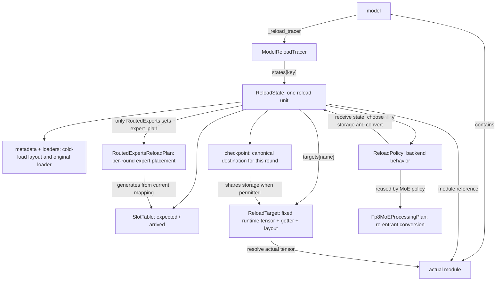
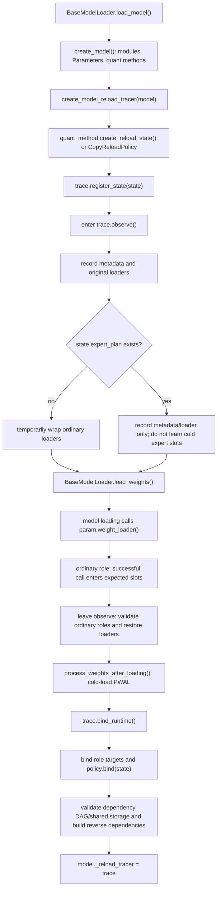
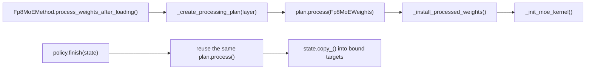
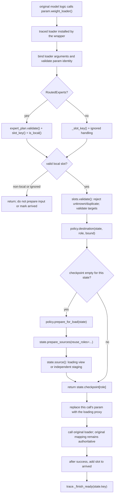
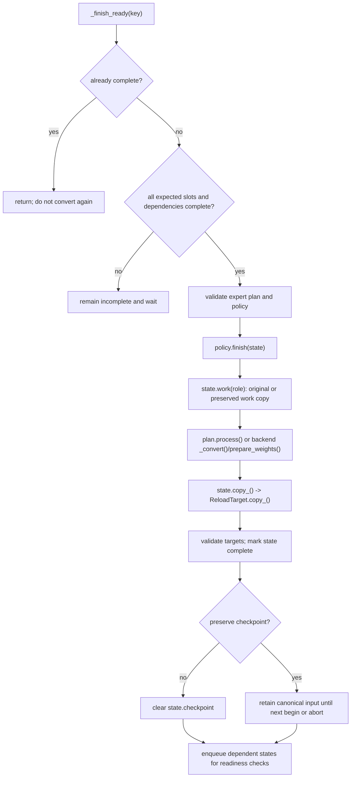

# Reload Flow Walkthrough and Complete Model Example

This document describes the current `reload_mode="trace"` path, not the
earlier whole-model atomic-commit proposal. Read the diagrams and example
first, then compare them with the
[policy storage-layout audit](reload-loading-layout.md). The coverage and
integration steps for other offline-quantization backends are documented in
[Offline Quantization Reload Integration](offline-quantization-reload-integration.md).

The three most important points are:

1. `model.load_weights()` and the parameter loaders still own name mapping,
   TP slicing, and physical writes.
2. The tracer records arrivals and schedules completion; the policy chooses
   loading destinations and performs conversion; the state stores the shared
   state.
3. A state calls `policy.finish()` as soon as its required inputs arrive.
   Model-level `trace.finish()` only validates and closes the round. It does
   not wait and then convert every layer, and it is not transaction commit or
   rollback.

## 1. Relationship Between the Abstractions



These objects are not interchangeable layers:

| Abstraction | Question it answers | What it does not own |
| --- | --- | --- |
| `ModelReloadTracer` | Which shard arrived? Which state can finish? | Quantization algorithms or expert placement |
| `ReloadState` | Where are this unit's inputs, targets, slots, and dependencies? | Model scheduling or checkpoint payloads |
| `ReloadPolicy` | How does this backend prepare, convert, and update targets? | NCCL/IPC messages or byte accounting |
| `Fp8MoEProcessingPlan` | How do canonical weights become backend runtime format? | Parameter/kernel installation or expert mapping |
| `RoutedExpertsReloadPlan` | Which physical expert shards belong to this rank? | Weight shuffling or quantization |
| `ReloadTarget` | Is the bound object, address, and layout still unchanged? | Old values or semantic mapping validation |

The two plans have different purposes: the processing plan handles conversion;
the expert plan handles placement. MoE cold load and reload reuse the
processing plan. Linear policies may instead use their own `_convert()` method
or a kernel's `prepare_weights()`.

### Key, Role, Slot, and Target

For `states["experts"]`:

```text
key    = "experts"             model-level reload unit
role   = "w13_weight"          one checkpoint input role
slot   = role + expert_id + shard_id
target = targets["w13_weight"] runtime target after processing
```

One role may have many slots. A derived target may have no loading role, such
as `g1_alphas` held by a kernel or quantization configuration.

`runtime_names` only declares a role-to-runtime-attribute mapping; it does not
infer conversions. A one-to-many derived mapping should use `None` for the
input role and let `policy.bind()` explicitly bind every output. The policy
then writes each output in `policy.finish()`.

## 2. Cold Load: Create Rules, Then Bind Runtime Objects



`observe()` does not retain incoming values and does not intercept
`Tensor.copy_()`. A loader return value of `False` means ignored; every other
normal return, including `None`, counts as a successful arrival. Observation
confirms that every ordinary role was seen at least once, but does not prove
that every byte was covered.

Cold-load PWAL may replace parameters, change layouts, and create derived
scales or kernels. Therefore `bind_runtime()` must run after cold processing
and capture the objects actually used for inference. Later reloads update those
objects' values and must not silently replace them.

### One-time and Re-entrant Work in MoE PWAL



Cold load may install objects. Reload does not call
`_install_processed_weights()` or initialize the kernel again. `plan.process()`
may mutate work inputs and allocate temporary tensors, so it must not be
treated as a side-effect-free function. When checkpoint values must be
preserved, the policy must obtain work values through `state.work()`.

## 3. Production Entry Points: START, UPDATE, FINISH

The model must have been cold-loaded with one of these configurations before a
later START can find its bound tracer:

```bash
--weight-transfer-config '{"backend":"nccl","reload_mode":"trace","preserve_checkpoint":false}'
--weight-transfer-config '{"backend":"ipc","reload_mode":"trace","preserve_checkpoint":false}'
```

```mermaid
sequenceDiagram
    participant Caller as update caller
    participant Engine as NCCL / IPC Engine
    participant Trace as ModelReloadTracer
    participant Model as model
    participant Loader as wrapped param.weight_loader

    Note over Caller,Model: pause inference, fix EPLB placement, and coordinate participating ranks
    Caller->>Engine: start_weight_update()
    Engine->>Engine: _start_checkpoint_reload()
    Engine->>Trace: begin_round(preserve_checkpoint=...)
    Note over Trace: validate runtime; build expert plan; clear round state; wrap loaders
    loop each transport chunk
        Caller->>Engine: update_weights(update_info)
        Engine->>Engine: parse_update_info() / receive_weights()
        Engine->>Model: load_weights(weights)
        Model->>Loader: weight_loader(param, loaded_weight, ...)
        Note over Loader,Trace: successful load updates slots; a ready state calls policy.finish()
        Engine->>Engine: torch.accelerator.synchronize()
    end
    Caller->>Engine: finish_weight_update()
    Engine->>Engine: _finish_checkpoint_reload()
    Engine->>Trace: finish()
    Note over Trace: validate no missing slots and all states complete; unwrap
    Note over Engine: IPC releases imported buffers for this round
    Note over Caller,Model: handle KV/prefix cache and resume inference
```

Packed NCCL reception also coordinates receive/load stream ordering. The tracer
does not synchronize CUDA work and is not a communication or cross-rank
barrier. The synchronization in `update_weights()` ensures the sender can
reuse transport buffers only after reads have completed.

### `begin_round()` Does Not Restore the Whole Model

`begin_round()` validates state, rebuilds expert slots, clears old checkpoint
references and arrivals, sets preservation options, and installs loader
wrappers. Inputs without a runtime counterpart may use a lightweight proxy.

Payload storage is prepared only when the first valid local shard for a state
arrives; the whole model is not staged at START.

## 4. Inside One Parameter-Loader Call



`prepare_for_load()` is an internal convention used by adapted policies; it is
not a required new method on the tracer protocol. FP8 policies share the
`_CanonicalReloadPolicy.destination()` path, while `CopyReloadPolicy` provides
the equivalent entry point. Marlin and Humming use the same preparation entry,
although packed weights still stage. Only scales or bias whose dtype, capacity,
and layout permit it reuse runtime storage. Packed conversion reuses the
cold-load processing plan and does not create a temporary layer, shell,
configuration, workspace, or live kernel.

`prepare_sources()` does not decide whether a backend conversion is safe for
storage reuse; the policy declares `reuse_roles` first. The common code then
checks dtype, capacity, canonical layout, and runtime density and constructs a
shared-storage view. Otherwise, or when `preserve_checkpoint=True`, it
allocates independent input storage. Runtime parameter shape and stride remain
unchanged.

There are two different copies:

```text
original loader: incoming shard -> checkpoint-layout loading destination
policy.finish:   converted result -> bound runtime target
```

The loading destination is not the communication receive tensor. It may alias
runtime storage or be staging. Even when loading aliases runtime storage,
conversion may produce temporary output before `state.copy_()` writes the
bound target.

## 5. Per-State Completion and the Two Finishes



| Function | Called when | Converts weights? |
| --- | --- | --- |
| `policy.finish(state)` | The last required slot and all dependencies arrive | Yes; once per state and round |
| `trace.finish()` | All communication chunks have ended | No; validates missing slots, completion, runtime, and placement |

Conversion may update several derived targets, such as CUTLASS per-tensor
`g1_alphas`, `g2_alphas`, `a1_gscale`, and `a2_gscale`. These objects must
remain stable, but they do not need checkpoint inputs with the same names.

Clearing the checkpoint dictionary only releases references; CUDA asynchronous
work and allocator caching may delay physical memory reclamation. If a loading
view aliases runtime storage, clearing the view does not release storage still
owned by the model. Loader wrappers remain installed until the round ends, so a
duplicate arrival is rejected rather than preparing inputs and finishing again.

## 6. Complete Model-Level Example

### 6.1 Model and Assumptions

The following is an educational model expanded against the real interfaces; it
is not a complete directly constructible model. A real model's `load_weights()`
must implement its own checkpoint-name mapping.

```text
DemoModel
├── embed_tokens       ordinary BF16 embedding, [16, 256]
├── proj               FP8 per-tensor linear, dynamic activation, no bias
├── experts            RoutedExperts, FlashInfer CUTLASS block FP8
└── lm_head            shares the same weight Parameter as embed_tokens
```

Assume TP=1, EP=1, two local experts, no redundant/shared experts, and a gated
activation. The MoE hidden size is 256, intermediate size is 128, and block
size is 128. To demonstrate EPLB, the two logical experts may swap physical
positions before START; placement is fixed after START. This configuration has
no cross-rank collective for static activation scales.

Automatic registration produces:

| state key | roles | policy | dependencies |
| --- | --- | --- | --- |
| `embed_tokens` | `weight` | `CopyReloadPolicy` | none |
| `proj` | `weight`, `weight_scale` | `TensorFP8LinearReloadPolicy` | none |
| `experts` | `w13_weight`, `w2_weight`, `w13_weight_scale_inv`, `w2_weight_scale_inv` | `CutlassMoEReloadPolicy` | none |
| `lm_head` | none; `weight` is an alias | `CopyReloadPolicy` | `embed_tokens` |

Because the embedding appears first, it owns the shared parameter. The loader
loads the shared weight once instead of writing `lm_head.weight` independently.
Unquantized attention units without independent reload parameters are omitted.

### 6.2 Cold-Loading Checkpoint A

Ordinary layers use loaders without extra shard arguments, so observation learns:

```python
embed_expected = {SlotKey("weight", ())}
proj_expected = {
    SlotKey("weight", ()),
    SlotKey("weight_scale", ()),
}
```

MoE records metadata and loaders for its four roles but does not learn A's
expert-arrival slots.

```text
MoE canonical shapes:
w13_weight            [2, 256, 256]   = [W1; W3] per expert
w2_weight             [2, 256, 128]
w13_weight_scale_inv  [2,   2,   2]   = [S1; S3] per expert
w2_weight_scale_inv   [2,   2,   1]
```

During cold-load PWAL:

- `proj` converts canonical NK weights to the runtime KN representation and
  processes scales. Even for a square matrix, transpose can change strides.
- `experts` creates an `Fp8MoEProcessingPlan`, swaps the W13 and block-scale
  halves, clamps block scales, installs converted Parameters, and initializes
  kernel/config objects.
- `bind_runtime()` captures the final objects and layouts. The policy records
  the kernel/config/plan, and `lm_head` binds the same embedding tensor as its
  alias target.

Checkpoint A can now serve inference. The tracer does not retain a second full
copy of checkpoint A.

### 6.3 START: Prepare for Checkpoint B

The caller pauses inference and fixes EPLB placement:

| Local physical position | Cold-load A | Round B |
| --- | --- | --- |
| physical 0 / local 0 | logical expert 0 | logical expert 1 |
| physical 1 / local 1 | logical expert 1 | logical expert 0 |

`begin_round()` calls `experts.expert_plan.build(state)` and reads the current
expert mapping.

Each physical expert has six slots:

```text
w13_weight            + w1
w13_weight            + w3
w2_weight             + w2
w13_weight_scale_inv  + w1
w13_weight_scale_inv  + w3
w2_weight_scale_inv   + w2
```

There are 12 expected slots for two experts. For physical expert 1's gate
weight:

```python
SlotKey(
    "w13_weight",
    (("expert_id", 1), ("shard_id", "w1")),
)
```

Here `expert_id` is the mapped physical expert id, not the logical checkpoint
expert id. The slot set may be unchanged after a simple swap, but the logical
weights now map to different physical positions; comparing slot keys alone is
not enough to prove placement is unchanged.

All state checkpoint dictionaries are still empty.

### 6.4 UPDATE: Three Chunks and Immediate State Completion

For simple counting, assume non-fused checkpoint inputs, with three weights and
three block-scale tensors per expert. Logical expert 0 maps to physical expert
1 in this round; logical expert 1 maps to physical expert 0.

| Chunk | Data in the chunk | State afterward |
| --- | --- | --- |
| 1 | `proj.weight`; logical expert 0 gate weight | proj 1/2; experts 1/12; both prepare inputs once |
| 2 | `proj.weight_scale`; embedding weight; five remaining pieces for logical expert 0 | proj complete; embedding and `lm_head` complete; experts 6/12 |
| 3 | six pieces for logical expert 1 | experts 12/12 and immediately complete |

There are 15 slots: one embedding, two linear, and twelve MoE slots. They are
not 15 roles and do not necessarily correspond to 15 transport messages. For
fused expert tensors, `RoutedExperts.load_weights()` expands the input into
per-expert loader calls; the tracer still tracks the resulting slots.

**Inside chunk 1:**

1. The first `proj` slot passes validation. `policy.destination()` sees an
   empty checkpoint and prepares the weight and scale.
2. `prepare_for_load()` calls `state.prepare_sources()`. The weight attempts
   to borrow dense KN runtime storage as an NK loading view; the tensor scale
   stages independently according to the policy.
3. The original loader writes the new weight. `proj` waits for its scale.
4. The first MoE gate weight is mapped to physical expert 1. The CUTLASS policy
   prepares the four canonical inputs; in this example all satisfy the alias
   conditions.
5. The loader writes the gate shard into the corresponding canonical W13 view.
   The runtime may contain old and new values at this point and must not serve.

**Inside chunk 2:**

1. When the `proj` scale arrives, `_finish_ready("proj")` calls its policy
   `finish()`. It obtains inputs through `state.work()`, converts them, and
   writes the bound target through `state.copy_()`.
2. `proj` becomes complete. By default its checkpoint inputs are cleared
   immediately; it does not wait for MoE or FINISH.
3. The embedding weight arrives and completes. The reverse dependency queue
   checks `lm_head`; it has no own slots, depends on the embedding, and completes
   its alias validation without copying the shared weight.
4. The remaining five pieces for logical expert 0 arrive. MoE is only 6/12 and
   continues waiting.

**Inside chunk 3:**

After the last MoE slot succeeds:

```text
_finish_ready("experts")
  -> CutlassMoEReloadPolicy.finish(state)
     -> process canonical roles through the existing processing plan
        -> W13 -> W31
        -> block S13 -> S31
        -> clamp block scales
     -> copy converted outputs into bound targets
  -> validate targets
  -> mark state complete
  -> clear state.checkpoint
```

The runtime Parameters, kernels, and configurations are not replaced. The
conversion may still allocate temporary output; an aliased input does not mean
that conversion is allocation-free.

### 6.5 FINISH, the Next Round, and Failure

At FINISH all four states are complete. `trace.finish()` rechecks targets,
policies, placement, missing slots, and completion, restores original loaders,
and closes the round. It does not call the four policies again.

For the next round C:

- runtime targets, kernels/configs, and processing plans are reused;
- ordinary expected slots remain those learned during cold load;
- the expert plan reads placement at the start of C;
- arrivals, completion, and checkpoint references reset per round;
- each state prepares loading storage again on its first valid local arrival.

If B is missing an expert scale, `trace.finish()` reports the missing slot;
already completed states are not rolled back. A duplicate slot is rejected
before another write. A placement change in the middle of a round is rejected
by expert-plan validation. `abort()` restores wrappers, releases checkpoint
references, and poisons the tracer; it does not restore A and does not permit
pretending that a new round repaired the failure.

An empty round returns `False` after state validation. It is not reported as a
successful full-model update.

### 6.6 `preserve_checkpoint=True`

The timing and completion rules are unchanged, but every input is independent
of runtime storage:

```text
incoming shards
    -> state.checkpoint: retained canonical local input
    -> state.work(): conversion copy
    -> plan/policy conversion
    -> state.copy_(): update fixed runtime target
```

After a successful finish, the checkpoint contains loader outputs for this rank
and the current mapping. It is not the global source checkpoint and is not a
reference to transport buffers. It remains until the next `begin_round()` or
`abort()`. Preservation does not provide rollback and does not change the
per-state completion timing.

## 7. Real Interface Code

Assume the model was cold-loaded through `BaseModelLoader.load_model()` with
trace configuration. The following helper can be used with a model exposing
`load_weights()`:

```python
import torch

from vllm.model_executor.model_loader.reload.integration import (
    get_model_reload_tracer,
)


def reload_checkpoint_chunks(model, chunks, *, preserve_checkpoint=False):
    """Pause inference and fix EPLB before calling this helper."""
    trace = get_model_reload_tracer(model)
    with trace.round(preserve_checkpoint=preserve_checkpoint):
        for weights in chunks:
            # weights is [(checkpoint_name, tensor), ...].
            # The original model loader reaches the wrapped parameter loaders.
            model.load_weights(weights)
            # Permit the next iteration to reuse incoming buffers.
            torch.accelerator.synchronize()
    # Normal exit already calls trace.finish(); exceptions call trace.abort().
    # This helper does not rerun PWAL or resume inference.
```

Production NCCL/IPC engines already call begin/finish and should not be wrapped
in another `trace.round()`:

```text
engine.start_weight_update()
engine.update_weights(chunk_1_metadata)
engine.update_weights(chunk_2_metadata)
engine.update_weights(chunk_3_metadata)
engine.finish_weight_update()
```

These update arguments are backend transport metadata, not the local tensor-list
format used by the helper. NCCL reception also requires sender coordination.
The production integration example is
`examples/rl/run_reload_trace_day0.py`.

## 8. Suggested Source-Reading Order

| Order | Code entry point |
| --- | --- |
| 1. Cold-load integration | [BaseModelLoader.load_model](../../../vllm/model_executor/model_loader/base_loader.py) |
| 2. State registration and shared-weight ownership | [create_model_reload_tracer / CopyReloadPolicy](../../../vllm/model_executor/model_loader/reload/integration.py) |
| 3. Lifecycle and storage | [ModelReloadTracer / ReloadState / ReloadTarget](../../../vllm/model_executor/model_loader/reload/trace.py) |
| 4. Backend rules and preparation | [FP8 policies](../../../vllm/model_executor/model_loader/reload/fp8.py) |
| 5. Re-entrant MoE conversion | [Fp8MoEProcessingPlan](../../../vllm/model_executor/layers/quantization/utils/fp8_processing.py) |
| 6. Per-round expert slots | [RoutedExpertsReloadPlan](../../../vllm/model_executor/model_loader/reload/moe.py) |
| 7. Expert checkpoint expansion and name mapping | [RoutedExperts.load_weights](../../../vllm/model_executor/layers/fused_moe/routed_experts.py) |
| 8. START/UPDATE/FINISH integration | [WeightTransferEngine](../../../vllm/distributed/weight_transfer/base.py) |

Do not treat the state dependency DAG as forward execution order: only
explicit dependencies affect completion order. Also do not interpret complete
slot coverage as a byte-level proof that two different slots cannot overlap;
the trace path does not use `CopyCounter` to detect overlapping slices and still
relies on the loader's sharding contract.
