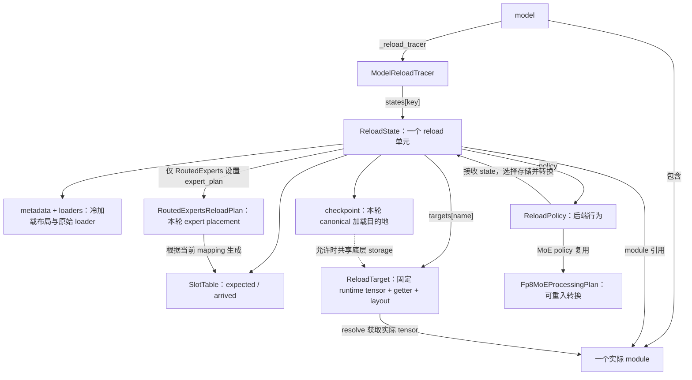
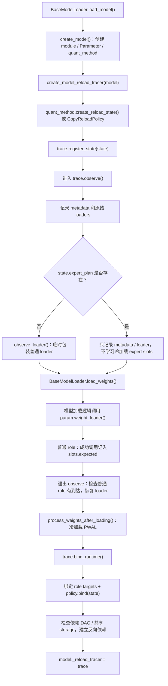
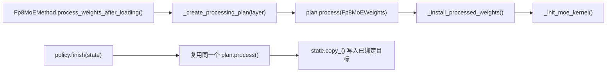
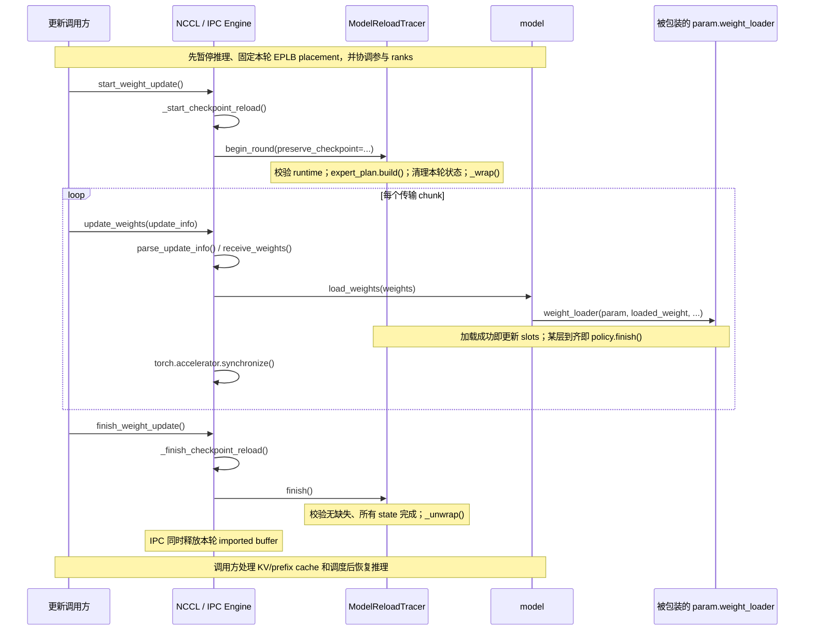
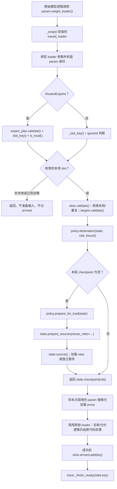
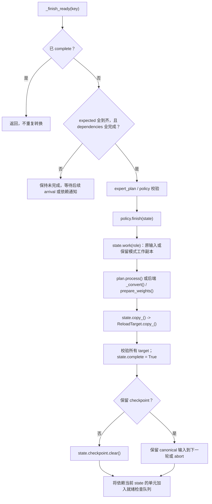

# Reload 调用流程与完整模型示例

本文描述当前代码中的 `reload_mode="trace"` 路径，而不是早期的全模型原子提交提案。
建议先读流程图和示例，再对照 [policy 存储布局排查表](reload-loading-layout.md)。
其他离线量化的覆盖范围与接入步骤见
[离线量化 Reload 接入排查与实施指南](offline-quantization-reload-integration.md)。

最重要的三条：

1. 原始 `model.load_weights()` 和参数 loader 仍负责名称映射、TP 切片和数据写入。
2. tracer 负责记录到达与调度；policy 负责加载目的地和转换；state 保存二者共享的状态。
3. 每层到齐立即执行 `policy.finish()`。模型级 `trace.finish()` 只做最终检查和收尾，
   不等所有层到齐后才统一转换，也不是事务提交或回滚机制。

## 1. 抽象之间的关系



这些对象不是相互替代的层级封装：

| 抽象 | 它回答的问题 | 它不负责什么 |
| --- | --- | --- |
| `ModelReloadTracer` | 哪个分片到了？哪一层现在可以 finish？ | 不实现量化算法，不决定专家去哪个位置 |
| `ReloadState` | 这一层的输入、目标、槽位、依赖在哪里？ | 不自己调度模型，也不是一份 checkpoint payload |
| `ReloadPolicy` | 这一后端如何准备输入、转换并更新目标？ | 不接收 NCCL/IPC 消息，不统计字节数 |
| `Fp8MoEProcessingPlan` | canonical 权重如何变成这个后端的运行格式？ | 不安装 Parameter/kernel，不保存 expert mapping |
| `RoutedExpertsReloadPlan` | 本轮哪些物理专家分片属于本 rank？ | 不 shuffle 或量化权重 |
| `ReloadTarget` | 更新的是否仍是绑定过的对象、地址和布局？ | 不保存旧数值，也不能自动判断语义映射是否正确 |

两种 plan 完全不同：**processing plan 管转换，expert plan 管位置**。
当前 MoE 冷加载和 reload 复用 processing plan；并非所有 linear policy 都使用这个类，
linear 还会通过各自的 `_convert()` 或 kernel 的 `prepare_weights()` 完成转换。

### key、role、slot、target 的区别

以 `states["experts"]` 为例：

```text
key    = "experts"                  模型级 reload 单元名
role   = "w13_weight"               该单元的一个 checkpoint 输入参数
slot   = role + expert_id + shard_id
target = targets["w13_weight"]      PWAL 后绑定的运行时目标
```

一个 role 可以对应很多 slot。一个派生 target 也可以不对应任何加载 role，
例如 kernel/config 中的 `g1_alphas`。

`runtime_names` 只声明 role 到运行时属性名的对应关系，不自动推导转换。
一对多派生应将输入 role 映射为 `None`，由 `policy.bind()` 显式绑定多个输出。
`policy.finish()` 再分别写入这些输出。

## 2. 冷加载：创建规则，再绑定最终运行时对象



`observe()` 不保存 incoming tensor 数值，也不拦截 `Tensor.copy_()`。
普通 loader 返回 `False` 表示忽略；其他正常返回，包括 `None`，记为成功到达。
它验证每个普通 role 至少观察到一个 slot，但不证明所有字节都被覆盖。

冷加载 PWAL 可以替换参数、改变布局、创建派生 scale 和 kernel。
因此必须在它之后 `bind_runtime()`，捕获真正参与推理的最终对象。
之后 reload 只更新这些对象的值，不能悄悄替换它们。

### MoE PWAL 中的一次性工作和可重入工作



冷加载允许安装对象；reload 不调用 `_install_processed_weights()` 或重新初始化 kernel。
`plan.process()` 可能修改工作输入、创建转换临时 tensor，不能理解成无副作用的纯函数。
需要保留 checkpoint 时，policy 必须通过 `state.work()` 获取工作副本。

## 3. 生产入口：START、UPDATE、FINISH

冷加载时已使用以下配置之一，才能在后续 START 获取 bound tracer：

```bash
--weight-transfer-config '{"backend":"nccl","reload_mode":"trace","preserve_checkpoint":false}'
--weight-transfer-config '{"backend":"ipc","reload_mode":"trace","preserve_checkpoint":false}'
```



NCCL packed 接收还负责跨 receive/load stream 的等待关系。
tracer 自身不做 CUDA 同步；不能把它当作通信完成或跨 rank barrier。
`update_weights()` 的同步用于保证读取完成后发送方才能复用传输 buffer。

### begin_round() 并不恢复整个模型的加载布局

它只检查状态、重建 expert slots、清空旧 checkpoint 引用和 arrived、
设置保留选项，并安装 loader 包装。没有对应 runtime 参数的输入可以安装轻量 proxy。

真正的 payload 存储准备发生在**某一层首次有效本地分片到达时**，
而不是 START 时为全模型分配所有暂存。

## 4. 一次参数 loader 调用内部发生什么



这里 `prepare_for_load()` 是当前已适配 policy 的内部约定，
不是 tracer 直接调用的新增必选 Protocol 方法。
FP8 policy 通过 `_CanonicalReloadPolicy.destination()` 共用这段逻辑；
`CopyReloadPolicy` 实现等价入口。Marlin/Humming 也使用统一准备入口，
但 packed 权重仍暂存；只有 policy 允许且 dtype、容量、布局兼容的 scale/bias
才会复用 runtime storage。打包转换调用冷加载保存的 processing plan，
不构造临时 layer/shell、不重新创建配置或初始化 workspace，也不重建 live kernel。
具体调用边界见 [Marlin/Humming processing plans](reload-loading-layout.md#marlinhumming-processing-plans)。

`prepare_sources()` 不负责判断某个后端的转换是否适合复用；policy 先声明 `reuse_roles`。
它再检查 dtype、容量、canonical 布局和 runtime 稠密性，构造共享 storage 的加载 view。
不满足条件，或 `preserve_checkpoint=True`，则分配独立输入。
runtime Parameter 的 shape/stride 不变，旧数值也不需要逆变换。

注意两次不同的“拷贝”：

```text
原始 loader：incoming shard -> checkpoint-layout 加载目的地
policy.finish：转换结果 -> 已绑定 runtime target
```

加载目的地不是通信接收 tensor。它可能 alias runtime，也可能是暂存。
即使加载已 alias，转换仍可能产生临时结果，再由 `state.copy_()` 写回。

## 5. 逐层完成，以及两个 finish 的区别



| 函数 | 调用时机 | 是否转换权重 |
| --- | --- | --- |
| `policy.finish(state)` | 本层最后一个必需 slot 到达且依赖完成时 | 是；一层一轮执行一次 |
| `trace.finish()` | 所有通信 chunks 结束后 | 否；验证 missing、complete 和 runtime/placement |

转换还可能更新多个派生 target，例如 per-tensor CUTLASS 的
`g1_alphas`、`g2_alphas`、`a1_gscale`、`a2_gscale`。
这些对象需要稳定，但不要求在 checkpoint 中拥有同名输入。

清理 checkpoint 字典只是释放引用；CUDA 异步工作和 allocator 缓存可能延迟物理内存回收。
若输入 alias runtime，清理加载 view 不会释放仍被模型持有的 runtime 存储。
层完成后 loader 包装仍保留到整轮结束，因此再次到达相同 slot 会报重复，
不会因为 checkpoint 已清空而重新准备、重复 finish。

## 6. 完整模型级示例

### 6.1 模型与假设

下面是按真实接口展开的教学模型，不是可直接构建的完整模型实现。
实际模型的 `load_weights()` 必须完成相应名称映射；不假定所有模型使用相同 checkpoint 名。

```text
DemoModel
├── embed_tokens       普通 BF16 embedding，[16, 256]
├── proj               FP8 per-tensor linear，动态 activation，无 bias
├── experts            RoutedExperts，FlashInfer CUTLASS block FP8
└── lm_head            与 embed_tokens 共享同一个 weight Parameter
```

约定 TP=1、EP=1、两个本地专家、无 redundant/shared experts，gated activation；
MoE 的 hidden size=256、intermediate size=128、block size=128。
为展示 EPLB，本轮允许在 START 前交换两个逻辑专家的位置，START 后不再改变。
该配置不涉及静态 activation scale 的跨 rank collective。

自动注册得到：

| state key | roles | policy | dependencies |
| --- | --- | --- | --- |
| `embed_tokens` | `weight` | `CopyReloadPolicy` | 无 |
| `proj` | `weight`、`weight_scale` | `TensorFP8LinearReloadPolicy` | 无 |
| `experts` | `w13_weight`、`w2_weight`、`w13_weight_scale_inv`、`w2_weight_scale_inv` | `CutlassMoEReloadPolicy` | 无 |
| `lm_head` | 空；`weight` 是 alias | `CopyReloadPolicy` | `embed_tokens` |

假设遍历时 embedding 先出现，它就是共享 Parameter 的 owner。
checkpoint/model loader 只加载这份共享权重一次，不再独立写入 `lm_head.weight`。
非量化 attention 等无独立 reload 参数的单元在此示例中省略。

### 6.2 冷加载 checkpoint A

普通层使用没有额外 shard 参数的 loader，因此 observe 学到：

```python
embed_expected = {SlotKey("weight", ())}
proj_expected = {
    SlotKey("weight", ()),
    SlotKey("weight_scale", ()),
}
```

MoE 则只记录四个 role 的 metadata/loader，不学习 A 的 expert 到达槽位。

```text
MoE canonical shapes：
w13_weight            [2, 256, 256]   = 每专家 [W1; W3]
w2_weight             [2, 256, 128]
w13_weight_scale_inv  [2,   2,   2]   = 每专家 [S1; S3]
w2_weight_scale_inv   [2,   2,   1]
```

冷加载 PWAL：

- `proj` 将 canonical NK 权重转换为运行时 KN 表示，处理 scale。
  即使本例是方阵，transpose 前后 stride 仍可不同。
- `experts` 创建 `Fp8MoEProcessingPlan`，交换 W13 和 block scale 的两半，
  clamp block scale，再安装转换后的 Parameter 并初始化 kernel/config。
- `bind_runtime()` 记录最终对象和布局，policy 记录 kernel/config/plan；
  `lm_head` 绑定同一个 embedding tensor 作为 alias 校验目标。

之后 A 可以用于推理。tracer 没有额外保存一份完整 checkpoint A。

### 6.3 START：准备接收 checkpoint B

调用方暂停推理，并将 EPLB placement 固定为：

| 本地物理位置 | 冷加载 A | 本轮 B |
| --- | --- | --- |
| physical 0 / local 0 | logical expert 0 | logical expert 1 |
| physical 1 / local 1 | logical expert 1 | logical expert 0 |

`begin_round()` 调用 `experts.expert_plan.build(state)`，
读取当前 `get_expert_mapping()` 和 global-to-local 映射。

本例每个物理专家需要六个 slot：

```text
w13_weight            + w1
w13_weight            + w3
w2_weight             + w2
w13_weight_scale_inv  + w1
w13_weight_scale_inv  + w3
w2_weight_scale_inv   + w2
```

两个专家共 12 个 expected slots。以物理专家 1 的 gate 权重为例：

```python
SlotKey(
    "w13_weight",
    (("expert_id", 1), ("shard_id", "w1")),
)
```

这里 `expert_id` 是映射后的物理专家 ID，不是 checkpoint 名字里的逻辑专家编号。
本例只是交换位置，slot 数量甚至 slot key 集合都可能不变，
但逻辑权重对应的物理位置已经改变；不能只比较 key 集合判断 placement 未变。

此时各层 `checkpoint` 仍为空，没有全模型暂存。

### 6.4 UPDATE：三个 chunk，逐层完成

为便于计数，下面使用非 fused checkpoint，每个专家有三份权重和三份 block scale。
checkpoint 逻辑专家 0 的六份数据，本轮都映射到 physical 1。
逻辑专家 1 的六份数据映射到 physical 0。

| Chunk | 本 chunk 的数据 | 本 chunk 后的状态 |
| --- | --- | --- |
| 1 | `proj.weight`；logical expert 0 的 gate weight | proj 1/2；experts 1/12；两层各准备一次输入 |
| 2 | `proj.weight_scale`；embedding weight；logical expert 0 剩余五份数据 | proj 完成；embedding 和 lm_head 完成；experts 6/12 |
| 3 | logical expert 1 的六份数据 | experts 12/12，立即完成 |

一共加载 15 个 slot：embedding 1、linear 2、MoE 12。
不是 15 个 role，也不一定对应实际传输中的 15 条消息。
如果 checkpoint 使用 fused expert tensor，
`RoutedExperts.load_weights()` 会展开成相应的逐专家 loader 调用，
tracer 仍按这些调用形成的 slots 计数。

**Chunk 1 内部：**

1. proj 的第一个 slot 通过检查后，`policy.destination()` 发现 checkpoint 为空。
2. `prepare_for_load()` 调用 `state.prepare_sources()` 准备 weight 和 scale。
   weight 尽量借用 KN runtime 的稠密存储来建立 NK 加载视图；
   tensor scale 按该 policy 的规则独立暂存。
3. 原始 loader 写入新 weight，proj 尚缺 scale，所以不转换。
4. MoE 的第一份 gate weight 经过当前 expert mapping 到达 physical 1。
   CUTLASS policy 一次准备四个 canonical 输入；本例四者满足 alias 条件。
5. loader 将 gate shard 写进 canonical W13 view 的相应位置。
   其余 slots 尚未到齐，runtime 中此时可能混有旧值和新值，不能推理。

**Chunk 2 内部：**

1. proj scale 到达后，`_finish_ready("proj")` 立即调用该 policy 的 `finish()`。
   它从 `state.work()` 取输入，转换后 `state.copy_()` 写回绑定对象。
2. proj 被标记 complete，默认不保留 checkpoint，因此立即清理输入引用。
   不等待 MoE，也不等待 FINISH 请求。
3. embedding weight 到达并完成，反向依赖队列继续检查 `lm_head`。
   lm_head 无自己的 slots，依赖已完成，其 policy finish 不拷贝共享权重，
   只按生命周期完成 alias state 的检查与标记。
4. logical expert 0 的其余五份数据到达后，MoE 只有 6/12，继续等待。

**Chunk 3 内部：**

最后一个 MoE slot 成功后：

```text
_finish_ready("experts")
  -> CutlassMoEReloadPolicy.finish(state)
     -> _process_moe_weights(state, plan)
        -> state.work(四个 role)
        -> plan.process(Fp8MoEWeights(...))
           -> convert_fp8_moe_weights_for_fi(...)
              -> W13 -> W31
              -> block S13 -> S31
              -> clamp block scales
     -> _copy_moe_weights(state, outputs)
        -> state.copy_(role, output)
           -> ReloadTarget.copy_(output)
     -> plan.derived_scales(outputs)  # 本例为 block，返回空字典
  -> 校验 targets
  -> state.complete = True
  -> state.checkpoint.clear()
```

对于 physical 1，转换前后分别是：

```text
canonical view: [gate_B(logical 0); up_B(logical 0)]
runtime target: [up_B(logical 0); gate_B(logical 0)]
```

block scale 同样交换；physical 0 则承载 logical expert 1。
整个过程没有替换 runtime Parameter、kernel 或 config。
`swap_w13_to_w31()` 仍可能产生临时输出；alias 输入不意味着转换零暂存。

### 6.5 FINISH、下一轮与失败

FINISH 到达时，本例四个 state 已 complete。
`trace.finish()` 重新检查 target、policy、placement、missing 和 complete，
恢复原始 loader，然后关闭本轮。它不会再次调用四个 policy 的 finish。

下一轮 C：

- 继续使用相同 runtime targets、kernel/config 和 processing plan；
- 普通 expected slots 继续使用冷加载记录；
- expert plan 重新读取 C 开始时的 placement；
- arrived、complete、checkpoint 等逐轮状态重置；
- 每层第一次有效到达时重新执行加载准备。

如果 B 少一份 expert scale，`trace.finish()` 会报 missing；
已经完成的 proj/embedding 不会回滚。如果某个 slot 重复，则在再次写入之前拒绝；
如果 placement 在本轮中途改变，expert plan 校验会拒绝继续加载。
`abort()` 恢复包装、释放 checkpoint 引用并将 tracer 标记失败，
但不会恢复 A，也不允许直接开始下一轮来假装恢复成功。

未发生任何 managed loader 写入的空轮，在状态校验通过后由 `finish()` 返回 `False`，
它不是“成功覆盖了全模型”。

### 6.6 打开 preserve_checkpoint 后有什么不同

时序和完成条件不变，但所有输入都独立于 runtime：

```text
incoming shards
    -> state.checkpoint：保留 canonical 本地输入
    -> state.work()：转换用副本
    -> plan / policy 转换
    -> state.copy_()：更新固定 runtime target
```

成功 finish 后，checkpoint 保存的是本 rank、当前 mapping 下的 loader 输出，
不是全局原始 checkpoint，也不是 incoming 传输 buffer 的引用。
它一直保留到下一轮 begin 或 abort。保留选项不提供回滚，也不改变逐层写入时机。

## 7. 与上述示例对应的真实接口代码

假设模型已经通过 `BaseModelLoader.load_model()` 和 trace 配置完成冷加载；
以下函数可以直接用于有 `load_weights()` 的该模型。
模型构造、checkpoint 名称适配和通信建立不在这个函数中重做。

```python
import torch

from vllm.model_executor.model_loader.reload.integration import (
    get_model_reload_tracer,
)


def reload_checkpoint_chunks(model, chunks, *, preserve_checkpoint=False):
    """调用前必须暂停推理、固定 EPLB，并准备好全部参与 rank。"""
    trace = get_model_reload_tracer(model)
    with trace.round(preserve_checkpoint=preserve_checkpoint):
        for weights in chunks:
            # weights 是 [(checkpoint_name, tensor), ...]。
            # 模型的原始加载逻辑最终调用被 trace 包装的参数 loader。
            model.load_weights(weights)
            # 示例允许下一轮迭代复用 incoming buffers，故在此完成读取。
            torch.accelerator.synchronize()
    # 正常退出 round 时已经 trace.finish()；异常会 trace.abort()。
    # 这里不重复调用 PWAL，不替换模型，也不自动恢复推理。
```

生产 NCCL/IPC 引擎已经调用 begin/finish，不要再套一层 `trace.round()`：

```text
engine.start_weight_update()
engine.update_weights(chunk_1_metadata)
engine.update_weights(chunk_2_metadata)
engine.update_weights(chunk_3_metadata)
engine.finish_weight_update()
```

这些 update 参数是各 backend 的传输 metadata，不是上面本地函数的 tensor 列表。
NCCL 接收还要求发送侧配合，不能把这四行当作独立的 trainer/worker 联调脚本。
生产接入示例见 `examples/rl/run_reload_trace_day0.py`。

## 8. 建议的源码阅读顺序

| 阅读顺序 | 代码入口 |
| --- | --- |
| 1. 冷加载接入点 | [BaseModelLoader.load_model](../../../vllm/model_executor/model_loader/base_loader.py) |
| 2. 各层注册与共享权重 owner | [create_model_reload_tracer / CopyReloadPolicy](../../../vllm/model_executor/model_loader/reload/integration.py) |
| 3. 生命周期与存储 | [ModelReloadTracer / ReloadState / ReloadTarget](../../../vllm/model_executor/model_loader/reload/trace.py) |
| 4. 后端规则与准备入口 | [FP8 policies](../../../vllm/model_executor/model_loader/reload/fp8.py) |
| 5. 可重入的 MoE 转换 | [Fp8MoEProcessingPlan](../../../vllm/model_executor/layers/quantization/utils/fp8_processing.py) |
| 6. 每轮专家槽位 | [RoutedExpertsReloadPlan](../../../vllm/model_executor/model_loader/reload/moe.py) |
| 7. 专家 checkpoint 展开与名称映射 | [RoutedExperts.load_weights](../../../vllm/model_executor/layers/fused_moe/routed_experts.py) |
| 8. START/UPDATE/FINISH 接入 | [WeightTransferEngine](../../../vllm/distributed/weight_transfer/base.py) |

不要把 state 的依赖 DAG 当作 forward 执行顺序：只有显式 dependencies 才影响完成顺序。
也不要把“槽位完整”理解为逐字节完整性证明：这里不使用 CopyCounter，
不自动检测两个不同 slot 是否写入了重叠切片，仍依赖原 loader 的 sharding 契约。
