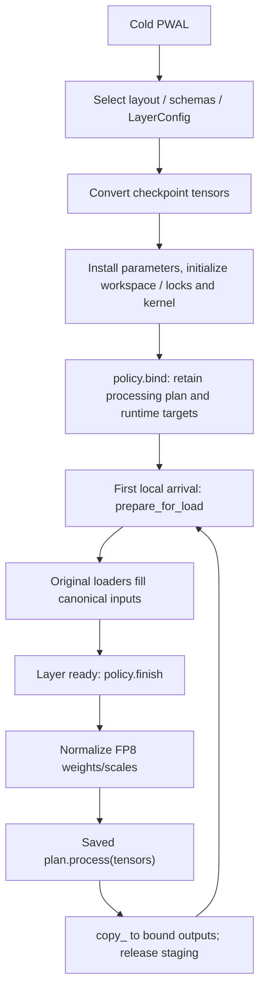

# Reload Loading Layout Audit

完整调用关系和模型级示例见 [Reload 流程导读](reload-flow-walkthrough.md)。

## Lifecycle

The first validated local arrival calls `policy.prepare_for_load(state)`.
Preparation creates canonical loader inputs for all roles in that state.
Subsequent arrivals reuse them. Nonlocal, ignored and invalid slots do not
trigger preparation. Completion still requires every expected slot and every
dependency. `finish()` converts inputs and writes the bound runtime outputs.

`ReloadState.prepare_sources(reuse_roles=...)` implements shared allocation:

- The policy explicitly selects roles whose storage may be reused.
- A dense runtime allocation can lend its physical-order prefix to a contiguous
  checkpoint-layout view, including transposed or padded runtime tensors.
- The original runtime object, address, shape and strides remain unchanged.
- Different dtypes, insufficient capacity, missing targets and incompatible
  layouts use staging. Encoded scales are not reinterpreted as FP32.
- `preserve_checkpoint=True` disables reuse; destructive conversion uses working
  copies through `state.work()`.

This restores a writable layout, not old checkpoint values. It assumes a complete
reload with inference paused and expert placement fixed for the round.
Conversions may still allocate scratch. Failure after a runtime write is not
rolled back; this design does not support partial checkpoint updates.

## Policy Coverage

| Policy | Reusable input roles | Exceptions |
| --- | --- | --- |
| `CopyReloadPolicy` | All owned roles | Shared aliases remain owned by another state |
| `TensorFP8LinearReloadPolicy` | Weight, bias | Merged weight scales and activation scales stage |
| `XPUTensorFP8LinearReloadPolicy` | Weight, bias | Inherits tensor policy; KN storage provides canonical NK view |
| `AiterTensorFP8LinearReloadPolicy` | Weight, bias | Shuffle runs again at finish; FNUZ dtype mismatch stages |
| `B12xTensorFP8LinearReloadPolicy` | Bias | Opaque packed dataclass leaves are not reused as inputs |
| `BlockFP8LinearReloadPolicy` | All roles | Shared capacity/layout/dtype checks apply |
| `CPUBlockFP8LinearReloadPolicy` | Scale, bias; all roles in direct mode | Packed weight stays staged |
| `AiterBlockFP8LinearReloadPolicy` | All roles | Re-shuffle at finish; encoded/FNUZ dtype mismatch stages |
| `XPUBlockFP8LinearReloadPolicy` | All roles | Ragged scale expansion and BMM caches still rebuilt at finish |
| `B12xBlockFP8LinearReloadPolicy` | All roles | Native block layout; encoded-to-FP32 scale conversion stages |
| `DeepGEMMReloadPolicy` | All roles | Packed scales reuse only with compatible dtype and layout |
| `PlainMoEReloadPolicy` | All roles | Reduced scales may have insufficient runtime capacity |
| `PlannedMoEReloadPolicy` | All roles except CPU packed weights | Covers Triton/CUTLASS batched variants, TRTLLM, HPC, AITER, XPU and CPU |
| `CutlassMoEReloadPolicy` | W13/W2 weights and both block scales | Per-tensor scales stage |
| `MarlinFP8LinearReloadPolicy` | Bias | Packed int32 weights, exponent-adjusted scales and discarded activation scales stage |
| `MarlinMoEReloadPolicy` | Compatible activation scales | Packed weights and exponent-adjusted weight scales stage |
| `HummingFP8LinearReloadPolicy` | Compatible weight scales and bias | Packed int32 weights stage; deleted/encoded/undersized scale targets stage |
| `HummingMoEReloadPolicy` | Compatible weight/activation scales | Packed weights stage; additional derived scales remain output-only |

Marlin and Humming now use the same first-arrival preparation lifecycle.
Their repeatable packing uses cold-bound processing plans, not temporary
layers/shells; the live kernels, configs, workspaces and target tensors are
retained. Their packed weight bytes
are not reinterpreted as FP8 loading storage. This is a conservative staging
boundary, not a claim that a backend-specific byte-view implementation is
impossible. Humming's renamed block scales resolve through `runtime_names`;
derived scale outputs are not added to the checkpoint roles.
No change to backend selection or accepted quantization configurations is implied.

## Marlin/Humming Processing Plans



- `MarlinFP8LinearProcessingPlan` and `MarlinFP8MoEProcessingPlan` hold fixed
  dimensions, padding, dtype and quantization metadata. Their `process` methods
  repack weights/scales/bias without a layer, parameter installation or workspace
  allocation. The existing `prepare_fp8_*_for_marlin` entry points create the
  plans and install state during cold PWAL.
- `HummingLinearProcessingPlan` includes the captured input names/dimensions;
  reload does not reconstruct parameter subclasses on a shell.
- `HummingFP8MoEProcessingPlan` owns per-sublayer conversion plans, repeats the
  normalized W13 scale for gated per-tensor inputs, and returns public scale
  aliases plus derived outputs. It contains no expert-placement mapping.
- `HummingTensorProcessingPlan` retains the source/converted schemas and the
  cold-selected `LayerConfig`. Reload calls the source schema's tensor conversion
  and `transform_humming_tensors` with that fixed config. It does **not** call
  schema factories, input-schema conversion, `prepare_layer_config`, kernel
  construction, or lock/workspace initialization.
- Humming's external `convert_humming` API returns a schema alongside tensors.
  The plan checks that it still matches the cold schema before transformation;
  that returned schema is not installed into live state. This remaining API
  coupling is explicit, not a temporary-layer fallback.
- Policies reject replaced plans/config/schema bindings. Humming additionally
  checks the full output name/shape/dtype set before copying derived outputs.
  These checks do not provide rollback for aliased checkpoint writes.

## Verification Boundaries

Tests check dense reuse versus staging, preservation, once-per-round preparation,
runtime identities/layouts, repeated reload values, and available native forward
and CUDA Graph comparisons. Platform conversion tests with substitute kernels
do not establish native AMD/XPU/AMX/SM120 execution correctness.
No peak-memory reduction or full-model accuracy result is claimed by this audit.

Final H200 regression: job `b968e0b39220`, actual `status=ok rc=0`,
**249 passed, 2 skipped**. The two native PyTorch block-GEMM cases require a
CUDA >= 12.9 build; the fixed runtime is CUDA 12.8. Separate cold/reload conversion
cases for that backend passed. The initial broad run exposed this environment
restriction before reload; a later test-fixture correction constructed non-dense
meta tensors directly because `.to("meta")` compacts their strides.

The selected tests span `tests/quantization/test_fp8.py`,
`tests/model_executor/model_loader/test_reload.py`, and
`tests/model_executor/kernels/test_b12x_linear.py`. Final workload log:
`/inspire/hdd/global_user/wangtongyu-25057/vllm-reload-trace-20260915/all-policy-loading-layout-review-04.log`.

### Marlin/Humming Follow-up (2026-09-19)

The targeted loading-layout/lifecycle run completed on H200 with
`status=ok rc=0`: **42 passed, 361 deselected**. It covers all four policies,
two successive reloads, per-tensor/block scales, checkpoint preservation,
runtime tensor identities, renamed and derived scales, and changed expert
placement between rounds. Marlin tests retain the real scale/bias conversion
but substitute its native repack operator; Humming lifecycle tests substitute
the optional packing library. These are not native forward/graph results.

```bash
/inspire/hdd/global_user/wangtongyu-25057/miniconda3/envs/vllm/bin/python -m pytest \
  tests/quantization/test_fp8.py \
  tests/model_executor/model_loader/test_reload.py \
  -k 'reload_trace and (packed_policy or ((marlin or humming) and lifecycle))' \
  -v --tb=short
```

The command used the same fixed absolute interpreter described above.
Log: `marlin-humming-loading-layout-review-02.log` in the same remote worktree.
The preceding native-inclusive attempt (`reload_trace and (marlin or humming
or packed_policy)`) reported **30 passed, 22 failed**. All 22 failed during cold
loading: the installed Marlin `_C::gptq_marlin_repack` ABI still requires `perm`,
unlike this source tree, and the installed Humming package lacks
`humming.transform`. No dependency changes or test skips were used to hide these
failures. Native validation remains blocked until the fixed environment matches
the source; the passing lifecycle selection does not resolve that gap.

### Processing-plan Split (2026-09-19)

After removing temporary shells and cold-only work from the four policies:

- Expanded FP8 regression: **279 passed, 2 skipped, 156 deselected**,
  `marlin-humming-processing-plan-review-02.log`.
- Final focused regression: **50 passed, 391 deselected**,
  `marlin-humming-processing-plan-review-03.log`.
- Both H200 runs completed with `status=ok rc=0`; pre-commit passed.

The focused selection uses the same interpreter/environment and these files:

```text
tests/quantization/test_fp8.py
tests/model_executor/model_loader/test_reload.py
tests/model_executor/kernels/test_b12x_linear.py
```

```bash
-k '(reload_trace and (packed_policy or ((marlin or humming) and lifecycle))) or (humming and processing_plan) or marlin_prepare_layer_preserves_workspace_address'
```

It checks that reload does not add schema-factory/config-preparation or Marlin
workspace calls, retains the cold plan, rejects replaced plan/config/schema
bindings, and rejects schema drift before transformation. Cold versus replayed
input standardization is checked for both FP8 and already-packed int32 weights.
The Humming test double now replaces the external schema/transform library, not
the production cold-load helper; Marlin substitutes only the native repack op.
The native execution limitations above still apply.
