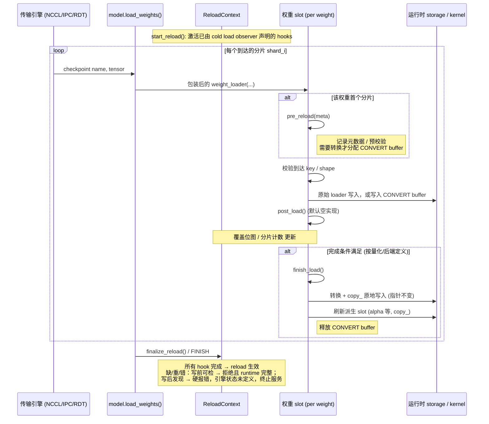
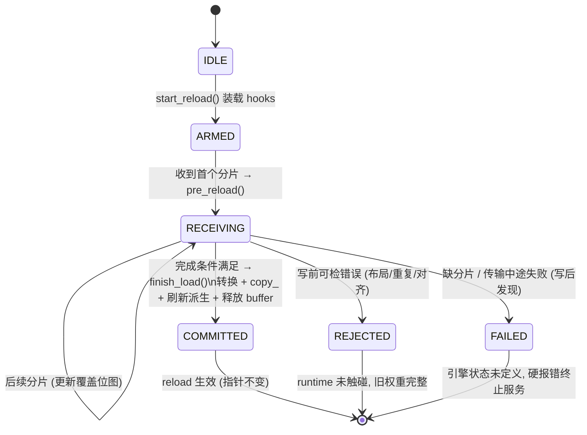
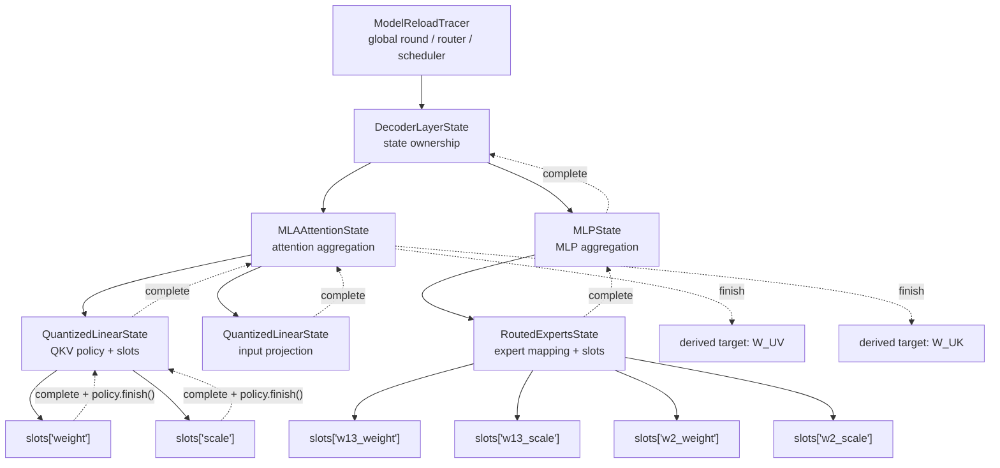
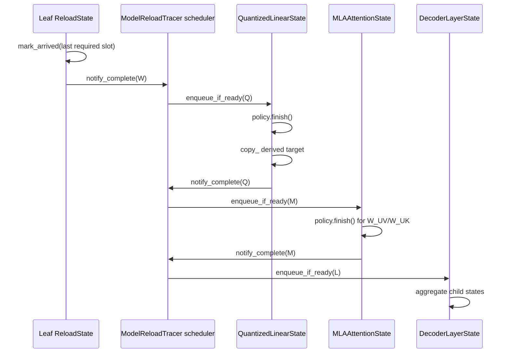

# Weight Reload 抽象设计

状态：设计演进记录，包含早期提案和后续实现记录。

> 当前实现导读：[Reload 调用流程与完整模型示例](reload-flow-walkthrough.md)。
> 其中包含调用流程图、对象关系、逐 chunk 示例和源码阅读顺序。
> 本文早期章节中的“全模型一次提交”等描述属于历史提案；
> 当前 trace 实现逐层完成、允许原地写入，失败不回滚，不应混为同一套保证。

适用范围：`vllm/model_executor/model_loader/reload/` 下的运行时权重热更新路径，
以及量化方法（FP8 dense / CUTLASS FP8 MoE 等）与 reload 流程的交互面。

## 1. 设计目标（硬约束）

按优先级排序，任何抽象层的取舍都必须服从以下四条：

1. **权重完整加载**：一次 reload 只有在"计划内每一个目标张量都被完整、
   恰好一次地写入"之后才允许生效。任何缺失分片、重复分片、形状/精度不匹配
   都必须在写入运行时存储之前被拒绝，而不是以部分写入的状态暴露给推理。
2. **运行时权重指针不偏移（CUDA graph 稳定性）**：reload 后所有被 CUDA
   graph 捕获的权重地址必须逐字节不变。即：
   - 不替换 `Parameter` 对象、不重新分配底层 storage、不新建 kernel 对象；
   - 所有写入都是 `copy_` 到既有 storage；
   - 只有 cold load（首次加载）允许安装 Parameter 与 kernel。
3. **尽量少用暂存 buffer，能原地拷贝就原地拷贝**：当源张量的 layout/dtype
   与运行时存储一致时，直接写进运行时 storage（零暂存）。只有当源需要
   转换（requant、block scale 重排、expert 融合）时才分配转换 buffer，且
   buffer 的生命周期以"一次原子提交"为界，转换完即释放。
4. **不使用 layerwise reload**：不走逐层流式（边下边转边写层）的方案。
   reload 以"一次完整的权重集合"为单位：全部源张量就位并通过完整性校验后，
   一次性提交。layerwise 流式写入在提交中间态上无法保证目标 1，且为省
   显存引入的复杂度与该目标冲突；显存压力通过目标 3 的原地写解决，
   而不是通过把提交拆成逐层。

## 2. 核心抽象

### 2.1 一次 reload 的五个阶段

```text
DECLARE -> SOURCE -> VALIDATE -> COMMIT -> FINISH
```

| 阶段 | 职责 | 允许的分配 |
| --- | --- | --- |
| DECLARE | 量化方法/后端声明本次 reload 需要哪些张量（checkpoint 名字、期望 shape/dtype、loader 元数据），并给出运行时落点（runtime slot 到 storage 的映射） | 无（仅元数据） |
| SOURCE | 接收源张量（NCCL/IPC/RDT 等传输引擎喂入），按落点分类：可直接原地写的进入 in-place 队列；需要转换的进入转换队列 | 仅转换 buffer，大小以"单个原子提交单元"为上界 |
| VALIDATE | 完整性校验：计划集合全覆盖、无重复写、无越界写（expert/row/column 覆盖位图）、dtype/shape 匹配 | 无 |
| COMMIT | 一次性把校验通过的数据写入运行时 storage：in-place 队列直接 `copy_`，转换队列转换后立即 `copy_` 并释放 buffer | 转换期间的临时 buffer |
| FINISH | 刷新派生量（alpha、reciprocal scale 等 kernel/config 持有的引用），本次 reload 生效 | 无 |

关键性质：

- **写前可检的错误**（元数据/shape/dtype/偏移/对齐/重复到达）在任何写入
  之前拒绝，此时 runtime 未被触碰，旧权重完整；
- **写后才能判定的错误**（缺分片只能在 FINISH 判定、传输中途失败）发生时，
  原地写已经把部分新值写进了 runtime storage，而我们不保存旧权重——
  此时**引擎状态未定义**：必须硬报错并终止服务（重启或重新 cold load），
  不允许带病继续推理；
- 没有 staged 数据的 FINISH 是 no-op，保证重复触发安全。

### 2.2 Runtime Slot：指针稳定性的载体

每个可被 reload 的运行时张量由一个 **runtime slot** 表示：

- slot 持有 reload 开始时就存在的 storage（cold load 时创建）；
- COMMIT 只对该 storage 做 `copy_`，slot 的 data_ptr、Parameter 对象、
  kernel 内的引用在任意次 reload 后保持不变；
- CUDA graph 捕获的是 slot 的地址，因此 graph 无需重建、无需重新捕获。

这条不变量需要量化方法侧配合：kernel 持有的所有派生张量（如 per-tensor
alpha、activation scale reciprocal）也必须是 slot，由 FINISH 用 `copy_`
刷新，而不是重新赋值属性。

### 2.3 Storage Policy：原地写优先

对每个计划内张量，DECLARE 阶段决定其存储策略（现有
`ReloadStorageMode` 的语义扩展）：

- **IN_PLACE（原地拷贝）**：源 layout/dtype 与运行时一致（例如 dense
  per-tensor FP8 权重、无需重排的 scale）。源到达即 `copy_` 进 runtime
  storage，零额外显存。
- **CONVERT（一次性转换 buffer）**：源需要转换（requant、block scale
  行列交换、gate/up 交换与 padding、expert 融合）。分配与运行时同构的
  转换 buffer，校验后在 COMMIT 内完成转换并写回。

选择规则：能 IN_PLACE 的一律 IN_PLACE；CONVERT buffer 按张量逐个分配、
写回后立即释放，峰值显存 = max(单个张量转换 buffer)，而不是整个模型的
staging 副本。

### 2.4 完整性校验（不写不完整权重）

校验分两类，拒绝语义不同：

1. **写前校验（拒绝后 runtime 完整）**：源 shape/dtype 与 cold load 时
   记录的元数据一致；目标区间越界、block 对齐不满足、别名冲突、同一
   槽位重复到达——都在写入前拒绝。
2. **完成性校验（拒绝时引擎状态未定义）**：DECLARE 声明的每个张量、
   每个分片（expert id、行/列区间、shard_id）恰好写入一次，由覆盖
   位图/到达表在 FINISH 时判定。缺失只能在写流结束后发现，此时原地
   写已发生、无旧权重备份，因此缺失/中途失败一律硬报错，引擎必须
   停止服务（重启或 cold load 恢复），不做静默降级。

不提供部分提交，也不提供跨张量事务回滚：写前校验消除可预防的错误，
写后失败靠硬报错保证错误不扩散到推理输出。GPU 拷贝故障属于进程级
异常，不在本抽象的事务语义内。

## 3. 与现有实现的对应关系

- `ReloadStorageMode.STAGING / ALIAS_RUNTIME` 演化为 CONVERT / IN_PLACE
  语义；`StaticReloadStoragePolicy` 的 allow-list 思路保留，但判定依据从
  "名字白名单"变为"源与运行时 layout 是否一致"。
- CUTLASS FP8 MoE 的 DECLARE/转换/FINISH 三段式（`_prepare_moe_runtime`
  / `_convert_moe_runtime` / `_install_moe_kernel` 与 reload 时的 FINISH
  刷新）是本设计在"需要转换的后端"上的实例：runtime shell 在 cold load
  时建好，reload 只重填内容。
- FP8 dense per-tensor reload 是 IN_PLACE 路径的实例。
- `LayerReloadingInfo` 中 layerwise 的 load_numel/loaded_weights 缓冲机制
  不再作为 reload 主路径；完整性校验改由 DECLARE 计划集合 + 覆盖记录
  承担，按张量/分片粒度而非层粒度。

## 4. 非目标与明确排除

- **不做 layerwise 流式提交**（目标 4）：不引入"逐层就绪逐层写"的状态机。
- **不在 reload 路径重建 CUDA graph、重建 kernel、重新分配 storage**。
- **不实现跨张量事务回滚**：用前置校验消除部分写入的来源，而不是事后回滚。
- EPLB、FNUZ、其他 MoE 后端维持现状（fallback），不在本抽象首版范围。
- 传输引擎（NCCL/IPC/sharded RDT）的协议不变；本抽象只约束张量到达后的
  落点、校验与提交。

## 5. 验收标准

1. 写前可检错误（形状/重复/对齐/别名）-> 写入前报错，运行时权重与
   报错前逐字节一致；写后才发现的错误（缺分片/传输中途失败）-> 硬报错，
   引擎状态未定义，必须停止服务，测试断言不再接受新请求。
2. 连续 N 次 reload 后：所有 runtime slot 的 `data_ptr`、Parameter 对象
   id、kernel 内派生张量指针与首次 cold load 后完全一致；CUDA graph
   可直接 replay，输出与等价 cold load 逐 bit 相同。
3. reload 峰值显存增量 <= max(单个 CONVERT 张量 buffer)；全 IN_PLACE
   的模型 reload 显存增量为 0。
4. 空 reload（无新数据）调用 FINISH 是无副作用 no-op。

## 6. Hook 模型：每个权重绑定 pre_reload / post_load / finish_load

### 6.1 概念

- 每个可被 reload 的权重（runtime slot）绑定两个 hook：
    - `pre_reload`：该权重的**第一个分片到达时**调用一次。职责由量化方法/
    后端自定义：记录 cold-load 元数据、分配 CONVERT buffer（仅当需要
    转换时）、做落点与布局的预校验。
    - `post_load`：**每个分片写入后**调用一次，默认空实现。逐分片的写入与
    登记已经在 load_weight 中完成，此钩子仅为量化后端预留增量处理扩展点；
    当前设计把所有修正推迟到完成时，不为省延迟做逐分片转换。
    - `finish_load`：**满足完成条件后**调用一次。完成条件按量化方式与
    后端不同而不同（dense per-tensor：全部分片到齐；CUTLASS block-wise
    MoE：全部 expert/row/column 覆盖位图填满）。职责：执行转换并把结果
    `copy_` 进 runtime storage、scale clamp / backend repack、刷新派生
    slot（alpha、reciprocal scale）、释放 CONVERT buffer、完成性校验。
    凡是依赖"权重完整"的操作一律放这里，不允许放进 post_load 逐分片执行。
- `start_reload` 在任何分片到达之前调用：依据 cold load 观察到的 loader
  调用，构建每个 runtime slot 的到达表并装载 hook；此时尚未有任何数据写入
  runtime storage。
- IN_PLACE 权重的 `pre_reload` 只做校验（零分配），`finish_load` 退化为
  直接 `copy_`——"原地拷贝优先"通过 hook 实现自然落地。

### 6.2 时序图



### 6.3 单权重状态机



### 6.4 不同后端的完成条件与 hook 行为

| 后端 | 完成条件 (触发 finish_load) | pre_reload | finish_load |
| --- | --- | --- | --- |
| FP8 dense per-tensor | 该张量全部分片到齐 | 仅校验 shape/dtype，零分配 | 直接 `copy_` 进 runtime storage (IN_PLACE) |
| CUTLASS FP8 MoE (per-tensor scale) | 全部本地 expert 的 w13/w2 + scale 覆盖位图填满 | 校验 expert 元数据，分配 CONVERT buffer | requant + gate/up 交换 + padding 后 `copy_`，刷新 alpha/reciprocal |
| CUTLASS FP8 MoE (block-wise scale) | 权重 + scale_inv 的 expert/row/column 位图填满 | 同上 | block 行列交换 + clamp 后 `copy_`，刷新派生 slot |

渲染图：[reload-seq.png](reload-seq.png)（时序图）、[reload-state.png](reload-state.png)（状态机）。

## 7. 非量化权重的 observer + LoaderWeightHook 设计

非量化 = 运行时 storage 与 checkpoint 同 dtype、同 layout（或仅相差融合/切分
结构），因此**所有非量化权重都不需要 CONVERT buffer，全部原地写**。
每个被 cold load 观察到的运行时参数注册一个 `LoaderWeightHook`。它只负责
记录到达表、写前校验和完成性校验；运行时偏移、TP/EP 切分、padding 与实际
`copy_` 仍由模型既有的 `weight_loader` 处理。dtype 不一致的 cast（如 fp32 →
bf16）不视为转换：原始 loader 的 `copy_` 隐式完成，零分配。

### 7.1 情况分类

| # | 情况 | 例子 | cold-load 记录的 key | reload 写入 | 完成条件 |
| --- | --- | --- | --- | --- | --- |
| 1 | 普通密集权重，无融合无切分 | RMSNorm weight、o_proj | `full` | 原始 loader 全量 `copy_` | 单分片到达 |
| 2 | 行/列融合权重 | merged QKV、dense MLP gate_up | `shard_id` / `loaded_shard_id` | 原始 loader 按自身映射写对应区间 | 全部逻辑分片到齐 |
| 3 | 词表并行 + padding | embedding、lm_head | `full` | 原始 loader 只写真实词表行 | 单分片到达 |
| 4 | 共享存储 | tie_word_embeddings | 运行时参数名 + 观察到的 key | 原始 loader；同一 slot 的别名到达去重 | 去重后的唯一 slot 写满 |
| 5 | MoE 融合专家权重 w2 | `experts.w2_weight` | `(None, expert_id)` | 原始 MoE loader 写入本地 expert 平面 | 所有本地 expert 到齐 |
| 6 | MoE 融合专家权重 w13 | `experts.w13_weight` | `("w1"/"w3", expert_id)` | 原始 MoE loader 写入对应 expert 半区 | 所有本地 expert 的 w1、w3 到齐 |
| 7 | MoE 共享专家 / 稠密旁路 | DeepSeek shared_experts | 同 #1 / #2 | 同 #1 / #2 | 同 #1 / #2 |
| 8 | dtype 不一致的非量化 | checkpoint fp32 → runtime bf16 | 与对应结构相同 | 原始 loader 的 `copy_` 隐式 cast | 对应分片到齐 |

### 7.2 关键设计点

**到达追踪（ArrivalTracker）。** cold load observer 从每一次原始
`weight_loader` 调用中记录 `(key, shape)`；`initialize_reload` 将这些记录
装入对应 `LoaderWeightHook` 的到达表：

- 普通权重：1 个槽位；
- 融合 dense 权重：按 shard_id 建槽（q/k/v 或 gate/up）；
- MoE w2：按 expert_id 建 E 个槽位；
- MoE w13：按 (expert_id, half) 建 E×2 个槽位，w1/w3 分片独立登记——
  这正面回答了"w13 需要同时记录 w1 和 w3 到达情况"的需求；
- 每个槽位记录：期望 shape、是否已写。

finish_load 的完成条件统一为"到达表填满"，不同情况只是表的形状不同。
重复到达同一槽位、未知 `(shard_id, expert_id)` 或 shape 不匹配都在写入前
拒绝；原始 loader 继续负责自身的偏移/边界校验。

**写入映射。** 非量化 reload 不复制融合、词表 padding、TP/EP 切分或 MoE
expert 到运行时偏移的逻辑。它复用模型 cold load 已验证的原始
`weight_loader`，避免用参数名或张量形状重新推断模型特定布局。

**中间态可见性（必须明确的假设）。** 非量化权重原地写意味着：全部槽位
填满之前，运行时 storage 处于新旧混合状态。这只有在 **reload 期间推理
静默（START 到 FINISH 之间无 batch 执行）** 的前提下才安全——这也是
完整性语义对非量化路径的实际形态：物理上逐分片写，逻辑上 FINISH 才生效；
FINISH 判出缺失时不存在旧权重可回退，引擎状态未定义，只能硬报错。若未来要求 reload 与推理并发，非量化路径需要退回
staging + FINISH 时一次性 copy_，本设计在 hook 层不排除该策略，但默认
不启用（目标 3：能原地就原地）。

**重复与幂等。** 空到达（无分片）时 finish_load 不触发、FINISH 为 no-op；
同一 reload 内 finish_load 只执行一次，重复 FINISH 安全。

## 8. 离线量化 FP8 per-block 的 hook 设计

量化先按两个维度分类：**在线/离线**（源是已量化权重还是高精度权重），
**per-tensor / per-block / per-channel**（per-channel 视为 per-block 在
某一维上 block=1 的特例）。本节只覆盖**离线 FP8 per-block**：源张量本身
就是 FP8 + block scale，dtype 与运行时一致，差异只在后端 layout。

两条设计修正贯穿全表：其一，默认**写入时映射**（pre_reload 只恢复
layout 映射，load 按映射 copy_ 到 runtime 偏移），物理逆变换降级为
非视图 layout 的后备；其二，clamp 等逐元素修正不进 load，推迟到
finish_load 对整张小 scale 张量一次完成。

### 8.1 hook 分工总表

| # | 情况 | 例子 | pre_reload | load_weight | finish_load | 完成条件 |
| --- | --- | --- | --- | --- | --- | --- |
| 1 | 非 MoE 权重本体 | 任意线性层 FP8 weight | 恢复 layout 映射（通常恒等），校验分片元数据 | 按映射 `copy_` 到 runtime 偏移，登记到达 | 空实现 | 权重分片到齐 |
| 2 | 非 MoE block scale | weight_scale_inv | 恢复 block 行列交换映射 + padding 边界，校验分片元数据 | 按映射 `copy_`（行列交换作用于此），padding 区裁剪，登记到达 | refresh_derived_state：scale clamp、backend repack（若有）、派生 slot 刷新 | scale 分片到齐 |
| 3 | MoE 融合权重 w13 | `experts.w13_weight` (E×2N×K) | 建 E×2 到达表（expert × w1/w3 半区），记录半区行偏移 `2N·e` / `2N·e+N` | 按 (expert_id, half) 写入对应行区间（恒等映射），登记槽位 | 空实现 | E×2 槽位填满 |
| 4 | MoE 融合权重 w2 | `experts.w2_weight` (E×K×N) | 建 E 槽到达表，记录 expert 行偏移 `K·e` | 按 expert_id 写入 `[K·e, K·e+K)`（恒等映射），登记槽位 | 空实现 | E 槽位填满 |
| 5 | MoE w13 block scale | `w13_weight_scale_inv` (E×2⌈N/Bn⌉×⌈K/Bk⌉) | 建 E×2 到达表，恢复 gate/up 半区 + block 行列交换映射 | 按 (expert_id, half) 写入对应半区（行列交换作用于此），登记槽位 | 两半区 scale clamp + 派生 slot 刷新 | E×2 槽位填满 |
| 6 | MoE w2 block scale | `w2_weight_scale_inv` (E×⌈K/Bn⌉×⌈N/Bk⌉) | 建 E 槽到达表，恢复 block 行列交换映射 | 按 expert_id 写入（行列交换作用于此），登记槽位 | scale clamp + 派生 slot 刷新 | E 槽位填满 |
| 7 | 融合 QKV × per-block | merged QKV weight + 各自 scale | 按 shard_id 建槽（q/k/v 各一槽，scale 同）；**校验 q、k 行数是 block 尺寸（128）的倍数**，不满足即拒绝 | 按 shard_id 行区间写入，scale 块随之拼接 | 同 #2 | q/k/v 及各自 scale 全部到齐 |
| 8 | 行并行权重 | o_proj、w2 列切分片 | 校验 block 列块边界与 TP 切分边界对齐，不满足即拒绝 | 按列区间写入，对应列块 scale 写入 | 同 #2 | 列分片到齐 |
| 9 | 非视图 layout（后备路径） | 真正交织/打包的后端格式 | 全部校验前移到逆变换之前，然后物理逆变换 runtime storage | 直接 `copy_`（此时 storage 已是 checkpoint layout） | 正变换回 runtime layout + refresh_derived_state | 分片到齐且正变换完成 |

### 8.2 连带问题（范围外，记录）

| 事项 | 说明 |
| --- | --- |
| per-tensor × 融合 QKV | 融合张量若要求单一 scale，q/k/v 各自 scale 不同须取 max 并 requant——属于转换、需要 CONVERT buffer，不是纯 copy_ 路径。per-block 块间独立，无此问题 |

### 8.3 失败语义

| 路径 | 拒绝点 | 失败后 runtime 状态 | 引擎层要求 |
| --- | --- | --- | --- |
| 写入时映射（默认，#1–#8） | pre_reload 元数据/对齐校验失败：runtime 未被触碰，旧权重完整 | 缺分片/重复/中途失败：到达表不满时已发生部分原地写，无旧权重可回退，引擎状态未定义 | 硬报错并终止服务（重启或 cold load），不允许带病继续推理 |
| 物理逆变换（后备，#9） | 全部校验前移到逆变换之前 | 逆变换一旦发生旧 layout 即不存在，任何后续失败不可恢复 | 逆变换到正变换之间视为原子临界区（推理静默的强形式） |
| 公共语义 | FINISH：到达表填满 → finish_load → 生效 | 空到达 → no-op；缺/重/错一律硬报错 | 不变 |

## 9. 基于 ModelReloadTracer 的 reload 状态追踪方案

### 9.1 设计动机

当前 observer + `LoaderWeightHook` 的方案，是从 cold-load 期间实际发生的
`weight_loader` 调用中反向推断 reload 所需的 expected slots。这个方案可以
复用现有 loader 的映射逻辑，但 expected slots 隐藏在 loader 的调用路径中：
不同模块需要通过参数名、`loaded_shard_id`、expert mapping 以及张量 shape
共同推断状态。随着 MoE、量化后端和具有派生权重的复合模块增多，状态定义、
布局映射和 finish 依赖会逐渐分散到 hook、loader 和模块特例中。

本方案不再为每个 weight 或 scale 创建独立的 tracer。整个模型只拥有一个
`ModelReloadTracer`，它管理所有 reloadable module 的 `ReloadState`，并由
backend-specific `ReloadPolicy` 处理量化后端差异：

```text
ModelReloadTracer
├── ReloadState
│   ├── ReloadTarget
│   ├── SlotTable
│   ├── ReloadPolicy
│   └── dependencies
└── global event router / finish scheduler
```

三层职责分别是：

1. **`ModelReloadTracer`**：负责模型级生命周期、arrival event 路由、
   finish 调度、依赖排序、错误汇总和 missing 报告。
2. **`ReloadState`**：负责一个模块或一个逻辑权重组的 reload 状态。它保存
   参数/缓冲区 target、不同角色的 slot table、模块依赖和当前完成状态。
3. **`ReloadPolicy`**：负责普通权重、FP8、Marlin、CUTLASS、DeepGEMM、
   MoE 等具体后端的 slot 构建、事件解释和 finish 转换。

`Parameter` 和 buffer 不拥有 tracer。它们只是 `ReloadTarget`；具体分片的
expected/arrived 状态统一保存在对应 `ReloadState` 的 `SlotTable` 中。
这样可以避免大量细粒度 tracer 类，同时保留对不同量化后端和复杂分片的表达
能力。

这里的目标不是重新实现一套 weight loader，而是让 loader 继续负责实际写入
和模型特有的映射，`ModelReloadTracer` 负责可验证的 reload 状态机。

### 9.2 ModelReloadTracer 的职责边界

`ModelReloadTracer` 和 `ReloadState` 应负责以下状态和检查：

1. **声明 expected slots**：描述该模块在当前 rank、当前并行配置下必须收到
   的参数或分片。
2. **记录 arrival**：记录某个 slot 是否已经收到，以及对应的 shape、dtype、
   来源和必要的元数据。
3. **写前校验**：拒绝未知 slot、重复 slot、shape 不匹配、非法 shard 或
   expert 标识。
4. **判断完成**：只有所有 required slots 到达后，叶子 state 才能完成。
5. **汇总 missing**：返回稳定且可定位的缺失路径，而不是只返回一个参数名。
6. **触发依赖节点**：当依赖 state 完成时，唤醒依赖它的其它 state。
7. **执行 finish**：在输入和依赖完整后，执行派生权重转换并确认输出状态。

这里的“子节点”是 `ReloadState` 或 dependency edge，不是独立的
weight tracer。`ModelReloadTracer` 可以按照模块路径组织这些 state，
但不要求每个 state 都是一个 PyTorch module 或一个独立的 tracer 对象。

`ModelReloadTracer` 和 `ReloadState` 不应负责以下逻辑：

- 不复制 `weight_loader` 中已有的 TP、EP、offset、padding、fused shard
  和 expert physical mapping 写入逻辑；
- 不通过参数名和 shape 自己猜测模型布局；
- 不替换 `Parameter`、storage 或量化 kernel 所引用的对象；
- 不把“调用了 loader”直接等价为“写入成功”，arrival 应在实际写入成功后
  登记，或由 loader adapter 明确划分 `before_write` 和 `after_write`。

`ReloadState` 也不负责实现 backend 转换算法。requant、repack、scale
重排和派生状态刷新都由 `ReloadPolicy.finish()` 执行。必要的 staging buffer
由 policy 或模块 runtime storage 管理，`ModelReloadTracer` 只调度其生命周期
并记录结果状态。

这样可以把状态正确性和物理写入解耦：loader 仍是 layout 的唯一生产者，
`ModelReloadTracer` 是 reload 完整性和依赖关系的唯一生产抽象，
`ReloadPolicy` 是 backend 行为的唯一生产抽象。

### 9.3 ModelReloadTracer、ReloadState 和 ReloadPolicy

#### 9.3.1 ModelReloadTracer

`ModelReloadTracer` 是 reload context 中的单一协调器，不应继承
`nn.Module`，也不应注册为模型的 submodule、parameter 或 buffer。否则它可能
被 `named_modules()`、`state_dict()`、`.to()`、序列化和模块遍历误认为模型
对象。

它通过稳定的 `StateKey` 索引所有 `ReloadState`：

```python
@dataclass(frozen=True)
class ReloadStateKey:
    module_path: str
    state_name: str
```

示例：

```text
("model.layers.0.self_attn.qkv_proj", "quantized_linear")
("model.layers.0.mlp.experts", "routed_experts")
```

`ModelReloadTracer` 的主要职责：

- 注册和查找 `ReloadState`；
- 将 loader adapter 产生的 `ReloadArrival` 路由到正确的 state；
- 统一调用 `before_write`、原始 loader 和 `after_write`；
- 按 dependency DAG 调度 state 的 finish；
- 汇总所有 state 的 missing、duplicate、unknown 和 backend error；
- 管理 reload round 的 begin、finish、reset 和幂等性。

#### 9.3.2 ReloadState

`ReloadState` 是一个轻量的数据状态对象，不是 tracer，也不是
`nn.Module`。它代表一个模块或逻辑权重组，例如一个普通 `Linear`、一个
`QuantizedLinear` 或一个 `RoutedExperts`。

```python
@dataclass
class ReloadState:
    key: ReloadStateKey
    targets: dict[str, "ReloadTarget"]
    slots: dict[str, "SlotTable"]
    policy: "ReloadPolicy"
    dependencies: tuple[ReloadStateKey, ...] = ()
```

`targets` 记录 runtime Parameter、buffer 或派生状态；`slots` 记录每种逻辑
角色的 expected/arrived 分片；`policy` 定义该 state 的 backend 行为；
`dependencies` 表示 finish 前必须完成的其它 state。

例如，`QuantizedLinear` 只需要一个 state：

```text
QuantizedLinearState
├── targets["weight"]
├── targets["scale"]
├── targets["derived_weight"]       # optional
├── slots["weight"]
├── slots["scale"]
└── policy=MarlinReloadPolicy(...)
```

这里的 `targets["weight"]` 和 `targets["scale"]` 不是两个 tracer。
它们只是同一个 `ReloadState` 管理的 runtime target；对应的分片状态保存在
`slots["weight"]` 和 `slots["scale"]`。

#### 9.3.3 ReloadPolicy

`ReloadPolicy` 是 backend-specific 行为对象。它不拥有全局 round，也不负责
寻找模型中的其它 state，只处理一个 state 的模块特例：

```python
class ReloadPolicy(Protocol):
    def build_slots(self, state_context) -> dict[str, "SlotTable"]:
        ...

    def resolve_arrival(self, arrival: "ReloadArrival") -> "SlotKey":
        ...

    def before_write(self, state, arrival) -> None:
        ...

    def finish(self, state) -> None:
        ...
```

典型 policy 包括：

```text
DenseReloadPolicy
FP8DenseReloadPolicy
MarlinReloadPolicy
DeepGEMMReloadPolicy
FP8RoutedExpertsReloadPolicy
CutlassMoEReloadPolicy
```

`ModelReloadTracer` 不应出现如下全局 backend 分支：

```python
if marlin:
    ...
elif deepgemm:
    ...
elif cutlass:
    ...
```

backend 选择应在构建 `ReloadState` 时完成，例如由 quant method、
RoutedExperts builder 或 policy factory 返回对应 policy。

### 9.4 Parameter、buffer 和 derived target 的绑定

Parameter 和 buffer 不需要各自拥有 tracer，也不需要动态添加 tracer 属性。
它们通过 `ReloadTarget` 绑定到 `ReloadState`：

```python
@dataclass(frozen=True)
class ReloadTarget:
    state_key: ReloadStateKey
    role: str
    target_name: str
    target_kind: Literal["parameter", "buffer", "derived"]
    module_path: str
    storage_id: int | None = None
```

`target_name` 是 owner module 上的属性名，例如 `weight`、
`weight_scale_inv`、`w13_weight` 或 `w2_weight`。`target_kind` 只用于区分
Parameter、buffer 和 derived state 的注册语义，不改变 arrival slot 的统一
处理方式。

target 解析可以由 reload context 通过 `(module_path, target_name)` 查找，也
可以由模块注册时保存稳定的 module reference。无论采用哪种方式，完成 reload
期间都必须解析到原有 runtime tensor，不能替换对象。

写入必须保持 Parameter、buffer 和底层 storage identity：

```python
with torch.no_grad():
    target.copy_(source)
```

不能通过重新注册或赋值替换 target：

```python
module.weight = torch.nn.Parameter(new_tensor)
module.register_buffer("weight_scale_inv", new_tensor)
```

共享 storage 的参数和 buffer 需要额外去重。`storage_id` 用于识别同一
runtime storage 的多个别名，但 logical target 名称仍应保留，以便错误和
missing 报告能够定位到 loader 看到的逻辑参数。

派生 target 通常没有 checkpoint arrival slot。例如：

```text
targets["derived_weight"] = Marlin packed runtime weight
dependencies = ("weight", "scale")
```

它只有在所有输入 slots 完成后由 policy 生成，并通过 `copy_` 写入已有
runtime storage。derived target 的完成状态属于 `ReloadState`，不需要另建
tracer。

### 9.5 ReloadState 的层级关系和依赖 DAG

模块路径仍然可以组织出一棵 state ownership tree，但这里的节点是
`ReloadState`，不是 tracer：

- **state ownership** 表示 state 属于哪个模块或逻辑权重组；
- **dependency edge** 表示目标 state 的 policy finish 依赖源 state 完成；
- 同一 source state 可以被多个目标 state 依赖；
- dependency edge 不改变 state ownership，也不造成重复注册；
- `ModelReloadTracer` 统一持有和调度这些 state。



上图中实线表示 state ownership/registration，虚线表示 finish dependency。
`w13_weight`、`w13_scale`、`w2_weight` 和 `w2_scale` 是
`RoutedExpertsState` 内部的 slot table，不是四个 tracer。类似地，`weight`
和 `scale` 是 `QuantizedLinearState` 内部的 slot table，也不是两个 tracer。
图中的 `Derived` 不是一个额外 state，而是 `QuantizedLinearState` 的
`ReloadPolicy.finish()` 操作，用于生成或刷新 derived target。

一个 state 的完成条件是：

```text
all required slot tables complete
and all dependency states complete
and policy.finish() succeeds
```

MLP/MoE 的 complete 只向 `MLPState` 和 `DecoderLayerState` 汇报，不连接到
`MLAAttentionState`。`MLAAttentionState` 只依赖自身 Attention 成员及其所需
的量化 state；只有确实参与 `W_UV`、`W_UK` 计算的输入才应建立 dependency
edge。

### 9.6 QuantizedLinear 的状态组织

一个 `QuantizedLinear` 对应一个 `ReloadState`。它的 target 和 slot table
可以表示为：

```text
QuantizedLinearState
├── targets["weight"]          -> module.weight
├── targets["scale"]           -> module.weight_scale / weight_scale_inv
├── targets["derived_weight"]  -> optional packed/requantized runtime target
├── slots["weight"]            -> weight arrivals
├── slots["scale"]             -> scale arrivals
└── policy                     -> FP8/Marlin/DeepGEMM/CUTLASS policy
```

不同后端只改变 policy 的行为，不改变 ModelReloadTracer 的生命周期：

| policy | weight/scale 完成后的行为 |
| --- | --- |
| `FP8DenseReloadPolicy` | 直接写入或刷新 scale 派生状态 |
| `MarlinReloadPolicy` | 在 staging 中完成 repack/requant，再原地写回 runtime target |
| `DeepGEMMReloadPolicy` | 联合处理 weight 与 UE8M0 scale，完成 requant 或 backend refresh |
| `CutlassMoEReloadPolicy` | 处理量化权重、scale、expert layout 和 backend 派生 metadata |

如果后端只需要 scale refresh，`derived_weight` 可以不存在；如果后端需要
重新量化 weight 本体，则 policy 必须声明 staging/转换阶段，并在成功后
`copy_` 到已存在的 runtime target。

### 9.7 RoutedExperts 的状态组织

一个 `RoutedExperts` 对应一个 `RoutedExpertsState`，而不是为每个 expert、
每个 shard 或每个 weight 创建 tracer：

```text
RoutedExpertsState
├── targets["w13_weight"] -> module.w13_weight
├── targets["w13_scale"]  -> module.w13_weight_scale
├── targets["w2_weight"]  -> module.w2_weight
├── targets["w2_scale"]   -> module.w2_weight_scale
├── slots["w13_weight"]   -> (expert, w1/w3) slot table
├── slots["w13_scale"]    -> (expert, w1/w3) slot table
├── slots["w2_weight"]    -> expert slot table
├── slots["w2_scale"]     -> expert slot table
└── policy                -> FP8/CUTLASS/MoE policy
```

`RoutedExperts.load_weights()` 具有普通线性层 loader 不具备的全局视野：
它可以结合 `expert_map_manager`、`moe_config` 和
`get_expert_mapping()` 知道当前 rank 实际需要装载哪些专家，也能处理
logical expert、physical expert 和 EPLB 重排之间的关系。因此
`RoutedExpertsPolicy.build_slots()` 必须根据当前运行时 mapping 构建 slot
table，不能只根据 checkpoint 参数名和静态 expert 数量构建。

每个 slot 至少保留：

- **logical expert id**：checkpoint 中的专家编号；
- **physical expert id**：当前 rank 上 runtime storage 的专家槽位；
- **shard id**：例如 `w1`、`w2` 或 `w3`；
- **target role**：`w13_weight`、`w13_scale`、`w2_weight` 或 `w2_scale`。

典型 slot：

```text
slots["w2_weight"]:
    (logical_expert=11, physical_expert=3)

slots["w13_weight"]:
    (logical_expert=11, physical_expert=3, shard=w1)
    (logical_expert=11, physical_expert=3, shard=w3)
```

fused mapping 中的 `expert_id=0/1` 可能只是用于选择 fused gate/up 权重的
`w1/w3` 半区，不一定是真实 checkpoint expert id。因此 policy 必须保存
logical-to-physical mapping，并在 resolve arrival 时同时校验 expert 和 shard。

本 rank 不负责的专家不应成为 expected slot；`w1`、`w2`、`w3` 必须独立
登记；fused `w13` 的两个半区不能合并为一个“expert 已到达”标志。EPLB
映射发生变化时，更新下一轮 reload 的 mapping，不能修改当前 round 已完成
的 arrival 记录。

### 9.8 Arrival event 和 loader adapter

`ModelReloadTracer` 统一接收规范化 arrival event。event 不应要求 tracer
重新解析原始 checkpoint 名称；名称解析、TP/EP、offset、padding、fused
mapping 和 expert mapping 仍由原始 loader 或很薄的 adapter 完成。

```python
@dataclass(frozen=True)
class ReloadArrival:
    state_key: ReloadStateKey
    role: str
    logical_expert_id: int | None
    physical_expert_id: int | None
    shard_id: str | None
    shape: tuple[int, ...]
    dtype: torch.dtype
    source_name: str | None = None
```

推荐事件流程：

```text
raw checkpoint/load arguments
    -> original loader resolves layout and mapping
    -> loader adapter creates ReloadArrival
    -> ModelReloadTracer.route(arrival)
    -> state.policy.resolve_arrival(arrival)
    -> state.policy.before_write(state, arrival)
    -> original loader writes target or staging
    -> state.mark_arrived(slot)
```

`before_write` 负责拒绝未知 slot、重复 slot、shape/dtype 不匹配和非法
expert/shard；只有实际写入成功后才能标记 arrived。对于 policy 需要 staging
的后端，arrival 可以登记到 staging 状态，但 state 只有在 `finish()` 成功
后才算 committed。

### 9.9 Finish 调度和派生状态

Finish 默认采用**自底向上的通知**，而不是在 FINISH 阶段按 Python module
遍历顺序扫描并调用所有 state。这里的“底”是没有未完成依赖的叶子
`ReloadState`，这里的“上”是依赖叶子 state 的量化 state、复合模块 state
和模型级汇总 state。

自底向上的通知过程如下：

1. arrival event 写入成功后，更新对应 state 的 slot table；
2. state 判断自己的 required slots 是否全部到达；
3. 如果 slots 完整且所有 dependency states 已完成，state 进入 `READY`；
4. scheduler 将 `READY` state 放入队列，并调用其 `policy.finish()`；
5. policy 完成 weight/scale 的联合转换、repack、requant 或 scale refresh；
6. 派生结果通过 `copy_` 写入已有 Parameter、buffer 或 derived target；
7. state 进入 `COMPLETE`，释放本轮 staging；
8. state 向所有 dependent states 发送 `complete` 通知；
9. 被通知的 dependent state 重新检查自己的 slots 和 dependencies，满足条件
   后继续向上完成。

因此，子 state 的完成不是直接调用任意父模块的 `finish()`，而是向
`ModelReloadTracer` 的 scheduler 发送一个完成事件。scheduler 使用显式队列
驱动后续 state，既保留自底向上的语义，也避免深层递归、重复 finish 和
Python 模块遍历顺序造成的不确定性。



对于同一个 `ReloadState`，需要区分三种关系：

- **ownership parent**：模块层级上的拥有者，例如 `QuantizedLinearState`
  属于某个 decoder layer；
- **dependency source**：finish 前必须完成的输入 state；
- **dependent state**：等待当前 state 完成并接收通知的 state。

ownership parent 不一定是 dependency source。比如 `RoutedExpertsState` 和
`MLAAttentionState` 可能属于同一个 decoder layer，但 RoutedExperts 的
complete 只汇报给它的 ownership parent 或 layer aggregation state，不应
通知 `MLAAttentionState`。只有真正参与 MLA 派生计算的 state 才注册为
`MLAAttentionState` 的 dependency source。

自底向上的通知只推进完成状态，不改变 loader 的写入职责。loader 仍然负责
解析 checkpoint 名称、TP/EP、offset、padding、fused mapping 和实际写入；
通知只在写入成功并且 slot 已标记后触发。

例如 `QuantizedLinearState` 的依赖是：

```text
slots["weight"] complete
and slots["scale"] complete
    -> policy.finish()
    -> optional derived target refresh
    -> state complete
```

例如 `MLAAttentionState` 只有在其依赖的输入 state 完成后，才允许生成
`W_UV`、`W_UK`。MLP/MoE state 不应自动成为 MLA 的依赖；只有真正参与
Attention 派生计算的 state 才建立 dependency edge。

通知调度需要满足以下不变量：

- 一个 state 在一个 reload round 内最多执行一次成功的 `policy.finish()`；
- `COMPLETE` 通知可以被重复投递，但 dependent state 必须幂等处理；
- state 只有在自身 slots 和所有 dependency states 都完成后才能进入 `READY`；
- `FAILED` state 不得继续通知 complete，所有依赖它的 dependent states
  都必须保持未完成或进入 `BLOCKED`；
- dependency graph 必须在注册时检查环，不能在 finish 阶段等待一个永远不会
  到达的通知；
- 通知顺序只影响队列处理顺序，不影响最终完成结果。

建议 API：

```python
class ReloadState:
    def add_dependent(self, state_key: ReloadStateKey) -> None:
        ...

    def after_write(
        self,
        arrival: ReloadArrival,
        scheduler: "ReloadScheduler",
    ) -> None:
        ...

    def on_dependency_complete(
        self,
        dependency_key: ReloadStateKey,
        scheduler: "ReloadScheduler",
    ) -> None:
        ...

    def try_finish(self, scheduler: "ReloadScheduler") -> bool:
        ...

    def notify_complete(self, scheduler: "ReloadScheduler") -> None:
        ...


class ReloadScheduler(Protocol):
    def enqueue_if_ready(self, state_key: ReloadStateKey) -> None:
        ...

    def notify_state_complete(self, state_key: ReloadStateKey) -> None:
        ...

    def drain_notifications(self) -> None:
        ...
```

其中 `ReloadState.after_write()` 只更新 slot 状态并请求调度，不应直接递归
调用 dependent state。`ReloadState.try_finish()` 负责检查完成条件并调用
policy；`notify_complete()` 只向 scheduler 发送一次逻辑完成通知。实际实现
可以用 `notified_dependents` 或 state generation 记录去重。

`ModelReloadTracer` 作为 scheduler 的一个具体实现：

```python
class ModelReloadTracer(ReloadScheduler):
    def route(self, arrival: ReloadArrival) -> None:
        ...

    def enqueue_if_ready(self, state_key: ReloadStateKey) -> None:
        ...

    def notify_state_complete(self, state_key: ReloadStateKey) -> None:
        ...

    def drain_notifications(self) -> None:
        ...

    def finish(self) -> "ReloadResult":
        ...
```

推荐的 `finish()` 行为是：

```text
begin FINISH
    -> validate all slot tables
    -> enqueue leaf/ready states
    -> drain_notifications()
    -> collect missing, failed and blocked states
    -> commit round if every required state is COMPLETE
```

如果某个 state 的 slots 已完整，但 dependency source 没有完成，它应保持
`BLOCKED`，而不是被重复执行。FINISH 结束时，`BLOCKED` state 的报告必须
包含未完成的 dependency path，例如：

```text
model.layers.0.self_attn.mla
  blocked by:
  model.layers.0.self_attn.kv_b_proj
    missing: role=scale, shard=k
```

### 9.10 生命周期、错误语义和 API

一个 reload round 的推荐生命周期：

1. 构建模型和 runtime storage；
2. reload initialize 时创建一个 `ModelReloadTracer`；
3. 根据模型结构注册 `ReloadState`、target、policy 和 dependency edges；
4. policy 根据当前 rank、TP/EP 配置、MoE mapping 和 backend 配置声明
   expected slots；
5. loader adapter 产生 arrival event，model tracer 路由并校验；
6. 原始 loader 写入 runtime storage 或 staging，成功后标记 slot arrived；
7. FINISH 按 DAG 调度各 state 的 policy.finish；
8. 所有 state 完成后提交 round，否则返回错误和 missing。

失败语义：

- 未知 slot、重复 slot、shape/dtype 不匹配：在写入前拒绝；
- 缺失 slot：FINISH 返回完整的 state/role/expert/shard 路径；
- 原地写入已经发生后发现缺失：runtime 处于新旧混合状态，不能继续推理，
  必须硬报错并重新 cold load 或重启；
- staging 转换失败：保留旧 runtime storage，释放本轮 staging，报告失败；
- 空 arrival round：FINISH 为 no-op，不应误报“所有权重已完成”；
- 成功 FINISH 后重复调用必须幂等，不能再次执行破坏性转换。

建议 API：

```python
class ModelReloadTracer:
    def register_state(self, state: ReloadState) -> None:
        ...

    def begin_round(self, scope=None) -> None:
        ...

    def route(self, arrival: ReloadArrival) -> None:
        ...

    def finish(self) -> "ReloadResult":
        ...

    def missing(self) -> list[str]:
        ...

    def reset(self) -> None:
        ...


class ReloadState:
    def mark_arrived(self, slot_key) -> None:
        ...

    def complete(self) -> bool:
        ...

    def missing(self) -> list[str]:
        ...
```

### 9.11 Builder 和迁移路径

builder 不创建独立的 weight tracer，只创建 target、slot table、policy 和
dependency edge：

```python
def build_quantized_linear_state(layer, context) -> ReloadState:
    ...


def build_routed_experts_state(layer, context) -> ReloadState:
    ...


model_reload_tracer.register_state(
    build_quantized_linear_state(layer, context)
)
```

Tracer 方案应分阶段迁移，避免同时改变 loader 写入和 reload 状态语义：

1. 先实现通用 `ModelReloadTracer`、`ReloadState`、`ReloadTarget`、
   `SlotTable`、arrival event 和 missing 汇总；
2. 为普通参数、融合 QKV、`QuantizedLinear`、`RoutedExperts`、FP8/Marlin/
   DeepGEMM 和 MLA 提供 state/policy builder；
3. 让现有 loader adapter 同时驱动 ModelReloadTracer 和当前 observer，比较两者的
   expected/arrived 结果；
4. 验证普通权重、QKV、MoE expert、EPLB、scale/weight 联合 finish 及
   派生权重刷新；
5. 将 `LoaderWeightHook` 的状态记录逐步迁移到 `ReloadState`，只保留写入适配；
6. 删除 `_ModelHookPlan.records.expected` 等重复状态来源；
7. 最后删除旧的 observer 状态逻辑，保留原始 loader 作为唯一布局和写入
   实现。

迁移完成后的职责划分应保持单一：

```text
ModelReloadTracer   -> round、路由、调度、汇总和错误报告
ReloadState         -> target、slot table、state completion
ReloadPolicy        -> backend-specific slot/finish 行为
loader adapter      -> 解析 loader 参数并产生 arrival event
原始 weight_loader  -> 执行 TP/EP/fused/expert 映射和实际写入
```

这套划分既保留 `RoutedExperts.load_weights()` 的全局 expert mapping 能力，
也让 MLA 等复合模块能够感知成员状态；同时避免通过联合 hook 或大量细粒度
weight tracer 把多个不相关权重的 layout、转换和完成性逻辑揉在同一段流程中。

## 10. ReloadPolicy 与可选 checkpoint 暂存：讨论记录

本节记录设计方向，不定义最终 API，也不要求目前实现内存管理或 policy。
首轮讨论限定为离线 FP8 的 DeepGEMM 和 FlashInfer CUTLASS MoE。
本节的 `CutlassMoEReloadPolicy` 特指 FlashInfer CUTLASS，不自动覆盖
`VLLM_CUTLASS`、TRT-LLM 或其它量化格式。

### 10.1 Policy 的职责边界

Policy 不只是重新执行 cold-load 后处理；它需要描述 checkpoint 表示如何
写入并转换为已经存在的 runtime 表示：

- 通用 slot table 负责到达记录、重复、缺失及 shape/dtype 校验；
- loader 保留 TP/EP、expert 和融合分片的解析与写入职责；
- policy 决定后端所需的目标表示、联合转换及派生张量刷新；
- 简单的内存管理层决定转换输入是否共享存储或使用独立暂存；
- runtime Parameter、storage 和 kernel 引用在 reload 中保持不变。

现有 `before_write(...) -> None` 是否足以表达目标选择尚需讨论。后续接口
需要能够表达本次 loader 写入 runtime、runtime view 或 checkpoint 暂存，
但目前不固定方法名或引入具体实现。

### 10.2 默认不保留，可选择保留原始 checkpoint

希望将是否暂存、保留原始 checkpoint 作为 reload 选项，默认不保留。
默认不保留不是禁止任何分配：不兼容 layout、scale 打包和 requant 所需
的 buffer 仍然允许存在。

核心想法是让通用流程继续以 `dst.copy_(src)` 表达拷贝，而由内存管理层
控制两者的存储关系：

- 保留原始 checkpoint：转换工作张量与 checkpoint 使用独立 storage，
  先拷贝，再转换，不破坏本轮原始数值；
- 不保留原始 checkpoint：布局兼容且存储可写时，转换工作张量直接复用
  checkpoint storage，允许破坏性转换，避免额外副本。

这里的 `dst = src` 表示对象或存储复用，`dst != src` 表示独立存储，
不是用 Tensor 的逐元素比较判断是否需要拷贝。自拷贝可以由内存管理层
跳过，但不能仅凭共享 storage 就跳过：不同 view 可能具有不同 offset、
shape 或 stride。

需要明确区分三个角色：

| 角色 | 含义 |
| --- | --- |
| checkpoint | 本轮 loader 加载的原始 checkpoint 数值 |
| work | 允许被 requant、clamp 或其它转换修改的工作张量 |
| runtime | kernel 已绑定、地址固定的运行时张量 |

上述可选别名首先约束 checkpoint 与 work。runtime 是否也能作为加载或
转换目的地，仍取决于布局兼容性及 round 的写入时机；不能为了复用而替换
runtime storage。

传输层传入的 tensor 不自动等于 reload 拥有的可写 checkpoint：
NCCL/IPC 等来源可能借用或复用 buffer。必须明确所有权、有效期及可写性，
不能因“不保留 checkpoint”就直接修改传输源。

### 10.3 DeepGEMMReloadPolicy

当前相关转换位于
`vllm/model_executor/layers/quantization/utils/fp8_utils.py` 的
`deepgemm_post_process_fp8_weight_block()`。

- FP32 source scale 且启用 UE8M0 时，需要联合 weight/scale requant，
  不能只 round 或 clamp scale；权重数值也会变化。
- 已编码 E8M0 的 source scale，或未启用 UE8M0 的对应路径，不执行上述
  requant，但仍需处理后端要求的 scale layout。
- 默认不保留时，布局兼容的 weight 可以写入 runtime 并作为工作张量；
  source scale 按需保留 checkpoint 格式的小暂存，不能直接覆盖不兼容的
  packed runtime scale。
- 选择保留时，转换使用独立 work，保留原始 checkpoint weight/scale。
- weight 和 scale 到齐后执行联合转换，结果写入已有 runtime target，
  不重新安装 Parameter 或 kernel。

Dense 和 MoE 可以共享转换逻辑，MoE 的 expert slot 由 RoutedExperts
builder/loader 提供，不在转换代码中重新实现 routing。

当前 requant helper 会创建 FP32 展开及反量化临时张量，因此不能直接保证
“峰值额外显存等于单个 FP8 buffer”；应在具体实现时单独核算。

### 10.4 CutlassMoEReloadPolicy

当前相关转换位于
`vllm/model_executor/layers/quantization/utils/flashinfer_utils.py` 的
`prepare_fp8_moe_layer_for_fi()`，分两类讨论。

**Block-wise：**

- 对需要 gate/up 交换的配置，w13 weight 和 block scale 都需交换半区；
  优先探索由写入适配将分片直接放到 runtime 对应半区，避免完整交换副本。
- w2 按对应逻辑布局写入，scale 到齐后执行现有 clamp。
- 当前 FlashInfer CUTLASS 的该转换路径没有通用的“block 行列交换”操作；
  不应仅依据前文的概括额外添加转换。
- 选择保留 checkpoint 时，原始数值与可修改 work 分离，具体写入映射
  和暂存布局留待实现设计。

**Per-tensor：**

- source 中每 expert 的 w1/w3 两个 scale 需要单独接收，不能直接写入
  runtime 融合后的单 scale target。
- 两半权重及 scale 到齐后，复用现有 w13 requant 逻辑，并处理半区顺序
  和 padding；不能把交换后的 runtime 表示误当作原始输入重复转换。
- static input scale 也需要到达记录及完成性校验。
- 原地刷新 `g1_alphas`、`g2_alphas` 和 kernel/config 实际持有的
  reciprocal tensor，不重新创建 config/kernel 来替代刷新。

当前 config 构建路径会注册 alpha 并创建 reciprocal，因此不能直接作为
reload 的 finish 调用。需要在后续设计中区分首次安装和原地刷新。

### 10.5 保留 checkpoint 与延迟提交不是同一件事

保留原始 checkpoint 保证的是转换后仍可访问本轮原始数值；延迟写 runtime
保证的是提交前仍保有旧模型。两个概念不能用同一个别名判断隐式等同。
保留到 round 结束还是跨 round 保留，以及是否与延迟提交绑定，暂未确定。

如果后续选择提供“提交前失败仍保留旧模型”的模式，需要让所有 required
state 先完成校验和转换，再开始 runtime 写入，例如区分 `PREPARED` 与
`COMMITTED`。某个 state 到齐后就提前写回，无法提供全模型的该保证。
提交阶段失败仍不提供回滚。

前文仍有待统一的语义：全量校验后才写入，与到达即原地写入不能同时成立。
对于默认原地写入路径，必须保持 reload 全程推理静默；任何错误只要发生
在本轮已有 runtime 写入之后，都不能承诺旧模型完整，即使该错误本身是
在当前分片写入前发现的。单个 staging 转换失败，也不能证明其它 state
尚未修改 runtime。

以上为设计讨论记录；后续首版代码接入见第 11 节。

## 11. 首版基础设施接入

现有代码提供显式启用的 `ModelReloadTracer`，不替换 worker 的 layerwise
reload 入口。注册范围目前限定为 `Fp8LinearMethod` 的 DeepGEMM block FP8，
以及 `Fp8MoEMethod` 的 DeepGEMM / FlashInfer CUTLASS 离线 FP8。
普通权重、MLA 派生权重及服务端暂停/恢复仍需后续接入。

```python
from vllm.model_executor.model_loader.reload import ModelReloadTracer

trace = ModelReloadTracer()
trace.register_fp8("linear", linear_layer)
trace.register_fp8("experts", routed_experts)

# Observe before the usual cold-load post-processing.
with trace.observe():
    load_registered_checkpoint_weights()

process_registered_weights_after_loading()
trace.bind_runtime()

# The caller must quiesce inference/EPLB and coordinate participating ranks.
with trace.round(preserve_checkpoint=False):
    load_registered_checkpoint_weights()
```

注意这里的加载函数仅示意已注册模块的 checkpoint 加载，不是新增 API。
未注册模块不受 trace 保护，不能把部分注册范围的成功视为全模型 reload
成功。不得与 layerwise/online loader 同时使用。

- cold-load observer 只对非 RoutedExperts 层记录 loader 的 sharding
  调用参数，不使用 `CopyCounter` 或写入元素数推断完成状态。loader
  显式返回 `False` 的调用不成为 required slot；其它成功调用登记为
  required slot。源张量的校验和 TP 切分由原 loader 负责。
- RoutedExperts 在 observe 阶段只保存参数元信息和 loader，不记录
  cold-load arrivals。每轮开始时根据 `get_expert_mapping()` 和当前
  本地物理 expert 归属构建 required slots。EPLB 模式读取当前
  `EplbLayerState.logical_to_physical_map`，不是初始 placement。
  逻辑 checkpoint expert 的所有本地副本必须分别加载；fused 与
  逐 expert 输入由 `RoutedExperts.load_weights()` 路由到同一批 slots。
- 单层 required slots 到齐、且所有依赖完成时，立即调用该层
  `Policy.finish()`。成功后标记完成、释放不需保留的暂存，并通知
  dependent state。`ModelReloadTracer.finish()` 在权重流结束时检查
  缺失项和未完成状态、恢复 loader，不再等待全模型收齐才执行转换。
  注册图在 runtime binding 时检查未知依赖和环。
- `preserve_checkpoint=False` 时，在表示兼容的情况下复用 runtime
  存储；不可兼容的 scale/layout 仍分配必要暂存。
- `preserve_checkpoint=True` 时，本轮 source 使用独立存储，转换使用
  可修改副本；成功后通过 `state.checkpoint` 保留本 rank 的 loader 输出，
  到下一轮开始时释放。这里不是保留 TP 切分前的全量 checkpoint 文件。
- 保留 checkpoint 不提供全模型事务：各 state 转换完成后会写回 runtime。
  `runtime_modified` 用于指出失败前是否可能已修改注册范围的 runtime。
- 失败会使 tracer 进入不可复用状态。调用方必须传播错误；若 runtime
  已修改，不能继续推理，需重启或 cold load 恢复。本 API 不自行停止服务。
- 空 round 是 no-op；成功或空 round 的重复 FINISH 不再执行转换。
- EPLB 可以在两轮之间改变 placement，但调用方必须在 reload 前等待
  expert 搬迁和映射提交完成，并在整轮保持 EPLB 静默。逐次加载及
  最终收尾会检查映射是否变化；检查不是锁，也不能替代外部静默。
  直接调用参数 loader 时 `expert_id` 仍指全局物理 expert；不要复用
  含初始逻辑映射的模型自定义 loader。支持动态路由的入口是
  `RoutedExperts.load_weights()`。
- 在线量化、预处理 checkpoint、MoE bias、fused shared experts、
  refined block grid 和未接入的后端显式拒绝，不自动 fallback。
  改变 runtime 张量形状或地址的 elastic EP 不在本次支持范围。
- CUTLASS per-tensor 的 EPLB 激活 scale 需要跨 EP rank 取全局最大值。
  在接入跨 rank 完成协调前，显式拒绝该组合的多 rank reload，避免
  到达驱动的逐层 finish 产生 collective 错序或死锁。单 rank EPLB
  沿用冷加载的 scale 处理；block-FP8 后处理不涉及这项归约。

这仍是基础设施版本，不宣称满足前文的全模型 serving、显存峰值或跨 rank
一致性验收；这些需要 worker 接入和模型级验证后再确认。

### 11.1 首版验证记录（2026-09-15，逐层完成改动前）

在 H200 上使用固定 vLLM 环境验证，提交任务返回 `status=ok rc=0`：

```text
tests/model_executor/model_loader/test_reload.py
  -k 'not (test_reload_weights or test_kv_scale_reload
           or test_online_quantize_reload or test_attention)'
  37 passed, 25 deselected

tests/quantization/test_fp8.py -k reload_trace
  8 passed, 47 deselected
```

后端测试覆盖 DeepGEMM linear（含 bias）/MoE、FlashInfer CUTLASS
block-wise/per-tensor，两种 checkpoint 保留选项，以及连续两轮不同数值
的 reload。比较 runtime 张量字节、对象身份与地址；复用 cold-A 捕获的
CUDA graph，输出与 cold-B 前向结果精确一致。CUTLASS 用例另覆盖近零
block scale clamp、per-tensor padding、alpha 和 reciprocal 刷新。

这些是模块级验证，不是全模型精度评测、NCCL/IPC 传输验证或多 rank
一致性验证。Blackwell、TP/EP 多卡、E8M0 checkpoint 输入和 batched
DeepGEMM 路径尚未单独验证。

### 11.2 逐层完成与动态映射验证（2026-09-15）

当前版本已验证：

```text
tests/model_executor/model_loader/test_reload.py
  -k 'not (test_reload_weights or test_kv_scale_reload
           or test_online_quantize_reload or test_attention)'
  52 passed, 25 deselected

tests/kernels/moe/test_moe_weight_loading_padded.py
  44 passed

tests/quantization/test_fp8.py
  -k 'reload_trace and
      (deep_gemm or uncoordinated or cutlass_conversion)'
  15 passed, 55 deselected
```

基础设施测试验证层级即时完成、暂存释放、依赖顺序、重复分片、
完成后的 runtime 校验，以及真实 RoutedExperts loader 的 TP 切分、
逻辑 expert 到多个物理副本的路由、两轮映射变化和轮内变更拒绝。
MoE 的这些路由用例不依赖冷加载 arrivals。

本轮最终任务在 H200 固定 vLLM 环境返回 `status=ok rc=0`。
DeepGEMM 后端用例验证 linear/MoE 的冷加载数值一致性、runtime
身份/地址及 CUDA graph 复用，也覆盖单 rank EPLB 映射换位。
多 rank EPLB collective 拒绝条件有单独用例。

CUTLASS 的 8 个 GPU 后处理用例验证 block/per-tensor、单 rank EPLB
映射换位、两种 checkpoint 保留选项，以及两轮 reload 后权重、
scale、alpha、reciprocal 与 cold load 的字节一致性和存储身份。
这些用例不触发 CUTLASS 前向 JIT。

CUTLASS 完整前向回归需要当前 FlashInfer 的首次大规模 JIT 编译；
此前两次运行分别因提交客户端超时、远端连接中断而未完成，
后续长编译任务已主动停止。完整前向/CUDA graph 测试保留，
但本轮不声明该部分通过。
这些仍是模块级测试，不是完整模型评测或多 rank EPLB 集成验收。

### 11.3 NCCL / IPC 生产入口

通过已有的 `weight_transfer_config` 显式选择 reload 实现：

```bash
--weight-transfer-config '{"backend":"nccl","reload_mode":"trace"}'
--weight-transfer-config '{"backend":"ipc","reload_mode":"trace"}'
```

不指定 `reload_mode` 时仍为 `layerwise`，不改变旧路径。
`preserve_checkpoint` 默认 `false`；设为 `true` 可保留各层本 rank 的
checkpoint 暂存到下一轮开始。该选项仅用于 `trace`。

- `BaseModelLoader.load_model` 在冷加载前注册 policy，围绕 checkpoint
  load 执行 `observe`，在所有冷加载后处理结束后绑定 runtime targets。
- NCCL、IPC 的 `start_weight_update` 调用绑定 tracer 的 `begin_round`。
  packed / unpacked 接收仍使用原生传输并调用 `model.load_weights`，
  不替换 wire protocol，也不在测试脚本中替换 worker 的 reload 接口。
- packed NCCL 的不同 chunk 可来自不同 receive stream。trace 路径把
  模型加载和逐层转换排到同一 load stream，先等待当前 receive stream，
  再让 receive stream 等待加载完成；同时保证跨 chunk 的分片依赖和
  借用的接收 buffer 生命周期，异常路径也执行反向等待。
- 参数 loader 成功到达后立即推进层级完成和暂存释放；
  `finish_weight_update` 检查完整性与 runtime / expert mapping，
  不等到整个模型收齐才执行 policy 转换。
- 接收或 metadata 解析失败会 abort tracer，恢复 loader、释放暂存；
  这不是回滚。IPC 的 finish 无论成功与否都释放本轮 imported buffer。
- 未经 trace 冷加载的 loader 或 draft target 在 START 时明确拒绝。
  目前仅 NCCL、IPC 可选择 trace，不支持 sparse / runtime-format 传输。

整模型自动注册支持已实现的 FP8 policy，以及无需后处理转换的普通参数。
FlashInfer/DeepGEMM 动态 linear 的冷加载转换委托给 DeepGEMM，
因此复用同一 policy。普通 Attention 仅支持非量化 KV cache；
普通参数可由一个 owner 写入、其他共享同一 Parameter 的层依赖该 owner
完成，并校验共享引用。MLA、量化 KV scale、模型级派生权重、
不同 Parameter 共享 runtime storage，以及其他
缺少 policy 的后处理路径明确拒绝，不能视为已完成适配。
调用方仍需暂停推理并清理旧 KV/prefix cache，且保证 EPLB 静默。

`examples/rl/run_reload_trace_day0.py` 使用该配置启动真实服务，
NCCL 通过 day0-kit publisher，IPC 通过原生 HTTP IPC sender。
验证包含 cold-A / warm-B 的对象身份与地址、warm-B / cold-B 的
runtime 哈希和确定性生成输出，以及层级完成状态和暂存释放。
IPC HTTP 验证按原生示例仅在本地服务中启用 insecure serialization。

### 11.4 生产入口验证进度

已完成的真实模型验证：

| 模型 | 层数 | 路径 | 结果 |
| --- | --- | --- | --- |
| Qwen3-30B-A3B-FP8 | 2 | DeepGEMM + day0 NCCL + `reload_mode=trace` | PASS |

该次运行的 19 个 state 全部完成且未保留暂存；warm-B 的 runtime
对象、地址与 cold-A 相同，所有注册 target 的哈希与 cold-B 相同，
三个固定 prompt 的生成文本和 logprobs 与 cold-B 精确一致。
worker extension 会拒绝 reload 期间调用 quant method 的冷加载后处理。
任务 `a8f882436e14` 返回 `status=ok rc=0`，证据目录为：

```text
/inspire/hdd/global_user/wangtongyu-25057/
  day0-trace-qwen3-deep-nccl-20260915-02/
    comparison.json
    evidence.json
    update.json
    server-a.log
    server-b.log
    client.log
```

CUTLASS 首次 JIT 已完成。任务 `980efa1472f8` 实际退出并返回
`status=ok rc=0`，固定 vLLM 环境执行以下回归：

```text
tests/quantization/test_fp8.py -k reload_trace -v --tb=short
23 passed, 47 deselected, 17 warnings in 4945.19s
```

这包含 DeepGEMM / CUTLASS 的完整前向和 CUDA graph 回归、
CUTLASS 转换测试及未协调 EPLB collective 的拒绝测试。日志位于：

```text
/inspire/hdd/global_user/wangtongyu-25057/vllm-reload-trace-20260915/reload-trace-test.log
```

共享机器独占窗口结束后，已同步 UPDATE 前 START 检查及 NCCL packed
固定加载 stream 适配，并完成任务 `70f21a231150`，实际返回
`status=ok rc=0`。固定环境为
`/inspire/hdd/global_user/wangtongyu-25057/miniconda3/envs/vllm/bin/python`，
复用原 FlashInfer JIT 缓存，没有修改环境依赖。

| 两层模型 | MoE 后端 | 传输 | state / target 数 | 结果 |
| --- | --- | --- | --- | --- |
| Qwen3-30B-A3B-FP8 | DeepGEMM | IPC | 19 / 29 | PASS |
| Qwen3-30B-A3B-FP8 | DeepGEMM | NCCL | 19 / 29 | PASS |
| Qwen3-30B-A3B-FP8 | CUTLASS | IPC | 19 / 29 | PASS |
| Qwen3-30B-A3B-FP8 | CUTLASS | NCCL | 19 / 29 | PASS |
| Qwen2.5-7B-Instruct | 不适用，dense | NCCL | 15 / 17 | PASS |
| Llama-3.2-1B-Instruct | 不适用，dense | NCCL | 15 / 15 | PASS |

六组均使用 `reload_mode=trace`，覆盖全量 checkpoint。Qwen3 的 CUTLASS
配置针对 MoE，FP8 linear 仍使用 DeepGEMM policy；dense 模型使用
`CopyReloadPolicy`。Qwen2.5 和 Llama 的 B checkpoint 仅将两层
`down_proj.weight` 乘以 0.5。每组均核查所有 state 完成、暂存释放、
runtime 对象及地址不变、所有 target 哈希匹配 cold-B，且三个固定 prompt
的生成文本和 logprobs 精确匹配 cold-B。Llama 覆盖共享 embedding/head。
这些是单 rank、关闭 EPLB、eager 服务的 reload 一致性测试，
不是完整模型任务精度或吞吐测试。

NCCL 使用 day0-kit `152c2c0` 的 publisher 和本分支兼容适配器；
IPC 使用同一 kit 的 checkpoint reader 和当前原生 IPC trainer。
IPC 曾因遗漏 `rank` 参数失败；修正后任务 `f3360ba67cb1` 又发现
`lm_head.weight` 为 1244659712 bytes，超过默认 1 GiB packed buffer。
脚本现按 checkpoint 最大 tensor 大小设置 buffer，以上成功运行覆盖该修复，
没有通过跳过 tensor 缩小测试范围。

同批次定向回归：

```text
tests/model_executor/model_loader/test_reload.py
tests/distributed/test_weight_transfer.py
  -k 'reload_trace or checkpoint_transport or checkpoint_reload_config'
49 passed, 136 deselected in 6.46s

tests/quantization/test_fp8.py -k reload_trace
23 passed, 47 deselected in 26.41s
```

证据目录均位于 `/inspire/hdd/global_user/wangtongyu-25057/`：

```text
day0-trace-qwen3-deep_gemm-ipc-resume-02/
day0-trace-qwen3-deep_gemm-nccl-resume-02/
day0-trace-qwen3-flashinfer_cutlass-ipc-resume-02/
day0-trace-qwen3-flashinfer_cutlass-nccl-resume-02/
day0-trace-Qwen2.5-7B-Instruct-2layer-nccl-resume-01/
day0-trace-Llama-3.2-1B-Instruct-nccl-resume-01/
```

各目录保留 `comparison.json`、`evidence.json`、`update.json`、
server A/B 与 client 日志。批次日志为
`vllm-reload-trace-20260915/reload-serving-matrix.log`。
任务退出后再次核查 GPU compute-apps 为空，无本方测试、服务、worker、
nvcc/ninja 进程，并明确释放共享机器窗口。

多 rank EPLB、完整模型任务精度、reload 显存峰值未由这些用例验证。

### 11.5 完整 weight-transfer 回归

任务 `1ac482afd019` 使用同一固定环境，在 GPU 0/1 上运行完整
`tests/distributed/test_weight_transfer.py -v --tb=short`，没有 `-k`
过滤。launcher 预先创建限制为 2 GPU、8 CPU 的本地 Ray 实例，
并在 `finally` 中关闭该实例。

结果为 `106 passed, 17 warnings in 67.66s`，作业实际
`status=ok rc=0`，包含原生 NCCL 多进程传输、IPC Ray/HTTP 路径、
默认 layerwise 路径和新增 trace 生命周期测试。
退出时另有 CUDA IPC producer 早于所有共享 tensor 释放的警告；
退出后核查 compute-apps 为空，本次 Ray/测试进程全部退出。
此结果不等同于证明 IPC teardown 没有生命周期警告。

完整日志：

```text
/inspire/hdd/global_user/wangtongyu-25057/vllm-reload-trace-20260915/reload-transfer-regression.log
```

### 11.6 全后端扩展进度

现有实现已提交为 `0fb0c853ac`，扩展任务仍未完成。
第一批新增 `BlockFP8LinearReloadPolicy`，复用冷加载使用的
`process_fp8_weight_block_strategy`，接入 CUTLASS block、Triton block、
Torch block linear。该 policy 不调用 live kernel 的冷加载后处理，
只将转换结果写回原有 target。

固定 H200 环境执行：

```text
tests/quantization/test_fp8.py -k reload_trace -v --tb=short
2 failed, 27 passed, 47 deselected in 50.63s
ai4qz status=failed rc=1
```

新增 CUTLASS/Triton block linear 的保留及不保留 checkpoint 两种模式
均通过，包括两轮 warm/cold tensor 对比、CUDA graph replay 输出对比和
runtime 对象/地址检查。Torch block 的两项在第一次冷加载前向失败，
尚未进入 reload：底层 `torch._scaled_mm` 要求 CUDA 12.9 及以上；
核实固定环境为 `torch 2.11.0+cu128`、`torch.version.cuda == "12.8"`。
没有修改固定环境，也没有将这两项当作 reload 验证通过。

日志：

```text
/inspire/hdd/global_user/wangtongyu-25057/vllm-reload-trace-20260915/fp8-policy-expansion-01.log
```

后续仍需实现/验证普通 per-tensor linear、Marlin/Humming、B12x、
ROCm/AITER、CPU/XPU，以及此前未接入的 MoE 后端。架构专用后端在 H200
不能完成的原生前向验证必须单独标记，不能用纯转换测试代替。

第二批新增 `TensorFP8LinearReloadPolicy`，对 checkpoint 分片执行统一
重量化、转置、static input scale 归并及 CUTLASS padding。已接入
CUTLASS、FlashInfer、Torch per-tensor/channel-wise/row-wise kernel 类，
其中 H200 实测覆盖 CUTLASS、FlashInfer、Torch per-tensor 的 static
activation 配置，分别测试保留和不保留 checkpoint。CUTLASS 测试使用
`logical_widths=[128,132]`，额外覆盖两个逻辑分片及 260 列 padding。
channel-wise/row-wise 和 dynamic activation 不能由这些结果视为已验证。

第二批全量 trace 回归 `fp8-policy-expansion-02.log` 为 31 passed、
4 failed、47 deselected：两项为上述 Torch block CUDA 版本限制，另两项
FlashInfer 在冷加载首次前向 JIT 链接时找不到未带版本号的 cuBLAS 库。
随后在测试 worktree 的 `reload-jit-library-links` 中建立指向固定环境
现有 `libcublas.so.12` / `libcublasLt.so.12` 的链接，仅为测试进程设置
`LIBRARY_PATH` / `LD_LIBRARY_PATH`，没有安装依赖或修改固定环境文件。
FlashInfer 两项重跑 `fp8-policy-expansion-03.log` 实际 `status=ok rc=0`：
`2 passed, 80 deselected in 5.71s`。六项新增 per-tensor 用例至此均通过，
完整的全后端实现/验证目标仍未完成。

第三批新增 `PlainMoEReloadPolicy`，接入 TRITON/BATCHED_TRITON 和
VLLM_CUTLASS/BATCHED_VLLM_CUTLASS。它保留 expert tensor 布局，
非 block 路径复用 w1/w3 scale 合并和重量化；静态 activation scale
复用冷加载归并逻辑，但 EPLB + EP > 1 仍拒绝，等待 collective 协调。
kernel/config 不重建，逐层完成后仍由 ReloadState 释放暂存。

H200 第一次运行 `fp8-policy-expansion-04.log` 为 20 passed、6 failed：
六个失败全部发生在 vLLM CUTLASS 的冷加载后端选择阶段，原因是
`Fp8MoEMethod` 当前传入 `allow_vllm_cutlass=False`。没有修改该生产限制；
移除不可达后端的集成用例后，`fp8-policy-expansion-05.log` 实际
`status=ok rc=0`，20 passed、68 deselected，耗时 20.18 秒。
其中六个新增 Triton MoE 用例覆盖 block/非 block、block EPLB 映射变化、
两种 checkpoint 暂存模式，以及 warm/cold 权重和 CUDA graph 输出一致性。
Batched Triton 未由本轮测试覆盖；vLLM CUTLASS 仅接入 policy，
不能据此声称其生产入口或 GPU kernel 已验证。全后端目标仍未完成。

第四批新增 `MarlinFP8LinearReloadPolicy`，对 block 和非 block 权重使用
临时模块执行 Marlin packing、scale 展开/重排和 bias 重排，然后拷回原
Parameter。临时模块使用独立的小 workspace，避免 helper 的清零操作
修改 live workspace；运行时 workspace 另行绑定，校验身份与地址。
目前仅接入 dynamic activation 配置，static checkpoint 的 input_scale
会在冷加载时删除，尚需处理该加载角色的生命周期。

H200 `fp8-policy-expansion-06.log` 四项测试均在冷加载 packing 阶段失败，
尚未进入 reload：固定环境 `_C::gptq_marlin_repack` 仍使用带 `Tensor perm`
参数的旧 ABI，而当前 Python wrapper 使用不带 perm 的新 ABI。
因此 Marlin policy 目前是已实现、未通过 GPU 验证，不能算作完成。
没有修改固定环境依赖，也没有用 mock 或旧 ABI 适配替代真实验证；
后续需在独立 worktree 内准备与源码匹配的 native extension。

第五批新增 `MarlinMoEReloadPolicy`，复用 PlainMoE 的 checkpoint scale
归并逻辑，并在临时对象上完成 Marlin 权重/scale 重排，不修改 live
workspace、kernel 或 quant config。`fp8-policy-expansion-07.log` 为
8 passed、8 failed：Triton Linear/MoE 八项通过，Marlin Linear/MoE
八项均因上述冷加载 repack ABI 不匹配失败，尚未进入 reload 验证。

另新增 `B12xBlockFP8LinearReloadPolicy`，保持 B12x warmup provider，
复用标准 block 转换后按冷加载规则将 E8M0/uint8 scale 转为 FP32。
H200 `fp8-policy-expansion-08.log` 实际 `status=ok rc=0`：
12 passed、88 deselected，耗时 11.51 秒。其中八项为 Triton 回归，
四项为 B12x block 的真实转换/存储验证，覆盖 FP32/E8M0 scale 和
两种 checkpoint 暂存模式。B12x forward 需要 SM120，不能由 H200
转换测试推断其 forward/CUDA graph 已验证；非 block B12x 仍待实现。

为解除 Marlin ABI 限制，已尝试在远端 worktree 的
`reload-native-build` 中配置独立 native 构建，日志为
`reload-native-configure-01.log`。固定 Torch 为 2.11.0+cu128，
系统 nvcc 为 13.0；CMake 找到 Torch 并继续配置，但在 CUTLASS
依赖下载阶段达到 180 秒观察超时。随后完整进程查询确认该配置任务
及其下载子进程已退出；没有启动 kernel 编译，没有替换任何 `.so`，
固定环境依赖和已有 JIT 缓存未变。该构建尝试不能作为验证成功证据。

第六批新增 `TrtllmMoEReloadPolicy`，接入 FLASHINFER_TRTLLM 的 block
和静态 activation 非 block 路径。block 权重转换为四维 BlockMajorK
布局；非 block 路径在完成 W31/行重排后，原地更新 monolithic experts
中的 `_g1_alphas`、`_g2_alphas`、`_g1_scale_c`。转换仅操作暂存副本和
临时配置对象，不替换 live kernel、experts 或 quant config。
静态 activation scale 的 EPLB + EP > 1 限制仍保留。

H200 `fp8-policy-expansion-09.log` 实际 `status=ok rc=0`：
16 passed、92 deselected，耗时 16.52 秒。八项为 Triton 回归，八项为
TRTLLM 转换测试，覆盖 block/非 block、EPLB 映射变化及两种暂存模式。
这些测试比较真实冷加载转换与 reload 后权重/scale 的精确字节，
并检查目标对象和地址不变。为在 H200 测试转换，测试在构造层后显式
选择 TRTLLM experts，而不经过仅允许 SM100 的生产后端设备筛选；
没有运行 TRTLLM forward 或 CUDA graph，不代表 SM100 kernel 已验证。

第七批新增 `PlatformMoEReloadPolicy`，接入 CPU 的 VNNI packing、
XPU 的权重/scale 转置及 AITER 的 shuffle。转换使用独立暂存；
AITER 保留并校验 runtime weight 的 `is_shuffled` 标志。
另新增 `HPCMoEReloadPolicy`，保持普通 expert 权重布局，在非 block
路径原地更新 `g1_alphas`、`g2_alphas`、`a1_gscale`、`a2_gscale`。
目前 FNUZ 平台仍由入口拒绝；CPU/AITER 原生转换尚未实测。

H200 `fp8-policy-expansion-10.log` 实际 `status=ok rc=0`：
28 passed、92 deselected，耗时 23.70 秒。包含 Triton 八项回归、
TRTLLM 八项转换回归、HPC 八项转换/派生 scale 测试以及 XPU 四项
纯布局测试。HPC 测试显式构造 backend experts，但未运行 HPC GEMM；
XPU 测试使用真实转换 helper 和 ReloadState，不构造或模拟 XPU kernel。
这些结果证明对应转换与目标存储管理，不代表平台 forward 或
CUDA graph 已验证。全后端实现及原生验证目标仍未完成。

第八批新增 `XPUTensorFP8LinearReloadPolicy` 和
`XPUBlockFP8LinearReloadPolicy`，接入 XPU W8A8、W8A16 和 block
Linear 后端。非 block 路径在公共重量化/转置后处理 scale 的形状；
block 路径按冷加载规则展开 ragged-N scale 并保持 KN 连续存储视图。
BMM 同时绑定 `bmm_weight` view 和独立的 `bmm_scale` 缓存，reload
更新其内容而不替换对象；block/BMM 配置变化会被拒绝。

`fp8-policy-expansion-11.log` 为 30 passed、4 failed，四项非 block
XPU 用例因构造函数的平台检查失败，尚未执行转换。转换测试随后仅在
构造 kernel 时临时绕过 `is_supported` 设备检查，没有替换冷加载或
reload 的数值逻辑，也没有更改生产筛选规则。
H200 `fp8-policy-expansion-12.log` 实际退出 rc=0：
34 passed、96 deselected，耗时 25.44 秒，其中十项新增 XPU Linear
用例覆盖对齐/block ragged-N/BMM/W8A8/W8A16 和两种暂存模式。
检查包括精确权重/scale 字节、BMM 缓存、对象及地址保持；
未执行 XPU 原生 forward 或 graph。全后端目标仍未完成。

第九批接入 CPU block Linear、ROCm tensor Linear，以及 AITER 的
三种非 block 和两种 block kernel 类。`AiterTensorFP8LinearReloadPolicy`
区分 NK、shuffle NK 和 shuffle KN view；`AiterBlockFP8LinearReloadPolicy`
保持 MLA/BMM direct-read 例外及 E8M0 scale 规则；
`CPUBlockFP8LinearReloadPolicy` 复用 VNNI packing 并校验 skip-dispatch
模式，不套用 GPU padding。ROCm tensor 复用已有 Tensor policy。

Linear 公共转换 helper 已含 FN→FNUZ 规则，因此移除 Linear 入口的
统一 FNUZ 拒绝；MoE 的 FNUZ 限制尚未移除。
H200 `fp8-policy-expansion-13.log` 实际 `status=ok rc=0`：
36 passed、112 deselected，耗时 23.53 秒。新增十八项平台转换用例，
覆盖 AITER block 普通/direct-read 路径、FP32/E8M0 scale、
FN/FNUZ、ROCm tensor 及 CPU skip-dispatch，两种暂存模式均验证；
其余十八项为 XPU Linear 和 Triton 回归。
FNUZ 测试在 H200 上显式切换归一化分支，只证明数值转换与存储一致。
未运行 AITER shuffle、CPU VNNI packing 或 AMD/CPU 原生 forward，
也没有由 CPU skip-dispatch 测试推断 AMX kernel 已验证。

第十批新增 `B12xTensorFP8LinearReloadPolicy`，接入静态非 block FP8。
B12x 冷加载后将原始 weight/scale 置空，policy 递归绑定 packed dataclass
中的张量，保留原 packed 对象、warmup provider 和张量地址。
布局元数据独立快照，快照复用 Tensor 引用而不复制 packed 权重。
重新 packing 后先检查完整布局，再通过 ReloadState 原地写入 packed
张量和 input scale；不兼容布局在首次写入前拒绝。

固定环境未安装 B12x，新增测试沿用现有 B12x suite 的 dataclass packer
替身，只验证 policy 生命周期。首次 `fp8-policy-expansion-14.log`
四项新增用例因测试输入位于 CPU、真实 FP8 重量化算子仅支持 CUDA
而失败；改用 CUDA 张量后，`fp8-policy-expansion-15.log` 实际
`status=ok rc=0`：16 passed、165 deselected，耗时 12.39 秒。
四项新增测试覆盖嵌套 packed 张量、两种暂存模式和布局不兼容时拒绝写入；
其余十二项为 Triton 与 B12x block 转换回归。该结果不是 B12x 原生
packing/SM120 forward 验证，相关测试仍待依赖和对应硬件具备后执行。

第十一批为 Humming 参数重命名补充 trace 基础设施：
`ReloadState.runtime_names` 显式映射 checkpoint role 到 runtime 属性名。
绑定和身份校验始终指向 canonical runtime 参数；每轮加载时临时注册
共享同一存储的独立 Parameter 别名，使 `named_parameters()` 保留
checkpoint 名称而不因对象去重丢失它。转换仍使用 policy 选择的
destination；退出轮次时移除别名，不替换原运行时参数。
已有同名属性会在开始写入前拒绝，避免覆盖其他参数。

H200 固定环境 `fp8-policy-expansion-17.log` 实际 `status=ok rc=0`：
37 passed、47 deselected，pytest 耗时 4.75 秒。新增五项用例覆盖
按 checkpoint 名称加载、重复轮次、保留/不保留暂存、空轮次、
异常退出清理和名称冲突；其余为已有 trace 回归。
这些测试使用 CPU 张量，证明的是 trace 生命周期与地址不变性，
不是 Humming GPU packing 或 forward。Humming policy 尚未接入，
冷加载删除参数而无同名 runtime 目标的情况仍需继续处理。

第十二批接入 `HummingFP8LinearReloadPolicy` 的 Tensor/Block Linear
路径。冷加载转换提取为 `prepare_weights()`；reload 在独立暂存层上
调用该方法，检查返回 schema、参数集合与 shape/dtype，再原地写入
全部 runtime 参数。live kernel、layer config、weight schema 与 locks
保持不变。修正非 block FP8 进入 Humming standardization 时缺失的
KN 维度标记，避免按 NK 直接 reinterpret 非连续权重。

`runtime_names` 的 None 值现在表示仅供转换消费、没有 runtime
对应参数的 checkpoint role。此类输入通过仅占一个元素存储的临时
Parameter proxy 暴露名称，真实 payload 按需分配；它仍参与 slot
完整性检查。初始化代理途中失败也会移除已安装的 loader/别名并
poison tracer，不留下半初始化轮次。

H200 `fp8-policy-expansion-18.log` 为 2 passed、4 failed：
两项 input-only role 测试通过；Humming 原生冷加载先暴露非 block
布局错误，block 则在导入 `humming.transform` 时失败。固定环境安装
Humming 0.1.10，而本仓库 `requirements/cuda.txt` 要求 0.1.12；
未安装、升级或覆盖固定环境依赖。
随后生命周期测试仅替换 schema/packing helper，保留真实 FP8
重量化与 KN/NK standardization。第十九次运行发现不保留暂存时
直接包装 vLLM Parameter 子类的问题，已改用 detach Tensor 视图。

`fp8-policy-expansion-21.log` 实际 `status=ok rc=0`：
53 passed、191 deselected，pytest 耗时 17.23 秒，包括 41 项 trace
测试、8 项 Triton 回归及 4 项 Humming Linear 生命周期用例。
后四项使用 CUDA 张量和 packing 替身，覆盖 Tensor/Block、两种
暂存模式、重复 reload、runtime 字节和对象/地址不变性；
不代表 Humming 原生 packing、forward 或 graph 已验证。
Humming MoE 及剩余配置缺口仍待实现，全后端目标尚未完成。

第十三批接入 `HummingMoEReloadPolicy`，覆盖 Tensor/Block MoE。
每轮仍由 RoutedExperts plan 按当前 expert mapping 加载 checkpoint；
policy 在暂存层进行归一化和 Humming 转换，先校验转换后的配置、
参数集合及 shape/dtype，再更新已绑定的普通参数和派生 scale。
live kernel、quant config、Humming configs/schema 字典和参数地址
均不替换，完成后沿用逐层释放暂存逻辑。

同时修正 Humming oracle 分支的输入传递：schema converter 原先读取
layer 参数，可能绕过传入的 W13 重量化结果及新 scale。现在转换前
显式使用传入的归一化参数，沿用该 layer 原有的 scale 名称；转换后
恢复 `Fp8MoEMethod` 仍需读取的 activation scale 属性。
不会仅因 `weight_block_size` 属性存在但值为 None 就选择 inverse
scale，也不把其他量化方法的 canonical scale 强制改成 inverse 名称。

第 22 次运行为 53 passed、8 failed：新增替身错误地假设所有 schema
都有 `strategy` 字段，同时发现上述非 block scale 名称判定问题。
修正后，H200 `fp8-policy-expansion-24.log` 实际 `status=ok rc=0`：
61 passed、199 deselected，pytest 耗时 24.03 秒。
其中新增 8 项 MoE 生命周期用例覆盖 Tensor/Block、EPLB 关闭/开启、
两种暂存模式、两轮 mapping 切换及派生 scale 更新。
使用真实 FP8 归一化和 expert loading，但 packing 与 kernel 为替身。

随后原生 block Humming MoE 用例在 `fp8-policy-expansion-25.log`
实际 `status=failed rc=1`，冷加载阶段报
`ModuleNotFoundError: No module named 'humming.transform'`；
尚未执行 reload、forward 或 CUDA graph。固定环境仍为 Humming
0.1.10，未修改依赖或 JIT 缓存。原生验证及其他配置缺口仍未完成。

第十四批补齐 Marlin Linear 静态 activation checkpoint 配置，以及
Triton/Batched Triton/AITER MoE 的 FN→FNUZ 转换。
Marlin 仍执行 W8A16：`input_scale` 被记录为 input-only role，
参与完整性检查及可选 checkpoint 保留，不重新创建已被冷加载删除
的 runtime activation scale。Marlin 暂存参数使用 detach Tensor
构造，避免直接包装 vLLM 参数子类的限制。

MoE policy 在重量化之前调用与冷加载相同的 FNUZ normalization，
同步处理 weight、weight scale 和可选 input scale，并记录/校验
FNUZ 模式。只解除适用 Triton/AITER 后端的入口限制，其他后端仍
保留 FNUZ 拒绝。新增转换用例显式走 FNUZ 分支，并包含 FP8 负零；
checkpoint 保留断言升级为原始字节比较，不只比较浮点值。

H200 `fp8-policy-expansion-27.log` 实际 `status=ok rc=0`：
71 passed、201 deselected，pytest 耗时 30.14 秒。新增八项 FNUZ
MoE 用例覆盖 Tensor/Block、两种暂存模式和 EPLB mapping 切换，
两项 Marlin static 生命周期用例使用 packing 替身；其余 61 项
为已有 trace、Triton 和 Humming 生命周期回归。FNUZ 测试在 CUDA
上运行真实转换，但未运行 AMD/AITER 原生计算。

原生 Marlin static 用例 `fp8-policy-expansion-28.log` 实际
`status=failed rc=1`：冷加载的 `_C::gptq_marlin_repack` 仍因固定
环境旧二进制要求 `perm: Tensor`、当前源码传入 `size_k: int`
而失败，未进入 reload/forward。相关原生验证仍未完成；
未修改固定环境、替换其扩展二进制或清理编译缓存。

### 11.7 后端扩展后的完整回归

静态核对三个 Linear FP8 候选表（普通 FP8、block FP8、WFP8A16）
中的 24 个 kernel 类，均在 `Fp8LinearMethod.create_reload_state`
中有引用/分支。MoE factory 未引用的枚举仅为 `NONE`、
`EMULATION`、`TRITON_MXFP8`、`AITER_MXFP8`，后三者属于独立
MXFP8 路径。此检查只能证明注册覆盖，不能证明所有配置或计算正确性。

完整运行三个文件中的全部 `reload_trace` 用例：

```text
tests/model_executor/model_loader/test_reload.py
tests/quantization/test_fp8.py
tests/model_executor/kernels/test_b12x_linear.py
```

第 29 次运行暴露 Humming 非 block MoE 的额外适配问题：虽然 W13
已合并为每个 expert 一个 scale，Humming schema 仍按 W1/W3 两个
逻辑 stack 展开。修复为向两个 stack 传递相同的归一化 scale，
并加强生命周期测试检查两列完全相同，不再把此断言失败归为依赖问题。

修复后 `fp8-policy-expansion-30.log` 实际 `status=failed rc=1`：
158 passed、24 failed、123 deselected，pytest 耗时 110.00 秒。
逐项检查失败堆栈，24 项全部归于以下三类：

| 失败项 | 数量 | 实际错误 |
| --- | --- | --- |
| Torch block Linear | 2 | 128x128 blockwise GEMM 要求 CUDA 12.9+，固定 Torch 为 cu128 |
| Marlin Linear/MoE，包括 static Linear | 10 | `_C::gptq_marlin_repack` 的 `perm` ABI 与当前源码不匹配 |
| Humming Linear/MoE | 12 | 冷加载导入 `humming.transform` 失败 |

W13 scale 形状断言已不再出现。这不是全量通过结果；
158 项中包含前文明确标记的 packing 替身和跨平台纯转换测试。
本轮全部已修改文件的 pre-commit 检查通过。

随后在 GPU 0/1、限制 2 GPU/8 CPU 的独立 Ray 实例上，完整重跑
`tests/distributed/test_weight_transfer.py`。日志为
`reload-transfer-regression-post-policy.log`，实际 `status=ok rc=0`：
106 passed，pytest 耗时 68.69 秒，包含原生 NCCL 多进程、
IPC Ray/HTTP、默认 layerwise 及 opt-in trace 生命周期路径。
退出时仍出现 CUDA IPC producer 早于共享 tensor 释放的警告，
不以测试 rc0 推断该退出警告已经解决。
退出后的独立核查实际 `status=ok rc=0`：compute-apps 为空，
`ps` 未发现 Ray、pytest 或本轮传输 runner 残留，仅匹配到检查用 grep。

### 11.8 Marlin 原生扩展的隔离构建进展

为解决固定环境的 Marlin repack ABI 不匹配，在远端工作区内构建
`_C_stable_libtorch` 和 `_moe_C_stable_libtorch`，未升级固定环境依赖，
未替换其二进制，也未清理 JIT 缓存。

完整 CMake 配置在下载 Triton 外部项目时达到 300 秒上限
（`reload-native-configure-02.log`，实际 `status=failed rc=124`）。
随后使用临时 CMake 副本，仅在两个 native target 定义完成后、外部项目
include 前结束配置；kernel 源码和正式仓库 CMake 保持不变。
CUTLASS 使用仓库要求的 v4.7.1，配置采用固定 vLLM Python、
CUDA 13.0 nvcc 和 H200 的 9.0 架构。
`reload-native-configure-03.log` 实际 `status=ok rc=0`，
生成目录为远端工作区的 `reload-native-only-build`。

第一次构建 `reload-native-build-01.log` 完成 54/112 项后，
提交客户端在约 297 秒报告连接中断，没有可用的构建退出码。
独立进程核查先发现残留 nvcc，随后再次核查确认全部构建进程消失，
之后才启动增量构建。第二次构建复用已有对象文件，
`reload-native-build-02.log` 新完成 25/58 项后按 240 秒上限退出，
实际 `status=failed rc=124`。日志未记录编译错误，
但扩展尚未链接完成，不能算作 Marlin 原生验证成功。

第二次构建后的独立核查实际 `status=ok rc=0`：compute-apps 为空，
无 nvcc/cicc/ptxas/ninja/cmake 或本轮构建 runner 残留。
后续仍需增量构建、核对实际算子 ABI，再运行 Marlin reload 测试。
